# Actor-Oriented DDD ドメイン層設計: FORMIX Entity・Repository アーキテクチャ

## 1. エグゼクティブサマリー

### 1.1 設計目標

本ドキュメントは、FORMIXプロジェクトにおけるActor-Oriented Domain-Driven Design (AO-DDD)パターンの核心となる**ドメイン層**の詳細設計を定義します。特に以下の3つの主要コンポーネントに焦点を当てます：

1. **Domain Entities**: 暗号学的ドメインモデルを表現するエンティティクラス群
2. **Repository Interfaces**: KVS最適化されたリポジトリ抽象化層
3. **Repository Implementations**: Arweave特化のKVS実装とアプリケーションレベルインデックス

### 1.2 アーキテクチャ原則

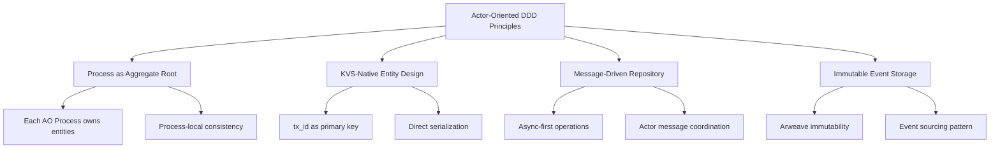
```mermaid
graph TD
    A[Actor-Oriented DDD Principles] --> B[Process as Aggregate Root]
    A --> C[KVS-Native Entity Design]
    A --> D[Message-Driven Repository]
    A --> E[Immutable Event Storage]
    
    B --> B1[Each AO Process owns entities]
    B --> B2[Process-local consistency]
    
    C --> C1[tx_id as primary key]
    C --> C2[Direct serialization]
    
    D --> D1[Async-first operations]
    D --> D2[Actor message coordination]
    
    E --> E1[Arweave immutability]
    E --> E2[Event sourcing pattern]
```

### 1.3 設計の核心的価値

- **Actor境界の明確化**: 各エンティティが所属するActorプロセスが明確
- **KVS最適化**: Arweaveのtx_idベース主キーアクセスパターンに最適化
- **暗号学的整合性**: Umbral PREとShamir Secret Sharingの数学的要件を満たす
- **分散システム対応**: 最終的一貫性とメッセージ駆動アーキテクチャを前提

---

## 2. ドメインエンティティ設計

### 2.1 エンティティ階層アーキテクチャ

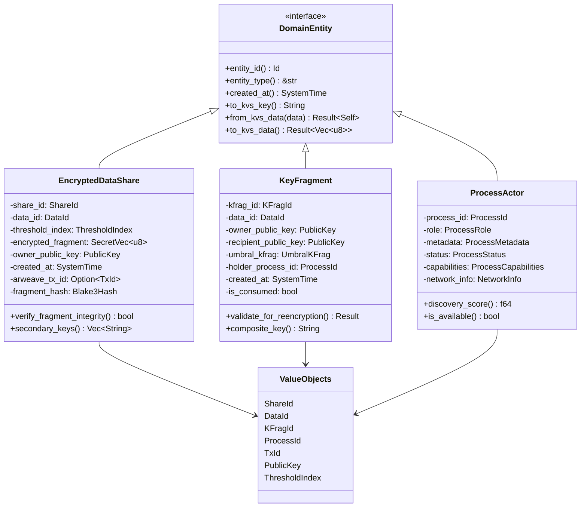
```mermaid
classDiagram
    class DomainEntity {
        <<interface>>
        +entity_id() Id
        +entity_type() &str
        +created_at() SystemTime
        +to_kvs_key() String
        +from_kvs_data(data) Result~Self~
        +to_kvs_data() Result~Vec~u8~~
    }
    
    class EncryptedDataShare {
        -share_id: ShareId
        -data_id: DataId
        -threshold_index: ThresholdIndex
        -encrypted_fragment: SecretVec~u8~
        -owner_public_key: PublicKey
        -created_at: SystemTime
        -arweave_tx_id: Option~TxId~
        -fragment_hash: Blake3Hash
        +verify_fragment_integrity() bool
        +secondary_keys() Vec~String~
    }
    
    class KeyFragment {
        -kfrag_id: KFragId
        -data_id: DataId
        -owner_public_key: PublicKey
        -recipient_public_key: PublicKey
        -umbral_kfrag: UmbralKFrag
        -holder_process_id: ProcessId
        -created_at: SystemTime
        -is_consumed: bool
        +validate_for_reencryption() Result
        +composite_key() String
    }
    
    class ProcessActor {
        -process_id: ProcessId
        -role: ProcessRole
        -metadata: ProcessMetadata
        -status: ProcessStatus
        -capabilities: ProcessCapabilities
        -network_info: NetworkInfo
        +discovery_score() f64
        +is_available() bool
    }
    
    DomainEntity <|-- EncryptedDataShare
    DomainEntity <|-- KeyFragment
    DomainEntity <|-- ProcessActor
    
    class ValueObjects {
        ShareId
        DataId
        KFragId
        ProcessId
        TxId
        PublicKey
        ThresholdIndex
    }
    
    EncryptedDataShare --> ValueObjects
    KeyFragment --> ValueObjects
    ProcessActor --> ValueObjects
```

### 2.2 コアエンティティ設計パターン

#### 2.2.1 DomainEntity基底トレイト

```rust
/// ドメインエンティティの基底トレイト
/// KVS-Native設計でArweaveの特性を最大限活用
pub trait DomainEntity: Serialize + for<'de> Deserialize<'de> + Clone + Send + Sync {
    type Id: Clone + PartialEq + Eq + Hash + Display + Send + Sync;
    
    /// エンティティの一意識別子
    fn entity_id(&self) -> &Self::Id;
    
    /// エンティティタイプ名（KVS名前空間用）
    fn entity_type() -> &'static str;
    
    /// 作成日時
    fn created_at(&self) -> SystemTime;
    
    /// KVSキー生成（型安全な複合キー）
    fn to_kvs_key(&self) -> String {
        format!("{}:{}", Self::entity_type(), self.entity_id())
    }
    
    /// KVSデータからのデシリアライゼーション
    fn from_kvs_data(data: &[u8]) -> Result<Self, SerializationError> {
        serde_json::from_slice(data).map_err(SerializationError::Json)
    }
    
    /// KVSデータへのシリアライゼーション
    fn to_kvs_data(&self) -> Result<Vec<u8>, SerializationError> {
        serde_json::to_vec(self).map_err(SerializationError::Json)
    }
}
```

#### 2.2.2 EncryptedDataShare エンティティ

**設計思想**: Shamir Secret Sharingの数学的要件とArweave不変性を組み合わせた暗号学的エンティティ

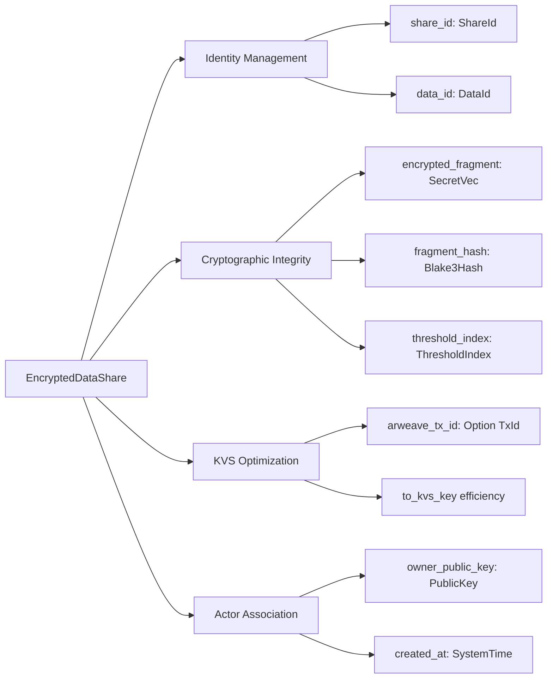
```mermaid
graph LR
    A[EncryptedDataShare] --> B[Identity Management]
    A --> C[Cryptographic Integrity]
    A --> D[KVS Optimization]
    A --> E[Actor Association]
    
    B --> B1[share_id: ShareId]
    B --> B2[data_id: DataId]
    
    C --> C1[encrypted_fragment: SecretVec]
    C --> C2[fragment_hash: Blake3Hash]
    C --> C3[threshold_index: ThresholdIndex]
    
    D --> D1[arweave_tx_id: Option TxId]
    D --> D2[to_kvs_key efficiency]
    
    E --> E1[owner_public_key: PublicKey]
    E --> E2[created_at: SystemTime]
```

**特徴的設計要素**:

- **暗号学的整合性**: Blake3ハッシュによるフラグメント完全性検証
- **ゼロ化対応**: `SecretVec<u8>`による暗号データの安全な管理
- **サイズ制限**: Arweave取引コスト最適化のための8KiB制限
- **セカンダリインデックス**: データ検索効率化のための複合キー生成

#### 2.2.3 KeyFragment エンティティ

**設計思想**: Umbral Proxy Re-Encryptionの鍵フラグメント管理とHolder Process連携

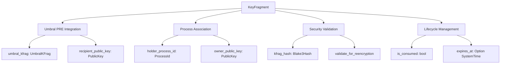
```mermaid
graph TB
    A[KeyFragment] --> B[Umbral PRE Integration]
    A --> C[Process Association]
    A --> D[Security Validation]
    A --> E[Lifecycle Management]
    
    B --> B1[umbral_kfrag: UmbralKFrag]
    B --> B2[recipient_public_key: PublicKey]
    
    C --> C1[holder_process_id: ProcessId]
    C --> C2[owner_public_key: PublicKey]
    
    D --> D1[kfrag_hash: Blake3Hash]
    D --> D2[validate_for_reencryption]
    
    E --> E1[is_consumed: bool]
    E --> E2[expires_at: Option SystemTime]
```

**重要な設計決定**:

- **pk_A保存の根拠**: Umbral PREの暗号学的束縛要件による安全性検証
- **Single-use semantics**: `is_consumed`フラグによるリプレイ攻撃防止
- **複合キー**: `(data_id, owner_pk, recipient_pk)`による効率的検索
- **プロセス分離**: 各Holderが独立してkFragを管理

#### 2.2.4 ProcessActor エンティティ

**設計思想**: AO Processのメタデータ管理とプロセス発見最適化

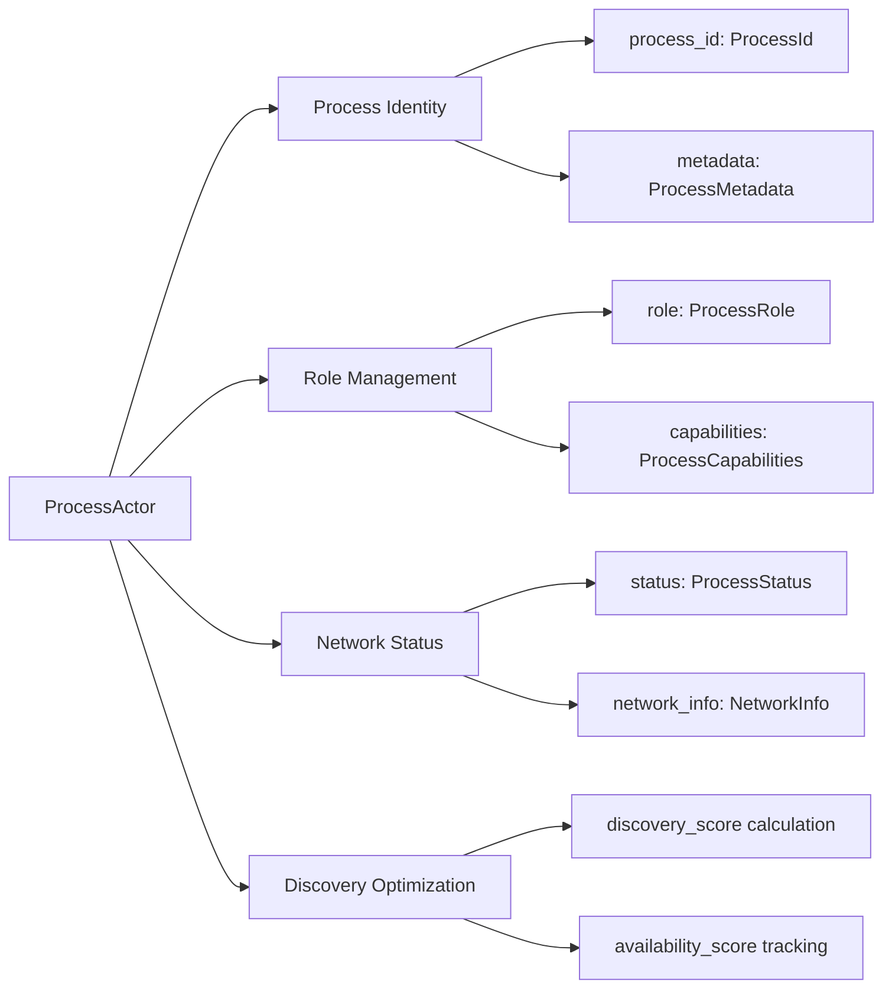
```mermaid
graph LR
    A[ProcessActor] --> B[Process Identity]
    A --> C[Role Management]
    A --> D[Network Status]
    A --> E[Discovery Optimization]
    
    B --> B1[process_id: ProcessId]
    B --> B2[metadata: ProcessMetadata]
    
    C --> C1[role: ProcessRole]
    C --> C2[capabilities: ProcessCapabilities]
    
    D --> D1[status: ProcessStatus]
    D --> D2[network_info: NetworkInfo]
    
    E --> E1[discovery_score calculation]
    E --> E2[availability_score tracking]
```

**アクター発見最適化**:

- **Discovery Score**: レイテンシ、可用性、履歴による動的スコアリング
- **ネットワーク状態追跡**: リアルタイムヘルスチェックと障害検出
- **ロールベース分類**: Owner/Holder/Requesterの明確な責任分離

---

## 3. Repository Interface 設計

### 3.1 Repository アーキテクチャ概要

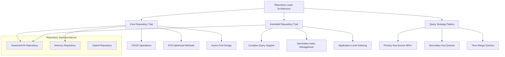
```mermaid
graph TD
    A[Repository Layer Architecture] --> B[Core Repository Trait]
    A --> C[Extended Repository Trait]
    A --> D[Query Strategy Pattern]
    
    B --> B1[CRUD Operations]
    B --> B2[KVS Optimized Methods]
    B --> B3[Async-First Design]
    
    C --> C1[Complex Query Support]
    C --> C2[Secondary Index Management]
    C --> C3[Application-Level Indexing]
    
    D --> D1[Primary Key Access 90%+]
    D --> D2[Secondary Key Queries]
    D --> D3[Time-Range Queries]
    
    subgraph "Repository Implementations"
        E[ArweaveKVS Repository]
        F[Memory Repository]
        G[Hybrid Repository]
    end
    
    B --> E
    B --> F
    C --> E
```

### 3.2 Core Repository Trait

```rust
/// KVS最適化されたリポジトリインターフェース
/// Arweave's immutable storage modelに特化
#[async_trait]
pub trait Repository<E: DomainEntity>: Send + Sync {
    type Error: std::error::Error + Send + Sync + 'static;
    
    /// エンティティ保存とArweave tx_id返却
    async fn store(&self, entity: E) -> Result<TxId, Self::Error>;
    
    /// ドメインIDによる検索
    async fn find_by_id(&self, id: &E::Id) -> Result<Option<E>, Self::Error>;
    
    /// Arweave tx_idによる検索（最速アクセス）
    async fn find_by_tx_id(&self, tx_id: &TxId) -> Result<Option<E>, Self::Error>;
    
    /// 存在確認（軽量オペレーション）
    async fn exists(&self, id: &E::Id) -> Result<bool, Self::Error>;
    
    /// ページネーション対応一覧取得
    async fn list(&self, limit: Option<usize>, offset: Option<usize>) -> Result<Vec<E>, Self::Error>;
    
    /// 件数取得
    async fn count(&self) -> Result<usize, Self::Error>;
}
```

### 3.3 Extended Repository Trait

```rust
/// 複雑クエリ対応拡張リポジトリ
/// アプリケーションレベルインデックスによる効率的検索
#[async_trait]
pub trait ExtendedRepository<E: DomainEntity>: Repository<E> {
    /// セカンダリキーによる検索
    async fn find_by_secondary_key(&self, key: &str) -> Result<Vec<E>, Self::Error>;
    
    /// 複合条件での検索
    async fn find_by_criteria(&self, criteria: QueryCriteria) -> Result<Vec<E>, Self::Error>;
    
    /// 時間範囲検索
    async fn find_by_time_range(
        &self, 
        start: SystemTime, 
        end: SystemTime
    ) -> Result<Vec<E>, Self::Error>;
    
    /// セカンダリインデックス再構築
    async fn rebuild_indices(&self) -> Result<(), Self::Error>;
}
```

### 3.4 Query Strategy パターン

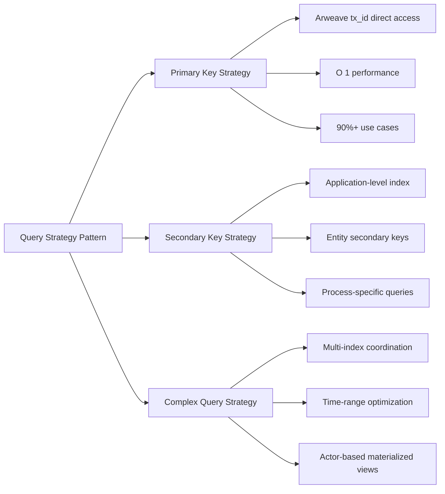
```mermaid
graph LR
    A[Query Strategy Pattern] --> B[Primary Key Strategy]
    A --> C[Secondary Key Strategy]
    A --> D[Complex Query Strategy]
    
    B --> B1[Arweave tx_id direct access]
    B --> B2[O 1 performance]
    B --> B3[90%+ use cases]
    
    C --> C1[Application-level index]
    C --> C2[Entity secondary keys]
    C --> C3[Process-specific queries]
    
    D --> D1[Multi-index coordination]
    D --> D2[Time-range optimization]
    D --> D3[Actor-based materialized views]
```

---

## 4. Repository Implementation 設計

### 4.1 ArweaveKVS Repository アーキテクチャ

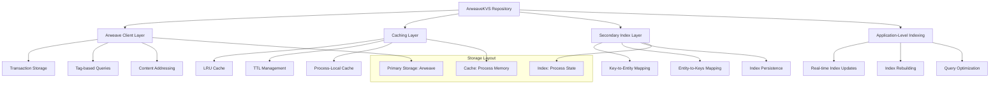
```mermaid
graph TB
    A[ArweaveKVS Repository] --> B[Arweave Client Layer]
    A --> C[Caching Layer]
    A --> D[Secondary Index Layer]
    A --> E[Application-Level Indexing]
    
    B --> B1[Transaction Storage]
    B --> B2[Tag-based Queries]
    B --> B3[Content Addressing]
    
    C --> C1[LRU Cache]
    C --> C2[TTL Management]
    C --> C3[Process-Local Cache]
    
    D --> D1[Key-to-Entity Mapping]
    D --> D2[Entity-to-Keys Mapping]
    D --> D3[Index Persistence]
    
    E --> E1[Real-time Index Updates]
    E --> E2[Index Rebuilding]
    E --> E3[Query Optimization]
    
    subgraph "Storage Layout"
        F[Primary Storage: Arweave]
        G[Cache: Process Memory]
        H[Index: Process State]
    end
    
    B --> F
    C --> G
    D --> H
```

### 4.2 Arweave Client Interface

```rust
/// Arweave操作の抽象化インターフェース
#[async_trait]
pub trait ArweaveClient: Send + Sync {
    /// データ保存とtx_id取得
    async fn store_data(
        &self, 
        data: Vec<u8>, 
        tags: HashMap<String, String>
    ) -> Result<TxId, ArweaveError>;
    
    /// tx_idによるデータ取得
    async fn get_data(&self, tx_id: &TxId) -> Result<Vec<u8>, ArweaveError>;
    
    /// トランザクション存在確認
    async fn exists(&self, tx_id: &TxId) -> Result<bool, ArweaveError>;
    
    /// タグベースクエリ
    async fn query_by_tags(
        &self, 
        tags: HashMap<String, String>
    ) -> Result<Vec<TxId>, ArweaveError>;
}
```

### 4.3 Secondary Index 実装戦略

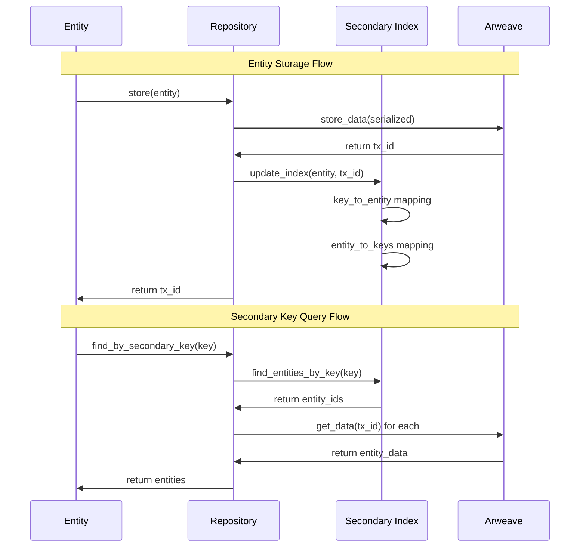
```mermaid
sequenceDiagram
    participant E as Entity
    participant R as Repository
    participant I as Secondary Index
    participant A as Arweave
    
    Note over E,A: Entity Storage Flow
    E->>R: store(entity)
    R->>A: store_data(serialized)
    A->>R: return tx_id
    R->>I: update_index(entity, tx_id)
    I->>I: key_to_entity mapping
    I->>I: entity_to_keys mapping
    R->>E: return tx_id
    
    Note over E,A: Secondary Key Query Flow
    E->>R: find_by_secondary_key(key)
    R->>I: find_entities_by_key(key)
    I->>R: return entity_ids
    R->>A: get_data(tx_id) for each
    A->>R: return entity_data
    R->>E: return entities
```

### 4.4 Application-Level Indexing

```rust
/// アプリケーションレベルセカンダリインデックス
#[derive(Debug, Clone, Serialize, Deserialize)]
struct SecondaryIndex {
    /// セカンダリキー -> エンティティID マッピング
    key_to_entity: HashMap<String, Vec<String>>,
    
    /// エンティティID -> セカンダリキー マッピング
    entity_to_keys: HashMap<String, Vec<String>>,
    
    /// 最終更新タイムスタンプ
    last_updated: SystemTime,
}

impl SecondaryIndex {
    /// エンティティとそのセカンダリキーを追加
    fn add_entity(&mut self, entity_id: String, secondary_keys: Vec<String>) {
        // 既存エントリの削除
        self.remove_entity(&entity_id);
        
        // 新しいエントリの追加
        for key in &secondary_keys {
            self.key_to_entity
                .entry(key.clone())
                .or_insert_with(Vec::new)
                .push(entity_id.clone());
        }
        
        self.entity_to_keys.insert(entity_id, secondary_keys);
        self.last_updated = SystemTime::now();
    }
    
    /// セカンダリキーによるエンティティ検索
    fn find_by_key(&self, key: &str) -> Vec<String> {
        self.key_to_entity
            .get(key)
            .cloned()
            .unwrap_or_default()
    }
}
```

---

## 5. エンティティ特化Repository設計

### 5.1 EncryptedDataShare Repository

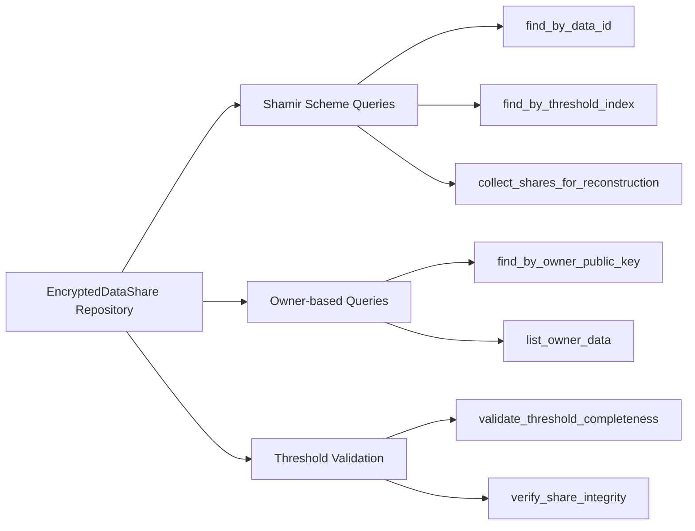
```mermaid
graph LR
    A[EncryptedDataShare Repository] --> B[Shamir Scheme Queries]
    A --> C[Owner-based Queries]
    A --> D[Threshold Validation]
    
    B --> B1[find_by_data_id]
    B --> B2[find_by_threshold_index]
    B --> B3[collect_shares_for_reconstruction]
    
    C --> C1[find_by_owner_public_key]
    C --> C2[list_owner_data]
    
    D --> D1[validate_threshold_completeness]
    D --> D2[verify_share_integrity]
```

**特化メソッド**:

```rust
impl EncryptedDataShareRepository {
    /// データIDによる全シェア取得（Shamir再構築用）
    async fn find_shares_by_data_id(&self, data_id: &DataId) -> Result<Vec<EncryptedDataShare>, Self::Error>;
    
    /// 閾値インデックスによる検索（重複検証用）
    async fn find_by_threshold_index(
        &self, 
        data_id: &DataId, 
        threshold_index: ThresholdIndex
    ) -> Result<Option<EncryptedDataShare>, Self::Error>;
    
    /// オーナーの全データシェア取得
    async fn find_by_owner(&self, owner_pk: &PublicKey) -> Result<Vec<EncryptedDataShare>, Self::Error>;
    
    /// 閾値完全性検証（k-of-n要件チェック）
    async fn validate_threshold_completeness(
        &self, 
        data_id: &DataId, 
        required_threshold: usize
    ) -> Result<bool, Self::Error>;
}
```

### 5.2 KeyFragment Repository

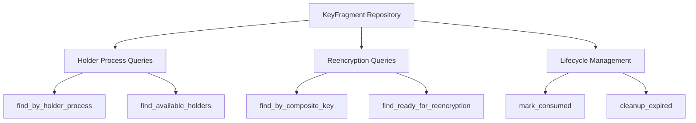
```mermaid
graph TB
    A[KeyFragment Repository] --> B[Holder Process Queries]
    A --> C[Reencryption Queries]
    A --> D[Lifecycle Management]
    
    B --> B1[find_by_holder_process]
    B --> B2[find_available_holders]
    
    C --> C1[find_by_composite_key]
    C --> C2[find_ready_for_reencryption]
    
    D --> D1[mark_consumed]
    D --> D2[cleanup_expired]
```

**特化メソッド**:

```rust
impl KeyFragmentRepository {
    /// 複合キー検索（data_id + owner_pk + recipient_pk）
    async fn find_by_composite_key(
        &self,
        data_id: &DataId,
        owner_pk: &PublicKey,
        recipient_pk: &PublicKey
    ) -> Result<Option<KeyFragment>, Self::Error>;
    
    /// Holder Processの利用可能kFrag一覧
    async fn find_available_by_holder(
        &self, 
        holder_id: &ProcessId
    ) -> Result<Vec<KeyFragment>, Self::Error>;
    
    /// 再暗号化準備完了kFrag検索
    async fn find_ready_for_reencryption(
        &self,
        data_id: &DataId,
        owner_pk: &PublicKey,
        recipient_pk: &PublicKey
    ) -> Result<Vec<KeyFragment>, Self::Error>;
    
    /// kFrag消費マーキング（single-use enforcement）
    async fn mark_consumed(&self, kfrag_id: &KFragId) -> Result<(), Self::Error>;
    
    /// 期限切れkFragのクリーンアップ
    async fn cleanup_expired(&self) -> Result<usize, Self::Error>;
}
```

### 5.3 ProcessActor Repository

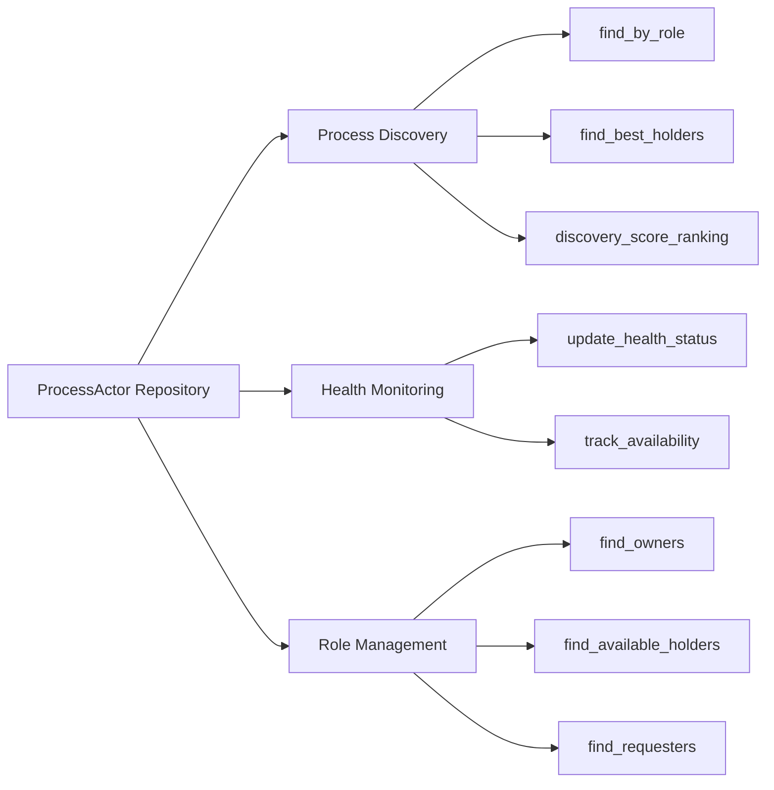
```mermaid
graph LR
    A[ProcessActor Repository] --> B[Process Discovery]
    A --> C[Health Monitoring]
    A --> D[Role Management]
    
    B --> B1[find_by_role]
    B --> B2[find_best_holders]
    B --> B3[discovery_score_ranking]
    
    C --> C1[update_health_status]
    C --> C2[track_availability]
    
    D --> D1[find_owners]
    D --> D2[find_available_holders]
    D --> D3[find_requesters]
```

**特化メソッド**:

```rust
impl ProcessActorRepository {
    /// ロール別プロセス検索
    async fn find_by_role(&self, role: ProcessRole) -> Result<Vec<ProcessActor>, Self::Error>;
    
    /// k-of-n閾値用最適Holder選択
    async fn select_best_holders(
        &self, 
        k: usize, 
        n: usize
    ) -> Result<Vec<ProcessActor>, Self::Error>;
    
    /// ディスカバリスコア順プロセス取得
    async fn find_ranked_by_discovery_score(
        &self,
        role: ProcessRole,
        limit: usize
    ) -> Result<Vec<ProcessActor>, Self::Error>;
    
    /// プロセスヘルス状態更新
    async fn update_health_status(
        &self,
        process_id: &ProcessId,
        status: ProcessStatus
    ) -> Result<(), Self::Error>;
    
    /// 利用可能プロセス率取得
    async fn calculate_availability_rate(&self, role: ProcessRole) -> Result<f64, Self::Error>;
}
```

---

## 6. KVS最適化パターン

### 6.1 Primary Key Access Pattern

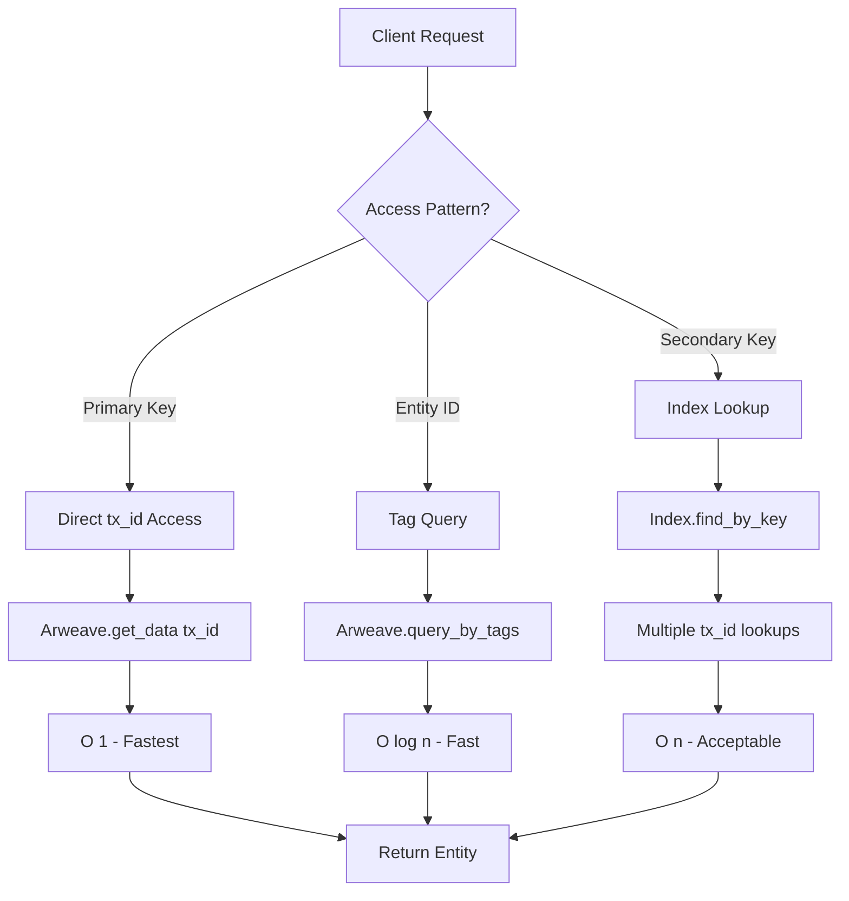
```mermaid
flowchart TD
    A[Client Request] --> B{Access Pattern?}
    
    B -->|Primary Key| C[Direct tx_id Access]
    B -->|Entity ID| D[Tag Query]
    B -->|Secondary Key| E[Index Lookup]
    
    C --> C1[Arweave.get_data tx_id]
    C1 --> C2[O 1 - Fastest]
    
    D --> D1[Arweave.query_by_tags]
    D1 --> D2[O log n - Fast]
    
    E --> E1[Index.find_by_key]
    E1 --> E2[Multiple tx_id lookups]
    E2 --> E3[O n - Acceptable]
    
    C2 --> F[Return Entity]
    D2 --> F
    E3 --> F
```

### 6.2 Batch Operations Pattern

```rust
/// バッチ操作による効率化
impl ArweaveKVSRepository<E> {
    /// 複数エンティティの並列保存
    async fn store_batch(&self, entities: Vec<E>) -> Result<Vec<TxId>, Self::Error> {
        let futures = entities.into_iter().map(|entity| {
            let client = self.client.clone();
            async move {
                let data = entity.to_kvs_data()?;
                let tags = self.create_tags(&entity);
                client.store_data(data, tags).await
            }
        });
        
        // 並列実行
        futures::future::try_join_all(futures).await
    }
    
    /// 複数tx_idによる並列取得
    async fn find_batch_by_tx_ids(&self, tx_ids: Vec<TxId>) -> Result<Vec<E>, Self::Error> {
        let futures = tx_ids.into_iter().map(|tx_id| {
            let client = self.client.clone();
            async move {
                let data = client.get_data(&tx_id).await?;
                E::from_kvs_data(&data)
            }
        });
        
        futures::future::try_join_all(futures).await
    }
}
```

### 6.3 Cache Strategy Pattern

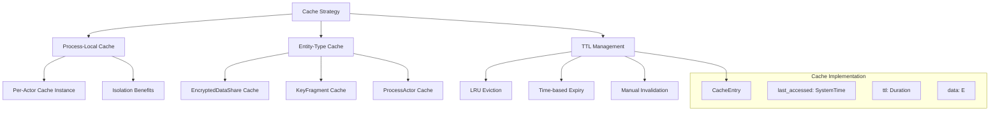
```mermaid
graph TB
    A[Cache Strategy] --> B[Process-Local Cache]
    A --> C[Entity-Type Cache]
    A --> D[TTL Management]
    
    B --> B1[Per-Actor Cache Instance]
    B --> B2[Isolation Benefits]
    
    C --> C1[EncryptedDataShare Cache]
    C --> C2[KeyFragment Cache]
    C --> C3[ProcessActor Cache]
    
    D --> D1[LRU Eviction]
    D --> D2[Time-based Expiry]
    D --> D3[Manual Invalidation]
    
    subgraph "Cache Implementation"
        E[CacheEntry]
        F[last_accessed: SystemTime]
        G[ttl: Duration]
        H[data: E]
    end
    
    D --> E
```

---

## 7. Actor統合パターン

### 7.1 Process-Scoped Repository

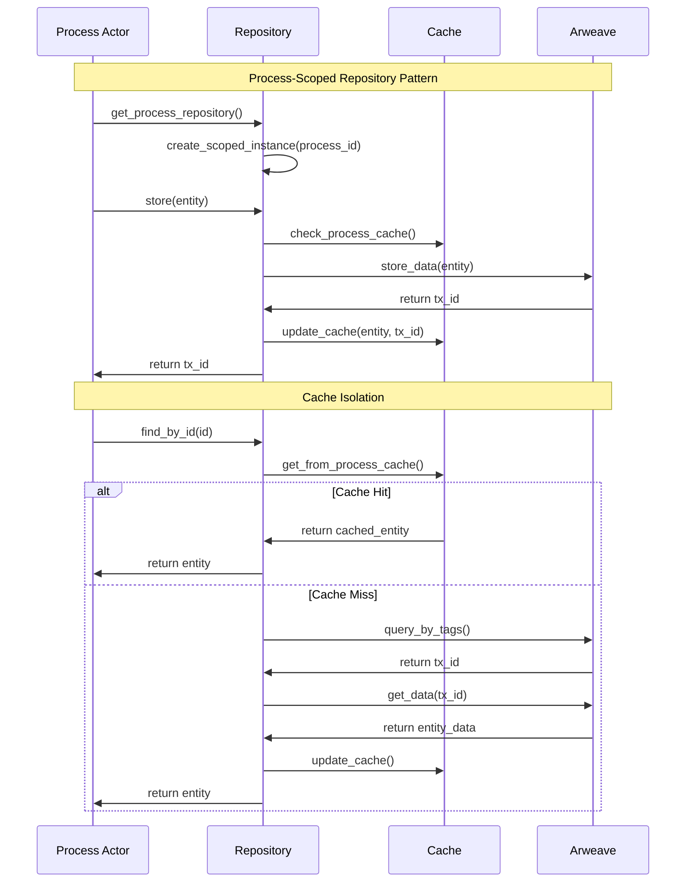
```mermaid
sequenceDiagram
    participant P as Process Actor
    participant R as Repository
    participant C as Cache
    participant A as Arweave
    
    Note over P,A: Process-Scoped Repository Pattern
    P->>R: get_process_repository()
    R->>R: create_scoped_instance(process_id)
    
    P->>R: store(entity)
    R->>C: check_process_cache()
    R->>A: store_data(entity)
    A->>R: return tx_id
    R->>C: update_cache(entity, tx_id)
    R->>P: return tx_id
    
    Note over P,A: Cache Isolation
    P->>R: find_by_id(id)
    R->>C: get_from_process_cache()
    alt Cache Hit
        C->>R: return cached_entity
        R->>P: return entity
    else Cache Miss
        R->>A: query_by_tags()
        A->>R: return tx_id
        R->>A: get_data(tx_id)
        A->>R: return entity_data
        R->>C: update_cache()
        R->>P: return entity
    end
```

### 7.2 Message-Driven Repository Coordination

```rust
/// Actorメッセージとの統合パターン
pub struct MessageDrivenRepository<E: DomainEntity> {
    repository: Arc<ArweaveKVSRepository<E>>,
    message_bus: Arc<dyn MessageBus>,
    process_id: ProcessId,
}

impl<E: DomainEntity> MessageDrivenRepository<E> {
    /// エンティティ保存とドメインイベント発行
    pub async fn store_and_notify(&self, entity: E) -> Result<TxId, RepositoryError> {
        // エンティティ保存
        let tx_id = self.repository.store(entity.clone()).await?;
        
        // ドメインイベント作成
        let event = DomainEvent::EntityStored {
            entity_type: E::entity_type().to_string(),
            entity_id: entity.entity_id().to_string(),
            tx_id: tx_id.clone(),
            process_id: self.process_id.clone(),
            timestamp: SystemTime::now(),
        };
        
        // 関心のあるActorに通知
        self.message_bus.publish_event(event).await?;
        
        Ok(tx_id)
    }
    
    /// 他Actorからのイベント受信によるキャッシュ更新
    pub async fn handle_entity_stored_event(&self, event: EntityStoredEvent) -> Result<(), RepositoryError> {
        if event.entity_type == E::entity_type() {
            // リモートエンティティをキャッシュに反映
            if let Ok(Some(entity)) = self.repository.find_by_tx_id(&event.tx_id).await {
                // ローカルキャッシュ更新
                self.repository.update_cache_from_remote(entity).await;
            }
        }
        
        Ok(())
    }
}
```

---

## 8. 実装ロードマップ

### 8.1 Phase 1: Core Infrastructure (Week 1-2)

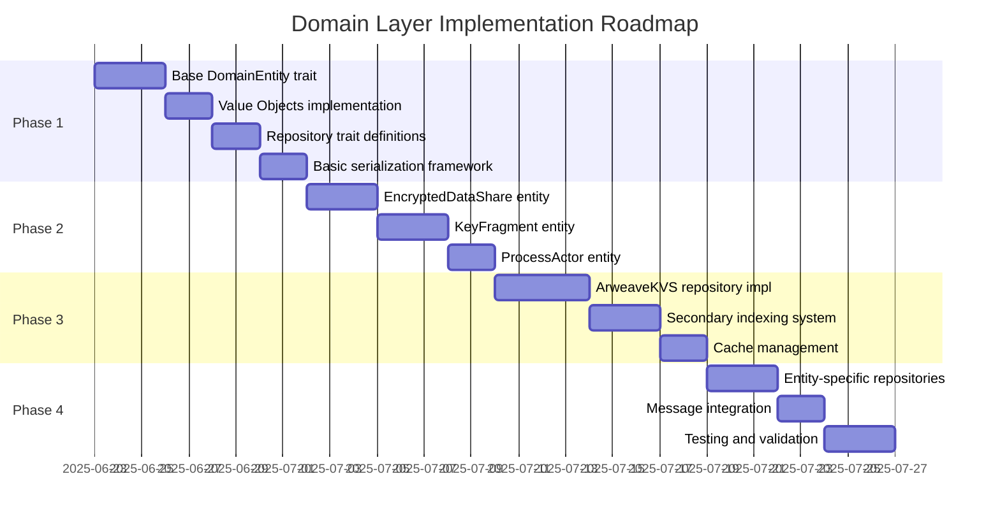
```mermaid
gantt
    title Domain Layer Implementation Roadmap
    dateFormat  YYYY-MM-DD
    section Phase 1
    Base DomainEntity trait           :a1, 2025-06-23, 3d
    Value Objects implementation      :a2, after a1, 2d
    Repository trait definitions      :a3, after a2, 2d
    Basic serialization framework    :a4, after a3, 2d
    
    section Phase 2
    EncryptedDataShare entity         :b1, after a4, 3d
    KeyFragment entity               :b2, after b1, 3d
    ProcessActor entity              :b3, after b2, 2d
    
    section Phase 3
    ArweaveKVS repository impl       :c1, after b3, 4d
    Secondary indexing system        :c2, after c1, 3d
    Cache management                 :c3, after c2, 2d
    
    section Phase 4
    Entity-specific repositories     :d1, after c3, 3d
    Message integration             :d2, after d1, 2d
    Testing and validation          :d3, after d2, 3d
```

### 8.2 Implementation Priorities

1. **Week 1-2: Foundation**
   - DomainEntity trait と Value Objects
   - Repository trait 定義
   - 基本シリアライゼーション

2. **Week 3-4: Core Entities**
   - EncryptedDataShare 実装
   - KeyFragment 実装
   - ProcessActor 実装

3. **Week 5-6: Repository Layer**
   - ArweaveKVS repository
   - Secondary indexing
   - Cache management

4. **Week 7-8: Integration & Testing**
   - Actor message integration
   - Comprehensive testing
   - Performance optimization

### 8.3 Success Metrics

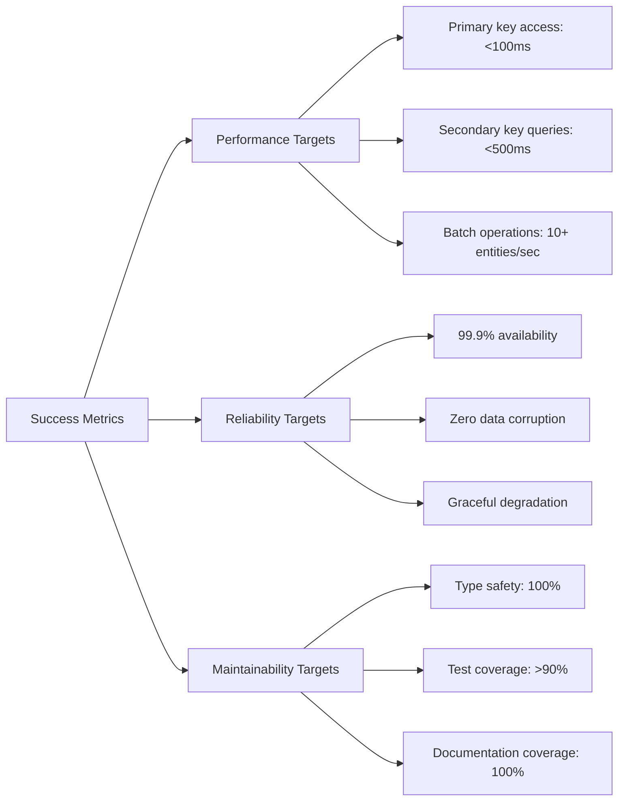
```mermaid
graph LR
    A[Success Metrics] --> B[Performance Targets]
    A --> C[Reliability Targets]
    A --> D[Maintainability Targets]
    
    B --> B1[Primary key access: <100ms]
    B --> B2[Secondary key queries: <500ms]
    B --> B3[Batch operations: 10+ entities/sec]
    
    C --> C1[99.9% availability]
    C --> C2[Zero data corruption]
    C --> C3[Graceful degradation]
    
    D --> D1[Type safety: 100%]
    D --> D2[Test coverage: >90%]
    D --> D3[Documentation coverage: 100%]
```

---

## 9. セキュリティとコンプライアンス

### 9.1 Cryptographic Data Handling

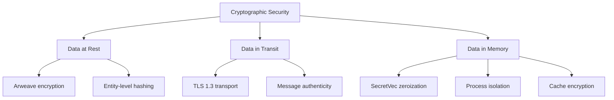
```mermaid
graph TB
    A[Cryptographic Security] --> B[Data at Rest]
    A --> C[Data in Transit]
    A --> D[Data in Memory]
    
    B --> B1[Arweave encryption]
    B --> B2[Entity-level hashing]
    
    C --> C1[TLS 1.3 transport]
    C --> C2[Message authenticity]
    
    D --> D1[SecretVec zeroization]
    D --> D2[Process isolation]
    D --> D3[Cache encryption]
```

### 9.2 Access Control Integration

```rust
/// エンティティレベルアクセス制御
pub trait AccessControlledEntity: DomainEntity {
    /// アクセス権限チェック
    fn check_access_permission(
        &self, 
        requesting_process: &ProcessId,
        operation: AccessOperation
    ) -> Result<(), AccessDenied>;
    
    /// 所有者検証
    fn verify_ownership(&self, owner_pk: &PublicKey) -> bool;
    
    /// 読み取り権限確認
    fn can_read(&self, requester: &ProcessId) -> bool;
}

impl AccessControlledEntity for EncryptedDataShare {
    fn check_access_permission(
        &self,
        requesting_process: &ProcessId,
        operation: AccessOperation
    ) -> Result<(), AccessDenied> {
        match operation {
            AccessOperation::Read => {
                // Owner process または authorized requester のみ
                if self.is_owner_process(requesting_process) || 
                   self.is_authorized_requester(requesting_process) {
                    Ok(())
                } else {
                    Err(AccessDenied::InsufficientPermissions)
                }
            },
            AccessOperation::Modify => {
                // Owner process のみ
                if self.is_owner_process(requesting_process) {
                    Ok(())
                } else {
                    Err(AccessDenied::OwnerOnly)
                }
            }
        }
    }
}
```

---

## 10. 運用とモニタリング

### 10.1 Repository Health Monitoring

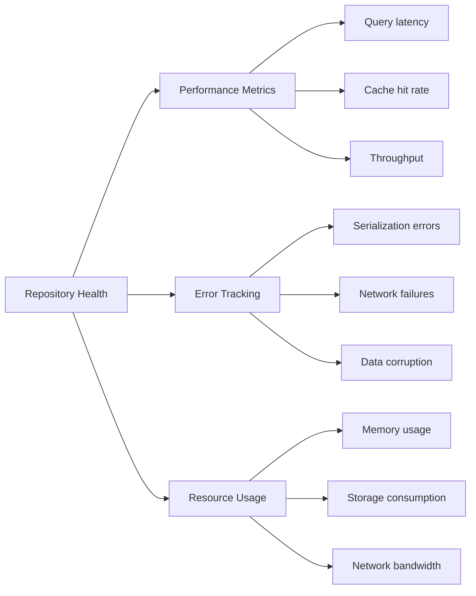
```mermaid
graph LR
    A[Repository Health] --> B[Performance Metrics]
    A --> C[Error Tracking]
    A --> D[Resource Usage]
    
    B --> B1[Query latency]
    B --> B2[Cache hit rate]
    B --> B3[Throughput]
    
    C --> C1[Serialization errors]
    C --> C2[Network failures]
    C --> C3[Data corruption]
    
    D --> D1[Memory usage]
    D --> D2[Storage consumption]
    D --> D3[Network bandwidth]
```

### 10.2 Debugging and Observability

```rust
/// リポジトリ操作の観測可能性
pub struct RepositoryMetrics {
    pub operation_latency: Histogram,
    pub cache_hit_rate: Gauge,
    pub error_count: Counter,
    pub entity_count: Gauge,
}

impl<E: DomainEntity> ArweaveKVSRepository<E> {
    async fn store_with_metrics(&self, entity: E) -> Result<TxId, Self::Error> {
        let start = Instant::now();
        
        let result = self.store(entity).await;
        
        // メトリクス記録
        self.metrics.operation_latency
            .with_label_values(&["store", E::entity_type()])
            .observe(start.elapsed().as_secs_f64());
            
        if result.is_ok() {
            self.metrics.entity_count
                .with_label_values(&[E::entity_type()])
                .inc();
        } else {
            self.metrics.error_count
                .with_label_values(&["store", E::entity_type()])
                .inc();
        }
        
        result
    }
}
```

---

## 11. 結論と次のステップ

### 11.1 設計の核心価値

本ドメイン層設計は以下の核心価値を実現します：

1. **Actor-Native**: AO Processの特性を最大限活用
2. **KVS-Optimized**: Arweaveの不変性とパフォーマンス特性に最適化
3. **Crypto-Aware**: Umbral PREとShamir Secret Sharingの要件を満たす
4. **Scalable**: 水平スケールとプロセス分離を前提とした設計

### 11.2 Decision Records

| 設計決定 | 根拠 | トレードオフ |
|---------|------|-------------|
| tx_id as Primary Key | Arweave不変性活用、O(1)アクセス | スキーマ変更の複雑性 |
| Application-Level Indexing | RDBSオーバーヘッド回避 | インデックス管理の責任 |
| Process-Scoped Repository | Actor分離、キャッシュ効率 | メモリ使用量増加 |
| Message-Driven Coordination | 非同期ファースト、結果整合性 | 即座整合性の放棄 |

### 11.3 実装開始準備

具体的なドメイン層の設計の概観を決定します：

1. **Core Entity Implementation**: Week 1-2
2. **Repository Interface Definition**: Week 3-4  
3. **ArweaveKVS Implementation**: Week 5-6
4. **Integration Testing**: Week 7-8

---

*本設計ドキュメントは、FORMIXプロジェクトのActor-Oriented Domain-Driven Designアーキテクチャの核心となるドメイン層の詳細仕様です。実装チームとのレビューを経て、プロトタイプ開発に移行します。*

**Document Status**: Design Review Ready  
**Next Phase**: Team Review → Prototype Implementation  
**Target Decision**: Week 2 after prototype validation