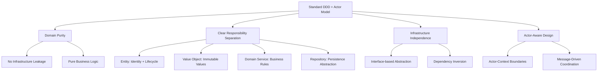
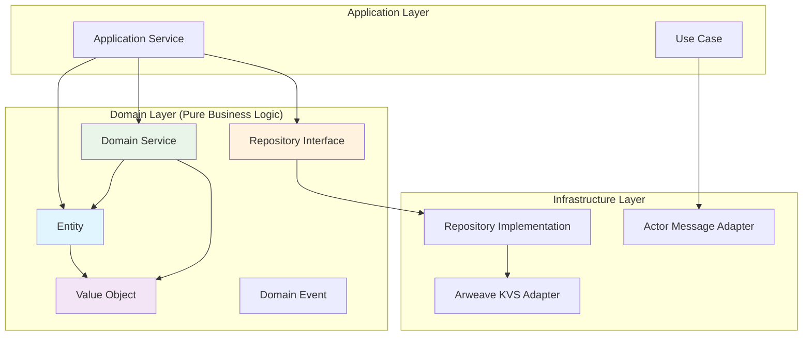
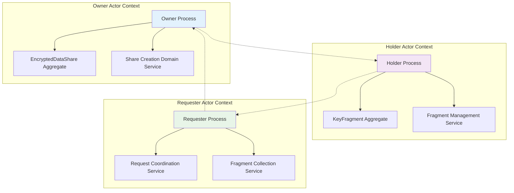

# Actor-Oriented DDD ドメイン層設計（改訂版）: TERASOLUNA準拠のドメインアーキテクチャ

## 1. エグゼクティブサマリー

### 1.1 設計方針の見直し

TERASOLUNAガイドラインを参考に、既存のActor-Oriented DDD設計を**標準的なDDDアプローチ**に準拠する形で見直しました。特に以下の点を重視します：

1. **ドメインオブジェクトの純粋性**: インフラストラクチャ層の詳細（KVS、Arweave）からの完全分離
2. **責務の明確な分離**: Entity、Value Object、Domain Service、Repository Interfaceの適切な役割分担
3. **標準的DDD実装パターン**: TERASOLUNAで推奨される実装アプローチの採用
4. **Actor Modelとの適切な統合**: 標準DDDを損なわずにActor特性を活用

### 1.2 改訂された設計原則



---

## 2. ドメインオブジェクト設計（TERASOLUNA準拠）

### 2.1 ドメイン層アーキテクチャ概要



### 2.2 Entity設計（純粋なドメインモデル）

#### 2.2.1 EncryptedDataShare Entity

**設計方針**: 暗号学的ビジネスルールに特化した純粋なドメインエンティティ

```rust
/// 暗号化データシェアエンティティ
/// Shamir Secret Sharingのビジネスルールを表現
#[derive(Debug, Clone, PartialEq)]
pub struct EncryptedDataShare {
    /// エンティティ識別子
    id: ShareId,
    
    /// データグループ識別子
    data_id: DataId,
    
    /// Shamir閾値インデックス（1からn）
    threshold_index: ThresholdIndex,
    
    /// 暗号化されたフラグメント
    encrypted_fragment: EncryptedFragment,
    
    /// データオーナーの公開鍵
    owner_public_key: OwnerPublicKey,
    
    /// フラグメントの整合性ハッシュ
    integrity_hash: IntegrityHash,
    
    /// 作成日時
    created_at: CreatedAt,
    
    /// エンティティのバージョン（楽観ロック用）
    version: Version,
}

impl EncryptedDataShare {
    /// ファクトリメソッド：新しいデータシェア作成
    pub fn create(
        data_id: DataId,
        threshold_index: ThresholdIndex,
        encrypted_fragment: EncryptedFragment,
        owner_public_key: OwnerPublicKey,
    ) -> Result<Self, DomainError> {
        // ビジネスルール検証
        Self::validate_fragment_size(&encrypted_fragment)?;
        Self::validate_threshold_index(&threshold_index)?;
        
        let integrity_hash = IntegrityHash::calculate(&encrypted_fragment);
        
        Ok(Self {
            id: ShareId::generate(),
            data_id,
            threshold_index,
            encrypted_fragment,
            owner_public_key,
            integrity_hash,
            created_at: CreatedAt::now(),
            version: Version::initial(),
        })
    }
    
    /// ビジネスルール：フラグメント整合性検証
    pub fn verify_integrity(&self) -> Result<(), DomainError> {
        if !self.integrity_hash.verify(&self.encrypted_fragment) {
            return Err(DomainError::IntegrityViolation);
        }
        Ok(())
    }
    
    /// ビジネスルール：閾値要件チェック
    pub fn can_participate_in_reconstruction(&self, total_shares: usize) -> bool {
        self.threshold_index.value() <= total_shares
    }
    
    /// ドメインイベント：シェア作成イベント
    pub fn share_created_event(&self) -> ShareCreatedEvent {
        ShareCreatedEvent {
            share_id: self.id.clone(),
            data_id: self.data_id.clone(),
            owner_public_key: self.owner_public_key.clone(),
            created_at: self.created_at,
        }
    }
    
    // プライベートなビジネスルール検証
    fn validate_fragment_size(fragment: &EncryptedFragment) -> Result<(), DomainError> {
        if fragment.size_bytes() > Self::MAX_FRAGMENT_SIZE {
            return Err(DomainError::FragmentTooLarge);
        }
        if fragment.is_empty() {
            return Err(DomainError::EmptyFragment);
        }
        Ok(())
    }
    
    fn validate_threshold_index(index: &ThresholdIndex) -> Result<(), DomainError> {
        if index.value() == 0 {
            return Err(DomainError::InvalidThresholdIndex);
        }
        Ok(())
    }
    
    const MAX_FRAGMENT_SIZE: usize = 8192; // 8KB
}

// Getterメソッド
impl EncryptedDataShare {
    pub fn id(&self) -> &ShareId { &self.id }
    pub fn data_id(&self) -> &DataId { &self.data_id }
    pub fn threshold_index(&self) -> &ThresholdIndex { &self.threshold_index }
    pub fn owner_public_key(&self) -> &OwnerPublicKey { &self.owner_public_key }
    pub fn created_at(&self) -> CreatedAt { self.created_at }
    pub fn version(&self) -> Version { self.version }
}
```

#### 2.2.2 KeyFragment Entity

**設計方針**: Umbral Proxy Re-Encryptionのビジネスルールを表現

```rust
/// 鍵フラグメントエンティティ
/// Umbral PREプロトコルのビジネスルールを表現
#[derive(Debug, Clone, PartialEq)]
pub struct KeyFragment {
    /// エンティティ識別子
    id: KeyFragmentId,
    
    /// 関連データ識別子
    data_id: DataId,
    
    /// オーナー公開鍵
    owner_public_key: OwnerPublicKey,
    
    /// 受信者公開鍵
    recipient_public_key: RecipientPublicKey,
    
    /// Umbral鍵フラグメント
    umbral_fragment: UmbralFragment,
    
    /// 割り当てられたHolder Process
    assigned_holder: HolderId,
    
    /// フラグメントステータス
    status: FragmentStatus,
    
    /// 有効期限
    expires_at: Option<ExpirationTime>,
    
    /// 作成日時
    created_at: CreatedAt,
    
    /// バージョン
    version: Version,
}

impl KeyFragment {
    /// ファクトリメソッド：新しい鍵フラグメント作成
    pub fn create(
        data_id: DataId,
        owner_public_key: OwnerPublicKey,
        recipient_public_key: RecipientPublicKey,
        umbral_fragment: UmbralFragment,
        assigned_holder: HolderId,
        expires_at: Option<ExpirationTime>,
    ) -> Result<Self, DomainError> {
        // ビジネスルール検証
        Self::validate_key_binding(&owner_public_key, &recipient_public_key, &umbral_fragment)?;
        Self::validate_expiration(&expires_at)?;
        
        Ok(Self {
            id: KeyFragmentId::generate(),
            data_id,
            owner_public_key,
            recipient_public_key,
            umbral_fragment,
            assigned_holder,
            status: FragmentStatus::Available,
            expires_at,
            created_at: CreatedAt::now(),
            version: Version::initial(),
        })
    }
    
    /// ビジネスルール：再暗号化可能性チェック
    pub fn can_reencrypt(&self) -> Result<(), DomainError> {
        match self.status {
            FragmentStatus::Available => {},
            FragmentStatus::Consumed => return Err(DomainError::FragmentAlreadyConsumed),
            FragmentStatus::Expired => return Err(DomainError::FragmentExpired),
        }
        
        if let Some(expiry) = self.expires_at {
            if expiry.is_past() {
                return Err(DomainError::FragmentExpired);
            }
        }
        
        Ok(())
    }
    
    /// ビジネス操作：フラグメント消費（Single-use enforcement）
    pub fn consume(mut self) -> Result<Self, DomainError> {
        self.can_reencrypt()?;
        self.status = FragmentStatus::Consumed;
        self.version = self.version.increment();
        Ok(self)
    }
    
    /// ビジネスルール：暗号学的束縛検証
    pub fn verify_cryptographic_binding(&self) -> Result<(), DomainError> {
        if !self.umbral_fragment.verify_binding(&self.owner_public_key, &self.recipient_public_key) {
            return Err(DomainError::CryptographicBindingFailure);
        }
        Ok(())
    }
    
    /// ドメインイベント：フラグメント作成イベント
    pub fn fragment_created_event(&self) -> FragmentCreatedEvent {
        FragmentCreatedEvent {
            fragment_id: self.id.clone(),
            data_id: self.data_id.clone(),
            assigned_holder: self.assigned_holder.clone(),
            created_at: self.created_at,
        }
    }
    
    // プライベートなビジネスルール検証
    fn validate_key_binding(
        owner_pk: &OwnerPublicKey,
        recipient_pk: &RecipientPublicKey,
        fragment: &UmbralFragment
    ) -> Result<(), DomainError> {
        if !fragment.is_valid_for_keys(owner_pk, recipient_pk) {
            return Err(DomainError::InvalidKeyBinding);
        }
        Ok(())
    }
    
    fn validate_expiration(expires_at: &Option<ExpirationTime>) -> Result<(), DomainError> {
        if let Some(expiry) = expires_at {
            if expiry.is_past() {
                return Err(DomainError::ExpirationInPast);
            }
        }
        Ok(())
    }
}

/// フラグメントステータス
#[derive(Debug, Clone, PartialEq)]
pub enum FragmentStatus {
    Available,
    Consumed,
    Expired,
}
```

#### 2.2.3 ProcessActor Entity

**設計方針**: AO Processのドメインメタデータを表現（インフラ詳細は排除）

```rust
/// プロセスアクターエンティティ
/// AO Processのドメイン的特性を表現
#[derive(Debug, Clone, PartialEq)]
pub struct ProcessActor {
    /// エンティティ識別子
    id: ProcessId,
    
    /// プロセスロール
    role: ProcessRole,
    
    /// プロセス名
    name: ProcessName,
    
    /// 処理能力仕様
    capabilities: ProcessCapabilities,
    
    /// 信頼性メトリクス
    reliability: ReliabilityMetrics,
    
    /// 作成日時
    created_at: CreatedAt,
    
    /// バージョン
    version: Version,
}

impl ProcessActor {
    /// ファクトリメソッド：新しいプロセス作成
    pub fn spawn(
        role: ProcessRole,
        name: ProcessName,
        capabilities: ProcessCapabilities,
    ) -> Self {
        Self {
            id: ProcessId::generate(),
            role,
            name,
            capabilities,
            reliability: ReliabilityMetrics::initial(),
            created_at: CreatedAt::now(),
            version: Version::initial(),
        }
    }
    
    /// ビジネスルール：Holder選択適格性
    pub fn is_eligible_as_holder(&self, requirements: &HolderRequirements) -> bool {
        self.role == ProcessRole::Holder &&
        self.capabilities.meets_requirements(requirements) &&
        self.reliability.is_sufficient()
    }
    
    /// ビジネス操作：信頼性スコア更新
    pub fn record_operation_result(mut self, result: OperationResult) -> Self {
        self.reliability = self.reliability.update_with_result(result);
        self.version = self.version.increment();
        self
    }
    
    /// ビジネスルール：選択スコア計算
    pub fn calculate_selection_score(&self) -> SelectionScore {
        SelectionScore::calculate(
            &self.reliability,
            &self.capabilities,
        )
    }
}

/// プロセスロール（ドメイン概念）
#[derive(Debug, Clone, PartialEq)]
pub enum ProcessRole {
    Owner,
    Holder,
    Requester,
}

/// 処理能力仕様（ドメイン概念）
#[derive(Debug, Clone, PartialEq)]
pub struct ProcessCapabilities {
    max_concurrent_operations: ConcurrentOperations,
    supported_crypto_operations: Vec<CryptoOperation>,
    throughput_capacity: ThroughputCapacity,
}

/// 信頼性メトリクス（ドメイン概念）
#[derive(Debug, Clone, PartialEq)]
pub struct ReliabilityMetrics {
    success_rate: SuccessRate,
    average_response_time: ResponseTime,
    uptime_percentage: UptimePercentage,
}
```

### 2.3 Value Object設計（不変な値）

#### 2.3.1 暗号学的Value Objects

```rust
/// 暗号化フラグメント（Value Object）
#[derive(Debug, Clone, PartialEq)]
pub struct EncryptedFragment {
    data: Vec<u8>,
}

impl EncryptedFragment {
    pub fn new(data: Vec<u8>) -> Result<Self, DomainError> {
        if data.is_empty() {
            return Err(DomainError::EmptyFragment);
        }
        Ok(Self { data })
    }
    
    pub fn size_bytes(&self) -> usize {
        self.data.len()
    }
    
    pub fn is_empty(&self) -> bool {
        self.data.is_empty()
    }
    
    // データの直接アクセスは制限
    pub(crate) fn as_bytes(&self) -> &[u8] {
        &self.data
    }
}

/// 完全性ハッシュ（Value Object）
#[derive(Debug, Clone, PartialEq)]
pub struct IntegrityHash {
    hash_value: [u8; 32],
}

impl IntegrityHash {
    pub fn calculate(fragment: &EncryptedFragment) -> Self {
        // Blake3ハッシュ計算（実装詳細は隠蔽）
        let hash_value = Self::compute_hash(fragment.as_bytes());
        Self { hash_value }
    }
    
    pub fn verify(&self, fragment: &EncryptedFragment) -> bool {
        let computed = Self::calculate(fragment);
        self == &computed
    }
    
    fn compute_hash(data: &[u8]) -> [u8; 32] {
        // 実際のハッシュ計算実装
        // インフラストラクチャ層で実装
        todo!("Implement in infrastructure layer")
    }
}

/// Umbralフラグメント（Value Object）
#[derive(Debug, Clone, PartialEq)]
pub struct UmbralFragment {
    fragment_data: Vec<u8>,
}

impl UmbralFragment {
    pub fn new(fragment_data: Vec<u8>) -> Result<Self, DomainError> {
        if fragment_data.is_empty() {
            return Err(DomainError::EmptyUmbralFragment);
        }
        Ok(Self { fragment_data })
    }
    
    pub fn verify_binding(
        &self,
        owner_pk: &OwnerPublicKey,
        recipient_pk: &RecipientPublicKey
    ) -> bool {
        // Umbral PREの暗号学的束縛検証
        // 実装詳細はインフラストラクチャ層
        todo!("Implement cryptographic verification")
    }
    
    pub fn is_valid_for_keys(
        &self,
        owner_pk: &OwnerPublicKey,
        recipient_pk: &RecipientPublicKey
    ) -> bool {
        // 鍵との適合性チェック
        self.verify_binding(owner_pk, recipient_pk)
    }
}
```

#### 2.3.2 識別子Value Objects

```rust
/// Share識別子（Value Object）
#[derive(Debug, Clone, PartialEq, Eq, Hash)]
pub struct ShareId {
    value: String,
}

impl ShareId {
    pub fn generate() -> Self {
        Self {
            value: uuid::Uuid::new_v4().to_string(),
        }
    }
    
    pub fn from_string(value: String) -> Result<Self, DomainError> {
        if value.trim().is_empty() {
            return Err(DomainError::InvalidShareId);
        }
        Ok(Self { value })
    }
    
    pub fn value(&self) -> &str {
        &self.value
    }
}

/// データ識別子（Value Object）
#[derive(Debug, Clone, PartialEq, Eq, Hash)]
pub struct DataId {
    value: String,
}

impl DataId {
    pub fn generate() -> Self {
        Self {
            value: uuid::Uuid::new_v4().to_string(),
        }
    }
    
    pub fn from_string(value: String) -> Result<Self, DomainError> {
        if value.trim().is_empty() {
            return Err(DomainError::InvalidDataId);
        }
        Ok(Self { value })
    }
    
    pub fn value(&self) -> &str {
        &self.value
    }
}

/// プロセス識別子（Value Object）
#[derive(Debug, Clone, PartialEq, Eq, Hash)]
pub struct ProcessId {
    value: String,
}

impl ProcessId {
    pub fn generate() -> Self {
        Self {
            value: format!("proc_{}", uuid::Uuid::new_v4()),
        }
    }
    
    pub fn from_string(value: String) -> Result<Self, DomainError> {
        if value.trim().is_empty() {
            return Err(DomainError::InvalidProcessId);
        }
        Ok(Self { value })
    }
    
    pub fn value(&self) -> &str {
        &self.value
    }
}

/// 閾値インデックス（Value Object）
#[derive(Debug, Clone, PartialEq, Eq)]
pub struct ThresholdIndex {
    value: u8,
}

impl ThresholdIndex {
    pub fn new(value: u8) -> Result<Self, DomainError> {
        if value == 0 {
            return Err(DomainError::InvalidThresholdIndex);
        }
        Ok(Self { value })
    }
    
    pub fn value(&self) -> u8 {
        self.value
    }
}
```

---

## 3. Domain Service設計（ビジネスルール）

### 3.1 暗号学的ドメインサービス

```rust
/// Shamir Secret Sharing ドメインサービス
/// 閾値暗号化のビジネスルールを実装
pub struct ShamirSecretSharingService;

impl ShamirSecretSharingService {
    /// ビジネスルール：シェア分割検証
    pub fn validate_share_distribution(
        shares: &[EncryptedDataShare],
        required_threshold: u8,
        total_shares: u8,
    ) -> Result<(), DomainError> {
        // 重複チェック
        let mut indices = std::collections::HashSet::new();
        for share in shares {
            if !indices.insert(share.threshold_index().value()) {
                return Err(DomainError::DuplicateThresholdIndex);
            }
        }
        
        // 閾値要件チェック
        if shares.len() < required_threshold as usize {
            return Err(DomainError::InsufficientShares);
        }
        
        // データID一貫性チェック
        if let Some(first_data_id) = shares.first().map(|s| s.data_id()) {
            for share in shares.iter().skip(1) {
                if share.data_id() != first_data_id {
                    return Err(DomainError::InconsistentDataId);
                }
            }
        }
        
        Ok(())
    }
    
    /// ビジネスルール：再構築可能性チェック
    pub fn can_reconstruct_secret(
        shares: &[EncryptedDataShare],
        threshold: u8,
    ) -> bool {
        shares.len() >= threshold as usize &&
        shares.iter().all(|s| s.verify_integrity().is_ok())
    }
}

/// Umbral Proxy Re-Encryption ドメインサービス
/// プロキシ再暗号化のビジネスルールを実装
pub struct UmbralProxyReencryptionService;

impl UmbralProxyReencryptionService {
    /// ビジネスルール：再暗号化要求検証
    pub fn validate_reencryption_request(
        fragments: &[KeyFragment],
        data_id: &DataId,
        owner_pk: &OwnerPublicKey,
        recipient_pk: &RecipientPublicKey,
    ) -> Result<(), DomainError> {
        // フラグメント可用性チェック
        for fragment in fragments {
            fragment.can_reencrypt()?;
            fragment.verify_cryptographic_binding()?;
            
            if fragment.data_id() != data_id {
                return Err(DomainError::DataIdMismatch);
            }
            
            if fragment.owner_public_key() != owner_pk {
                return Err(DomainError::OwnerKeyMismatch);
            }
            
            if fragment.recipient_public_key() != recipient_pk {
                return Err(DomainError::RecipientKeyMismatch);
            }
        }
        
        Ok(())
    }
    
    /// ビジネスルール：閾値達成チェック
    pub fn has_sufficient_fragments(
        available_fragments: &[KeyFragment],
        required_threshold: u8,
    ) -> bool {
        let valid_fragments = available_fragments
            .iter()
            .filter(|f| f.can_reencrypt().is_ok())
            .count();
            
        valid_fragments >= required_threshold as usize
    }
}

/// プロセス選択ドメインサービス
/// Holder選択のビジネスルールを実装
pub struct ProcessSelectionService;

impl ProcessSelectionService {
    /// ビジネスルール：最適Holder選択
    pub fn select_optimal_holders(
        candidates: &[ProcessActor],
        requirements: &HolderRequirements,
        count: usize,
    ) -> Result<Vec<ProcessId>, DomainError> {
        // 適格性フィルタリング
        let eligible: Vec<_> = candidates
            .iter()
            .filter(|p| p.is_eligible_as_holder(requirements))
            .collect();
        
        if eligible.len() < count {
            return Err(DomainError::InsufficientEligibleHolders);
        }
        
        // 選択スコア順ソート
        let mut scored: Vec<_> = eligible
            .iter()
            .map(|p| (p.id().clone(), p.calculate_selection_score()))
            .collect();
        
        scored.sort_by(|a, b| b.1.cmp(&a.1));
        
        Ok(scored.into_iter()
            .take(count)
            .map(|(id, _)| id)
            .collect())
    }
    
    /// ビジネスルール：地理的分散要件
    pub fn ensure_geographic_distribution(
        selected_holders: &[ProcessId],
        geographic_info: &GeographicInfo,
    ) -> Result<(), DomainError> {
        // 地理的分散ルールの実装
        // 詳細はビジネス要件に依存
        Ok(())
    }
}
```

---

## 4. Repository Interface設計（純粋な抽象化）

### 4.1 標準的Repository Pattern

```rust
/// EncryptedDataShare Repository Interface
/// インフラストラクチャ詳細から完全に分離
pub trait EncryptedDataShareRepository {
    type Error: std::error::Error + Send + Sync;
    
    /// エンティティ保存
    async fn save(&self, share: &EncryptedDataShare) -> Result<(), Self::Error>;
    
    /// ID による検索
    async fn find_by_id(&self, id: &ShareId) -> Result<Option<EncryptedDataShare>, Self::Error>;
    
    /// データID による検索
    async fn find_by_data_id(&self, data_id: &DataId) -> Result<Vec<EncryptedDataShare>, Self::Error>;
    
    /// オーナー別検索
    async fn find_by_owner(&self, owner_pk: &OwnerPublicKey) -> Result<Vec<EncryptedDataShare>, Self::Error>;
    
    /// 閾値インデックス指定検索
    async fn find_by_threshold_index(
        &self,
        data_id: &DataId,
        index: &ThresholdIndex,
    ) -> Result<Option<EncryptedDataShare>, Self::Error>;
    
    /// エンティティ削除
    async fn remove(&self, id: &ShareId) -> Result<(), Self::Error>;
    
    /// 存在確認
    async fn exists(&self, id: &ShareId) -> Result<bool, Self::Error>;
}

/// KeyFragment Repository Interface
pub trait KeyFragmentRepository {
    type Error: std::error::Error + Send + Sync;
    
    /// エンティティ保存
    async fn save(&self, fragment: &KeyFragment) -> Result<(), Self::Error>;
    
    /// ID による検索
    async fn find_by_id(&self, id: &KeyFragmentId) -> Result<Option<KeyFragment>, Self::Error>;
    
    /// 複合キー検索
    async fn find_by_composite_key(
        &self,
        data_id: &DataId,
        owner_pk: &OwnerPublicKey,
        recipient_pk: &RecipientPublicKey,
    ) -> Result<Option<KeyFragment>, Self::Error>;
    
    /// Holder別検索
    async fn find_by_holder(&self, holder_id: &HolderId) -> Result<Vec<KeyFragment>, Self::Error>;
    
    /// 利用可能フラグメント検索
    async fn find_available_for_data(
        &self,
        data_id: &DataId,
        owner_pk: &OwnerPublicKey,
        recipient_pk: &RecipientPublicKey,
    ) -> Result<Vec<KeyFragment>, Self::Error>;
    
    /// エンティティ更新
    async fn update(&self, fragment: &KeyFragment) -> Result<(), Self::Error>;
    
    /// 期限切れフラグメント取得
    async fn find_expired(&self) -> Result<Vec<KeyFragment>, Self::Error>;
}

/// ProcessActor Repository Interface
pub trait ProcessActorRepository {
    type Error: std::error::Error + Send + Sync;
    
    /// エンティティ保存
    async fn save(&self, process: &ProcessActor) -> Result<(), Self::Error>;
    
    /// ID による検索
    async fn find_by_id(&self, id: &ProcessId) -> Result<Option<ProcessActor>, Self::Error>;
    
    /// ロール別検索
    async fn find_by_role(&self, role: ProcessRole) -> Result<Vec<ProcessActor>, Self::Error>;
    
    /// 利用可能プロセス検索
    async fn find_available_holders(&self) -> Result<Vec<ProcessActor>, Self::Error>;
    
    /// エンティティ更新
    async fn update(&self, process: &ProcessActor) -> Result<(), Self::Error>;
    
    /// 全プロセス取得
    async fn find_all(&self) -> Result<Vec<ProcessActor>, Self::Error>;
}
```

### 4.2 ドメイン特化クエリインターフェース

```rust
/// Shamir Secret Sharing 特化クエリ
pub trait ShamirQueryService {
    type Error: std::error::Error + Send + Sync;
    
    /// 再構築用シェア収集
    async fn collect_shares_for_reconstruction(
        &self,
        data_id: &DataId,
        threshold: u8,
    ) -> Result<Vec<EncryptedDataShare>, Self::Error>;
    
    /// 閾値完全性検証
    async fn verify_threshold_completeness(
        &self,
        data_id: &DataId,
        expected_total: u8,
    ) -> Result<bool, Self::Error>;
}

/// Umbral PRE 特化クエリ
pub trait UmbralQueryService {
    type Error: std::error::Error + Send + Sync;
    
    /// 再暗号化用フラグメント収集
    async fn collect_fragments_for_reencryption(
        &self,
        data_id: &DataId,
        owner_pk: &OwnerPublicKey,
        recipient_pk: &RecipientPublicKey,
        required_count: u8,
    ) -> Result<Vec<KeyFragment>, Self::Error>;
    
    /// Holder負荷分散チェック
    async fn check_holder_load_distribution(&self) -> Result<LoadDistributionReport, Self::Error>;
}
```

---

## 5. Domain Event設計（ドメインイベント）

### 5.1 ドメインイベント定義

```rust
/// ドメインイベント基底トレイト
pub trait DomainEvent {
    fn event_id(&self) -> &EventId;
    fn occurred_at(&self) -> EventOccurredAt;
    fn event_type(&self) -> &'static str;
    fn aggregate_id(&self) -> String;
}

/// シェア作成イベント
#[derive(Debug, Clone, PartialEq)]
pub struct ShareCreatedEvent {
    event_id: EventId,
    share_id: ShareId,
    data_id: DataId,
    owner_public_key: OwnerPublicKey,
    threshold_index: ThresholdIndex,
    occurred_at: EventOccurredAt,
}

impl DomainEvent for ShareCreatedEvent {
    fn event_id(&self) -> &EventId { &self.event_id }
    fn occurred_at(&self) -> EventOccurredAt { self.occurred_at }
    fn event_type(&self) -> &'static str { "ShareCreated" }
    fn aggregate_id(&self) -> String { self.share_id.value().to_string() }
}

/// フラグメント作成イベント
#[derive(Debug, Clone, PartialEq)]
pub struct FragmentCreatedEvent {
    event_id: EventId,
    fragment_id: KeyFragmentId,
    data_id: DataId,
    assigned_holder: HolderId,
    occurred_at: EventOccurredAt,
}

impl DomainEvent for FragmentCreatedEvent {
    fn event_id(&self) -> &EventId { &self.event_id }
    fn occurred_at(&self) -> EventOccurredAt { self.occurred_at }
    fn event_type(&self) -> &'static str { "FragmentCreated" }
    fn aggregate_id(&self) -> String { self.fragment_id.value().to_string() }
}

/// フラグメント消費イベント
#[derive(Debug, Clone, PartialEq)]
pub struct FragmentConsumedEvent {
    event_id: EventId,
    fragment_id: KeyFragmentId,
    data_id: DataId,
    consuming_process: ProcessId,
    occurred_at: EventOccurredAt,
}

impl DomainEvent for FragmentConsumedEvent {
    fn event_id(&self) -> &EventId { &self.event_id }
    fn occurred_at(&self) -> EventOccurredAt { self.occurred_at }
    fn event_type(&self) -> &'static str { "FragmentConsumed" }
    fn aggregate_id(&self) -> String { self.fragment_id.value().to_string() }
}

/// プロセス登録イベント
#[derive(Debug, Clone, PartialEq)]
pub struct ProcessRegisteredEvent {
    event_id: EventId,
    process_id: ProcessId,
    role: ProcessRole,
    capabilities: ProcessCapabilities,
    occurred_at: EventOccurredAt,
}

impl DomainEvent for ProcessRegisteredEvent {
    fn event_id(&self) -> &EventId { &self.event_id }
    fn occurred_at(&self) -> EventOccurredAt { self.occurred_at }
    fn event_type(&self) -> &'static str { "ProcessRegistered" }
    fn aggregate_id(&self) -> String { self.process_id.value().to_string() }
}
```

### 5.2 ドメインイベント発行サービス

```rust
/// ドメインイベント発行インターフェース
pub trait DomainEventPublisher {
    type Error: std::error::Error + Send + Sync;
    
    /// イベント発行
    async fn publish<E: DomainEvent>(&self, event: E) -> Result<(), Self::Error>;
    
    /// バッチイベント発行
    async fn publish_batch(&self, events: Vec<Box<dyn DomainEvent>>) -> Result<(), Self::Error>;
}

/// ドメインイベントハンドラー
pub trait DomainEventHandler<E: DomainEvent> {
    type Error: std::error::Error + Send + Sync;
    
    async fn handle(&self, event: &E) -> Result<(), Self::Error>;
}
```

---

## 6. ドメインエラー設計

### 6.1 ドメインエラー定義

```rust
/// ドメイン層エラー
#[derive(Debug, Clone, PartialEq)]
pub enum DomainError {
    // Entity関連エラー
    FragmentTooLarge,
    EmptyFragment,
    InvalidThresholdIndex,
    IntegrityViolation,
    
    // KeyFragment関連エラー
    FragmentAlreadyConsumed,
    FragmentExpired,
    InvalidKeyBinding,
    CryptographicBindingFailure,
    ExpirationInPast,
    EmptyUmbralFragment,
    
    // Shamir関連エラー
    DuplicateThresholdIndex,
    InsufficientShares,
    InconsistentDataId,
    
    // Umbral関連エラー
    DataIdMismatch,
    OwnerKeyMismatch,
    RecipientKeyMismatch,
    
    // Process関連エラー
    InsufficientEligibleHolders,
    
    // Value Object関連エラー
    InvalidShareId,
    InvalidDataId,
    InvalidProcessId,
    
    // ビジネスルール違反
    BusinessRuleViolation(String),
}

impl std::fmt::Display for DomainError {
    fn fmt(&self, f: &mut std::fmt::Formatter<'_>) -> std::fmt::Result {
        match self {
            DomainError::FragmentTooLarge => write!(f, "Fragment size exceeds maximum allowed"),
            DomainError::EmptyFragment => write!(f, "Fragment cannot be empty"),
            DomainError::InvalidThresholdIndex => write!(f, "Threshold index must be greater than zero"),
            DomainError::IntegrityViolation => write!(f, "Fragment integrity verification failed"),
            DomainError::FragmentAlreadyConsumed => write!(f, "Fragment has already been consumed"),
            DomainError::FragmentExpired => write!(f, "Fragment has expired"),
            DomainError::BusinessRuleViolation(msg) => write!(f, "Business rule violation: {}", msg),
            _ => write!(f, "{:?}", self),
        }
    }
}

impl std::error::Error for DomainError {}
```

---

## 7. Actor Model統合設計

### 7.1 Actor Boundary Pattern



### 7.2 Message-driven Coordination

```rust
/// Actor間メッセージ調整サービス
pub struct ActorCoordinationService {
    event_publisher: Arc<dyn DomainEventPublisher>,
}

impl ActorCoordinationService {
    /// Owner → Holder: フラグメント配布
    pub async fn coordinate_fragment_distribution(
        &self,
        data_id: DataId,
        fragments: Vec<KeyFragment>,
    ) -> Result<(), DomainError> {
        for fragment in fragments {
            let event = fragment.fragment_created_event();
            self.event_publisher.publish(event).await
                .map_err(|_| DomainError::BusinessRuleViolation("Event publishing failed".to_string()))?;
        }
        Ok(())
    }
    
    /// Requester → Holder: 再暗号化要求
    pub async fn coordinate_reencryption_request(
        &self,
        data_id: DataId,
        owner_pk: OwnerPublicKey,
        recipient_pk: RecipientPublicKey,
        target_holders: Vec<HolderId>,
    ) -> Result<(), DomainError> {
        let event = ReencryptionRequestedEvent {
            event_id: EventId::generate(),
            data_id,
            owner_pk,
            recipient_pk,
            target_holders,
            occurred_at: EventOccurredAt::now(),
        };
        
        self.event_publisher.publish(event).await
            .map_err(|_| DomainError::BusinessRuleViolation("Event publishing failed".to_string()))?;
        
        Ok(())
    }
}
```

---

## 8. 実装ガイドライン

### 8.1 ディレクトリ構造

```
src/
├── domain/
│   ├── model/
│   │   ├── entity/
│   │   │   ├── encrypted_data_share.rs
│   │   │   ├── key_fragment.rs
│   │   │   └── process_actor.rs
│   │   ├── value_object/
│   │   │   ├── identifiers.rs
│   │   │   ├── cryptographic.rs
│   │   │   └── metrics.rs
│   │   └── mod.rs
│   ├── service/
│   │   ├── shamir_service.rs
│   │   ├── umbral_service.rs
│   │   ├── process_selection_service.rs
│   │   └── mod.rs
│   ├── repository/
│   │   ├── encrypted_data_share_repository.rs
│   │   ├── key_fragment_repository.rs
│   │   ├── process_actor_repository.rs
│   │   └── mod.rs
│   ├── event/
│   │   ├── domain_events.rs
│   │   ├── event_publisher.rs
│   │   └── mod.rs
│   ├── error/
│   │   └── domain_error.rs
│   └── mod.rs
├── application/
├── infrastructure/
└── presentation/
```

### 8.2 実装チェックリスト

#### Phase 1: Core Domain Objects (Week 1-2)
- [ ] Value Object実装（識別子、暗号学的オブジェクト）
- [ ] Entity実装（EncryptedDataShare, KeyFragment, ProcessActor）
- [ ] Domain Error定義
- [ ] 基本的な単体テスト

#### Phase 2: Domain Services (Week 3-4)
- [ ] ShamirSecretSharingService実装
- [ ] UmbralProxyReencryptionService実装
- [ ] ProcessSelectionService実装
- [ ] ドメインサービス統合テスト

#### Phase 3: Repository Interfaces (Week 5-6)
- [ ] Repository trait定義
- [ ] ドメイン特化クエリサービス定義
- [ ] Mock Repository実装（テスト用）

#### Phase 4: Domain Events & Integration (Week 7-8)
- [ ] ドメインイベント実装
- [ ] Actor Coordination Service実装
- [ ] 包括的統合テスト
- [ ] ドキュメント整備

---

## 9. 結論

### 9.1 TERASOLUNA準拠の利点

1. **標準的DDD実装**: 業界標準のドメイン駆動設計パターンに準拠
2. **明確な責務分離**: 各層の役割が明確で保守性が高い
3. **テスタビリティ**: 純粋なドメインロジックによる高いテスト可能性
4. **拡張性**: インフラストラクチャ変更に強い設計

### 9.2 Actor Modelとの両立

- **境界付けられたコンテキスト** = **Actor Context**
- **ドメインイベント** = **Actor Message**
- **Repository抽象化** = **Actor間データ共有**
- **ドメインサービス** = **Actor内ビジネスロジック**

### 9.3 次のステップ

1. **実装開始**: Phase 1から順次実装
2. **Infrastructure Layer設計**: Arweave KVS適応
3. **Application Layer設計**: ユースケース実装
4. **統合テスト**: Actor環境での総合テスト

---

*本改訂版は、TERASOLUNAガイドラインの標準的DDDアプローチを基盤とし、D-TPRESプロジェクトのActor-Oriented特性を適切に統合した設計です。*

**Document Status**: Design Review Ready (Revised Edition)  
**Compliance**: TERASOLUNA DDD Guidelines  
**Next Phase**: Implementation Phase 1 Start