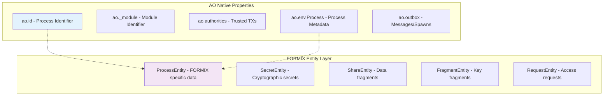
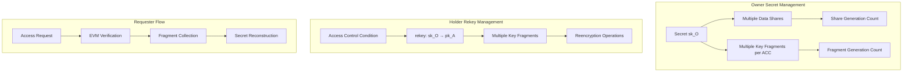
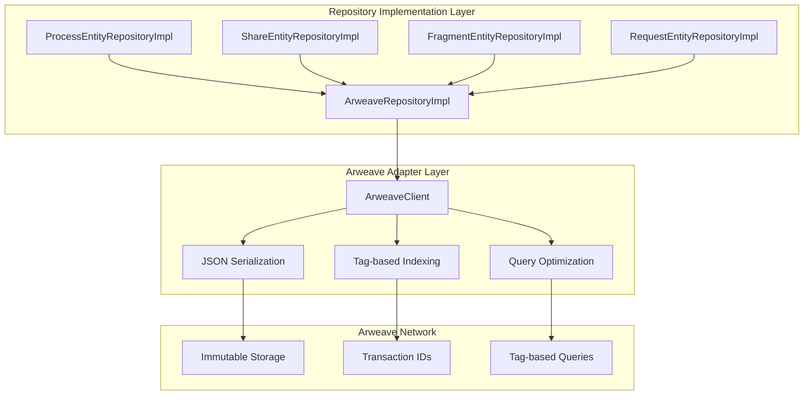
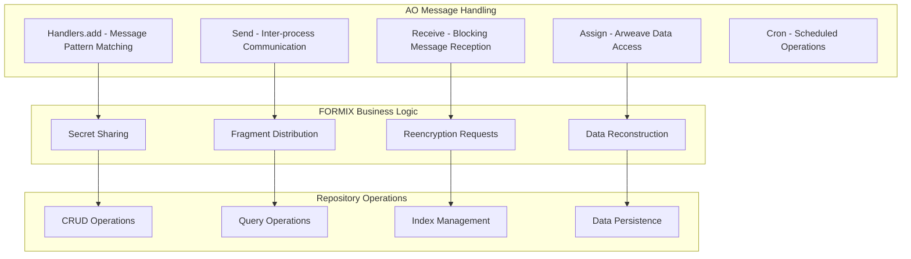

# AO Native Entity/Repository Design: 普遍的データ層設計

## 1. 設計方針

### 1.1 基本原則

**ユーザー要求に基づく明確な責務分離**:
- **Entityクラス**: データ保持のみ、メソッドは持たない
- **Repository Interface**: EntityのCRUD操作定義
- **Repository Implementation**: Arweave永続化の具体実装
- **各プロセス普遍性**: Owner/Requester/Holderの全ての属性を持ちうる

### 1.2 AO固有プロパティとの棲み分け



### 1.3 暗号学的関係性の正確な表現



---

## 2. 普遍的Entity設計（データ保持のみ）

### 2.1 ProcessEntity - プロセス固有データ

**用途**: AO固有プロパティを除く、FORMIX固有のプロセスデータ

```rust
/// プロセスエンティティ（データ保持のみ）
/// AO固有プロパティ（ao.id, ao.env等）は使用せず、FORMIX固有データのみ管理
#[derive(Debug, Clone, PartialEq, Serialize, Deserialize)]
pub struct ProcessEntity {
    /// FORMIX固有プロセス識別子（AOのao.idとは別管理）
    pub dtpres_process_id: String,
    
    /// プロセス名（ユーザー定義）
    pub process_name: String,
    
    /// Owner機能として管理する秘密群
    /// Key: SecretId, Value: OwnerSecretData
    pub owner_secrets: HashMap<String, OwnerSecretData>,
    
    /// Holder機能として保持する再暗号化キー群
    /// Key: AccessControlCondition, Value: HolderRekeyData
    pub holder_rekeys: HashMap<String, HolderRekeyData>,
    
    /// Requester機能としてのアクティブ要求群
    pub requester_active_requests: Vec<RequesterRequestData>,
    
    /// プロセス設定
    pub configuration: HashMap<String, String>,
    
    /// 対応可能な暗号操作リスト
    pub supported_crypto_operations: Vec<String>,
    
    /// 最大同時操作数
    pub max_concurrent_operations: u32,
    
    /// パフォーマンスメトリクス
    pub performance_metrics: PerformanceMetrics,
    
    /// 作成日時（Unix timestamp）
    pub created_at: u64,
    
    /// 最終更新日時（Unix timestamp）
    pub updated_at: u64,
    
    /// バージョン（楽観ロック用）
    pub version: u64,
}

/// Owner機能：秘密データ管理
#[derive(Debug, Clone, PartialEq, Serialize, Deserialize)]
pub struct OwnerSecretData {
    /// 秘密識別子
    pub secret_id: String,
    
    /// 秘密に対応する公開鍵（sk_Oの公開鍵部分）
    pub secret_public_key: Vec<u8>,
    
    /// この秘密から生成されたシェア群
    /// Key: ShareId, Value: ShareMetadata
    pub generated_shares: HashMap<String, ShareMetadata>,
    
    /// この秘密に対するアクセス制御条件ごとのフラグメント群
    /// Key: AccessControlCondition, Value: Vec<FragmentId>
    pub generated_fragments_by_acc: HashMap<String, Vec<String>>,
    
    /// アクセス制御条件リスト
    pub access_control_conditions: Vec<String>,
    
    /// 総シェア生成数（この秘密について）
    pub total_shares_created: u64,
    
    /// 総フラグメント生成数（この秘密について）
    pub total_fragments_created: u64,
}

/// Holder機能：再暗号化キーデータ管理
#[derive(Debug, Clone, PartialEq, Serialize, Deserialize)]
pub struct HolderRekeyData {
    /// アクセス制御条件
    pub access_control_condition: String,
    
    /// 再暗号化キーの元公開鍵（sk_Oの公開鍵）
    pub rekey_from_public_key: Vec<u8>,
    
    /// 再暗号化キーの先公開鍵（pk_A）
    pub rekey_to_public_key: Vec<u8>,
    
    /// この再暗号化キーに関連するフラグメント群
    pub key_fragment_ids: Vec<String>,
    
    /// 再暗号化キーの状態
    pub rekey_status: String, // "Active", "Expired", "Revoked"
    
    /// 保持中のフラグメント数
    pub held_fragments_count: u64,
    
    /// 処理完了済み再暗号化数
    pub completed_reencryptions: u64,
    
    /// 有効期限（Unixタイムスタンプ、Noneの場合無期限）
    pub expires_at: Option<u64>,
}

/// Requester機能：要求データ管理
#[derive(Debug, Clone, PartialEq, Serialize, Deserialize)]
pub struct RequesterRequestData {
    /// 要求識別子
    pub request_id: String,
    
    /// 要求対象データID
    pub target_data_id: String,
    
    /// データオーナー公開鍵
    pub owner_public_key: Vec<u8>,
    
    /// 受信者公開鍵（自分の公開鍵）
    pub recipient_public_key: Vec<u8>,
    
    /// EVM検証トランザクションハッシュ
    pub evm_verification_tx_hash: String,
    
    /// 要求状態
    pub request_status: String, // "Pending", "Approved", "Rejected", "Completed"
    
    /// 対象Holderプロセス一覧
    pub target_holder_ids: Vec<String>,
    
    /// 必要な閾値数
    pub required_threshold: u8,
    
    /// 収集済みフラグメント数
    pub collected_fragments_count: u8,
    
    /// 要求作成日時
    pub request_created_at: u64,
    
    /// タイムアウト時刻
    pub timeout_at: u64,
}

/// パフォーマンスメトリクス
#[derive(Debug, Clone, PartialEq, Serialize, Deserialize)]
pub struct PerformanceMetrics {
    /// 成功操作数
    pub successful_operations: u64,
    
    /// 失敗操作数
    pub failed_operations: u64,
    
    /// 平均応答時間（ミリ秒）
    pub average_response_time_ms: u64,
    
    /// Holder信頼性スコア（0.0-1.0）
    pub reliability_score: f64,
    
    /// 稼働率（0.0-1.0）
    pub uptime_percentage: f64,
    
    /// 最終メトリクス更新時刻
    pub last_updated_at: u64,
}

/// シェアメタデータ
#[derive(Debug, Clone, PartialEq, Serialize, Deserialize)]
pub struct ShareMetadata {
    /// 閾値インデックス（1からnまで）
    pub threshold_index: u8,
    
    /// フラグメントサイズ（バイト）
    pub fragment_size: usize,
    
    /// 作成日時
    pub created_at: u64,
    
    /// 整合性ハッシュ
    pub integrity_hash: Vec<u8>,
}
```

### 2.2 ShareEntity - データシェア

**用途**: Shamir Secret Sharingによるデータ断片（データ保持のみ）

```rust
/// データシェアエンティティ（データ保持のみ）
#[derive(Debug, Clone, PartialEq, Serialize, Deserialize)]
pub struct ShareEntity {
    /// シェア識別子
    pub share_id: String,
    
    /// データグループ識別子
    pub data_id: String,
    
    /// 関連する秘密識別子
    pub secret_id: String,
    
    /// 閾値インデックス（1からnまで）
    pub threshold_index: u8,
    
    /// 暗号化されたフラグメントデータ
    pub encrypted_fragment: Vec<u8>,
    
    /// フラグメントサイズ（バイト）
    pub fragment_size: usize,
    
    /// データオーナーの公開鍵
    pub owner_public_key: Vec<u8>,
    
    /// 整合性検証用ハッシュ
    pub integrity_hash: Vec<u8>,
    
    /// 作成日時（Unix timestamp）
    pub created_at: u64,
    
    /// 最終アクセス日時（Unix timestamp）
    pub last_accessed_at: Option<u64>,
    
    /// バージョン
    pub version: u64,
}
```

### 2.3 FragmentEntity - 鍵フラグメント

**用途**: Umbral Proxy Re-Encryptionの鍵フラグメント（データ保持のみ）

```rust
/// 鍵フラグメントエンティティ（データ保持のみ）
#[derive(Debug, Clone, PartialEq, Serialize, Deserialize)]
pub struct FragmentEntity {
    /// フラグメント識別子
    pub fragment_id: String,
    
    /// 関連データ識別子
    pub data_id: String,
    
    /// 関連する秘密識別子
    pub secret_id: String,
    
    /// アクセス制御条件
    pub access_control_condition: String,
    
    /// オーナー公開鍵（sk_Oの公開鍵）
    pub owner_public_key: Vec<u8>,
    
    /// 受信者公開鍵（pk_A）
    pub recipient_public_key: Vec<u8>,
    
    /// Umbral鍵フラグメントデータ
    pub umbral_fragment_data: Vec<u8>,
    
    /// 割り当てられたHolderプロセスID
    pub assigned_holder_id: String,
    
    /// フラグメント状態
    pub status: String, // "Available", "Consumed", "Expired", "Revoked"
    
    /// 有効期限（Unixタイムスタンプ、Noneの場合無期限）
    pub expires_at: Option<u64>,
    
    /// 作成日時
    pub created_at: u64,
    
    /// 最終更新日時
    pub updated_at: u64,
    
    /// バージョン
    pub version: u64,
}
```

### 2.4 RequestEntity - アクセス要求

**用途**: データアクセス要求の状態管理（データ保持のみ）

```rust
/// アクセス要求エンティティ（データ保持のみ）
#[derive(Debug, Clone, PartialEq, Serialize, Deserialize)]
pub struct RequestEntity {
    /// 要求識別子
    pub request_id: String,
    
    /// 要求対象データID
    pub data_id: String,
    
    /// 要求対象秘密ID
    pub secret_id: String,
    
    /// 要求者プロセスID（FORMIX ID）
    pub requester_process_id: String,
    
    /// 要求者AO Process ID
    pub requester_ao_process_id: String,
    
    /// データオーナー公開鍵
    pub owner_public_key: Vec<u8>,
    
    /// 受信者公開鍵
    pub recipient_public_key: Vec<u8>,
    
    /// EVM検証トランザクションハッシュ
    pub evm_verification_tx_hash: String,
    
    /// 要求状態
    pub status: String, // "Pending", "Approved", "Rejected", "Completed", "Failed", "TimedOut"
    
    /// 必要な閾値数
    pub required_threshold: u8,
    
    /// 収集済みフラグメント数
    pub collected_fragments_count: u8,
    
    /// 対象Holderプロセス一覧
    pub target_holder_ids: Vec<String>,
    
    /// 収集されたフラグメント群
    pub collected_fragment_ids: Vec<String>,
    
    /// 要求作成日時
    pub created_at: u64,
    
    /// 要求完了日時
    pub completed_at: Option<u64>,
    
    /// タイムアウト時刻
    pub timeout_at: u64,
    
    /// バージョン
    pub version: u64,
}
```

---

## 3. Repository Interface設計（CRUD操作に特化）

### 3.1 基本Repository Pattern

**基本方針**: 全てのEntityに共通するCRUD操作を提供

```rust
/// 汎用Repositoryインターフェース
/// 全てのEntityに共通するCRUD操作を定義
#[async_trait]
pub trait Repository<T, ID> {
    type Error: std::error::Error + Send + Sync + 'static;
    
    /// エンティティ作成
    async fn create(&self, entity: &T) -> Result<(), Self::Error>;
    
    /// ID による検索
    async fn find_by_id(&self, id: &ID) -> Result<Option<T>, Self::Error>;
    
    /// エンティティ更新
    async fn update(&self, entity: &T) -> Result<(), Self::Error>;
    
    /// エンティティ削除
    async fn delete(&self, id: &ID) -> Result<(), Self::Error>;
    
    /// 全件取得
    async fn find_all(&self) -> Result<Vec<T>, Self::Error>;
    
    /// 存在確認
    async fn exists(&self, id: &ID) -> Result<bool, Self::Error>;
    
    /// 件数取得
    async fn count(&self) -> Result<usize, Self::Error>;
}
```

### 3.2 ProcessEntity Repository Interface

```rust
/// ProcessEntityリポジトリインターフェース
/// プロセス固有のクエリメソッドを提供
#[async_trait]
pub trait ProcessEntityRepository: Repository<ProcessEntity, String> {
    /// 名前による検索
    async fn find_by_name(&self, name: &str) -> Result<Option<ProcessEntity>, Self::Error>;
    
    /// Owner機能を持つプロセス検索
    async fn find_processes_with_owner_capability(&self) -> Result<Vec<ProcessEntity>, Self::Error>;
    
    /// Holder機能を持つプロセス検索
    async fn find_processes_with_holder_capability(&self) -> Result<Vec<ProcessEntity>, Self::Error>;
    
    /// Requester機能を持つプロセス検索
    async fn find_processes_with_requester_capability(&self) -> Result<Vec<ProcessEntity>, Self::Error>;
    
    /// 暗号操作別プロセス検索
    async fn find_by_crypto_operation(&self, operation: &str) -> Result<Vec<ProcessEntity>, Self::Error>;
    
    /// 信頼性スコア順検索
    async fn find_by_reliability_score_desc(&self, limit: usize) -> Result<Vec<ProcessEntity>, Self::Error>;
    
    /// 利用可能容量別検索
    async fn find_by_available_capacity(&self, min_capacity: u32) -> Result<Vec<ProcessEntity>, Self::Error>;
    
    /// パフォーマンスメトリクス更新
    async fn update_performance_metrics(
        &self, 
        process_id: &str, 
        metrics: &PerformanceMetrics
    ) -> Result<(), Self::Error>;
    
    /// Owner秘密データ更新
    async fn update_owner_secret(
        &self,
        process_id: &str,
        secret_id: &str,
        secret_data: &OwnerSecretData,
    ) -> Result<(), Self::Error>;
    
    /// Holder再暗号化キーデータ更新
    async fn update_holder_rekey(
        &self,
        process_id: &str,
        access_control_condition: &str,
        rekey_data: &HolderRekeyData,
    ) -> Result<(), Self::Error>;
    
    /// Requester要求データ追加
    async fn add_requester_request(
        &self,
        process_id: &str,
        request_data: &RequesterRequestData,
    ) -> Result<(), Self::Error>;
    
    /// Requester要求データ更新
    async fn update_requester_request(
        &self,
        process_id: &str,
        request_id: &str,
        request_data: &RequesterRequestData,
    ) -> Result<(), Self::Error>;
}
```

### 3.3 ShareEntity Repository Interface

```rust
/// ShareEntityリポジトリインターフェース
/// データシェア管理のためのクエリメソッドを提供
#[async_trait]
pub trait ShareEntityRepository: Repository<ShareEntity, String> {
    /// データID別検索
    async fn find_by_data_id(&self, data_id: &str) -> Result<Vec<ShareEntity>, Self::Error>;
    
    /// 秘密ID別検索
    async fn find_by_secret_id(&self, secret_id: &str) -> Result<Vec<ShareEntity>, Self::Error>;
    
    /// オーナー別検索
    async fn find_by_owner(&self, owner_public_key: &[u8]) -> Result<Vec<ShareEntity>, Self::Error>;
    
    /// 閾値インデックス指定検索
    async fn find_by_threshold_index(
        &self,
        data_id: &str,
        index: u8,
    ) -> Result<Option<ShareEntity>, Self::Error>;
    
    /// 再構築用シェア収集
    async fn collect_for_reconstruction(
        &self,
        data_id: &str,
        threshold: u8,
    ) -> Result<Vec<ShareEntity>, Self::Error>;
    
    /// フラグメントサイズ範囲検索
    async fn find_by_size_range(
        &self,
        min_size: usize,
        max_size: usize,
    ) -> Result<Vec<ShareEntity>, Self::Error>;
    
    /// 最終アクセス時刻更新
    async fn update_last_accessed(&self, share_id: &str) -> Result<(), Self::Error>;
    
    /// 整合性検証用データ取得
    async fn get_integrity_data(&self, share_id: &str) -> Result<Option<Vec<u8>>, Self::Error>;
    
    /// 古いシェア検索（クリーンアップ用）
    async fn find_older_than(&self, threshold_date: u64) -> Result<Vec<ShareEntity>, Self::Error>;
}
```

### 3.4 FragmentEntity Repository Interface

```rust
/// FragmentEntityリポジトリインターフェース
/// 鍵フラグメント管理のためのクエリメソッドを提供
#[async_trait]
pub trait FragmentEntityRepository: Repository<FragmentEntity, String> {
    /// データID別検索
    async fn find_by_data_id(&self, data_id: &str) -> Result<Vec<FragmentEntity>, Self::Error>;
    
    /// 秘密ID別検索
    async fn find_by_secret_id(&self, secret_id: &str) -> Result<Vec<FragmentEntity>, Self::Error>;
    
    /// アクセス制御条件別検索
    async fn find_by_access_control_condition(
        &self,
        condition: &str,
    ) -> Result<Vec<FragmentEntity>, Self::Error>;
    
    /// Holder別検索
    async fn find_by_holder(&self, holder_id: &str) -> Result<Vec<FragmentEntity>, Self::Error>;
    
    /// 複合キー検索
    async fn find_by_composite_key(
        &self,
        data_id: &str,
        owner_public_key: &[u8],
        recipient_public_key: &[u8],
    ) -> Result<Vec<FragmentEntity>, Self::Error>;
    
    /// 状態別検索
    async fn find_by_status(&self, status: &str) -> Result<Vec<FragmentEntity>, Self::Error>;
    
    /// 利用可能フラグメント検索
    async fn find_available_for_reencryption(
        &self,
        data_id: &str,
        owner_public_key: &[u8],
        recipient_public_key: &[u8],
    ) -> Result<Vec<FragmentEntity>, Self::Error>;
    
    /// 期限切れフラグメント検索
    async fn find_expired(&self) -> Result<Vec<FragmentEntity>, Self::Error>;
    
    /// フラグメント状態更新
    async fn update_status(&self, fragment_id: &str, status: &str) -> Result<(), Self::Error>;
    
    /// フラグメント消費マーキング
    async fn mark_as_consumed(&self, fragment_id: &str) -> Result<(), Self::Error>;
    
    /// 期限切れフラグメントクリーンアップ
    async fn cleanup_expired(&self) -> Result<usize, Self::Error>;
    
    /// Holder負荷分散情報取得
    async fn get_holder_load_distribution(&self) -> Result<Vec<(String, u64)>, Self::Error>;
}
```

### 3.5 RequestEntity Repository Interface

```rust
/// RequestEntityリポジトリインターフェース
/// アクセス要求管理のためのクエリメソッドを提供
#[async_trait]
pub trait RequestEntityRepository: Repository<RequestEntity, String> {
    /// 要求者別検索
    async fn find_by_requester(&self, requester_process_id: &str) -> Result<Vec<RequestEntity>, Self::Error>;
    
    /// データID別検索
    async fn find_by_data_id(&self, data_id: &str) -> Result<Vec<RequestEntity>, Self::Error>;
    
    /// 秘密ID別検索
    async fn find_by_secret_id(&self, secret_id: &str) -> Result<Vec<RequestEntity>, Self::Error>;
    
    /// 状態別検索
    async fn find_by_status(&self, status: &str) -> Result<Vec<RequestEntity>, Self::Error>;
    
    /// アクティブ要求検索
    async fn find_active_requests(&self) -> Result<Vec<RequestEntity>, Self::Error>;
    
    /// タイムアウト要求検索
    async fn find_timed_out_requests(&self) -> Result<Vec<RequestEntity>, Self::Error>;
    
    /// 要求状態更新
    async fn update_status(&self, request_id: &str, status: &str) -> Result<(), Self::Error>;
    
    /// フラグメント収集数更新
    async fn update_collected_fragments_count(
        &self,
        request_id: &str,
        count: u8,
    ) -> Result<(), Self::Error>;
    
    /// 収集されたフラグメント追加
    async fn add_collected_fragment(
        &self,
        request_id: &str,
        fragment_id: &str,
    ) -> Result<(), Self::Error>;
    
    /// 要求完了マーキング
    async fn mark_as_completed(&self, request_id: &str, completed_at: u64) -> Result<(), Self::Error>;
    
    /// 古い要求クリーンアップ
    async fn cleanup_old_requests(&self, before: u64) -> Result<usize, Self::Error>;
}
```

---

## 4. Repository Implementation設計（Arweave永続化）

### 4.1 Arweave KVS戦略



### 4.2 Generic ArweaveRepository Implementation

```rust
/// Arweave汎用リポジトリ実装
/// 全てのEntityに対する基本的なCRUD操作を提供
pub struct ArweaveRepositoryImpl<T, ID> {
    arweave_client: Arc<dyn ArweaveClient>,
    entity_type: &'static str,
    index_manager: Arc<dyn IndexManager>,
    _phantom: std::marker::PhantomData<(T, ID)>,
}

impl<T, ID> ArweaveRepositoryImpl<T, ID>
where
    T: Serialize + for<'de> Deserialize<'de> + Clone + Send + Sync,
    ID: ToString + Clone + Send + Sync,
{
    pub fn new(
        arweave_client: Arc<dyn ArweaveClient>,
        entity_type: &'static str,
        index_manager: Arc<dyn IndexManager>,
    ) -> Self {
        Self {
            arweave_client,
            entity_type,
            index_manager,
            _phantom: std::marker::PhantomData,
        }
    }
    
    /// エンティティをArweaveに保存
    async fn store_entity(&self, entity: &T, id: &ID) -> Result<String, RepositoryError> {
        // 1. JSONシリアライゼーション
        let json_data = serde_json::to_vec(entity)
            .map_err(RepositoryError::Serialization)?;
        
        // 2. Arweaveタグ作成
        let tags = self.create_storage_tags(id);
        
        // 3. Arweaveに保存
        let tx_id = self.arweave_client
            .store_data(json_data, tags)
            .await
            .map_err(RepositoryError::Storage)?;
        
        // 4. インデックス更新
        self.index_manager
            .update_entity_indexes(self.entity_type, entity, &id.to_string())
            .await
            .map_err(RepositoryError::Index)?;
        
        Ok(tx_id)
    }
    
    /// IDによるエンティティ取得
    async fn load_entity(&self, id: &ID) -> Result<Option<T>, RepositoryError> {
        let query_tags = self.create_query_tags(id);
        
        let tx_ids = self.arweave_client
            .query_by_tags(query_tags)
            .await
            .map_err(RepositoryError::Storage)?;
        
        if let Some(tx_id) = tx_ids.first() {
            let data = self.arweave_client
                .get_data(tx_id)
                .await
                .map_err(RepositoryError::Storage)?;
            
            let entity: T = serde_json::from_slice(&data)
                .map_err(RepositoryError::Serialization)?;
            
            Ok(Some(entity))
        } else {
            Ok(None)
        }
    }
    
    /// ストレージ用タグ作成
    fn create_storage_tags(&self, id: &ID) -> HashMap<String, String> {
        let mut tags = HashMap::new();
        tags.insert("App-Name".to_string(), "FORMIX".to_string());
        tags.insert("Entity-Type".to_string(), self.entity_type.to_string());
        tags.insert("Entity-Id".to_string(), id.to_string());
        tags.insert("Timestamp".to_string(), 
                   std::time::SystemTime::now()
                       .duration_since(std::time::UNIX_EPOCH)
                       .unwrap_or_default()
                       .as_secs()
                       .to_string());
        tags
    }
    
    /// クエリ用タグ作成
    fn create_query_tags(&self, id: &ID) -> HashMap<String, String> {
        let mut tags = HashMap::new();
        tags.insert("App-Name".to_string(), "FORMIX".to_string());
        tags.insert("Entity-Type".to_string(), self.entity_type.to_string());
        tags.insert("Entity-Id".to_string(), id.to_string());
        tags
    }
}

#[async_trait]
impl<T, ID> Repository<T, ID> for ArweaveRepositoryImpl<T, ID>
where
    T: Serialize + for<'de> Deserialize<'de> + Clone + Send + Sync,
    ID: ToString + Clone + Send + Sync,
{
    type Error = RepositoryError;
    
    async fn create(&self, entity: &T) -> Result<(), Self::Error> {
        let id = self.extract_id(entity)?;
        self.store_entity(entity, &id).await?;
        Ok(())
    }
    
    async fn find_by_id(&self, id: &ID) -> Result<Option<T>, Self::Error> {
        self.load_entity(id).await
    }
    
    async fn update(&self, entity: &T) -> Result<(), Self::Error> {
        let id = self.extract_id(entity)?;
        // Arweaveは不変のため、新しいバージョンとして保存
        self.store_entity(entity, &id).await?;
        Ok(())
    }
    
    async fn delete(&self, id: &ID) -> Result<(), Self::Error> {
        // Arweaveは不変のため、論理削除マーカーを保存
        let deletion_marker = self.create_deletion_marker(id);
        let deletion_tags = self.create_deletion_tags(id);
        
        self.arweave_client
            .store_data(deletion_marker, deletion_tags)
            .await
            .map_err(RepositoryError::Storage)?;
        
        Ok(())
    }
    
    async fn find_all(&self) -> Result<Vec<T>, Self::Error> {
        let query_tags = self.create_type_query_tags();
        let tx_ids = self.arweave_client
            .query_by_tags(query_tags)
            .await
            .map_err(RepositoryError::Storage)?;
        
        let mut entities = Vec::new();
        for tx_id in tx_ids {
            let data = self.arweave_client
                .get_data(&tx_id)
                .await
                .map_err(RepositoryError::Storage)?;
            
            let entity: T = serde_json::from_slice(&data)
                .map_err(RepositoryError::Serialization)?;
            
            entities.push(entity);
        }
        
        Ok(entities)
    }
    
    async fn exists(&self, id: &ID) -> Result<bool, Self::Error> {
        Ok(self.find_by_id(id).await?.is_some())
    }
    
    async fn count(&self) -> Result<usize, Self::Error> {
        Ok(self.find_all().await?.len())
    }
}

// エンティティからIDを抽出するヘルパーメソッド（各Entityに応じて実装）
impl ArweaveRepositoryImpl<ProcessEntity, String> {
    fn extract_id(&self, entity: &ProcessEntity) -> Result<String, RepositoryError> {
        Ok(entity.dtpres_process_id.clone())
    }
}

impl ArweaveRepositoryImpl<ShareEntity, String> {
    fn extract_id(&self, entity: &ShareEntity) -> Result<String, RepositoryError> {
        Ok(entity.share_id.clone())
    }
}

impl ArweaveRepositoryImpl<FragmentEntity, String> {
    fn extract_id(&self, entity: &FragmentEntity) -> Result<String, RepositoryError> {
        Ok(entity.fragment_id.clone())
    }
}

impl ArweaveRepositoryImpl<RequestEntity, String> {
    fn extract_id(&self, entity: &RequestEntity) -> Result<String, RepositoryError> {
        Ok(entity.request_id.clone())
    }
}
```

### 4.3 インデックス管理システム

```rust
/// インデックス管理インターフェース
#[async_trait]
pub trait IndexManager: Send + Sync {
    /// エンティティインデックス更新
    async fn update_entity_indexes(
        &self,
        entity_type: &str,
        entity: &impl Serialize,
        entity_id: &str,
    ) -> Result<(), IndexError>;
    
    /// インデックス削除
    async fn remove_entity_indexes(
        &self,
        entity_type: &str,
        entity_id: &str,
    ) -> Result<(), IndexError>;
    
    /// インデックス検索
    async fn get_indexed_entities(&self, index_key: &str) -> Result<Vec<String>, IndexError>;
}

/// Arweave用インデックス管理実装
pub struct ArweaveIndexManager {
    arweave_client: Arc<dyn ArweaveClient>,
}

#[async_trait]
impl IndexManager for ArweaveIndexManager {
    async fn update_entity_indexes(
        &self,
        entity_type: &str,
        entity: &impl Serialize,
        entity_id: &str,
    ) -> Result<(), IndexError> {
        match entity_type {
            "ProcessEntity" => {
                let process: ProcessEntity = 
                    serde_json::from_value(serde_json::to_value(entity)?)?;
                
                // 名前インデックス
                let name_key = format!("idx:process:name:{}", process.process_name);
                self.add_to_index(&name_key, entity_id).await?;
                
                // 暗号操作インデックス
                for operation in &process.supported_crypto_operations {
                    let op_key = format!("idx:process:crypto_op:{}", operation);
                    self.add_to_index(&op_key, entity_id).await?;
                }
            }
            "ShareEntity" => {
                let share: ShareEntity = 
                    serde_json::from_value(serde_json::to_value(entity)?)?;
                
                // data_idインデックス
                let data_id_key = format!("idx:share:data_id:{}", share.data_id);
                self.add_to_index(&data_id_key, entity_id).await?;
                
                // secret_idインデックス
                let secret_id_key = format!("idx:share:secret_id:{}", share.secret_id);
                self.add_to_index(&secret_id_key, entity_id).await?;
                
                // ownerインデックス
                let owner_hash = blake3::hash(&share.owner_public_key);
                let owner_key = format!("idx:share:owner:{}", hex::encode(owner_hash.as_bytes()));
                self.add_to_index(&owner_key, entity_id).await?;
            }
            "FragmentEntity" => {
                let fragment: FragmentEntity = 
                    serde_json::from_value(serde_json::to_value(entity)?)?;
                
                // data_idインデックス
                let data_id_key = format!("idx:fragment:data_id:{}", fragment.data_id);
                self.add_to_index(&data_id_key, entity_id).await?;
                
                // secret_idインデックス
                let secret_id_key = format!("idx:fragment:secret_id:{}", fragment.secret_id);
                self.add_to_index(&secret_id_key, entity_id).await?;
                
                // holderインデックス
                let holder_key = format!("idx:fragment:holder:{}", fragment.assigned_holder_id);
                self.add_to_index(&holder_key, entity_id).await?;
                
                // statusインデックス
                let status_key = format!("idx:fragment:status:{}", fragment.status);
                self.add_to_index(&status_key, entity_id).await?;
                
                // アクセス制御条件インデックス
                let acc_key = format!("idx:fragment:acc:{}", fragment.access_control_condition);
                self.add_to_index(&acc_key, entity_id).await?;
            }
            "RequestEntity" => {
                let request: RequestEntity = 
                    serde_json::from_value(serde_json::to_value(entity)?)?;
                
                // requesterインデックス
                let requester_key = format!("idx:request:requester:{}", request.requester_process_id);
                self.add_to_index(&requester_key, entity_id).await?;
                
                // data_idインデックス
                let data_id_key = format!("idx:request:data_id:{}", request.data_id);
                self.add_to_index(&data_id_key, entity_id).await?;
                
                // statusインデックス
                let status_key = format!("idx:request:status:{}", request.status);
                self.add_to_index(&status_key, entity_id).await?;
            }
            _ => {}
        }
        
        Ok(())
    }
    
    async fn add_to_index(&self, index_key: &str, entity_id: &str) -> Result<(), IndexError> {
        // 既存インデックス取得
        let query_tags = {
            let mut tags = HashMap::new();
            tags.insert("App-Name".to_string(), "FORMIX".to_string());
            tags.insert("Index-Key".to_string(), index_key.to_string());
            tags
        };
        
        let mut entity_ids: Vec<String> = match self.arweave_client.query_by_tags(query_tags).await {
            Ok(tx_ids) if !tx_ids.is_empty() => {
                let data = self.arweave_client.get_data(&tx_ids[0]).await?;
                serde_json::from_slice(&data)?
            }
            _ => Vec::new(),
        };
        
        // エンティティID追加（重複回避）
        if !entity_ids.contains(&entity_id.to_string()) {
            entity_ids.push(entity_id.to_string());
        }
        
        // インデックス保存
        let index_data = serde_json::to_vec(&entity_ids)?;
        let index_tags = {
            let mut tags = HashMap::new();
            tags.insert("App-Name".to_string(), "FORMIX".to_string());
            tags.insert("Index-Key".to_string(), index_key.to_string());
            tags.insert("Data-Type".to_string(), "Index".to_string());
            tags
        };
        
        self.arweave_client.store_data(index_data, index_tags).await?;
        
        Ok(())
    }
}
```

### 4.4 エラー定義

```rust
/// リポジトリエラー
#[derive(Debug, thiserror::Error)]
pub enum RepositoryError {
    #[error("Serialization error: {0}")]
    Serialization(#[from] serde_json::Error),
    
    #[error("Storage error: {0}")]
    Storage(#[from] ArweaveError),
    
    #[error("Index error: {0}")]
    Index(#[from] IndexError),
    
    #[error("Entity not found: {id}")]
    NotFound { id: String },
    
    #[error("Invalid entity data: {0}")]
    InvalidData(String),
}

/// Arweaveエラー
#[derive(Debug, thiserror::Error)]
pub enum ArweaveError {
    #[error("Network error: {0}")]
    Network(String),
    
    #[error("Transaction not found: {tx_id}")]
    TransactionNotFound { tx_id: String },
    
    #[error("Invalid data")]
    InvalidData,
    
    #[error("Timeout")]
    Timeout,
}

/// インデックスエラー
#[derive(Debug, thiserror::Error)]
pub enum IndexError {
    #[error("Serialization error: {0}")]
    Serialization(#[from] serde_json::Error),
    
    #[error("Storage error: {0}")]
    Storage(#[from] ArweaveError),
    
    #[error("Index corruption detected")]
    Corruption,
}
```

---

## 5. AO固有機能との統合

### 5.1 AOメッセージングパターンの活用



### 5.2 AOプロセス環境の活用

```rust
/// AO環境との統合ヘルパー
pub struct AoEnvironmentIntegration;

impl AoEnvironmentIntegration {
    /// AO Process IDをFORMIX Process IDにマッピング
    pub fn map_ao_to_dtpres_id(ao_process_id: &str) -> String {
        format!("dtpres_{}", ao_process_id)
    }
    
    /// FORMIX Process IDからAO Process IDを逆引き
    pub fn map_dtpres_to_ao_id(dtpres_process_id: &str) -> Option<String> {
        if dtpres_process_id.starts_with("dtpres_") {
            Some(dtpres_process_id.strip_prefix("dtpres_").unwrap().to_string())
        } else {
            None
        }
    }
    
    /// AO環境情報からプロセス設定を構築
    pub fn extract_process_configuration() -> HashMap<String, String> {
        let mut config = HashMap::new();
        
        // ao.env.Process情報から設定を抽出（Luaから呼び出される場合）
        // 実装詳細はAOランタイム環境に依存
        
        config.insert("ao_module".to_string(), "ao_module_id".to_string());
        config.insert("ao_authorities".to_string(), "trusted_authorities".to_string());
        
        config
    }
    
    /// AOタグからFORMIXメタデータを抽出
    pub fn extract_dtpres_metadata_from_tags(tags: &HashMap<String, String>) -> Option<HashMap<String, String>> {
        let mut metadata = HashMap::new();
        
        for (key, value) in tags {
            if key.starts_with("FORMIX-") {
                let metadata_key = key.strip_prefix("FORMIX-").unwrap();
                metadata.insert(metadata_key.to_string(), value.clone());
            }
        }
        
        if metadata.is_empty() {
            None
        } else {
            Some(metadata)
        }
    }
}
```

---

## 6. 実装ディレクトリ構造

```
src/
├── domain/
│   ├── entity/
│   │   ├── process_entity.rs
│   │   ├── share_entity.rs
│   │   ├── fragment_entity.rs
│   │   ├── request_entity.rs
│   │   └── mod.rs
│   └── repository/
│       ├── process_entity_repository.rs
│       ├── share_entity_repository.rs
│       ├── fragment_entity_repository.rs
│       ├── request_entity_repository.rs
│       └── mod.rs
├── infrastructure/
│   ├── repository/
│   │   ├── arweave/
│   │   │   ├── arweave_repository_impl.rs
│   │   │   ├── index_manager.rs
│   │   │   ├── arweave_client.rs
│   │   │   └── mod.rs
│   │   └── mod.rs
│   └── ao_integration/
│       ├── ao_environment.rs
│       ├── message_handlers.rs
│       └── mod.rs
├── application/
│   └── service/
│       └── mod.rs
└── lib.rs
```

---

## 7. 実装チェックリスト

### Phase 1: Entity実装 (Week 1)
- [ ] ProcessEntity定義・実装
- [ ] ShareEntity定義・実装
- [ ] FragmentEntity定義・実装
- [ ] RequestEntity定義・実装
- [ ] Entityシリアライゼーション・デシリアライゼーション確認

### Phase 2: Repository Interface実装 (Week 2)
- [ ] 基本Repository trait定義
- [ ] ProcessEntityRepository trait実装
- [ ] ShareEntityRepository trait実装
- [ ] FragmentEntityRepository trait実装
- [ ] RequestEntityRepository trait実装

### Phase 3: Arweave Repository Implementation (Week 3-4)
- [ ] ArweaveRepositoryImpl基底クラス実装
- [ ] IndexManager実装
- [ ] 各Repository具象クラス実装
- [ ] エラーハンドリング整備

### Phase 4: AO統合・テスト (Week 5)
- [ ] AO環境統合ヘルパー実装
- [ ] Repository単体テスト
- [ ] AO環境での統合テスト
- [ ] パフォーマンステスト

---

## 8. まとめ

### 8.1 設計の特徴

1. **AOネイティブ設計**: AO固有プロパティとの適切な棲み分け
2. **暗号学的関係性**: 秘密-シェア-フラグメントの正確な1対多関係
3. **純粋なEntity**: データ保持のみ、メソッドなし
4. **CRUD特化Repository**: データ操作に特化した明確な責務
5. **普遍的設計**: 各プロセスがOwner/Holder/Requesterを包含

### 8.2 暗号学的設計の改善

- **Owner**: 秘密ごとのシェア/フラグメント管理
- **Holder**: アクセス制御条件別のrekey管理
- **Requester**: 要求ベースのフラグメント収集

### 8.3 次のステップ

1. **Phase 1実装開始**: Entity定義から開始
2. **Repository Interface実装**: CRUD操作の具体化
3. **Arweave永続化実装**: 実際のデータ永続化
4. **AO環境統合**: メッセージング機能の活用

---

*本設計は、AO固有機能を最大限活用しつつ、暗号学的関係性を正確に表現した普遍的Entity/Repository設計です。データ保持とCRUD操作に特化し、ビジネスロジックとの明確な分離を実現します。*

**Document Status**: Ready for Implementation  
**AO Compliance**: Native Integration  
**Next Phase**: Phase 1 Entity Implementation Start