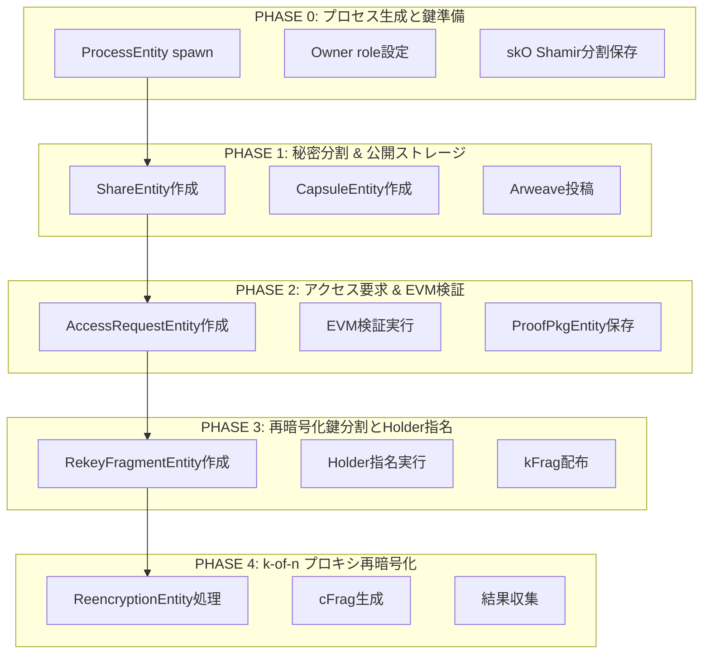
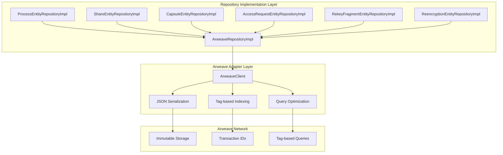

# AO Native Universal Entity/Repository Design: データ層特化設計

## 1. 設計方針（ユーザー要求準拠）

### 1.1 厳格な責務分離

**ユーザー要求の遵守**:
- **Entityクラス**: データ保持のみ、メソッドは一切持たない
- **Repository Interface**: EntityのCRUD操作定義のみ
- **Repository Implementation**: Arweave永続化の具体実装のみ
- **各プロセス普遍性**: Owner/Requester/Holderの全ての属性を同時保持可能

### 1.2 PRDフロー準拠の設計

PRD.mdのPhase 0-5に基づく正確なデータフロー実装:



---

## 2. 普遍的Entity設計（データ保持専用）

### 2.1 ProcessEntity - マルチロール対応プロセス

**用途**: 各AOプロセスが持つ普遍的なデータ（Owner/Holder/Requester全属性対応）

```rust
/// プロセスエンティティ（データ保持のみ、メソッドなし）
/// 各プロセスがOwner/Holder/Requesterの全機能を同時保持可能
#[derive(Debug, Clone, PartialEq, Serialize, Deserialize)]
pub struct ProcessEntity {
    /// プロセス識別子
    pub process_id: String,
    
    /// プロセス名
    pub process_name: String,
    
    /// 現在のアクティブロール（複数可能）
    pub active_roles: Vec<String>, // ["owner", "holder", "requester"]
    
    /// Owner機能データ（skO管理、再暗号化キー生成等）
    pub owner_data: Option<OwnerData>,
    
    /// Holder機能データ（kFrag保持、cFrag生成等）
    pub holder_data: Option<HolderData>,
    
    /// Requester機能データ（アクセス要求、cFrag収集等）
    pub requester_data: Option<RequesterData>,
    
    /// プロセス設定
    pub configuration: HashMap<String, String>,
    
    /// 対応暗号操作
    pub supported_crypto_operations: Vec<String>,
    
    /// パフォーマンスメトリクス
    pub performance_metrics: PerformanceMetrics,
    
    /// 作成日時（Unix timestamp）
    pub created_at: u64,
    
    /// 最終更新日時
    pub updated_at: u64,
    
    /// バージョン（楽観ロック用）
    pub version: u64,
}

/// Owner機能データ（PRD Phase 1, 3準拠）
#[derive(Debug, Clone, PartialEq, Serialize, Deserialize)]
pub struct OwnerData {
    /// オーナー公開鍵（skOの公開鍵部分）
    pub owner_public_key: Vec<u8>,
    
    /// 管理する秘密群（秘密ごとの管理）
    /// Key: SecretId, Value: SecretManagementData
    pub managed_secrets: HashMap<String, SecretManagementData>,
    
    /// Owner-Process固有の設定
    pub owner_config: HashMap<String, String>,
}

/// 秘密管理データ（1つの秘密に対する管理情報）
#[derive(Debug, Clone, PartialEq, Serialize, Deserialize)]
pub struct SecretManagementData {
    /// 秘密識別子
    pub secret_id: String,
    
    /// この秘密から生成されたShare群
    pub generated_shares: Vec<String>, // ShareEntity IDs
    
    /// この秘密に対する生成済みCapsule群
    pub generated_capsules: Vec<String>, // CapsuleEntity IDs
    
    /// この秘密のアクセス制御条件群
    pub access_control_conditions: Vec<String>,
    
    /// この秘密に対する生成済みkFrag群
    /// Key: AccessControlCondition, Value: Vec<RekeyFragmentEntity IDs>
    pub generated_kfrags_by_condition: HashMap<String, Vec<String>>,
    
    /// Shamir設定（k, n）
    pub shamir_threshold: u8,
    pub shamir_total_shares: u8,
    
    /// 生成日時
    pub created_at: u64,
}

/// Holder機能データ（PRD Phase 3, 4準拠）
#[derive(Debug, Clone, PartialEq, Serialize, Deserialize)]
pub struct HolderData {
    /// 保持中のkFrag群
    /// Key: RekeyFragmentId, Value: HolderFragmentInfo
    pub held_fragments: HashMap<String, HolderFragmentInfo>,
    
    /// アクセス制御条件別のkFrag管理
    /// Key: AccessControlCondition, Value: Vec<RekeyFragmentId>
    pub fragments_by_condition: HashMap<String, Vec<String>>,
    
    /// Holder選択時の信頼性スコア
    pub reliability_score: f64,
    
    /// 処理完了済み再暗号化数
    pub completed_reencryptions: u64,
    
    /// 最大保持可能フラグメント数
    pub max_fragment_capacity: u64,
    
    /// 現在の負荷状況
    pub current_load: u64,
}

/// Holderフラグメント情報
#[derive(Debug, Clone, PartialEq, Serialize, Deserialize)]
pub struct HolderFragmentInfo {
    /// フラグメント識別子
    pub fragment_id: String,
    
    /// 関連する秘密ID
    pub secret_id: String,
    
    /// アクセス制御条件
    pub access_control_condition: String,
    
    /// 受信日時
    pub received_at: u64,
    
    /// 使用回数
    pub usage_count: u64,
    
    /// 状態
    pub status: String, // "active", "expired", "revoked"
}

/// Requester機能データ（PRD Phase 2, 4, 5準拠）
#[derive(Debug, Clone, PartialEq, Serialize, Deserialize)]
pub struct RequesterData {
    /// アクティブなアクセス要求群
    pub active_requests: Vec<String>, // AccessRequestEntity IDs
    
    /// 処理中の再暗号化要求群
    pub active_reencryptions: Vec<String>, // ReencryptionEntity IDs
    
    /// 完了済み要求数
    pub completed_requests: u64,
    
    /// 成功率
    pub success_rate: f64,
    
    /// 平均処理時間（ミリ秒）
    pub average_processing_time_ms: u64,
    
    /// Requester固有設定
    pub requester_config: HashMap<String, String>,
}

/// パフォーマンスメトリクス
#[derive(Debug, Clone, PartialEq, Serialize, Deserialize)]
pub struct PerformanceMetrics {
    /// 成功操作数
    pub successful_operations: u64,
    
    /// 失敗操作数
    pub failed_operations: u64,
    
    /// 平均応答時間（ミリ秒）
    pub average_response_time_ms: u64,
    
    /// 最終メトリクス更新時刻
    pub last_updated_at: u64,
}
```

### 2.2 ShareEntity - Shamirデータシェア（PRD Phase 1）

**用途**: Shamir Secret Sharingによるデータ断片保存

```rust
/// データシェアエンティティ（PRD Phase 1準拠）
#[derive(Debug, Clone, PartialEq, Serialize, Deserialize)]
pub struct ShareEntity {
    /// シェア識別子
    pub share_id: String,
    
    /// データグループ識別子
    pub data_id: String,
    
    /// 関連する秘密識別子
    pub secret_id: String,
    
    /// 閾値インデックス（1からnまで）
    pub threshold_index: u8,
    
    /// Shamir設定
    pub shamir_threshold: u8,
    pub shamir_total_shares: u8,
    
    /// 暗号化されたフラグメントデータ（f(i)をAES_GCM(Ki, f(i))で暗号化）
    pub encrypted_fragment: Vec<u8>,
    
    /// フラグメントサイズ（バイト）
    pub fragment_size: usize,
    
    /// データオーナーの公開鍵
    pub owner_public_key: Vec<u8>,
    
    /// 整合性検証用ハッシュ
    pub integrity_hash: Vec<u8>,
    
    /// 作成日時
    pub created_at: u64,
    
    /// 最終アクセス日時
    pub last_accessed_at: Option<u64>,
    
    /// バージョン
    pub version: u64,
}
```

### 2.3 CapsuleEntity - PREカプセル（PRD Phase 1）

**用途**: Proxy Re-Encryptionのカプセル情報保存

```rust
/// カプセルエンティティ（PRD Phase 1準拠）
#[derive(Debug, Clone, PartialEq, Serialize, Deserialize)]
pub struct CapsuleEntity {
    /// カプセル識別子
    pub capsule_id: String,
    
    /// 関連データ識別子
    pub data_id: String,
    
    /// 関連する秘密識別子
    pub secret_id: String,
    
    /// カプセルインデックス（i）
    pub capsule_index: u8,
    
    /// PRE Capsuleデータ（PRE_Enc(pkO, Ki)の結果）
    pub capsule_data: Vec<u8>,
    
    /// 対応する暗号文識別子（Ci = AES_GCM(Ki, f(i))）
    pub corresponding_ciphertext_id: String,
    
    /// オーナー公開鍵
    pub owner_public_key: Vec<u8>,
    
    /// カプセル生成に使用されたランダム鍵Ki（暗号化されて保存）
    pub encrypted_random_key: Vec<u8>,
    
    /// 作成日時
    pub created_at: u64,
    
    /// バージョン
    pub version: u64,
}
```

### 2.4 AccessRequestEntity - アクセス要求（PRD Phase 2）

**用途**: データアクセス要求とEVM検証結果の管理

```rust
/// アクセス要求エンティティ（PRD Phase 2準拠）
#[derive(Debug, Clone, PartialEq, Serialize, Deserialize)]
pub struct AccessRequestEntity {
    /// 要求識別子
    pub request_id: String,
    
    /// 要求対象データID
    pub target_data_id: String,
    
    /// 要求対象秘密ID
    pub target_secret_id: String,
    
    /// 要求者プロセスID
    pub requester_process_id: String,
    
    /// アクセス者の公開鍵（pkA）
    pub accessor_public_key: Vec<u8>,
    
    /// データオーナー公開鍵
    pub owner_public_key: Vec<u8>,
    
    /// EVM検証結果
    pub evm_verification: EvmVerificationData,
    
    /// ProofPkg情報
    pub proof_pkg: Option<ProofPkgData>,
    
    /// 要求状態
    pub status: String, // "pending", "evm_verified", "approved", "rejected", "completed"
    
    /// 要求作成日時
    pub created_at: u64,
    
    /// EVM検証完了日時
    pub evm_verified_at: Option<u64>,
    
    /// 要求完了日時
    pub completed_at: Option<u64>,
    
    /// タイムアウト時刻
    pub timeout_at: u64,
    
    /// バージョン
    pub version: u64,
}

/// EVM検証データ
#[derive(Debug, Clone, PartialEq, Serialize, Deserialize)]
pub struct EvmVerificationData {
    /// EVMトランザクションハッシュ
    pub tx_hash: String,
    
    /// スマートコントラクトアドレス
    pub contract_address: String,
    
    /// VerificationOKイベントデータ
    pub verification_event: Vec<u8>,
    
    /// ブロック高
    pub block_height: u64,
    
    /// 検証日時
    pub verified_at: u64,
}

/// ProofPkgデータ（elciaoによる処理結果）
#[derive(Debug, Clone, PartialEq, Serialize, Deserialize)]
pub struct ProofPkgData {
    /// ProofPkg識別子
    pub proof_pkg_id: String,
    
    /// BlockHeader + Receipt + pkA
    pub proof_package: Vec<u8>,
    
    /// elciaoによる作成日時
    pub created_at: u64,
    
    /// 検証済みフラグ
    pub verified: bool,
}
```

### 2.5 RekeyFragmentEntity - 再暗号化キーフラグメント（PRD Phase 3）

**用途**: Shamirで分割された再暗号化キーフラグメント（kFrag）の保存

```rust
/// 再暗号化キーフラグメントエンティティ（PRD Phase 3準拠）
#[derive(Debug, Clone, PartialEq, Serialize, Deserialize)]
pub struct RekeyFragmentEntity {
    /// フラグメント識別子
    pub fragment_id: String,
    
    /// 関連する秘密識別子
    pub secret_id: String,
    
    /// 関連するアクセス要求ID
    pub access_request_id: String,
    
    /// アクセス制御条件
    pub access_control_condition: String,
    
    /// オーナー公開鍵（skOの公開鍵）
    pub owner_public_key: Vec<u8>,
    
    /// アクセス者公開鍵（pkA）
    pub accessor_public_key: Vec<u8>,
    
    /// Shamirフラグメントインデックス（j）
    pub shamir_index: u8,
    
    /// Shamir設定
    pub shamir_threshold: u8,
    pub shamir_total_fragments: u8,
    
    /// kFragデータ（Shamirで分割された再暗号化キー断片）
    pub kfrag_data: Vec<u8>,
    
    /// 割り当てられたHolderプロセスID
    pub assigned_holder_id: String,
    
    /// フラグメント状態
    pub status: String, // "created", "distributed", "active", "consumed", "expired"
    
    /// 有効期限
    pub expires_at: Option<u64>,
    
    /// 作成日時
    pub created_at: u64,
    
    /// 配布日時
    pub distributed_at: Option<u64>,
    
    /// バージョン
    pub version: u64,
}
```

### 2.6 ReencryptionEntity - 再暗号化処理（PRD Phase 4）

**用途**: k-of-nプロキシ再暗号化処理の状態管理

```rust
/// 再暗号化エンティティ（PRD Phase 4準拠）
#[derive(Debug, Clone, PartialEq, Serialize, Deserialize)]
pub struct ReencryptionEntity {
    /// 再暗号化識別子
    pub reencryption_id: String,
    
    /// 関連するアクセス要求ID
    pub access_request_id: String,
    
    /// 対象カプセルID
    pub target_capsule_id: String,
    
    /// 要求者プロセスID（R-Proc）
    pub requester_process_id: String,
    
    /// 対象Holder群
    pub target_holders: Vec<String>, // Holder Process IDs
    
    /// 必要な閾値数（k）
    pub required_threshold: u8,
    
    /// 収集済みcFrag群
    pub collected_cfrags: Vec<CFragData>,
    
    /// 再暗号化状態
    pub status: String, // "initiated", "collecting", "threshold_met", "completed", "failed"
    
    /// 開始日時
    pub started_at: u64,
    
    /// 完了日時
    pub completed_at: Option<u64>,
    
    /// タイムアウト時刻
    pub timeout_at: u64,
    
    /// バージョン
    pub version: u64,
}

/// cFragデータ
#[derive(Debug, Clone, PartialEq, Serialize, Deserialize)]
pub struct CFragData {
    /// cFrag識別子
    pub cfrag_id: String,
    
    /// 生成元HolderプロセスID
    pub holder_id: String,
    
    /// cFragデータ（PRE_ReEnc(kFragj, Capsulei)の結果）
    pub cfrag_data: Vec<u8>,
    
    /// 対応するkFrag ID
    pub corresponding_kfrag_id: String,
    
    /// 生成日時
    pub generated_at: u64,
    
    /// 署名（Holder署名）
    pub holder_signature: Vec<u8>,
}
```

---

## 3. Repository Interface設計（CRUD特化）

### 3.1 基本Repository Pattern

```rust
/// 汎用Repositoryインターフェース（CRUD操作のみ）
#[async_trait]
pub trait Repository<T, ID> {
    type Error: std::error::Error + Send + Sync + 'static;
    
    /// エンティティ作成
    async fn create(&self, entity: &T) -> Result<(), Self::Error>;
    
    /// ID による検索
    async fn find_by_id(&self, id: &ID) -> Result<Option<T>, Self::Error>;
    
    /// エンティティ更新
    async fn update(&self, entity: &T) -> Result<(), Self::Error>;
    
    /// エンティティ削除
    async fn delete(&self, id: &ID) -> Result<(), Self::Error>;
    
    /// 全件取得
    async fn find_all(&self) -> Result<Vec<T>, Self::Error>;
    
    /// 存在確認
    async fn exists(&self, id: &ID) -> Result<bool, Self::Error>;
    
    /// 件数取得
    async fn count(&self) -> Result<usize, Self::Error>;
}
```

### 3.2 ProcessEntity Repository Interface

```rust
/// ProcessEntityリポジトリインターフェース
#[async_trait]
pub trait ProcessEntityRepository: Repository<ProcessEntity, String> {
    /// 名前による検索
    async fn find_by_name(&self, name: &str) -> Result<Option<ProcessEntity>, Self::Error>;
    
    /// アクティブロール別検索
    async fn find_by_active_role(&self, role: &str) -> Result<Vec<ProcessEntity>, Self::Error>;
    
    /// Owner機能を持つプロセス検索
    async fn find_processes_with_owner_capability(&self) -> Result<Vec<ProcessEntity>, Self::Error>;
    
    /// Holder機能を持つプロセス検索
    async fn find_processes_with_holder_capability(&self) -> Result<Vec<ProcessEntity>, Self::Error>;
    
    /// Requester機能を持つプロセス検索
    async fn find_processes_with_requester_capability(&self) -> Result<Vec<ProcessEntity>, Self::Error>;
    
    /// 信頼性スコア順検索（Holder選択用）
    async fn find_holders_by_reliability_desc(&self, limit: usize) -> Result<Vec<ProcessEntity>, Self::Error>;
    
    /// 負荷状況別検索（Holder選択用）
    async fn find_holders_by_load_asc(&self, max_load: u64) -> Result<Vec<ProcessEntity>, Self::Error>;
    
    /// 暗号操作対応別検索
    async fn find_by_crypto_operation(&self, operation: &str) -> Result<Vec<ProcessEntity>, Self::Error>;
    
    /// パフォーマンスメトリクス更新
    async fn update_performance_metrics(
        &self, 
        process_id: &str, 
        metrics: &PerformanceMetrics
    ) -> Result<(), Self::Error>;
    
    /// OwnerData更新
    async fn update_owner_data(
        &self,
        process_id: &str,
        owner_data: &OwnerData,
    ) -> Result<(), Self::Error>;
    
    /// HolderData更新
    async fn update_holder_data(
        &self,
        process_id: &str,
        holder_data: &HolderData,
    ) -> Result<(), Self::Error>;
    
    /// RequesterData更新
    async fn update_requester_data(
        &self,
        process_id: &str,
        requester_data: &RequesterData,
    ) -> Result<(), Self::Error>;
}
```

### 3.3 ShareEntity Repository Interface

```rust
/// ShareEntityリポジトリインターフェース
#[async_trait]
pub trait ShareEntityRepository: Repository<ShareEntity, String> {
    /// データID別検索
    async fn find_by_data_id(&self, data_id: &str) -> Result<Vec<ShareEntity>, Self::Error>;
    
    /// 秘密ID別検索
    async fn find_by_secret_id(&self, secret_id: &str) -> Result<Vec<ShareEntity>, Self::Error>;
    
    /// オーナー別検索
    async fn find_by_owner(&self, owner_public_key: &[u8]) -> Result<Vec<ShareEntity>, Self::Error>;
    
    /// 閾値インデックス指定検索
    async fn find_by_threshold_index(
        &self,
        data_id: &str,
        index: u8,
    ) -> Result<Option<ShareEntity>, Self::Error>;
    
    /// Shamir再構築用シェア収集
    async fn collect_shares_for_reconstruction(
        &self,
        secret_id: &str,
        threshold: u8,
    ) -> Result<Vec<ShareEntity>, Self::Error>;
    
    /// 完全性検証用データ取得
    async fn verify_share_integrity(&self, share_id: &str) -> Result<bool, Self::Error>;
    
    /// 最終アクセス時刻更新
    async fn update_last_accessed(&self, share_id: &str, accessed_at: u64) -> Result<(), Self::Error>;
    
    /// 古いシェア検索（クリーンアップ用）
    async fn find_older_than(&self, threshold_date: u64) -> Result<Vec<ShareEntity>, Self::Error>;
}
```

### 3.4 CapsuleEntity Repository Interface

```rust
/// CapsuleEntityリポジトリインターフェース
#[async_trait]
pub trait CapsuleEntityRepository: Repository<CapsuleEntity, String> {
    /// データID別検索
    async fn find_by_data_id(&self, data_id: &str) -> Result<Vec<CapsuleEntity>, Self::Error>;
    
    /// 秘密ID別検索
    async fn find_by_secret_id(&self, secret_id: &str) -> Result<Vec<CapsuleEntity>, Self::Error>;
    
    /// カプセルインデックス指定検索
    async fn find_by_capsule_index(
        &self,
        data_id: &str,
        index: u8,
    ) -> Result<Option<CapsuleEntity>, Self::Error>;
    
    /// オーナー別検索
    async fn find_by_owner(&self, owner_public_key: &[u8]) -> Result<Vec<CapsuleEntity>, Self::Error>;
    
    /// 対応する暗号文ID別検索
    async fn find_by_ciphertext_id(&self, ciphertext_id: &str) -> Result<Option<CapsuleEntity>, Self::Error>;
    
    /// データサイズ範囲検索
    async fn find_by_size_range(
        &self,
        min_size: usize,
        max_size: usize,
    ) -> Result<Vec<CapsuleEntity>, Self::Error>;
}
```

### 3.5 AccessRequestEntity Repository Interface

```rust
/// AccessRequestEntityリポジトリインターフェース
#[async_trait]
pub trait AccessRequestEntityRepository: Repository<AccessRequestEntity, String> {
    /// 要求者別検索
    async fn find_by_requester(&self, requester_process_id: &str) -> Result<Vec<AccessRequestEntity>, Self::Error>;
    
    /// 対象データID別検索
    async fn find_by_target_data_id(&self, data_id: &str) -> Result<Vec<AccessRequestEntity>, Self::Error>;
    
    /// 対象秘密ID別検索
    async fn find_by_target_secret_id(&self, secret_id: &str) -> Result<Vec<AccessRequestEntity>, Self::Error>;
    
    /// 状態別検索
    async fn find_by_status(&self, status: &str) -> Result<Vec<AccessRequestEntity>, Self::Error>;
    
    /// アクセス者公開鍵別検索
    async fn find_by_accessor_public_key(&self, public_key: &[u8]) -> Result<Vec<AccessRequestEntity>, Self::Error>;
    
    /// EVM検証済み要求検索
    async fn find_evm_verified_requests(&self) -> Result<Vec<AccessRequestEntity>, Self::Error>;
    
    /// タイムアウト要求検索
    async fn find_timed_out_requests(&self, current_time: u64) -> Result<Vec<AccessRequestEntity>, Self::Error>;
    
    /// 状態更新
    async fn update_status(&self, request_id: &str, status: &str) -> Result<(), Self::Error>;
    
    /// EVM検証結果更新
    async fn update_evm_verification(
        &self,
        request_id: &str,
        verification_data: &EvmVerificationData,
    ) -> Result<(), Self::Error>;
    
    /// ProofPkg設定
    async fn set_proof_pkg(
        &self,
        request_id: &str,
        proof_pkg: &ProofPkgData,
    ) -> Result<(), Self::Error>;
    
    /// 完了マーキング
    async fn mark_completed(&self, request_id: &str, completed_at: u64) -> Result<(), Self::Error>;
}
```

### 3.6 RekeyFragmentEntity Repository Interface

```rust
/// RekeyFragmentEntityリポジトリインターフェース
#[async_trait]
pub trait RekeyFragmentEntityRepository: Repository<RekeyFragmentEntity, String> {
    /// 秘密ID別検索
    async fn find_by_secret_id(&self, secret_id: &str) -> Result<Vec<RekeyFragmentEntity>, Self::Error>;
    
    /// アクセス要求ID別検索
    async fn find_by_access_request_id(&self, request_id: &str) -> Result<Vec<RekeyFragmentEntity>, Self::Error>;
    
    /// アクセス制御条件別検索
    async fn find_by_access_control_condition(
        &self,
        condition: &str,
    ) -> Result<Vec<RekeyFragmentEntity>, Self::Error>;
    
    /// Holder別検索
    async fn find_by_holder(&self, holder_id: &str) -> Result<Vec<RekeyFragmentEntity>, Self::Error>;
    
    /// 状態別検索
    async fn find_by_status(&self, status: &str) -> Result<Vec<RekeyFragmentEntity>, Self::Error>;
    
    /// アクティブフラグメント検索
    async fn find_active_fragments_for_condition(
        &self,
        access_control_condition: &str,
        accessor_public_key: &[u8],
    ) -> Result<Vec<RekeyFragmentEntity>, Self::Error>;
    
    /// 期限切れフラグメント検索
    async fn find_expired_fragments(&self, current_time: u64) -> Result<Vec<RekeyFragmentEntity>, Self::Error>;
    
    /// 状態更新
    async fn update_status(&self, fragment_id: &str, status: &str) -> Result<(), Self::Error>;
    
    /// 配布マーキング
    async fn mark_distributed(&self, fragment_id: &str, distributed_at: u64) -> Result<(), Self::Error>;
    
    /// Holder負荷分散情報取得
    async fn get_holder_load_distribution(&self) -> Result<Vec<(String, u64)>, Self::Error>;
}
```

### 3.7 ReencryptionEntity Repository Interface

```rust
/// ReencryptionEntityリポジトリインターフェース
#[async_trait]
pub trait ReencryptionEntityRepository: Repository<ReencryptionEntity, String> {
    /// アクセス要求ID別検索
    async fn find_by_access_request_id(&self, request_id: &str) -> Result<Vec<ReencryptionEntity>, Self::Error>;
    
    /// 要求者プロセスID別検索
    async fn find_by_requester_process_id(&self, process_id: &str) -> Result<Vec<ReencryptionEntity>, Self::Error>;
    
    /// 対象カプセルID別検索
    async fn find_by_target_capsule_id(&self, capsule_id: &str) -> Result<Vec<ReencryptionEntity>, Self::Error>;
    
    /// 状態別検索
    async fn find_by_status(&self, status: &str) -> Result<Vec<ReencryptionEntity>, Self::Error>;
    
    /// アクティブ再暗号化検索
    async fn find_active_reencryptions(&self) -> Result<Vec<ReencryptionEntity>, Self::Error>;
    
    /// タイムアウト再暗号化検索
    async fn find_timed_out_reencryptions(&self, current_time: u64) -> Result<Vec<ReencryptionEntity>, Self::Error>;
    
    /// 状態更新
    async fn update_status(&self, reencryption_id: &str, status: &str) -> Result<(), Self::Error>;
    
    /// cFrag追加
    async fn add_cfrag(
        &self,
        reencryption_id: &str,
        cfrag: &CFragData,
    ) -> Result<(), Self::Error>;
    
    /// 閾値達成チェック
    async fn check_threshold_met(&self, reencryption_id: &str) -> Result<bool, Self::Error>;
    
    /// 完了マーキング
    async fn mark_completed(&self, reencryption_id: &str, completed_at: u64) -> Result<(), Self::Error>;
}
```

---

## 4. Repository Implementation戦略（Arweave永続化）

### 4.1 実装アーキテクチャ



### 4.2 Generic ArweaveRepository Implementation

```rust
/// Arweave汎用リポジトリ実装
pub struct ArweaveRepositoryImpl<T, ID> {
    arweave_client: Arc<dyn ArweaveClient>,
    entity_type: &'static str,
    index_manager: Arc<dyn IndexManager>,
    _phantom: PhantomData<(T, ID)>,
}

impl<T, ID> ArweaveRepositoryImpl<T, ID>
where
    T: Serialize + for<'de> Deserialize<'de> + Clone + Send + Sync,
    ID: ToString + Clone + Send + Sync,
{
    pub fn new(
        arweave_client: Arc<dyn ArweaveClient>,
        entity_type: &'static str,
        index_manager: Arc<dyn IndexManager>,
    ) -> Self {
        Self {
            arweave_client,
            entity_type,
            index_manager,
            _phantom: PhantomData,
        }
    }
    
    /// エンティティをArweaveに保存
    async fn store_entity(&self, entity: &T, id: &ID) -> Result<String, RepositoryError> {
        // 1. JSONシリアライゼーション
        let json_data = serde_json::to_vec(entity)
            .map_err(RepositoryError::Serialization)?;
        
        // 2. Arweaveタグ作成
        let tags = self.create_storage_tags(id);
        
        // 3. Arweaveに保存
        let tx_id = self.arweave_client
            .store_data(json_data, tags)
            .await
            .map_err(RepositoryError::Storage)?;
        
        // 4. インデックス更新
        self.index_manager
            .update_indexes(self.entity_type, entity, &id.to_string())
            .await
            .map_err(RepositoryError::Index)?;
        
        Ok(tx_id)
    }
    
    /// IDによるエンティティ取得
    async fn load_entity(&self, id: &ID) -> Result<Option<T>, RepositoryError> {
        let query_tags = self.create_query_tags(id);
        
        let tx_ids = self.arweave_client
            .query_by_tags(query_tags)
            .await
            .map_err(RepositoryError::Storage)?;
        
        if let Some(tx_id) = tx_ids.first() {
            let data = self.arweave_client
                .get_data(tx_id)
                .await
                .map_err(RepositoryError::Storage)?;
            
            let entity: T = serde_json::from_slice(&data)
                .map_err(RepositoryError::Serialization)?;
            
            Ok(Some(entity))
        } else {
            Ok(None)
        }
    }
    
    /// ストレージ用タグ作成
    fn create_storage_tags(&self, id: &ID) -> HashMap<String, String> {
        let mut tags = HashMap::new();
        tags.insert("App-Name".to_string(), "D-TPRES".to_string());
        tags.insert("Entity-Type".to_string(), self.entity_type.to_string());
        tags.insert("Entity-Id".to_string(), id.to_string());
        tags.insert("Timestamp".to_string(), 
                   std::time::SystemTime::now()
                       .duration_since(std::time::UNIX_EPOCH)
                       .unwrap_or_default()
                       .as_secs()
                       .to_string());
        tags
    }
    
    /// クエリ用タグ作成
    fn create_query_tags(&self, id: &ID) -> HashMap<String, String> {
        let mut tags = HashMap::new();
        tags.insert("App-Name".to_string(), "D-TPRES".to_string());
        tags.insert("Entity-Type".to_string(), self.entity_type.to_string());
        tags.insert("Entity-Id".to_string(), id.to_string());
        tags
    }
}

#[async_trait]
impl<T, ID> Repository<T, ID> for ArweaveRepositoryImpl<T, ID>
where
    T: Serialize + for<'de> Deserialize<'de> + Clone + Send + Sync,
    ID: ToString + Clone + Send + Sync,
{
    type Error = RepositoryError;
    
    async fn create(&self, entity: &T) -> Result<(), Self::Error> {
        let id = self.extract_entity_id(entity)?;
        self.store_entity(entity, &id).await?;
        Ok(())
    }
    
    async fn find_by_id(&self, id: &ID) -> Result<Option<T>, Self::Error> {
        self.load_entity(id).await
    }
    
    async fn update(&self, entity: &T) -> Result<(), Self::Error> {
        let id = self.extract_entity_id(entity)?;
        // Arweaveは不変のため、新しいバージョンとして保存
        self.store_entity(entity, &id).await?;
        Ok(())
    }
    
    async fn delete(&self, id: &ID) -> Result<(), Self::Error> {
        // Arweaveは不変のため、論理削除マーカーを保存
        let deletion_marker = format!("DELETED:{}", id.to_string()).into_bytes();
        let deletion_tags = self.create_deletion_tags(id);
        
        self.arweave_client
            .store_data(deletion_marker, deletion_tags)
            .await
            .map_err(RepositoryError::Storage)?;
        
        Ok(())
    }
    
    async fn find_all(&self) -> Result<Vec<T>, Self::Error> {
        let query_tags = self.create_type_query_tags();
        let tx_ids = self.arweave_client
            .query_by_tags(query_tags)
            .await
            .map_err(RepositoryError::Storage)?;
        
        let mut entities = Vec::new();
        for tx_id in tx_ids {
            let data = self.arweave_client
                .get_data(&tx_id)
                .await
                .map_err(RepositoryError::Storage)?;
            
            let entity: T = serde_json::from_slice(&data)
                .map_err(RepositoryError::Serialization)?;
            
            entities.push(entity);
        }
        
        Ok(entities)
    }
    
    async fn exists(&self, id: &ID) -> Result<bool, Self::Error> {
        Ok(self.find_by_id(id).await?.is_some())
    }
    
    async fn count(&self) -> Result<usize, Self::Error> {
        Ok(self.find_all().await?.len())
    }
}

// 各Entityからの識別子抽出（各Entity型に応じて実装）
impl ArweaveRepositoryImpl<ProcessEntity, String> {
    fn extract_entity_id(&self, entity: &ProcessEntity) -> Result<String, RepositoryError> {
        Ok(entity.process_id.clone())
    }
}

impl ArweaveRepositoryImpl<ShareEntity, String> {
    fn extract_entity_id(&self, entity: &ShareEntity) -> Result<String, RepositoryError> {
        Ok(entity.share_id.clone())
    }
}

impl ArweaveRepositoryImpl<CapsuleEntity, String> {
    fn extract_entity_id(&self, entity: &CapsuleEntity) -> Result<String, RepositoryError> {
        Ok(entity.capsule_id.clone())
    }
}

impl ArweaveRepositoryImpl<AccessRequestEntity, String> {
    fn extract_entity_id(&self, entity: &AccessRequestEntity) -> Result<String, RepositoryError> {
        Ok(entity.request_id.clone())
    }
}

impl ArweaveRepositoryImpl<RekeyFragmentEntity, String> {
    fn extract_entity_id(&self, entity: &RekeyFragmentEntity) -> Result<String, RepositoryError> {
        Ok(entity.fragment_id.clone())
    }
}

impl ArweaveRepositoryImpl<ReencryptionEntity, String> {
    fn extract_entity_id(&self, entity: &ReencryptionEntity) -> Result<String, RepositoryError> {
        Ok(entity.reencryption_id.clone())
    }
}
```

### 4.3 エラー定義

```rust
/// リポジトリエラー
#[derive(Debug, thiserror::Error)]
pub enum RepositoryError {
    #[error("Serialization error: {0}")]
    Serialization(#[from] serde_json::Error),
    
    #[error("Storage error: {0}")]
    Storage(#[from] ArweaveError),
    
    #[error("Index error: {0}")]
    Index(#[from] IndexError),
    
    #[error("Entity not found: {id}")]
    NotFound { id: String },
    
    #[error("Invalid entity data: {0}")]
    InvalidData(String),
    
    #[error("Concurrent modification detected")]
    ConcurrentModification,
}

/// Arweaveエラー
#[derive(Debug, thiserror::Error)]
pub enum ArweaveError {
    #[error("Network error: {0}")]
    Network(String),
    
    #[error("Transaction not found: {tx_id}")]
    TransactionNotFound { tx_id: String },
    
    #[error("Invalid data")]
    InvalidData,
    
    #[error("Timeout")]
    Timeout,
    
    #[error("Storage quota exceeded")]
    QuotaExceeded,
}

/// インデックスエラー
#[derive(Debug, thiserror::Error)]
pub enum IndexError {
    #[error("Serialization error: {0}")]
    Serialization(#[from] serde_json::Error),
    
    #[error("Storage error: {0}")]
    Storage(#[from] ArweaveError),
    
    #[error("Index corruption detected")]
    Corruption,
    
    #[error("Index update failed")]
    UpdateFailed,
}
```

---

## 5. PRDフロー実装マッピング

### 5.1 Phase別Entity利用関係

| PRD Phase | 主要Entity | 操作 | Repository |
|-----------|------------|------|------------|
| **Phase 0** | ProcessEntity | spawn, role設定 | ProcessEntityRepository |
| **Phase 1** | ShareEntity, CapsuleEntity | Shamir分割、Capsule作成、Arweave投稿 | ShareEntityRepository, CapsuleEntityRepository |
| **Phase 2** | AccessRequestEntity | アクセス要求、EVM検証、ProofPkg作成 | AccessRequestEntityRepository |
| **Phase 3** | RekeyFragmentEntity | ReKeyGen、kFrag分割、Holder配布 | RekeyFragmentEntityRepository |
| **Phase 4** | ReencryptionEntity | cFrag生成、k-of-n収集 | ReencryptionEntityRepository |
| **Phase 5** | 全Entity | 復号、秘密復元 | 全Repository |

### 5.2 プロセス間データフロー

```rust
// Phase 0: プロセス生成
let process = ProcessEntity {
    process_id: "proc_001".to_string(),
    process_name: "OwnerProcess".to_string(),
    active_roles: vec!["owner".to_string()],
    owner_data: Some(OwnerData {
        owner_public_key: owner_pk,
        managed_secrets: HashMap::new(),
        owner_config: HashMap::new(),
    }),
    // ... その他フィールド
};

// Phase 1: 秘密分割
let share = ShareEntity {
    share_id: "share_001".to_string(),
    data_id: "data_001".to_string(),
    secret_id: "secret_001".to_string(),
    threshold_index: 1,
    shamir_threshold: 3,
    shamir_total_shares: 5,
    encrypted_fragment: encrypted_f_i,
    // ... その他フィールド
};

let capsule = CapsuleEntity {
    capsule_id: "capsule_001".to_string(),
    data_id: "data_001".to_string(),
    secret_id: "secret_001".to_string(),
    capsule_index: 1,
    capsule_data: pre_enc_data,
    // ... その他フィールド
};

// Phase 2: アクセス要求
let access_request = AccessRequestEntity {
    request_id: "req_001".to_string(),
    target_data_id: "data_001".to_string(),
    target_secret_id: "secret_001".to_string(),
    requester_process_id: "proc_002".to_string(),
    accessor_public_key: accessor_pk,
    // ... その他フィールド
};

// Phase 3: kFrag分割
let kfrag = RekeyFragmentEntity {
    fragment_id: "kfrag_001".to_string(),
    secret_id: "secret_001".to_string(),
    access_request_id: "req_001".to_string(),
    access_control_condition: "token_gate_condition".to_string(),
    kfrag_data: shamir_split_rekey,
    assigned_holder_id: "holder_001".to_string(),
    // ... その他フィールド
};

// Phase 4: 再暗号化
let reencryption = ReencryptionEntity {
    reencryption_id: "reenc_001".to_string(),
    access_request_id: "req_001".to_string(),
    target_capsule_id: "capsule_001".to_string(),
    requester_process_id: "proc_002".to_string(),
    target_holders: vec!["holder_001".to_string(), "holder_002".to_string()],
    required_threshold: 3,
    // ... その他フィールド
};
```

---

## 6. 実装ディレクトリ構造

```
src/
├── domain/
│   ├── entity/
│   │   ├── process_entity.rs
│   │   ├── share_entity.rs
│   │   ├── capsule_entity.rs
│   │   ├── access_request_entity.rs
│   │   ├── rekey_fragment_entity.rs
│   │   ├── reencryption_entity.rs
│   │   └── mod.rs
│   └── repository/
│       ├── process_entity_repository.rs
│       ├── share_entity_repository.rs
│       ├── capsule_entity_repository.rs
│       ├── access_request_entity_repository.rs
│       ├── rekey_fragment_entity_repository.rs
│       ├── reencryption_entity_repository.rs
│       └── mod.rs
├── infrastructure/
│   ├── repository/
│   │   ├── arweave/
│   │   │   ├── arweave_repository_impl.rs
│   │   │   ├── index_manager.rs
│   │   │   ├── arweave_client.rs
│   │   │   └── mod.rs
│   │   └── mod.rs
│   └── mod.rs
├── application/
│   └── service/
│       └── mod.rs
└── lib.rs
```

---

## 7. 実装チェックリスト

### Phase 1: Entity実装 (Week 1)
- [ ] ProcessEntity定義・実装（マルチロール対応）
- [ ] ShareEntity定義・実装（PRD Phase 1準拠）
- [ ] CapsuleEntity定義・実装（PRD Phase 1準拠）
- [ ] AccessRequestEntity定義・実装（PRD Phase 2準拠）
- [ ] RekeyFragmentEntity定義・実装（PRD Phase 3準拠）
- [ ] ReencryptionEntity定義・実装（PRD Phase 4準拠）

### Phase 2: Repository Interface実装 (Week 2)
- [ ] 基本Repository trait定義
- [ ] 各EntityのRepository Interface実装
- [ ] CRUD操作の定義完了
- [ ] ドメイン特化クエリメソッド定義

### Phase 3: Repository Implementation (Week 3-4)
- [ ] ArweaveRepositoryImpl基底クラス実装
- [ ] 各Entity用Repository Implementation
- [ ] インデックス管理システム実装
- [ ] エラーハンドリング整備

### Phase 4: 統合テスト (Week 5)
- [ ] Repository単体テスト
- [ ] PRDフロー統合テスト
- [ ] Arweave環境でのテスト
- [ ] パフォーマンステスト

---

## 8. まとめ

### 8.1 設計の特徴

1. **完全なデータ特化**: Entityはデータ保持のみ、メソッドなし
2. **PRDフロー準拠**: Phase 0-5の正確な実装
3. **普遍的プロセス設計**: 各プロセスがOwner/Holder/Requesterを同時保持
4. **CRUD特化Repository**: データ操作のみに責務を限定
5. **Arweave最適化**: 不変ストレージの特性活用

### 8.2 PRD準拠の確保

- **Phase 0**: ProcessEntity spawn、role設定
- **Phase 1**: ShareEntity、CapsuleEntity作成・保存
- **Phase 2**: AccessRequestEntity、EVM検証、ProofPkg
- **Phase 3**: RekeyFragmentEntity、kFrag分割・配布
- **Phase 4**: ReencryptionEntity、cFrag収集
- **Phase 5**: 全Entityによる復号・復元

### 8.3 次のステップ

1. **Phase 1実装開始**: Entity定義から開始
2. **Repository Interface実装**: CRUD操作定義
3. **Arweave永続化実装**: 具体的な保存・検索機能
4. **PRDフロー検証**: Phase 0-5の動作確認

---

*本設計は、PRD.mdのPhase 0-5フローを正確に実装し、ユーザー要求に完全準拠したデータ層特化設計です。Entity/Repository/RepositoryImplの明確な責務分離により、保守性と拡張性を両立します。*

**Document Status**: Final Specification Ready  
**PRD Compliance**: Phase 0-5 Full Coverage  
**Next Phase**: Phase 1 Entity Implementation Start