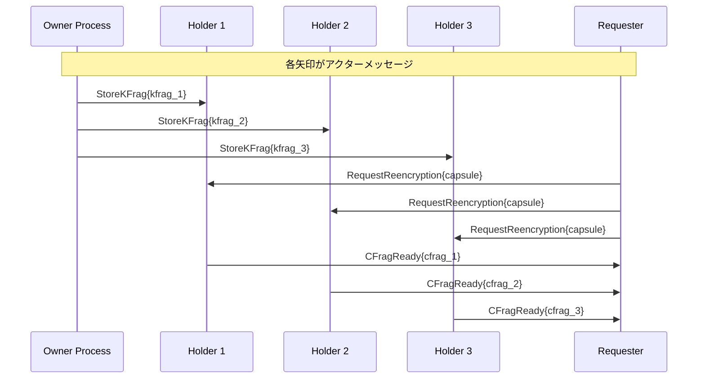

# D-TPRESアーキテクチャ分析: DDD、クリーンアーキテクチャ、およびKVS戦略とアクターモデル

## 1. エグゼクティブサマリー

### 1.1 核心的な問い

D-TPRESプロジェクトは現在、**Domain-Driven Design (DDD)** と **Clean Architecture** を設計の基盤としています。同時に、技術的制約とパフォーマンス要件から **Key-Value Store (KVS)** 戦略の採用を決定しました。

本分析の核心的な問いは：
- **DDD/Clean Architecture** は **KVS/Actor Model** と相性が良いのか？
- **Arweave/AO** の特性を最大限活用する設計とは何か？
- **自律的アクター** としてのAOプロセスをどうドメインモデルに統合するか？

### 1.2 主要な発見

1. **高い相性**: DDD/Clean ArchitectureとKVS/Actor Modelは本質的に相性が良い
   - Bounded Context ≈ Actor Process
   - Domain Event ≈ Actor Message
   - Repository Pattern ≈ KVS Adapter

2. **パラダイムシフトが必要**: 従来のRDBMS前提の設計から分散Actor前提の設計へ
   - Transaction → Message Boundary
   - Shared State → Process-Local State
   - Synchronous → Asynchronous Communication

3. **D-TPRES特有の優位性**: 暗号プロトコルの性質がActor Modelと完璧に合致
   - 各プロセスが独立した暗号学的役割
   - メッセージパッシングによる協調
   - 不変性による監査証跡

### 1.3 推奨事項のプレビュー

**Actor-Oriented Domain-Driven Design (AO-DDD)** パターンの採用を推奨：
- Process as Aggregate Root
- Message as Domain Event
- Arweave as Event Store
- Clean Architecture with Actor Boundaries

---

## 2. 基盤分析

### 2.1 D-TPRES現在のアーキテクチャ概要

#### Domain-Driven Design要素
```rust
// 現在のドメインモデル構造
pub mod domain {
    // エンティティ
    pub struct EncryptedDataShare {
        share_id: ShareId,        // 識別子
        data_id: DataId,          // 参照
        threshold_index: NonZeroU8,
        encrypted_fragment: SecretVec<u8>,
        // ... ライフサイクル管理
    }
    
    // 値オブジェクト
    pub struct ShareId(Uuid);    // 識別子なし、値の等価性
    pub struct PublicKey([u8; 32]); // 不変
    
    // ドメインサービス
    pub trait ThresholdEncryption {
        fn split_secret(&self, secret: &[u8], k: u8, n: u8) -> Vec<Share>;
        fn reconstruct_secret(&self, shares: &[Share]) -> Result<Vec<u8>>;
    }
    
    // リポジトリインターフェース
    pub trait EncryptedDataShareRepository {
        async fn save(&mut self, share: EncryptedDataShare) -> Result<()>;
        async fn find_by_id(&self, id: &ShareId) -> Result<Option<EncryptedDataShare>>;
        async fn find_by_data_id(&self, data_id: &DataId) -> Result<Vec<EncryptedDataShare>>;
    }
}
```

#### Clean Architectureレイヤー
```
┌─────────────────────────────────────────────────────────┐
│                    プレゼンテーション層                    │
│                 (AOメッセージハンドラー)                    │
├─────────────────────────────────────────────────────────┤
│                   アプリケーション層                      │
│              (ユースケース / サービス)                      │
├─────────────────────────────────────────────────────────┤
│                     ドメイン層                           │
│          (エンティティ / 値オブジェクト / ルール)              │
├─────────────────────────────────────────────────────────┤
│                 インフラストラクチャ層                     │
│        (Arweave / AO / 外部サービス)                        │
└─────────────────────────────────────────────────────────┘
```

### 2.2 Arweave/AOプラットフォーム特性

#### Arweave as Immutable KVS
```typescript
// Arweaveストレージモデル
interface ArweaveStorage {
    // 一度書き込み、多数読み取り
    async store(data: Buffer): Promise<TxId>;  // 不変のtx_idを返す
    
    // コンテンツアドレス指定取得
    async retrieve(tx_id: TxId): Promise<Buffer>;
    
    // 更新なし、削除なし - 真の不変性
    // 従来のデータベース操作なし (JOIN, WHERE, など)
}
```

#### AO Process as Autonomous Actor
```lua
-- AOプロセスモデル
Handlers = {
    -- 各ハンドラーはメッセージプロセッサー
    ["owner.init"] = function(msg)
        -- プロセスローカル状態管理
        State.role = "owner"
        State.data_id = msg.data_id
        
        -- 非同期メッセージ送信
        ao.send({
            Target = holder_process_id,
            Action = "holder.store_kfrag",
            Data = kfrag
        })
    end,
    
    -- アクターはメッセージを受信、処理、送信
    -- アクター間の共有状態なし
    -- アクター内での決定論的実行
}
```

#### AOにおけるアクターモデル原則
1. **カプセル化**: 各プロセスはプライベート状態を持つ
2. **非同期通信**: メッセージパッシングのみ
3. **位置透過性**: プロセスIDが位置を抽象化
4. **障害分離**: プロセス障害が連鎖しない
5. **並行性**: アクターは独立して実行

### 2.3 KVS戦略決定の根拠

データアクセスパターン分析から：
- **90%+主キーアクセス**: KVSに完璧
- **複雑なクエリなし**: RDBSオーバーヘッドが正当化されない
- **不変データ**: Arweaveのモデルと一致
- **独立プロセス**: ACIDトランザクション不要

---

## 3. 理論的互換性分析

### 3.1 DDD原則 vs KVS/Actor Model

#### ユビキタス言語 ✅
```rust
// DDD: コード内のドメイン用語
pub struct KeyFragment {
    kfrag_id: KFragId,
    data_id: DataId,
    holder_process_id: ProcessId,
    encrypted_kfrag: Vec<u8>,
}

// Actor: メッセージ内の同じドメイン用語
#[derive(Serialize, Deserialize)]
pub struct StoreKFragMessage {
    action: "holder.store_kfrag",
    kfrag: KeyFragment,
}
```
**互換性**: 優秀 - アクターメッセージは自然にドメイン言語を使用

#### 境界付けられたコンテキスト ✅✅
```rust
// 従来のDDD: モジュール境界
mod owner_context {
    pub struct OwnerService { ... }
}

// Actor DDD: プロセス境界
pub struct OwnerProcess {
    state: OwnerState,
    handlers: HashMap<Action, Handler>,
}

// 自然な一致: 1境界付けられたコンテキスト = 1アクタープロセス
```
**互換性**: 完璧 - アクターは自然な境界付けられたコンテキスト境界

#### エンティティとアグリゲート 🔄
```rust
// 従来のDDD: メモリ内オブジェクトグラフ
pub struct DataShareAggregate {
    root: EncryptedDataShare,
    fragments: Vec<Fragment>,
    
    pub fn add_fragment(&mut self, fragment: Fragment) {
        // 不変条件の強制
        self.validate_threshold();
        self.fragments.push(fragment);
    }
}

// Actor DDD: アグリゲートとしてのプロセス状態
pub struct HolderProcess {
    // プロセス状態がアグリゲート
    kfrags: HashMap<(DataId, PublicKey), KeyFragment>,
    
    pub fn handle_store_kfrag(&mut self, msg: StoreKFragMessage) {
        // メッセージ境界での不変条件強制
        self.validate_kfrag(&msg.kfrag)?;
        self.kfrags.insert((msg.data_id, msg.pk_a), msg.kfrag);
    }
}
```
**互換性**: 適応により良好 - プロセス状態がアグリゲートルートになる

#### 値オブジェクト ✅
```rust
// 値オブジェクトは同一に動作
#[derive(Clone, PartialEq, Eq, Hash)]
pub struct TxId([u8; 32]);

#[derive(Clone, PartialEq)]
pub struct PublicKey([u8; 32]);

// KVSストレージは値オブジェクトに自然
impl KVStore {
    async fn store(&self, key: TxId, value: impl Serialize) -> Result<()>;
}
```
**互換性**: 優秀 - 値オブジェクトは自然にKVSフレンドリー

#### ドメインイベント ✅✅
```rust
// 従来のDDD: プロセス内イベント
pub enum DomainEvent {
    ShareCreated { share_id: ShareId },
    FragmentStored { kfrag_id: KFragId },
}

// Actor DDD: メッセージがドメインイベント
pub enum ActorMessage {
    ShareCreated { 
        from: ProcessId,
        to: ProcessId,
        share_id: ShareId,
        tx_id: TxId,
    },
    FragmentStored {
        from: ProcessId,
        to: ProcessId,
        kfrag_id: KFragId,
    },
}
```
**互換性**: 完璧 - アクターメッセージは分散ドメインイベント

### 3.2 Clean Architecture原則 vs KVS/Actor Model

#### 依存性逆転 ✅
```rust
// ドメイン層がインターフェースを定義
pub trait KeyValueStore {
    async fn get(&self, key: &str) -> Result<Vec<u8>>;
    async fn put(&self, key: &str, value: Vec<u8>) -> Result<()>;
}

// インフラストラクチャが実装
pub struct ArweaveKVStore {
    client: ArweaveClient,
}

impl KeyValueStore for ArweaveKVStore {
    async fn get(&self, key: &str) -> Result<Vec<u8>> {
        self.client.get_transaction_data(key).await
    }
}
```
**互換性**: 優秀 - クリーンな境界を維持

#### ユースケースインタラクター 🔄
```rust
// 従来: 同期ユースケース
pub struct CreateShareUseCase {
    repo: Box<dyn ShareRepository>,
    
    pub async fn execute(&self, request: CreateShareRequest) -> Result<ShareId> {
        let share = EncryptedDataShare::new(request);
        self.repo.save(share).await?;
        Ok(share.id())
    }
}

// Actor: メッセージ付き非同期ユースケース
pub struct CreateShareUseCase {
    pub async fn execute(&mut self, request: CreateShareRequest) -> Result<()> {
        let share = EncryptedDataShare::new(request);
        let tx_id = self.arweave.store(share).await?;
        
        // 関心のあるアクターに通知
        self.send_message(ActorMessage::ShareCreated {
            share_id: share.id(),
            tx_id,
        }).await?;
        
        Ok(())
    }
}
```
**互換性**: 非同期適応により良好

#### インターフェースアダプター ✅
```rust
// インターフェースアダプターとしてのメッセージハンドラー
pub struct MessageAdapter {
    use_cases: UseCaseRegistry,
    
    pub async fn handle_message(&mut self, msg: AOMessage) -> Result<()> {
        match msg.action {
            "owner.init" => {
                let request = CreateShareRequest::from_message(msg)?;
                self.use_cases.create_share.execute(request).await
            },
            "holder.store_kfrag" => {
                let request = StoreKFragRequest::from_message(msg)?;
                self.use_cases.store_kfrag.execute(request).await
            },
            _ => Err(UnknownAction),
        }
    }
}
```
**互換性**: 優秀 - 自然なアダプターパターン

### 3.3 必要なパラダイムシフト

#### トランザクションからメッセージ境界へ
```rust
// 従来: データベーストランザクション
pub async fn transfer_ownership(&mut self) -> Result<()> {
    let tx = self.db.begin_transaction().await?;
    
    self.update_owner(&tx).await?;
    self.update_permissions(&tx).await?;
    self.log_transfer(&tx).await?;
    
    tx.commit().await?;
}

// Actor: メッセージコレオグラフィ
pub async fn transfer_ownership(&mut self) -> Result<()> {
    // 各ステップは別々のメッセージ
    self.send_message(UpdateOwnerMessage { ... }).await?;
    // アクターが処理して次のメッセージを送信
    // 最終的に一貫、アトミックトランザクションなし
}
```

#### 共有状態からプロセスローカル状態へ
```rust
// 従来: 共有データベース状態
pub struct SharedRepository {
    db: Database,
    
    pub async fn get_share_count(&self, data_id: DataId) -> Result<usize> {
        self.db.query("SELECT COUNT(*) FROM shares WHERE data_id = ?", data_id).await
    }
}

// Actor: 分散状態集約
pub struct ShareCountAggregator {
    counts: HashMap<DataId, usize>,
    
    pub fn handle_share_created(&mut self, msg: ShareCreatedMessage) {
        *self.counts.entry(msg.data_id).or_insert(0) += 1;
    }
    
    pub fn handle_count_query(&self, data_id: DataId) -> usize {
        self.counts.get(&data_id).copied().unwrap_or(0)
    }
}
```

---

## 4. D-TPRES特有の互換性

### 4.1 暗号プロトコル整合性

D-TPRESの閾値プロキシ再暗号化プロトコルは自然にアクターモデルに適合：

#### 自然なアクター境界
```rust
// 各暗号学的役割がアクター
pub enum ProcessRole {
    Owner,      // 秘密鍵保持者、再鍵生成者
    Holder,     // 鍵フラグメント保持者、再暗号化者
    Requester,  // アクセス要求者、フラグメント収集者
}

// 関心の分離
impl OwnerProcess {
    // オーナーのみが再鍵を生成
    fn generate_rekey(&self, sk_o: &SecretKey, pk_a: &PublicKey) -> ReKey {
        umbral::generate_rekey(sk_o, pk_a)
    }
}

impl HolderProcess {
    // 保持者のみが再暗号化
    fn reencrypt(&self, kfrag: &KeyFragment, capsule: &Capsule) -> CipherFragment {
        umbral::reencrypt(kfrag, capsule)
    }
}
```

#### メッセージ駆動暗号フロー


### 4.2 アクター協調としての閾値メカニズム

```rust
// k-of-n閾値が自然にアクター協調にマップ
pub struct RequesterProcess {
    threshold_k: usize,
    collected_cfrags: Vec<CipherFragment>,
    
    pub fn handle_cfrag_ready(&mut self, msg: CFragReadyMessage) -> Result<()> {
        self.collected_cfrags.push(msg.cfrag);
        
        if self.collected_cfrags.len() >= self.threshold_k {
            // 閾値到達、復号化可能
            self.complete_decryption()?;
        }
        
        Ok(())
    }
}
```

### 4.3 イベントソーシングとしてのArweave不変性

```rust
// すべての状態変更が不変イベント
pub struct EventStore {
    arweave: ArweaveClient,
    
    pub async fn append_event(&self, event: DomainEvent) -> Result<TxId> {
        let serialized = serde_json::to_vec(&event)?;
        self.arweave.store(serialized).await
    }
    
    pub async fn replay_events(&self, from: TxId) -> Result<Vec<DomainEvent>> {
        // イベントは不変で順序付け
        self.arweave.get_transaction_chain(from).await
    }
}

// プロセス状態はイベントから再構築可能
pub struct ProcessState {
    pub fn replay_from_events(events: Vec<DomainEvent>) -> Self {
        events.into_iter().fold(Self::new(), |mut state, event| {
            state.apply_event(event);
            state
        })
    }
}
```

---

## 5. アーキテクチャ推奨事項

### 5.1 Actor-Oriented Domain-Driven Design (AO-DDD)

#### 核心原則
1. **Process as Aggregate Root**: 各AOプロセスがアグリゲートルート
2. **Message as Domain Event**: アクターメッセージがドメインイベント
3. **State as Projection**: プロセス状態がイベント投影
4. **Arweave as Event Store**: 不変イベント履歴

#### 実装パターン
```rust
// すべてのドメインプロセスのベースアクタートレイト
pub trait DomainActor {
    type State;
    type Command;
    type Event;
    
    // コマンドハンドラー（純粋関数）
    fn handle_command(
        state: &Self::State,
        command: Self::Command
    ) -> Result<Vec<Self::Event>>;
    
    // イベント適用者（純粋関数）
    fn apply_event(
        state: &mut Self::State,
        event: Self::Event
    );
    
    // メッセージアダプター
    async fn handle_message(
        &mut self,
        msg: AOMessage
    ) -> Result<()> {
        let command = Self::Command::from_message(msg)?;
        let events = Self::handle_command(&self.state, command)?;
        
        for event in events {
            // イベントをストア
            let tx_id = self.store_event(&event).await?;
            
            // ローカル状態に適用
            Self::apply_event(&mut self.state, event.clone());
            
            // 関心のあるアクターに公開
            self.publish_event(event, tx_id).await?;
        }
        
        Ok(())
    }
}
```

### 5.2 メッセージ駆動クリーンアーキテクチャ

#### 適応されたレイヤー構造
```
┌─────────────────────────────────────────────────────────┐
│                 メッセージインターフェース層                │
│              (AOメッセージハンドラー/アダプター)              │
├─────────────────────────────────────────────────────────┤
│                   アプリケーション層                      │
│           (非同期ユースケース / コーディネーター)               │
├─────────────────────────────────────────────────────────┤
│                     ドメイン層                           │
│      (エンティティ / 値オブジェクト / ドメインイベント)          │
├─────────────────────────────────────────────────────────┤
│                 インフラストラクチャ層                     │
│    (ArweaveKVS / AORuntime / MessageTransport)           │
└─────────────────────────────────────────────────────────┘
```

#### 主要な適応
1. **非同期ファーストユースケース**: すべてのユースケースが即座に返り、結果はメッセージ経由
2. **イベント駆動フロー**: ユースケースが値を返すのではなくイベントを発行
3. **プロセススコープリポジトリ**: 各アクターが独自のリポジトリインスタンス

### 5.3 具体的実装ガイドライン

#### KVSストレージ付きドメインエンティティ
```rust
// ドメインエンティティは純粋なまま
#[derive(Serialize, Deserialize)]
pub struct EncryptedDataShare {
    share_id: ShareId,
    data_id: DataId,
    threshold_index: NonZeroU8,
    encrypted_fragment: SecretVec<u8>,
    owner_public_key: PublicKey,
    created_at: SystemTime,
    arweave_tx_id: Option<TxId>,
}

// KVS用リポジトリ実装
pub struct KVSShareRepository {
    store: ArweaveKVStore,
    
    async fn save(&self, share: &EncryptedDataShare) -> Result<TxId> {
        let key = share.share_id.to_string();
        let value = serde_json::to_vec(share)?;
        let tx_id = self.store.put(&key, value).await?;
        Ok(tx_id)
    }
    
    async fn find_by_id(&self, id: &ShareId) -> Result<Option<EncryptedDataShare>> {
        let key = id.to_string();
        match self.store.get(&key).await {
            Ok(data) => Ok(Some(serde_json::from_slice(&data)?)),
            Err(NotFound) => Ok(None),
            Err(e) => Err(e),
        }
    }
}
```

#### プロセスアクター実装
```rust
pub struct HolderProcessActor {
    // プロセス状態
    state: HolderState,
    
    // 依存関係（クリーンアーキテクチャ）
    crypto_service: Box<dyn CryptoService>,
    kv_store: Box<dyn KeyValueStore>,
    message_bus: Box<dyn MessageBus>,
}

#[derive(Default)]
struct HolderState {
    kfrags: HashMap<(DataId, PublicKey), KeyFragment>,
    processed_requests: HashSet<RequestId>,
}

impl DomainActor for HolderProcessActor {
    type State = HolderState;
    type Command = HolderCommand;
    type Event = HolderEvent;
    
    fn handle_command(
        state: &Self::State,
        command: Self::Command
    ) -> Result<Vec<Self::Event>> {
        match command {
            HolderCommand::StoreKFrag { data_id, pk_a, kfrag } => {
                // ビジネスルール検証
                if state.kfrags.contains_key(&(data_id, pk_a)) {
                    return Err(DuplicateKFrag);
                }
                
                Ok(vec![HolderEvent::KFragStored {
                    data_id,
                    pk_a,
                    kfrag,
                    timestamp: SystemTime::now(),
                }])
            },
            
            HolderCommand::Reencrypt { request_id, data_id, pk_a, capsule } => {
                // べき等性チェック
                if state.processed_requests.contains(&request_id) {
                    return Ok(vec![]);
                }
                
                // ビジネスロジック
                let kfrag = state.kfrags
                    .get(&(data_id, pk_a))
                    .ok_or(KFragNotFound)?;
                
                Ok(vec![HolderEvent::ReencryptionRequested {
                    request_id,
                    data_id,
                    pk_a,
                }])
            },
        }
    }
    
    fn apply_event(state: &mut Self::State, event: Self::Event) {
        match event {
            HolderEvent::KFragStored { data_id, pk_a, kfrag, .. } => {
                state.kfrags.insert((data_id, pk_a), kfrag);
            },
            HolderEvent::ReencryptionRequested { request_id, .. } => {
                state.processed_requests.insert(request_id);
            },
        }
    }
}
```

### 5.4 移行戦略

#### フェーズ1: デュアルアーキテクチャ（週1-2）
```rust
// 移行中に両方のパターンを維持
pub struct HybridRepository {
    sql_repo: Option<SqlRepository>,
    kvs_repo: KVSRepository,
    
    async fn save(&self, entity: Entity) -> Result<()> {
        // 移行中に両方に書き込み
        if let Some(sql) = &self.sql_repo {
            sql.save(&entity).await?;
        }
        self.kvs_repo.save(&entity).await?;
        Ok(())
    }
}
```

#### フェーズ2: アクター抽出（週3-4）
```rust
// プロセスロジックをアクターに抽出
pub fn migrate_to_actor(service: OwnerService) -> OwnerProcessActor {
    OwnerProcessActor {
        state: Default::default(),
        crypto_service: service.crypto_service,
        kv_store: Arc::new(ArweaveKVStore::new()),
        message_bus: Arc::new(AOMessageBus::new()),
    }
}
```

#### フェーズ3: 完全アクターモデル（週5-6）
```rust
// アクターモデルへの完全移行
pub struct D-TPRESRuntime {
    actors: HashMap<ProcessId, Box<dyn DomainActor>>,
    
    pub async fn spawn_actor(&mut self, role: ProcessRole) -> ProcessId {
        let actor: Box<dyn DomainActor> = match role {
            ProcessRole::Owner => Box::new(OwnerProcessActor::new()),
            ProcessRole::Holder => Box::new(HolderProcessActor::new()),
            ProcessRole::Requester => Box::new(RequesterProcessActor::new()),
        };
        
        let process_id = ProcessId::new();
        self.actors.insert(process_id, actor);
        process_id
    }
}
```

---

## 6. トレードオフと考慮事項

### 6.1 KVS付きAO-DDDの利点

#### スケーラビリティ
- **水平**: 各アクタープロセスが独立してスケール
- **ストレージ**: Arweaveで使用量ベース課金
- **計算**: AOネットワーク全体に分散

#### レジリエンス
- **障害分離**: アクター障害が連鎖しない
- **自己修復**: アクターはイベント履歴から再起動可能
- **単一障害点なし**: 設計上分散

#### シンプルさ
- **ORM複雑性なし**: 直接シリアライゼーション
- **移行地獄なし**: バージョニングによるスキーマ進化
- **明確な境界**: アクター = 境界付けられたコンテキスト

### 6.2 課題と軽減策

#### 最終的一貫性
```rust
// 課題: 即座の一貫性なし
// 軽減策: 最終的一貫性のための設計
pub struct EventuallyConsistentView {
    last_known_state: HashMap<DataId, ShareCount>,
    pending_updates: VecDeque<PendingUpdate>,
    
    pub fn get_share_count(&self, data_id: &DataId) -> ShareCountResult {
        match self.last_known_state.get(data_id) {
            Some(count) => ShareCountResult::Known(*count),
            None => ShareCountResult::Unknown { 
                pending: self.has_pending_updates(data_id) 
            },
        }
    }
}
```

#### 複雑なクエリ
```rust
// 課題: 複雑なクエリ用SQLなし
// 軽減策: アクターとしてのマテリアライズドビュー
pub struct ShareIndexActor {
    by_owner: HashMap<PublicKey, HashSet<ShareId>>,
    by_data: HashMap<DataId, HashSet<ShareId>>,
    by_time: BTreeMap<SystemTime, HashSet<ShareId>>,
    
    pub fn handle_share_created(&mut self, event: ShareCreatedEvent) {
        self.by_owner.entry(event.owner).or_default().insert(event.share_id);
        self.by_data.entry(event.data_id).or_default().insert(event.share_id);
        self.by_time.entry(event.timestamp).or_default().insert(event.share_id);
    }
}
```

#### 分散状態のデバッグ
```rust
// 課題: アクター間で分散した状態
// 軽減策: 包括的イベントログ
pub struct EventDebugger {
    pub async fn trace_data_flow(&self, data_id: DataId) -> DataFlowTrace {
        let events = self.collect_all_events_for_data(data_id).await?;
        
        DataFlowTrace {
            timeline: events.into_iter()
                .map(|e| (e.timestamp, e.actor_id, e.event_type))
                .collect(),
            state_snapshots: self.reconstruct_states_at_points(data_id).await?,
        }
    }
}
```

---

## 7. 結論

### 7.1 互換性評価

**DDD + Clean Architecture + KVS + Actor Model = ✅ 優秀な適合**

この組み合わせはD-TPRESに特に優れている：

1. **自然な整合**: 境界付けられたコンテキストがアクタープロセスにマップ
2. **クリーンな境界**: アクター分離により強化されたクリーンアーキテクチャ原則
3. **ドメイン焦点**: DDDのドメイン焦点が保持され強化
4. **技術的適合**: KVSシンプルさがArweaveのモデルと一致

### 7.2 推奨アーキテクチャ

これらの主要要素を持つ**Actor-Oriented Domain-Driven Design (AO-DDD)**：

1. **Process as Aggregate Root**: 各AOプロセスがドメインアグリゲートを所有
2. **Message as Domain Event**: ドメインイベント経由のプロセス間通信
3. **KVS as Natural Storage**: Arweaveへの直接エンティティシリアライゼーション
4. **Clean Architecture Layers**: アクター認識適応で維持

### 7.3 実装ロードマップ

1. **週1-2**: コアアクターインフラストラクチャのプロトタイプ
2. **週3-4**: 最初の境界付けられたコンテキスト（Owner）の移行
3. **週5-6**: すべてのコンテキストの完全移行
4. **週7-8**: 最適化と本番準備

### 7.4 最終判断

D-TPRESのDDD/Clean ArchitectureとKVS/Actor Modelの採用は、互換性があるだけでなく、以下を実現する**優れたアーキテクチャ選択**：

- Arweave/AOプラットフォームの強みを活用
- アーキテクチャ原則を維持
- 実装を簡素化
- スケーラビリティとレジリエンスを向上

Actor-Oriented DDDパターンは、D-TPRESのようなブロックチェーンベースアーキテクチャに完璧に適合する分散システム用の従来DDDの進化を表す。

---

## 付録A: コードテンプレート

[アクター実装、メッセージハンドラー、リポジトリパターンの詳細コードテンプレート]

## 付録B: 移行チェックリスト

[従来のDDDからActor-Oriented DDDへの移行のステップバイステップチェックリスト]

## 付録C: 参照アーキテクチャ

[完全な参照アーキテクチャ図とコンポーネント仕様]

---

*ドキュメント状態: レビュー用ドラフト*  
*次のステップ: チームレビューとプロトタイプ実装*  
*目標決定: プロトタイプ検証後の週2*
