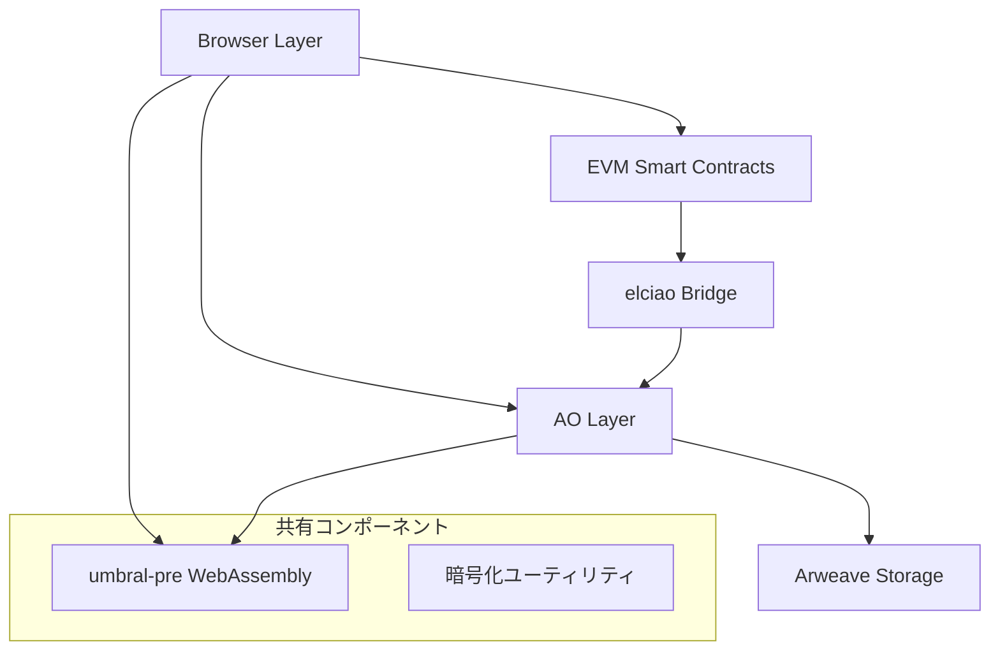
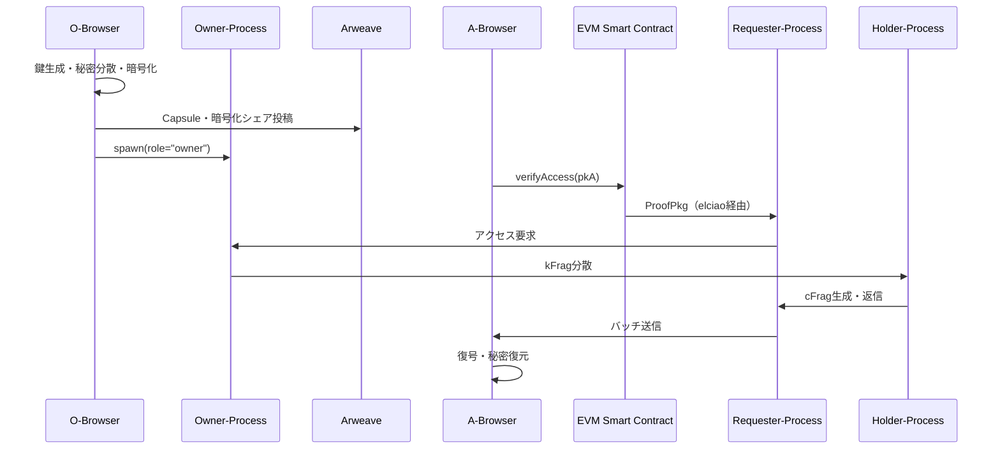

# D-TPRES アーキテクチャ・実装配置戦略（議論用）

> **目的**: D-TPRESシステム全体の設計アーキテクチャとブラウザ側実装の最適な配置戦略について議論・決定するための文書

---

## 1. 現状分析

### 1.1 既存実装状況

#### Rustコードベース（`src/`）
```
src/
├── main.rs     # AO WebAssembly エントリーポイント
└── di.rs       # 依存性注入（プレースホルダー）
```

- **対象環境**: AO Network（WebAssembly実行環境）
- **役割**: Owner-Process、Holder-Process、Requester-Process の統合ロジック
- **暗号化**: umbral-pre ライブラリを使用した TPRE 実装
- **現状**: 初期段階、プレースホルダー実装

#### 文書化された要件
- **O-Browser**: データ所有者フロントエンド（WebCrypto API、Shamir分散）
- **A-Browser**: アクセス者フロントエンド（EVM連携、復号処理）
- **技術スタック**: TypeScript、WebCrypto、MetaMask、umbral-pre（Wasm）

### 1.2 技術的依存関係



## 2. システム全体アーキテクチャ

### 2.1 レイヤー構成

#### Browser Layer
- **O-Browser**: 秘密分散・暗号化・Arweave投稿
- **A-Browser**: アクセス要求・復号・秘密復元
- **技術**: TypeScript + WebCrypto API + MetaMask

#### AO Layer
- **Owner-Process**: 再暗号化鍵生成・kFrag分散
- **Holder-Process**: kFrag保持・プロキシ再暗号化
- **Requester-Process**: cFrag収集・バッチ配信
- **技術**: Rust WebAssembly + umbral-pre

#### Storage Layer
- **Arweave**: 暗号化データ・Capsule・メッセージログ
- **EVM**: アクセス制御条件・検証イベント

### 2.2 データフロー



## 3. 実装配置戦略の比較

### 3.1 Option A: 単一リポジトリ統合

#### 構成案
```
D-TPRES/
├── src/              # 既存: AO WebAssembly (Rust)
├── browser/          # 新規: ブラウザフロントエンド
│   ├── packages/
│   │   ├── core/     # 共通暗号化ライブラリ
│   │   ├── o-browser/ # データ所有者UI
│   │   └── a-browser/ # アクセス者UI
│   ├── shared/       # 共通型定義・ユーティリティ
│   └── package.json
├── contracts/        # 新規: EVM Smart Contracts
├── wasm/            # umbral-pre WebAssembly ビルド成果物
└── docs/
```

#### メリット
- ✅ **技術的整合性**: Rust WebAssembly の共有が容易
- ✅ **開発効率**: 共通型定義・ユーティリティの一元管理
- ✅ **CI/CD統合**: 単一パイプラインでのビルド・テスト・デプロイ
- ✅ **バージョン管理**: コンポーネント間の整合性保証
- ✅ **ドキュメント統一**: 既存の詳細仕様書を活用可能

#### デメリット
- ❌ **ビルド複雑化**: Rust + TypeScript の混在
- ❌ **デプロイ分離困難**: ブラウザ側の独立デプロイが難しい
- ❌ **チーム分業**: フロントエンド・バックエンドの開発分離が困難

### 3.2 Option B: 分離リポジトリ構成

#### 構成案
```
D-TPRES/                    # AO WebAssembly
├── src/
└── docs/

D-TPRES-browser/           # ブラウザフロントエンド
├── packages/
│   ├── core/
│   ├── o-browser/
│   └── a-browser/
└── docs/

D-TPRES-contracts/         # EVM Smart Contracts
├── contracts/
└── docs/
```

#### メリット
- ✅ **開発分離**: 各チームが独立して開発可能
- ✅ **デプロイ独立**: 個別のリリースサイクル
- ✅ **技術スタック特化**: 最適な開発環境の構築
- ✅ **権限管理**: アクセス制御の細分化

#### デメリット
- ❌ **依存関係管理**: WebAssembly共有の複雑化
- ❌ **整合性保証**: バージョン同期の困難
- ❌ **開発効率**: 共通コード・型定義の重複
- ❌ **CI/CD複雑化**: 複数リポジトリ間の統合テスト

## 4. 技術的考慮事項

### 4.1 WebAssembly共有戦略

#### umbral-pre WebAssembly
- **ビルド**: `wasm-pack` でのブラウザ向けビルド
- **配布**: npm パッケージまたはCDN経由
- **サイズ**: WASM + JSバインディングで約500KB-1MB
- **最適化**: `wee_alloc` + 最小化設定

#### 共有方法の選択肢
1. **npm パッケージ**: `@dtpres/umbral-wasm`
2. **Git submodule**: 共通コンポーネントとして管理
3. **CDN配布**: Arweave上での静的ホスティング

### 4.2 開発・ビルド環境

#### 単一リポジトリの場合
```bash
# Rust WebAssembly
make check          # AO向けビルド
make wasm          # ブラウザ向けWASMビルド

# Browser Frontend
cd browser && npm run dev    # 開発サーバー
cd browser && npm run build  # プロダクションビルド

# 統合テスト
make integration-test
```

#### 分離リポジトリの場合
```bash
# 各リポジトリで独立したビルドサイクル
# 依存関係は package.json または Cargo.toml で管理
```

### 4.3 CI/CD パイプライン

#### 単一リポジトリ
- **利点**: 統合テスト・デプロイの自動化
- **課題**: ビルド時間の増大・複雑な設定

#### 分離リポジトリ
- **利点**: 各コンポーネントの独立したパイプライン
- **課題**: クロスリポジトリテストの複雑化

## 5. 議論ポイント

### 5.1 優先度の高い決定事項

#### A. リポジトリ構成の選択
- [ ] **単一リポジトリ**: 技術的整合性を優先
- [ ] **分離リポジトリ**: 開発・デプロイの独立性を優先

**判断基準**:
- 開発チーム構成（フルスタック vs 専門特化）
- デプロイ要件（統合 vs 独立）
- 技術的依存関係の複雑度

#### B. WebAssembly配布戦略
- [ ] **npm パッケージ**: 標準的なフロントエンド配布
- [ ] **Git submodule**: ソースコード直接共有
- [ ] **CDN/Arweave**: 分散型配布

#### C. ブラウザ側技術スタック
- **必須**: TypeScript + WebCrypto API + MetaMask
- **検討**: フレームワーク（React/Vue/Vanilla）
- **ビルドツール**: Vite + esbuild（高速ビルド）

### 5.2 運用面での考慮事項

#### セキュリティ
- **秘密鍵管理**: IndexedDB暗号化保存 + zeroize
- **依存関係**: WebAssembly + 暗号化ライブラリの検証
- **CORS設定**: AO・Arweave との通信

#### パフォーマンス
- **WebAssembly読み込み**: 遅延読み込み + キャッシュ戦略
- **ブラウザ互換性**: Safari WebCrypto API の制限対応
- **メモリ管理**: 大きなファイルの分割処理

#### 開発体制
- **コードレビュー**: Rust + TypeScript の専門知識
- **テスト戦略**: 単体・統合・E2Eテストの分担
- **ドキュメント**: 各コンポーネントの仕様書メンテナンス

## 6. 推奨案

### 6.1 段階的実装アプローチ

#### Phase 1: 単一リポジトリでプロトタイプ
- 技術的実現可能性の検証
- WebAssembly統合の確立
- 基本的な暗号化フローの実装

#### Phase 2: 構成の最適化
- Phase 1の結果を基に最終構成を決定
- 必要に応じてリポジトリ分離を実施
- CI/CD パイプラインの構築

#### Phase 3: 本格運用
- セキュリティ監査・最適化
- ドキュメント・テストの充実
- 運用・保守体制の確立

### 6.2 初期推奨構成

**単一リポジトリ + 段階的分離**を推奨：

1. **開発初期**: 単一リポジトリで技術的整合性を確保
2. **成熟期**: 必要に応じて専門特化リポジトリに分離
3. **運用期**: 各コンポーネントの独立した運用体制

---

## 決定事項（議論後に記入）

- [ ] リポジトリ構成の最終決定
- [ ] WebAssembly配布方法の選択
- [ ] ブラウザ側フレームワークの決定
- [ ] CI/CD パイプライン設計の承認
- [ ] 開発・運用体制の確立

---

**次のステップ**: この議論の結果を `docs/development/architecture_overview.md` に正式文書として作成