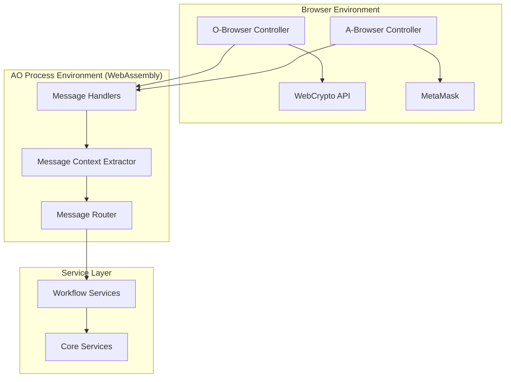

# D-TPRES Controller層設計案（議論用）

> **目的**: D-TPRES Controller層のアーキテクチャと設計方針を議論・決定するための文書
> **前提**: Service層設計（`dtpres_service_layer_design.md`）との整合性を保つ

---

## 1. Controller層の概要

### 1.1 D-TPRES特有のController層構成

D-TPRESにおけるController層は、従来のWebアプリケーションとは異なり、以下の2つの異なる環境で動作します：

1. **AOプロセス環境**: WebAssemblyメッセージハンドラー
2. **Browser環境**: TypeScript/JavaScript Webアプリケーション



### 1.2 Controller層の責務

#### TERASOLUNAガイドラインに基づく基本責務
1. **入力検証**: リクエストデータの妥当性確認
2. **型変換**: Service層が扱うDTOへの変換
3. **Service呼び出し**: ビジネスロジックの実行委譲
4. **レスポンス生成**: 実行結果の適切なフォーマット変換

#### D-TPRES固有の責務
1. **メッセージルーティング**: AOメッセージタグによる処理振り分け
2. **コンテキスト抽出**: メッセージからの必要情報抽出
3. **非同期処理調整**: プロセス間メッセージングの管理
4. **暗号化APIとの統合**: WebCrypto/MetaMaskとの連携

## 2. AOプロセスController設計

### 2.1 MessageHandlerアーキテクチャ

```rust
/// AOメッセージハンドラーの基本構造
/// Controller層の中核実装
pub struct MessageHandler {
    router: MessageRouter,
    validator: MessageValidator,
    context_extractor: MessageContextExtractor,
    service_container: ServiceContainer,
}

impl MessageHandler {
    /// メッセージ処理のエントリーポイント
    pub async fn handle(msg: Message) -> Response {
        // 1. メッセージルーティング
        let route = match self.router.route(&msg) {
            Ok(route) => route,
            Err(e) => return Self::routing_error_response(e),
        };
        
        // 2. 入力検証
        if let Err(e) = self.validator.validate(&msg, &route) {
            return Self::validation_error_response(e);
        }
        
        // 3. コンテキスト抽出
        let context = match self.context_extractor.extract(&msg) {
            Ok(ctx) => ctx,
            Err(e) => return Self::extraction_error_response(e),
        };
        
        // 4. ハンドラー実行
        match route {
            Route::SplitSecret => self.handle_split_secret(context).await,
            Route::AccessRequest => self.handle_access_request(context).await,
            Route::DistributeKFrag => self.handle_distribute_kfrag(context).await,
            Route::ProxyReencrypt => self.handle_proxy_reencrypt(context).await,
            Route::CollectCFrag => self.handle_collect_cfrag(context).await,
            _ => Self::unknown_route_response(),
        }
    }
}
```

### 2.2 メッセージルーティング設計

```rust
/// メッセージルーター実装
/// AOメッセージタグに基づく振り分け
pub struct MessageRouter {
    routes: HashMap<String, Route>,
}

impl MessageRouter {
    pub fn new() -> Self {
        let mut routes = HashMap::new();
        
        // Phase別ルート定義
        routes.insert("Split-Secret".to_string(), Route::SplitSecret);
        routes.insert("Access-Request".to_string(), Route::AccessRequest);
        routes.insert("Distribute-KFrag".to_string(), Route::DistributeKFrag);
        routes.insert("Proxy-Reencrypt".to_string(), Route::ProxyReencrypt);
        routes.insert("Collect-CFrag".to_string(), Route::CollectCFrag);
        
        // Holder固有ルート
        routes.insert("Store-KFrag".to_string(), Route::StoreKFrag);
        routes.insert("Execute-Reencryption".to_string(), Route::ExecuteReencryption);
        
        // 管理系ルート
        routes.insert("Get-Process-Status".to_string(), Route::GetProcessStatus);
        routes.insert("Update-Configuration".to_string(), Route::UpdateConfiguration);
        
        Self { routes }
    }
    
    pub fn route(&self, msg: &Message) -> Result<Route, RoutingError> {
        let action = msg.tags.get("Action")
            .ok_or(RoutingError::MissingAction)?;
        
        self.routes.get(action)
            .cloned()
            .ok_or(RoutingError::UnknownAction(action.clone()))
    }
}

#[derive(Debug, Clone, PartialEq)]
pub enum Route {
    // Phase 1
    SplitSecret,
    
    // Phase 2
    AccessRequest,
    ProcessEvmVerification,
    
    // Phase 3
    DistributeKFrag,
    StoreKFrag,
    
    // Phase 4
    ProxyReencrypt,
    ExecuteReencryption,
    CollectCFrag,
    
    // Management
    GetProcessStatus,
    UpdateConfiguration,
}
```

### 2.3 入力検証戦略

```rust
/// メッセージ検証器
/// Controller層での入力検証を担当
pub struct MessageValidator {
    validators: HashMap<Route, Box<dyn Validator>>,
}

impl MessageValidator {
    pub fn validate(&self, msg: &Message, route: &Route) -> Result<(), ValidationError> {
        // 共通検証
        self.validate_common_fields(msg)?;
        
        // ルート固有検証
        if let Some(validator) = self.validators.get(route) {
            validator.validate(msg)?;
        }
        
        Ok(())
    }
    
    fn validate_common_fields(&self, msg: &Message) -> Result<(), ValidationError> {
        // Process IDの存在確認
        if msg.process_id.is_empty() {
            return Err(ValidationError::MissingProcessId);
        }
        
        // タイムスタンプの妥当性確認
        let current_time = current_timestamp();
        if msg.timestamp > current_time + ALLOWED_CLOCK_DRIFT {
            return Err(ValidationError::InvalidTimestamp);
        }
        
        // 署名検証（オプション）
        if let Some(signature) = &msg.signature {
            self.verify_signature(msg, signature)?;
        }
        
        Ok(())
    }
}

/// Phase 1: 秘密分割の入力検証
pub struct SplitSecretValidator;

impl Validator for SplitSecretValidator {
    fn validate(&self, msg: &Message) -> Result<(), ValidationError> {
        // 必須タグの確認
        let required_tags = ["Secret-Size", "Threshold", "Total-Shares"];
        for tag in required_tags {
            if !msg.tags.contains_key(tag) {
                return Err(ValidationError::MissingRequiredTag(tag.to_string()));
            }
        }
        
        // 閾値の妥当性確認
        let threshold: u8 = msg.tags.get("Threshold")
            .and_then(|v| v.parse().ok())
            .ok_or(ValidationError::InvalidThreshold)?;
        
        let total_shares: u8 = msg.tags.get("Total-Shares")
            .and_then(|v| v.parse().ok())
            .ok_or(ValidationError::InvalidTotalShares)?;
        
        if threshold > total_shares || threshold == 0 {
            return Err(ValidationError::InvalidThresholdConfig {
                threshold,
                total_shares,
            });
        }
        
        // データサイズの確認
        let secret_size: usize = msg.tags.get("Secret-Size")
            .and_then(|v| v.parse().ok())
            .ok_or(ValidationError::InvalidSecretSize)?;
        
        if secret_size > MAX_SECRET_SIZE {
            return Err(ValidationError::SecretTooLarge {
                size: secret_size,
                max_size: MAX_SECRET_SIZE,
            });
        }
        
        Ok(())
    }
}
```

### 2.4 コンテキスト抽出パターン

```rust
/// メッセージコンテキスト抽出器
/// メッセージから必要な情報を構造化して抽出
pub struct MessageContextExtractor;

impl MessageContextExtractor {
    pub fn extract(&self, msg: &Message) -> Result<MessageContext, ExtractionError> {
        let action = msg.tags.get("Action")
            .ok_or(ExtractionError::MissingAction)?
            .clone();
        
        let context = match action.as_str() {
            "Split-Secret" => self.extract_split_secret_context(msg)?,
            "Access-Request" => self.extract_access_request_context(msg)?,
            "Distribute-KFrag" => self.extract_distribute_kfrag_context(msg)?,
            "Proxy-Reencrypt" => self.extract_proxy_reencrypt_context(msg)?,
            _ => self.extract_generic_context(msg)?,
        };
        
        Ok(context)
    }
    
    fn extract_split_secret_context(&self, msg: &Message) -> Result<MessageContext, ExtractionError> {
        Ok(MessageContext::SplitSecret(SplitSecretContext {
            secret_data: msg.data.clone(),
            threshold: self.extract_u8_tag(msg, "Threshold")?,
            total_shares: self.extract_u8_tag(msg, "Total-Shares")?,
            owner_public_key: self.extract_bytes_tag(msg, "Owner-Public-Key")?,
            access_conditions: self.extract_string_list_tag(msg, "Access-Conditions")?,
            metadata: self.extract_metadata(msg),
        }))
    }
    
    fn extract_access_request_context(&self, msg: &Message) -> Result<MessageContext, ExtractionError> {
        Ok(MessageContext::AccessRequest(AccessRequestContext {
            target_secret_id: self.extract_string_tag(msg, "Secret-Id")?,
            accessor_public_key: self.extract_bytes_tag(msg, "Accessor-Public-Key")?,
            requester_process_id: msg.process_id.clone(),
            access_conditions: self.extract_string_list_tag(msg, "Access-Conditions")?,
        }))
    }
    
    // ヘルパーメソッド
    fn extract_string_tag(&self, msg: &Message, tag: &str) -> Result<String, ExtractionError> {
        msg.tags.get(tag)
            .cloned()
            .ok_or(ExtractionError::MissingTag(tag.to_string()))
    }
    
    fn extract_u8_tag(&self, msg: &Message, tag: &str) -> Result<u8, ExtractionError> {
        msg.tags.get(tag)
            .and_then(|v| v.parse().ok())
            .ok_or(ExtractionError::InvalidTagFormat(tag.to_string()))
    }
    
    fn extract_bytes_tag(&self, msg: &Message, tag: &str) -> Result<Vec<u8>, ExtractionError> {
        msg.tags.get(tag)
            .and_then(|v| base64::decode(v).ok())
            .ok_or(ExtractionError::InvalidTagFormat(tag.to_string()))
    }
}

/// 抽出されたコンテキスト
#[derive(Debug, Clone)]
pub enum MessageContext {
    SplitSecret(SplitSecretContext),
    AccessRequest(AccessRequestContext),
    DistributeKFrag(DistributeKFragContext),
    ProxyReencrypt(ProxyReencryptContext),
    Generic(GenericContext),
}
```

### 2.5 具体的なハンドラー実装例

```rust
impl MessageHandler {
    /// Phase 1: 秘密分割ハンドラー
    async fn handle_split_secret(&self, context: MessageContext) -> Response {
        let ctx = match context {
            MessageContext::SplitSecret(ctx) => ctx,
            _ => return Self::invalid_context_response(),
        };
        
        // Service層の呼び出し
        let request = SecretSharingRequest {
            secret_data: ctx.secret_data,
            owner_public_key: ctx.owner_public_key,
            shamir_config: ShamirConfig {
                threshold: ctx.threshold,
                total_shares: ctx.total_shares,
            },
            access_control_conditions: ctx.access_conditions,
            metadata: ctx.metadata,
        };
        
        match self.service_container
            .secret_sharing_service()
            .execute_secret_sharing(request)
            .await
        {
            Ok(result) => Self::split_secret_success_response(result),
            Err(WorkflowError::Business(e)) => Self::business_error_response(e),
            Err(WorkflowError::System(e)) => Self::system_error_response(e),
            Err(WorkflowError::Validation(e)) => Self::validation_error_response(e),
        }
    }
    
    /// Phase 2: アクセス要求ハンドラー
    async fn handle_access_request(&self, context: MessageContext) -> Response {
        let ctx = match context {
            MessageContext::AccessRequest(ctx) => ctx,
            _ => return Self::invalid_context_response(),
        };
        
        let input = AccessRequestInput {
            target_secret_id: ctx.target_secret_id,
            accessor_public_key: ctx.accessor_public_key,
            requester_process_id: ctx.requester_process_id,
            access_conditions: ctx.access_conditions,
        };
        
        match self.service_container
            .access_request_service()
            .execute_access_request(input)
            .await
        {
            Ok(result) => Self::access_request_success_response(result),
            Err(e) => Self::handle_workflow_error(e),
        }
    }
    
    /// Phase 3: kFrag配布ハンドラー
    async fn handle_distribute_kfrag(&self, context: MessageContext) -> Response {
        let ctx = match context {
            MessageContext::DistributeKFrag(ctx) => ctx,
            _ => return Self::invalid_context_response(),
        };
        
        // アクセス要求の検証とkFrag配布
        match self.service_container
            .reencryption_service()
            .execute_kfrag_distribution(&ctx.access_request_id)
            .await
        {
            Ok(result) => Self::kfrag_distribution_success_response(result),
            Err(e) => Self::handle_workflow_error(e),
        }
    }
    
    /// Phase 4: プロキシ再暗号化ハンドラー
    async fn handle_proxy_reencrypt(&self, context: MessageContext) -> Response {
        let ctx = match context {
            MessageContext::ProxyReencrypt(ctx) => ctx,
            _ => return Self::invalid_context_response(),
        };
        
        let request = ReencryptionRequest {
            access_request_id: ctx.access_request_id,
            target_capsule_id: ctx.target_capsule_id,
            holder_process_ids: ctx.holder_process_ids,
            threshold: ctx.threshold,
        };
        
        match self.service_container
            .reencryption_service()
            .execute_proxy_reencryption(request)
            .await
        {
            Ok(result) => Self::proxy_reencrypt_success_response(result),
            Err(e) => Self::handle_workflow_error(e),
        }
    }
}
```

### 2.6 レスポンス生成パターン

```rust
impl MessageHandler {
    /// 成功レスポンスの生成
    fn split_secret_success_response(result: SecretSharingResult) -> Response {
        Response {
            status: ResponseStatus::Success,
            data: ResponseData::SplitSecret {
                secret_id: result.secret_id,
                share_count: result.share_entities.len() as u8,
                capsule_count: result.capsule_entities.len() as u8,
                arweave_transactions: result.arweave_transactions,
            },
            tags: HashMap::from([
                ("Action".to_string(), "Split-Secret-Response".to_string()),
                ("Secret-Id".to_string(), result.secret_id.clone()),
                ("Status".to_string(), "success".to_string()),
            ]),
            timestamp: current_timestamp(),
        }
    }
    
    /// エラーレスポンスの統一生成
    fn handle_workflow_error(error: WorkflowError) -> Response {
        match error {
            WorkflowError::Business(e) => Self::business_error_response(e),
            WorkflowError::System(e) => Self::system_error_response(e),
            WorkflowError::Validation(e) => Self::validation_error_response(e),
        }
    }
    
    /// ビジネスエラーレスポンス
    fn business_error_response(error: BusinessException) -> Response {
        let (code, message) = match &error {
            BusinessException::AccessDenied { secret_id, reason } => (
                "E_ACCESS_DENIED",
                format!("Access denied to secret {}: {}", secret_id, reason),
            ),
            BusinessException::ThresholdNotMet { required, actual } => (
                "E_THRESHOLD_NOT_MET",
                format!("Threshold not met: required {}, actual {}", required, actual),
            ),
            BusinessException::InvalidStateTransition { current_state, requested_state } => (
                "E_INVALID_STATE",
                format!("Invalid state transition from {} to {}", current_state, requested_state),
            ),
            BusinessException::Expired { entity_type, entity_id, .. } => (
                "E_EXPIRED",
                format!("{} {} has expired", entity_type, entity_id),
            ),
            BusinessException::ResourceLimitExceeded { resource_type, limit, requested } => (
                "E_LIMIT_EXCEEDED",
                format!("{} limit exceeded: limit {}, requested {}", resource_type, limit, requested),
            ),
        };
        
        Response {
            status: ResponseStatus::BusinessError,
            data: ResponseData::Error {
                code: code.to_string(),
                message,
                details: Some(serde_json::to_value(&error).unwrap_or_default()),
            },
            tags: HashMap::from([
                ("Error-Type".to_string(), "business".to_string()),
                ("Error-Code".to_string(), code.to_string()),
            ]),
            timestamp: current_timestamp(),
        }
    }
    
    /// システムエラーレスポンス
    fn system_error_response(error: SystemException) -> Response {
        // システムエラーの詳細はログに記録し、クライアントには一般的なメッセージのみ返す
        log::error!("System error occurred: {:?}", error);
        
        Response {
            status: ResponseStatus::SystemError,
            data: ResponseData::Error {
                code: "E_SYSTEM_ERROR".to_string(),
                message: "System error occurred. Please try again later.".to_string(),
                details: None, // セキュリティのため詳細は含めない
            },
            tags: HashMap::from([
                ("Error-Type".to_string(), "system".to_string()),
            ]),
            timestamp: current_timestamp(),
        }
    }
    
    /// 検証エラーレスポンス
    fn validation_error_response(error: ValidationError) -> Response {
        Response {
            status: ResponseStatus::ValidationError,
            data: ResponseData::Error {
                code: "E_VALIDATION_ERROR".to_string(),
                message: format!("Validation error: {}", error),
                details: Some(serde_json::to_value(&error).unwrap_or_default()),
            },
            tags: HashMap::from([
                ("Error-Type".to_string(), "validation".to_string()),
            ]),
            timestamp: current_timestamp(),
        }
    }
}
```

## 3. Browser側Controller設計

### 3.1 O-Browser Controller（データ所有者）

```typescript
// O-Browser Controller実装
// TypeScriptでのController層設計

export class OBrowserController {
    private cryptoService: CryptoService;
    private arweaveService: ArweaveService;
    private aoService: AOService;
    private walletService: WalletService;
    
    constructor(dependencies: ControllerDependencies) {
        this.cryptoService = dependencies.cryptoService;
        this.arweaveService = dependencies.arweaveService;
        this.aoService = dependencies.aoService;
        this.walletService = dependencies.walletService;
    }
    
    /**
     * Phase 0: プロセス生成
     */
    async spawnOwnerProcess(request: SpawnProcessRequest): Promise<SpawnProcessResponse> {
        // 1. 入力検証
        this.validateSpawnRequest(request);
        
        // 2. ウォレット接続確認
        const wallet = await this.walletService.ensureConnected();
        
        // 3. 鍵ペア生成（WebCrypto API）
        const keyPair = await this.cryptoService.generateKeyPair();
        
        // 4. AO Process spawn
        const processId = await this.aoService.spawnProcess({
            module: AO_MODULE_TX_ID,
            tags: {
                'Action': 'Initialize-Process',
                'Role': 'owner',
                'Owner-Public-Key': base64Encode(keyPair.publicKey),
            },
            data: JSON.stringify({
                config: request.processConfig,
                metadata: request.metadata,
            }),
        });
        
        // 5. 秘密鍵の安全な保存（IndexedDB + 暗号化）
        await this.cryptoService.storeSecretKey(
            processId,
            keyPair.secretKey,
            request.passphrase
        );
        
        return {
            processId,
            publicKey: keyPair.publicKey,
            status: 'active',
        };
    }
    
    /**
     * Phase 1: 秘密分割・暗号化
     */
    async splitAndEncryptSecret(request: SplitSecretRequest): Promise<SplitSecretResponse> {
        // 1. 入力検証
        this.validateSplitSecretRequest(request);
        
        // 2. プロセスの存在確認
        const process = await this.aoService.getProcess(request.processId);
        if (!process || process.role !== 'owner') {
            throw new ControllerError('Invalid process or role');
        }
        
        // 3. 秘密鍵の復号（ユーザー認証）
        const secretKey = await this.cryptoService.retrieveSecretKey(
            request.processId,
            request.passphrase
        );
        
        // 4. Shamir分割（ブラウザ側で実行）
        const shares = await this.cryptoService.shamirSplit(
            request.secretData,
            request.threshold,
            request.totalShares
        );
        
        // 5. 各シェアの暗号化とCapsule生成
        const encryptedShares: EncryptedShare[] = [];
        const capsules: Capsule[] = [];
        
        for (let i = 0; i < shares.length; i++) {
            // ランダム鍵生成
            const randomKey = await this.cryptoService.generateRandomKey();
            
            // シェア暗号化（AES-GCM）
            const encryptedShare = await this.cryptoService.aesEncrypt(
                shares[i],
                randomKey
            );
            
            // Capsule生成（PRE暗号化）
            const capsule = await this.cryptoService.createCapsule(
                process.publicKey,
                randomKey
            );
            
            encryptedShares.push({
                index: i + 1,
                data: encryptedShare,
                hash: await this.cryptoService.sha256(encryptedShare),
            });
            
            capsules.push(capsule);
        }
        
        // 6. Arweaveへの投稿
        const arweaveTxIds: string[] = [];
        
        // シェアとCapsuleをペアで投稿
        for (let i = 0; i < encryptedShares.length; i++) {
            const txId = await this.arweaveService.postTransaction({
                data: JSON.stringify({
                    type: 'encrypted-share-with-capsule',
                    share: encryptedShares[i],
                    capsule: capsules[i],
                }),
                tags: {
                    'App-Name': 'D-TPRES',
                    'Type': 'Share-Capsule-Pair',
                    'Secret-Id': request.secretId,
                    'Share-Index': (i + 1).toString(),
                    'Process-Id': request.processId,
                },
            });
            
            arweaveTxIds.push(txId);
        }
        
        // 7. AOプロセスに通知
        const response = await this.aoService.sendMessage(request.processId, {
            action: 'Split-Secret',
            tags: {
                'Secret-Id': request.secretId,
                'Threshold': request.threshold.toString(),
                'Total-Shares': request.totalShares.toString(),
                'Arweave-Transactions': arweaveTxIds.join(','),
            },
            data: JSON.stringify({
                accessControlConditions: request.accessControlConditions,
                metadata: request.metadata,
            }),
        });
        
        return {
            secretId: request.secretId,
            shareCount: encryptedShares.length,
            arweaveTxIds,
            processResponse: response,
            status: 'success',
        };
    }
    
    /**
     * 入力検証メソッド
     */
    private validateSpawnRequest(request: SpawnProcessRequest): void {
        if (!request.walletAddress) {
            throw new ValidationError('Wallet address is required');
        }
        
        if (!request.processConfig || Object.keys(request.processConfig).length === 0) {
            throw new ValidationError('Process configuration is required');
        }
        
        // パスフレーズ強度チェック
        if (!this.isStrongPassphrase(request.passphrase)) {
            throw new ValidationError('Passphrase does not meet security requirements');
        }
    }
    
    private validateSplitSecretRequest(request: SplitSecretRequest): void {
        if (!request.secretData || request.secretData.length === 0) {
            throw new ValidationError('Secret data is required');
        }
        
        if (request.secretData.length > MAX_SECRET_SIZE) {
            throw new ValidationError(`Secret size exceeds maximum allowed (${MAX_SECRET_SIZE} bytes)`);
        }
        
        if (request.threshold > request.totalShares) {
            throw new ValidationError('Threshold cannot exceed total shares');
        }
        
        if (request.threshold < MIN_THRESHOLD) {
            throw new ValidationError(`Threshold must be at least ${MIN_THRESHOLD}`);
        }
        
        if (request.totalShares > MAX_SHARES) {
            throw new ValidationError(`Total shares cannot exceed ${MAX_SHARES}`);
        }
        
        if (!request.accessControlConditions || request.accessControlConditions.length === 0) {
            throw new ValidationError('At least one access control condition is required');
        }
    }
    
    /**
     * エラーハンドリング
     */
    async handleControllerError(error: any): Promise<ErrorResponse> {
        if (error instanceof ValidationError) {
            return {
                type: 'validation',
                code: 'VALIDATION_ERROR',
                message: error.message,
                details: error.details,
            };
        }
        
        if (error instanceof CryptoError) {
            return {
                type: 'crypto',
                code: 'CRYPTO_ERROR',
                message: 'Cryptographic operation failed',
                details: null, // セキュリティのため詳細は含めない
            };
        }
        
        if (error instanceof ArweaveError) {
            return {
                type: 'storage',
                code: 'STORAGE_ERROR',
                message: 'Failed to store data on Arweave',
                details: {
                    retry: true,
                    estimatedWait: error.estimatedWait,
                },
            };
        }
        
        // 予期しないエラー
        console.error('Unexpected error in controller:', error);
        return {
            type: 'system',
            code: 'SYSTEM_ERROR',
            message: 'An unexpected error occurred',
            details: null,
        };
    }
}
```

### 3.2 A-Browser Controller（アクセス者）

```typescript
// A-Browser Controller実装
// アクセス者側のController層

export class ABrowserController {
    private cryptoService: CryptoService;
    private evmService: EVMService;
    private aoService: AOService;
    private metamaskService: MetaMaskService;
    
    /**
     * Phase 2: アクセス要求
     */
    async requestAccess(request: AccessRequest): Promise<AccessResponse> {
        // 1. 入力検証
        this.validateAccessRequest(request);
        
        // 2. MetaMask接続確認
        const account = await this.metamaskService.ensureConnected();
        
        // 3. アクセス者鍵ペア生成
        const accessorKeyPair = await this.cryptoService.generateKeyPair();
        
        // 4. EVM検証用署名生成
        const signature = await this.metamaskService.signMessage({
            message: this.createAccessMessage(request.secretId, accessorKeyPair.publicKey),
            account,
        });
        
        // 5. スマートコントラクト呼び出し
        const verificationTx = await this.evmService.verifyAccess({
            secretId: request.secretId,
            accessorPublicKey: accessorKeyPair.publicKey,
            signature,
            conditions: request.conditions,
        });
        
        // 6. Requester Process spawn
        const requesterProcessId = await this.aoService.spawnProcess({
            module: AO_MODULE_TX_ID,
            tags: {
                'Action': 'Initialize-Process',
                'Role': 'requester',
                'Accessor-Public-Key': base64Encode(accessorKeyPair.publicKey),
                'Target-Secret-Id': request.secretId,
            },
        });
        
        // 7. アクセス要求メッセージ送信
        const response = await this.aoService.sendMessage(requesterProcessId, {
            action: 'Access-Request',
            tags: {
                'Secret-Id': request.secretId,
                'Accessor-Public-Key': base64Encode(accessorKeyPair.publicKey),
                'EVM-Tx-Hash': verificationTx.hash,
                'Access-Conditions': request.conditions.join(','),
            },
            data: JSON.stringify({
                evmVerification: {
                    txHash: verificationTx.hash,
                    blockNumber: verificationTx.blockNumber,
                    contractAddress: VERIFY_ACCESS_CONTRACT,
                },
            }),
        });
        
        // 8. 秘密鍵の安全な保存
        await this.cryptoService.storeSecretKey(
            requesterProcessId,
            accessorKeyPair.secretKey,
            request.passphrase
        );
        
        return {
            requestId: response.requestId,
            requesterProcessId,
            status: 'pending_verification',
            evmTxHash: verificationTx.hash,
        };
    }
    
    /**
     * Phase 5: 秘密復元
     */
    async recoverSecret(request: RecoverSecretRequest): Promise<RecoverSecretResponse> {
        // 1. 入力検証
        this.validateRecoverRequest(request);
        
        // 2. 秘密鍵の復号
        const secretKey = await this.cryptoService.retrieveSecretKey(
            request.requesterProcessId,
            request.passphrase
        );
        
        // 3. cFrag収集状態の確認
        const reencryptionStatus = await this.aoService.getReencryptionStatus(
            request.requesterProcessId,
            request.reencryptionId
        );
        
        if (reencryptionStatus.collectedCFrags.length < reencryptionStatus.threshold) {
            throw new ControllerError(
                `Insufficient cFrags: ${reencryptionStatus.collectedCFrags.length}/${reencryptionStatus.threshold}`
            );
        }
        
        // 4. Arweaveから元のデータ取得
        const shareDataPromises = request.shareIds.map(async (shareId, index) => {
            const txData = await this.arweaveService.getTransaction(shareId);
            const parsed = JSON.parse(txData.data);
            return {
                index: index + 1,
                encryptedShare: parsed.share,
                capsule: parsed.capsule,
            };
        });
        
        const shareData = await Promise.all(shareDataPromises);
        
        // 5. cFragを使用したCapsule変換と復号
        const decryptedShares: Uint8Array[] = [];
        
        for (let i = 0; i < reencryptionStatus.threshold; i++) {
            const { encryptedShare, capsule } = shareData[i];
            const cFrags = reencryptionStatus.collectedCFrags
                .filter(cf => cf.capsuleIndex === i + 1)
                .slice(0, reencryptionStatus.threshold);
            
            // Capsule変換（PRE復号）
            const transformedCapsule = await this.cryptoService.transformCapsule(
                capsule,
                cFrags
            );
            
            // ランダム鍵の復号
            const randomKey = await this.cryptoService.decryptCapsule(
                transformedCapsule,
                secretKey
            );
            
            // シェアの復号（AES-GCM）
            const share = await this.cryptoService.aesDecrypt(
                encryptedShare.data,
                randomKey
            );
            
            decryptedShares.push(share);
        }
        
        // 6. Shamir補間による秘密復元
        const recoveredSecret = await this.cryptoService.shamirReconstruct(
            decryptedShares,
            reencryptionStatus.threshold
        );
        
        // 7. 整合性検証
        const secretHash = await this.cryptoService.sha256(recoveredSecret);
        if (request.expectedHash && secretHash !== request.expectedHash) {
            throw new ControllerError('Secret integrity check failed');
        }
        
        return {
            success: true,
            secret: recoveredSecret,
            hash: secretHash,
            sharesUsed: decryptedShares.length,
        };
    }
    
    /**
     * 進捗追跡
     */
    async trackReencryptionProgress(
        processId: string,
        reencryptionId: string
    ): Promise<ProgressUpdate> {
        const status = await this.aoService.getReencryptionStatus(
            processId,
            reencryptionId
        );
        
        return {
            reencryptionId,
            phase: this.determinePhase(status),
            progress: {
                current: status.collectedCFrags.length,
                required: status.threshold,
                percentage: (status.collectedCFrags.length / status.threshold) * 100,
            },
            estimatedCompletion: this.estimateCompletion(status),
            holders: status.participatingHolders,
        };
    }
    
    /**
     * エラーリカバリー戦略
     */
    async handleReencryptionTimeout(
        processId: string,
        reencryptionId: string
    ): Promise<RecoveryResponse> {
        // 1. 現在の状態確認
        const status = await this.aoService.getReencryptionStatus(
            processId,
            reencryptionId
        );
        
        // 2. 不足分の特定
        const missingCount = status.threshold - status.collectedCFrags.length;
        
        // 3. 代替Holder検索
        const alternativeHolders = await this.aoService.findAlternativeHolders({
            excludeHolders: status.participatingHolders,
            requiredCount: missingCount,
            secretId: status.secretId,
        });
        
        if (alternativeHolders.length < missingCount) {
            return {
                strategy: 'WAIT_AND_RETRY',
                message: 'Insufficient alternative holders available',
                retryAfter: 300, // 5分後
            };
        }
        
        // 4. 追加リクエスト送信
        const additionalRequest = await this.aoService.sendMessage(processId, {
            action: 'Request-Additional-CFrags',
            tags: {
                'Original-Reencryption-Id': reencryptionId,
                'Target-Holders': alternativeHolders.map(h => h.id).join(','),
                'Missing-Count': missingCount.toString(),
            },
        });
        
        return {
            strategy: 'ALTERNATIVE_HOLDERS',
            message: 'Requesting cFrags from alternative holders',
            newHolders: alternativeHolders,
            estimatedCompletion: Date.now() + 30000, // 30秒
        };
    }
}
```

### 3.3 Browser Controller共通基盤

```typescript
// 共通基盤とユーティリティ

/**
 * Controller基底クラス
 */
export abstract class BaseController {
    protected logger: Logger;
    protected metrics: MetricsCollector;
    
    constructor() {
        this.logger = new Logger(this.constructor.name);
        this.metrics = new MetricsCollector();
    }
    
    /**
     * 操作の実行時間計測デコレータ
     */
    @measureExecutionTime()
    protected async executeWithMetrics<T>(
        operation: string,
        fn: () => Promise<T>
    ): Promise<T> {
        const startTime = Date.now();
        
        try {
            const result = await fn();
            this.metrics.recordSuccess(operation, Date.now() - startTime);
            return result;
        } catch (error) {
            this.metrics.recordFailure(operation, Date.now() - startTime);
            throw error;
        }
    }
    
    /**
     * リトライ可能な操作の実行
     */
    protected async executeWithRetry<T>(
        operation: () => Promise<T>,
        options: RetryOptions = {}
    ): Promise<T> {
        const {
            maxAttempts = 3,
            delay = 1000,
            backoff = 2,
            shouldRetry = (error: any) => true,
        } = options;
        
        let lastError: any;
        
        for (let attempt = 1; attempt <= maxAttempts; attempt++) {
            try {
                return await operation();
            } catch (error) {
                lastError = error;
                
                if (attempt === maxAttempts || !shouldRetry(error)) {
                    throw error;
                }
                
                const waitTime = delay * Math.pow(backoff, attempt - 1);
                this.logger.warn(
                    `Attempt ${attempt} failed, retrying in ${waitTime}ms`,
                    { error }
                );
                
                await this.sleep(waitTime);
            }
        }
        
        throw lastError;
    }
    
    private sleep(ms: number): Promise<void> {
        return new Promise(resolve => setTimeout(resolve, ms));
    }
}

/**
 * 入力検証基底クラス
 */
export abstract class InputValidator {
    protected errors: ValidationError[] = [];
    
    protected addError(field: string, message: string, code?: string): void {
        this.errors.push({
            field,
            message,
            code: code || 'VALIDATION_ERROR',
        });
    }
    
    protected validate(): void {
        if (this.errors.length > 0) {
            throw new ValidationException(this.errors);
        }
    }
    
    protected validateRequired(value: any, field: string): void {
        if (!value || (typeof value === 'string' && value.trim() === '')) {
            this.addError(field, `${field} is required`, 'REQUIRED');
        }
    }
    
    protected validateRange(
        value: number,
        min: number,
        max: number,
        field: string
    ): void {
        if (value < min || value > max) {
            this.addError(
                field,
                `${field} must be between ${min} and ${max}`,
                'RANGE'
            );
        }
    }
    
    protected validateArrayLength(
        array: any[],
        min: number,
        max: number,
        field: string
    ): void {
        if (!Array.isArray(array)) {
            this.addError(field, `${field} must be an array`, 'TYPE');
            return;
        }
        
        if (array.length < min || array.length > max) {
            this.addError(
                field,
                `${field} must contain between ${min} and ${max} items`,
                'ARRAY_LENGTH'
            );
        }
    }
    
    protected validateHex(value: string, field: string, expectedLength?: number): void {
        if (!/^0x[0-9a-fA-F]+$/.test(value)) {
            this.addError(field, `${field} must be a valid hex string`, 'FORMAT');
            return;
        }
        
        if (expectedLength && value.length !== expectedLength + 2) { // +2 for '0x'
            this.addError(
                field,
                `${field} must be ${expectedLength} hex characters`,
                'LENGTH'
            );
        }
    }
}

/**
 * 状態管理インターフェース
 */
export interface ControllerState {
    currentProcess?: ProcessInfo;
    pendingOperations: Map<string, PendingOperation>;
    cache: ControllerCache;
}

export class ControllerStateManager {
    private state: ControllerState = {
        pendingOperations: new Map(),
        cache: new ControllerCache(),
    };
    
    async trackOperation(
        operationId: string,
        operation: PendingOperation
    ): Promise<void> {
        this.state.pendingOperations.set(operationId, operation);
        
        // タイムアウト設定
        setTimeout(() => {
            if (this.state.pendingOperations.has(operationId)) {
                this.handleOperationTimeout(operationId);
            }
        }, operation.timeout || 60000); // デフォルト60秒
    }
    
    private handleOperationTimeout(operationId: string): void {
        const operation = this.state.pendingOperations.get(operationId);
        if (operation && operation.onTimeout) {
            operation.onTimeout();
        }
        this.state.pendingOperations.delete(operationId);
    }
}
```

## 4. Controller層の責務分界

### 4.1 明確な責務定義

```typescript
// Controller層の責務定義と境界

/**
 * Controller層が担う責務
 */
export const ControllerResponsibilities = {
    // 1. 入力検証
    INPUT_VALIDATION: {
        description: 'リクエストデータの形式・妥当性検証',
        examples: [
            '必須フィールドの存在確認',
            '値の範囲チェック',
            'フォーマット検証（アドレス、公開鍵等）',
            '相関チェック（threshold <= totalShares）',
        ],
    },
    
    // 2. 型変換
    TYPE_CONVERSION: {
        description: 'UI/MessageとService層DTOの相互変換',
        examples: [
            'Base64エンコード/デコード',
            'Hex文字列とバイト配列の変換',
            'タグからコンテキストオブジェクトへの変換',
            'レスポンスDTOからUIモデルへの変換',
        ],
    },
    
    // 3. サービス調整
    SERVICE_ORCHESTRATION: {
        description: '複数サービスの呼び出し調整',
        examples: [
            'トランザクション境界外での複数サービス連携',
            '非同期処理の調整',
            '外部サービス（Arweave、EVM）との連携',
        ],
    },
    
    // 4. エラーハンドリング
    ERROR_HANDLING: {
        description: 'エラーの適切な変換とレスポンス生成',
        examples: [
            'ビジネス例外のユーザーフレンドリーメッセージ変換',
            'システムエラーの適切な隠蔽',
            'リトライ可能エラーの判定',
        ],
    },
};

/**
 * Controller層が担わない責務（Service層の責務）
 */
export const ServiceResponsibilities = {
    // 1. ビジネスロジック
    BUSINESS_LOGIC: {
        description: 'ドメイン固有のビジネスルール実装',
        examples: [
            '閾値暗号の実際の処理',
            'アクセス権限の判定ロジック',
            '状態遷移の妥当性検証',
        ],
    },
    
    // 2. トランザクション管理
    TRANSACTION_MANAGEMENT: {
        description: 'データ整合性のためのトランザクション制御',
        examples: [
            'Entity更新のアトミック性保証',
            'ロールバック処理',
            '楽観的ロック制御',
        ],
    },
    
    // 3. データアクセス
    DATA_ACCESS: {
        description: 'Repository経由でのデータ操作',
        examples: [
            'Entityの永続化',
            'クエリ実行',
            'キャッシュ管理',
        ],
    },
};
```

### 4.2 レイヤー間の連携パターン

```rust
// Controller-Service連携の標準パターン

/// Controller層の標準実装パターン
impl StandardControllerPattern {
    async fn handle_request<Req, Res>(
        &self,
        request: Req,
        handler: impl Fn(Req) -> Result<Res, ServiceError>,
    ) -> Response {
        // 1. 入力検証（Controller責務）
        if let Err(e) = self.validate_request(&request) {
            return self.validation_error_response(e);
        }
        
        // 2. 型変換（Controller責務）
        let service_input = match self.convert_to_service_input(request) {
            Ok(input) => input,
            Err(e) => return self.conversion_error_response(e),
        };
        
        // 3. Service呼び出し（ビジネスロジック委譲）
        let service_result = match handler(service_input) {
            Ok(result) => result,
            Err(e) => return self.handle_service_error(e),
        };
        
        // 4. レスポンス変換（Controller責務）
        self.convert_to_response(service_result)
    }
    
    /// エラーハンドリングの標準化
    fn handle_service_error(&self, error: ServiceError) -> Response {
        match error {
            ServiceError::Business(e) => {
                // ビジネスエラーは詳細情報を含めて返す
                Response::business_error(
                    self.map_business_error_code(&e),
                    self.create_user_message(&e),
                    Some(self.create_error_details(&e)),
                )
            },
            ServiceError::System(e) => {
                // システムエラーは一般的なメッセージのみ
                log::error!("System error: {:?}", e);
                Response::system_error(
                    "SYSTEM_ERROR",
                    "An error occurred. Please try again later.",
                    None, // 詳細は含めない
                )
            },
            ServiceError::Validation(e) => {
                // 検証エラーは通常Controller層で処理されるべき
                log::warn!("Unexpected validation error in service: {:?}", e);
                Response::validation_error(
                    "VALIDATION_ERROR",
                    "Invalid request data",
                    Some(e.fields),
                )
            },
        }
    }
}
```

## 5. メッセージルーティング詳細設計

### 5.1 動的ルーティング設計

```rust
/// 動的メッセージルーティングシステム
/// Phase別・Role別の柔軟なルーティング
pub struct DynamicMessageRouter {
    routes: HashMap<String, RouteDefinition>,
    middleware: Vec<Box<dyn RoutingMiddleware>>,
}

#[derive(Debug, Clone)]
pub struct RouteDefinition {
    pub route: Route,
    pub required_role: Option<ProcessRole>,
    pub required_phase: Option<Phase>,
    pub validator: Option<Box<dyn MessageValidator>>,
    pub rate_limit: Option<RateLimit>,
}

impl DynamicMessageRouter {
    pub fn new() -> Self {
        let mut router = Self {
            routes: HashMap::new(),
            middleware: vec![],
        };
        
        // ルート定義の登録
        router.register_routes();
        router.register_middleware();
        
        router
    }
    
    fn register_routes(&mut self) {
        // Phase 1ルート
        self.add_route("Split-Secret", RouteDefinition {
            route: Route::SplitSecret,
            required_role: Some(ProcessRole::Owner),
            required_phase: Some(Phase::One),
            validator: Some(Box::new(SplitSecretValidator)),
            rate_limit: Some(RateLimit::new(10, Duration::from_secs(60))), // 10/分
        });
        
        // Phase 2ルート
        self.add_route("Access-Request", RouteDefinition {
            route: Route::AccessRequest,
            required_role: Some(ProcessRole::Requester),
            required_phase: Some(Phase::Two),
            validator: Some(Box::new(AccessRequestValidator)),
            rate_limit: Some(RateLimit::new(100, Duration::from_secs(60))), // 100/分
        });
        
        // Phase 3ルート
        self.add_route("Distribute-KFrag", RouteDefinition {
            route: Route::DistributeKFrag,
            required_role: Some(ProcessRole::Owner),
            required_phase: Some(Phase::Three),
            validator: Some(Box::new(DistributeKFragValidator)),
            rate_limit: None, // レート制限なし
        });
        
        // Holder専用ルート
        self.add_route("Store-KFrag", RouteDefinition {
            route: Route::StoreKFrag,
            required_role: Some(ProcessRole::Holder),
            required_phase: None, // Phase非依存
            validator: Some(Box::new(StoreKFragValidator)),
            rate_limit: Some(RateLimit::new(1000, Duration::from_secs(60))), // 1000/分
        });
        
        // 管理ルート
        self.add_route("Get-Status", RouteDefinition {
            route: Route::GetStatus,
            required_role: None, // 全ロール可
            required_phase: None,
            validator: None,
            rate_limit: Some(RateLimit::new(60, Duration::from_secs(60))), // 60/分
        });
    }
    
    fn register_middleware(&mut self) {
        // 認証ミドルウェア
        self.middleware.push(Box::new(AuthenticationMiddleware));
        
        // レート制限ミドルウェア
        self.middleware.push(Box::new(RateLimitMiddleware));
        
        // ロギングミドルウェア
        self.middleware.push(Box::new(LoggingMiddleware));
        
        // メトリクスミドルウェア
        self.middleware.push(Box::new(MetricsMiddleware));
    }
    
    pub async fn route(&self, msg: &Message) -> Result<ProcessedRoute, RoutingError> {
        // ミドルウェア処理
        for middleware in &self.middleware {
            middleware.process(msg).await?;
        }
        
        // ルート解決
        let action = msg.tags.get("Action")
            .ok_or(RoutingError::MissingAction)?;
        
        let route_def = self.routes.get(action)
            .ok_or(RoutingError::UnknownAction(action.clone()))?;
        
        // ロールチェック
        if let Some(required_role) = &route_def.required_role {
            let process_role = self.get_process_role(msg)?;
            if &process_role != required_role {
                return Err(RoutingError::RoleMismatch {
                    required: required_role.clone(),
                    actual: process_role,
                });
            }
        }
        
        // フェーズチェック
        if let Some(required_phase) = &route_def.required_phase {
            let current_phase = self.get_current_phase(msg)?;
            if &current_phase != required_phase {
                return Err(RoutingError::PhaseMismatch {
                    required: required_phase.clone(),
                    actual: current_phase,
                });
            }
        }
        
        // レート制限チェック
        if let Some(rate_limit) = &route_def.rate_limit {
            rate_limit.check(&msg.process_id)?;
        }
        
        Ok(ProcessedRoute {
            route: route_def.route.clone(),
            context: self.extract_route_context(msg, &route_def)?,
        })
    }
}

/// ルーティングミドルウェアインターフェース
#[async_trait]
pub trait RoutingMiddleware: Send + Sync {
    async fn process(&self, msg: &Message) -> Result<(), RoutingError>;
}

/// 認証ミドルウェア実装
pub struct AuthenticationMiddleware;

#[async_trait]
impl RoutingMiddleware for AuthenticationMiddleware {
    async fn process(&self, msg: &Message) -> Result<(), RoutingError> {
        // 署名検証
        if let Some(signature) = &msg.signature {
            let public_key = self.get_process_public_key(&msg.process_id).await?;
            
            if !self.verify_signature(msg, signature, &public_key) {
                return Err(RoutingError::InvalidSignature);
            }
        }
        
        // タイムスタンプ検証
        let current_time = current_timestamp();
        if (current_time as i64 - msg.timestamp as i64).abs() > MAX_TIME_DRIFT {
            return Err(RoutingError::InvalidTimestamp);
        }
        
        Ok(())
    }
}
```

### 5.2 ハンドラー登録システム

```rust
/// ハンドラー登録・管理システム
pub struct HandlerRegistry {
    handlers: HashMap<Route, Box<dyn MessageHandlerTrait>>,
    interceptors: Vec<Box<dyn HandlerInterceptor>>,
}

#[async_trait]
pub trait MessageHandlerTrait: Send + Sync {
    async fn handle(&self, context: MessageContext) -> Result<Response, HandlerError>;
    fn get_metadata(&self) -> HandlerMetadata;
}

#[derive(Debug, Clone)]
pub struct HandlerMetadata {
    pub name: String,
    pub description: String,
    pub required_capabilities: Vec<String>,
    pub estimated_processing_time_ms: u64,
}

impl HandlerRegistry {
    pub fn new() -> Self {
        let mut registry = Self {
            handlers: HashMap::new(),
            interceptors: vec![],
        };
        
        // ハンドラー登録
        registry.register_handlers();
        
        // インターセプター登録
        registry.register_interceptors();
        
        registry
    }
    
    fn register_handlers(&mut self) {
        // Phase 1ハンドラー
        self.register(
            Route::SplitSecret,
            Box::new(SplitSecretHandler::new())
        );
        
        // Phase 2ハンドラー
        self.register(
            Route::AccessRequest,
            Box::new(AccessRequestHandler::new())
        );
        
        self.register(
            Route::ProcessEvmVerification,
            Box::new(EvmVerificationHandler::new())
        );
        
        // Phase 3ハンドラー
        self.register(
            Route::DistributeKFrag,
            Box::new(DistributeKFragHandler::new())
        );
        
        self.register(
            Route::StoreKFrag,
            Box::new(StoreKFragHandler::new())
        );
        
        // Phase 4ハンドラー
        self.register(
            Route::ProxyReencrypt,
            Box::new(ProxyReencryptHandler::new())
        );
        
        self.register(
            Route::ExecuteReencryption,
            Box::new(ExecuteReencryptionHandler::new())
        );
        
        // 管理ハンドラー
        self.register(
            Route::GetStatus,
            Box::new(GetStatusHandler::new())
        );
    }
    
    fn register_interceptors(&mut self) {
        // 実行前後の処理を追加
        self.interceptors.push(Box::new(LoggingInterceptor));
        self.interceptors.push(Box::new(MetricsInterceptor));
        self.interceptors.push(Box::new(TracingInterceptor));
    }
    
    pub fn register(&mut self, route: Route, handler: Box<dyn MessageHandlerTrait>) {
        self.handlers.insert(route, handler);
    }
    
    pub async fn execute(
        &self,
        route: Route,
        context: MessageContext,
    ) -> Result<Response, HandlerError> {
        let handler = self.handlers.get(&route)
            .ok_or(HandlerError::HandlerNotFound(route))?;
        
        // インターセプター実行（前処理）
        for interceptor in &self.interceptors {
            interceptor.pre_handle(&context, handler.get_metadata()).await?;
        }
        
        // ハンドラー実行
        let result = handler.handle(context.clone()).await;
        
        // インターセプター実行（後処理）
        for interceptor in &self.interceptors {
            interceptor.post_handle(&context, &result).await;
        }
        
        result
    }
}

/// ハンドラーインターセプター
#[async_trait]
pub trait HandlerInterceptor: Send + Sync {
    async fn pre_handle(
        &self,
        context: &MessageContext,
        metadata: HandlerMetadata,
    ) -> Result<(), InterceptorError>;
    
    async fn post_handle(
        &self,
        context: &MessageContext,
        result: &Result<Response, HandlerError>,
    );
}

/// 具体的なハンドラー実装例
pub struct SplitSecretHandler {
    service: Arc<dyn SecretSharingWorkflowService>,
}

#[async_trait]
impl MessageHandlerTrait for SplitSecretHandler {
    async fn handle(&self, context: MessageContext) -> Result<Response, HandlerError> {
        let ctx = match context {
            MessageContext::SplitSecret(ctx) => ctx,
            _ => return Err(HandlerError::InvalidContext),
        };
        
        // Service層への委譲
        let request = SecretSharingRequest::from(ctx);
        
        match self.service.execute_secret_sharing(request).await {
            Ok(result) => Ok(Response::success(result)),
            Err(e) => Err(HandlerError::ServiceError(e)),
        }
    }
    
    fn get_metadata(&self) -> HandlerMetadata {
        HandlerMetadata {
            name: "SplitSecretHandler".to_string(),
            description: "Handles secret splitting and encryption".to_string(),
            required_capabilities: vec!["crypto".to_string(), "storage".to_string()],
            estimated_processing_time_ms: 500,
        }
    }
}
```

## 6. エラーハンドリング詳細設計

### 6.1 統一エラーハンドリング戦略

```typescript
// TypeScript: Browser側の統一エラーハンドリング

/**
 * エラー分類と処理戦略
 */
export class UnifiedErrorHandler {
    private readonly errorStrategies: Map<ErrorType, ErrorStrategy>;
    
    constructor() {
        this.errorStrategies = new Map([
            [ErrorType.Validation, new ValidationErrorStrategy()],
            [ErrorType.Business, new BusinessErrorStrategy()],
            [ErrorType.System, new SystemErrorStrategy()],
            [ErrorType.Network, new NetworkErrorStrategy()],
            [ErrorType.Crypto, new CryptoErrorStrategy()],
        ]);
    }
    
    async handle(error: any, context: ErrorContext): Promise<ErrorResponse> {
        const errorType = this.classifyError(error);
        const strategy = this.errorStrategies.get(errorType) || new DefaultErrorStrategy();
        
        // エラーログ記録
        this.logError(error, errorType, context);
        
        // 戦略に基づくエラー処理
        const response = await strategy.handle(error, context);
        
        // ユーザー通知が必要な場合
        if (response.notifyUser) {
            await this.notifyUser(response);
        }
        
        // リカバリーアクションが必要な場合
        if (response.recoveryAction) {
            await this.executeRecovery(response.recoveryAction);
        }
        
        return response;
    }
    
    private classifyError(error: any): ErrorType {
        if (error instanceof ValidationError) return ErrorType.Validation;
        if (error instanceof BusinessError) return ErrorType.Business;
        if (error instanceof NetworkError) return ErrorType.Network;
        if (error instanceof CryptoError) return ErrorType.Crypto;
        if (error.code && error.code.startsWith('E_')) return ErrorType.Business;
        return ErrorType.System;
    }
    
    private logError(error: any, type: ErrorType, context: ErrorContext): void {
        const logEntry = {
            timestamp: new Date().toISOString(),
            type,
            message: error.message,
            stack: error.stack,
            context,
            userAgent: navigator.userAgent,
            sessionId: context.sessionId,
        };
        
        // 重要度に応じたログレベル
        switch (type) {
            case ErrorType.System:
            case ErrorType.Crypto:
                console.error('Critical error:', logEntry);
                // リモートログ送信
                this.sendToRemoteLogging(logEntry);
                break;
            case ErrorType.Business:
                console.warn('Business error:', logEntry);
                break;
            case ErrorType.Validation:
                console.info('Validation error:', logEntry);
                break;
        }
    }
}

/**
 * エラー戦略インターフェース
 */
interface ErrorStrategy {
    handle(error: any, context: ErrorContext): Promise<ErrorResponse>;
}

/**
 * 検証エラー戦略
 */
class ValidationErrorStrategy implements ErrorStrategy {
    async handle(error: ValidationError, context: ErrorContext): Promise<ErrorResponse> {
        return {
            type: ErrorType.Validation,
            code: 'VALIDATION_ERROR',
            message: 'Please check your input',
            details: error.errors.map(e => ({
                field: e.field,
                message: e.message,
                suggestion: this.getSuggestion(e),
            })),
            notifyUser: true,
            recoveryAction: null,
        };
    }
    
    private getSuggestion(error: FieldError): string | null {
        // フィールド別の具体的な修正提案
        const suggestions: Record<string, string> = {
            'threshold': 'Threshold must be less than or equal to total shares',
            'secretSize': 'Please reduce the size of your secret data',
            'publicKey': 'Please ensure your wallet is properly connected',
        };
        
        return suggestions[error.field] || null;
    }
}

/**
 * ビジネスエラー戦略
 */
class BusinessErrorStrategy implements ErrorStrategy {
    async handle(error: BusinessError, context: ErrorContext): Promise<ErrorResponse> {
        const userMessage = this.getUserFriendlyMessage(error);
        const recoveryAction = this.determineRecoveryAction(error);
        
        return {
            type: ErrorType.Business,
            code: error.code,
            message: userMessage,
            details: error.details,
            notifyUser: true,
            recoveryAction,
        };
    }
    
    private getUserFriendlyMessage(error: BusinessError): string {
        const messages: Record<string, string> = {
            'E_ACCESS_DENIED': 'You do not have permission to access this data',
            'E_THRESHOLD_NOT_MET': 'Not enough key fragments available. Please try again later',
            'E_EXPIRED': 'This request has expired. Please create a new one',
            'E_LIMIT_EXCEEDED': 'You have exceeded the allowed limit. Please wait before trying again',
        };
        
        return messages[error.code] || 'An error occurred processing your request';
    }
    
    private determineRecoveryAction(error: BusinessError): RecoveryAction | null {
        switch (error.code) {
            case 'E_THRESHOLD_NOT_MET':
                return {
                    type: 'RETRY',
                    delay: 30000,
                    maxAttempts: 3,
                };
            case 'E_EXPIRED':
                return {
                    type: 'REDIRECT',
                    target: '/request/new',
                };
            case 'E_LIMIT_EXCEEDED':
                return {
                    type: 'WAIT',
                    duration: error.retryAfter || 60000,
                };
            default:
                return null;
        }
    }
}

/**
 * システムエラー戦略
 */
class SystemErrorStrategy implements ErrorStrategy {
    async handle(error: any, context: ErrorContext): Promise<ErrorResponse> {
        // システムエラーの詳細は隠蔽
        const errorId = this.generateErrorId();
        
        // 詳細ログを保存
        await this.saveErrorDetails(errorId, error, context);
        
        return {
            type: ErrorType.System,
            code: 'E_SYSTEM_ERROR',
            message: 'An unexpected error occurred. Our team has been notified.',
            details: {
                errorId,
                timestamp: new Date().toISOString(),
            },
            notifyUser: true,
            recoveryAction: {
                type: 'RELOAD',
                delay: 5000,
            },
        };
    }
    
    private generateErrorId(): string {
        return `ERR_${Date.now()}_${Math.random().toString(36).substr(2, 9)}`;
    }
    
    private async saveErrorDetails(
        errorId: string,
        error: any,
        context: ErrorContext
    ): Promise<void> {
        // IndexedDBに詳細を保存（デバッグ用）
        const errorDetails = {
            id: errorId,
            timestamp: Date.now(),
            error: {
                message: error.message,
                stack: error.stack,
                name: error.name,
            },
            context,
            environment: {
                userAgent: navigator.userAgent,
                url: window.location.href,
                memory: (performance as any).memory,
            },
        };
        
        // 保存処理
        await this.persistError(errorDetails);
    }
}
```

### 6.2 AO側エラーハンドリング

```rust
// Rust: AO Process側の統一エラーハンドリング

/// エラーハンドリングトレイト
pub trait ErrorHandler {
    fn handle_error(&self, error: Error, context: &ErrorContext) -> Response;
    fn should_retry(&self, error: &Error) -> bool;
    fn get_retry_delay(&self, error: &Error, attempt: u32) -> Duration;
}

/// 統一エラーハンドラー実装
pub struct UnifiedErrorHandler {
    strategies: HashMap<ErrorCategory, Box<dyn ErrorHandlingStrategy>>,
    metrics: ErrorMetrics,
}

impl UnifiedErrorHandler {
    pub fn new() -> Self {
        let mut strategies: HashMap<ErrorCategory, Box<dyn ErrorHandlingStrategy>> = HashMap::new();
        
        strategies.insert(ErrorCategory::Validation, Box::new(ValidationErrorStrategy));
        strategies.insert(ErrorCategory::Business, Box::new(BusinessErrorStrategy));
        strategies.insert(ErrorCategory::System, Box::new(SystemErrorStrategy));
        strategies.insert(ErrorCategory::Crypto, Box::new(CryptoErrorStrategy));
        strategies.insert(ErrorCategory::Network, Box::new(NetworkErrorStrategy));
        
        Self {
            strategies,
            metrics: ErrorMetrics::new(),
        }
    }
    
    pub fn handle(&mut self, error: Error, context: &ErrorContext) -> Response {
        let category = self.categorize_error(&error);
        
        // メトリクス記録
        self.metrics.record_error(&category, &error);
        
        // ログ記録
        self.log_error(&error, &category, context);
        
        // 戦略に基づく処理
        let strategy = self.strategies.get(&category)
            .unwrap_or(&self.default_strategy());
        
        strategy.handle(error, context)
    }
    
    fn categorize_error(&self, error: &Error) -> ErrorCategory {
        match error {
            Error::Validation(_) => ErrorCategory::Validation,
            Error::Business(_) => ErrorCategory::Business,
            Error::Crypto(_) => ErrorCategory::Crypto,
            Error::Storage(_) => ErrorCategory::System,
            Error::MessageRouting(_) => ErrorCategory::Network,
            _ => ErrorCategory::System,
        }
    }
    
    fn log_error(&self, error: &Error, category: &ErrorCategory, context: &ErrorContext) {
        let log_entry = ErrorLogEntry {
            timestamp: current_timestamp(),
            category: category.clone(),
            error: error.to_string(),
            context: context.clone(),
            process_id: ao::id(),
            message_id: context.message_id.clone(),
        };
        
        match category {
            ErrorCategory::System | ErrorCategory::Crypto => {
                log::error!("Critical error: {:?}", log_entry);
                // Arweaveにエラーログを永続化
                self.persist_critical_error(&log_entry);
            },
            ErrorCategory::Business => {
                log::warn!("Business error: {:?}", log_entry);
            },
            ErrorCategory::Validation => {
                log::info!("Validation error: {:?}", log_entry);
            },
            _ => {
                log::debug!("Error: {:?}", log_entry);
            },
        }
    }
}

/// エラー処理戦略トレイト
trait ErrorHandlingStrategy: Send + Sync {
    fn handle(&self, error: Error, context: &ErrorContext) -> Response;
}

/// ビジネスエラー戦略
struct BusinessErrorStrategy;

impl ErrorHandlingStrategy for BusinessErrorStrategy {
    fn handle(&self, error: Error, context: &ErrorContext) -> Response {
        if let Error::Business(be) = error {
            let user_message = self.get_user_message(&be);
            let error_code = self.get_error_code(&be);
            
            Response {
                status: ResponseStatus::BusinessError,
                data: ResponseData::Error {
                    code: error_code,
                    message: user_message,
                    details: Some(self.get_error_details(&be)),
                },
                tags: HashMap::from([
                    ("Error-Type".to_string(), "business".to_string()),
                    ("Error-Code".to_string(), error_code.clone()),
                    ("Retry-Able".to_string(), self.is_retryable(&be).to_string()),
                ]),
                timestamp: current_timestamp(),
            }
        } else {
            // フォールバック
            Response::error("Unexpected error type")
        }
    }
}

/// エラーメトリクス収集
#[derive(Debug, Clone)]
pub struct ErrorMetrics {
    counters: Arc<Mutex<HashMap<String, u64>>>,
    last_errors: Arc<Mutex<VecDeque<ErrorRecord>>>,
}

impl ErrorMetrics {
    pub fn new() -> Self {
        Self {
            counters: Arc::new(Mutex::new(HashMap::new())),
            last_errors: Arc::new(Mutex::new(VecDeque::with_capacity(100))),
        }
    }
    
    pub fn record_error(&self, category: &ErrorCategory, error: &Error) {
        // カウンター更新
        let key = format!("{}:{}", category, error.code());
        let mut counters = self.counters.lock().unwrap();
        *counters.entry(key).or_insert(0) += 1;
        
        // 最新エラー記録
        let mut last_errors = self.last_errors.lock().unwrap();
        if last_errors.len() >= 100 {
            last_errors.pop_front();
        }
        
        last_errors.push_back(ErrorRecord {
            timestamp: current_timestamp(),
            category: category.clone(),
            code: error.code(),
            message: error.to_string(),
        });
    }
    
    pub fn get_error_summary(&self) -> ErrorSummary {
        let counters = self.counters.lock().unwrap();
        let last_errors = self.last_errors.lock().unwrap();
        
        ErrorSummary {
            total_errors: counters.values().sum(),
            errors_by_category: self.summarize_by_category(&counters),
            recent_errors: last_errors.iter().cloned().collect(),
        }
    }
}
```

## 7. 議論ポイント

### 7.1 Controller粒度の決定

#### Option A: Phase毎のController
```rust
// Phase別に独立したController
pub struct Phase1Controller; // 秘密分割
pub struct Phase2Controller; // アクセス要求
pub struct Phase3Controller; // kFrag配布
pub struct Phase4Controller; // 再暗号化
```

**メリット**:
- ✅ PRDとの明確な対応
- ✅ Phase別の独立した開発・テスト
- ✅ 責務の明確な分離

**デメリット**:
- ❌ コードの重複可能性
- ❌ 共通処理の管理が複雑

#### Option B: Action毎の細粒度Controller
```rust
// 各アクションに対応する細かいController
pub struct SplitSecretController;
pub struct StoreKFragController;
pub struct ExecuteReencryptionController;
// ... 多数のController
```

**メリット**:
- ✅ 単一責任の原則に忠実
- ✅ 個別のテストが容易

**デメリット**:
- ❌ Controllerの数が膨大
- ❌ 管理オーバーヘッド

#### Option C: 統合MessageHandler（推奨）
```rust
// 統一されたMessageHandlerとルーティング
pub struct UnifiedMessageHandler {
    router: MessageRouter,
    handlers: HandlerRegistry,
}
```

**推奨理由**:
- ルーティングロジックの一元化
- ハンドラーの動的登録
- ミドルウェアパターンの適用可能

### 7.2 入力検証の厳密度

#### 検証レベルの選択

**Level 1: 基本検証のみ**
- 必須フィールドチェック
- 型チェック

**Level 2: ビジネスルール検証（推奨）**
- 値の範囲チェック
- 相関チェック（threshold <= totalShares）
- フォーマット検証

**Level 3: 完全検証**
- 暗号学的検証
- 状態整合性チェック
- 外部リソース検証

**推奨**: Level 2
- Controller層の責務に適合
- パフォーマンスとセキュリティのバランス

### 7.3 Browser側とAO側の統一性

#### 統一すべき要素
1. **エラーコード体系**
   - 共通のエラーコード定義
   - 一貫したエラーカテゴリ

2. **検証ルール**
   - 同じ検証ロジックの適用
   - 共通の制約定義

3. **メッセージフォーマット**
   - 統一されたリクエスト/レスポンス構造
   - 共通の型定義（可能な範囲で）

#### 独立すべき要素
1. **実装言語固有の機能**
   - Rust: パターンマッチング、所有権
   - TypeScript: async/await、デコレータ

2. **環境固有の処理**
   - Browser: WebCrypto、MetaMask
   - AO: メッセージハンドリング、Arweave

### 7.4 パフォーマンス最適化戦略

#### 最適化ポイント

1. **メッセージルーティング**
   - O(1)のルックアップ実装
   - 早期リターンによる処理短縮

2. **検証処理**
   - 軽量な検証を先に実行
   - 並列検証の活用

3. **エラーハンドリング**
   - エラーパスの最適化
   - ログ出力の非同期化

4. **メモリ使用**
   - 大きなデータの streaming 処理
   - 不要なクローンの削減

#### パフォーマンス目標
- **ルーティング**: < 1ms
- **基本検証**: < 10ms
- **ハンドラー実行**: < 100ms（Service呼び出し除く）
- **エラー処理**: < 5ms

## 8. 実装優先度とまとめ

### 8.1 実装ロードマップ

#### Phase 1: 基盤構築（高優先度）
1. **MessageRouter実装**
   - 基本的なルーティング機能
   - Action-Route マッピング

2. **基本的なエラーハンドリング**
   - 統一エラーレスポンス
   - 基本的なログ機能

3. **Phase 1,2 ハンドラー**
   - SplitSecretHandler
   - AccessRequestHandler

#### Phase 2: 機能拡張（中優先度）
1. **高度なルーティング**
   - ミドルウェアサポート
   - 動的ルート登録

2. **包括的な検証**
   - カスタムバリデータ
   - 相関チェック

3. **Phase 3,4 ハンドラー**
   - DistributeKFragHandler
   - ProxyReencryptHandler

#### Phase 3: 最適化（低優先度）
1. **パフォーマンス最適化**
   - キャッシング
   - 並列処理

2. **監視・メトリクス**
   - 詳細なメトリクス収集
   - パフォーマンス分析

### 8.2 設計まとめ

D-TPRES Controller層は、従来のWebアプリケーションとは異なり、AOプロセス環境とBrowser環境の2つで動作する特殊な要件を持ちます。

**核心設計原則**:
1. **明確な責務分離**: 入力検証、型変換、Service呼び出し、レスポンス生成
2. **統一されたエラーハンドリング**: 一貫したエラー処理戦略
3. **柔軟なメッセージルーティング**: 動的かつ拡張可能なルーティング
4. **環境固有の最適化**: AO/Browser それぞれの特性活用

**推奨実装アプローチ**:
- **統合MessageHandler**: ルーティングとハンドラーの一元管理
- **レベル2検証**: ビジネスルールレベルの入力検証
- **戦略パターン**: エラーハンドリングとルーティング
- **段階的実装**: 基盤→機能→最適化の順序

この設計により、Service層との適切な責務分離を保ちながら、D-TPRES特有の要件に対応したController層を実現できます。

---

**次のステップ**: この議論の結果を `docs/development/controller/` に正式文書として作成