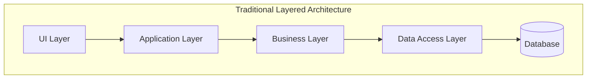
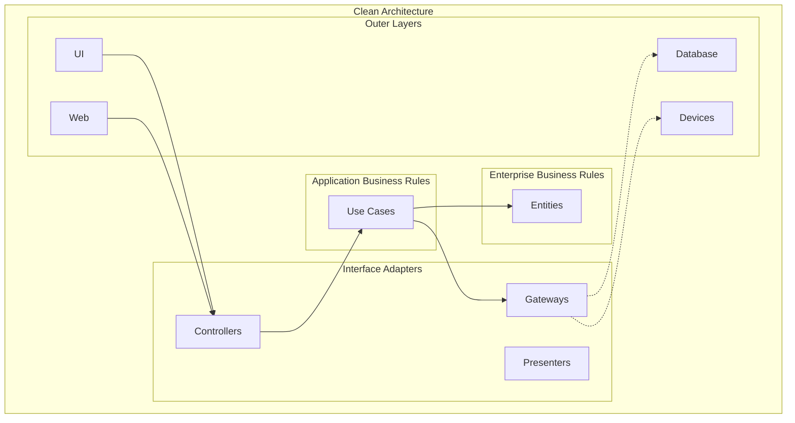
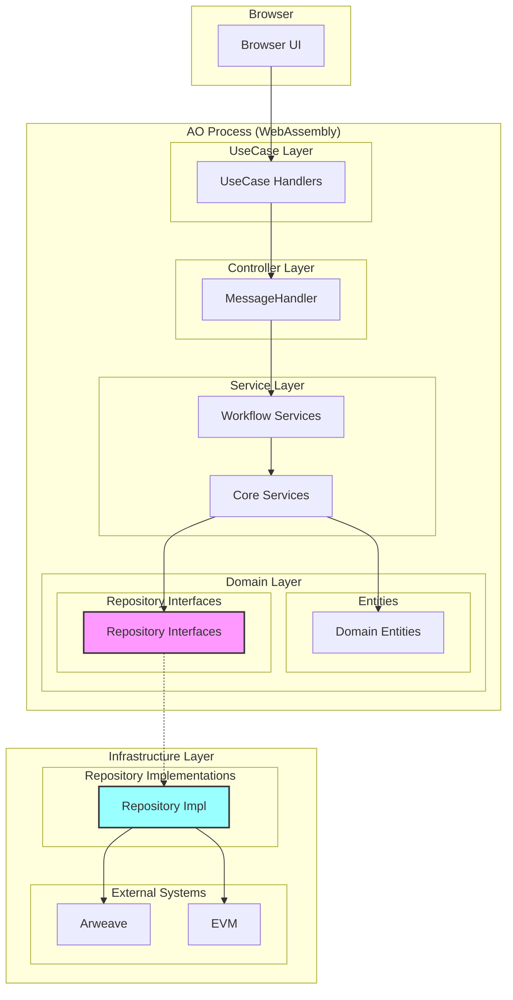
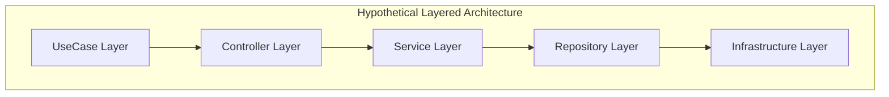

# D-TPRES 依存関係アーキテクチャ設計

## 1. はじめに

本ドキュメントは、D-TPRES（Deterministic Threshold Proxy Re-Encryption System）における依存関係の設計方針について、クリーンアーキテクチャとレイヤードアーキテクチャの観点から検討し、推奨アプローチを定義します。

## 2. アーキテクチャパターンの比較

### 2.1 レイヤードアーキテクチャ



**特徴：**
- 上位層から下位層への一方向の依存
- シンプルで直感的な構造
- 各層が下位層の実装詳細を知っている

### 2.2 クリーンアーキテクチャ



**特徴：**
- 依存性逆転の原則（DIP）の適用
- ビジネスルールが技術的詳細から独立
- インターフェースを介した疎結合

## 3. D-TPRESの現在の依存関係構造

### 3.1 採用アーキテクチャ：クリーンアーキテクチャ

D-TPRESは現在、クリーンアーキテクチャのアプローチを採用しています：



### 3.2 依存の方向性

重要な点は、**Infrastructure層がDomain層のインターフェースに依存している**ことです：

```rust
// Domain層：Repository Interface（抽象）
pub trait ProcessEntityRepository {
    async fn find_by_id(&self, id: &ProcessId) -> Result<Option<ProcessEntity>, RepositoryError>;
    async fn save(&self, entity: &ProcessEntity) -> Result<ProcessId, RepositoryError>;
}

// Infrastructure層：Repository Implementation（具象）
pub struct ProcessEntityRepositoryImpl {
    arweave_client: ArweaveClient,
}

impl ProcessEntityRepository for ProcessEntityRepositoryImpl {
    async fn find_by_id(&self, id: &ProcessId) -> Result<Option<ProcessEntity>, RepositoryError> {
        // Arweave特有の実装
    }
}
```

## 4. クリーンアーキテクチャを採用する理由

### 4.1 D-TPRESの特性

1. **技術的複雑性**
   - Arweave（永続化層）
   - AO Network（実行環境）
   - EVM（スマートコントラクト）
   - WebAssembly（ランタイム）

2. **高い信頼性要求**
   - 暗号化システムとしての正確性
   - 分散環境での一貫性
   - 監査可能性

3. **将来の拡張性**
   - 新しい暗号化アルゴリズムの採用
   - 異なるストレージバックエンドへの対応
   - マルチチェーン対応

### 4.2 クリーンアーキテクチャの利点

1. **テスタビリティの向上**
   ```rust
   // テスト時はモック実装を注入
   struct MockProcessRepository;
   impl ProcessEntityRepository for MockProcessRepository {
       // テスト用の実装
   }
   ```

2. **技術的詳細からの独立**
   - Service層はArweaveの詳細を知らない
   - ビジネスロジックの純粋性を保持

3. **変更の局所化**
   - Arweaveから別のストレージに変更しても、Domain/Service層は影響を受けない

## 5. 実装における考慮事項

### 5.1 依存性注入（DI）の実装

```rust
// DIコンテナの設計
pub struct ServiceContainer {
    // Repository Interfaces
    process_repo: Arc<dyn ProcessEntityRepository>,
    share_repo: Arc<dyn ShareEntityRepository>,
    capsule_repo: Arc<dyn CapsuleEntityRepository>,
    
    // Services
    crypto_service: Arc<CryptoService>,
    workflow_service: Arc<WorkflowService>,
}

impl ServiceContainer {
    pub fn new(config: &Config) -> Self {
        // 実装の注入
        let process_repo = Arc::new(ProcessEntityRepositoryImpl::new(&config.arweave));
        let share_repo = Arc::new(ShareEntityRepositoryImpl::new(&config.arweave));
        
        // Service層の構築
        let crypto_service = Arc::new(CryptoService::new());
        let workflow_service = Arc::new(WorkflowService::new(
            process_repo.clone(),
            crypto_service.clone(),
        ));
        
        Self {
            process_repo,
            share_repo,
            capsule_repo,
            crypto_service,
            workflow_service,
        }
    }
}
```

### 5.2 AO環境での制約と対応

1. **ステートレス実行**
   - 各メッセージ処理でDIコンテナを再構築
   - 軽量な初期化処理の実現

2. **WebAssembly制約**
   - 動的ディスパッチのオーバーヘッドを最小化
   - コンパイル時の最適化を活用

## 6. レイヤードアーキテクチャとの比較

### 6.1 レイヤードアーキテクチャを採用した場合



**問題点：**
- Service層がRepository実装の詳細に依存
- Arweave特有のコードがビジネスロジックに混入
- テスト時に実際のArweave接続が必要

### 6.2 比較結果

| 観点 | クリーンアーキテクチャ | レイヤードアーキテクチャ |
|------|---------------------|---------------------|
| テスタビリティ | ◎ インターフェースのモック化が容易 | △ 実装への直接依存でテストが困難 |
| 保守性 | ◎ 変更の影響範囲が限定的 | △ 下位層の変更が上位層に波及 |
| 実装の複雑性 | △ インターフェースと実装の分離が必要 | ◎ シンプルで直感的 |
| D-TPRES適合性 | ◎ 複雑な技術スタックに対応 | △ 技術的結合が強すぎる |

## 7. 推奨事項

### 7.1 現在のアプローチの継続

D-TPRESは**クリーンアーキテクチャアプローチを継続すべき**です：

1. **技術的複雑性への対応**
   - 複数の外部システムとの統合
   - 各技術の詳細を適切に隔離

2. **高品質なテストの実現**
   - 単体テストの容易性
   - 統合テストの独立性

3. **将来の拡張への備え**
   - 新技術の採用が容易
   - 既存コードへの影響を最小化

### 7.2 実装ガイドライン

1. **インターフェースの設計**
   - Domain層に配置
   - ビジネス観点での命名
   - 技術的詳細を含まない

2. **実装の配置**
   - Infrastructure層に配置
   - 技術特化の最適化を許可
   - エラーハンドリングの適切な変換

3. **依存性注入**
   - コンストラクタインジェクション推奨
   - ライフサイクル管理の明確化
   - テスト用設定の準備

## 8. まとめ

D-TPRESの依存関係設計は、クリーンアーキテクチャの原則に従うことで、以下を実現します：

1. **ビジネスロジックの純粋性**
   - 暗号化アルゴリズムとストレージ技術の分離
   - テスト可能なビジネスルール

2. **技術的柔軟性**
   - Arweave以外のストレージへの移行可能性
   - 新しい暗号化手法の採用

3. **開発効率**
   - 並行開発の促進
   - 明確な責務分離

これらの利点は、D-TPRESのような複雑な分散暗号化システムにおいて、レイヤードアーキテクチャのシンプルさを上回る価値を提供します。

---

**Document Status**: Architecture Design Discussion  
**Version**: 1.0  
**Last Updated**: 2025-01-09
