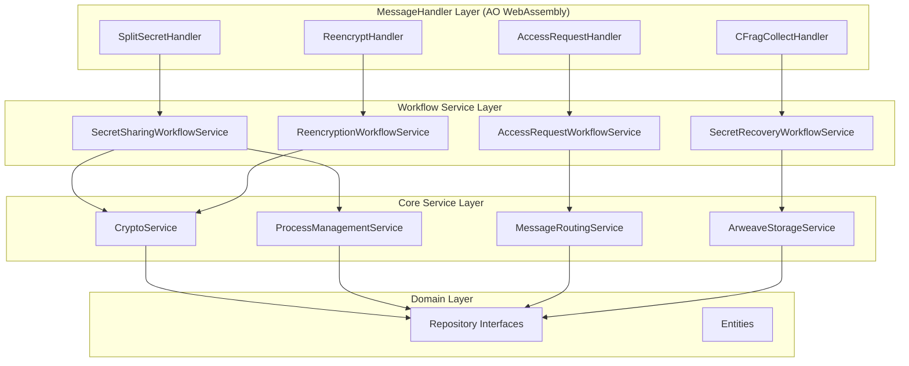

# FORMIX Service層設計案（議論用）

> **目的**: FORMIX Service層のアーキテクチャと設計方針を議論・決定するための文書
> **ベース**: `.claude/ref/clean-arch.md` の設計思想を FORMIX の特性に適用

---

## 1. 設計思想の適用

### 1.1 TERASOLUNA ガイドラインの核心原則

参照元の設計思想から抽出した重要原則：

#### Service層の責務
1. **ビジネスルールの実装**: ドメインロジックの中核
2. **トランザクション境界**: データ整合性の保証
3. **Repository活用**: 永続化処理の委譲
4. **例外ハンドリング**: BusinessException/SystemExceptionの適切な処理

#### Controller-Service責任分界点
- **Controller**: 入力検証、型変換、レスポンス生成
- **Service**: ビジネスルール、データ操作、トランザクション管理

### 1.2 FORMIX特有の考慮事項

#### AOプロセス環境の特性
- **ステートレス実行**: 各メッセージ処理が独立
- **メッセージドリブン**: WebAssemblyハンドラーベース
- **プロセス間協調**: Owner/Holder/Requester間の非同期通信
- **永続化要件**: すべての状態変更をArweaveに保存

#### 暗号化ワークフローの特性
- **Phase別処理**: PRD Phase 0-5の明確なワークフロー
- **閾値暗号**: k-of-n Threshold Proxy Re-Encryptionの複雑性
- **マルチロール**: 単一プロセスでの複数役割同時実行

## 2. Service作成戦略の比較

### 2.1 戦略オプション分析

#### Option A: Entity毎のService作成
```rust
// Entity毎の核となるService
ProcessService          // ProcessEntity管理
SecretSharingService     // ShareEntity + CapsuleEntity管理
AccessControlService     // AccessRequestEntity管理
ReencryptionService      // RekeyFragmentEntity + ReencryptionEntity管理
```

**メリット**:
- ✅ ドメインデータ中心の設計
- ✅ 暗号化操作の共通化
- ✅ Entity操作の一元管理

**デメリット**:
- ❌ Phaseを跨ぐワークフローの実装が複雑
- ❌ AOメッセージハンドラーとの対応が不明確

#### Option B: Phase/UseCase毎のService作成
```rust
// PRD Phase別のService
Phase0Service   // プロセス生成
Phase1Service   // 秘密分割
Phase2Service   // アクセス要求
Phase3Service   // kFrag配布
Phase4Service   // プロキシ再暗号化
Phase5Service   // 復号・復元
```

**メリット**:
- ✅ PRDワークフローとの直接対応
- ✅ AOメッセージハンドラーとの明確な関係
- ✅ Phase別の担当者配置が可能

**デメリット**:
- ❌ 暗号化操作の重複実装
- ❌ 共通処理の分散

#### Option C: ハイブリッドアプローチ（推奨）
```rust
// 1. 共通暗号化サービス（Entity毎）
CryptoService           // umbral-pre, Shamir操作
ProcessManagementService // ProcessEntity統合管理

// 2. ワークフローサービス（Phase毎）
SecretSharingWorkflowService   // Phase 1
AccessRequestWorkflowService   // Phase 2
ReencryptionWorkflowService    // Phase 3-4
SecretRecoveryWorkflowService  // Phase 5

// 3. 横断的サービス
MessageRoutingService          // プロセス間通信
ArweaveStorageService         // 永続化統合
```

### 2.2 推奨アプローチの詳細設計

#### 2.2.1 レイヤー構成



#### 2.2.2 各Service層の責務

**MessageHandler Layer**: 
- AOメッセージの受信・検証
- MessageContextの抽出
- WorkflowServiceの呼び出し
- レスポンス生成

**Workflow Service Layer**:
- PRD Phase別のビジネスロジック実装
- トランザクション境界の設定
- Core Serviceの組み合わせ

**Core Service Layer**:
- ドメイン特化の基本操作
- Entity操作の抽象化
- 共通機能の提供

## 3. Service詳細設計

### 3.1 Core Service層

#### 3.1.1 CryptoService

```rust
/// 暗号化操作の中核サービス
/// Threshold Proxy Re-Encryptionの全操作を担当
#[async_trait]
pub trait CryptoService {
    /// Shamir Secret Sharing による秘密分割
    /// Phase 1で使用
    async fn split_secret_shamir(
        &self,
        secret: &[u8],
        threshold: u8,
        total_shares: u8,
    ) -> Result<Vec<ShamirShare>, CryptoError>;
    
    /// PRE暗号化（Capsule生成）
    /// Phase 1で使用
    async fn create_pre_capsule(
        &self,
        public_key: &PublicKey,
        random_key: &[u8],
    ) -> Result<Capsule, CryptoError>;
    
    /// 再暗号化キー生成
    /// Phase 3で使用
    async fn generate_reencryption_key(
        &self,
        owner_secret_key: &SecretKey,
        accessor_public_key: &PublicKey,
    ) -> Result<ReencryptionKey, CryptoError>;
    
    /// kFrag生成（再暗号化キーのShamir分割）
    /// Phase 3で使用
    async fn create_kfrags(
        &self,
        reencryption_key: &ReencryptionKey,
        threshold: u8,
        total_fragments: u8,
    ) -> Result<Vec<KeyFragment>, CryptoError>;
    
    /// プロキシ再暗号化（cFrag生成）
    /// Phase 4で使用
    async fn proxy_reencrypt(
        &self,
        kfrag: &KeyFragment,
        capsule: &Capsule,
    ) -> Result<CipherFragment, CryptoError>;
    
    /// cFrag結合と復号
    /// Phase 5で使用
    async fn combine_and_decrypt(
        &self,
        cfrags: &[CipherFragment],
        accessor_secret_key: &SecretKey,
        original_capsule: &Capsule,
    ) -> Result<Vec<u8>, CryptoError>;
    
    /// Shamir補間による秘密復元
    /// Phase 5で使用
    async fn reconstruct_secret_shamir(
        &self,
        shares: &[ShamirShare],
        threshold: u8,
    ) -> Result<Vec<u8>, CryptoError>;
}

#[derive(Debug, Clone)]
pub struct CryptoServiceImpl {
    umbral_engine: UmbralEngine,
    shamir_engine: ShamirEngine,
}

impl CryptoServiceImpl {
    pub fn new() -> Self {
        Self {
            umbral_engine: UmbralEngine::new(),
            shamir_engine: ShamirEngine::new(),
        }
    }
}
```

#### 3.1.2 ProcessManagementService

```rust
/// プロセス状態管理の中核サービス
/// ProcessEntityとマルチロール管理を担当
#[async_trait]
pub trait ProcessManagementService {
    /// プロセス初期化（Phase 0）
    async fn initialize_process(
        &self,
        process_id: &str,
        initial_roles: &[ProcessRole],
        config: ProcessConfig,
    ) -> Result<ProcessEntity, ProcessError>;
    
    /// ロール追加
    async fn add_role(
        &self,
        process_id: &str,
        role: ProcessRole,
        role_data: RoleData,
    ) -> Result<(), ProcessError>;
    
    /// 秘密インデックス追加（軽量化されたProcessEntity対応）
    async fn add_secret_index(
        &self,
        process_id: &str,
        secret_index: SecretIndex,
    ) -> Result<(), ProcessError>;
    
    /// アクティブな秘密リスト取得
    async fn get_active_secrets(
        &self,
        process_id: &str,
    ) -> Result<Vec<SecretIndex>, ProcessError>;
    
    /// プロセス状態更新
    async fn update_process_state(
        &self,
        process_id: &str,
        updates: ProcessStateUpdate,
    ) -> Result<ProcessEntity, ProcessError>;
    
    /// マルチロール対応：現在のロール取得
    async fn get_active_roles(
        &self,
        process_id: &str,
    ) -> Result<Vec<ProcessRole>, ProcessError>;
    
    /// パフォーマンスメトリクス更新
    async fn update_metrics(
        &self,
        process_id: &str,
        operation_result: OperationResult,
    ) -> Result<(), ProcessError>;
}

#[derive(Debug, Clone)]
pub enum ProcessRole {
    Owner,
    Holder,
    Requester,
}

#[derive(Debug, Clone)]
pub enum RoleData {
    Owner(OwnerData),
    Holder(HolderData),
    Requester(RequesterData),
}
```

#### 3.1.3 MessageRoutingService

```rust
/// AOプロセス間メッセージルーティングサービス
/// 非同期メッセージングとプロセス間協調を担当
#[async_trait]
pub trait MessageRoutingService {
    /// プロセス間メッセージ送信
    async fn send_message(
        &self,
        target_process_id: &str,
        message: ProcessMessage,
    ) -> Result<MessageId, RoutingError>;
    
    /// ブロードキャストメッセージ送信（Holder群への配布等）
    async fn broadcast_message(
        &self,
        target_processes: &[String],
        message: ProcessMessage,
    ) -> Result<Vec<MessageId>, RoutingError>;
    
    /// メッセージ応答待機
    async fn wait_for_responses(
        &self,
        message_ids: &[MessageId],
        timeout: Duration,
    ) -> Result<Vec<MessageResponse>, RoutingError>;
    
    /// オンラインプロセス発見（Holder選定等）
    async fn discover_online_processes(
        &self,
        role_filter: Option<ProcessRole>,
        capacity_requirement: Option<u64>,
    ) -> Result<Vec<ProcessInfo>, RoutingError>;
    
    /// cFrag収集（Phase 4特化）
    async fn collect_cfrags(
        &self,
        holder_processes: &[String],
        reencryption_request: ReencryptionRequest,
        threshold: u8,
    ) -> Result<Vec<CipherFragment>, RoutingError>;
}

#[derive(Debug, Clone)]
pub struct ProcessMessage {
    pub message_type: MessageType,
    pub payload: Vec<u8>,
    pub tags: HashMap<String, String>,
    pub created_at: u64,
}

#[derive(Debug, Clone)]
pub enum MessageType {
    DistributeKFrag,
    RequestReencryption,
    ResponseCFrag,
    AccessRequest,
    ProofPkgDelivery,
}
```

### 3.2 Workflow Service層

#### 3.2.1 SecretSharingWorkflowService

```rust
/// 秘密分割ワークフローサービス（PRD Phase 1）
/// O-Browserからの秘密暗号化要求を処理
#[async_trait]
pub trait SecretSharingWorkflowService {
    /// 秘密の暗号化・分割・保存ワークフロー
    async fn execute_secret_sharing(
        &self,
        request: SecretSharingRequest,
    ) -> Result<SecretSharingResult, WorkflowError>;
    
    /// 既存秘密の更新
    async fn update_secret(
        &self,
        secret_id: &str,
        update_request: SecretUpdateRequest,
    ) -> Result<(), WorkflowError>;
    
    /// 秘密の無効化
    async fn revoke_secret(
        &self,
        secret_id: &str,
        revocation_reason: String,
    ) -> Result<(), WorkflowError>;
}

#[derive(Debug, Clone)]
pub struct SecretSharingRequest {
    pub secret_data: Vec<u8>,
    pub owner_public_key: Vec<u8>,
    pub shamir_config: ShamirConfig,
    pub access_control_conditions: Vec<String>,
    pub metadata: HashMap<String, String>,
}

#[derive(Debug, Clone)]
pub struct SecretSharingResult {
    pub secret_id: String,
    pub share_entities: Vec<ShareEntity>,
    pub capsule_entities: Vec<CapsuleEntity>,
    pub secret_details: SecretDetailsEntity,
    pub arweave_transactions: Vec<String>,
}

impl SecretSharingWorkflowService {
    /// Phase 1の完全なワークフロー実装
    async fn execute_secret_sharing_impl(
        &self,
        request: SecretSharingRequest,
    ) -> Result<SecretSharingResult, WorkflowError> {
        // 1. 入力検証
        self.validate_sharing_request(&request)?;
        
        // 2. Shamir分割
        let shares = self.crypto_service
            .split_secret_shamir(
                &request.secret_data,
                request.shamir_config.threshold,
                request.shamir_config.total_shares,
            )
            .await?;
        
        // 3. Capsule生成
        let mut capsules = Vec::new();
        for (i, share) in shares.iter().enumerate() {
            let random_key = generate_random_key();
            let capsule = self.crypto_service
                .create_pre_capsule(&request.owner_public_key, &random_key)
                .await?;
            capsules.push(capsule);
        }
        
        // 4. Entity作成
        let secret_id = generate_unique_id();
        let share_entities = self.create_share_entities(&secret_id, &shares);
        let capsule_entities = self.create_capsule_entities(&secret_id, &capsules);
        let secret_details = self.create_secret_details(&secret_id, &request);
        
        // 5. Arweave永続化（トランザクション境界）
        let tx_ids = self.persist_entities_atomically(
            &share_entities,
            &capsule_entities,
            &secret_details,
        ).await?;
        
        // 6. ProcessEntity更新（秘密インデックス追加）
        let secret_index = SecretIndex {
            secret_id: secret_id.clone(),
            status: "active".to_string(),
            entity_references: EntityReferences {
                share_ids: share_entities.iter().map(|s| s.share_id.clone()).collect(),
                capsule_ids: capsule_entities.iter().map(|c| c.capsule_id.clone()).collect(),
                active_requests: vec![],
                details_entity_id: secret_details.details_id.clone(),
            },
            last_updated: current_timestamp(),
            shamir_threshold: request.shamir_config.threshold,
            shamir_total_shares: request.shamir_config.total_shares,
        };
        
        self.process_service
            .add_secret_index(&ao::id(), secret_index)
            .await?;
        
        Ok(SecretSharingResult {
            secret_id,
            share_entities,
            capsule_entities,
            secret_details,
            arweave_transactions: tx_ids,
        })
    }
}
```

#### 3.2.2 AccessRequestWorkflowService

```rust
/// アクセス要求ワークフローサービス（PRD Phase 2）
/// A-Browserからのアクセス要求とEVM検証を処理
#[async_trait]
pub trait AccessRequestWorkflowService {
    /// アクセス要求の作成・検証ワークフロー
    async fn execute_access_request(
        &self,
        request: AccessRequestInput,
    ) -> Result<AccessRequestResult, WorkflowError>;
    
    /// EVM検証結果の処理
    async fn process_evm_verification(
        &self,
        request_id: &str,
        verification_data: EvmVerificationData,
    ) -> Result<(), WorkflowError>;
    
    /// ProofPkg受信処理（elciao経由）
    async fn process_proof_pkg(
        &self,
        request_id: &str,
        proof_pkg: ProofPkgData,
    ) -> Result<(), WorkflowError>;
    
    /// アクセス要求の承認・拒否
    async fn approve_access_request(
        &self,
        request_id: &str,
        approval_decision: ApprovalDecision,
    ) -> Result<(), WorkflowError>;
}

#[derive(Debug, Clone)]
pub struct AccessRequestInput {
    pub target_secret_id: String,
    pub accessor_public_key: Vec<u8>,
    pub requester_process_id: String,
    pub access_conditions: Vec<String>,
}

impl AccessRequestWorkflowService {
    /// Phase 2の完全なワークフロー実装
    async fn execute_access_request_impl(
        &self,
        request: AccessRequestInput,
    ) -> Result<AccessRequestResult, WorkflowError> {
        // 1. 秘密の存在確認
        let secret_index = self.get_secret_index(&request.target_secret_id).await?;
        
        // 2. アクセス制御条件の確認
        let secret_details = self.storage_service
            .load_secret_details(&secret_index.entity_references.details_entity_id)
            .await?;
        
        self.validate_access_conditions(&secret_details, &request.access_conditions)?;
        
        // 3. AccessRequestEntity作成
        let access_request = AccessRequestEntity {
            request_id: generate_unique_id(),
            target_data_id: secret_index.secret_id.clone(),
            target_secret_id: request.target_secret_id.clone(),
            requester_process_id: request.requester_process_id.clone(),
            accessor_public_key: request.accessor_public_key.clone(),
            owner_public_key: secret_details.owner_public_key.clone(),
            evm_verification: Default::default(), // EVMが設定
            proof_pkg: None, // elciaoが設定
            status: "pending".to_string(),
            created_at: current_timestamp(),
            // ... 他のフィールド
        };
        
        // 4. 永続化
        self.storage_service
            .save_access_request(&access_request)
            .await?;
        
        // 5. ProcessEntity更新（アクティブ要求に追加）
        self.process_service
            .add_active_request(&ao::id(), &access_request.request_id)
            .await?;
        
        // 6. EVM検証をトリガー（非同期）
        self.trigger_evm_verification(&access_request).await?;
        
        Ok(AccessRequestResult {
            request_id: access_request.request_id,
            status: "pending_evm_verification".to_string(),
        })
    }
}
```

#### 3.2.3 ReencryptionWorkflowService

```rust
/// 再暗号化ワークフローサービス（PRD Phase 3-4）
/// kFrag配布からcFrag収集までの統合ワークフロー
#[async_trait]
pub trait ReencryptionWorkflowService {
    /// Phase 3: kFrag生成・配布ワークフロー
    async fn execute_kfrag_distribution(
        &self,
        access_request_id: &str,
    ) -> Result<KFragDistributionResult, WorkflowError>;
    
    /// Phase 4: プロキシ再暗号化ワークフロー
    async fn execute_proxy_reencryption(
        &self,
        reencryption_request: ReencryptionRequest,
    ) -> Result<ReencryptionResult, WorkflowError>;
    
    /// cFrag閾値達成確認
    async fn check_threshold_completion(
        &self,
        reencryption_id: &str,
    ) -> Result<ThresholdStatus, WorkflowError>;
}

impl ReencryptionWorkflowService {
    /// Phase 3: kFrag配布の実装
    async fn execute_kfrag_distribution_impl(
        &self,
        access_request_id: &str,
    ) -> Result<KFragDistributionResult, WorkflowError> {
        // 1. アクセス要求の検証
        let access_request = self.storage_service
            .load_access_request(access_request_id)
            .await?;
        
        if access_request.status != "evm_verified" {
            return Err(WorkflowError::InvalidRequestStatus);
        }
        
        // 2. 再暗号化キー生成
        let owner_secret_key = self.get_owner_secret_key().await?;
        let reencryption_key = self.crypto_service
            .generate_reencryption_key(
                &owner_secret_key,
                &PublicKey::from_bytes(&access_request.accessor_public_key)?,
            )
            .await?;
        
        // 3. kFrag生成（Shamir分割）
        let secret_index = self.get_secret_index(&access_request.target_secret_id).await?;
        let kfrags = self.crypto_service
            .create_kfrags(
                &reencryption_key,
                secret_index.shamir_threshold,
                secret_index.shamir_total_shares,
            )
            .await?;
        
        // 4. オンラインHolder発見
        let online_holders = self.message_service
            .discover_online_processes(Some(ProcessRole::Holder), None)
            .await?;
        
        if online_holders.len() < secret_index.shamir_total_shares as usize {
            return Err(WorkflowError::InsufficientHolders);
        }
        
        // 5. Holder選定と配布
        let selected_holders = &online_holders[0..secret_index.shamir_total_shares as usize];
        let mut distribution_results = Vec::new();
        
        for (kfrag, holder) in kfrags.iter().zip(selected_holders.iter()) {
            // RekeyFragmentEntity作成
            let fragment_entity = RekeyFragmentEntity {
                fragment_id: generate_unique_id(),
                secret_id: access_request.target_secret_id.clone(),
                access_request_id: access_request_id.to_string(),
                kfrag_data: kfrag.to_bytes(),
                assigned_holder_id: holder.process_id.clone(),
                status: "created".to_string(),
                // ... 他のフィールド
            };
            
            // Holder に配布
            let message = ProcessMessage {
                message_type: MessageType::DistributeKFrag,
                payload: fragment_entity.to_bytes(),
                tags: HashMap::from([
                    ("Action".to_string(), "Store-KFrag".to_string()),
                    ("Fragment-Id".to_string(), fragment_entity.fragment_id.clone()),
                ]),
                created_at: current_timestamp(),
            };
            
            let message_id = self.message_service
                .send_message(&holder.process_id, message)
                .await?;
            
            distribution_results.push((fragment_entity, message_id));
        }
        
        // 6. 配布結果の確認
        let message_ids: Vec<_> = distribution_results.iter()
            .map(|(_, mid)| mid.clone())
            .collect();
        
        let responses = self.message_service
            .wait_for_responses(&message_ids, Duration::from_secs(30))
            .await?;
        
        // 7. 成功したkFragのみ永続化
        let successful_fragments: Vec<_> = distribution_results.into_iter()
            .zip(responses.iter())
            .filter(|(_, response)| response.is_success())
            .map(|((fragment, _), _)| fragment)
            .collect();
        
        if successful_fragments.len() < secret_index.shamir_threshold as usize {
            return Err(WorkflowError::InsufficientFragmentDistribution);
        }
        
        // 8. RekeyFragmentEntity群を永続化
        for fragment in &successful_fragments {
            self.storage_service
                .save_rekey_fragment(fragment)
                .await?;
        }
        
        Ok(KFragDistributionResult {
            distributed_fragments: successful_fragments,
            holder_assignments: selected_holders.to_vec(),
        })
    }
    
    /// Phase 4: プロキシ再暗号化の実装
    async fn execute_proxy_reencryption_impl(
        &self,
        request: ReencryptionRequest,
    ) -> Result<ReencryptionResult, WorkflowError> {
        // 1. ReencryptionEntity作成
        let reencryption_entity = ReencryptionEntity {
            reencryption_id: generate_unique_id(),
            access_request_id: request.access_request_id.clone(),
            target_capsule_id: request.target_capsule_id.clone(),
            requester_process_id: ao::id(),
            target_holders: request.holder_process_ids.clone(),
            required_threshold: request.threshold,
            collected_cfrags: vec![],
            status: "initiated".to_string(),
            started_at: current_timestamp(),
            // ... 他のフィールド
        };
        
        // 2. Holder群にcFrag生成要求
        let cfrag_results = self.message_service
            .collect_cfrags(
                &request.holder_process_ids,
                request.clone(),
                request.threshold,
            )
            .await?;
        
        // 3. 閾値達成確認
        if cfrag_results.len() < request.threshold as usize {
            return Err(WorkflowError::ThresholdNotMet);
        }
        
        // 4. ReencryptionEntity更新
        let mut updated_entity = reencryption_entity;
        updated_entity.collected_cfrags = cfrag_results.iter()
            .map(|cf| CFragData {
                cfrag_id: generate_unique_id(),
                holder_id: cf.holder_id.clone(),
                cfrag_data: cf.data.clone(),
                // ... 他のフィールド
            })
            .collect();
        updated_entity.status = "threshold_met".to_string();
        updated_entity.completed_at = Some(current_timestamp());
        
        // 5. 永続化
        self.storage_service
            .save_reencryption(&updated_entity)
            .await?;
        
        Ok(ReencryptionResult {
            reencryption_id: updated_entity.reencryption_id,
            cfrags: cfrag_results,
            status: "completed".to_string(),
        })
    }
}
```

## 4. Service層とAOメッセージハンドラーの統合

### 4.1 MessageHandler実装パターン

```rust
/// AOメッセージハンドラーの統一パターン
/// Service層との明確な責務分離
pub struct MessageHandlerPattern;

impl MessageHandlerPattern {
    /// 標準的なハンドラー実装テンプレート
    async fn handle_message_template(
        service: &dyn WorkflowService,
        msg: Message,
    ) -> Response {
        // 1. 入力検証（Controller責務）
        let input = match Self::validate_and_extract_input(&msg) {
            Ok(input) => input,
            Err(e) => return Self::validation_error_response(e),
        };
        
        // 2. ビジネスロジック実行（Service責務）
        let result = match service.execute_workflow(input).await {
            Ok(result) => result,
            Err(WorkflowError::Business(e)) => {
                return Self::business_error_response(e);
            },
            Err(WorkflowError::System(e)) => {
                return Self::system_error_response(e);
            },
        };
        
        // 3. レスポンス生成（Controller責務）
        Self::success_response(result)
    }
}

/// Phase 1: 秘密分割ハンドラー
async fn handle_split_secret(msg: Message) -> Response {
    let service = SecretSharingWorkflowServiceImpl::new();
    MessageHandlerPattern::handle_message_template(&service, msg).await
}

/// Phase 2: アクセス要求ハンドラー
async fn handle_access_request(msg: Message) -> Response {
    let service = AccessRequestWorkflowServiceImpl::new();
    MessageHandlerPattern::handle_message_template(&service, msg).await
}

/// Phase 3: kFrag配布ハンドラー
async fn handle_distribute_kfrag(msg: Message) -> Response {
    let service = ReencryptionWorkflowServiceImpl::new();
    
    // kFrag配布固有の処理
    let access_request_id = msg.tags.get("Access-Request-Id")
        .ok_or(ValidationError::MissingField)?;
    
    let result = service.execute_kfrag_distribution(access_request_id).await;
    // ... エラーハンドリングとレスポンス生成
}

/// Phase 4: プロキシ再暗号化ハンドラー
async fn handle_proxy_reencrypt(msg: Message) -> Response {
    let service = ReencryptionWorkflowServiceImpl::new();
    MessageHandlerPattern::handle_message_template(&service, msg).await
}
```

### 4.2 依存性注入とサービス管理

```rust
/// Service層のDIコンテナ
/// AOプロセス起動時に一度初期化
pub struct ServiceContainer {
    // Core Services
    crypto_service: Arc<dyn CryptoService>,
    process_service: Arc<dyn ProcessManagementService>,
    message_service: Arc<dyn MessageRoutingService>,
    storage_service: Arc<dyn ArweaveStorageService>,
    
    // Workflow Services
    secret_sharing_service: Arc<dyn SecretSharingWorkflowService>,
    access_request_service: Arc<dyn AccessRequestWorkflowService>,
    reencryption_service: Arc<dyn ReencryptionWorkflowService>,
    secret_recovery_service: Arc<dyn SecretRecoveryWorkflowService>,
}

impl ServiceContainer {
    /// AOプロセス初期化時の構築
    pub fn new() -> Self {
        // Repository層の初期化
        let repositories = RepositoryContainer::new();
        
        // Core Services の構築
        let crypto_service = Arc::new(CryptoServiceImpl::new());
        let process_service = Arc::new(ProcessManagementServiceImpl::new(
            repositories.process_repo(),
        ));
        let message_service = Arc::new(MessageRoutingServiceImpl::new());
        let storage_service = Arc::new(ArweaveStorageServiceImpl::new(
            repositories.clone(),
        ));
        
        // Workflow Services の構築（依存性注入）
        let secret_sharing_service = Arc::new(SecretSharingWorkflowServiceImpl::new(
            crypto_service.clone(),
            process_service.clone(),
            storage_service.clone(),
        ));
        
        let access_request_service = Arc::new(AccessRequestWorkflowServiceImpl::new(
            process_service.clone(),
            storage_service.clone(),
        ));
        
        let reencryption_service = Arc::new(ReencryptionWorkflowServiceImpl::new(
            crypto_service.clone(),
            message_service.clone(),
            storage_service.clone(),
        ));
        
        let secret_recovery_service = Arc::new(SecretRecoveryWorkflowServiceImpl::new(
            crypto_service.clone(),
            storage_service.clone(),
        ));
        
        Self {
            crypto_service,
            process_service,
            message_service,
            storage_service,
            secret_sharing_service,
            access_request_service,
            reencryption_service,
            secret_recovery_service,
        }
    }
    
    /// サービス取得メソッド群
    pub fn secret_sharing_service(&self) -> &dyn SecretSharingWorkflowService {
        self.secret_sharing_service.as_ref()
    }
    
    // ... 他のサービス取得メソッド
}

/// グローバルサービスコンテナ（AOプロセス内で単一インスタンス）
static SERVICE_CONTAINER: Once<ServiceContainer> = Once::new();

pub fn get_service_container() -> &'static ServiceContainer {
    SERVICE_CONTAINER.call_once(|| ServiceContainer::new())
}
```

## 5. エラーハンドリング戦略

### 5.1 例外階層の設計

```rust
/// FORMIX固有の例外階層
/// clean-arch.mdのBusinessException/SystemExceptionパターンを適用

/// ビジネス例外 - 業務ルール違反
#[derive(Debug, Clone)]
pub enum BusinessException {
    /// アクセス権限不足
    AccessDenied {
        secret_id: String,
        reason: String,
    },
    
    /// 閾値未達
    ThresholdNotMet {
        required: u8,
        actual: u8,
    },
    
    /// 不正な状態遷移
    InvalidStateTransition {
        current_state: String,
        requested_state: String,
    },
    
    /// 期限切れ
    Expired {
        entity_type: String,
        entity_id: String,
        expired_at: u64,
    },
    
    /// リソース制限
    ResourceLimitExceeded {
        resource_type: String,
        limit: u64,
        requested: u64,
    },
}

/// システム例外 - インフラ層の問題
#[derive(Debug)]
pub enum SystemException {
    /// 暗号化エンジンエラー
    CryptographicFailure {
        operation: String,
        cause: Box<dyn std::error::Error + Send + Sync>,
    },
    
    /// Arweave通信エラー
    StorageFailure {
        operation: String,
        transaction_id: Option<String>,
        cause: Box<dyn std::error::Error + Send + Sync>,
    },
    
    /// プロセス間通信エラー
    MessageRoutingFailure {
        target_process: String,
        message_type: String,
        cause: Box<dyn std::error::Error + Send + Sync>,
    },
    
    /// Repository層エラー
    RepositoryFailure {
        repository: String,
        operation: String,
        cause: Box<dyn std::error::Error + Send + Sync>,
    },
}

/// Workflow Service統合エラー
#[derive(Debug)]
pub enum WorkflowError {
    Business(BusinessException),
    System(SystemException),
    Validation(ValidationError),
}

impl From<BusinessException> for WorkflowError {
    fn from(e: BusinessException) -> Self {
        WorkflowError::Business(e)
    }
}

impl From<SystemException> for WorkflowError {
    fn from(e: SystemException) -> Self {
        WorkflowError::System(e)
    }
}
```

### 5.2 エラーハンドリングパターン

```rust
/// Service層での統一的なエラーハンドリング
impl WorkflowServiceImpl {
    /// ビジネス例外の統一処理
    fn handle_business_error(&self, error: BusinessException) -> WorkflowError {
        // ログ記録
        log::warn!("Business rule violation: {:?}", error);
        
        // メトリクス更新
        self.update_failure_metrics(&error);
        
        WorkflowError::Business(error)
    }
    
    /// システム例外の統一処理
    fn handle_system_error(&self, error: SystemException) -> WorkflowError {
        // エラーログ記録
        log::error!("System error occurred: {:?}", error);
        
        // アラート送信（重要度に応じて）
        if self.is_critical_error(&error) {
            self.send_alert(&error);
        }
        
        // メトリクス更新
        self.update_system_failure_metrics(&error);
        
        WorkflowError::System(error)
    }
    
    /// リトライ可能エラーの判定
    fn is_retryable_error(&self, error: &WorkflowError) -> bool {
        match error {
            WorkflowError::System(SystemException::StorageFailure { .. }) => true,
            WorkflowError::System(SystemException::MessageRoutingFailure { .. }) => true,
            WorkflowError::Business(_) => false, // ビジネス例外は基本的にリトライ不可
            WorkflowError::Validation(_) => false,
        }
    }
}
```

## 6. テスト戦略

### 6.1 Service層のテスト分類

#### 6.1.1 単体テスト
```rust
/// Core Service の単体テスト
#[cfg(test)]
mod crypto_service_tests {
    use super::*;
    use mockall::mock;
    
    mock! {
        UmbralEngine {}
        impl UmbralEngineInterface for UmbralEngine {
            fn generate_key_pair(&self) -> Result<KeyPair, CryptoError>;
            fn encrypt(&self, public_key: &PublicKey, data: &[u8]) -> Result<Capsule, CryptoError>;
            // ... 他のメソッド
        }
    }
    
    #[tokio::test]
    async fn test_split_secret_shamir_valid_input() {
        // Arrange
        let mut mock_engine = MockUmbralEngine::new();
        mock_engine.expect_generate_key_pair()
            .times(1)
            .returning(|| Ok(test_key_pair()));
        
        let service = CryptoServiceImpl::with_engine(mock_engine);
        let secret = b"test secret data";
        
        // Act
        let result = service.split_secret_shamir(secret, 3, 5).await;
        
        // Assert
        assert!(result.is_ok());
        let shares = result.unwrap();
        assert_eq!(shares.len(), 5);
        assert_eq!(shares[0].threshold, 3);
    }
    
    #[tokio::test]
    async fn test_split_secret_invalid_threshold() {
        let service = CryptoServiceImpl::new();
        let secret = b"test secret";
        
        // thresholdがtotal_sharesより大きい場合
        let result = service.split_secret_shamir(secret, 6, 5).await;
        
        assert!(matches!(result, Err(CryptoError::InvalidThreshold)));
    }
}
```

#### 6.1.2 統合テスト
```rust
/// Workflow Service の統合テスト
#[cfg(test)]
mod secret_sharing_workflow_tests {
    use super::*;
    use testcontainers::*; // Arweave Local環境
    
    #[tokio::test]
    async fn test_complete_secret_sharing_workflow() {
        // Arrange
        let test_env = setup_test_environment().await;
        let service = SecretSharingWorkflowServiceImpl::new_with_test_deps(
            test_env.crypto_service(),
            test_env.process_service(),
            test_env.storage_service(),
        );
        
        let request = SecretSharingRequest {
            secret_data: b"confidential document".to_vec(),
            owner_public_key: test_env.owner_public_key(),
            shamir_config: ShamirConfig { threshold: 3, total_shares: 5 },
            access_control_conditions: vec!["erc20_balance_check".to_string()],
            metadata: HashMap::new(),
        };
        
        // Act
        let result = service.execute_secret_sharing(request).await;
        
        // Assert
        assert!(result.is_ok());
        let sharing_result = result.unwrap();
        
        // 生成されたEntityの検証
        assert_eq!(sharing_result.share_entities.len(), 5);
        assert_eq!(sharing_result.capsule_entities.len(), 5);
        assert!(sharing_result.secret_details.secret_id == sharing_result.secret_id);
        
        // Arweave保存の検証
        assert_eq!(sharing_result.arweave_transactions.len(), 7); // 5 shares + 5 capsules + 1 details
        
        // ProcessEntity更新の検証
        let process = test_env.load_process_entity().await.unwrap();
        assert!(process.owner_data.unwrap().secret_indices.contains_key(&sharing_result.secret_id));
    }
    
    #[tokio::test]
    async fn test_sharing_workflow_with_arweave_failure() {
        // Arrange: Arweave保存に失敗するモック環境
        let test_env = setup_failing_arweave_environment().await;
        let service = SecretSharingWorkflowServiceImpl::new_with_test_deps(
            test_env.crypto_service(),
            test_env.process_service(),
            test_env.storage_service(),
        );
        
        let request = create_test_sharing_request();
        
        // Act
        let result = service.execute_secret_sharing(request).await;
        
        // Assert
        assert!(matches!(result, Err(WorkflowError::System(SystemException::StorageFailure { .. }))));
        
        // ロールバック確認：ProcessEntityが更新されていないこと
        let process = test_env.load_process_entity().await.unwrap();
        assert!(process.owner_data.unwrap().secret_indices.is_empty());
    }
}
```

#### 6.1.3 E2Eテスト
```rust
/// Phase間のE2Eワークフローテスト
#[cfg(test)]
mod e2e_workflow_tests {
    use super::*;
    
    #[tokio::test]
    async fn test_complete_phase_0_to_5_workflow() {
        // Arrange: 複数AOプロセス環境の構築
        let test_env = AOTestEnvironment::builder()
            .with_owner_process()
            .with_holder_processes(5)
            .with_requester_process()
            .build()
            .await;
        
        // Phase 0: プロセス生成（テスト環境で自動実行済み）
        
        // Phase 1: 秘密分割
        let secret_sharing_result = test_env.owner_process()
            .execute_secret_sharing(create_test_secret_request())
            .await
            .unwrap();
        
        // Phase 2: アクセス要求
        let access_result = test_env.requester_process()
            .execute_access_request(AccessRequestInput {
                target_secret_id: secret_sharing_result.secret_id.clone(),
                accessor_public_key: test_env.accessor_key_pair().public_key().to_bytes(),
                requester_process_id: test_env.requester_process().id(),
                access_conditions: vec!["test_condition".to_string()],
            })
            .await
            .unwrap();
        
        // EVM検証のシミュレーション
        test_env.simulate_evm_verification(access_result.request_id.clone()).await;
        
        // Phase 3: kFrag配布
        let kfrag_result = test_env.owner_process()
            .execute_kfrag_distribution(&access_result.request_id)
            .await
            .unwrap();
        
        assert_eq!(kfrag_result.distributed_fragments.len(), 5);
        
        // Phase 4: プロキシ再暗号化
        let reencryption_result = test_env.requester_process()
            .execute_proxy_reencryption(ReencryptionRequest {
                access_request_id: access_result.request_id,
                target_capsule_id: secret_sharing_result.capsule_entities[0].capsule_id.clone(),
                holder_process_ids: kfrag_result.holder_assignments.iter()
                    .map(|h| h.process_id.clone())
                    .collect(),
                threshold: 3,
            })
            .await
            .unwrap();
        
        assert!(reencryption_result.cfrags.len() >= 3);
        
        // Phase 5: 復号・復元
        let recovery_result = test_env.accessor_client()
            .execute_secret_recovery(SecretRecoveryRequest {
                cfrags: reencryption_result.cfrags,
                original_capsules: secret_sharing_result.capsule_entities,
                encrypted_shares: secret_sharing_result.share_entities,
                accessor_secret_key: test_env.accessor_key_pair().secret_key().to_bytes(),
            })
            .await
            .unwrap();
        
        // 元の秘密と一致することを確認
        assert_eq!(recovery_result.recovered_secret, b"confidential document");
    }
}
```

## 7. パフォーマンス・スケーラビリティ考慮事項

### 7.1 AOステートレス環境での最適化

```rust
/// Service層のパフォーマンス最適化パターン
impl ServiceOptimizationPatterns {
    /// 1. バッチ処理による効率化
    async fn batch_process_entities<T, R>(
        &self,
        entities: Vec<T>,
        processor: impl Fn(T) -> R,
    ) -> Vec<R> {
        // 並列処理でパフォーマンス向上
        let futures = entities.into_iter()
            .map(|entity| tokio::spawn(async move { processor(entity) }));
        
        futures::future::join_all(futures).await
            .into_iter()
            .filter_map(|result| result.ok())
            .collect()
    }
    
    /// 2. 選択的Entity読み込み
    async fn load_entities_on_demand(
        &self,
        context: &MessageContext,
    ) -> Result<EntityBundle, ServiceError> {
        match context.action.as_str() {
            "Split-Secret" => {
                // 新規作成なので既存Entityは不要
                Ok(EntityBundle::empty())
            },
            "Access-Request" => {
                // 秘密の存在確認のみ必要
                let index = self.load_secret_index(&context.secret_id.unwrap()).await?;
                Ok(EntityBundle::with_index(index))
            },
            "Re-Encrypt" => {
                // 完全なデータが必要
                let (shares, capsules) = self.load_full_secret_data(&context.secret_id.unwrap()).await?;
                Ok(EntityBundle::full(shares, capsules))
            },
            _ => Ok(EntityBundle::empty())
        }
    }
    
    /// 3. 非同期処理の効率化
    async fn parallel_holder_communication(
        &self,
        holders: &[String],
        message: ProcessMessage,
    ) -> Result<Vec<MessageResponse>, ServiceError> {
        let send_futures = holders.iter()
            .map(|holder_id| self.message_service.send_message(holder_id, message.clone()));
        
        // 並列送信
        let message_ids = futures::try_join_all(send_futures).await?;
        
        // 応答待機（タイムアウト付き）
        self.message_service.wait_for_responses(&message_ids, Duration::from_secs(30)).await
    }
}
```

### 7.2 メモリ効率化戦略

```rust
/// メモリ使用量最適化のためのService設計
impl MemoryOptimizedService {
    /// 1. ストリーミング処理
    async fn process_large_secret_streaming(
        &self,
        secret_stream: impl Stream<Item = Vec<u8>>,
        chunk_size: usize,
    ) -> Result<Vec<ShareEntity>, ServiceError> {
        let mut shares = Vec::new();
        
        // チャンクごとに処理してメモリ使用量を制限
        pin_mut!(secret_stream);
        while let Some(chunk) = secret_stream.next().await {
            let chunk_shares = self.crypto_service
                .split_secret_shamir(&chunk, self.threshold, self.total_shares)
                .await?;
            shares.extend(chunk_shares);
        }
        
        Ok(shares)
    }
    
    /// 2. 弱参照によるキャッシュ管理
    struct ServiceCache {
        entity_cache: Weak<HashMap<String, Box<dyn Entity>>>,
        cache_timeout: Duration,
    }
    
    impl ServiceCache {
        fn get_or_load<T: Entity>(&mut self, id: &str) -> Option<&T> {
            // 弱参照でメモリリークを防止
            self.entity_cache.upgrade()
                .and_then(|cache| cache.get(id))
                .and_then(|entity| entity.downcast_ref())
        }
    }
}
```

## 8. 運用・監視・ログ戦略

### 8.1 Service層の監視設計

```rust
/// Service層の監視・メトリクス収集
#[derive(Debug, Clone)]
pub struct ServiceMetrics {
    /// 処理時間メトリクス
    processing_times: HashMap<String, Vec<Duration>>,
    
    /// 成功/失敗カウント
    operation_counters: HashMap<String, (u64, u64)>, // (success, failure)
    
    /// リソース使用量
    resource_usage: ResourceUsage,
}

impl ServiceMetrics {
    /// メトリクス記録
    pub fn record_operation(
        &mut self,
        operation: &str,
        duration: Duration,
        success: bool,
    ) {
        // 処理時間記録
        self.processing_times.entry(operation.to_string())
            .or_default()
            .push(duration);
        
        // 成功/失敗カウント
        let (success_count, failure_count) = self.operation_counters
            .entry(operation.to_string())
            .or_default();
        
        if success {
            *success_count += 1;
        } else {
            *failure_count += 1;
        }
    }
    
    /// パフォーマンス分析
    pub fn get_performance_summary(&self, operation: &str) -> PerformanceSummary {
        let times = self.processing_times.get(operation).cloned().unwrap_or_default();
        let (success, failure) = self.operation_counters.get(operation).copied().unwrap_or_default();
        
        PerformanceSummary {
            operation: operation.to_string(),
            average_duration: calculate_average(&times),
            p95_duration: calculate_percentile(&times, 0.95),
            success_rate: success as f64 / (success + failure) as f64,
            total_operations: success + failure,
        }
    }
}

/// Service操作の統一ログ記録
pub struct ServiceLogger;

impl ServiceLogger {
    /// 構造化ログ出力
    pub fn log_workflow_start(
        operation: &str,
        context: &MessageContext,
        process_id: &str,
    ) {
        log::info!(
            "Workflow started: operation={}, secret_id={:?}, process_id={}",
            operation,
            context.secret_id,
            process_id
        );
    }
    
    /// 段階別プログレス記録
    pub fn log_workflow_progress(
        operation: &str,
        step: &str,
        progress: f64,
        metadata: HashMap<String, String>,
    ) {
        log::info!(
            "Workflow progress: operation={}, step={}, progress={:.1}%, metadata={:?}",
            operation,
            step,
            progress * 100.0,
            metadata
        );
    }
    
    /// エラー詳細記録
    pub fn log_workflow_error(
        operation: &str,
        error: &WorkflowError,
        context: &MessageContext,
    ) {
        match error {
            WorkflowError::Business(e) => {
                log::warn!(
                    "Business rule violation: operation={}, error={:?}, context={:?}",
                    operation, e, context
                );
            },
            WorkflowError::System(e) => {
                log::error!(
                    "System error: operation={}, error={:?}, context={:?}",
                    operation, e, context
                );
            },
            WorkflowError::Validation(e) => {
                log::warn!(
                    "Validation error: operation={}, error={:?}, context={:?}",
                    operation, e, context
                );
            },
        }
    }
}
```

## 9. 議論ポイント

### 9.1 Service作成単位の最終決定

#### A. Entity毎のサービス vs B. Phase毎のサービス vs C. ハイブリッド

**判断基準**:
- AOメッセージハンドラーとの親和性
- PRDワークフローとの対応関係
- 暗号化操作の共通化レベル
- 開発・保守のしやすさ

**推奨**: ハイブリッドアプローチ（Core Service + Workflow Service）

#### 理由:
1. **明確な責務分離**: 暗号化コア機能とワークフローロジックの分離
2. **AOとの親和性**: メッセージハンドラーとWorkflow Serviceの1:1対応
3. **再利用性**: Core Serviceの共通利用
4. **テスタビリティ**: 各層の独立したテスト

### 9.2 AOステートレス環境への対応レベル

#### A. 最小限の対応 vs B. 完全最適化

**考慮事項**:
- Entity読み込み戦略（全読み込み vs 選択的読み込み）
- キャッシュ戦略（メッセージスコープ vs 永続化）
- バッチ処理の粒度

**推奨**: 段階的最適化アプローチ
1. **Phase 1**: 基本的なステートレス対応
2. **Phase 2**: パフォーマンス最適化
3. **Phase 3**: スケーラビリティ強化

### 9.3 エラーハンドリングの厳密度

#### A. 簡潔なエラー処理 vs B. 詳細なエラー分類

**考慮事項**:
- ビジネス例外の粒度
- リトライ戦略の複雑さ
- ログ・監視の詳細レベル

**推奨**: 詳細なエラー分類
- **理由**: 暗号化操作の複雑性とAOプロセス間通信の信頼性要件

### 9.4 Service層のテスト戦略

#### A. モック中心 vs B. 統合テスト中心

**考慮事項**:
- AOプロセス環境のテスト複雑性
- Arweave統合テストのコスト
- CI/CDパイプラインでの実行速度

**推奨**: 多層テスト戦略
1. **単体テスト**: Core Serviceのモックベース
2. **統合テスト**: Workflow Service の実環境テスト
3. **E2Eテスト**: 主要シナリオの網羅

### 9.5 パフォーマンス要件

#### 目標設定案:
- **メッセージ処理時間**: 平均 < 500ms, P95 < 2000ms
- **同時処理秘密数**: プロセスあたり > 1000
- **Holder間通信**: タイムアウト < 30秒
- **メモリ使用量**: < 100MB/プロセス

## 10. 次のステップ

### 10.1 実装優先度

1. **高優先**: Core Service層の実装
   - CryptoService（umbral-pre統合）
   - ProcessManagementService
   
2. **中優先**: Workflow Service層の実装
   - SecretSharingWorkflowService（Phase 1）
   - AccessRequestWorkflowService（Phase 2）
   
3. **低優先**: 最適化とプロダクション対応
   - MessageRoutingService
   - 監視・ログ・メトリクス

### 10.2 設計確定事項

議論を経て以下を確定する必要があります：

- [ ] Service作成単位の最終選択
- [ ] AOステートレス対応の詳細仕様
- [ ] エラーハンドリング階層の確定
- [ ] テスト戦略の具体化
- [ ] パフォーマンス目標値の設定

---

## まとめ

FORMIX Service層は、TERASOLUNAガイドラインの設計思想を基に、AOプロセスの特性とTPREワークフローに最適化した設計が必要です。

**推奨アプローチ**:
- **ハイブリッドService構成**: Core Service + Workflow Service
- **明確な責務分離**: MessageHandler, Workflow Service, Core Service
- **AOネイティブ最適化**: ステートレス実行環境への対応
- **段階的実装**: PoC → 最適化 → プロダクション対応

この設計により、保守性・拡張性・パフォーマンスを兼ね備えたService層を実現できます。

---

**次のステップ**: この議論の結果を `docs/development/service/` に正式文書として作成