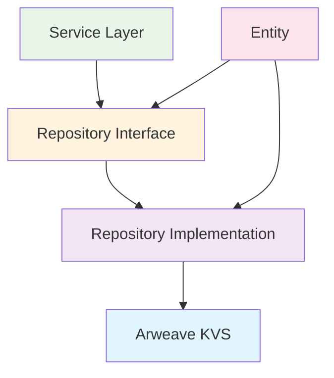

# D-TPRES 普遍的Entity/Repository設計概観

## 1. 設計方針

### 1.1 基本原則
- **Entityはデータ保持のみ**: メソッドを持たず、純粋なデータ構造
- **Repository interfaceでCRUD提供**: Entityのライフサイクル制御
- **Repository implでArweave永続化**: 具体的な永続化実装
- **各プロセス共通設計**: Owner/Requester/Holder全てで利用可能

### 1.2 責務分離


---

## 2. 普遍的Entityクラス設計

### 2.1 DataShare Entity（データ断片）

**用途**: Shamir Secret Sharingによる暗号化データ断片

```rust
/// データ断片エンティティ（データ保持のみ）
#[derive(Debug, Clone, PartialEq, Serialize, Deserialize)]
pub struct DataShare {
    /// 一意識別子
    pub id: String,
    
    /// データグループID
    pub data_id: String,
    
    /// Shamir閾値インデックス（1-n）
    pub threshold_index: u8,
    
    /// 暗号化されたフラグメントデータ
    pub encrypted_fragment: Vec<u8>,
    
    /// オーナー公開鍵
    pub owner_public_key: Vec<u8>,
    
    /// 完全性検証ハッシュ
    pub integrity_hash: Vec<u8>,
    
    /// 作成タイムスタンプ
    pub created_at: u64,
    
    /// 最終更新タイムスタンプ
    pub updated_at: u64,
    
    /// バージョン（楽観ロック用）
    pub version: u64,
}
```

### 2.2 KeyFragment Entity（鍵断片）

**用途**: Umbral Proxy Re-Encryptionの鍵断片

```rust
/// 鍵断片エンティティ（データ保持のみ）
#[derive(Debug, Clone, PartialEq, Serialize, Deserialize)]
pub struct KeyFragment {
    /// 一意識別子
    pub id: String,
    
    /// 関連データID
    pub data_id: String,
    
    /// オーナー公開鍵
    pub owner_public_key: Vec<u8>,
    
    /// 受信者公開鍵
    pub recipient_public_key: Vec<u8>,
    
    /// Umbral鍵フラグメントデータ
    pub umbral_fragment: Vec<u8>,
    
    /// 割り当てられたHolder Process ID
    pub assigned_holder_id: String,
    
    /// フラグメント状態（Available/Consumed/Expired）
    pub status: String,
    
    /// 有効期限（Unixタイムスタンプ、Noneの場合無期限）
    pub expires_at: Option<u64>,
    
    /// 作成タイムスタンプ
    pub created_at: u64,
    
    /// 最終更新タイムスタンプ
    pub updated_at: u64,
    
    /// バージョン
    pub version: u64,
}
```

### 2.3 Process Entity（プロセス）

**用途**: AO Processのメタデータ管理

```rust
/// プロセスエンティティ（データ保持のみ）
#[derive(Debug, Clone, PartialEq, Serialize, Deserialize)]
pub struct Process {
    /// 一意識別子
    pub id: String,
    
    /// プロセス名
    pub name: String,
    
    /// プロセスロール（Owner/Holder/Requester）
    pub role: String,
    
    /// 処理能力上限
    pub max_concurrent_operations: u32,
    
    /// サポートする暗号操作
    pub supported_crypto_operations: Vec<String>,
    
    /// スループット容量
    pub throughput_capacity: u32,
    
    /// 成功率（0.0-1.0）
    pub success_rate: f64,
    
    /// 平均応答時間（ミリ秒）
    pub average_response_time: u64,
    
    /// 稼働率（0.0-1.0）
    pub uptime_percentage: f64,
    
    /// 作成タイムスタンプ
    pub created_at: u64,
    
    /// 最終更新タイムスタンプ
    pub updated_at: u64,
    
    /// バージョン
    pub version: u64,
}
```

### 2.4 AccessRequest Entity（アクセス要求）

**用途**: データアクセス要求の管理

```rust
/// アクセス要求エンティティ（データ保持のみ）
#[derive(Debug, Clone, PartialEq, Serialize, Deserialize)]
pub struct AccessRequest {
    /// 一意識別子
    pub id: String,
    
    /// 要求対象データID
    pub data_id: String,
    
    /// 要求者公開鍵
    pub requester_public_key: Vec<u8>,
    
    /// データオーナー公開鍵
    pub owner_public_key: Vec<u8>,
    
    /// EVM検証トランザクションハッシュ
    pub evm_tx_hash: String,
    
    /// 要求状態（Pending/Approved/Rejected/Expired）
    pub status: String,
    
    /// 要求有効期限
    pub expires_at: u64,
    
    /// 選択されたHolder Process ID群
    pub selected_holders: Vec<String>,
    
    /// 必要な閾値数
    pub required_threshold: u8,
    
    /// 作成タイムスタンプ
    pub created_at: u64,
    
    /// 最終更新タイムスタンプ
    pub updated_at: u64,
    
    /// バージョン
    pub version: u64,
}
```

---

## 3. Repository Interface設計

### 3.1 基本CRUD Interface

**共通操作パターン**:

```rust
/// 基本Repository trait（全Entityで共通）
#[async_trait]
pub trait Repository<T, ID> {
    type Error: std::error::Error + Send + Sync + 'static;
    
    /// エンティティ作成
    async fn create(&self, entity: &T) -> Result<(), Self::Error>;
    
    /// ID検索
    async fn find_by_id(&self, id: &ID) -> Result<Option<T>, Self::Error>;
    
    /// エンティティ更新
    async fn update(&self, entity: &T) -> Result<(), Self::Error>;
    
    /// エンティティ削除
    async fn delete(&self, id: &ID) -> Result<(), Self::Error>;
    
    /// 全件取得
    async fn find_all(&self) -> Result<Vec<T>, Self::Error>;
    
    /// 存在確認
    async fn exists(&self, id: &ID) -> Result<bool, Self::Error>;
}
```

### 3.2 DataShare Repository Interface

```rust
/// DataShare専用Repository interface
#[async_trait]
pub trait DataShareRepository: Repository<DataShare, String> {
    /// データID別検索
    async fn find_by_data_id(&self, data_id: &str) -> Result<Vec<DataShare>, Self::Error>;
    
    /// オーナー別検索
    async fn find_by_owner(&self, owner_public_key: &[u8]) -> Result<Vec<DataShare>, Self::Error>;
    
    /// 閾値インデックス指定検索
    async fn find_by_threshold_index(
        &self,
        data_id: &str,
        index: u8,
    ) -> Result<Option<DataShare>, Self::Error>;
    
    /// 再構築用シェア収集
    async fn collect_for_reconstruction(
        &self,
        data_id: &str,
        threshold: u8,
    ) -> Result<Vec<DataShare>, Self::Error>;
    
    /// 完全性検証
    async fn verify_integrity(&self, id: &str) -> Result<bool, Self::Error>;
}
```

### 3.3 KeyFragment Repository Interface

```rust
/// KeyFragment専用Repository interface
#[async_trait]
pub trait KeyFragmentRepository: Repository<KeyFragment, String> {
    /// 複合キー検索
    async fn find_by_composite_key(
        &self,
        data_id: &str,
        owner_pk: &[u8],
        recipient_pk: &[u8],
    ) -> Result<Option<KeyFragment>, Self::Error>;
    
    /// Holder別検索
    async fn find_by_holder(&self, holder_id: &str) -> Result<Vec<KeyFragment>, Self::Error>;
    
    /// 利用可能フラグメント検索
    async fn find_available_for_data(
        &self,
        data_id: &str,
        owner_pk: &[u8],
        recipient_pk: &[u8],
    ) -> Result<Vec<KeyFragment>, Self::Error>;
    
    /// 期限切れフラグメント取得
    async fn find_expired(&self) -> Result<Vec<KeyFragment>, Self::Error>;
    
    /// 状態別検索
    async fn find_by_status(&self, status: &str) -> Result<Vec<KeyFragment>, Self::Error>;
    
    /// フラグメント消費（状態更新）
    async fn mark_consumed(&self, id: &str) -> Result<(), Self::Error>;
}
```

### 3.4 Process Repository Interface

```rust
/// Process専用Repository interface
#[async_trait]
pub trait ProcessRepository: Repository<Process, String> {
    /// ロール別検索
    async fn find_by_role(&self, role: &str) -> Result<Vec<Process>, Self::Error>;
    
    /// 利用可能Holder検索
    async fn find_available_holders(&self) -> Result<Vec<Process>, Self::Error>;
    
    /// 性能条件検索
    async fn find_by_performance_criteria(
        &self,
        min_success_rate: f64,
        max_response_time: u64,
        min_uptime: f64,
    ) -> Result<Vec<Process>, Self::Error>;
    
    /// Holder選択（スコア順）
    async fn select_optimal_holders(
        &self,
        count: usize,
        requirements: &HolderRequirements,
    ) -> Result<Vec<Process>, Self::Error>;
    
    /// 統計更新
    async fn update_performance_metrics(
        &self,
        id: &str,
        success_rate: f64,
        response_time: u64,
        uptime: f64,
    ) -> Result<(), Self::Error>;
}
```

### 3.5 AccessRequest Repository Interface

```rust
/// AccessRequest専用Repository interface
#[async_trait]
pub trait AccessRequestRepository: Repository<AccessRequest, String> {
    /// 要求者別検索
    async fn find_by_requester(&self, requester_pk: &[u8]) -> Result<Vec<AccessRequest>, Self::Error>;
    
    /// オーナー別検索
    async fn find_by_owner(&self, owner_pk: &[u8]) -> Result<Vec<AccessRequest>, Self::Error>;
    
    /// 状態別検索
    async fn find_by_status(&self, status: &str) -> Result<Vec<AccessRequest>, Self::Error>;
    
    /// 期限切れ要求取得
    async fn find_expired(&self) -> Result<Vec<AccessRequest>, Self::Error>;
    
    /// データID別検索
    async fn find_by_data_id(&self, data_id: &str) -> Result<Vec<AccessRequest>, Self::Error>;
    
    /// 承認処理
    async fn approve_request(
        &self,
        id: &str,
        selected_holders: Vec<String>,
    ) -> Result<(), Self::Error>;
    
    /// 拒否処理
    async fn reject_request(&self, id: &str, reason: &str) -> Result<(), Self::Error>;
}
```

---

## 4. Repository Implementation設計

### 4.1 Arweave永続化戦略

**設計原則**:
- JSONシリアライゼーション
- インデックス構造による高速検索
- Key-Value Store pattern
- エラーハンドリング

```rust
/// Arweave KVS Repository基底実装
pub struct ArweaveRepository<T> {
    /// Arweave KVS接続
    kvs_client: Arc<dyn ArweaveKVS>,
    
    /// エンティティタイプ識別子
    entity_type: &'static str,
    
    /// インデックステーブル
    index_manager: Arc<dyn IndexManager>,
    
    /// シリアライザー
    serializer: Arc<dyn Serializer<T>>,
}

impl<T> ArweaveRepository<T>
where
    T: Serialize + DeserializeOwned + Clone + Send + Sync,
{
    /// エンティティ保存
    async fn save_entity(&self, entity: &T, id: &str) -> Result<(), RepositoryError> {
        // 1. JSONシリアライゼーション
        let json_data = self.serializer.serialize(entity)?;
        
        // 2. Arweaveに保存
        let key = self.build_primary_key(id);
        self.kvs_client.put(&key, &json_data).await?;
        
        // 3. インデックス更新
        self.update_indexes(entity, id).await?;
        
        Ok(())
    }
    
    /// エンティティ取得
    async fn load_entity(&self, id: &str) -> Result<Option<T>, RepositoryError> {
        let key = self.build_primary_key(id);
        
        match self.kvs_client.get(&key).await? {
            Some(json_data) => {
                let entity = self.serializer.deserialize(&json_data)?;
                Ok(Some(entity))
            }
            None => Ok(None),
        }
    }
    
    /// プライマリキー構築
    fn build_primary_key(&self, id: &str) -> String {
        format!("{}:{}", self.entity_type, id)
    }
    
    /// インデックス更新
    async fn update_indexes(&self, entity: &T, id: &str) -> Result<(), RepositoryError> {
        self.index_manager.update_entity_indexes(self.entity_type, entity, id).await
    }
}
```

### 4.2 DataShare Repository Implementation

```rust
/// DataShare用Arweave Repository実装
pub struct ArweaveDataShareRepository {
    base: ArweaveRepository<DataShare>,
}

#[async_trait]
impl Repository<DataShare, String> for ArweaveDataShareRepository {
    type Error = RepositoryError;
    
    async fn create(&self, entity: &DataShare) -> Result<(), Self::Error> {
        self.base.save_entity(entity, &entity.id).await
    }
    
    async fn find_by_id(&self, id: &String) -> Result<Option<DataShare>, Self::Error> {
        self.base.load_entity(id).await
    }
    
    async fn update(&self, entity: &DataShare) -> Result<(), Self::Error> {
        // バージョン確認（楽観ロック）
        self.verify_version(entity).await?;
        self.base.save_entity(entity, &entity.id).await
    }
    
    async fn delete(&self, id: &String) -> Result<(), Self::Error> {
        let key = format!("datashare:{}", id);
        self.base.kvs_client.delete(&key).await?;
        self.base.index_manager.remove_entity_indexes("datashare", id).await
    }
    
    async fn find_all(&self) -> Result<Vec<DataShare>, Self::Error> {
        self.base.index_manager.scan_entities("datashare").await
    }
    
    async fn exists(&self, id: &String) -> Result<bool, Self::Error> {
        let key = format!("datashare:{}", id);
        self.base.kvs_client.exists(&key).await
    }
}

#[async_trait]
impl DataShareRepository for ArweaveDataShareRepository {
    async fn find_by_data_id(&self, data_id: &str) -> Result<Vec<DataShare>, Self::Error> {
        let index_key = format!("idx:datashare:data_id:{}", data_id);
        let entity_ids = self.base.index_manager.get_indexed_entities(&index_key).await?;
        
        let mut entities = Vec::new();
        for id in entity_ids {
            if let Some(entity) = self.find_by_id(&id).await? {
                entities.push(entity);
            }
        }
        Ok(entities)
    }
    
    async fn find_by_owner(&self, owner_public_key: &[u8]) -> Result<Vec<DataShare>, Self::Error> {
        let owner_hash = blake3::hash(owner_public_key);
        let index_key = format!("idx:datashare:owner:{}", hex::encode(owner_hash.as_bytes()));
        let entity_ids = self.base.index_manager.get_indexed_entities(&index_key).await?;
        
        let mut entities = Vec::new();
        for id in entity_ids {
            if let Some(entity) = self.find_by_id(&id).await? {
                entities.push(entity);
            }
        }
        Ok(entities)
    }
    
    async fn collect_for_reconstruction(
        &self,
        data_id: &str,
        threshold: u8,
    ) -> Result<Vec<DataShare>, Self::Error> {
        let shares = self.find_by_data_id(data_id).await?;
        
        // 完全性検証済みのシェアのみ選択
        let valid_shares: Vec<_> = shares
            .into_iter()
            .filter(|share| self.verify_share_integrity(share).unwrap_or(false))
            .take(threshold as usize)
            .collect();
        
        Ok(valid_shares)
    }
}
```

### 4.3 インデックス管理システム

```rust
/// インデックス管理インターフェース
#[async_trait]
pub trait IndexManager: Send + Sync {
    /// エンティティインデックス更新
    async fn update_entity_indexes(
        &self,
        entity_type: &str,
        entity: &impl Serialize,
        entity_id: &str,
    ) -> Result<(), RepositoryError>;
    
    /// インデックス削除
    async fn remove_entity_indexes(
        &self,
        entity_type: &str,
        entity_id: &str,
    ) -> Result<(), RepositoryError>;
    
    /// インデックス検索
    async fn get_indexed_entities(&self, index_key: &str) -> Result<Vec<String>, RepositoryError>;
    
    /// 全エンティティスキャン
    async fn scan_entities<T>(&self, entity_type: &str) -> Result<Vec<T>, RepositoryError>
    where
        T: DeserializeOwned;
}

/// Arweave用インデックス管理実装
pub struct ArweaveIndexManager {
    kvs_client: Arc<dyn ArweaveKVS>,
}

#[async_trait]
impl IndexManager for ArweaveIndexManager {
    async fn update_entity_indexes(
        &self,
        entity_type: &str,
        entity: &impl Serialize,
        entity_id: &str,
    ) -> Result<(), RepositoryError> {
        match entity_type {
            "datashare" => {
                let share: DataShare = serde_json::from_value(serde_json::to_value(entity)?)?;
                
                // data_idインデックス
                let data_id_key = format!("idx:datashare:data_id:{}", share.data_id);
                self.add_to_index(&data_id_key, entity_id).await?;
                
                // ownerインデックス
                let owner_hash = blake3::hash(&share.owner_public_key);
                let owner_key = format!("idx:datashare:owner:{}", hex::encode(owner_hash.as_bytes()));
                self.add_to_index(&owner_key, entity_id).await?;
            }
            "keyfragment" => {
                let fragment: KeyFragment = serde_json::from_value(serde_json::to_value(entity)?)?;
                
                // data_idインデックス
                let data_id_key = format!("idx:keyfragment:data_id:{}", fragment.data_id);
                self.add_to_index(&data_id_key, entity_id).await?;
                
                // holderインデックス
                let holder_key = format!("idx:keyfragment:holder:{}", fragment.assigned_holder_id);
                self.add_to_index(&holder_key, entity_id).await?;
                
                // statusインデックス
                let status_key = format!("idx:keyfragment:status:{}", fragment.status);
                self.add_to_index(&status_key, entity_id).await?;
            }
            // 他のエンティティタイプも同様に実装
            _ => {}
        }
        
        Ok(())
    }
    
    async fn add_to_index(&self, index_key: &str, entity_id: &str) -> Result<(), RepositoryError> {
        // 既存インデックス取得
        let mut entity_ids: Vec<String> = match self.kvs_client.get(index_key).await? {
            Some(data) => serde_json::from_str(&data)?,
            None => Vec::new(),
        };
        
        // エンティティID追加（重複回避）
        if !entity_ids.contains(&entity_id.to_string()) {
            entity_ids.push(entity_id.to_string());
        }
        
        // インデックス保存
        let index_data = serde_json::to_string(&entity_ids)?;
        self.kvs_client.put(index_key, &index_data).await?;
        
        Ok(())
    }
}
```

---

## 5. 統合利用例

### 5.1 Service層での利用

```rust
/// データ共有サービス（Repository活用例）
pub struct DataSharingService {
    datashare_repo: Arc<dyn DataShareRepository>,
    keyfragment_repo: Arc<dyn KeyFragmentRepository>,
    process_repo: Arc<dyn ProcessRepository>,
    access_request_repo: Arc<dyn AccessRequestRepository>,
}

impl DataSharingService {
    /// データ分割と保存
    pub async fn split_and_store_data(
        &self,
        data_id: &str,
        encrypted_fragments: Vec<Vec<u8>>,
        owner_public_key: &[u8],
        threshold: u8,
    ) -> Result<(), ServiceError> {
        for (index, fragment) in encrypted_fragments.into_iter().enumerate() {
            let share = DataShare {
                id: format!("{}_{}", data_id, index + 1),
                data_id: data_id.to_string(),
                threshold_index: (index + 1) as u8,
                encrypted_fragment: fragment,
                owner_public_key: owner_public_key.to_vec(),
                integrity_hash: self.calculate_integrity_hash(&fragment),
                created_at: self.current_timestamp(),
                updated_at: self.current_timestamp(),
                version: 1,
            };
            
            self.datashare_repo.create(&share).await?;
        }
        
        Ok(())
    }
    
    /// アクセス要求処理
    pub async fn process_access_request(
        &self,
        data_id: &str,
        requester_pk: &[u8],
        owner_pk: &[u8],
        evm_tx_hash: &str,
    ) -> Result<String, ServiceError> {
        // 1. アクセス要求作成
        let request = AccessRequest {
            id: uuid::Uuid::new_v4().to_string(),
            data_id: data_id.to_string(),
            requester_public_key: requester_pk.to_vec(),
            owner_public_key: owner_pk.to_vec(),
            evm_tx_hash: evm_tx_hash.to_string(),
            status: "Pending".to_string(),
            expires_at: self.current_timestamp() + 3600, // 1時間後
            selected_holders: Vec::new(),
            required_threshold: 3, // デフォルト閾値
            created_at: self.current_timestamp(),
            updated_at: self.current_timestamp(),
            version: 1,
        };
        
        self.access_request_repo.create(&request).await?;
        
        // 2. Holder選択
        let holders = self.process_repo.find_available_holders().await?;
        let selected = holders.into_iter().take(5).map(|h| h.id).collect::<Vec<_>>();
        
        // 3. 要求承認
        self.access_request_repo.approve_request(&request.id, selected).await?;
        
        Ok(request.id)
    }
    
    /// データ再構築
    pub async fn reconstruct_data(
        &self,
        data_id: &str,
        threshold: u8,
    ) -> Result<Vec<DataShare>, ServiceError> {
        self.datashare_repo.collect_for_reconstruction(data_id, threshold).await
            .map_err(ServiceError::from)
    }
}
```

---

## 6. 実装ディレクトリ構造

```
src/
├── domain/
│   ├── entity/
│   │   ├── data_share.rs
│   │   ├── key_fragment.rs
│   │   ├── process.rs
│   │   ├── access_request.rs
│   │   └── mod.rs
│   └── repository/
│       ├── data_share_repository.rs
│       ├── key_fragment_repository.rs
│       ├── process_repository.rs
│       ├── access_request_repository.rs
│       └── mod.rs
├── infrastructure/
│   ├── repository/
│   │   ├── arweave/
│   │   │   ├── arweave_data_share_repository.rs
│   │   │   ├── arweave_key_fragment_repository.rs
│   │   │   ├── arweave_process_repository.rs
│   │   │   ├── arweave_access_request_repository.rs
│   │   │   ├── index_manager.rs
│   │   │   └── mod.rs
│   │   └── mod.rs
│   └── mod.rs
├── application/
│   ├── service/
│   │   ├── data_sharing_service.rs
│   │   └── mod.rs
│   └── mod.rs
└── lib.rs
```

---

## 7. 実装チェックリスト

### Phase 1: Entity実装 (Week 1)
- [ ] DataShare Entity定義
- [ ] KeyFragment Entity定義  
- [ ] Process Entity定義
- [ ] AccessRequest Entity定義
- [ ] 基本シリアライゼーション実装

### Phase 2: Repository Interface (Week 2)
- [ ] 基本Repository trait定義
- [ ] DataShareRepository trait実装
- [ ] KeyFragmentRepository trait実装
- [ ] ProcessRepository trait実装
- [ ] AccessRequestRepository trait実装

### Phase 3: Arweave Repository Implementation (Week 3-4)
- [ ] ArweaveRepository基底クラス実装
- [ ] IndexManager実装
- [ ] 各Repository Impl実装
- [ ] エラーハンドリング整備

### Phase 4: 統合テスト (Week 5)
- [ ] Repository単体テスト
- [ ] Service層統合テスト
- [ ] Arweave環境テスト
- [ ] パフォーマンステスト

---

## 8. まとめ

この設計により、以下を実現：

1. **純粋なEntityクラス**: データ保持のみに特化
2. **明確なCRUD責務**: Repository interfaceで統一
3. **Arweave永続化**: Repository implで具象化
4. **プロセス共通設計**: Owner/Requester/Holderで共用可能
5. **データアクセス共通化**: Repository経由での統一的なデータ操作

**次のステップ**: Phase 1のEntity実装から開始し、段階的にRepository層を構築していく。