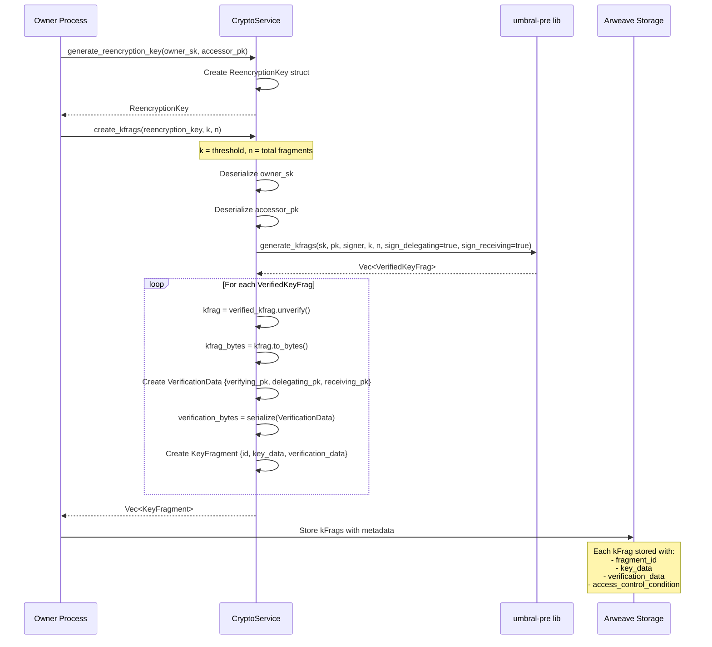
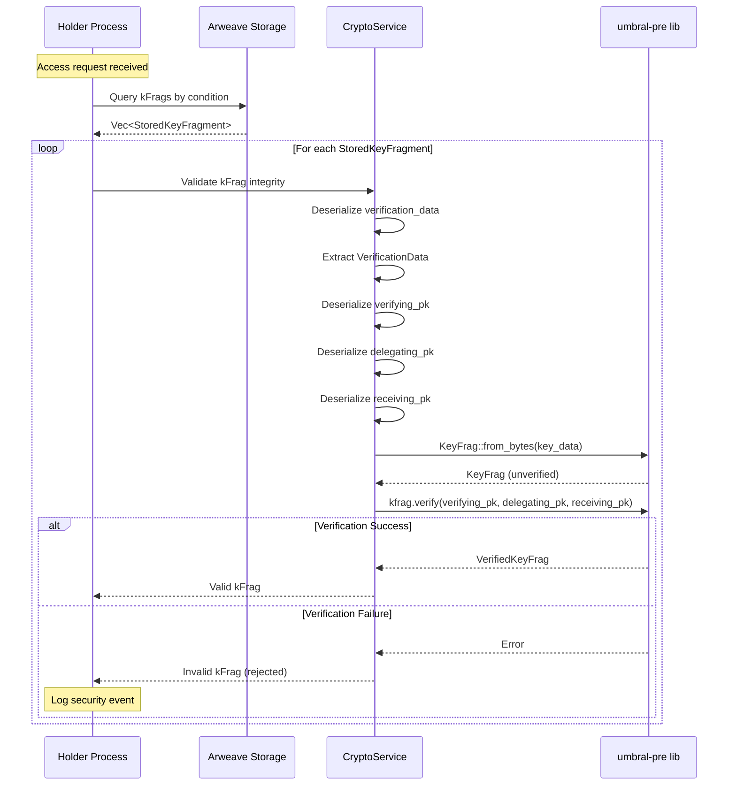
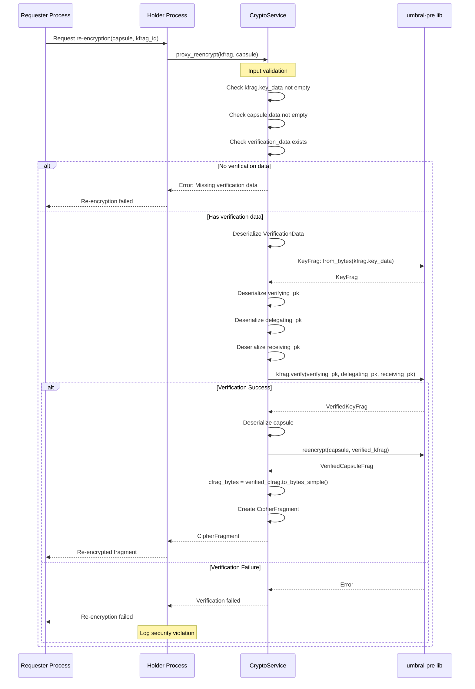
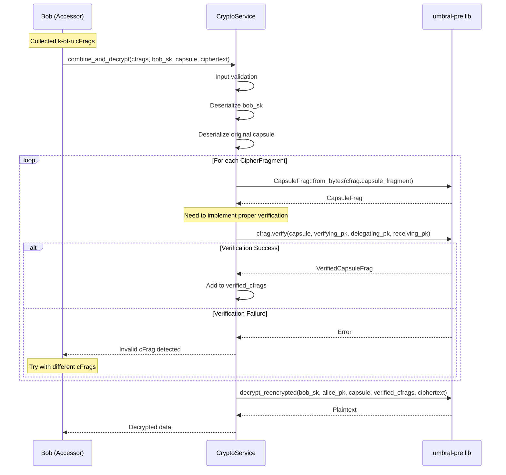
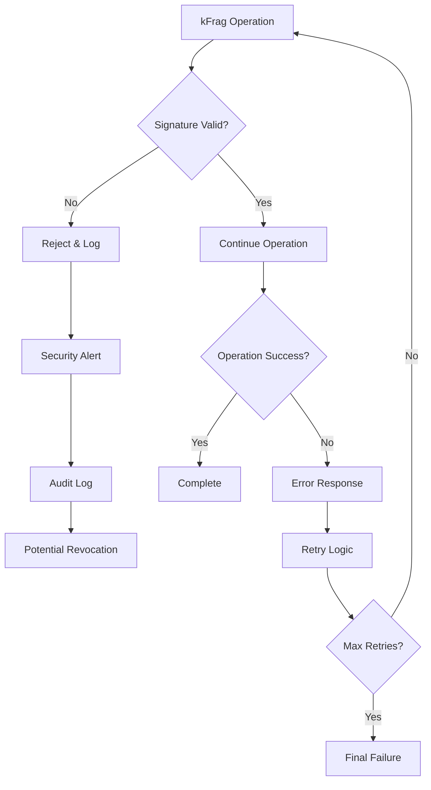
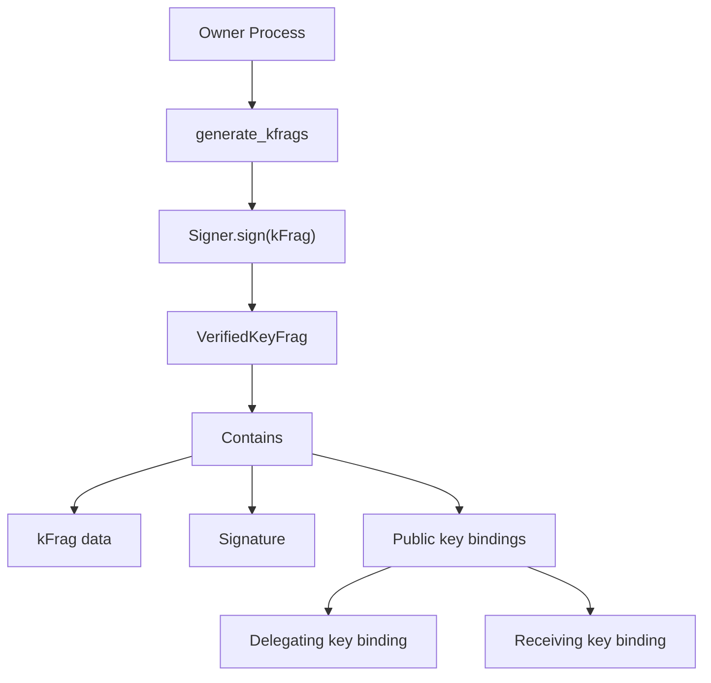
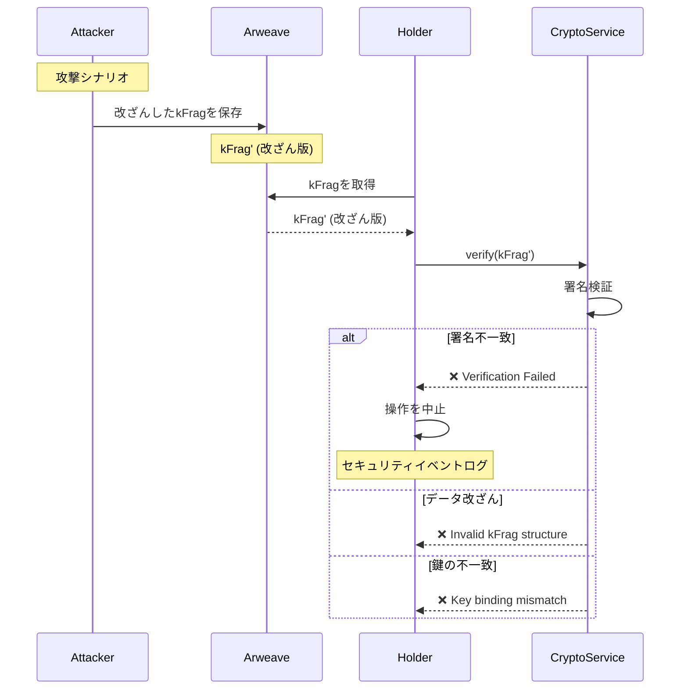
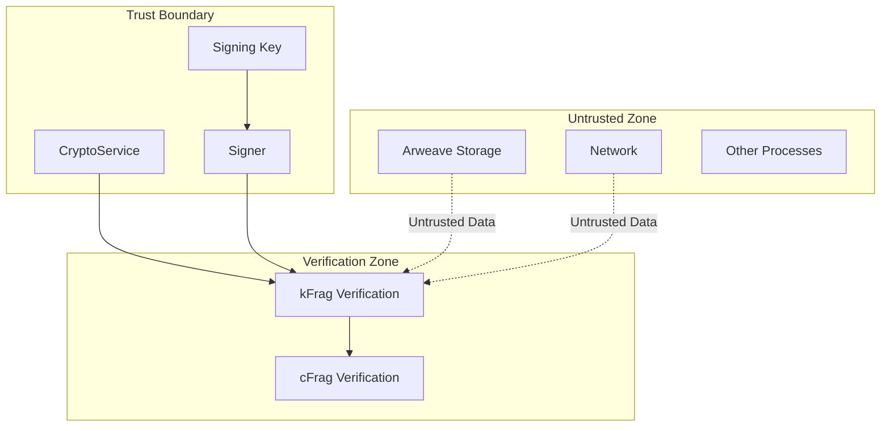

# kFrag Verification Flow

## 概要
D-TPRESシステムにおけるkFrag（再暗号化鍵フラグメント）の生成、保存、取得、検証、および使用のフローを示します。
すべてのフローで署名検証を必須とし、セキュリティを確保します。

## 1. kFrag生成フロー



## 2. kFrag取得・検証フロー



## 3. プロキシ再暗号化フロー



## 4. CapsuleFrag復号フロー



## 5. エラーハンドリングと監査



## セキュリティ考慮事項

### 1. 署名検証の必須化
- **すべての環境で検証**: テスト環境でも本番環境と同じ検証フローを実行
- **検証データの必須化**: verification_dataがない場合はエラーを返す
- **完全性の保証**: 改ざんされたkFragやcFragを即座に検出

### 2. 鍵管理
- **verifying_pk**: Signerの公開鍵（システム共通）
- **delegating_pk**: データ所有者（Alice）の公開鍵
- **receiving_pk**: アクセス者（Bob）の公開鍵

### 3. 監査とログ
- すべての検証失敗をログに記録
- セキュリティイベントの追跡可能性を確保
- 不正なアクセス試行の検出と対応

### 4. フェイルセーフ
- 検証に失敗した場合は安全側に倒す（操作を拒否）
- 部分的な成功は許可しない（all-or-nothing）

## 実装上の注意点

### CapsuleFrag検証の実装
現在の`combine_and_decrypt`関数では`skip_verification()`を使用していますが、以下のように修正が必要：

```rust
// 修正前
let verified_cfrag = capsule_frag.skip_verification();

// 修正後
let verified_cfrag = capsule_frag.verify(
    &umbral_capsule,
    &verifying_pk,
    &delegating_pk,
    &receiving_pk
)?;
```

このためには、CapsuleFragと共に検証に必要な公開鍵情報を管理する必要があります。

## 署名検証の主体と完全性保証の仕組み

### 署名の生成主体と役割

#### 1. Signer（署名者）
```rust
// CryptoServiceImpl::new() で生成される
let signing_key: umbral_pre::SecretKey = umbral_pre::SecretKey::random();
let verifying_key: umbral_pre::PublicKey = signing_key.public_key();
let signer: umbral_pre::Signer = umbral_pre::Signer::new(signing_key);
```

**Signerの役割**：
- **主体**: システム全体で共通の署名鍵を持つCryptoService
- **責任**: kFragの生成時に署名を付与し、改ざん防止を保証
- **スコープ**: プロセス単位（各Owner/Holder/Requesterプロセスが独自のSignerを持つ）

#### 2. 署名検証の3つの公開鍵

```rust
struct VerificationData {
    verifying_pk: Vec<u8>,   // Signerの公開鍵（署名検証用）
    delegating_pk: Vec<u8>,  // データ所有者（Alice/Owner）の公開鍵
    receiving_pk: Vec<u8>,   // アクセス者（Bob/Accessor）の公開鍵
}
```

### なぜこのフローで完全性が保たれるのか

#### 1. kFrag生成時の署名メカニズム



**完全性の保証**：
1. **署名生成**: `generate_kfrags`でSignerがkFragに署名を付与
2. **鍵バインディング**: delegating_keyとreceiving_keyもkFragに結合
3. **検証可能性**: 3つの公開鍵すべてが揃わないと検証不可

#### 2. 署名検証による改ざん検出

```rust
// proxy_reencrypt内での検証
let verified_kfrag = umbral_kfrag.verify(
    &verifying_pk,       // 署名の検証
    Some(&delegating_pk), // 委任者の確認
    Some(&receiving_pk)   // 受信者の確認
)?;
```

**改ざん検出のメカニズム**：

1. **署名の検証（verifying_pk）**
   - kFragデータの完全性を確認
   - 1ビットでも改ざんされていれば検証失敗
   - 署名アルゴリズム: ECDSA over secp256k1

2. **委任者の検証（delegating_pk）**
   - kFragが正しい委任者（Owner）から生成されたことを確認
   - なりすまし防止

3. **受信者の検証（receiving_pk）**
   - kFragが正しい受信者（Accessor）向けであることを確認
   - 不正な転用防止

#### 3. 多層防御による完全性保証



### 完全性保証の数学的基盤

#### 1. 暗号学的仮定
- **離散対数問題（DLP）**: secp256k1曲線上でDLPは計算困難
- **ECDSA署名の偽造不可能性**: 秘密鍵なしに有効な署名を生成することは計算上不可能

#### 2. 確率的保証
- **衝突確率**: 2^256の空間での偶発的な衝突は無視できるレベル
- **改ざん検出率**: 100%（1ビットの変更でも必ず検出）

### セキュリティ境界と信頼モデル



**信頼境界の設計**：
1. **信頼できる要素**: CryptoService内のSigner（プロセス起動時に生成）
2. **信頼できない要素**: 外部ストレージ、ネットワーク、他プロセス
3. **検証による信頼確立**: すべての外部データは検証後のみ信頼

### 実装上の重要ポイント

#### 1. 検証データの必須化
```rust
// proxy_reencrypt内
if kfrag.verification_data.is_empty() {
    return Err(ServiceError::validation_error(
        "Missing verification data for kFrag",
    ));
}
```

#### 2. 常時検証の実施
```rust
// テスト環境でも本番環境でも同じ検証フロー
let verified_kfrag = umbral_kfrag.verify(
    &verifying_pk,
    Some(&delegating_pk),
    Some(&receiving_pk)
)?;
```

#### 3. フェイルセーフ設計
- 検証失敗時は即座に処理を中止
- 部分的な成功は許可しない
- エラーログで監査証跡を残す

## まとめ

このフローにより、D-TPRESシステムは以下の完全性保証を実現します：

1. **改ざん防止**: ECDSA署名により、kFragとcFragの改ざんを100%検出
2. **なりすまし防止**: 公開鍵バインディングにより、不正な主体からのデータを拒否
3. **転用防止**: 受信者固有のkFragにより、他の受信者への不正な転用を防止
4. **監査可能性**: すべての検証失敗をログに記録し、セキュリティ監査を可能に

テスト環境でも本番環境と同じセキュリティレベルを維持することで、開発段階から高い信頼性を確保し、「セキュリティ・バイ・デザイン」の原則を実現しています。
