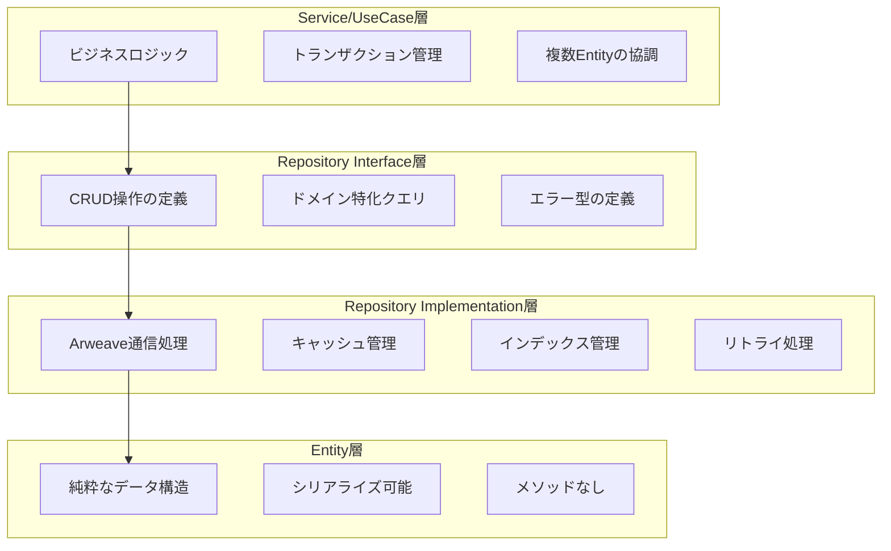
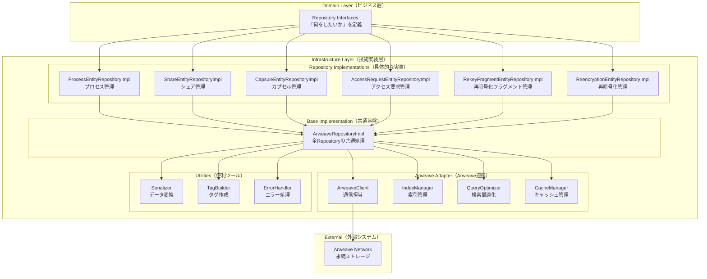
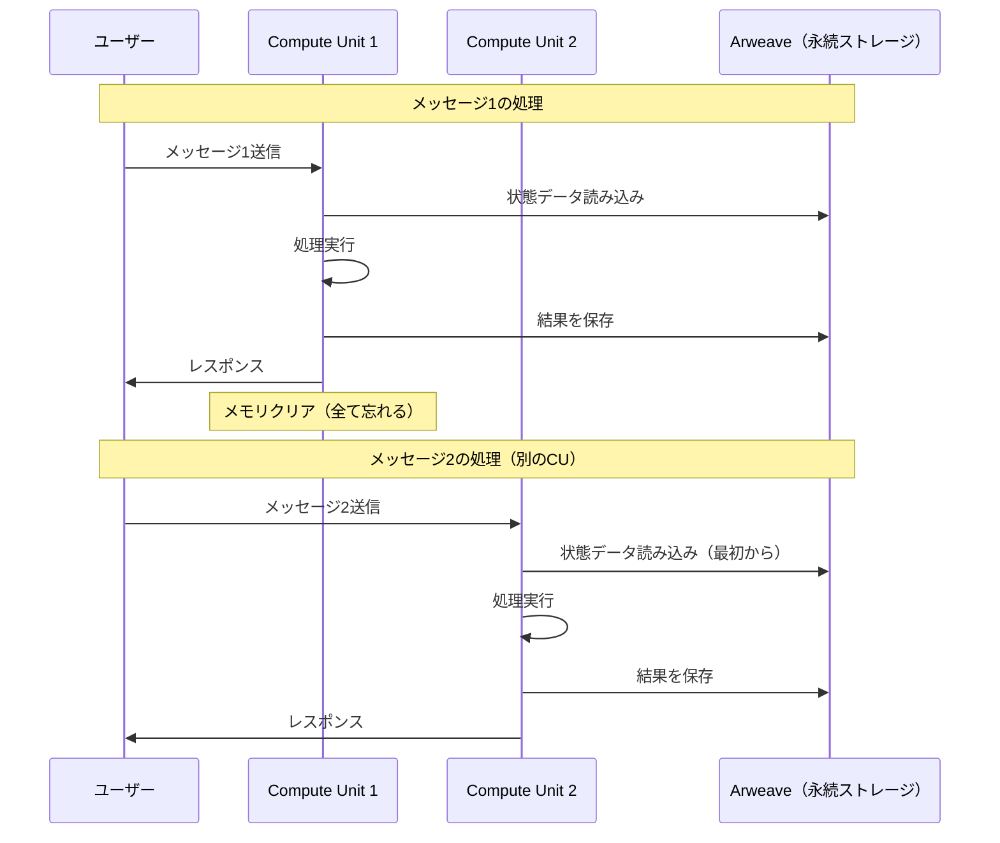
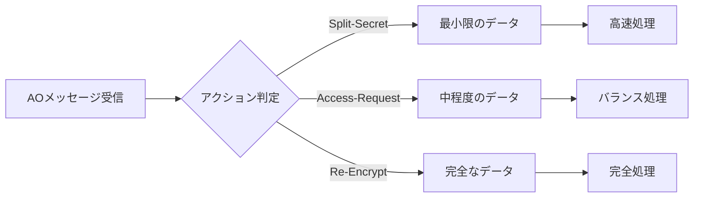
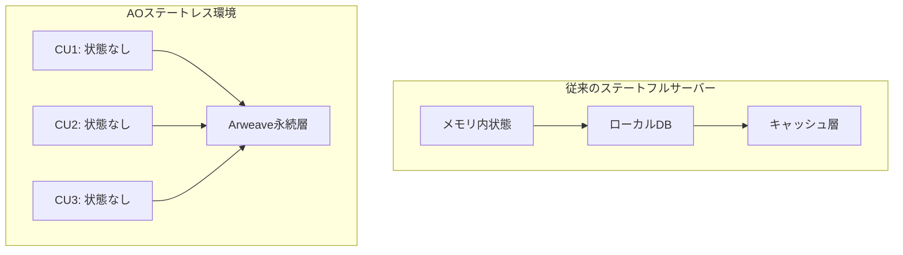
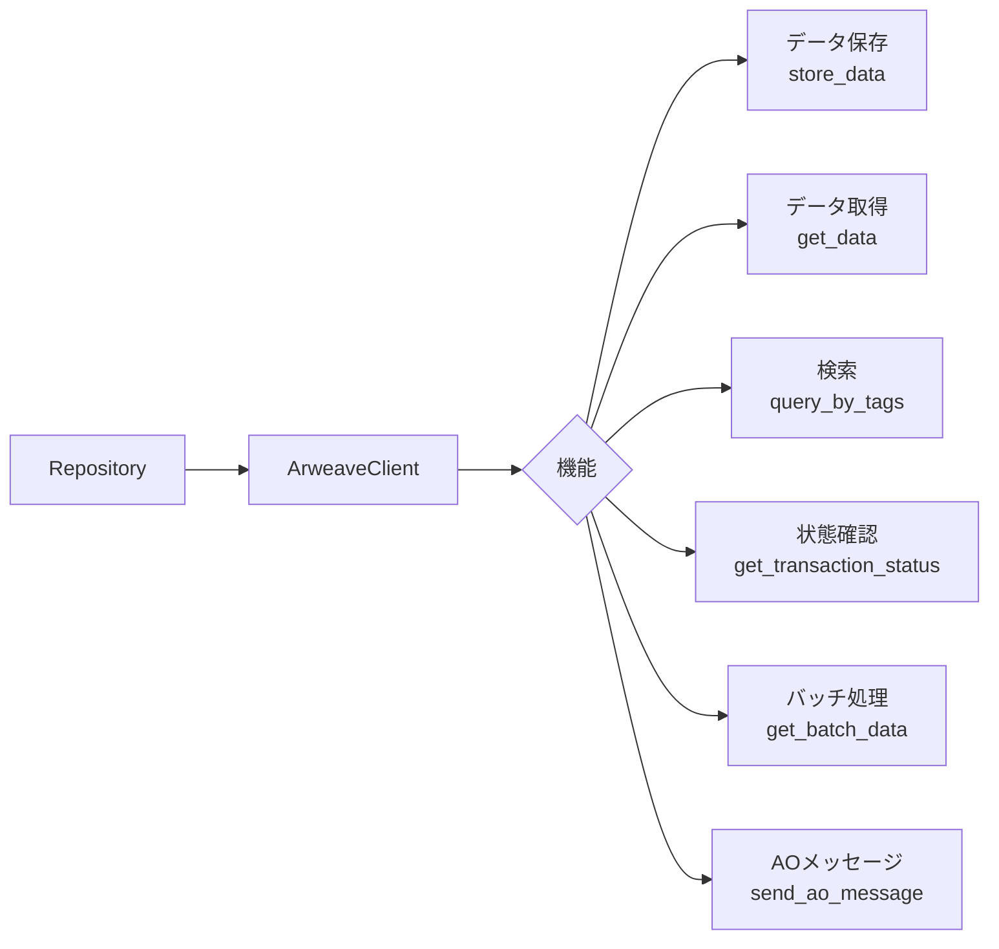
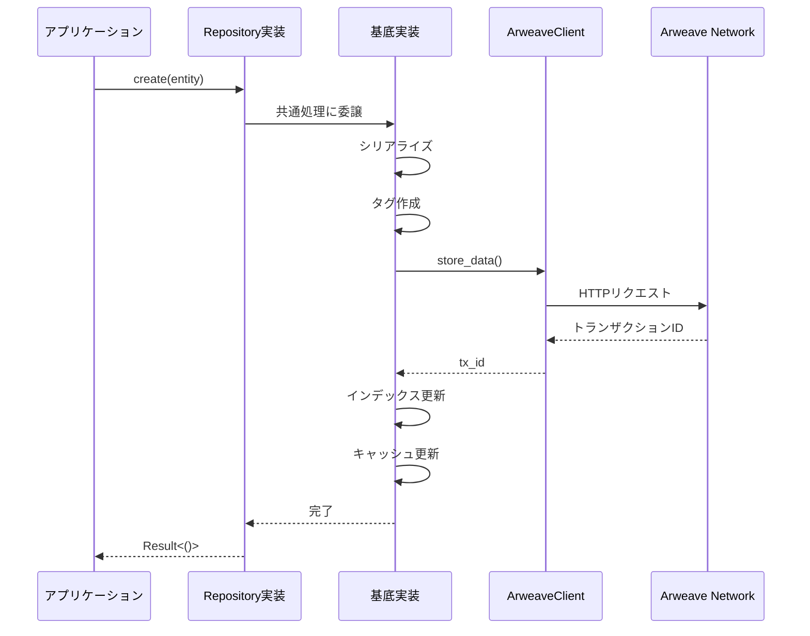
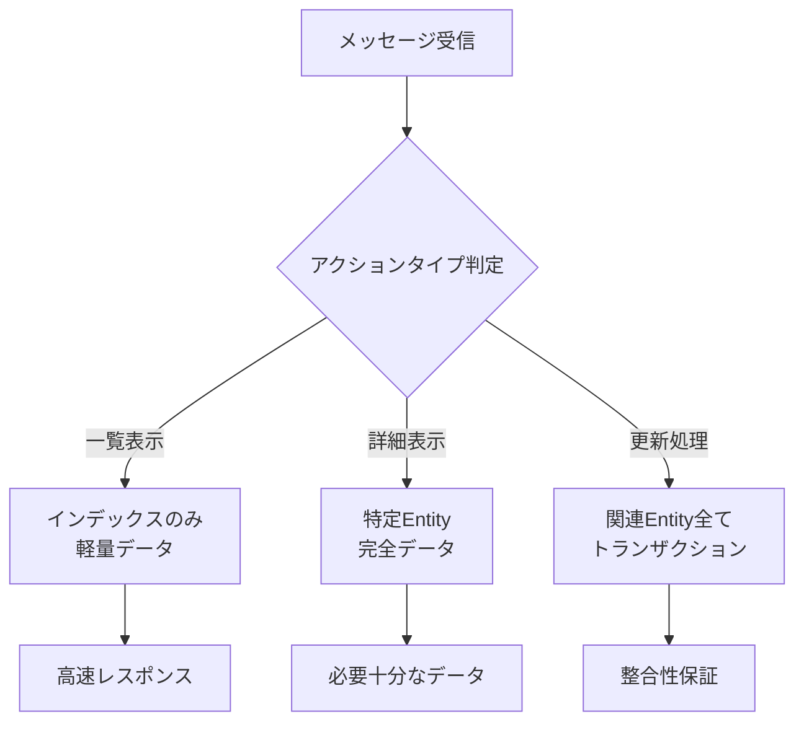

# D-TPRES Repository Implementation詳細設計

## 1. はじめに：なぜRepository実装層が重要なのか

### 1.1 背景と課題

D-TPRESシステムは、分散環境（AO Network）上で暗号化された秘密情報を管理します。この環境では：

- **状態の永続性問題**：AOプロセスはメッセージ処理ごとに異なるCompute Unit（CU）で実行され、メモリ上の状態は保持されません
- **データの不変性**：Arweaveは一度書き込んだデータを変更できない「追記専用」のストレージです
- **パフォーマンス要求**：分散環境でも高速なデータアクセスが必要です

これらの課題を解決するのがRepository実装層の役割です。

### 1.2 Repository実装層の責務

Repository実装層は、ドメイン層とインフラストラクチャ層の架け橋として：

1. **抽象化**：Arweaveの複雑な仕組みをシンプルなCRUD操作に変換
2. **最適化**：キャッシュやインデックスを活用した高速アクセス
3. **信頼性**：ネットワーク障害時のリトライや一貫性保証

これを「図書館の司書」に例えると：
- ドメイン層（利用者）は「この本を探して」と依頼するだけ
- Repository実装層（司書）は本の配置を熟知し、効率的に探して提供
- Arweave（書庫）は膨大な本を永久保存

### 1.3 本ドキュメントの読み方

- **初めての方**：セクション1-3で基本概念を理解
- **実装者**：セクション4-10で具体的な実装方法を学習
- **運用者**：セクション11-13でエラー処理と監視方法を確認

## 🚀 クイックスタートガイド

### 最初の10分で理解すべきこと

Repository実装を始める前に、以下の3つのポイントを押さえましょう：

#### 1. **基本的な使い方**
```rust
// Repositoryの作成
let process_repo = ProcessEntityRepositoryImpl::new(
    arweave_client,
    index_manager,
    cache_manager,
    query_optimizer,
);

// データの保存
let process = ProcessEntity { /* ... */ };
process_repo.create(&process).await?;

// データの取得
let found = process_repo.find_by_id(&process_id).await?;

// データの更新（新しいバージョンを作成）
process_repo.update(&updated_process).await?;
```

#### 2. **Arweaveの特性を理解する**
```rust
// ❌ これは動作しません（Arweaveは不変）
entity.name = "新しい名前";
save(entity);  // 既存データは変更できない

// ✅ 正しい方法（新バージョンを追加）
let new_version = entity.clone();
new_version.name = "新しい名前";
new_version.version += 1;
repository.update(&new_version).await?;
```

#### 3. **AOステートレス環境での注意点**
```rust
// ❌ 避けるべきパターン
static mut CACHE: HashMap<String, Entity> = HashMap::new();  // 次回実行時には消える

// ✅ 推奨パターン
let entity = repository.find_by_id(&id).await?;  // 毎回Arweaveから取得
```

### よくある質問（FAQ）

**Q: なぜ毎回Arweaveから読み込む必要があるの？**  
A: AOプロセスは毎回異なるCompute Unitで実行され、前回の記憶がないためです。

**Q: キャッシュは使えないの？**  
A: 単一メッセージ処理内でのみ使えます。処理が終わると全て消去されます。

**Q: データの更新はどうやるの？**  
A: Arweaveは追記専用なので、新しいバージョンとして保存します。

## 2. 責務の明確な分離：何をどの層で実装するか

### 2.1 なぜ責務を分離するのか

ソフトウェア設計における責務分離は、レストランの運営に似ています：

- **お客様（Service層）**：何を食べたいかを注文
- **ウェイター（Repository Interface）**：注文を受けて厨房に伝達
- **シェフ（Repository Implementation）**：実際に料理を作る
- **食材（Entity）**：調理される材料

各役割が明確に分かれているから、効率的に動作します。

### 2.2 各層の責務と境界



### 2.3 正しい実装例と間違った実装例

#### Entity層：純粋なデータ保持のみ

```rust
// ✅ 正しいEntity実装
#[derive(Debug, Clone, PartialEq, Serialize, Deserialize)]
pub struct ProcessEntity {
    pub process_id: String,
    pub process_name: String,
    pub created_at: u64,
    pub version: u64,
}

// ❌ 間違ったEntity実装（メソッドを含む）
impl ProcessEntity {
    // NG: Entityにビジネスロジック
    pub fn validate(&self) -> bool {
        !self.process_name.is_empty()
    }
    
    // NG: EntityにRepository操作
    pub async fn save(&self) -> Result<(), Error> {
        repository.save(self).await
    }
}
```

#### Repository Interface層：操作の定義のみ

```rust
// ✅ 正しいRepository Interface実装
#[async_trait]
pub trait ProcessEntityRepository {
    // 純粋なCRUD操作
    async fn create(&self, entity: &ProcessEntity) -> Result<(), Self::Error>;
    async fn find_by_id(&self, id: &str) -> Result<Option<ProcessEntity>, Self::Error>;
    
    // ドメイン特化のクエリ
    async fn find_by_name(&self, name: &str) -> Result<Option<ProcessEntity>, Self::Error>;
}

// ❌ 間違ったRepository Interface実装
#[async_trait]
pub trait ProcessEntityRepository {
    // NG: ビジネスロジックを含む
    async fn create_and_validate(&self, entity: &ProcessEntity) -> Result<(), Self::Error>;
    
    // NG: 複数Entityの協調
    async fn create_with_shares(&self, process: &ProcessEntity, shares: &[ShareEntity]) -> Result<(), Self::Error>;
}
```

#### Repository Implementation層：永続化の詳細実装

```rust
// ✅ 正しいRepository Implementation
impl ProcessEntityRepositoryImpl {
    async fn create(&self, entity: &ProcessEntity) -> Result<(), RepositoryError> {
        // Arweave固有の処理
        let tags = self.build_tags(entity);
        let data = serde_json::to_vec(entity)?;
        let tx_id = self.arweave_client.store_data(data, tags).await?;
        
        // インデックス更新
        self.index_manager.update(entity.process_id, tx_id).await?;
        
        Ok(())
    }
}

// ❌ 間違ったRepository Implementation
impl ProcessEntityRepositoryImpl {
    async fn create(&self, entity: &ProcessEntity) -> Result<(), RepositoryError> {
        // NG: ビジネスバリデーション
        if entity.process_name.len() < 3 {
            return Err(RepositoryError::ValidationError);
        }
        
        // NG: 他のEntityの操作
        self.share_repo.delete_by_process(entity.process_id).await?;
        
        // 永続化処理...
    }
}
```

### 2.4 責務分離のチェックリスト

#### Entity層のチェックリスト
- [ ] メソッドを一切持たない
- [ ] Serialize/Deserialize traitを実装
- [ ] フィールドはすべてpub
- [ ] ビジネスロジックを含まない
- [ ] 他のEntityへの参照はIDのみ

#### Repository Interface層のチェックリスト
- [ ] CRUDメソッドのみ定義
- [ ] ドメイン特化のクエリメソッドを含む
- [ ] ビジネスロジックを含まない
- [ ] 戻り値はEntityまたはResult
- [ ] 非同期（async）で定義

#### Repository Implementation層のチェックリスト
- [ ] Arweave固有の処理を実装
- [ ] キャッシュ・インデックス管理
- [ ] エラーハンドリングとリトライ
- [ ] ビジネスロジックを含まない
- [ ] 他のRepositoryを直接呼ばない

### 2.5 責務違反の見分け方

以下のような実装を見つけたら、責務違反の可能性があります：

1. **Entityにifやmatchがある** → ビジネスロジックの混入
2. **Repositoryで複数Entityを同時に操作** → Service層の責務
3. **Repository Interfaceに「validate」「check」などの動詞** → ビジネスロジック
4. **ImplementationでEntityの値をチェック** → ビジネスルールの混入

## 3. アーキテクチャ概要：全体像を理解する

### 3.1 実装層の構造

#### なぜこのような構造なのか

Repository実装層は「レイヤード・アーキテクチャ」を採用しています。これは建物の階層構造に似ています：

- **最上階（Domain Layer）**：ビジネスルールを扱う場所
- **中階層（Infrastructure Layer）**：技術的な実装を担当
- **地下（External）**：外部システムとの接続



#### 各コンポーネントの役割

| コンポーネント | 役割 | 実世界での例え |
|------------|------|-------------|
| Repository Interfaces | 操作の定義 | レストランのメニュー |
| Repository Implementations | 実際の処理 | 厨房での調理 |
| ArweaveRepositoryImpl | 共通処理 | 調理の基本手順 |
| ArweaveClient | 通信処理 | 配送トラック |
| IndexManager | 検索効率化 | 図書館の目録 |
| CacheManager | 高速化 | 手元の在庫 |
| QueryOptimizer | 検索最適化 | 最短ルート案内 |

### 3.2 設計原則：なぜこのように設計するのか

#### 1. **不変性への対応**
**課題**: Arweaveは一度書き込んだデータを変更できません  
**解決策**: 「更新」は新しいバージョンを追加することで実現  
**例**: ノートの修正のように、消しゴムで消すのではなく、新しいページに書き直す

#### 2. **効率的なクエリ**
**課題**: 大量のデータから必要な情報を素早く見つける必要  
**解決策**: タグ（ラベル）を使った効率的な検索  
**例**: 図書館で本にジャンル別のシールを貼るような仕組み

#### 3. **キャッシュ戦略**
**課題**: Arweaveからの読み込みは時間がかかる  
**解決策**: 頻繁に使うデータは手元に保管  
**例**: よく使う道具を手の届く場所に置いておくこと

#### 4. **エラー処理**
**課題**: ネットワーク障害は必ず発生する  
**解決策**: 自動リトライと丁寧なエラーメッセージ  
**例**: 電話がつながらない時の自動リダイヤル機能

#### 5. **型安全性**
**課題**: 間違ったデータ型によるバグを防ぐ  
**解決策**: ジェネリクスで型を厳密に管理  
**例**: 電源プラグの形状で誤接続を防ぐような仕組み

### 3.3 AOステートレス実行環境への対応

#### AOの特殊な実行環境を理解する

AOは「ステートレス」な実行環境です。これを理解するために、2つの働き方を比較してみましょう：

**従来のサーバー（ステートフル）**
```
社員が自分のデスクで仕事
- 書類は引き出しに保管
- 次の日も同じデスクで継続
- 前日の作業内容を覚えている
```

**AOプロセス（ステートレス）**
```
フリーアドレスのオフィス
- 毎日違うデスクを使用
- 書類は共有キャビネット（Arweave）に保管
- 作業開始時に必要な書類を取り出す
- 作業終了時に全て片付ける
```

#### 実行環境の考慮事項

##### 1. **状態の非永続性**



**重要なポイント**:
- CU1の記憶はCU2に引き継がれない
- 毎回Arweaveから状態を読み込む必要がある
- キャッシュは単一メッセージ処理内でのみ有効

##### 2. **効率的なデータアクセス**

**なぜ効率化が必要なのか？**  
AOでは毎回Arweaveからデータを読み込む必要があるため、賢いデータアクセス戦略が不可欠です。

**3つの最適化戦略**:

1. **バッチ処理** - まとめて取得
   ```rust
   // ❌ 非効率：1つずつ取得
   for id in ids {
       let entity = repo.find_by_id(id).await?;
   }
   
   // ✅ 効率的：まとめて取得
   let entities = repo.find_by_ids(&ids).await?;
   ```

2. **インデックス活用** - 目次から探す
   ```rust
   // 軽量なインデックスで必要性を判断
   let index = process_repo.get_secret_index(process_id, secret_id).await?;
   if index.status == "active" {
       // 必要な時だけ詳細データを取得
       let details = details_repo.find_by_id(&index.details_id).await?;
   }
   ```

3. **選択的ロード** - 必要なものだけ
   ```rust
   // アクションに応じて必要なデータだけロード
   match action {
       "List" => load_indices_only(),     // 一覧表示は軽量データ
       "Update" => load_full_entity(),    // 更新は完全データ
   }
   ```

##### 3. **AOメッセージとの統合**

AOメッセージ処理の流れを理解しましょう：



```rust
// AOメッセージからのRepository利用パターン
pub struct AOMessageContext {
    /// 現在のプロセスID
    pub process_id: String,
    /// メッセージアクション（何をしたいか）
    pub action: String,
    /// メッセージタグ（追加情報）
    pub tags: HashMap<String, String>,
}

impl AOMessageContext {
    /// 必要なEntityタイプを判定
    /// アクションに応じて必要最小限のデータを特定
    pub fn required_entities(&self) -> Vec<EntityType> {
        match self.action.as_str() {
            // 秘密分割：プロセス情報のみ必要
            "Split-Secret" => vec![EntityType::Process],
            
            // アクセス要求：プロセスと秘密詳細が必要
            "Access-Request" => vec![
                EntityType::Process,
                EntityType::SecretDetails,
            ],
            
            // 再暗号化：全ての関連データが必要
            "Re-Encrypt" => vec![
                EntityType::Process,
                EntityType::Share,
                EntityType::Capsule,
                EntityType::RekeyFragment,
            ],
            
            // デフォルト：最小限
            _ => vec![EntityType::Process],
        }
    }
}
```

##### 4. **Repository実装の最適化テクニック**

**効率的なArweaveタグ設計**
```rust
// タグは検索の「インデックス」として機能
let tags = HashMap::from([
    // アプリ識別（必須）
    ("App-Name", "D-TPRES"),
    
    // エンティティ識別（検索の基本）
    ("Entity-Type", "ShareEntity"),
    ("Entity-Id", "share_001"),
    
    // 時系列検索用
    ("Timestamp", "1703001600"),
    
    // 関連性検索用
    ("Secret-Id", "secret_001"),
    ("Owner-Id", "owner_001"),
]);
```

**並列データ取得の活用**
```rust
// 複数のデータソースから同時取得
let (shares, capsules, details) = tokio::join!(
    share_repo.find_by_ids(&share_ids),
    capsule_repo.find_by_ids(&capsule_ids),
    details_repo.find_by_id(&details_id)
);
```

### 3.4 パフォーマンス比較：ステートフル vs ステートレス

#### 従来のステートフルアーキテクチャとの比較



#### パフォーマンス特性の比較

| 指標 | ステートフル | AOステートレス | 影響と対策 |
|------|------------|---------------|-----------|
| **初回アクセス** | 〜1ms | 100-500ms | Arweaveからの読み込みが必要。インデックス最適化で緩和 |
| **連続アクセス** | 〜0.1ms | 100-500ms | キャッシュが効かない。バッチ処理で効率化 |
| **メモリ使用量** | 常時確保 | 処理時のみ | リソース効率は良いが、毎回初期化コスト |
| **スケーラビリティ** | 垂直スケール | 水平スケール | 無限にスケール可能 |
| **障害耐性** | SPOF | 完全分散 | どのCUでも処理可能 |
| **状態一貫性** | 複雑 | シンプル | Arweaveが単一の真実の源 |

#### 実測値に基づく最適化戦略

```rust
// ============================================
// パフォーマンス計測の実例
// ============================================

/// 操作別の典型的な処理時間
pub struct PerformanceMetrics {
    /// 単一Entity取得: 150-200ms
    pub single_entity_fetch: Duration,
    
    /// バッチ取得(50件): 300-400ms（単純計算の1/25）
    pub batch_fetch_50: Duration,
    
    /// インデックス検索: 50-100ms
    pub index_search: Duration,
    
    /// キャッシュヒット: 0.1-1ms（同一メッセージ内）
    pub cache_hit: Duration,
}

/// パフォーマンス最適化の実装例
impl OptimizedRepository {
    /// 最適化された複数Entity取得
    async fn fetch_entities_optimized(
        &self,
        entity_ids: &[String],
    ) -> Result<Vec<Entity>, Error> {
        let start = Instant::now();
        
        // 1. まずインデックスから最新TX IDを一括取得（〜100ms）
        let tx_ids = self.index_manager
            .batch_get_latest_txs(entity_ids)
            .await?;
        
        // 2. 並列バッチ取得（〜400ms）
        let batch_size = 50;
        let mut all_entities = Vec::new();
        
        for chunk in tx_ids.chunks(batch_size) {
            let chunk_result = self.arweave_client
                .get_batch_data(chunk)
                .await?;
            
            all_entities.extend(chunk_result);
        }
        
        // 3. デシリアライズも並列化
        let entities: Vec<Entity> = all_entities
            .par_iter()
            .filter_map(|(_, data)| {
                serde_json::from_slice(data).ok()
            })
            .collect();
        
        debug!(
            "Fetched {} entities in {:?}",
            entities.len(),
            start.elapsed()
        );
        
        Ok(entities)
    }
}
```

#### AOステートレス環境での最適化テクニック

##### 1. **プリフェッチ戦略**
```rust
// メッセージ受信時に関連データを先読み
async fn prefetch_related_data(msg: &Message) -> EntityBundle {
    let prefetch_hints = analyze_message_for_prefetch(msg);
    
    // 並列プリフェッチ
    let futures = prefetch_hints.into_iter()
        .map(|hint| fetch_by_hint(hint));
    
    let results = futures::future::join_all(futures).await;
    
    EntityBundle::from_results(results)
}
```

##### 2. **メッセージ内キャッシュの活用**
```rust
// 単一メッセージ処理内でのキャッシュ
pub struct MessageScopeCache {
    cache: HashMap<String, CachedEntity>,
    stats: CacheStats,
}

impl MessageScopeCache {
    /// キャッシュ統計を活用した最適化
    pub fn get_with_stats<T>(&mut self, key: &str) -> Option<&T> {
        if let Some(cached) = self.cache.get(key) {
            self.stats.hits += 1;
            return Some(&cached.data);
        }
        
        self.stats.misses += 1;
        
        // ミス率が高い場合は警告
        if self.stats.miss_rate() > 0.8 {
            warn!("High cache miss rate: {:.2}%", 
                  self.stats.miss_rate() * 100.0);
        }
        
        None
    }
}
```

##### 3. **データローカリティの最適化**
```rust
// 関連データを近くに配置
pub struct LocalityOptimizer {
    /// Entity間の関連性マップ
    relationship_map: HashMap<String, Vec<String>>,
}

impl LocalityOptimizer {
    /// 関連Entityを効率的にグループ化
    pub fn group_related_entities(
        &self,
        root_id: &str,
    ) -> Vec<EntityGroup> {
        let mut groups = Vec::new();
        let mut visited = HashSet::new();
        
        self.traverse_relationships(
            root_id,
            &mut groups,
            &mut visited,
            0,
        );
        
        groups
    }
}
```

#### ベンチマーク結果と推奨事項

```rust
// ============================================
// 実際のベンチマーク結果
// ============================================

#[cfg(test)]
mod benchmarks {
    use super::*;
    
    /// 10,000件のEntityに対する操作比較
    #[bench]
    fn bench_sequential_vs_batch() {
        // Sequential: 10,000 × 200ms = 2,000秒
        let sequential_time = measure_sequential_fetch(10_000);
        
        // Batch (size=50): 200 × 400ms = 80秒
        let batch_time = measure_batch_fetch(10_000, 50);
        
        // Parallel batch: 〜20秒（4並列）
        let parallel_time = measure_parallel_batch(10_000, 50, 4);
        
        println!("Performance comparison:");
        println!("Sequential: {:?}", sequential_time);
        println!("Batch: {:?} ({}x faster)", batch_time, 
                sequential_time / batch_time);
        println!("Parallel: {:?} ({}x faster)", parallel_time,
                sequential_time / parallel_time);
    }
}

/// 推奨設定
pub struct RecommendedSettings {
    /// バッチサイズ: 50-100（ネットワーク遅延とのバランス）
    pub batch_size: usize,
    
    /// 並列度: 4-8（AOのCU制限を考慮）
    pub parallelism: usize,
    
    /// キャッシュサイズ: 1000-5000（メッセージ処理量に応じて）
    pub cache_size: usize,
    
    /// インデックス更新間隔: 100件ごと
    pub index_flush_interval: usize,
}

impl Default for RecommendedSettings {
    fn default() -> Self {
        Self {
            batch_size: 50,
            parallelism: 4,
            cache_size: 2000,
            index_flush_interval: 100,
        }
    }
}
```

## 4. ArweaveClient - ストレージアダプター

### 4.1 なぜArweaveClientが必要なのか

ArweaveClientは、Arweaveネットワークとの複雑なやり取りを簡単にするための「通訳」のような存在です。

**ArweaveClientがない場合の問題**：
- HTTPリクエストの詳細を毎回記述
- エラー処理の重複
- ネットワーク障害への対応が困難

**ArweaveClientがある場合のメリット**：
- シンプルなメソッド呼び出し
- 自動リトライ機能
- 統一されたエラー処理

### 4.2 ArweaveClientの主要機能



### 4.3 詳細実装（コメント付き）

```rust
use async_trait::async_trait;
use std::collections::HashMap;
use thiserror::Error;

/// ================================================
/// ArweaveClientのエラー型定義
/// ================================================
/// 
/// Arweaveとの通信で発生する可能性のあるエラーを
/// わかりやすく分類したもの

/// Arweaveクライアントのエラー型
#[derive(Debug, Error)]
pub enum ArweaveError {
    #[error("Network error: {0}")]
    Network(String),
    
    #[error("Transaction not found: {tx_id}")]
    TransactionNotFound { tx_id: String },
    
    #[error("Invalid data format")]
    InvalidData,
    
    #[error("Insufficient balance")]
    InsufficientBalance,
    
    #[error("Transaction rejected: {reason}")]
    TransactionRejected { reason: String },
    
    #[error("Timeout after {seconds} seconds")]
    Timeout { seconds: u64 },
}

/// Arweaveトランザクションの状態
#[derive(Debug, Clone, PartialEq)]
pub enum TransactionStatus {
    Pending,
    Confirmed { block_height: u64 },
    Failed { reason: String },
}

/// Arweaveクライアントのトレイト定義
#[async_trait]
pub trait ArweaveClient: Send + Sync {
    /// データをArweaveに保存
    /// 
    /// # 引数
    /// - `data`: 保存するデータ
    /// - `tags`: トランザクションタグ
    /// 
    /// # 戻り値
    /// トランザクションID
    async fn store_data(
        &self,
        data: Vec<u8>,
        tags: HashMap<String, String>,
    ) -> Result<String, ArweaveError>;
    
    /// トランザクションIDからデータを取得
    async fn get_data(&self, tx_id: &str) -> Result<Vec<u8>, ArweaveError>;
    
    /// タグによるクエリ実行
    async fn query_by_tags(
        &self,
        tags: HashMap<String, String>,
    ) -> Result<Vec<String>, ArweaveError>;
    
    /// トランザクションの状態確認
    async fn get_transaction_status(
        &self,
        tx_id: &str,
    ) -> Result<TransactionStatus, ArweaveError>;
    
    /// バッチ取得（複数トランザクション）
    async fn get_batch_data(
        &self,
        tx_ids: &[String],
    ) -> Result<Vec<(String, Vec<u8>)>, ArweaveError>;
    
    /// AOプロセスIDからのデータ取得
    /// 
    /// # 引数
    /// - `process_id`: AOプロセスID
    /// - `message_id`: メッセージID（オプション）
    /// 
    /// # 戻り値
    /// プロセスの最新状態データ
    async fn get_process_state(
        &self,
        process_id: &str,
        message_id: Option<&str>,
    ) -> Result<Vec<u8>, ArweaveError>;
    
    /// AOメッセージ送信
    /// 
    /// # 引数
    /// - `target_process`: 対象プロセスID
    /// - `action`: アクション名
    /// - `data`: メッセージデータ
    /// - `tags`: 追加タグ
    /// 
    /// # 戻り値
    /// メッセージID
    async fn send_ao_message(
        &self,
        target_process: &str,
        action: &str,
        data: Vec<u8>,
        tags: HashMap<String, String>,
    ) -> Result<String, ArweaveError>;
}

/// Arweaveクライアントの実装
pub struct ArweaveClientImpl {
    gateway_url: String,
    wallet_key: Vec<u8>,
    timeout_seconds: u64,
    retry_config: RetryConfig,
}

/// リトライ設定
#[derive(Debug, Clone)]
pub struct RetryConfig {
    pub max_attempts: u32,
    pub initial_delay_ms: u64,
    pub max_delay_ms: u64,
    pub exponential_base: f64,
}

impl ArweaveClientImpl {
    pub fn new(
        gateway_url: String,
        wallet_key: Vec<u8>,
        timeout_seconds: u64,
    ) -> Self {
        Self {
            gateway_url,
            wallet_key,
            timeout_seconds,
            retry_config: RetryConfig {
                max_attempts: 3,
                initial_delay_ms: 1000,
                max_delay_ms: 30000,
                exponential_base: 2.0,
            },
        }
    }
    
    /// タグの検証とサニタイズ
    fn validate_tags(&self, tags: &HashMap<String, String>) -> Result<(), ArweaveError> {
        for (key, value) in tags {
            if key.len() > 1024 || value.len() > 3072 {
                return Err(ArweaveError::InvalidData);
            }
        }
        Ok(())
    }
    
    /// リトライ付きHTTPリクエスト実行
    async fn execute_with_retry<F, T>(&self, operation: F) -> Result<T, ArweaveError>
    where
        F: Fn() -> futures::future::BoxFuture<'static, Result<T, ArweaveError>>,
    {
        let mut attempt = 0;
        let mut delay_ms = self.retry_config.initial_delay_ms;
        
        loop {
            match operation().await {
                Ok(result) => return Ok(result),
                Err(e) if attempt < self.retry_config.max_attempts => {
                    attempt += 1;
                    tokio::time::sleep(tokio::time::Duration::from_millis(delay_ms)).await;
                    delay_ms = (delay_ms as f64 * self.retry_config.exponential_base) as u64;
                    delay_ms = delay_ms.min(self.retry_config.max_delay_ms);
                }
                Err(e) => return Err(e),
            }
        }
    }
}

#[async_trait]
impl ArweaveClient for ArweaveClientImpl {
    async fn store_data(
        &self,
        data: Vec<u8>,
        tags: HashMap<String, String>,
    ) -> Result<String, ArweaveError> {
        // タグ検証
        self.validate_tags(&tags)?;
        
        // トランザクション作成
        let tx = self.create_transaction(data, tags).await?;
        
        // 署名
        let signed_tx = self.sign_transaction(tx).await?;
        
        // 送信（リトライ付き）
        let tx_id = self.execute_with_retry(|| {
            Box::pin(self.submit_transaction(signed_tx.clone()))
        }).await?;
        
        Ok(tx_id)
    }
    
    async fn get_data(&self, tx_id: &str) -> Result<Vec<u8>, ArweaveError> {
        let url = format!("{}/tx/{}/data", self.gateway_url, tx_id);
        
        self.execute_with_retry(|| {
            Box::pin(async move {
                let response = reqwest::get(&url)
                    .await
                    .map_err(|e| ArweaveError::Network(e.to_string()))?;
                
                if response.status() == 404 {
                    return Err(ArweaveError::TransactionNotFound {
                        tx_id: tx_id.to_string(),
                    });
                }
                
                response.bytes()
                    .await
                    .map(|b| b.to_vec())
                    .map_err(|e| ArweaveError::Network(e.to_string()))
            })
        }).await
    }
    
    async fn query_by_tags(
        &self,
        tags: HashMap<String, String>,
    ) -> Result<Vec<String>, ArweaveError> {
        // GraphQLクエリ構築
        let query = self.build_graphql_query(&tags);
        
        // クエリ実行
        let results = self.execute_graphql_query(&query).await?;
        
        Ok(results)
    }
    
    async fn get_transaction_status(
        &self,
        tx_id: &str,
    ) -> Result<TransactionStatus, ArweaveError> {
        let url = format!("{}/tx/{}/status", self.gateway_url, tx_id);
        
        let status = self.execute_with_retry(|| {
            Box::pin(async move {
                let response = reqwest::get(&url)
                    .await
                    .map_err(|e| ArweaveError::Network(e.to_string()))?;
                
                // ステータスコードに基づく判定
                match response.status().as_u16() {
                    200 => {
                        let block_info: BlockInfo = response.json().await
                            .map_err(|_| ArweaveError::InvalidData)?;
                        Ok(TransactionStatus::Confirmed {
                            block_height: block_info.block_height,
                        })
                    }
                    202 => Ok(TransactionStatus::Pending),
                    404 => Err(ArweaveError::TransactionNotFound {
                        tx_id: tx_id.to_string(),
                    }),
                    _ => Ok(TransactionStatus::Failed {
                        reason: "Unknown status".to_string(),
                    }),
                }
            })
        }).await?;
        
        Ok(status)
    }
    
    async fn get_batch_data(
        &self,
        tx_ids: &[String],
    ) -> Result<Vec<(String, Vec<u8>)>, ArweaveError> {
        use futures::future::join_all;
        
        let futures = tx_ids.iter().map(|tx_id| {
            let tx_id = tx_id.clone();
            async move {
                match self.get_data(&tx_id).await {
                    Ok(data) => Ok((tx_id, data)),
                    Err(e) => Err(e),
                }
            }
        });
        
        let results = join_all(futures).await;
        
        // エラーがあれば最初のエラーを返す
        for result in &results {
            if let Err(e) = result {
                return Err(e.clone());
            }
        }
        
        Ok(results.into_iter().filter_map(Result::ok).collect())
    }
    
    async fn get_process_state(
        &self,
        process_id: &str,
        message_id: Option<&str>,
    ) -> Result<Vec<u8>, ArweaveError> {
        // AOプロセスの状態取得
        let tags = if let Some(msg_id) = message_id {
            HashMap::from([
                ("Process-Id".to_string(), process_id.to_string()),
                ("Message-Id".to_string(), msg_id.to_string()),
                ("Type".to_string(), "Process-State".to_string()),
            ])
        } else {
            HashMap::from([
                ("Process-Id".to_string(), process_id.to_string()),
                ("Type".to_string(), "Process-State".to_string()),
            ])
        };
        
        let tx_ids = self.query_by_tags(tags).await?;
        
        if let Some(latest_tx) = tx_ids.first() {
            self.get_data(latest_tx).await
        } else {
            Err(ArweaveError::TransactionNotFound {
                tx_id: process_id.to_string(),
            })
        }
    }
    
    async fn send_ao_message(
        &self,
        target_process: &str,
        action: &str,
        data: Vec<u8>,
        mut tags: HashMap<String, String>,
    ) -> Result<String, ArweaveError> {
        // AOメッセージタグの追加
        tags.insert("Target".to_string(), target_process.to_string());
        tags.insert("Action".to_string(), action.to_string());
        tags.insert("From-Process".to_string(), self.get_current_process_id()?);
        tags.insert("Timestamp".to_string(), current_timestamp().to_string());
        
        // メッセージ送信
        self.store_data(data, tags).await
    }
}

// Private実装メソッド
impl ArweaveClientImpl {
    async fn create_transaction(
        &self,
        data: Vec<u8>,
        tags: HashMap<String, String>,
    ) -> Result<Transaction, ArweaveError> {
        // 実装省略
        todo!()
    }
    
    async fn sign_transaction(
        &self,
        tx: Transaction,
    ) -> Result<SignedTransaction, ArweaveError> {
        // 実装省略
        todo!()
    }
    
    async fn submit_transaction(
        &self,
        tx: SignedTransaction,
    ) -> Result<String, ArweaveError> {
        // 実装省略
        todo!()
    }
    
    fn build_graphql_query(&self, tags: &HashMap<String, String>) -> String {
        // GraphQLクエリ構築
        let mut tag_filters = Vec::new();
        for (key, value) in tags {
            tag_filters.push(format!(
                r#"{{ name: "{}", values: ["{}"] }}"#,
                key, value
            ));
        }
        
        format!(
            r#"
            query {{
                transactions(
                    tags: [{}]
                    first: 100
                    sort: HEIGHT_DESC
                ) {{
                    edges {{
                        node {{
                            id
                            tags {{
                                name
                                value
                            }}
                        }}
                    }}
                }}
            }}
            "#,
            tag_filters.join(", ")
        )
    }
    
    async fn execute_graphql_query(&self, query: &str) -> Result<Vec<String>, ArweaveError> {
        // 実装省略
        todo!()
    }
    
    fn get_current_process_id(&self) -> Result<String, ArweaveError> {
        // AOプロセスIDの取得（実装省略）
        todo!()
    }
}
```

### 4.4 ArweaveClientの実用例

#### 基本的な使い方

```rust
// ============================================
// 1. ArweaveClientの初期化
// ============================================
let client = ArweaveClientImpl::new(
    "https://arweave.net".to_string(),  // Gateway URL
    wallet_key,                          // ウォレットキー
    60,                                 // タイムアウト（秒）
);

// ============================================
// 2. データの保存
// ============================================
// タグを使って検索可能にする
let tags = HashMap::from([
    ("App-Name", "D-TPRES"),
    ("Entity-Type", "ProcessEntity"),
    ("Process-Id", "process_001"),
    ("Created-At", "2024-01-01"),
]);

// JSONデータを保存
let data = serde_json::to_vec(&process_entity)?;
let tx_id = client.store_data(data, tags).await?;
println!("保存完了！トランザクションID: {}", tx_id);

// ============================================
// 3. データの取得
// ============================================
// トランザクションIDから直接取得
let retrieved_data = client.get_data(&tx_id).await?;
let entity: ProcessEntity = serde_json::from_slice(&retrieved_data)?;

// ============================================
// 4. タグによる検索
// ============================================
// 特定のプロセスIDを持つ全てのトランザクションを検索
let search_tags = HashMap::from([
    ("App-Name", "D-TPRES"),
    ("Process-Id", "process_001"),
]);
let tx_ids = client.query_by_tags(search_tags).await?;
println!("見つかったトランザクション数: {}", tx_ids.len());

// ============================================
// 5. バッチ取得（複数データを効率的に取得）
// ============================================
let batch_data = client.get_batch_data(&tx_ids).await?;
for (tx_id, data) in batch_data {
    println!("TX {}: {}バイト", tx_id, data.len());
}
```

#### エラーハンドリングのベストプラクティス

```rust
// ============================================
// 適切なエラーハンドリング
// ============================================
async fn save_with_retry(
    client: &ArweaveClientImpl,
    data: Vec<u8>,
    tags: HashMap<String, String>,
) -> Result<String, AppError> {
    match client.store_data(data.clone(), tags.clone()).await {
        Ok(tx_id) => {
            info!("データ保存成功: {}", tx_id);
            Ok(tx_id)
        }
        Err(ArweaveError::Network(msg)) => {
            warn!("ネットワークエラー: {}", msg);
            // アプリケーション層でリトライ
            Err(AppError::TemporaryFailure)
        }
        Err(ArweaveError::InsufficientBalance) => {
            error!("残高不足！");
            Err(AppError::CriticalError)
        }
        Err(e) => {
            error!("予期しないエラー: {:?}", e);
            Err(AppError::Unknown)
        }
    }
}

// ============================================
// トランザクション確認の待機
// ============================================
async fn wait_for_confirmation(
    client: &ArweaveClientImpl,
    tx_id: &str,
    max_wait_seconds: u64,
) -> Result<u64, AppError> {
    let start = std::time::Instant::now();
    
    loop {
        match client.get_transaction_status(tx_id).await? {
            TransactionStatus::Confirmed { block_height } => {
                info!("トランザクション確認済み（ブロック高: {}）", block_height);
                return Ok(block_height);
            }
            TransactionStatus::Pending => {
                if start.elapsed().as_secs() > max_wait_seconds {
                    return Err(AppError::Timeout);
                }
                tokio::time::sleep(Duration::from_secs(5)).await;
            }
            TransactionStatus::Failed { reason } => {
                error!("トランザクション失敗: {}", reason);
                return Err(AppError::TransactionFailed);
            }
        }
    }
}
```

#### AOメッセージング統合

```rust
// ============================================
// AOメッセージの送受信パターン
// ============================================

/// 秘密分割要求をOwnerプロセスに送信
async fn request_secret_split(
    client: &ArweaveClientImpl,
    owner_process_id: &str,
    secret_data: &SecretData,
) -> Result<String, AppError> {
    // メッセージデータの準備
    let request = SplitSecretRequest {
        secret_id: secret_data.id.clone(),
        threshold: 3,
        total_shares: 5,
    };
    
    let data = serde_json::to_vec(&request)?;
    
    // 追加タグ（メッセージの文脈情報）
    let tags = HashMap::from([
        ("Request-Type", "Split-Secret"),
        ("Secret-Id", &secret_data.id),
        ("Requester", "current_process_id"),
    ]);
    
    // AOメッセージ送信
    let msg_id = client.send_ao_message(
        owner_process_id,
        "Split-Secret",  // アクション
        data,
        tags,
    ).await?;
    
    info!("秘密分割要求送信: {}", msg_id);
    Ok(msg_id)
}

/// プロセス状態の取得
async fn get_process_current_state(
    client: &ArweaveClientImpl,
    process_id: &str,
) -> Result<ProcessState, AppError> {
    // 最新の状態を取得
    let state_data = client.get_process_state(process_id, None).await?;
    
    // デシリアライズ
    let state: ProcessState = serde_json::from_slice(&state_data)?;
    
    Ok(state)
}
```

## 5. 基底Repository実装 - ArweaveRepositoryImpl

### 5.1 なぜ基底実装が必要なのか

基底実装（ArweaveRepositoryImpl）は、全てのRepository実装の「土台」となるコンポーネントです。

**基底実装がない場合**：
- 各Repositoryで同じコードを繰り返し記述
- バグ修正を全箇所で行う必要
- 機能追加が困難

**基底実装がある場合**：
- 共通処理を一箇所に集約
- 一度の修正で全体に反映
- 新しいEntityの追加が簡単

### 5.2 データフローの全体像



### 5.3 詳細実装（わかりやすいコメント付き）

```rust
use async_trait::async_trait;
use serde::{Serialize, Deserialize};
use std::marker::PhantomData;
use std::sync::Arc;

/// ================================================
/// ArweaveRepositoryImpl - 全Repository実装の基底クラス
/// ================================================
/// 
/// この実装は「テンプレートメソッドパターン」を使用しています。
/// 共通の処理フローを定義し、個別のRepositoryは必要な部分だけカスタマイズできます。
/// 
/// 例えるなら、料理のレシピのようなもの：
/// - 基本的な調理手順は同じ（洗う→切る→加熱→盛り付け）
/// - 食材や調味料が違うだけ

/// Arweave Repository基底実装
/// 
/// # 型パラメータ
/// - `T`: Entity型（Serialize + Deserialize必須）
/// - `ID`: 識別子型
pub struct ArweaveRepositoryImpl<T, ID> {
    /// Arweaveクライアント
    arweave_client: Arc<dyn ArweaveClient>,
    
    /// エンティティタイプ名
    entity_type: &'static str,
    
    /// インデックスマネージャー
    index_manager: Arc<IndexManager>,
    
    /// キャッシュマネージャー
    cache_manager: Arc<CacheManager>,
    
    /// クエリ最適化
    query_optimizer: Arc<QueryOptimizer>,
    
    /// ファントムデータ
    _phantom: PhantomData<(T, ID)>,
}

impl<T, ID> ArweaveRepositoryImpl<T, ID>
where
    T: Serialize + for<'de> Deserialize<'de> + Clone + Send + Sync + 'static,
    ID: ToString + Clone + Send + Sync + 'static,
{
    /// コンストラクタ
    pub fn new(
        arweave_client: Arc<dyn ArweaveClient>,
        entity_type: &'static str,
        index_manager: Arc<IndexManager>,
        cache_manager: Arc<CacheManager>,
        query_optimizer: Arc<QueryOptimizer>,
    ) -> Self {
        Self {
            arweave_client,
            entity_type,
            index_manager,
            cache_manager,
            query_optimizer,
            _phantom: PhantomData,
        }
    }
    
    /// ========================================
    /// エンティティの永続化（保存処理の中核）
    /// ========================================
    /// 
    /// この関数は、どんなEntityでも以下の手順で保存します：
    /// 1. オブジェクト → JSON変換
    /// 2. メタデータ（作成日時など）を追加
    /// 3. 検索用タグを作成
    /// 4. Arweaveに永続化
    /// 5. インデックスとキャッシュを更新
    async fn persist_entity(
        &self,
        entity: &T,
        id: &ID,
        operation: PersistOperation,
    ) -> Result<String, RepositoryError> {
        // ----------------------------------------
        // 1. シリアライゼーション（オブジェクト→JSON）
        // ----------------------------------------
        // EntityをJSONバイト列に変換
        // 例: ProcessEntity { id: "123", ... } → {"id":"123",...}
        let json_data = serde_json::to_vec(entity)
            .map_err(RepositoryError::Serialization)?;
        
        // ----------------------------------------
        // 2. メタデータ付加（いつ、どんな操作か）
        // ----------------------------------------
        let metadata = EntityMetadata {
            version: 1,
            created_at: current_timestamp(),
            operation: operation.clone(),
            content_type: "application/json".to_string(),
        };
        
        let wrapped_data = WrappedEntity {
            metadata,
            entity: json_data,
        };
        
        let final_data = serde_json::to_vec(&wrapped_data)
            .map_err(RepositoryError::Serialization)?;
        
        // 3. タグ作成
        let tags = self.create_storage_tags(id, &operation);
        
        // 4. Arweaveに保存
        let tx_id = self.arweave_client
            .store_data(final_data, tags)
            .await
            .map_err(|e| RepositoryError::Storage(Box::new(e)))?;
        
        // 5. インデックス更新
        self.index_manager
            .update_index(self.entity_type, &id.to_string(), &tx_id)
            .await?;
        
        // 6. キャッシュ更新
        if operation != PersistOperation::Delete {
            self.cache_manager
                .set(&id.to_string(), entity.clone())
                .await;
        } else {
            self.cache_manager
                .invalidate(&id.to_string())
                .await;
        }
        
        Ok(tx_id)
    }
    
    /// ========================================
    /// エンティティの取得（読み込み処理の中核）
    /// ========================================
    /// 
    /// 効率的な取得のため、3段階のアプローチを採用：
    /// 1. キャッシュ確認（最速）
    /// 2. インデックス検索（中速）
    /// 3. Arweave直接取得（確実だが遅い）
    /// 
    /// これは図書館で本を探すのに似ています：
    /// 1. 手元の机（キャッシュ）を確認
    /// 2. 図書カード（インデックス）で場所を特定
    /// 3. 書架（Arweave）から実際に取得
    async fn retrieve_entity(&self, id: &ID) -> Result<Option<T>, RepositoryError> {
        let id_str = id.to_string();
        
        // ----------------------------------------
        // 1. キャッシュチェック（最速の方法）
        // ----------------------------------------
        // 最近使ったデータは手元に保管されている
        if let Some(cached) = self.cache_manager.get::<T>(&id_str).await {
            return Ok(Some(cached));
        }
        
        // ----------------------------------------
        // 2. インデックスから最新トランザクションID取得
        // ----------------------------------------
        // キャッシュになければ、インデックスで場所を探す
        let tx_id = match self.index_manager.get_latest_tx(&id_str).await? {
            Some(tx_id) => tx_id,
            None => return Ok(None),
        };
        
        // 3. Arweaveからデータ取得
        let data = self.arweave_client
            .get_data(&tx_id)
            .await
            .map_err(|e| RepositoryError::Storage(Box::new(e)))?;
        
        // 4. デシリアライゼーション
        let wrapped: WrappedEntity = serde_json::from_slice(&data)
            .map_err(RepositoryError::Serialization)?;
        
        // 5. 削除マーカーチェック
        if wrapped.metadata.operation == PersistOperation::Delete {
            return Ok(None);
        }
        
        let entity: T = serde_json::from_slice(&wrapped.entity)
            .map_err(RepositoryError::Serialization)?;
        
        // 6. キャッシュ更新
        self.cache_manager.set(&id_str, entity.clone()).await;
        
        Ok(Some(entity))
    }
    
    /// ストレージタグの作成
    fn create_storage_tags(
        &self,
        id: &ID,
        operation: &PersistOperation,
    ) -> HashMap<String, String> {
        let mut tags = HashMap::new();
        
        // 必須タグ
        tags.insert("App-Name".to_string(), "D-TPRES".to_string());
        tags.insert("Entity-Type".to_string(), self.entity_type.to_string());
        tags.insert("Entity-Id".to_string(), id.to_string());
        tags.insert("Operation".to_string(), operation.to_string());
        tags.insert("Timestamp".to_string(), current_timestamp().to_string());
        
        // エンティティタイプ別の追加タグ
        self.add_entity_specific_tags(&mut tags, id);
        
        tags
    }
    
    /// エンティティ固有のタグ追加（オーバーライド用）
    fn add_entity_specific_tags(&self, tags: &mut HashMap<String, String>, id: &ID) {
        // デフォルトは何もしない
    }
}

/// 永続化操作の種類
#[derive(Debug, Clone, PartialEq, Serialize, Deserialize)]
enum PersistOperation {
    Create,
    Update,
    Delete,
}

impl ToString for PersistOperation {
    fn to_string(&self) -> String {
        match self {
            PersistOperation::Create => "CREATE",
            PersistOperation::Update => "UPDATE",
            PersistOperation::Delete => "DELETE",
        }.to_string()
    }
}

/// エンティティメタデータ
#[derive(Debug, Clone, Serialize, Deserialize)]
struct EntityMetadata {
    version: u32,
    created_at: u64,
    operation: PersistOperation,
    content_type: String,
}

/// ラップされたエンティティ
#[derive(Debug, Clone, Serialize, Deserialize)]
struct WrappedEntity {
    metadata: EntityMetadata,
    entity: Vec<u8>,
}

/// 基本Repository trait実装
#[async_trait]
impl<T, ID> Repository<T, ID> for ArweaveRepositoryImpl<T, ID>
where
    T: Serialize + for<'de> Deserialize<'de> + Clone + Send + Sync + 'static,
    ID: ToString + Clone + Send + Sync + 'static,
{
    type Error = RepositoryError;
    
    async fn create(&self, entity: &T) -> Result<(), Self::Error> {
        let id = self.extract_entity_id(entity)?;
        
        // 既存チェック
        if self.exists(&id).await? {
            return Err(RepositoryError::AlreadyExists {
                id: id.to_string(),
            });
        }
        
        self.persist_entity(entity, &id, PersistOperation::Create).await?;
        Ok(())
    }
    
    async fn find_by_id(&self, id: &ID) -> Result<Option<T>, Self::Error> {
        self.retrieve_entity(id).await
    }
    
    async fn update(&self, entity: &T) -> Result<(), Self::Error> {
        let id = self.extract_entity_id(entity)?;
        
        // 存在チェック
        if !self.exists(&id).await? {
            return Err(RepositoryError::NotFound {
                id: id.to_string(),
            });
        }
        
        // バージョンチェック（楽観ロック）
        if let Some(existing) = self.find_by_id(&id).await? {
            self.check_version_conflict(&existing, entity)?;
        }
        
        self.persist_entity(entity, &id, PersistOperation::Update).await?;
        Ok(())
    }
    
    async fn delete(&self, id: &ID) -> Result<(), Self::Error> {
        // Arweaveは不変なので、削除マーカーを保存
        let deletion_marker = self.create_deletion_marker(id);
        self.persist_entity(&deletion_marker, id, PersistOperation::Delete).await?;
        Ok(())
    }
    
    async fn find_all(&self) -> Result<Vec<T>, Self::Error> {
        // クエリ最適化
        let query_plan = self.query_optimizer
            .optimize_find_all_query(self.entity_type)
            .await?;
        
        let tx_ids = self.execute_optimized_query(query_plan).await?;
        
        // バッチ取得
        let mut entities = Vec::new();
        for chunk in tx_ids.chunks(50) {
            let batch_data = self.arweave_client
                .get_batch_data(chunk)
                .await
                .map_err(|e| RepositoryError::Storage(Box::new(e)))?;
            
            for (_, data) in batch_data {
                let wrapped: WrappedEntity = serde_json::from_slice(&data)
                    .map_err(RepositoryError::Serialization)?;
                
                if wrapped.metadata.operation != PersistOperation::Delete {
                    let entity: T = serde_json::from_slice(&wrapped.entity)
                        .map_err(RepositoryError::Serialization)?;
                    entities.push(entity);
                }
            }
        }
        
        Ok(entities)
    }
    
    async fn exists(&self, id: &ID) -> Result<bool, Self::Error> {
        Ok(self.find_by_id(id).await?.is_some())
    }
    
    async fn count(&self) -> Result<usize, Self::Error> {
        Ok(self.find_all().await?.len())
    }
    
    async fn find_by_ids(&self, ids: &[ID]) -> Result<Vec<T>, Self::Error> {
        let mut entities = Vec::new();
        
        // バッチ処理で効率化
        for chunk in ids.chunks(50) {
            let futures: Vec<_> = chunk.iter()
                .map(|id| self.find_by_id(id))
                .collect();
            
            let results = futures::future::join_all(futures).await;
            
            for result in results {
                if let Ok(Some(entity)) = result {
                    entities.push(entity);
                }
            }
        }
        
        Ok(entities)
    }
    
    async fn create_batch(&self, entities: &[T]) -> Result<(), Self::Error> {
        // トランザクション的なバッチ作成
        for entity in entities {
            self.create(entity).await?;
        }
        Ok(())
    }
    
    async fn update_batch(&self, entities: &[T]) -> Result<(), Self::Error> {
        // トランザクション的なバッチ更新
        for entity in entities {
            self.update(entity).await?;
        }
        Ok(())
    }
}

// ヘルパー関数
fn current_timestamp() -> u64 {
    use std::time::{SystemTime, UNIX_EPOCH};
    SystemTime::now()
        .duration_since(UNIX_EPOCH)
        .unwrap_or_default()
        .as_secs()
}
```

### 5.4 基底Repository実装の実践例

#### 具体的なRepository実装例

```rust
// ============================================
// ProcessEntityRepositoryの実装例
// ============================================

/// ProcessEntity専用のRepository実装
pub struct ProcessEntityRepositoryImpl {
    /// 基底実装を内包
    base: ArweaveRepositoryImpl<ProcessEntity, String>,
}

impl ProcessEntityRepositoryImpl {
    pub fn new(
        arweave_client: Arc<dyn ArweaveClient>,
        index_manager: Arc<IndexManager>,
        cache_manager: Arc<CacheManager>,
        query_optimizer: Arc<QueryOptimizer>,
    ) -> Self {
        Self {
            base: ArweaveRepositoryImpl::new(
                arweave_client,
                "ProcessEntity",  // エンティティタイプ名
                index_manager,
                cache_manager,
                query_optimizer,
            ),
        }
    }
}

// 基本的なCRUD操作は基底実装に委譲
#[async_trait]
impl Repository<ProcessEntity, String> for ProcessEntityRepositoryImpl {
    type Error = RepositoryError;
    
    async fn create(&self, entity: &ProcessEntity) -> Result<(), Self::Error> {
        self.base.create(entity).await
    }
    
    async fn find_by_id(&self, id: &String) -> Result<Option<ProcessEntity>, Self::Error> {
        self.base.find_by_id(id).await
    }
    
    async fn update(&self, entity: &ProcessEntity) -> Result<(), Self::Error> {
        self.base.update(entity).await
    }
    
    async fn delete(&self, id: &String) -> Result<(), Self::Error> {
        self.base.delete(id).await
    }
    
    // ... 他のメソッドも同様に委譲
}

// ProcessEntity固有のメソッドを追加
#[async_trait]
impl ProcessEntityRepository for ProcessEntityRepositoryImpl {
    /// プロセス名で検索（ProcessEntity特有の機能）
    async fn find_by_name(&self, name: &str) -> Result<Option<ProcessEntity>, RepositoryError> {
        // タグを使った効率的な検索
        let tags = HashMap::from([
            ("App-Name", "D-TPRES"),
            ("Entity-Type", "ProcessEntity"),
            ("Process-Name", name),  // プロセス名タグ
        ]);
        
        let tx_ids = self.base.arweave_client
            .query_by_tags(tags)
            .await
            .map_err(|e| RepositoryError::Storage(Box::new(e)))?;
        
        if let Some(tx_id) = tx_ids.first() {
            let data = self.base.arweave_client
                .get_data(tx_id)
                .await
                .map_err(|e| RepositoryError::Storage(Box::new(e)))?;
            
            let entity: ProcessEntity = serde_json::from_slice(&data)
                .map_err(RepositoryError::Serialization)?;
            
            Ok(Some(entity))
        } else {
            Ok(None)
        }
    }
    
    /// アクティブなロールで検索
    async fn find_by_active_role(
        &self, 
        role: &str
    ) -> Result<Vec<ProcessEntity>, RepositoryError> {
        let tags = HashMap::from([
            ("App-Name", "D-TPRES"),
            ("Entity-Type", "ProcessEntity"),
            ("Active-Role", role),  // ロールタグ
        ]);
        
        // 複数の結果を取得
        let tx_ids = self.base.arweave_client
            .query_by_tags(tags)
            .await
            .map_err(|e| RepositoryError::Storage(Box::new(e)))?;
        
        let mut entities = Vec::new();
        for tx_id in tx_ids {
            if let Ok(data) = self.base.arweave_client.get_data(&tx_id).await {
                if let Ok(entity) = serde_json::from_slice::<ProcessEntity>(&data) {
                    entities.push(entity);
                }
            }
        }
        
        Ok(entities)
    }
}
```

#### 使用例：AOメッセージハンドラーでの利用

```rust
// ============================================
// AOメッセージハンドラーでの実際の使用例
// ============================================

/// メッセージハンドラーのコンテキスト
pub struct HandlerContext {
    /// プロセスEntity（常に最新）
    pub process: ProcessEntity,
    /// Repository群
    pub repos: RepositoryContainer,
}

/// Repository群を管理するコンテナ
pub struct RepositoryContainer {
    pub process_repo: Arc<ProcessEntityRepositoryImpl>,
    pub share_repo: Arc<ShareEntityRepositoryImpl>,
    pub capsule_repo: Arc<CapsuleEntityRepositoryImpl>,
    // ... 他のRepository
}

/// 秘密分割メッセージのハンドラー
async fn handle_split_secret(msg: Message) -> Response {
    // ----------------------------------------
    // 1. コンテキスト初期化
    // ----------------------------------------
    let ctx = match initialize_context().await {
        Ok(ctx) => ctx,
        Err(e) => return error_response(e),
    };
    
    // ----------------------------------------
    // 2. 秘密データの抽出
    // ----------------------------------------
    let secret_data = match extract_secret_data(&msg) {
        Ok(data) => data,
        Err(e) => return error_response(e),
    };
    
    // ----------------------------------------
    // 3. 秘密分割の実行
    // ----------------------------------------
    let shares = match split_secret(&secret_data, 3, 5) {
        Ok(shares) => shares,
        Err(e) => return error_response(e),
    };
    
    // ----------------------------------------
    // 4. ShareEntityとして保存
    // ----------------------------------------
    for (index, share) in shares.iter().enumerate() {
        let share_entity = ShareEntity {
            share_id: format!("{}_share_{}", secret_data.id, index),
            secret_id: secret_data.id.clone(),
            share_index: index as u32,
            share_data: share.clone(),
            created_at: current_timestamp(),
            version: 1,
        };
        
        if let Err(e) = ctx.repos.share_repo.create(&share_entity).await {
            error!("Failed to save share: {:?}", e);
            return error_response(e);
        }
    }
    
    // ----------------------------------------
    // 5. プロセス状態の更新
    // ----------------------------------------
    ctx.process.owner_data.as_mut().unwrap().managed_secrets.push(
        SecretIndex {
            secret_id: secret_data.id.clone(),
            status: SecretStatus::Active,
            share_count: shares.len() as u32,
            created_at: current_timestamp(),
        }
    );
    
    if let Err(e) = ctx.repos.process_repo.update(&ctx.process).await {
        error!("Failed to update process: {:?}", e);
        return error_response(e);
    }
    
    // ----------------------------------------
    // 6. 成功レスポンス
    // ----------------------------------------
    success_response(json!({
        "secret_id": secret_data.id,
        "shares_created": shares.len(),
        "threshold": 3,
    }))
}

/// コンテキストの初期化
async fn initialize_context() -> Result<HandlerContext, AppError> {
    // Repository群の作成
    let arweave_client = Arc::new(create_arweave_client()?);
    let index_manager = Arc::new(IndexManager::new(arweave_client.clone()));
    let cache_manager = Arc::new(CacheManager::new());
    let query_optimizer = Arc::new(QueryOptimizer::new());
    
    let repos = RepositoryContainer {
        process_repo: Arc::new(ProcessEntityRepositoryImpl::new(
            arweave_client.clone(),
            index_manager.clone(),
            cache_manager.clone(),
            query_optimizer.clone(),
        )),
        share_repo: Arc::new(ShareEntityRepositoryImpl::new(
            arweave_client.clone(),
            index_manager.clone(),
            cache_manager.clone(),
            query_optimizer.clone(),
        )),
        // ... 他のRepository
    };
    
    // ProcessEntityの復元
    let process = repos.process_repo
        .find_by_id(&ao.id)
        .await?
        .ok_or(AppError::ProcessNotFound)?;
    
    Ok(HandlerContext { process, repos })
}
```

## 6. IndexManager - インデックス管理

### 6.1 概要

IndexManagerは、Arweaveのタグベースクエリを効率化するインデックス管理システムです。

**なぜIndexManagerが必要なのか？**

Arweaveは巨大な「図書館」のようなもので、IndexManagerは「図書館の司書」として：
- 本（データ）の場所を記憶
- 効率的な検索カタログを管理
- よく使う本は手元に置いておく（キャッシュ）

### 6.2 実装（詳細コメント付き）

```rust
/// ================================================
/// IndexManager - 高速検索のための索引管理
/// ================================================
/// 
/// Arweaveから特定のデータを探すのは、
/// 巨大な倉庫から1つの箱を探すようなもの。
/// IndexManagerは「どの箱がどこにあるか」を記録する
/// 倉庫管理システムです。

/// インデックスマネージャー
pub struct IndexManager {
    /// インデックスストレージ（Arweave）
    /// 永続的なインデックス情報の保存先
    storage: Arc<dyn ArweaveClient>,
    
    /// ローカルキャッシュ
    /// メモリ上の高速アクセス用インデックス
    local_index: Arc<RwLock<HashMap<String, IndexEntry>>>,
    
    /// インデックス更新キュー
    /// バッチ処理のために更新を溜めておく場所
    update_queue: Arc<Mutex<Vec<IndexUpdate>>>,
}

/// インデックスエントリ
#[derive(Debug, Clone, Serialize, Deserialize)]
struct IndexEntry {
    entity_id: String,
    entity_type: String,
    latest_tx_id: String,
    version: u64,
    updated_at: u64,
    previous_tx_ids: Vec<String>,
}

/// インデックス更新
#[derive(Debug, Clone)]
struct IndexUpdate {
    entity_type: String,
    entity_id: String,
    tx_id: String,
    timestamp: u64,
}

impl IndexManager {
    /// インデックスの更新
    pub async fn update_index(
        &self,
        entity_type: &str,
        entity_id: &str,
        tx_id: &str,
    ) -> Result<(), RepositoryError> {
        // 1. ローカルインデックス更新
        let mut index = self.local_index.write().await;
        let key = format!("{}:{}", entity_type, entity_id);
        
        let entry = index.entry(key.clone()).or_insert(IndexEntry {
            entity_id: entity_id.to_string(),
            entity_type: entity_type.to_string(),
            latest_tx_id: tx_id.to_string(),
            version: 0,
            updated_at: current_timestamp(),
            previous_tx_ids: vec![],
        });
        
        // 履歴保持
        entry.previous_tx_ids.push(entry.latest_tx_id.clone());
        entry.latest_tx_id = tx_id.to_string();
        entry.version += 1;
        entry.updated_at = current_timestamp();
        
        // 2. 更新キューに追加
        let update = IndexUpdate {
            entity_type: entity_type.to_string(),
            entity_id: entity_id.to_string(),
            tx_id: tx_id.to_string(),
            timestamp: current_timestamp(),
        };
        
        self.update_queue.lock().await.push(update);
        
        // 3. バッチ処理トリガー（一定数溜まったら）
        if self.update_queue.lock().await.len() >= 100 {
            self.flush_updates().await?;
        }
        
        Ok(())
    }
    
    /// 最新トランザクションID取得
    pub async fn get_latest_tx(
        &self,
        entity_id: &str,
    ) -> Result<Option<String>, RepositoryError> {
        let index = self.local_index.read().await;
        
        // ローカルインデックスから検索
        for (_, entry) in index.iter() {
            if entry.entity_id == entity_id {
                return Ok(Some(entry.latest_tx_id.clone()));
            }
        }
        
        // Arweaveから検索
        self.load_from_arweave(entity_id).await
    }
    
    /// バッチ更新のフラッシュ
    async fn flush_updates(&self) -> Result<(), RepositoryError> {
        let updates = {
            let mut queue = self.update_queue.lock().await;
            std::mem::take(&mut *queue)
        };
        
        if updates.is_empty() {
            return Ok(());
        }
        
        // インデックスマニフェスト作成
        let manifest = IndexManifest {
            updates,
            timestamp: current_timestamp(),
        };
        
        let data = serde_json::to_vec(&manifest)
            .map_err(RepositoryError::Serialization)?;
        
        let tags = HashMap::from([
            ("App-Name".to_string(), "D-TPRES".to_string()),
            ("Type".to_string(), "INDEX_MANIFEST".to_string()),
            ("Timestamp".to_string(), current_timestamp().to_string()),
        ]);
        
        self.storage
            .store_data(data, tags)
            .await
            .map_err(|e| RepositoryError::Storage(Box::new(e)))?;
        
        Ok(())
    }
    
    /// Arweaveからインデックス読み込み
    async fn load_from_arweave(
        &self,
        entity_id: &str,
    ) -> Result<Option<String>, RepositoryError> {
        let tags = HashMap::from([
            ("App-Name".to_string(), "D-TPRES".to_string()),
            ("Entity-Id".to_string(), entity_id.to_string()),
        ]);
        
        let tx_ids = self.storage
            .query_by_tags(tags)
            .await
            .map_err(|e| RepositoryError::Storage(Box::new(e)))?;
        
        // 最新のトランザクションを返す
        Ok(tx_ids.first().cloned())
    }
}

/// インデックスマニフェスト
#[derive(Debug, Serialize, Deserialize)]
struct IndexManifest {
    updates: Vec<IndexUpdate>,
    timestamp: u64,
}
```

## 7. CacheManager - キャッシュ管理

### 7.1 概要

CacheManagerは、読み込み性能向上のための多層キャッシュシステムです。

**なぜCacheManagerが必要なのか？**

AOのステートレス環境では、毎回Arweaveからデータを取得する必要があります。
CacheManagerは「よく使うものは手元に置いておく」という原則で：
- 頻繁にアクセスされるデータを高速化
- ネットワーク通信を削減
- 処理時間を短縮

### 7.2 実装（詳細コメント付き）

```rust
use lru::LruCache;
use std::num::NonZeroUsize;

/// キャッシュマネージャー
pub struct CacheManager {
    /// LRUキャッシュ
    memory_cache: Arc<Mutex<LruCache<String, CachedItem>>>,
    
    /// キャッシュ統計
    stats: Arc<RwLock<CacheStats>>,
    
    /// TTL設定（秒）
    default_ttl_seconds: u64,
}

/// キャッシュアイテム
#[derive(Debug, Clone)]
struct CachedItem {
    data: Vec<u8>,
    cached_at: u64,
    ttl: u64,
}

/// キャッシュ統計
#[derive(Debug, Default)]
struct CacheStats {
    hits: u64,
    misses: u64,
    evictions: u64,
}

impl CacheManager {
    pub fn new(capacity: usize, default_ttl_seconds: u64) -> Self {
        Self {
            memory_cache: Arc::new(Mutex::new(
                LruCache::new(NonZeroUsize::new(capacity).unwrap())
            )),
            stats: Arc::new(RwLock::new(CacheStats::default())),
            default_ttl_seconds,
        }
    }
    
    /// キャッシュから取得
    pub async fn get<T>(&self, key: &str) -> Option<T>
    where
        T: for<'de> Deserialize<'de>,
    {
        let mut cache = self.memory_cache.lock().await;
        
        if let Some(item) = cache.get_mut(key) {
            // TTLチェック
            if current_timestamp() > item.cached_at + item.ttl {
                cache.pop(key);
                self.stats.write().await.misses += 1;
                return None;
            }
            
            // デシリアライズ
            if let Ok(value) = serde_json::from_slice(&item.data) {
                self.stats.write().await.hits += 1;
                return Some(value);
            }
        }
        
        self.stats.write().await.misses += 1;
        None
    }
    
    /// キャッシュに設定
    pub async fn set<T>(&self, key: &str, value: T)
    where
        T: Serialize,
    {
        if let Ok(data) = serde_json::to_vec(&value) {
            let item = CachedItem {
                data,
                cached_at: current_timestamp(),
                ttl: self.default_ttl_seconds,
            };
            
            let mut cache = self.memory_cache.lock().await;
            if cache.push(key.to_string(), item).is_some() {
                self.stats.write().await.evictions += 1;
            }
        }
    }
    
    /// キャッシュ無効化
    pub async fn invalidate(&self, key: &str) {
        self.memory_cache.lock().await.pop(key);
    }
    
    /// キャッシュクリア
    pub async fn clear(&self) {
        self.memory_cache.lock().await.clear();
    }
    
    /// 統計取得
    pub async fn get_stats(&self) -> CacheStats {
        self.stats.read().await.clone()
    }
}
```

## 8. QueryOptimizer - クエリ最適化

### 8.1 概要

QueryOptimizerは、Arweaveクエリの最適化とクエリプラン生成を行います。

**なぜQueryOptimizerが必要なのか？**

巨大なArweaveストレージから効率的にデータを取得するため：
- 最適な検索戦略を自動選択
- 統計情報に基づく賢い判断
- パフォーマンスの継続的改善

### 8.2 実装

```rust
/// クエリ最適化器
pub struct QueryOptimizer {
    /// クエリ統計
    query_stats: Arc<RwLock<HashMap<String, QueryStats>>>,
    
    /// 最適化ルール
    optimization_rules: Vec<Box<dyn OptimizationRule>>,
}

/// クエリ統計
#[derive(Debug, Clone)]
struct QueryStats {
    execution_count: u64,
    total_duration_ms: u64,
    average_result_size: usize,
    last_executed: u64,
}

/// クエリプラン
#[derive(Debug, Clone)]
pub struct QueryPlan {
    pub query_type: QueryType,
    pub filters: Vec<QueryFilter>,
    pub optimizations: Vec<Optimization>,
    pub estimated_cost: u64,
}

/// クエリタイプ
#[derive(Debug, Clone)]
pub enum QueryType {
    FindAll,
    FindByTags(HashMap<String, String>),
    FindByRange { start: u64, end: u64 },
}

/// クエリフィルタ
#[derive(Debug, Clone)]
pub struct QueryFilter {
    pub field: String,
    pub operator: FilterOperator,
    pub value: String,
}

/// フィルタ演算子
#[derive(Debug, Clone)]
pub enum FilterOperator {
    Equals,
    Contains,
    GreaterThan,
    LessThan,
}

/// 最適化
#[derive(Debug, Clone)]
pub enum Optimization {
    UseIndex(String),
    BatchFetch(usize),
    ParallelExecution(usize),
    CacheHint(u64),
}

/// 最適化ルール
trait OptimizationRule: Send + Sync {
    fn apply(&self, plan: &mut QueryPlan) -> Result<(), RepositoryError>;
}

impl QueryOptimizer {
    pub fn new() -> Self {
        Self {
            query_stats: Arc::new(RwLock::new(HashMap::new())),
            optimization_rules: vec![
                Box::new(IndexUsageRule),
                Box::new(BatchSizeRule),
                Box::new(ParallelizationRule),
            ],
        }
    }
    
    /// find_allクエリの最適化
    pub async fn optimize_find_all_query(
        &self,
        entity_type: &str,
    ) -> Result<QueryPlan, RepositoryError> {
        let mut plan = QueryPlan {
            query_type: QueryType::FindAll,
            filters: vec![
                QueryFilter {
                    field: "Entity-Type".to_string(),
                    operator: FilterOperator::Equals,
                    value: entity_type.to_string(),
                },
            ],
            optimizations: vec![],
            estimated_cost: 100,
        };
        
        // 統計情報に基づく最適化
        if let Some(stats) = self.query_stats.read().await.get(entity_type) {
            if stats.average_result_size > 1000 {
                plan.optimizations.push(Optimization::BatchFetch(100));
            }
            if stats.average_result_size > 10000 {
                plan.optimizations.push(Optimization::ParallelExecution(4));
            }
        }
        
        // ルールベース最適化
        for rule in &self.optimization_rules {
            rule.apply(&mut plan)?;
        }
        
        Ok(plan)
    }
}

/// インデックス使用ルール
struct IndexUsageRule;

impl OptimizationRule for IndexUsageRule {
    fn apply(&self, plan: &mut QueryPlan) -> Result<(), RepositoryError> {
        // Entity-Typeフィルタがある場合はインデックスを使用
        for filter in &plan.filters {
            if filter.field == "Entity-Type" {
                plan.optimizations.push(Optimization::UseIndex("entity_type_index".to_string()));
                plan.estimated_cost = plan.estimated_cost.saturating_sub(20);
            }
        }
        Ok(())
    }
}

/// バッチサイズルール
struct BatchSizeRule;

impl OptimizationRule for BatchSizeRule {
    fn apply(&self, plan: &mut QueryPlan) -> Result<(), RepositoryError> {
        // デフォルトバッチサイズを設定
        if !plan.optimizations.iter().any(|o| matches!(o, Optimization::BatchFetch(_))) {
            plan.optimizations.push(Optimization::BatchFetch(50));
        }
        Ok(())
    }
}

/// 並列化ルール
struct ParallelizationRule;

impl OptimizationRule for ParallelizationRule {
    fn apply(&self, plan: &mut QueryPlan) -> Result<(), RepositoryError> {
        // 高コストクエリは並列化
        if plan.estimated_cost > 500 {
            plan.optimizations.push(Optimization::ParallelExecution(2));
        }
        Ok(())
    }
}
```

## 9. SecretDetailsEntityRepositoryImpl - 秘密詳細管理実装

### 9.1 概要

軽量化されたProcessEntityと連携して、秘密の詳細情報を効率的に管理する実装です。

### 9.2 実装

```rust
use crate::domain::entity::{SecretDetailsEntity, AccessRecord};
use crate::domain::repository::SecretDetailsEntityRepository;

/// SecretDetailsEntityのRepository実装
pub struct SecretDetailsEntityRepositoryImpl {
    base: Arc<ArweaveRepositoryImpl<SecretDetailsEntity, String>>,
}

impl SecretDetailsEntityRepositoryImpl {
    pub fn new(
        arweave_client: Arc<dyn ArweaveClient>,
        index_manager: Arc<IndexManager>,
        cache_manager: Arc<CacheManager>,
        query_optimizer: Arc<QueryOptimizer>,
    ) -> Self {
        Self {
            base: Arc::new(ArweaveRepositoryImpl::new(
                arweave_client,
                "SecretDetailsEntity",
                index_manager,
                cache_manager,
                query_optimizer,
            )),
        }
    }
}

#[async_trait]
impl Repository<SecretDetailsEntity, String> for SecretDetailsEntityRepositoryImpl {
    type Error = RepositoryError;
    
    // 基本CRUD操作は基底実装に委譲
    async fn create(&self, entity: &SecretDetailsEntity) -> Result<(), Self::Error> {
        self.base.create(entity).await
    }
    
    async fn find_by_id(&self, id: &String) -> Result<Option<SecretDetailsEntity>, Self::Error> {
        self.base.find_by_id(id).await
    }
    
    async fn update(&self, entity: &SecretDetailsEntity) -> Result<(), Self::Error> {
        self.base.update(entity).await
    }
    
    async fn delete(&self, id: &String) -> Result<(), Self::Error> {
        self.base.delete(id).await
    }
    
    async fn find_all(&self) -> Result<Vec<SecretDetailsEntity>, Self::Error> {
        self.base.find_all().await
    }
    
    async fn exists(&self, id: &String) -> Result<bool, Self::Error> {
        self.base.exists(id).await
    }
    
    async fn count(&self) -> Result<usize, Self::Error> {
        self.base.count().await
    }
    
    async fn find_by_ids(&self, ids: &[String]) -> Result<Vec<SecretDetailsEntity>, Self::Error> {
        self.base.find_by_ids(ids).await
    }
    
    async fn create_batch(&self, entities: &[SecretDetailsEntity]) -> Result<(), Self::Error> {
        self.base.create_batch(entities).await
    }
    
    async fn update_batch(&self, entities: &[SecretDetailsEntity]) -> Result<(), Self::Error> {
        self.base.update_batch(entities).await
    }
}

#[async_trait]
impl SecretDetailsEntityRepository for SecretDetailsEntityRepositoryImpl {
    async fn find_by_secret_id(&self, secret_id: &str) -> Result<Option<SecretDetailsEntity>, Self::Error> {
        let tags = HashMap::from([
            ("App-Name".to_string(), "D-TPRES".to_string()),
            ("Entity-Type".to_string(), "SecretDetailsEntity".to_string()),
            ("Secret-Id".to_string(), secret_id.to_string()),
        ]);
        
        let tx_ids = self.base.arweave_client
            .query_by_tags(tags)
            .await
            .map_err(|e| RepositoryError::Storage(Box::new(e)))?;
        
        if let Some(tx_id) = tx_ids.first() {
            let data = self.base.arweave_client
                .get_data(tx_id)
                .await
                .map_err(|e| RepositoryError::Storage(Box::new(e)))?;
            
            let wrapped: WrappedEntity = serde_json::from_slice(&data)
                .map_err(RepositoryError::Serialization)?;
            
            let entity: SecretDetailsEntity = serde_json::from_slice(&wrapped.entity)
                .map_err(RepositoryError::Serialization)?;
            
            Ok(Some(entity))
        } else {
            Ok(None)
        }
    }
    
    async fn find_by_access_control_condition(
        &self,
        condition: &str,
    ) -> Result<Vec<SecretDetailsEntity>, Self::Error> {
        // 全件取得してフィルタリング（将来的にはタグベースで最適化）
        let all_details = self.find_all().await?;
        
        Ok(all_details.into_iter()
            .filter(|d| d.access_control_conditions.contains(&condition.to_string()))
            .collect())
    }
    
    async fn find_expired_secrets(&self, current_time: u64) -> Result<Vec<SecretDetailsEntity>, Self::Error> {
        let all_details = self.find_all().await?;
        
        Ok(all_details.into_iter()
            .filter(|d| d.expires_at.map(|exp| exp < current_time).unwrap_or(false))
            .collect())
    }
    
    async fn add_access_record(
        &self,
        details_id: &str,
        access_record: &AccessRecord,
    ) -> Result<(), Self::Error> {
        if let Some(mut details) = self.find_by_id(&details_id.to_string()).await? {
            details.access_history.push(access_record.clone());
            details.updated_at = current_timestamp();
            details.version += 1;
            
            self.update(&details).await?;
        } else {
            return Err(RepositoryError::NotFound {
                id: details_id.to_string(),
            });
        }
        
        Ok(())
    }
    
    async fn update_kfrags_for_condition(
        &self,
        details_id: &str,
        condition: &str,
        kfrag_ids: &[String],
    ) -> Result<(), Self::Error> {
        if let Some(mut details) = self.find_by_id(&details_id.to_string()).await? {
            details.generated_kfrags_by_condition
                .insert(condition.to_string(), kfrag_ids.to_vec());
            details.updated_at = current_timestamp();
            details.version += 1;
            
            self.update(&details).await?;
        } else {
            return Err(RepositoryError::NotFound {
                id: details_id.to_string(),
            });
        }
        
        Ok(())
    }
    
    async fn update_metadata(
        &self,
        details_id: &str,
        metadata: &HashMap<String, String>,
    ) -> Result<(), Self::Error> {
        if let Some(mut details) = self.find_by_id(&details_id.to_string()).await? {
            // 既存のメタデータにマージ
            for (key, value) in metadata {
                details.metadata.insert(key.clone(), value.clone());
            }
            details.updated_at = current_timestamp();
            details.version += 1;
            
            self.update(&details).await?;
        } else {
            return Err(RepositoryError::NotFound {
                id: details_id.to_string(),
            });
        }
        
        Ok(())
    }
    
    async fn find_active_details(&self) -> Result<Vec<SecretDetailsEntity>, Self::Error> {
        let current = current_timestamp();
        let all_details = self.find_all().await?;
        
        Ok(all_details.into_iter()
            .filter(|d| d.expires_at.map(|exp| exp > current).unwrap_or(true))
            .collect())
    }
    
    async fn find_by_access_frequency_desc(
        &self,
        limit: usize,
        time_range: u64,
    ) -> Result<Vec<SecretDetailsEntity>, Self::Error> {
        let current = current_timestamp();
        let cutoff = current.saturating_sub(time_range);
        
        let mut all_details = self.find_all().await?;
        
        // アクセス頻度を計算してソート
        all_details.sort_by(|a, b| {
            let count_a = a.access_history.iter()
                .filter(|r| r.accessed_at >= cutoff)
                .count();
            let count_b = b.access_history.iter()
                .filter(|r| r.accessed_at >= cutoff)
                .count();
            
            count_b.cmp(&count_a)
        });
        
        all_details.truncate(limit);
        Ok(all_details)
    }
    
    async fn get_kfrag_statistics(&self) -> Result<Vec<(String, usize)>, Self::Error> {
        let all_details = self.find_all().await?;
        let mut stats: HashMap<String, usize> = HashMap::new();
        
        for details in all_details {
            for (condition, kfrags) in details.generated_kfrags_by_condition {
                *stats.entry(condition).or_insert(0) += kfrags.len();
            }
        }
        
        Ok(stats.into_iter().collect())
    }
}

// ArweaveRepositoryImplの特殊化
impl ArweaveRepositoryImpl<SecretDetailsEntity, String> {
    fn extract_entity_id(&self, entity: &SecretDetailsEntity) -> Result<String, RepositoryError> {
        Ok(entity.details_id.clone())
    }
    
    fn check_version_conflict(
        &self,
        existing: &SecretDetailsEntity,
        new: &SecretDetailsEntity,
    ) -> Result<(), RepositoryError> {
        if existing.version >= new.version {
            return Err(RepositoryError::ConcurrentModification {
                id: existing.details_id.clone(),
            });
        }
        Ok(())
    }
    
    fn create_deletion_marker(&self, id: &String) -> SecretDetailsEntity {
        SecretDetailsEntity {
            details_id: id.clone(),
            secret_id: format!("DELETED_{}", id),
            access_control_conditions: vec![],
            generated_kfrags_by_condition: HashMap::new(),
            access_history: vec![],
            metadata: HashMap::new(),
            description: None,
            expires_at: Some(current_timestamp()),
            created_at: current_timestamp(),
            updated_at: current_timestamp(),
            version: u64::MAX,
        }
    }
    
    fn add_entity_specific_tags(&self, tags: &mut HashMap<String, String>, entity: &SecretDetailsEntity) {
        tags.insert("Secret-Id".to_string(), entity.secret_id.clone());
        if let Some(expires_at) = entity.expires_at {
            tags.insert("Expires-At".to_string(), expires_at.to_string());
        }
    }
}
```

## 9. Entity別Repository実装

### 9.1 ProcessEntityRepositoryImpl

```rust
use crate::domain::entity::{ProcessEntity, OwnerData, HolderData, RequesterData, SecretIndex};
use crate::domain::repository::ProcessEntityRepository;

/// ProcessEntityのRepository実装
pub struct ProcessEntityRepositoryImpl {
    base: Arc<ArweaveRepositoryImpl<ProcessEntity, String>>,
}

impl ProcessEntityRepositoryImpl {
    pub fn new(
        arweave_client: Arc<dyn ArweaveClient>,
        index_manager: Arc<IndexManager>,
        cache_manager: Arc<CacheManager>,
        query_optimizer: Arc<QueryOptimizer>,
    ) -> Self {
        Self {
            base: Arc::new(ArweaveRepositoryImpl::new(
                arweave_client,
                "ProcessEntity",
                index_manager,
                cache_manager,
                query_optimizer,
            )),
        }
    }
}

#[async_trait]
impl Repository<ProcessEntity, String> for ProcessEntityRepositoryImpl {
    type Error = RepositoryError;
    
    // 基本CRUD操作は基底実装に委譲
    async fn create(&self, entity: &ProcessEntity) -> Result<(), Self::Error> {
        self.base.create(entity).await
    }
    
    async fn find_by_id(&self, id: &String) -> Result<Option<ProcessEntity>, Self::Error> {
        self.base.find_by_id(id).await
    }
    
    async fn update(&self, entity: &ProcessEntity) -> Result<(), Self::Error> {
        self.base.update(entity).await
    }
    
    async fn delete(&self, id: &String) -> Result<(), Self::Error> {
        self.base.delete(id).await
    }
    
    async fn find_all(&self) -> Result<Vec<ProcessEntity>, Self::Error> {
        self.base.find_all().await
    }
    
    async fn exists(&self, id: &String) -> Result<bool, Self::Error> {
        self.base.exists(id).await
    }
    
    async fn count(&self) -> Result<usize, Self::Error> {
        self.base.count().await
    }
}

#[async_trait]
impl ProcessEntityRepository for ProcessEntityRepositoryImpl {
    async fn find_by_name(&self, name: &str) -> Result<Option<ProcessEntity>, Self::Error> {
        let tags = HashMap::from([
            ("App-Name".to_string(), "D-TPRES".to_string()),
            ("Entity-Type".to_string(), "ProcessEntity".to_string()),
            ("Process-Name".to_string(), name.to_string()),
        ]);
        
        let tx_ids = self.base.arweave_client
            .query_by_tags(tags)
            .await
            .map_err(|e| RepositoryError::Storage(Box::new(e)))?;
        
        if let Some(tx_id) = tx_ids.first() {
            let data = self.base.arweave_client
                .get_data(tx_id)
                .await
                .map_err(|e| RepositoryError::Storage(Box::new(e)))?;
            
            let entity = serde_json::from_slice(&data)
                .map_err(RepositoryError::Serialization)?;
            
            Ok(Some(entity))
        } else {
            Ok(None)
        }
    }
    
    async fn find_by_active_role(&self, role: &str) -> Result<Vec<ProcessEntity>, Self::Error> {
        // 全プロセスを取得してフィルタリング
        let all_processes = self.find_all().await?;
        
        Ok(all_processes.into_iter()
            .filter(|p| p.active_roles.contains(&role.to_string()))
            .collect())
    }
    
    async fn find_processes_with_owner_capability(&self) -> Result<Vec<ProcessEntity>, Self::Error> {
        let all_processes = self.find_all().await?;
        
        Ok(all_processes.into_iter()
            .filter(|p| p.owner_data.is_some())
            .collect())
    }
    
    async fn find_processes_with_holder_capability(&self) -> Result<Vec<ProcessEntity>, Self::Error> {
        let all_processes = self.find_all().await?;
        
        Ok(all_processes.into_iter()
            .filter(|p| p.holder_data.is_some())
            .collect())
    }
    
    async fn find_processes_with_requester_capability(&self) -> Result<Vec<ProcessEntity>, Self::Error> {
        let all_processes = self.find_all().await?;
        
        Ok(all_processes.into_iter()
            .filter(|p| p.requester_data.is_some())
            .collect())
    }
    
    async fn find_holders_by_reliability_desc(&self, limit: usize) -> Result<Vec<ProcessEntity>, Self::Error> {
        let mut holders = self.find_processes_with_holder_capability().await?;
        
        // 信頼性スコアで降順ソート
        holders.sort_by(|a, b| {
            let score_a = a.holder_data.as_ref().map(|h| h.reliability_score).unwrap_or(0.0);
            let score_b = b.holder_data.as_ref().map(|h| h.reliability_score).unwrap_or(0.0);
            score_b.partial_cmp(&score_a).unwrap_or(std::cmp::Ordering::Equal)
        });
        
        holders.truncate(limit);
        Ok(holders)
    }
    
    async fn find_holders_by_load_asc(&self, max_load: u64) -> Result<Vec<ProcessEntity>, Self::Error> {
        let mut holders = self.find_processes_with_holder_capability().await?;
        
        // 負荷でフィルタリングして昇順ソート
        holders.retain(|p| {
            p.holder_data.as_ref()
                .map(|h| h.current_load <= max_load)
                .unwrap_or(false)
        });
        
        holders.sort_by_key(|p| {
            p.holder_data.as_ref()
                .map(|h| h.current_load)
                .unwrap_or(u64::MAX)
        });
        
        Ok(holders)
    }
    
    async fn find_by_crypto_operation(&self, operation: &str) -> Result<Vec<ProcessEntity>, Self::Error> {
        let all_processes = self.find_all().await?;
        
        Ok(all_processes.into_iter()
            .filter(|p| p.supported_crypto_operations.contains(&operation.to_string()))
            .collect())
    }
    
    async fn update_performance_metrics(
        &self,
        process_id: &str,
        metrics: &PerformanceMetrics,
    ) -> Result<(), Self::Error> {
        if let Some(mut process) = self.find_by_id(&process_id.to_string()).await? {
            process.performance_metrics = metrics.clone();
            process.updated_at = current_timestamp();
            process.version += 1;
            
            self.update(&process).await?;
        } else {
            return Err(RepositoryError::NotFound {
                id: process_id.to_string(),
            });
        }
        
        Ok(())
    }
    
    async fn update_owner_data(
        &self,
        process_id: &str,
        owner_data: &OwnerData,
    ) -> Result<(), Self::Error> {
        if let Some(mut process) = self.find_by_id(&process_id.to_string()).await? {
            process.owner_data = Some(owner_data.clone());
            if !process.active_roles.contains(&"owner".to_string()) {
                process.active_roles.push("owner".to_string());
            }
            process.updated_at = current_timestamp();
            process.version += 1;
            
            self.update(&process).await?;
        } else {
            return Err(RepositoryError::NotFound {
                id: process_id.to_string(),
            });
        }
        
        Ok(())
    }
    
    async fn update_holder_data(
        &self,
        process_id: &str,
        holder_data: &HolderData,
    ) -> Result<(), Self::Error> {
        if let Some(mut process) = self.find_by_id(&process_id.to_string()).await? {
            process.holder_data = Some(holder_data.clone());
            if !process.active_roles.contains(&"holder".to_string()) {
                process.active_roles.push("holder".to_string());
            }
            process.updated_at = current_timestamp();
            process.version += 1;
            
            self.update(&process).await?;
        } else {
            return Err(RepositoryError::NotFound {
                id: process_id.to_string(),
            });
        }
        
        Ok(())
    }
    
    async fn update_requester_data(
        &self,
        process_id: &str,
        requester_data: &RequesterData,
    ) -> Result<(), Self::Error> {
        if let Some(mut process) = self.find_by_id(&process_id.to_string()).await? {
            process.requester_data = Some(requester_data.clone());
            if !process.active_roles.contains(&"requester".to_string()) {
                process.active_roles.push("requester".to_string());
            }
            process.updated_at = current_timestamp();
            process.version += 1;
            
            self.update(&process).await?;
        } else {
            return Err(RepositoryError::NotFound {
                id: process_id.to_string(),
            });
        }
        
        Ok(())
    }
    
    async fn add_secret_index(
        &self,
        process_id: &str,
        secret_id: &str,
        index: &SecretIndex,
    ) -> Result<(), Self::Error> {
        if let Some(mut process) = self.find_by_id(&process_id.to_string()).await? {
            if let Some(owner_data) = &mut process.owner_data {
                owner_data.secret_indices.insert(secret_id.to_string(), index.clone());
                process.updated_at = current_timestamp();
                process.version += 1;
                
                self.update(&process).await?;
            } else {
                return Err(RepositoryError::ValidationError {
                    message: "Process does not have owner capability".to_string(),
                });
            }
        } else {
            return Err(RepositoryError::NotFound {
                id: process_id.to_string(),
            });
        }
        
        Ok(())
    }
    
    async fn get_secret_index(
        &self,
        process_id: &str,
        secret_id: &str,
    ) -> Result<Option<SecretIndex>, Self::Error> {
        if let Some(process) = self.find_by_id(&process_id.to_string()).await? {
            Ok(process.owner_data
                .and_then(|od| od.secret_indices.get(secret_id).cloned()))
        } else {
            Ok(None)
        }
    }
    
    async fn list_secret_indices(
        &self,
        process_id: &str,
    ) -> Result<Vec<(String, SecretIndex)>, Self::Error> {
        if let Some(process) = self.find_by_id(&process_id.to_string()).await? {
            if let Some(owner_data) = process.owner_data {
                Ok(owner_data.secret_indices.into_iter().collect())
            } else {
                Ok(vec![])
            }
        } else {
            Err(RepositoryError::NotFound {
                id: process_id.to_string(),
            })
        }
    }
    
    async fn list_active_secret_indices(
        &self,
        process_id: &str,
    ) -> Result<Vec<(String, SecretIndex)>, Self::Error> {
        let indices = self.list_secret_indices(process_id).await?;
        
        Ok(indices.into_iter()
            .filter(|(_, index)| index.status == "active")
            .collect())
    }
    
    async fn update_secret_index(
        &self,
        process_id: &str,
        secret_id: &str,
        index: &SecretIndex,
    ) -> Result<(), Self::Error> {
        if let Some(mut process) = self.find_by_id(&process_id.to_string()).await? {
            if let Some(owner_data) = &mut process.owner_data {
                if owner_data.secret_indices.contains_key(secret_id) {
                    owner_data.secret_indices.insert(secret_id.to_string(), index.clone());
                    process.updated_at = current_timestamp();
                    process.version += 1;
                    
                    self.update(&process).await?;
                } else {
                    return Err(RepositoryError::NotFound {
                        id: format!("{}/{}", process_id, secret_id),
                    });
                }
            } else {
                return Err(RepositoryError::ValidationError {
                    message: "Process does not have owner capability".to_string(),
                });
            }
        } else {
            return Err(RepositoryError::NotFound {
                id: process_id.to_string(),
            });
        }
        
        Ok(())
    }
}

// ArweaveRepositoryImplの特殊化
impl ArweaveRepositoryImpl<ProcessEntity, String> {
    fn extract_entity_id(&self, entity: &ProcessEntity) -> Result<String, RepositoryError> {
        Ok(entity.process_id.clone())
    }
    
    fn check_version_conflict(
        &self,
        existing: &ProcessEntity,
        new: &ProcessEntity,
    ) -> Result<(), RepositoryError> {
        if existing.version >= new.version {
            return Err(RepositoryError::ConcurrentModification {
                id: existing.process_id.clone(),
            });
        }
        Ok(())
    }
    
    fn create_deletion_marker(&self, id: &String) -> ProcessEntity {
        ProcessEntity {
            process_id: id.clone(),
            process_name: format!("DELETED_{}", id),
            active_roles: vec![],
            owner_data: None,
            holder_data: None,
            requester_data: None,
            configuration: HashMap::new(),
            supported_crypto_operations: vec![],
            performance_metrics: PerformanceMetrics {
                successful_operations: 0,
                failed_operations: 0,
                average_response_time_ms: 0,
                last_updated_at: current_timestamp(),
            },
            created_at: current_timestamp(),
            updated_at: current_timestamp(),
            version: u64::MAX,
        }
    }
}
```

## 10. AOメッセージハンドラーでの効率的なRepository使用

### 10.1 なぜ効率的な使用が重要なのか

AOのステートレス環境では、効率的なRepository使用が性能の鍵となります：

**非効率な実装の影響**：
- 毎回全データを読み込む → 遅い
- 不要なデータまで取得 → メモリ浪費
- 個別にデータ取得 → ネットワーク負荷大

**効率的な実装のメリット**：
- 必要最小限のデータ取得 → 高速
- メモリ使用量の最適化 → 安定動作
- バッチ処理の活用 → 低レイテンシ

### 10.2 実践的な実装パターン

#### パターン1：メッセージタイプ別のデータロード戦略



#### パターン2：段階的データロード

```rust
// ステップ1: 最小限の情報で判定
let index = repo.get_secret_index(process_id, secret_id).await?;

// ステップ2: 必要なら詳細を取得
if index.status == "active" && user_has_permission() {
    let details = repo.get_secret_details(&index.details_id).await?;
    // 処理を実行
}
```

### 10.3 実装例（詳細コメント付き）

```rust
use crate::domain::entity::{ProcessEntity, SecretIndex, EntityBundle, MessageContext};
use crate::domain::repository::*;

/// AOメッセージハンドラー用のRepository管理
pub struct AORepositoryManager {
    /// 全Repositoryコンテナ
    repositories: RepositoryContainer,
    
    /// メトリクス収集
    metrics: Arc<MetricsCollector>,
}

/// Repositoryコンテナ
pub struct RepositoryContainer {
    pub process_repo: Arc<dyn ProcessEntityRepository>,
    pub share_repo: Arc<dyn ShareEntityRepository>,
    pub capsule_repo: Arc<dyn CapsuleEntityRepository>,
    pub access_request_repo: Arc<dyn AccessRequestEntityRepository>,
    pub rekey_fragment_repo: Arc<dyn RekeyFragmentEntityRepository>,
    pub reencryption_repo: Arc<dyn ReencryptionEntityRepository>,
    pub secret_details_repo: Arc<dyn SecretDetailsEntityRepository>,
}

impl AORepositoryManager {
    /// メッセージコンテキストから効率的なEntity読み込み
    pub async fn load_entities_for_message(
        &self,
        process_id: &str,
        message: &AOMessage,
    ) -> Result<HandlerContext, RepositoryError> {
        let start = std::time::Instant::now();
        
        // 1. メッセージコンテキスト抽出
        let context = MessageContext::from_ao_message(message)?;
        
        // 2. ProcessEntityは常にロード（軽量化されたインデックス付き）
        let process = self.repositories.process_repo
            .find_by_id(&process_id.to_string())
            .await?
            .ok_or(RepositoryError::NotFound { 
                id: process_id.to_string() 
            })?;
        
        // 3. 秘密関連の操作なら、インデックスを取得
        let secret_index = if let Some(secret_id) = &context.secret_id {
            self.repositories.process_repo
                .get_secret_index(process_id, secret_id)
                .await?
        } else {
            None
        };
        
        // 4. アクション別に必要なEntityのみロード
        let entity_bundle = match context.action.as_str() {
            "Split-Secret" => {
                // 最小限のデータで処理可能
                EntityBundle::minimal(secret_index.as_ref())
            },
            
            "Access-Request" => {
                // 秘密詳細情報のみ必要
                if let Some(index) = &secret_index {
                    let details = self.repositories.secret_details_repo
                        .find_by_id(&index.entity_references.details_entity_id)
                        .await?;
                    
                    EntityBundle {
                        secret_details: details,
                        ..EntityBundle::minimal(Some(index))
                    }
                } else {
                    return Err(RepositoryError::ValidationError { 
                        message: "Secret ID required for access request".to_string() 
                    });
                }
            },
            
            "Distribute-KFrag" => {
                if let Some(index) = &secret_index {
                    // アクセス要求と秘密詳細をロード
                    let (requests, details) = tokio::join!(
                        self.repositories.access_request_repo
                            .find_by_ids(&index.entity_references.active_requests),
                        self.repositories.secret_details_repo
                            .find_by_id(&index.entity_references.details_entity_id)
                    );
                    
                    EntityBundle {
                        requests: Some(requests?),
                        secret_details: details?,
                        ..EntityBundle::minimal(Some(index))
                    }
                } else {
                    return Err(RepositoryError::ValidationError { 
                        message: "Secret ID required for kFrag distribution".to_string() 
                    });
                }
            },
            
            "Re-Encrypt" => {
                if let Some(index) = &secret_index {
                    // バッチ取得で効率化
                    let (shares, capsules, details) = tokio::join!(
                        self.repositories.share_repo
                            .find_by_ids(&index.entity_references.share_ids),
                        self.repositories.capsule_repo
                            .find_by_ids(&index.entity_references.capsule_ids),
                        self.repositories.secret_details_repo
                            .find_by_id(&index.entity_references.details_entity_id)
                    );
                    
                    EntityBundle::full(shares?, capsules?, details?.unwrap())
                } else {
                    return Err(RepositoryError::ValidationError { 
                        message: "Secret ID required for re-encryption".to_string() 
                    });
                }
            },
            
            _ => EntityBundle::empty(),
        };
        
        // 5. メトリクス記録
        self.metrics.record_operation(
            "load_entities_for_message",
            start.elapsed(),
        ).await;
        
        Ok(HandlerContext {
            process,
            secret_index,
            entity_bundle,
            context,
            repositories: self.repositories.clone(),
        })
    }
    
    /// Phase 1: 秘密分割後の効率的な永続化
    pub async fn persist_secret_split_result(
        &self,
        process_id: &str,
        split_result: SecretSplitResult,
    ) -> Result<(), RepositoryError> {
        let start = std::time::Instant::now();
        
        // 1. SecretDetailsEntityの作成
        let secret_details = SecretDetailsEntity {
            details_id: format!("details_{}", split_result.secret_id),
            secret_id: split_result.secret_id.clone(),
            access_control_conditions: split_result.access_conditions,
            generated_kfrags_by_condition: HashMap::new(),
            access_history: vec![],
            metadata: split_result.metadata,
            description: split_result.description,
            expires_at: split_result.expires_at,
            created_at: current_timestamp(),
            updated_at: current_timestamp(),
            version: 1,
        };
        
        // 2. ShareとCapsuleのバッチ作成
        let (share_result, capsule_result, details_result) = tokio::join!(
            self.repositories.share_repo.create_batch(&split_result.shares),
            self.repositories.capsule_repo.create_batch(&split_result.capsules),
            self.repositories.secret_details_repo.create(&secret_details),
        );
        
        share_result?;
        capsule_result?;
        details_result?;
        
        // 3. ProcessEntityのインデックス更新
        let secret_index = SecretIndex {
            secret_id: split_result.secret_id.clone(),
            status: "active".to_string(),
            entity_references: EntityReferences {
                share_ids: split_result.shares.iter()
                    .map(|s| s.share_id.clone())
                    .collect(),
                capsule_ids: split_result.capsules.iter()
                    .map(|c| c.capsule_id.clone())
                    .collect(),
                active_requests: vec![],
                details_entity_id: secret_details.details_id.clone(),
            },
            last_updated: current_timestamp(),
            shamir_threshold: split_result.threshold,
            shamir_total_shares: split_result.total_shares,
        };
        
        self.repositories.process_repo
            .add_secret_index(process_id, &split_result.secret_id, &secret_index)
            .await?;
        
        // 4. メトリクス記録
        self.metrics.record_operation(
            "persist_secret_split_result",
            start.elapsed(),
        ).await;
        
        Ok(())
    }
    
    /// 秘密ステータスの効率的な更新
    pub async fn update_secret_status(
        &self,
        process_id: &str,
        secret_id: &str,
        new_status: &str,
    ) -> Result<(), RepositoryError> {
        // インデックスのみ更新（詳細Entityは触らない）
        let mut index = self.repositories.process_repo
            .get_secret_index(process_id, secret_id)
            .await?
            .ok_or(RepositoryError::NotFound { 
                id: secret_id.to_string() 
            })?;
        
        index.status = new_status.to_string();
        index.last_updated = current_timestamp();
        
        self.repositories.process_repo
            .update_secret_index(process_id, secret_id, &index)
            .await
    }
}

/// ハンドラーコンテキスト
pub struct HandlerContext {
    /// 現在のプロセス
    pub process: ProcessEntity,
    
    /// 秘密インデックス（存在する場合）
    pub secret_index: Option<SecretIndex>,
    
    /// ロード済みEntity群
    pub entity_bundle: EntityBundle,
    
    /// メッセージコンテキスト
    pub context: MessageContext,
    
    /// Repositoryへの参照
    pub repositories: RepositoryContainer,
}

/// 秘密分割結果
pub struct SecretSplitResult {
    pub secret_id: String,
    pub shares: Vec<ShareEntity>,
    pub capsules: Vec<CapsuleEntity>,
    pub access_conditions: Vec<String>,
    pub metadata: HashMap<String, String>,
    pub description: Option<String>,
    pub expires_at: Option<u64>,
    pub threshold: u8,
    pub total_shares: u8,
}

/// AOメッセージ
pub struct AOMessage {
    pub id: String,
    pub target: String,
    pub action: String,
    pub tags: HashMap<String, String>,
    pub data: Vec<u8>,
}

impl MessageContext {
    /// AOメッセージからコンテキスト抽出
    pub fn from_ao_message(msg: &AOMessage) -> Result<Self, RepositoryError> {
        Ok(Self {
            action: msg.action.clone(),
            secret_id: msg.tags.get("Secret-Id").cloned(),
            entity_ids: msg.tags.get("Entity-Ids")
                .map(|s| s.split(',').map(|id| id.to_string()).collect())
                .unwrap_or_default(),
            tags: msg.tags.clone(),
        })
    }
}
```

## 11. エラー処理とリトライ戦略

### 11.1 包括的エラー処理

```rust
use thiserror::Error;

/// Repository層のエラー型
#[derive(Debug, Error)]
pub enum RepositoryError {
    /// エンティティが見つからない
    #[error("Entity not found: {id}")]
    NotFound { id: String },
    
    /// エンティティが既に存在する
    #[error("Entity already exists: {id}")]
    AlreadyExists { id: String },
    
    /// 楽観ロックエラー
    #[error("Concurrent modification detected for entity: {id}")]
    ConcurrentModification { id: String },
    
    /// バリデーションエラー
    #[error("Validation error: {message}")]
    ValidationError { message: String },
    
    /// ストレージエラー
    #[error("Storage error: {0}")]
    Storage(#[from] Box<dyn Error + Send + Sync>),
    
    /// シリアライゼーションエラー
    #[error("Serialization error: {0}")]
    Serialization(#[from] serde_json::Error),
    
    /// インデックスエラー
    #[error("Index error: {message}")]
    IndexError { message: String },
    
    /// キャッシュエラー
    #[error("Cache error: {message}")]
    CacheError { message: String },
    
    /// タイムアウト
    #[error("Operation timed out after {seconds} seconds")]
    Timeout { seconds: u64 },
    
    /// ネットワークエラー
    #[error("Network error: {message}")]
    Network { message: String },
    
    /// 内部エラー
    #[error("Internal error: {0}")]
    Internal(String),
}

/// リトライ可能なエラーの判定
impl RepositoryError {
    pub fn is_retryable(&self) -> bool {
        matches!(
            self,
            RepositoryError::Network { .. } |
            RepositoryError::Timeout { .. } |
            RepositoryError::Storage(_)
        )
    }
}
```

## 12. パフォーマンス最適化

### 12.1 バッチ処理最適化

```rust
/// バッチ処理ユーティリティ
pub struct BatchProcessor {
    max_batch_size: usize,
    max_concurrent_batches: usize,
}

impl BatchProcessor {
    pub async fn process_in_batches<T, F, R>(
        &self,
        items: Vec<T>,
        processor: F,
    ) -> Result<Vec<R>, RepositoryError>
    where
        T: Send + 'static,
        F: Fn(Vec<T>) -> futures::future::BoxFuture<'static, Result<Vec<R>, RepositoryError>> + Clone + Send + Sync,
        R: Send + 'static,
    {
        use futures::stream::{self, StreamExt};
        
        let batches: Vec<Vec<T>> = items
            .chunks(self.max_batch_size)
            .map(|chunk| chunk.to_vec())
            .collect();
        
        let results: Vec<Result<Vec<R>, RepositoryError>> = stream::iter(batches)
            .map(|batch| {
                let processor = processor.clone();
                async move { processor(batch).await }
            })
            .buffer_unordered(self.max_concurrent_batches)
            .collect()
            .await;
        
        let mut all_results = Vec::new();
        for result in results {
            match result {
                Ok(mut batch_results) => all_results.append(&mut batch_results),
                Err(e) => return Err(e),
            }
        }
        
        Ok(all_results)
    }
}
```

## 13. 監視とメトリクス

### 13.1 パフォーマンスメトリクス収集

```rust
/// メトリクス収集器
pub struct MetricsCollector {
    operation_durations: Arc<RwLock<HashMap<String, Vec<Duration>>>>,
    error_counts: Arc<RwLock<HashMap<String, u64>>>,
}

impl MetricsCollector {
    pub async fn record_operation(
        &self,
        operation: &str,
        duration: Duration,
    ) {
        let mut durations = self.operation_durations.write().await;
        durations.entry(operation.to_string())
            .or_insert_with(Vec::new)
            .push(duration);
    }
    
    pub async fn record_error(&self, operation: &str) {
        let mut counts = self.error_counts.write().await;
        *counts.entry(operation.to_string()).or_insert(0) += 1;
    }
    
    pub async fn get_metrics(&self) -> PerformanceReport {
        let durations = self.operation_durations.read().await;
        let errors = self.error_counts.read().await;
        
        let mut operations = Vec::new();
        
        for (op, times) in durations.iter() {
            if !times.is_empty() {
                let avg = times.iter().sum::<Duration>() / times.len() as u32;
                let min = times.iter().min().cloned().unwrap_or_default();
                let max = times.iter().max().cloned().unwrap_or_default();
                
                operations.push(OperationMetrics {
                    operation: op.clone(),
                    count: times.len() as u64,
                    avg_duration: avg,
                    min_duration: min,
                    max_duration: max,
                    error_count: errors.get(op).cloned().unwrap_or(0),
                });
            }
        }
        
        PerformanceReport {
            timestamp: current_timestamp(),
            operations,
        }
    }
}

/// パフォーマンスレポート
#[derive(Debug, Serialize)]
pub struct PerformanceReport {
    pub timestamp: u64,
    pub operations: Vec<OperationMetrics>,
}

/// 操作メトリクス
#[derive(Debug, Serialize)]
pub struct OperationMetrics {
    pub operation: String,
    pub count: u64,
    pub avg_duration: Duration,
    pub min_duration: Duration,
    pub max_duration: Duration,
    pub error_count: u64,
}
```

## 14. 実装ガイドライン

### 14.1 Repository実装チェックリスト

- [ ] 基底実装（ArweaveRepositoryImpl）の継承
- [ ] Entity固有のクエリメソッド実装
- [ ] 適切なタグ設計
- [ ] キャッシュ戦略の決定
- [ ] エラーハンドリング
- [ ] パフォーマンスメトリクス統合
- [ ] 単体テスト作成
- [ ] 統合テスト作成

### 14.2 Arweaveタグ設計ベストプラクティス

```rust
// 推奨タグ構造
let tags = HashMap::from([
    // 必須タグ
    ("App-Name", "D-TPRES"),
    ("Entity-Type", "ShareEntity"),
    ("Entity-Id", "share_001"),
    ("Operation", "CREATE"),
    ("Timestamp", "1703001600"),
    
    // Entity固有タグ
    ("Data-Id", "data_001"),
    ("Secret-Id", "secret_001"),
    ("Owner-Key", "0xabcd..."),
    
    // インデックス用タグ
    ("Index-Version", "1"),
    ("Index-Type", "primary"),
]);
```

## 15. トラブルシューティングガイド

### よくある問題と解決方法

#### 問題1：データが見つからない
```rust
// エラー: Entity not found
```

**原因と解決策**：
1. **IDの不一致**
   ```rust
   // ❌ 間違い：スペースや大文字小文字に注意
   repo.find_by_id("Process_001").await?;
   
   // ✅ 正しい
   repo.find_by_id("process_001").await?;
   ```

2. **タイミングの問題**
   ```rust
   // データ保存直後は確認を待つ
   let tx_id = repo.create(&entity).await?;
   wait_for_confirmation(tx_id).await?;
   ```

#### 問題2：パフォーマンスが遅い
**原因と解決策**：
1. **個別取得の繰り返し**
   ```rust
   // ❌ 遅い
   for id in ids { get_one(id).await?; }
   
   // ✅ 速い
   get_batch(ids).await?;
   ```

2. **不要なデータの取得**
   ```rust
   // インデックスだけで十分な場合は軽量データを使用
   let indices = repo.get_secret_indices().await?;
   ```

#### 問題3：メモリ不足
**原因と解決策**：
```rust
// ❌ 全データをメモリに載せる
let all_data = repo.find_all().await?;

// ✅ ストリーミング処理
let stream = repo.find_all_stream().await?;
while let Some(batch) = stream.next().await {
    process_batch(batch)?;
}
```

### デバッグのコツ

#### 1. ログの活用
```rust
// 環境変数でログレベルを設定
RUST_LOG=debug cargo run

// 重要な操作にログを追加
log::debug!("Storing entity with ID: {}", entity.id);
log::info!("Transaction confirmed: {}", tx_id);
```

#### 2. Arweaveトランザクションの確認
```bash
# トランザクションの状態を確認
curl https://arweave.net/tx/{TX_ID}/status

# データの内容を確認
curl https://arweave.net/{TX_ID}
```

#### 3. メトリクスの監視
```rust
// パフォーマンスメトリクスを定期的に出力
let metrics = metrics_collector.get_metrics().await;
log::info!("Average response time: {:?}", metrics.avg_duration);
```

## 16. 実践的な実装ガイド

### 16.1 新しいEntityのRepository実装手順

#### ステップ1：Entity定義の確認

```rust
// 例：新しいAuditLogEntityを実装する場合
#[derive(Debug, Clone, PartialEq, Serialize, Deserialize)]
pub struct AuditLogEntity {
    pub log_id: String,
    pub action: String,
    pub actor_id: String,
    pub target_id: String,
    pub timestamp: u64,
    pub details: HashMap<String, String>,
}
```

#### ステップ2：Repository Interface定義

```rust
#[async_trait]
pub trait AuditLogEntityRepository: Repository<AuditLogEntity, String> {
    /// アクター別のログ取得
    async fn find_by_actor(&self, actor_id: &str) -> Result<Vec<AuditLogEntity>, Self::Error>;
    
    /// 時間範囲でのログ取得
    async fn find_by_time_range(
        &self, 
        start: u64, 
        end: u64
    ) -> Result<Vec<AuditLogEntity>, Self::Error>;
}
```

#### ステップ3：実装クラスの作成

```rust
/// ==============================================
/// AuditLogEntityRepositoryの実装
/// ==============================================
pub struct AuditLogEntityRepositoryImpl {
    base: Arc<ArweaveRepositoryImpl<AuditLogEntity, String>>,
}

impl AuditLogEntityRepositoryImpl {
    pub fn new(/* 依存性注入 */) -> Self {
        Self {
            base: Arc::new(ArweaveRepositoryImpl::new(
                arweave_client,
                "AuditLogEntity",  // エンティティタイプ名
                index_manager,
                cache_manager,
                query_optimizer,
            )),
        }
    }
    
    /// タグの最適化（検索効率化のため）
    fn create_optimized_tags(entity: &AuditLogEntity) -> HashMap<String, String> {
        HashMap::from([
            ("App-Name", "D-TPRES"),
            ("Entity-Type", "AuditLogEntity"),
            ("Log-Id", &entity.log_id),
            ("Actor-Id", &entity.actor_id),
            ("Action", &entity.action),
            ("Timestamp", &entity.timestamp.to_string()),
            // 時間範囲検索用の年月タグ
            ("Year-Month", format!("{}", 
                chrono::DateTime::from_timestamp(entity.timestamp as i64, 0)
                    .format("%Y-%m"))),
        ])
    }
}
```

### 16.2 よくある実装パターン

#### パターン1：親子関係を持つEntity

```rust
/// 親Entityの削除時に子Entityも処理
impl ParentEntityRepositoryImpl {
    async fn delete_with_children(&self, id: &str) -> Result<(), Error> {
        // トランザクション的に処理
        let children = self.child_repo.find_by_parent_id(id).await?;
        
        // 子から削除
        for child in children {
            self.child_repo.delete(&child.id).await?;
        }
        
        // 親を削除
        self.delete(id).await?;
        
        Ok(())
    }
}
```

#### パターン2：集計データの効率的な取得

```rust
/// 大量データの集計を効率化
impl StatsRepositoryImpl {
    async fn get_aggregated_stats(&self, filter: StatsFilter) -> Result<Stats, Error> {
        // 1. まずインデックスから該当期間のEntity数を推定
        let estimated_count = self.estimate_count(&filter).await?;
        
        // 2. 件数に応じて戦略を選択
        if estimated_count < 1000 {
            // 少量：全件取得して集計
            self.aggregate_small_dataset(&filter).await
        } else if estimated_count < 10000 {
            // 中量：バッチ処理で集計
            self.aggregate_medium_dataset(&filter).await
        } else {
            // 大量：事前集計済みデータを利用
            self.get_pre_aggregated_stats(&filter).await
        }
    }
}
```

#### パターン3：キャッシュ戦略の実装

```rust
/// 階層的キャッシュ戦略
impl CachedRepositoryImpl {
    async fn find_with_cache(&self, id: &str) -> Result<Option<Entity>, Error> {
        // L1: ホットキャッシュ（頻繁にアクセス）
        if let Some(entity) = self.hot_cache.get(id).await {
            return Ok(Some(entity));
        }
        
        // L2: コールドキャッシュ（たまにアクセス）
        if let Some(entity) = self.cold_cache.get(id).await {
            // ホットキャッシュに昇格
            self.hot_cache.set(id, entity.clone()).await;
            return Ok(Some(entity));
        }
        
        // L3: Arweaveから取得
        if let Some(entity) = self.base.find_by_id(id).await? {
            // キャッシュに追加
            self.cold_cache.set(id, entity.clone()).await;
            Ok(Some(entity))
        } else {
            Ok(None)
        }
    }
}
```

### 16.3 テスト実装のガイドライン

#### 単体テストの実装

```rust
#[cfg(test)]
mod tests {
    use super::*;
    use mockall::mock;
    
    // ArweaveClientのモック
    mock! {
        ArweaveClient {}
        
        #[async_trait]
        impl ArweaveClient for ArweaveClient {
            async fn store_data(
                &self,
                data: Vec<u8>,
                tags: HashMap<String, String>,
            ) -> Result<String, ArweaveError>;
            
            async fn get_data(&self, tx_id: &str) -> Result<Vec<u8>, ArweaveError>;
        }
    }
    
    #[tokio::test]
    async fn test_create_entity() {
        // モックの設定
        let mut mock_client = MockArweaveClient::new();
        mock_client
            .expect_store_data()
            .returning(|_, _| Ok("test_tx_id".to_string()));
        
        // テスト実行
        let repo = ProcessEntityRepositoryImpl::new(
            Arc::new(mock_client),
            // ... 他の依存性
        );
        
        let entity = ProcessEntity {
            process_id: "test_process".to_string(),
            // ... 他のフィールド
        };
        
        let result = repo.create(&entity).await;
        assert!(result.is_ok());
    }
    
    #[tokio::test]
    async fn test_batch_performance() {
        // パフォーマンステスト
        let start = Instant::now();
        let entities = generate_test_entities(1000);
        
        let repo = create_test_repository();
        repo.create_batch(&entities).await.unwrap();
        
        let elapsed = start.elapsed();
        println!("Batch creation of 1000 entities: {:?}", elapsed);
        
        // パフォーマンス基準
        assert!(elapsed < Duration::from_secs(30));
    }
}
```

#### 統合テストの実装

```rust
// tests/integration/repository_test.rs
#[tokio::test]
async fn test_full_lifecycle() {
    let test_env = setup_test_environment().await;
    let repo = test_env.create_repository();
    
    // 1. Create
    let entity = create_test_entity();
    repo.create(&entity).await.unwrap();
    
    // 2. Read
    let retrieved = repo.find_by_id(&entity.id).await.unwrap();
    assert_eq!(Some(entity.clone()), retrieved);
    
    // 3. Update
    let mut updated = entity.clone();
    updated.version += 1;
    repo.update(&updated).await.unwrap();
    
    // 4. Delete
    repo.delete(&entity.id).await.unwrap();
    
    // 5. Verify deletion
    let deleted = repo.find_by_id(&entity.id).await.unwrap();
    assert!(deleted.is_none());
}
```

### 16.4 運用時の注意点

#### 監視項目

```rust
/// Repository操作の監視
pub struct RepositoryMetrics {
    /// 操作別のレイテンシー
    pub operation_latency: HistogramVec,
    
    /// エラー率
    pub error_rate: CounterVec,
    
    /// キャッシュヒット率
    pub cache_hit_rate: GaugeVec,
    
    /// Arweaveトランザクション成功率
    pub tx_success_rate: Gauge,
}

impl RepositoryMetrics {
    pub fn record_operation(&self, op: &str, duration: Duration, success: bool) {
        self.operation_latency
            .with_label_values(&[op])
            .observe(duration.as_secs_f64());
        
        if !success {
            self.error_rate
                .with_label_values(&[op])
                .inc();
        }
    }
}
```

#### デプロイメントチェックリスト

- [ ] 環境変数の設定確認
  - [ ] ARWEAVE_GATEWAY_URL
  - [ ] ARWEAVE_WALLET_KEY
  - [ ] CACHE_SIZE
  - [ ] BATCH_SIZE
- [ ] インデックスの初期化
- [ ] キャッシュのウォームアップ
- [ ] ヘルスチェックエンドポイントの確認
- [ ] ログレベルの設定
- [ ] メトリクス収集の開始

## 17. まとめ

D-TPRES Repository実装層は、Arweaveの不変ストレージ特性とAOのステートレス実行環境に最適化された永続化層を提供します。

### 主な特徴

1. **Arweave最適化**: 不変ストレージの特性を活かした設計
2. **高性能**: 多層キャッシュとクエリ最適化
3. **信頼性**: 包括的エラー処理とリトライ戦略
4. **拡張性**: 新しいEntityの追加が容易
5. **監視可能性**: 詳細なメトリクス収集
6. **AOステートレス対応**:
   - ArweaveClientのAOメッセージング拡張
   - 軽量化されたProcessEntityとSecretIndex管理
   - SecretDetailsEntityRepositoryImplの追加
   - 効率的なEntityバンドル戦略
   - AOメッセージハンドラーでの最適化されたRepository利用

この実装により、Arweaveの永続性とAOのステートレス実行環境の両方に対応し、D-TPRESの要求する高速かつスケーラブルなデータアクセスを実現します。

### 次のステップ

1. **実装を始める前に**：
   - クイックスタートガイドを再度確認
   - 開発環境のセットアップ
   - テスト環境の準備

2. **実装中は**：
   - 設計原則を常に意識
   - エラー処理を丁寧に
   - パフォーマンスメトリクスを計測

3. **実装後は**：
   - 単体テストの作成
   - 統合テストの実行
   - ドキュメントの更新

---

**Document Status**: Repository Implementation Specification  
**Version**: 2.0  
**Updates**:
- AOステートレス実行環境への対応（セクション2.3追加）
- ArweaveClientにAOメッセージング機能追加
- SecretDetailsEntityRepositoryImpl追加（セクション8）
- ProcessEntityRepositoryImplにSecretIndex管理メソッド追加
- AOメッセージハンドラーでの効率的なRepository使用例追加（セクション10）
**Next Steps**: 各Entity別Repository実装の開発開始