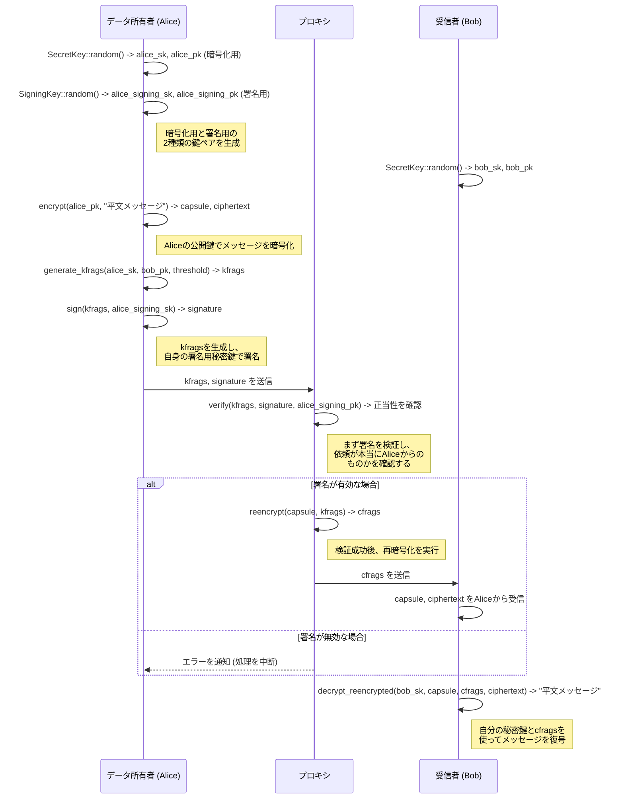

```mermaid
sequenceDiagram
    participant Alice as データ所有者 (Alice)
    participant Proxy as プロキシ
    participant Bob as 受信者 (Bob)

    %% 1. 鍵生成
    Alice->>Alice: SecretKey::random() -> alice_sk, alice_pk (暗号化用)
    Alice->>Alice: SigningKey::random() -> alice_signing_sk, alice_signing_pk (署名用)
    note right of Alice: 暗号化用と署名用の<br/>2種類の鍵ペアを生成

    Bob->>Bob: SecretKey::random() -> bob_sk, bob_pk

    %% 2. 暗号化
    Alice->>Alice: encrypt(alice_pk, "平文メッセージ") -> capsule, ciphertext
    note right of Alice: Aliceの公開鍵でメッセージを暗号化

    %% 3. 再暗号化鍵の生成と署名
    Alice->>Alice: generate_kfrags(alice_sk, bob_pk, threshold) -> kfrags
    Alice->>Alice: sign(kfrags, alice_signing_sk) -> signature
    note right of Alice: kfragsを生成し、<br/>自身の署名用秘密鍵で署名
    Alice->>Proxy: kfrags, signature を送信

    %% 4. 署名検証と再暗号化
    Proxy->>Proxy: verify(kfrags, signature, alice_signing_pk) -> 正当性を確認
    note right of Proxy: まず署名を検証し、<br/>依頼が本当にAliceからの<br/>ものかを確認する

    alt 署名が有効な場合
        Proxy->>Proxy: reencrypt(capsule, kfrags) -> cfrags
        note right of Proxy: 検証成功後、再暗号化を実行
        Proxy->>Bob: cfrags を送信
        Bob->>Bob: capsule, ciphertext をAliceから受信
    else 署名が無効な場合
        Proxy-->>Alice: エラーを通知 (処理を中断)
    end


    %% 5. 復号
    Bob->>Bob: decrypt_reencrypted(bob_sk, capsule, cfrags, ciphertext) -> "平文メッセージ"
    note right of Bob: 自分の秘密鍵とcfragsを<br/>使ってメッセージを復号
```
