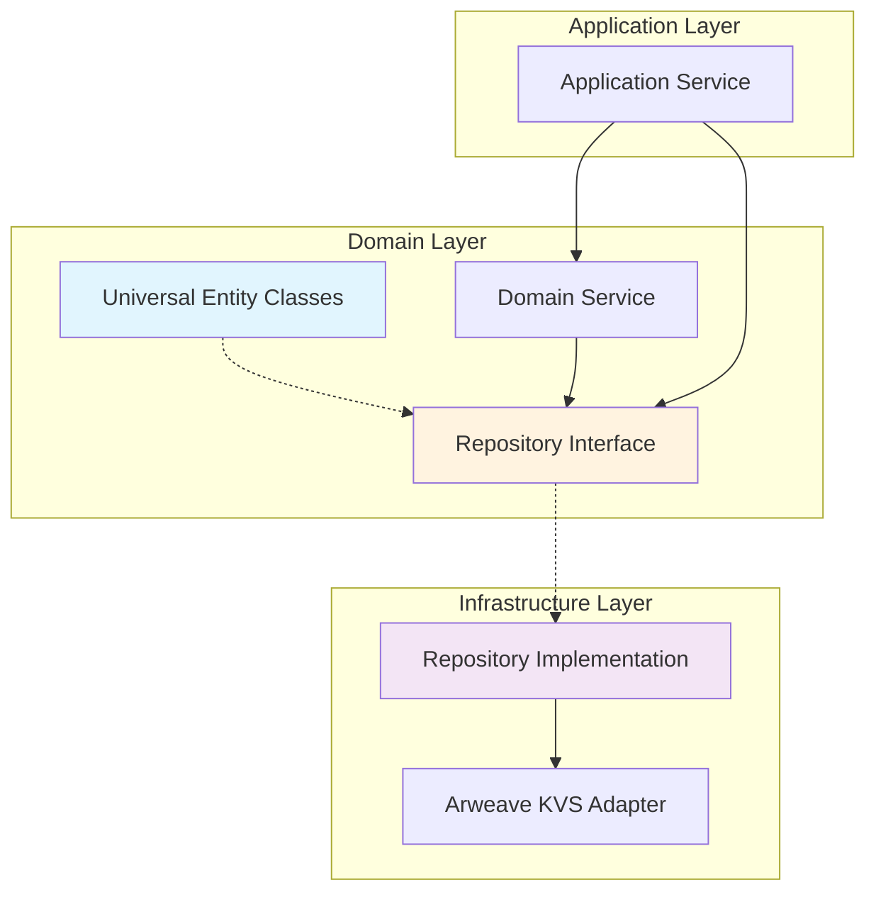
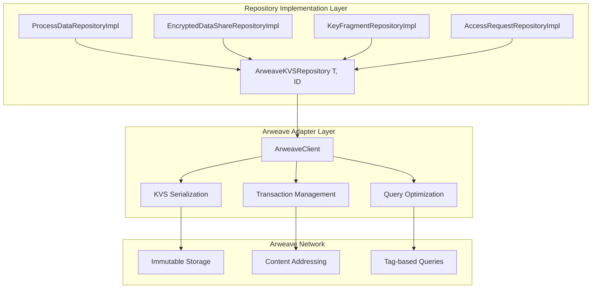
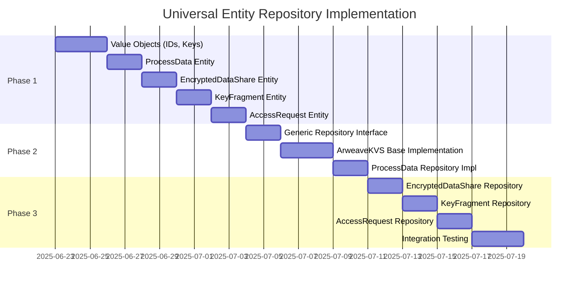

# D-TPRES 普遍的Entity・Repository設計: TERASOLUNA準拠のドメイン層アーキテクチャ

## 1. 設計方針

### 1.1 基本原則

TERASOLUNAガイドラインに従い、以下の設計原則を採用します：

1. **Entityはデータ保持専用**: ビジネスロジックを含まず、純粋にデータを表現
2. **Repository責務明確化**: EntityのCRUD操作とライフサイクル管理を担当
3. **業務ロジック分離**: ServiceがRepositoryを使用してビジネスルールを実装
4. **普遍的設計**: 各プロセスがOwner、Holder、Requester機能を持ちうる前提

### 1.2 アーキテクチャ概要



---

## 2. Universal Entity Classes設計

### 2.1 設計思想

各AOプロセスが普遍的に持ちうるEntityとして設計し、Owner/Holder/Requester固有の属性も包含した統合的なデータモデルを提供します。

### 2.2 CoreEntity: ProcessData

**用途**: 各AOプロセスの基本データを保持する中心的Entity

```rust
/// プロセスデータエンティティ
/// 各AOプロセスが持つ基本的な情報を統合的に保持
#[derive(Debug, Clone, PartialEq, Serialize, Deserialize)]
pub struct ProcessData {
    /// プロセス識別子
    pub process_id: ProcessId,
    
    /// プロセス作成日時
    pub created_at: SystemTime,
    
    /// プロセスメタデータ
    pub metadata: ProcessMetadata,
    
    /// Owner機能データ（Ownerとして動作する場合）
    pub owner_data: Option<OwnerData>,
    
    /// Holder機能データ（Holderとして動作する場合）
    pub holder_data: Option<HolderData>,
    
    /// Requester機能データ（Requesterとして動作する場合）  
    pub requester_data: Option<RequesterData>,
    
    /// バージョン（楽観ロック用）
    pub version: u64,
}

/// プロセスメタデータ
#[derive(Debug, Clone, PartialEq, Serialize, Deserialize)]
pub struct ProcessMetadata {
    /// プロセス名
    pub name: String,
    
    /// プロセス設定
    pub configuration: HashMap<String, String>,
    
    /// 対応可能な暗号操作
    pub supported_operations: Vec<CryptoOperation>,
    
    /// 最大同時操作数
    pub max_concurrent_operations: u32,
    
    /// ネットワーク情報
    pub network_info: NetworkInfo,
}

/// Owner機能データ
#[derive(Debug, Clone, PartialEq, Serialize, Deserialize)]
pub struct OwnerData {
    /// オーナー公開鍵
    pub public_key: PublicKey,
    
    /// 管理対象データリスト
    pub managed_data_ids: Vec<DataId>,
    
    /// 生成した総シェア数
    pub total_shares_created: u64,
    
    /// 生成した総フラグメント数
    pub total_fragments_created: u64,
}

/// Holder機能データ
#[derive(Debug, Clone, PartialEq, Serialize, Deserialize)]
pub struct HolderData {
    /// 保持中の鍵フラグメント数
    pub held_fragments_count: u64,
    
    /// 処理完了済み再暗号化数
    pub completed_reencryptions: u64,
    
    /// Holder信頼性スコア
    pub reliability_score: f64,
    
    /// 最大保持可能フラグメント数
    pub max_fragment_capacity: u64,
}

/// Requester機能データ
#[derive(Debug, Clone, PartialEq, Serialize, Deserialize)]
pub struct RequesterData {
    /// 実行中のアクセス要求数
    pub active_requests_count: u64,
    
    /// 完了済みアクセス要求数
    pub completed_requests: u64,
    
    /// アクセス成功率
    pub success_rate: f64,
    
    /// 平均要求処理時間（ミリ秒）
    pub average_request_time_ms: u64,
}

/// ネットワーク情報
#[derive(Debug, Clone, PartialEq, Serialize, Deserialize)]
pub struct NetworkInfo {
    /// 最終アクティビティ時刻
    pub last_activity_at: SystemTime,
    
    /// オンライン状態
    pub is_online: bool,
    
    /// 平均レスポンス時間
    pub average_response_time_ms: u64,
    
    /// 成功操作数
    pub successful_operations: u64,
    
    /// 失敗操作数
    pub failed_operations: u64,
}

/// 暗号操作種別
#[derive(Debug, Clone, PartialEq, Serialize, Deserialize)]
pub enum CryptoOperation {
    ShamirSecretSharing,
    UmbralProxyReencryption,
    ThresholdDecryption,
    KeyGeneration,
}
```

### 2.3 DataEntity: EncryptedDataShare

**用途**: Shamir Secret Sharingによる暗号化データシェアを表現

```rust
/// 暗号化データシェアエンティティ
/// Shamir Secret Sharingで分割されたデータシェアを表現
#[derive(Debug, Clone, PartialEq, Serialize, Deserialize)]
pub struct EncryptedDataShare {
    /// シェア識別子
    pub share_id: ShareId,
    
    /// データグループ識別子
    pub data_id: DataId,
    
    /// 閾値インデックス（1からnまで）
    pub threshold_index: u8,
    
    /// 暗号化されたフラグメントデータ
    pub encrypted_fragment: Vec<u8>,
    
    /// フラグメントサイズ（バイト）
    pub fragment_size: usize,
    
    /// データオーナーの公開鍵
    pub owner_public_key: PublicKey,
    
    /// 整合性検証用ハッシュ
    pub integrity_hash: [u8; 32],
    
    /// 作成日時
    pub created_at: SystemTime,
    
    /// 最終アクセス日時
    pub last_accessed_at: Option<SystemTime>,
    
    /// バージョン
    pub version: u64,
}
```

### 2.4 KeyEntity: KeyFragment

**用途**: Umbral Proxy Re-Encryptionの鍵フラグメントを表現

```rust
/// 鍵フラグメントエンティティ
/// Umbral PREで使用される鍵フラグメントを表現
#[derive(Debug, Clone, PartialEq, Serialize, Deserialize)]
pub struct KeyFragment {
    /// フラグメント識別子
    pub fragment_id: KeyFragmentId,
    
    /// 関連データ識別子
    pub data_id: DataId,
    
    /// オーナー公開鍵
    pub owner_public_key: PublicKey,
    
    /// 受信者公開鍵
    pub recipient_public_key: PublicKey,
    
    /// Umbral鍵フラグメントデータ
    pub umbral_fragment_data: Vec<u8>,
    
    /// 割り当てHolderプロセスID
    pub assigned_holder_id: ProcessId,
    
    /// フラグメント状態
    pub status: FragmentStatus,
    
    /// 有効期限
    pub expires_at: Option<SystemTime>,
    
    /// 作成日時
    pub created_at: SystemTime,
    
    /// 最終更新日時
    pub updated_at: SystemTime,
    
    /// バージョン
    pub version: u64,
}

/// フラグメント状態
#[derive(Debug, Clone, PartialEq, Serialize, Deserialize)]
pub enum FragmentStatus {
    /// 利用可能
    Available,
    /// 使用済み
    Consumed,
    /// 期限切れ
    Expired,
    /// 無効化済み
    Revoked,
}
```

### 2.5 RequestEntity: AccessRequest

**用途**: データアクセス要求の状態を管理

```rust
/// アクセス要求エンティティ
/// データアクセス要求とその処理状態を表現
#[derive(Debug, Clone, PartialEq, Serialize, Deserialize)]
pub struct AccessRequest {
    /// 要求識別子
    pub request_id: RequestId,
    
    /// 要求対象データID
    pub data_id: DataId,
    
    /// 要求者プロセスID
    pub requester_id: ProcessId,
    
    /// データオーナー公開鍵
    pub owner_public_key: PublicKey,
    
    /// 受信者公開鍵
    pub recipient_public_key: PublicKey,
    
    /// 要求状態
    pub status: RequestStatus,
    
    /// 必要な閾値数
    pub required_threshold: u8,
    
    /// 収集済みフラグメント数
    pub collected_fragments_count: u8,
    
    /// 対象Holderプロセス一覧
    pub target_holder_ids: Vec<ProcessId>,
    
    /// 要求作成日時
    pub created_at: SystemTime,
    
    /// 要求完了日時
    pub completed_at: Option<SystemTime>,
    
    /// タイムアウト時刻
    pub timeout_at: SystemTime,
    
    /// バージョン
    pub version: u64,
}

/// 要求状態
#[derive(Debug, Clone, PartialEq, Serialize, Deserialize)]
pub enum RequestStatus {
    /// 処理中
    InProgress,
    /// 完了
    Completed,
    /// 失敗
    Failed,
    /// タイムアウト
    TimedOut,
    /// キャンセル済み
    Cancelled,
}
```

---

## 3. Repository Interface設計

### 3.1 Generic Repository Pattern

**基本方針**: 全てのEntityに共通するCRUD操作を提供する汎用的なRepository interface

```rust
/// 汎用Repositoryインターフェース
/// 全てのEntityに共通するCRUD操作を定義
pub trait Repository<T, ID> {
    type Error: std::error::Error + Send + Sync;
    
    /// エンティティ保存
    async fn save(&self, entity: &T) -> Result<(), Self::Error>;
    
    /// ID による検索
    async fn find_by_id(&self, id: &ID) -> Result<Option<T>, Self::Error>;
    
    /// 全件取得
    async fn find_all(&self) -> Result<Vec<T>, Self::Error>;
    
    /// エンティティ更新
    async fn update(&self, entity: &T) -> Result<(), Self::Error>;
    
    /// エンティティ削除
    async fn delete(&self, id: &ID) -> Result<(), Self::Error>;
    
    /// 存在確認
    async fn exists(&self, id: &ID) -> Result<bool, Self::Error>;
    
    /// 件数取得
    async fn count(&self) -> Result<usize, Self::Error>;
}
```

### 3.2 ProcessData Repository Interface

```rust
/// ProcessDataリポジトリ専用インターフェース
/// プロセス固有のクエリメソッドを提供
pub trait ProcessDataRepository: Repository<ProcessData, ProcessId> {
    /// 機能別プロセス検索
    async fn find_by_capability(&self, operation: CryptoOperation) -> Result<Vec<ProcessData>, Self::Error>;
    
    /// オンラインプロセス検索
    async fn find_online_processes(&self) -> Result<Vec<ProcessData>, Self::Error>;
    
    /// Owner機能を持つプロセス検索
    async fn find_processes_with_owner_capability(&self) -> Result<Vec<ProcessData>, Self::Error>;
    
    /// Holder機能を持つプロセス検索
    async fn find_processes_with_holder_capability(&self) -> Result<Vec<ProcessData>, Self::Error>;
    
    /// Requester機能を持つプロセス検索
    async fn find_processes_with_requester_capability(&self) -> Result<Vec<ProcessData>, Self::Error>;
    
    /// 信頼性スコア順検索
    async fn find_by_reliability_score_desc(&self, limit: usize) -> Result<Vec<ProcessData>, Self::Error>;
    
    /// 負荷容量検索
    async fn find_by_available_capacity(&self, min_capacity: u64) -> Result<Vec<ProcessData>, Self::Error>;
    
    /// ネットワーク情報更新
    async fn update_network_info(&self, process_id: &ProcessId, info: &NetworkInfo) -> Result<(), Self::Error>;
    
    /// Owner機能データ更新
    async fn update_owner_data(&self, process_id: &ProcessId, data: &OwnerData) -> Result<(), Self::Error>;
    
    /// Holder機能データ更新
    async fn update_holder_data(&self, process_id: &ProcessId, data: &HolderData) -> Result<(), Self::Error>;
    
    /// Requester機能データ更新
    async fn update_requester_data(&self, process_id: &ProcessId, data: &RequesterData) -> Result<(), Self::Error>;
}
```

### 3.3 EncryptedDataShare Repository Interface

```rust
/// EncryptedDataShareリポジトリインターフェース
/// データシェア管理のためのクエリメソッドを提供
pub trait EncryptedDataShareRepository: Repository<EncryptedDataShare, ShareId> {
    /// データID別検索
    async fn find_by_data_id(&self, data_id: &DataId) -> Result<Vec<EncryptedDataShare>, Self::Error>;
    
    /// オーナー別検索
    async fn find_by_owner(&self, owner_pk: &PublicKey) -> Result<Vec<EncryptedDataShare>, Self::Error>;
    
    /// 閾値インデックス指定検索
    async fn find_by_threshold_index(
        &self, 
        data_id: &DataId, 
        index: u8
    ) -> Result<Option<EncryptedDataShare>, Self::Error>;
    
    /// 再構築用シェア収集
    async fn collect_for_reconstruction(
        &self, 
        data_id: &DataId, 
        threshold: u8
    ) -> Result<Vec<EncryptedDataShare>, Self::Error>;
    
    /// フラグメントサイズ範囲検索
    async fn find_by_size_range(
        &self, 
        min_size: usize, 
        max_size: usize
    ) -> Result<Vec<EncryptedDataShare>, Self::Error>;
    
    /// 最終アクセス時刻更新
    async fn update_last_accessed(&self, share_id: &ShareId) -> Result<(), Self::Error>;
    
    /// 整合性検証
    async fn verify_integrity(&self, share_id: &ShareId) -> Result<bool, Self::Error>;
    
    /// 古いシェア検索（クリーンアップ用）
    async fn find_older_than(&self, threshold_date: SystemTime) -> Result<Vec<EncryptedDataShare>, Self::Error>;
}
```

### 3.4 KeyFragment Repository Interface

```rust
/// KeyFragmentリポジトリインターフェース
/// 鍵フラグメント管理のためのクエリメソッドを提供
pub trait KeyFragmentRepository: Repository<KeyFragment, KeyFragmentId> {
    /// データID別検索
    async fn find_by_data_id(&self, data_id: &DataId) -> Result<Vec<KeyFragment>, Self::Error>;
    
    /// Holder別検索
    async fn find_by_holder(&self, holder_id: &ProcessId) -> Result<Vec<KeyFragment>, Self::Error>;
    
    /// 複合キー検索
    async fn find_by_composite_key(
        &self,
        data_id: &DataId,
        owner_pk: &PublicKey,
        recipient_pk: &PublicKey,
    ) -> Result<Vec<KeyFragment>, Self::Error>;
    
    /// 状態別検索
    async fn find_by_status(&self, status: FragmentStatus) -> Result<Vec<KeyFragment>, Self::Error>;
    
    /// 利用可能フラグメント検索
    async fn find_available_for_reencryption(
        &self,
        data_id: &DataId,
        owner_pk: &PublicKey,
        recipient_pk: &PublicKey,
    ) -> Result<Vec<KeyFragment>, Self::Error>;
    
    /// 期限切れフラグメント検索
    async fn find_expired(&self) -> Result<Vec<KeyFragment>, Self::Error>;
    
    /// フラグメント状態更新
    async fn update_status(
        &self, 
        fragment_id: &KeyFragmentId, 
        status: FragmentStatus
    ) -> Result<(), Self::Error>;
    
    /// フラグメント消費マーキング
    async fn mark_as_consumed(&self, fragment_id: &KeyFragmentId) -> Result<(), Self::Error>;
    
    /// 期限切れフラグメントクリーンアップ
    async fn cleanup_expired(&self) -> Result<usize, Self::Error>;
    
    /// Holder負荷分散情報取得
    async fn get_holder_load_distribution(&self) -> Result<Vec<(ProcessId, u64)>, Self::Error>;
}
```

### 3.5 AccessRequest Repository Interface

```rust
/// AccessRequestリポジトリインターフェース
/// アクセス要求管理のためのクエリメソッドを提供
pub trait AccessRequestRepository: Repository<AccessRequest, RequestId> {
    /// 要求者別検索
    async fn find_by_requester(&self, requester_id: &ProcessId) -> Result<Vec<AccessRequest>, Self::Error>;
    
    /// データID別検索
    async fn find_by_data_id(&self, data_id: &DataId) -> Result<Vec<AccessRequest>, Self::Error>;
    
    /// 状態別検索
    async fn find_by_status(&self, status: RequestStatus) -> Result<Vec<AccessRequest>, Self::Error>;
    
    /// アクティブ要求検索
    async fn find_active_requests(&self) -> Result<Vec<AccessRequest>, Self::Error>;
    
    /// タイムアウト要求検索
    async fn find_timed_out_requests(&self) -> Result<Vec<AccessRequest>, Self::Error>;
    
    /// 要求状態更新
    async fn update_status(
        &self, 
        request_id: &RequestId, 
        status: RequestStatus
    ) -> Result<(), Self::Error>;
    
    /// フラグメント収集数更新
    async fn update_collected_fragments_count(
        &self,
        request_id: &RequestId,
        count: u8,
    ) -> Result<(), Self::Error>;
    
    /// 要求完了マーキング
    async fn mark_as_completed(
        &self, 
        request_id: &RequestId, 
        completed_at: SystemTime
    ) -> Result<(), Self::Error>;
    
    /// 古い要求クリーンアップ
    async fn cleanup_old_requests(&self, before: SystemTime) -> Result<usize, Self::Error>;
}
```

---

## 4. Repository Implementation設計

### 4.1 Arweave KVS Implementation Strategy



### 4.2 Generic ArweaveKVSRepository Implementation

```rust
/// Arweave KVS汎用リポジトリ実装
/// 全てのEntityに対する基本的なCRUD操作を提供
pub struct ArweaveKVSRepository<T, ID> {
    arweave_client: Arc<dyn ArweaveClient>,
    entity_type: &'static str,
    _phantom: PhantomData<(T, ID)>,
}

impl<T, ID> ArweaveKVSRepository<T, ID> 
where
    T: Serialize + for<'de> Deserialize<'de> + Clone + Send + Sync,
    ID: Display + Clone + Send + Sync,
{
    pub fn new(arweave_client: Arc<dyn ArweaveClient>, entity_type: &'static str) -> Self {
        Self {
            arweave_client,
            entity_type,
            _phantom: PhantomData,
        }
    }
    
    /// エンティティをArweaveに保存
    async fn store_entity(&self, entity: &T, id: &ID) -> Result<TxId, RepositoryError> {
        // エンティティのシリアライゼーション
        let serialized_data = serde_json::to_vec(entity)
            .map_err(RepositoryError::Serialization)?;
        
        // Arweaveタグの作成
        let tags = self.create_storage_tags(id);
        
        // Arweaveに保存
        let tx_id = self.arweave_client
            .store_data(serialized_data, tags)
            .await
            .map_err(RepositoryError::Storage)?;
        
        Ok(tx_id)
    }
    
    /// IDによるエンティティ取得
    async fn get_entity(&self, id: &ID) -> Result<Option<T>, RepositoryError> {
        // タグによるクエリ
        let query_tags = self.create_query_tags(id);
        
        let tx_ids = self.arweave_client
            .query_by_tags(query_tags)
            .await
            .map_err(RepositoryError::Storage)?;
        
        if let Some(tx_id) = tx_ids.first() {
            let data = self.arweave_client
                .get_data(tx_id)
                .await
                .map_err(RepositoryError::Storage)?;
            
            let entity: T = serde_json::from_slice(&data)
                .map_err(RepositoryError::Serialization)?;
            
            Ok(Some(entity))
        } else {
            Ok(None)
        }
    }
    
    /// ストレージ用タグ作成
    fn create_storage_tags(&self, id: &ID) -> HashMap<String, String> {
        let mut tags = HashMap::new();
        tags.insert("App-Name".to_string(), "D-TPRES".to_string());
        tags.insert("Entity-Type".to_string(), self.entity_type.to_string());
        tags.insert("Entity-Id".to_string(), id.to_string());
        tags.insert("Timestamp".to_string(), SystemTime::now()
            .duration_since(SystemTime::UNIX_EPOCH)
            .unwrap_or_default()
            .as_secs()
            .to_string());
        tags
    }
    
    /// クエリ用タグ作成
    fn create_query_tags(&self, id: &ID) -> HashMap<String, String> {
        let mut tags = HashMap::new();
        tags.insert("Entity-Type".to_string(), self.entity_type.to_string());
        tags.insert("Entity-Id".to_string(), id.to_string());
        tags
    }
}

/// Arweaveクライアントインターフェース
pub trait ArweaveClient: Send + Sync {
    async fn store_data(
        &self, 
        data: Vec<u8>, 
        tags: HashMap<String, String>
    ) -> Result<TxId, ArweaveError>;
    
    async fn get_data(&self, tx_id: &TxId) -> Result<Vec<u8>, ArweaveError>;
    
    async fn query_by_tags(
        &self, 
        tags: HashMap<String, String>
    ) -> Result<Vec<TxId>, ArweaveError>;
}
```

### 4.3 ProcessDataRepository Implementation

```rust
/// ProcessDataRepository実装
pub struct ProcessDataRepositoryImpl {
    base_repository: ArweaveKVSRepository<ProcessData, ProcessId>,
    arweave_client: Arc<dyn ArweaveClient>,
}

impl ProcessDataRepositoryImpl {
    pub fn new(arweave_client: Arc<dyn ArweaveClient>) -> Self {
        Self {
            base_repository: ArweaveKVSRepository::new(arweave_client.clone(), "ProcessData"),
            arweave_client,
        }
    }
}

#[async_trait]
impl Repository<ProcessData, ProcessId> for ProcessDataRepositoryImpl {
    type Error = RepositoryError;
    
    async fn save(&self, entity: &ProcessData) -> Result<(), Self::Error> {
        self.base_repository.store_entity(entity, &entity.process_id).await?;
        Ok(())
    }
    
    async fn find_by_id(&self, id: &ProcessId) -> Result<Option<ProcessData>, Self::Error> {
        self.base_repository.get_entity(id).await
    }
    
    async fn find_all(&self) -> Result<Vec<ProcessData>, Self::Error> {
        let query_tags = self.create_type_query_tags();
        let tx_ids = self.arweave_client
            .query_by_tags(query_tags)
            .await
            .map_err(RepositoryError::Storage)?;
        
        let mut entities = Vec::new();
        for tx_id in tx_ids {
            let data = self.arweave_client
                .get_data(&tx_id)
                .await
                .map_err(RepositoryError::Storage)?;
            
            let entity: ProcessData = serde_json::from_slice(&data)
                .map_err(RepositoryError::Serialization)?;
            
            entities.push(entity);
        }
        
        Ok(entities)
    }
    
    async fn update(&self, entity: &ProcessData) -> Result<(), Self::Error> {
        // Arweaveは不変のため、新しいバージョンとして保存
        let mut updated_entity = entity.clone();
        updated_entity.version += 1;
        self.save(&updated_entity).await
    }
    
    async fn delete(&self, id: &ProcessId) -> Result<(), Self::Error> {
        // Arweaveは不変のため、論理削除マーカーを保存
        let deletion_marker = self.create_deletion_marker(id);
        self.arweave_client
            .store_data(deletion_marker, self.create_deletion_tags(id))
            .await
            .map_err(RepositoryError::Storage)?;
        Ok(())
    }
    
    async fn exists(&self, id: &ProcessId) -> Result<bool, Self::Error> {
        Ok(self.find_by_id(id).await?.is_some())
    }
    
    async fn count(&self) -> Result<usize, Self::Error> {
        Ok(self.find_all().await?.len())
    }
}

#[async_trait]
impl ProcessDataRepository for ProcessDataRepositoryImpl {
    async fn find_by_capability(&self, operation: CryptoOperation) -> Result<Vec<ProcessData>, Self::Error> {
        let all_processes = self.find_all().await?;
        let filtered = all_processes.into_iter()
            .filter(|p| p.metadata.supported_operations.contains(&operation))
            .collect();
        Ok(filtered)
    }
    
    async fn find_online_processes(&self) -> Result<Vec<ProcessData>, Self::Error> {
        let all_processes = self.find_all().await?;
        let online = all_processes.into_iter()
            .filter(|p| p.metadata.network_info.is_online)
            .collect();
        Ok(online)
    }
    
    async fn find_processes_with_owner_capability(&self) -> Result<Vec<ProcessData>, Self::Error> {
        let all_processes = self.find_all().await?;
        let with_owner = all_processes.into_iter()
            .filter(|p| p.owner_data.is_some())
            .collect();
        Ok(with_owner)
    }
    
    async fn find_processes_with_holder_capability(&self) -> Result<Vec<ProcessData>, Self::Error> {
        let all_processes = self.find_all().await?;
        let with_holder = all_processes.into_iter()
            .filter(|p| p.holder_data.is_some())
            .collect();
        Ok(with_holder)
    }
    
    async fn find_processes_with_requester_capability(&self) -> Result<Vec<ProcessData>, Self::Error> {
        let all_processes = self.find_all().await?;
        let with_requester = all_processes.into_iter()
            .filter(|p| p.requester_data.is_some())
            .collect();
        Ok(with_requester)
    }
    
    async fn find_by_reliability_score_desc(&self, limit: usize) -> Result<Vec<ProcessData>, Self::Error> {
        let mut processes = self.find_processes_with_holder_capability().await?;
        processes.sort_by(|a, b| {
            let score_a = a.holder_data.as_ref().map(|h| h.reliability_score).unwrap_or(0.0);
            let score_b = b.holder_data.as_ref().map(|h| h.reliability_score).unwrap_or(0.0);
            score_b.partial_cmp(&score_a).unwrap_or(std::cmp::Ordering::Equal)
        });
        processes.truncate(limit);
        Ok(processes)
    }
    
    async fn find_by_available_capacity(&self, min_capacity: u64) -> Result<Vec<ProcessData>, Self::Error> {
        let all_processes = self.find_processes_with_holder_capability().await?;
        let with_capacity = all_processes.into_iter()
            .filter(|p| {
                if let Some(holder_data) = &p.holder_data {
                    let available = holder_data.max_fragment_capacity - holder_data.held_fragments_count;
                    available >= min_capacity
                } else {
                    false
                }
            })
            .collect();
        Ok(with_capacity)
    }
    
    async fn update_network_info(&self, process_id: &ProcessId, info: &NetworkInfo) -> Result<(), Self::Error> {
        if let Some(mut process) = self.find_by_id(process_id).await? {
            process.metadata.network_info = info.clone();
            self.update(&process).await?;
        }
        Ok(())
    }
    
    async fn update_owner_data(&self, process_id: &ProcessId, data: &OwnerData) -> Result<(), Self::Error> {
        if let Some(mut process) = self.find_by_id(process_id).await? {
            process.owner_data = Some(data.clone());
            self.update(&process).await?;
        }
        Ok(())
    }
    
    async fn update_holder_data(&self, process_id: &ProcessId, data: &HolderData) -> Result<(), Self::Error> {
        if let Some(mut process) = self.find_by_id(process_id).await? {
            process.holder_data = Some(data.clone());
            self.update(&process).await?;
        }
        Ok(())
    }
    
    async fn update_requester_data(&self, process_id: &ProcessId, data: &RequesterData) -> Result<(), Self::Error> {
        if let Some(mut process) = self.find_by_id(process_id).await? {
            process.requester_data = Some(data.clone());
            self.update(&process).await?;
        }
        Ok(())
    }
}

impl ProcessDataRepositoryImpl {
    fn create_type_query_tags(&self) -> HashMap<String, String> {
        let mut tags = HashMap::new();
        tags.insert("Entity-Type".to_string(), "ProcessData".to_string());
        tags
    }
    
    fn create_deletion_marker(&self, id: &ProcessId) -> Vec<u8> {
        format!("DELETED:{}", id.value()).into_bytes()
    }
    
    fn create_deletion_tags(&self, id: &ProcessId) -> HashMap<String, String> {
        let mut tags = HashMap::new();
        tags.insert("Entity-Type".to_string(), "ProcessData".to_string());
        tags.insert("Entity-Id".to_string(), id.to_string());
        tags.insert("Operation".to_string(), "DELETE".to_string());
        tags
    }
}
```

### 4.4 Repository Error Handling

```rust
/// リポジトリエラー定義
#[derive(Debug, thiserror::Error)]
pub enum RepositoryError {
    #[error("Serialization error: {0}")]
    Serialization(#[from] serde_json::Error),
    
    #[error("Storage error: {0}")]
    Storage(#[from] ArweaveError),
    
    #[error("Entity not found: {id}")]
    NotFound { id: String },
    
    #[error("Concurrent modification detected")]
    ConcurrentModification,
    
    #[error("Invalid entity data: {0}")]
    InvalidData(String),
    
    #[error("Transaction failed: {0}")]
    TransactionFailed(String),
}

/// Arweaveエラー定義
#[derive(Debug, thiserror::Error)]
pub enum ArweaveError {
    #[error("Network error: {0}")]
    Network(String),
    
    #[error("Transaction not found: {tx_id}")]
    TransactionNotFound { tx_id: String },
    
    #[error("Invalid transaction data")]
    InvalidData,
    
    #[error("Storage quota exceeded")]
    QuotaExceeded,
    
    #[error("Timeout occurred")]
    Timeout,
}
```

---

## 5. Value Objects設計

### 5.1 識別子Value Objects

```rust
/// プロセス識別子
#[derive(Debug, Clone, PartialEq, Eq, Hash, Serialize, Deserialize)]
pub struct ProcessId {
    value: String,
}

impl ProcessId {
    pub fn new(value: String) -> Self {
        Self { value }
    }
    
    pub fn generate() -> Self {
        Self {
            value: format!("proc_{}", uuid::Uuid::new_v4()),
        }
    }
    
    pub fn value(&self) -> &str {
        &self.value
    }
}

impl Display for ProcessId {
    fn fmt(&self, f: &mut std::fmt::Formatter<'_>) -> std::fmt::Result {
        write!(f, "{}", self.value)
    }
}

/// データ識別子
#[derive(Debug, Clone, PartialEq, Eq, Hash, Serialize, Deserialize)]
pub struct DataId {
    value: String,
}

impl DataId {
    pub fn new(value: String) -> Self {
        Self { value }
    }
    
    pub fn generate() -> Self {
        Self {
            value: uuid::Uuid::new_v4().to_string(),
        }
    }
    
    pub fn value(&self) -> &str {
        &self.value
    }
}

impl Display for DataId {
    fn fmt(&self, f: &mut std::fmt::Formatter<'_>) -> std::fmt::Result {
        write!(f, "{}", self.value)
    }
}

/// シェア識別子
#[derive(Debug, Clone, PartialEq, Eq, Hash, Serialize, Deserialize)]
pub struct ShareId {
    value: String,
}

impl ShareId {
    pub fn new(value: String) -> Self {
        Self { value }
    }
    
    pub fn generate() -> Self {
        Self {
            value: uuid::Uuid::new_v4().to_string(),
        }
    }
    
    pub fn value(&self) -> &str {
        &self.value
    }
}

impl Display for ShareId {
    fn fmt(&self, f: &mut std::fmt::Formatter<'_>) -> std::fmt::Result {
        write!(f, "{}", self.value)
    }
}

/// 鍵フラグメント識別子
#[derive(Debug, Clone, PartialEq, Eq, Hash, Serialize, Deserialize)]
pub struct KeyFragmentId {
    value: String,
}

impl KeyFragmentId {
    pub fn new(value: String) -> Self {
        Self { value }
    }
    
    pub fn generate() -> Self {
        Self {
            value: uuid::Uuid::new_v4().to_string(),
        }
    }
    
    pub fn value(&self) -> &str {
        &self.value
    }
}

impl Display for KeyFragmentId {
    fn fmt(&self, f: &mut std::fmt::Formatter<'_>) -> std::fmt::Result {
        write!(f, "{}", self.value)
    }
}

/// 要求識別子
#[derive(Debug, Clone, PartialEq, Eq, Hash, Serialize, Deserialize)]
pub struct RequestId {
    value: String,
}

impl RequestId {
    pub fn new(value: String) -> Self {
        Self { value }
    }
    
    pub fn generate() -> Self {
        Self {
            value: uuid::Uuid::new_v4().to_string(),
        }
    }
    
    pub fn value(&self) -> &str {
        &self.value
    }
}

impl Display for RequestId {
    fn fmt(&self, f: &mut std::fmt::Formatter<'_>) -> std::fmt::Result {
        write!(f, "{}", self.value)
    }
}

/// Arweave取引識別子
#[derive(Debug, Clone, PartialEq, Eq, Hash, Serialize, Deserialize)]
pub struct TxId {
    value: String,
}

impl TxId {
    pub fn new(value: String) -> Self {
        Self { value }
    }
    
    pub fn value(&self) -> &str {
        &self.value
    }
}

impl Display for TxId {
    fn fmt(&self, f: &mut std::fmt::Formatter<'_>) -> std::fmt::Result {
        write!(f, "{}", self.value)
    }
}
```

### 5.2 暗号学的Value Objects

```rust
/// 公開鍵
#[derive(Debug, Clone, PartialEq, Eq, Hash, Serialize, Deserialize)]
pub struct PublicKey {
    bytes: [u8; 32],
}

impl PublicKey {
    pub fn new(bytes: [u8; 32]) -> Self {
        Self { bytes }
    }
    
    pub fn as_bytes(&self) -> &[u8; 32] {
        &self.bytes
    }
    
    pub fn to_hex(&self) -> String {
        hex::encode(self.bytes)
    }
    
    pub fn from_hex(hex_str: &str) -> Result<Self, &'static str> {
        let bytes = hex::decode(hex_str)
            .map_err(|_| "Invalid hex string")?;
        
        if bytes.len() != 32 {
            return Err("Public key must be 32 bytes");
        }
        
        let mut key_bytes = [0u8; 32];
        key_bytes.copy_from_slice(&bytes);
        Ok(Self::new(key_bytes))
    }
}

impl Display for PublicKey {
    fn fmt(&self, f: &mut std::fmt::Formatter<'_>) -> std::fmt::Result {
        write!(f, "{}", self.to_hex())
    }
}
```

---

## 6. 実装ロードマップ

### 6.1 Phase 1: Core Entities & Value Objects (Week 1-2)



### 6.2 Implementation Checklist

#### Phase 1: Entity & Value Objects
- [ ] 全識別子Value Objects実装
- [ ] 暗号学的Value Objects実装
- [ ] ProcessData Entity実装
- [ ] EncryptedDataShare Entity実装
- [ ] KeyFragment Entity実装
- [ ] AccessRequest Entity実装
- [ ] 単体テスト作成

#### Phase 2: Repository Interfaces
- [ ] Generic Repository trait定義
- [ ] ProcessDataRepository interface定義
- [ ] EncryptedDataShareRepository interface定義
- [ ] KeyFragmentRepository interface定義
- [ ] AccessRequestRepository interface定義
- [ ] Error型定義

#### Phase 3: Repository Implementations
- [ ] ArweaveKVSRepository base実装
- [ ] ProcessDataRepositoryImpl実装
- [ ] EncryptedDataShareRepositoryImpl実装
- [ ] KeyFragmentRepositoryImpl実装
- [ ] AccessRequestRepositoryImpl実装
- [ ] 統合テスト作成

---

## 7. 結論

### 7.1 設計の利点

1. **Universal Design**: 各プロセスがOwner/Holder/Requester機能を持ちうる柔軟性
2. **Clear Separation**: EntityとRepositoryの責務が明確に分離
3. **CRUD Focus**: RepositoryがEntityのライフサイクル管理に専念
4. **Arweave Optimized**: 不変ストレージの特性を活かした設計
5. **Type Safety**: 強い型システムによる実行時エラーの削減

### 7.2 TERASOLUNAガイドライン準拠

- **Entity**: 純粋なデータ保持クラス（メソッドなし）
- **Repository**: Entityの永続化とCRUD操作を担当
- **Service**: ビジネスロジックの実装（別途設計）
- **Infrastructure**: Arweave固有の実装詳細を隠蔽

### 7.3 次のステップ

1. **Phase 1実装開始**: Value Objects & Entitiesの実装
2. **Repository Interface定義**: 各Entityに対するCRUD操作定義
3. **Arweave KVS Implementation**: 永続化層の具体実装
4. **Service Layer設計**: ビジネスロジック層の設計開始

---

*本設計は、D-TPRESプロジェクトの普遍的Entity・Repository層の包括的な設計仕様です。TERASOLUNAガイドラインに準拠し、各プロセスの多機能性と Arweave KVSの特性を最大限活用します。*

**Document Status**: Ready for Implementation  
**Compliance**: TERASOLUNA DDD Guidelines  
**Next Phase**: Phase 1 Implementation Start