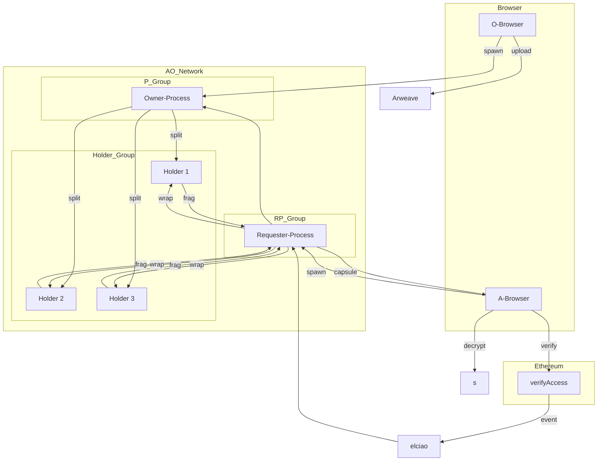

# Product Requirements Document (PRD)

## 1. Overview

**Product Name**  
Deterministic Threshold Proxy Re-Encryption System (D-TPRES)

**Purpose**  
完全にステートレスな Threshold PRE for Decentralized Storage  
スマートコントラクトで定義されたアクセス制御条件を決定論的に検証しつつ、分散型のしきい値Proxy再暗号化により暗号鍵を安全に復元する分散型鍵管理レイヤーとして以下の流れで稼働し続けるサービスの開発と運用。

***パーミッションレスで決定論的なアクセス制御***  
EVM スマートコントラクトで定義した条件を 1 Tx で確定させ、その検証ログだけを根拠に秘密鍵復元をトリガーする。

***ストレージとアクセス制御のコンセンサスを統一***  
Arweave ブロックウィーブ上に 暗号化シェア と メッセージログ を保存し、AO プロセスだけで暗号ワークフローを完結。

***CPU 固有機能に依存しない***  
Threshold Proxy Re-Encryption（TPRE）を採用。  
データオーナーがデータを暗号化し、それをパブリックなブロックチェーンストレージネットワーク（Arweave）に保存し、誰でもその暗号文を取得可能である一方、常時稼働の秘密鍵管理サーバーを必要とせずに、認可されたユーザーだけが復号可能になるような設計

**PHASE 0 プロセス生成と鍵準備**

| #   | アクター          | ステップ                                                                                 |
| --- | ------------- | ------------------------------------------------------------------------------------ |
| 0-1 | **各ユーザ**      | `spawn(UserLogic)` → **Pᵤ** が Arweave にデプロイ（コードは同一 TxID）                             |
| 0-2 | **O-Browser** | 自分の **Pᴼ** だけ `role="owner"` で spawn → skᴼ を *Shamir 3-of-5 + TFHE Enc* で自 DB に保存 |

**PHASE 1 秘密分割 & 公開ストレージ**

| #   | アクター          | ステップ                          | Arweave Tx |
| --- | ------------- | ----------------------------- | ---------- |
| 1-1 | **O-Browser** | Shamir(k,n) → f(1)…f(n)       | –          |
| 1-2 | **O-Browser** | 乱数鍵 Kᵢ 生成                     | –          |
| 1-3 | **O-Browser** | Capsuleᵢ = `PRE_Enc(pkᴼ, Kᵢ)` | Capsuleᵢ   |
| 1-4 | **O-Browser** | Cᵢ = `AES_GCM(Kᵢ, f(i))`      | Cᵢ         |
| 1-5 | **Pᴼ**        | Capsuleᵢ, Cᵢ を投稿              | 公開完了       |

**PHASE 2 アクセス要求 & EVM 検証**

| #   | アクター          | ステップ                                            |
| --- | ------------- | ----------------------------------------------- |
| 2-1 | **A-Browser** | KeyGen → (pkᴬ, skᴬ)                             |
| 2-2 | 〃             | `verifyAccess(pkᴬ, sig)` を EVM-SC へ送信           |
| 2-3 | **EVM-SC**    | 条件 OK → `VerificationOK(pkᴬ, addr)` イベント        |
| 2-4 | **elciao**    | BlockHeader+Receipt+pkᴬ ⇒ **ProofPkg** ⇒ **Pᴼ** |

**PHASE 3 再暗号化鍵の kFrag 分割と Holder 指名**

| #   | アクター       | ステップ                                                |
| --- | ---------- | --------------------------------------------------- |
| 3-1 | **Pᴼ**     | ReKeyGen: `rekey = PRE_ReKey(skᴼ → pkᴬ)`            |
| 3-2 | **Pᴼ**     | `kFragⱼ = Shamir_Split(rekey, k, n)`                |
| 3-3 | **Pᴼ→Pᵤⱼ** | オンライン上位 n プロセスを **Hⱼ** に指名し `storeKFrag(kFragⱼ)` 送信 |

**PHASE 4 k-of-n プロキシ再暗号化**

| #   | アクター          | ステップ                                                            |
| --- | ------------- | --------------------------------------------------------------- |
| 4-1 | **R-Proc**    | `wrapShare(i, pkᴬ)` を全 Holder へ fan-out                         |
| 4-2 | **Hⱼ**        | ① ProofPkg 中 pkᴬ 照合 ② `cFragⱼ = PRE_ReEnc(kFragⱼ, Capsuleᵢ)` |
| 4-3 | **Hⱼ→R-Proc** | cFragⱼ を Tx 返信                                                  |

**PHASE 5 クライアント復号 & 秘密復元**
| #   | アクター                   | ステップ                                            |
| --- | ---------------------- | ----------------------------------------------- |
| 5-1 | **R-Proc → A-Browser** | k 個 cFrag と Capsuleᵢ, Cᵢ をバッチ送付                 |
| 5-2 | **A-Browser**          | Capsule′ = `PRE_Combine(Capsuleᵢ, cFrag₁…k)`    |
| 5-3 | 〃                      | Kᵢ = `PRE_Dec(skᴬ, Capsule′)`                   |
| 5-4 | 〃                      | f(i) = `AES_DEC(Kᵢ, Cᵢ)` → k 個で補間 → **秘密 s 復元** |

**Key Features**: 主要なコンポーネントと機能

 - データオーナー（Alice）: 機密データを暗号化してアップロードするユーザ。オーナー側ブラウザ（O-Browser）で鍵生成やデータ暗号化を行います。  
 - データ利用者（Bob）: データへの復号権限を委譲されるユーザ。アクセサ側ブラウザ（A-Browser）でトークン保有証明を提出し、データ復号を行います。  
 - AOプロセス（プロキシノード）: Arweave上のAO (Arweave Compute) ネットワークで動作する分散プロセス群。WebAssembly対応の実行環境上で再暗号化や秘密分散のロジックを担当します。各プロセスは独立したアクターとして動作し、メッセージ経由で協調します
 - Arweaveストレージ: 永続的データ保存層。暗号化データ本体や再暗号化に必要なカプセル情報を記録します。ArweaveはAOにとって分散ハードディスクの役割を果たし、すべてのメッセージや状態が永久に記録されます  
 - スマートコントラクト (Ethereum/EVM): アクセス制御を実現するERC20トークン連動のコントラクト（仮にverifyAccessと呼称）。所定のトークン保有量を満たすユーザに対し、データアクセスの証明となるイベント（ProofPkg）を発行します。このブロックチェーン上のイベントはelciaoと呼ばれるAO向けライトクライアントによってArweaveに取り込まれ、AOプロセスが検証・利用します
 - HyperBeamノード (AO Compute Unit): AOネットワークを構成するノード群です。各ノードはCompute Unit (CU)としてWasmプロセスを実行し、必要に応じてTEE（Trusted Execution Environment）によるハードウェアレベルでのセキュア実行を提供します。

| ラベル           | アクター              | ロール                                   |
| ------------- | ----------------- | ------------------------------------ |
| **O-Browser** | 共有者フロント           | 秘密 (s) をアップロードする人                    |
| **Pᴼ**        | Owner-Process     | O-Browser が spawn。skᴼ を保持し ReKey を作る |
| **Pᵤ**        | User-Process u    | ネット参加者の常駐プロセス（全員同じロジック）              |
| **Hⱼ**        | Holder-Process j  | その時オンラインの Pᵤ から n 個を指名。kFrag 保持&再暗号化 |
| **R-Proc**    | Requester-Process | アクセス要求をまとめ、Holder へブロードキャスト          |
| **A-Browser** | アクセス者フロント         | 秘密を復号して受け取る人                         |
| **EVM-SC**    | Solidity コントラクト   | アクセス条件を決定論的に検証                       |
| **elciao**    | ブリッジ              | SC イベントを ProofPkg に打ち込み AO へ送る       |

ここで、PᴼとPᵤとR-Procは全て同じロジックをロードして動作を行うプロセスであるので、アクターの目的によって要求する振る舞いが変わっているだけである。（PᴼとPᵤとR-Procは互いに同じ機能を持ち、互いの機能を実行する能力を持つ（なぜなら、持つロジックは同じだから））

## 2. Goal and Scope (Phase1)

### Goal

 - Arweave 上に保存された暗号データを、オンチェーンで決定論的に検証可能な条件に基づき、再暗号化（Proxy Re-Encryption）を経て復号可能とする D-TPRES（Deterministic Threshold Proxy Re-Encryption System）を構築する。  

 - Threshold Proxy Re-Encryption（TPRE） により、復号権限を1アクターに集中させずに、k-of-n の分散アクターによって委譲・復号権限を構成する。  

 - Arweave（不変・公開ストレージ）、AO（分散 WASM 実行環境）、EVM（オンチェーン検証可能なアクセス制御）の 3つの分離されたインフラ層を統合し、真に分散型・非中央集権な鍵管理システムを実現する。

### Non-Goals

 - トラストレスな報酬・スラッシュ経済設計（インセンティブ層）  
 - 高速/低レイテンシの業務用ファイル共有  
 - 暗号プロトコル（PRE や MPC）の独自設計・新規アルゴリズム開発

### In Scope (MVP ver)

 - Umbral 型 TPRE 実装（umbral-pre）と Shamir Secret Sharing に基づく k-of-n プロキシ構成

 - データ所有者（Owner）のローカルブラウザでカプセル（Capsule）と暗号文（Ciphertext）の作成

 - EVM 上の verifyAccess スマートコントラクトによるトークン保有検証（ERC20）

 - AO 上で実行されるプロセス群による kFrag 保管・cFrag 計算（Wasmベース）

 - elciao による EVM イベントの ProofPkg 化と AO プロセスへの伝達

 - Arweave 上のカプセル・暗号文・カプセル断片の公開保存と検証的参照

 - ブラウザ（A-Browser）上での cFrag 収集・Capsule 再構築・復号処理

### Out of Scope (Future Improvement)

・ PVSS への拡張（定期シェアリフレッシュ）

・ TEEプロセスをホストするAOのCUノードの指定（このMVP下では通常のCUノードでホストされたプロセスで処理を行う）

・ FHEライブラリを用いたFHE演算を行う処理はPhase2で実装をするので、Phase1では、ライブラリを用いずに、ロジックのみで実装。

・ 他チェーン（Solana、BTC L2 など）へのブリッジ

・ 検証コントラクトにおける"トークンゲーティング"と"署名検証"以外の条件検証ロジック

## 3. High-Level Architecture

## 4. Detailed Requirements

docs/development/services/*に各サービスの詳細設計は記述

以下は要求定義

| コンポーネント                | 機能要件                                         | 実装方法                             |
| ---------------------- | -------------------------------------------- | -------------------------------- |
| Owner-Process (Pᴼ)     | skᴼ → ReKeyGen → Shamir 分割 → kFragⱼ 配布       | wasm-pre (`umbral-pre`) + `sssa` |
| Holder-Process (Hⱼ)    | kFragⱼ を受信・保存、cFragⱼ を Capsuleᵢ に対して生成       | ao-sqlite + wasm-pre             |
| Requester-Process (RP) | ProofPkg 受信、Holder 群へ wrapShare を送信、cFrag 収集 | Rust/Wasm                      |
| verifyAccess SC        | トークン保有を条件に `VerificationOK(pkᴬ)` を emit      | Solidity (ERC20)                 |
| elciao                 | SC イベントを Arweave に ProofPkg 化                | elciao indexer                   |
| O-Browser              | AES鍵生成 → Capsule 化 → Arweave 投稿              | WebCrypto + wasm-pre             |
| A-Browser              | ProofPkg 発行、cFrag 収集、復号                      | WebCrypto + Capsule.Combine      |

| 方針                                                                                         | メリット                                                                                                          | 留意点                                                     |
| ------------------------------------------------------------------------------------------ | ------------------------------------------------------------------------------------------------------------- | ------------------------------------------------------- |
| Rust で `dtpres_core` を実装し、 **Owner / Holder / Requester** の 3 ロールを 1 つの Wasm バイナリに同居 | - Arweave へのデプロイは **Tx 1 本** - すべて同じコードハッシュ → **検証容易** - ハンドラ分岐は **`msg.role`** や **`process.tag`** で実現 | - バイナリサイズ増 ⇒ 1Tx の手数料が上がる - Wasm 内でロール判定ロジックを明確化する必要 |

## 5. Technology & Tools

| 分類          | 使用予定技術                                                                    | 理由                          |
| ----------- | ------------------------------------------------------------------------- | --------------------------- |
| 暗号ライブラリ     | [`umbral-pre`](https://github.com/nucypher/umbral-pre), `sssa`, `aes-gcm` | Rust→Wasm ビルド可能、閾値 PRE 実装済み |
| AO プロセス実行環境 | [AO + HyperBEAM](https://github.com/permaweb/HyperBEAM)                   | 任意CU対応、TEEオプションもあり          |
| ストレージ       | [Arweave](https://www.arweave.org/), ao-sqlite                            | カプセル、暗号文、状態の永続保存            |
| ブロックチェーン連携  | [elciao](https://github.com/weaveVM/elciao)                               | EVMイベントをArweaveに取り込み、AOへ伝達  |
| フロントエンド     | WebCrypto API + ethers.js                                                 | ブラウザ上で鍵生成／署名／復号             |
| デプロイ        | [`ao-deploy`](https://github.com/pawanpaudel93/ao-deploy)                 | Arweave上へのプロセス公開            |

## 6. Security & Compliance

### 6.1. セキュリティ要件

| 評価軸          | チェック項目            | 考察                                                                                                           |
| ------------ | ----------------- | ------------------------------------------------------------------------------------------------------------ |
| **機密性**      | 公開データから秘密到達可否     | 公開セット {Capsuleᵢ, Cᵢ, kFragⱼ, cFragⱼ} は **IND-CPA**。`Capsule′` から Kᵢ を得るには skᴬ が必須 → 離散対数問題 (X25519, 128-bit) |
| **しきい値耐故障**  | Holder t < k ダウン時 | Shamir(k,n) ⇒ 最大 k-1 ノード故障時でも鍵再現可能                                                                           |
| **共謀耐性**     | k-1 Holder + 攻撃者  | kFrag は Shamir；k-1 では rekey 再構成不能                                                                            |
| **非転送性**     | 攻撃者が pkᴮ へ再委譲     | ReKeyGen には skᴼ が必須。kFrag は pkᴬ 固定                                                                           |
| **暗号基盤**     | 安全仮定              | TPRE (Umbral)= RLWE 128-bit / ECC X25519 AES-GCM 128                                                         |
| **転送完全性**    | cFrag 改ざん検出       | PRE 仕様内で暗号タグ検証；さらに AO メッセージに Ed25519 署名                                                                      | 
| **リプレイ防止**   | 旧 cFrag 再投下       | `nonce` + EVM block-height を ProofPkg に含め検証                                                                  | 
| **メモリ露出**    | RAM ダンプ           | 平文出現は瞬間 (rekey, kFrag)；`zeroize` で即ワイプ／TEE(Optional)                                                         | 
| **DoS 耐性**   | Holder 不応答        | n=5, k=3 → 2 不応答まで許容。リトライ & 再指名機構あり                                                                          | 
| **Sybil 耐性** | 攻撃者 Holder 独占     | Stake / Reputation フィルタ・ランダム指名をロードマップ                                                                        |
| **形式的証明**    | Provable security | Umbral は IND-CPA & Collusion Safety を論文証明 (Bermúdez et al.)                                                  |

### 6.2. リスク残存ポイント & 推奨対策

| リスク                       | 現状            | 推奨強化策                                                                          |
| ------------------------- | ------------- | ------------------------------------------------------------------------------ |
| **Sybil Holder 独占**       | Stake/Rep 未実装 | *Phase-2*: Holder 指名を VRF + 最低 Stake 要件に。悪質ノードは Slashing                       |
| **DoS (大量 wrapShare 連打)** | 無制限           | `rateLimiter` Lua ライブラリ；リクエスト毎に GAS ≈AR を徴収                                    |
| **乱数弱さ**                  | Lua 乱数に依存     | Rust `rand::rngs::OsRng` のみ使用。ブラウザは WebCrypto `getRandomValues`                |
| **実装バグ**                  | code 未監査      | *Static*: `cargo-audit`, `luacheck`; *Dynamic*: fuzz (`cargo-fuzz`, QuickFuzz) |
| **サイドチャネル**               | 非 TEE CU      | コンスタントタイム実装 (dalek, aes-gcm)；ARM NEON 隠れチャネル確認                                 |
