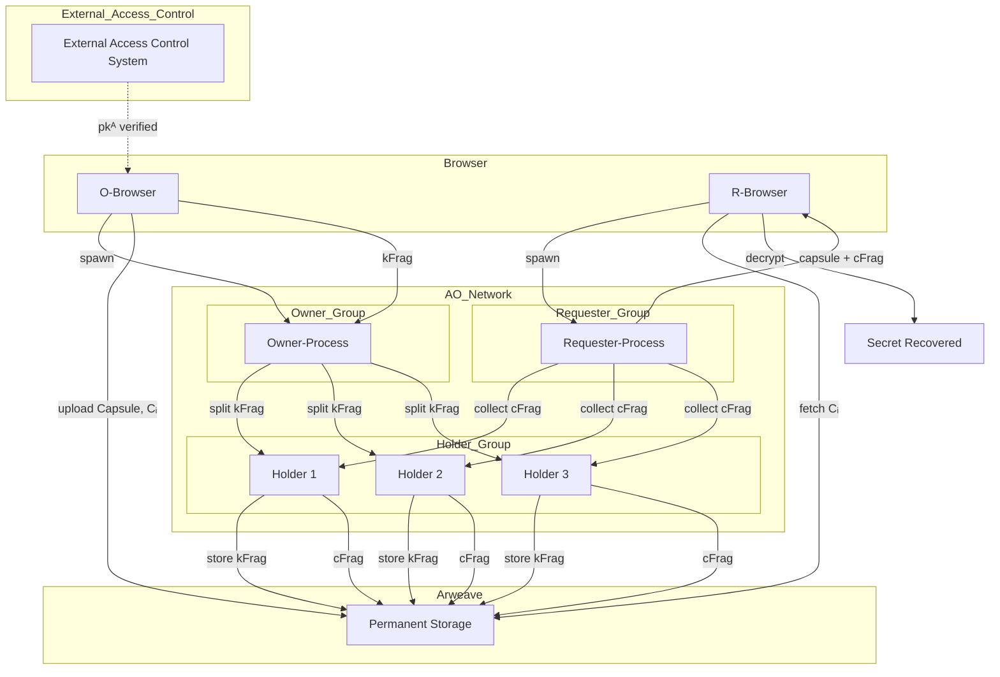

# Product Requirements Document (PRD)

## 1. Overview

**Product Name**
Deterministic Threshold Proxy Re-Encryption System (D-TPRES)

**Purpose**
D-TPRES は、Threshold Proxy Re-Encryption（TPRE）とシャミア秘密分散を組み合わせた分散型秘密管理システムです。暗号学的な秘密の分散・再暗号化・復元機能をローカルとオンチェーン環境のみで実行するDecentralized Key Managementレイヤーを提供します。

***分散型閾値暗号の実現***
k-of-n 閾値スキームを採用し、n個の独立したプロセスのうちk個が協調することで秘密復元を可能にします。単一障害点を完全に排除し、k未満のプロセスでは暗号学的に情報が一切漏洩しない堅牢なセキュリティを提供します。

***完全分散・ステートレスアーキテクチャ***
Arweave の不変ストレージと AO Network の分散 WebAssembly 実行環境により、中央集権的なサーバーやインフラストラクチャを一切必要としません。すべての状態が永続化され、プロセスはステートレスに実行されるため、高い可用性と拡張性を実現します。

***暗号学的完全性の保証***
Proxy Re-Encryption により、データ所有者の秘密鍵を一切露出することなく、第三者への安全な復号権限委譲を実現します。シャミア秘密分散との組み合わせにより、分散環境（オンチェーン）での確実な秘密復元と、暗号学的に証明可能なセキュリティを提供します。

**PHASE 1 秘密の分割と初期配布**

| #   | アクター          | ステップ                                                    | 備考 |
| --- | ------------- | ------------------------------------------------------- | ---- |
| 1-1 | **O-Browser** | 秘密鍵 `skₒ(PRE)`, 公開鍵 `pkₒ(PRE)`, 共通鍵 `kₒ`, 秘密 `f(0)=secret` を生成 | ローカル環境 |
| 1-2 | **O-Browser** | シャミア秘密分散: `f(0)` → `f(1)...f(n)` (k-of-n 閾値) | ローカル環境 |
| 1-3 | **O-Browser** | 暗号化シェア生成: n個の `Cᵢ = AES_GCM(kₒ, f(i))` (i=1...n) | ローカル環境 |
| 1-4 | **O-Browser** | カプセル生成: `Capsuleₒ = PRE_Enc(pkₒ, kₒ)` | ローカル環境 |
| 1-5 | **O-Browser** | Requesterの公開鍵 `pkᴬ` を受け取り（外部検証済み前提） | アクセス制御は外部完了 |
| 1-6 | **O-Browser** | 再暗号化キー生成: `rekey = PRE_ReKey(skₒ → pkᴬ)` | ローカル環境 |
| 1-7 | **O-Browser** | kFrag生成: `kFragⱼ = Shamir_Split(rekey, k, n)` | ローカル環境 |
| 1-8 | **O-Browser** | kFragをOwner-Processに送信 | AO Network |
| 1-9 | **O-Browser** | `Capsuleₒ`, n個の`Cᵢ` をArweaveに保存 | 永続化 |

**PHASE 2 キーフラグメントの分散管理**

| #   | アクター              | ステップ                                        | 備考 |
| --- | ----------------- | ------------------------------------------- | ---- |
| 2-1 | **Owner-Process** | RandAOを利用してn個のHolder-Processを選出 | 分散選択 |
| 2-2 | **Owner-Process** | 各Holder-Processに `kFragⱼ` と署名を送信 | 配布 |
| 2-3 | **Holder-Process** | `kFragⱼ` を受信・検証してArweaveに保存 | 永続化 |
| 2-4 | **Holder-Process** | Arweaveから `Capsuleₒ` を取得 | 準備完了 |
| 2-5 | **Holder-Process** | `cFragⱼ = PRE_ReEnc(kFragⱼ, Capsuleₒ)` 実行 | 再暗号化 |
| 2-6 | **Holder-Process** | `cFragⱼ` をArweaveに保存 | 永続化 |

**PHASE 3 秘密の復元**

| #   | アクター                     | ステップ                                            | 備考 |
| --- | ------------------------ | ----------------------------------------------- | ---- |
| 3-1 | **R-Browser**            | Requester-Processに復元要求を送信 | 復元開始 |
| 3-2 | **Requester-Process**    | k個以上のHolder-Processから `cFragⱼ` を収集 | cFrag収集 |
| 3-3 | **Requester-Process**    | `Capsuleₒ` と k個の `cFragⱼ` をR-Browserに送信 | データ送信 |
| 3-4 | **R-Browser**            | `Capsule′ = PRE_Combine(Capsuleₒ, cFrag₁…k)` | 結合処理 |
| 3-5 | **R-Browser**            | `kₒ = PRE_Dec(skᴬ, Capsule′)` | 復号処理 |
| 3-6 | **R-Browser**            | ArweaveからtagsベースでCᵢ (i=1...n) を取得 | データ取得 |
| 3-7 | **R-Browser**            | `f(i) = AES_DEC(kₒ, Cᵢ)` でk個分復号 (k個のシェア) | シェア復号 |
| 3-8 | **R-Browser**            | シャミア補間で秘密 `f(0)` を復元 | **秘密復元完了** |

**Key Features**: 主要なコンポーネントと機能

 - データオーナー（Alice）: 機密データを暗号化してアップロードするユーザ。オーナー側ブラウザ（O-Browser）で鍵生成やデータ暗号化を行います。
 - データ利用者（Bob）: データへの復号権限を委譲されるユーザ。アクセサ側ブラウザ（R-Browser）で秘密復元を行います。
 - AOプロセス（プロキシノードとしてのコントラクト）: Arweave上のAO (Arweave Compute) ネットワークで動作する分散プロセス群。WebAssembly対応の実行環境上で再暗号化や秘密分散のロジックを担当します。各プロセスは独立したアクターとして動作し、メッセージ経由で協調します
 - Arweaveストレージ: 永続的データ保存層。暗号化データ本体や再暗号化に必要なカプセル情報を記録します。ArweaveはAOにとって分散ハードディスクの役割を果たし、すべてのメッセージや状態が永久に記録されます

| ラベル           | アクター              | ロール                                   |
| ------------- | ----------------- | ------------------------------------ |
| **O-Browser** | 共有者フロント           | 秘密 (s) をアップロードする人                    |
| **Owner-Process** | Owner-Process     | O-Browser が spawn。kFrag を分散配布する |
| **Holder-Process** | Holder-Process j  | kFrag を保持し再暗号化を実行 |
| **Requester-Process** | Requester-Process | cFrag を収集し R-Browser に送信          |
| **R-Browser** | アクセス者フロント         | 秘密を復号して受け取る人                         |

ここで、Owner-Process、Holder-Process、Requester-Processは全て同じロジックをロードして動作を行うプロセスであるので、アクターの目的によって要求する振る舞いが変わっているだけである。（これらのプロセスは互いに同じ機能を持ち、互いの機能を実行する能力を持つ（なぜなら、持つロジックは同じだから））

## 2. Goal and Scope (Phase1)

### Goal

 - Arweave 上に保存された暗号データを、**外部で検証済みのアクセス制御条件**に基づき、再暗号化（Proxy Re-Encryption）を経て復号可能とする D-TPRES（Deterministic Threshold Proxy Re-Encryption System）を構築する。

 - Threshold Proxy Re-Encryption（TPRE） により、復号権限を1アクターに集中させずに、k-of-n の分散アクターによって委譲・復号権限を構成する。

 - Arweave（不変・公開ストレージ）、AO（分散 WASM 実行環境）の 2つのインフラ層を統合し、純粋な分散型暗号化データ管理システムを実現する。

### Non-Goals

 - アクセス制御条件の検証（外部システムで実装）
 - トラストレスな報酬・スラッシュ経済設計（インセンティブ層）
 - 高速/低レイテンシの業務用ファイル共有
 - 暗号プロトコル（PRE や MPC）の独自設計・新規アルゴリズム開発

### In Scope (MVP ver)

 - Umbral 型 TPRE 実装（umbral-pre）と Shamir Secret Sharing に基づく k-of-n プロキシ構成

 - データ所有者（Owner）のローカルブラウザでカプセル（Capsule）と暗号文（Ciphertext）の作成

 - AO 上で実行されるプロセス群による kFrag 保管・cFrag 計算（Wasmベース）

 - Arweave 上のカプセル・暗号文・キーフラグメントの公開保存と検証的参照

 - ブラウザ（R-Browser）上での cFrag 収集・Capsule 再構築・復号処理

### Out of Scope (Future Improvement)

・ PVSS への拡張（定期シェアリフレッシュ）

・ TEEプロセスをホストするAOのCUノードの指定（このMVP下では通常のCUノードでホストされたプロセスで処理を行う）

・ アクセス制御システムとの統合（外部システム責任）

## 3. High-Level Architecture

```mermaid
flowchart TD
    subgraph Browser
        OB[O-Browser]
        RB[R-Browser]
    end

    subgraph External_Access_Control
        EXT[External Access Control System]
    end

    subgraph AO_Network
        subgraph Owner_Group
            PO[Owner-Process]
        end
        subgraph Requester_Group
            RP[Requester-Process]
        end
        subgraph Holder_Group
            H1[Holder 1]
            H2[Holder 2]
            H3[Holder 3]
        end
    end

    subgraph Arweave
        AR[Permanent Storage]
    end

    EXT -.->|pkᴬ verified| OB
    OB -->|spawn| PO
    OB -->|upload Capsule, Cᵢ| AR
    RB -->|spawn| RP
    OB -->|kFrag| PO
    PO -->|split kFrag| H1 & H2 & H3
    H1 & H2 & H3 -->|store kFrag| AR
    H1 & H2 & H3 -->|cFrag| AR
    RP -->|collect cFrag| H1 & H2 & H3
    RP -->|capsule + cFrag| RB
    RB -->|fetch Cᵢ| AR
    RB -->|decrypt| s[Secret Recovered]
```

## 4. Detailed Requirements

### 4.1 Browser Components

#### 4.1.1 O-Browser (Data Owner Browser)

**機能要件:**
- Umbral PRE 鍵ペア生成 (skₒ, pkₒ)
- シャミア秘密分散による秘密分割
- AES-GCM による暗号化シェア生成
- PRE カプセル生成
- 外部システムからの Requester 公開鍵受信
- 再暗号化キー生成とkFrag分散
- Arweave へのデータアップロード

**非機能要件:**
- WebCrypto API を使用したセキュアな鍵生成
- メモリ内秘密鍵の適切な zeroize
- 1MB ファイルの暗号化処理時間 < 5秒

#### 4.1.2 R-Browser (Requester Browser)

**機能要件:**
- Umbral PRE 鍵ペア生成 (skᴬ, pkᴬ)
- Requester-Process の spawn
- cFrag 収集と Capsule 再構築
- PRE 復号処理
- シャミア補間による秘密復元

**非機能要件:**
- k-of-n 閾値での確実な秘密復元
- 復号処理時間 < 10秒

### 4.2 AO Process Components

#### 4.2.1 Owner-Process

**機能要件:**
- O-Browser からの kFrag 受信
- RandAO を使用した Holder 選出
- kFrag の分散配布と署名

#### 4.2.2 Holder-Process

**機能要件:**
- kFrag の受信・検証・保存
- Capsule を使用した cFrag 生成
- cFrag の Arweave 保存

#### 4.2.3 Requester-Process

**機能要件:**
- 複数 Holder からの cFrag 収集
- 閾値チェックと R-Browser への送信

### 4.3 Storage Requirements

#### 4.3.1 Arweave Storage

**保存データ:**
- Capsule (PRE 暗号化された共通鍵)
- 暗号化シェア Cᵢ (AES-GCM 暗号文)
- kFrag (再暗号化キーフラグメント)
- cFrag (再暗号化されたフラグメント)

**タグ構造:**
- Data-Type: "capsule" | "share" | "kfrag" | "cfrag"
- Owner-ID: オーナーの識別子
- Secret-ID: 秘密の識別子
- Fragment-Index: フラグメント番号

## 5. Technology & Tools

### 5.1 Core Technologies

| Component | Technology | Purpose |
|-----------|------------|---------|
| **Cryptography** | umbral-pre | Threshold Proxy Re-Encryption |
| | shamir-secret-sharing | k-of-n 秘密分散 |
| | WebCrypto API | ブラウザ暗号化操作 |
| **Runtime** | AO Network | 分散 WebAssembly 実行環境 |
| | Rust WASM | プロセス実装言語 |
| **Storage** | Arweave | 永続的データ保存 |
| **Browser** | TypeScript/Vite | フロントエンド実装 |

### 5.2 Development Tools

| Tool | Purpose |
|------|---------|
| wasm-pack | WebAssembly ビルド |
| ao-dev-cli | AO ローカル開発環境 |
| arweave-js | Arweave クライアント |

## 6. Security & Compliance

### 6.1 暗号学的セキュリティ

**鍵管理:**
- 秘密鍵はブラウザローカル環境でのみ生成・使用
- zeroize による適切なメモリクリア
- 秘密鍵のネットワーク送信は一切行わない

**暗号化強度:**
- Umbral PRE による確率的暗号化
- AES-256-GCM による対称暗号化
- k-of-n 閾値による分散セキュリティ

### 6.2 システムセキュリティ

**外部依存の最小化:**
- アクセス制御は外部システムに完全委譲
- D-TPRES は純粋に暗号学的処理のみ実装

**監査可能性:**
- Arweave 上のすべての操作は不変記録
- 暗号学的検証による整合性保証

## 7. Implementation Phases

### Phase 1: Core Cryptographic Engine (Week 1-2)
- [ ] Umbral PRE WebAssembly 統合
- [ ] シャミア秘密分散実装
- [ ] ブラウザ暗号化処理実装

### Phase 2: AO Process Implementation (Week 3-4)
- [ ] Owner/Holder/Requester プロセス実装
- [ ] プロセス間メッセージング
- [ ] Arweave 統合

### Phase 3: Integration & Testing (Week 5-6)
- [ ] E2E フロー統合
- [ ] セキュリティテスト
- [ ] パフォーマンス最適化

---

このPRDは、D-TPRESを純粋な暗号学的秘密管理システムとして定義し、アクセス制御を外部システムに委譲することで、システムの複雑性を大幅に削減し、実装とテストを簡素化します。
