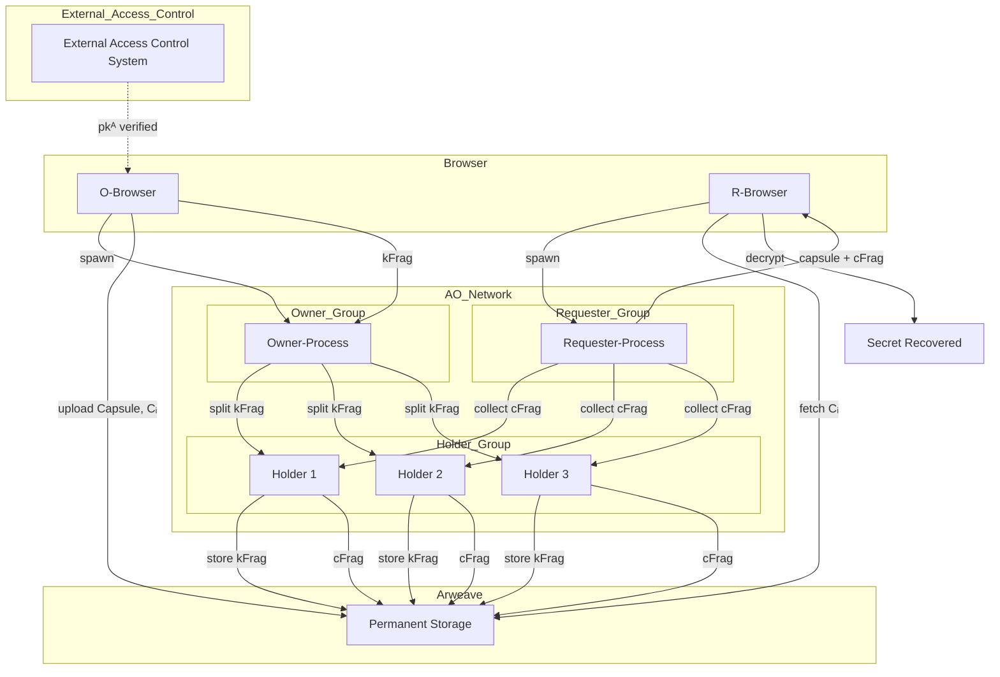

# Product Requirements Document (PRD)

## 1. Overview

**Product Name**
Deterministic Threshold Proxy Re-Encryption System (FORMIX)

**Purpose**
FORMIX は、Threshold Proxy Re-Encryption（TPRE）とシャミア秘密分散を組み合わせた分散型秘密管理ライブラリです。暗号学的な秘密の分散・再暗号化・復元機能をローカルとオンチェーン環境のみで実行するDecentralized Key ManagementライブラリをOSSとして提供します。

***分散型閾値暗号の実現***
k-of-n 閾値スキームを採用し、n個の独立したプロセスのうちk個が協調することで秘密復元を可能にします。単一障害点を完全に排除し、k未満のプロセスでは暗号学的に情報が一切漏洩しない堅牢なセキュリティを提供します。

***完全分散・ステートレスアーキテクチャ***
Arweave の不変ストレージと AO Network の分散 WebAssembly 実行環境により、中央集権的なサーバーやインフラストラクチャを一切必要としません。すべての状態が永続化され、プロセスはステートレスに実行されるため、高い可用性と拡張性を実現します。

***暗号学的完全性の保証***
Proxy Re-Encryption により、データ所有者の秘密鍵を一切露出することなく、第三者への安全な復号権限委譲を実現します。シャミア秘密分散との組み合わせにより、分散環境（オンチェーン）での確実な秘密復元と、暗号学的に証明可能なセキュリティを提供します。

**PHASE 1 秘密の分割と初期配布**

| #   | アクター          | ステップ                                                    | 備考 |
| --- | ------------- | ------------------------------------------------------- | ---- |
| 1-1 | **O-Browser** | 秘密鍵 `skₒ(PRE)`, 公開鍵 `pkₒ(PRE)`, 共通鍵 `kₒ`, 秘密 `f(0)=secret` を生成 | ローカル環境 |
| 1-2 | **O-Browser** | シャミア秘密分散: `f(0)` → `f(1)...f(n)` (k-of-n 閾値) | ローカル環境 |
| 1-3 | **O-Browser** | 暗号化シェア生成: n個の `Cᵢ = AES_GCM(kₒ, f(i))` (i=1...n) | ローカル環境 |
| 1-4 | **O-Browser** | カプセル生成: `Capsuleₒ = PRE_Enc(pkₒ, kₒ)` | ローカル環境 |
| 1-5 | **O-Browser** | Requesterの公開鍵 `pkᴬ` を受け取り（外部検証済み前提） | アクセス制御は外部完了 |
| 1-6 | **O-Browser** | 再暗号化キー生成: `rekey = PRE_ReKey(skₒ → pkᴬ)` | ローカル環境 |
| 1-7 | **O-Browser** | kFrag生成: `kFragⱼ = Shamir_Split(rekey, k, n)` | ローカル環境 |
| 1-8 | **O-Browser** | kFragをOwner-Processに送信 | AO Network |
| 1-9 | **O-Browser** | `Capsuleₒ`, n個の`Cᵢ` をArweaveに保存 | 永続化 |

**PHASE 2 キーフラグメントの分散管理**

| #   | アクター              | ステップ                                        | 備考 |
| --- | ----------------- | ------------------------------------------- | ---- |
| 2-1 | **Owner-Process** | RandAOを利用してn個のHolder-Processを選出 | 分散選択 |
| 2-2 | **Owner-Process** | 各Holder-Processに `kFragⱼ` と署名を送信 | 配布 |
| 2-3 | **Holder-Process** | `kFragⱼ` を受信・検証してWASMメモリスナップショットに保存 | HyperBEAMが自動永続化 |
| 2-4 | **Owner-Process** | `DelegateCapsule` メッセージで `Capsuleₒ` をHolder-Processにpush | Owner→Holder push |
| 2-5 | **Holder-Process** | `cFragⱼ = PRE_ReEnc(kFragⱼ, Capsuleₒ)` 実行 | 再暗号化 |
| 2-6 | **Holder-Process** | `cFragⱼ` をWASMメモリスナップショットに保存 | HyperBEAMが自動永続化 |

**PHASE 3 秘密の復元**

| #   | アクター                     | ステップ                                            | 備考 |
| --- | ------------------------ | ----------------------------------------------- | ---- |
| 3-1 | **R-Browser**            | Requester-Processに復元要求を送信 | 復元開始 |
| 3-2 | **Requester-Process**    | k個以上のHolder-Processから `cFragⱼ` を収集 | cFrag収集 |
| 3-3 | **Requester-Process**    | `Capsuleₒ` と k個の `cFragⱼ` をR-Browserに送信 | データ送信 |
| 3-4 | **R-Browser**            | `Capsule′ = PRE_Combine(Capsuleₒ, cFrag₁…k)` | 結合処理 |
| 3-5 | **R-Browser**            | `kₒ = PRE_Dec(skᴬ, Capsule′)` | 復号処理 |
| 3-6 | **R-Browser**            | ArweaveからtagsベースでCᵢ (i=1...n) を取得 | データ取得 |
| 3-7 | **R-Browser**            | `f(i) = AES_DEC(kₒ, Cᵢ)` でk個分復号 (k個のシェア) | シェア復号 |
| 3-8 | **R-Browser**            | シャミア補間で秘密 `f(0)` を復元 | **秘密復元完了** |

**Key Features**: 主要なコンポーネントと機能

 - データオーナー（Alice）: 機密データを暗号化してアップロードするユーザ。オーナー側ブラウザ（O-Browser）で鍵生成やデータ暗号化を行います。
 - データ利用者（Bob）: データへの復号権限を委譲されるユーザ。アクセサ側ブラウザ（R-Browser）で秘密復元を行います。
 - AOプロセス（プロキシノードとしてのコントラクト）: Arweave上のAO (Arweave Compute) ネットワークで動作する分散プロセス群。WebAssembly対応の実行環境上で再暗号化や秘密分散のロジックを担当します。各プロセスは独立したアクターとして動作し、メッセージ経由で協調します
 - Arweaveストレージ: 永続的データ保存層。暗号化データ本体や再暗号化に必要なカプセル情報を記録します。ArweaveはAOにとって分散ハードディスクの役割を果たし、すべてのメッセージや状態が永久に記録されます

| ラベル           | アクター              | ロール                                   |
| ------------- | ----------------- | ------------------------------------ |
| **O-Browser** | 共有者フロント           | 秘密 (s) をアップロードする人                    |
| **Owner-Process** | Owner-Process     | O-Browser が spawn。kFrag を分散配布する |
| **Holder-Process** | Holder-Process j  | kFrag を保持し再暗号化を実行 |
| **Requester-Process** | Requester-Process | cFrag を収集し R-Browser に送信          |
| **R-Browser** | アクセス者フロント         | 秘密を復号して受け取る人                         |

ここで、Owner-Process、Holder-Process、Requester-Processは全て同じロジックをロードして動作を行うプロセスであるので、アクターの目的によって要求する振る舞いが変わっているだけである。（これらのプロセスは互いに同じ機能を持ち、互いの機能を実行する能力を持つ（なぜなら、持つロジックは同じだから））

## 2. Goal and Scope (Phase1)

### Goal

 - Arweave 上に保存された暗号データを、**外部で検証済みのアクセス制御条件**に基づき、再暗号化（Proxy Re-Encryption）を経て復号可能とする FORMIX（Deterministic Threshold Proxy Re-Encryption System）を構築する。

 - Threshold Proxy Re-Encryption（TPRE） により、復号権限を1アクターに集中させずに、k-of-n の分散アクターによって委譲・復号権限を構成する。

 - Arweave（不変・公開ストレージ）、AO（分散 WASM 実行環境）の 2つのインフラ層を統合し、純粋な分散型暗号化データ管理システムを実現する。

### Non-Goals

 - アクセス制御条件の検証（外部システムで実装）
 - トラストレスな報酬・スラッシュ経済設計（インセンティブ層）
 - 高速/低レイテンシの業務用ファイル共有
 - 暗号プロトコル（PRE や MPC）の独自設計・新規アルゴリズム開発

### In Scope (MVP ver)

 - Umbral 型 TPRE 実装（umbral-pre）と Shamir Secret Sharing に基づく k-of-n プロキシ構成

 - データ所有者（Owner）のローカルブラウザでカプセル（Capsule）と暗号文（Ciphertext）の作成

 - AO 上で実行されるプロセス群による kFrag 保管・cFrag 計算（Wasmベース）

 - Arweave 上のカプセル・暗号文・キーフラグメントの公開保存と検証的参照

 - ブラウザ（R-Browser）上での cFrag 収集・Capsule 再構築・復号処理

### Out of Scope (Future Improvement)

・ PVSS への拡張（定期シェアリフレッシュ）

・ TEEプロセスをホストするAOのCUノードの指定（このMVP下では通常のCUノードでホストされたプロセスで処理を行う）

・ アクセス制御システムとの統合（外部システム責任）

## 3. High-Level Architecture


```mermaid
flowchart TD
    subgraph Browser
        OB[O-Browser]
        RB[R-Browser]
    end

    subgraph External_Access_Control
        EXT[External Access Control System]
    end

    subgraph AO_Network
        subgraph Owner_Group
            PO[Owner-Process]
        end
        subgraph Requester_Group
            RP[Requester-Process]
        end
        subgraph Holder_Group
            H1[Holder 1]
            H2[Holder 2]
            H3[Holder 3]
        end
    end

    subgraph Arweave
        AR[Permanent Storage]
    end

    EXT -.->|pkᴬ verified| OB
    OB -->|spawn| PO
    OB -->|upload Capsule, Cᵢ| AR
    RB -->|spawn| RP
    OB -->|kFrag| PO
    PO -->|split kFrag| H1 & H2 & H3
    H1 & H2 & H3 -->|store kFrag| AR
    H1 & H2 & H3 -->|cFrag| AR
    RP -->|collect cFrag| H1 & H2 & H3
    RP -->|capsule + cFrag| RB
    RB -->|fetch Cᵢ| AR
    RB -->|decrypt| s[Secret Recovered]
```

## 4. Detailed Requirements

docs/development/services/*に各サービスの詳細設計は記述

以下は要求定義

| コンポーネント                | 機能要件                                         | 実装方法                             |
| ---------------------- | -------------------------------------------- | -------------------------------- |
| Owner-Process          | kFrag受信 → RandAO選出 → kFrag配布            | Rust WASM (`umbral-pre` + `sssa`) |
| Holder-Process         | kFrag受信・保存、cFrag生成・Arweave保存          | Rust WASM + ao-sqlite             |
| Requester-Process      | cFrag収集、閾値チェック、R-Browserに送信        | Rust WASM                        |
| O-Browser              | 秘密分散 → Capsule化 → rekey生成 → kFrag分割   | Rust WASM (`umbral-pre` + `sssa`) |
| R-Browser              | cFrag収集、Capsule再構築、復号・秘密復元        | Rust WASM (`umbral-pre` + `sssa`) |


| 方針                                                                                         | メリット                                                                                                          | 留意点                                                     |
| ------------------------------------------------------------------------------------------ | ------------------------------------------------------------------------------------------------------------- | ------------------------------------------------------- |
| Rust で `dtpres_core` を実装し、<br>**Owner / Holder / Requester** の 3 ロールを<br>1 つの Wasm バイナリに同居 | - Arweave へのデプロイは **Tx 1 本**<br>- すべて同じコードハッシュ → **検証容易**<br>- ハンドラ分岐は **`msg.role`** や **`process.tag`** で実現 | - バイナリサイズ増 ⇒ 1Tx の手数料が上がる<br>- Wasm 内でロール判定ロジックを明確化する必要 |

## 5. Technology & Tools

### 5.1 Core Technologies

| Component | Technology | Purpose |
|-----------|------------|---------|
| **Cryptography** | umbral-pre | すべての暗号化操作（鍵生成、PRE、暗号化・復号化） |
| | sssa | Shamir Secret Sharing (k-of-n 秘密分散) |
| | aes-gcm | シェア暗号化用対称暗号 |
| **Runtime** | Rust WASM (@src/) | 単一バイナリでAOプロセスとブラウザ両方で実行 |
| | AO Network | 分散 WebAssembly 実行環境 |
| | CosmWasm-ao | AOプロセスデプロイフレームワーク |
| **Storage** | Arweave | 永続的データ保存・WASMモジュール配布 |
| **Client Library** | JavaScript/TypeScript | プロセスspawn・WASMモジュール呼び出しライブラリ |

### 5.2 Development Tools

| Tool | Purpose |
|------|---------|
| wasm-pack | Rust → WebAssembly ビルド |
| CosmWasm-ao | AOへのWASMデプロイ |
| npm/yarn | JavaScript/TypeScriptライブラリパッケージ管理 |

## 6. Security & Compliance

### 6.1 セキュリティ要件

| 評価軸 | チェック項目 | 考察 |
|--------|-------------|------|
| **機密性** | 公開データから秘密到達可否 | 公開セット {Capsuleₒ, Cᵢ, kFragⱼ, cFragⱼ} は **IND-CPA**。`Capsule′` から kₒ を得るには skᴬ が必須 → 離散対数問題 (secp256k1, 256-bit) |
| **しきい値耐故障** | Holder t < k ダウン時 | Shamir(k,n) ⇒ 最大 n-k ノード故障時でも秘密復元可能 |
| **共謀耐性** | k-1 Holder + 攻撃者 | kFrag は Shamir分割；k-1 では rekey 再構成不能、秘密復元不可 |
| **非転送性** | 攻撃者が pkᴮ へ再委譲 | ReKeyGen には skₒ が必須。kFrag は pkᴬ 固定で他者への転送不可 |
| **暗号基盤** | 安全仮定 | TPRE (Umbral) = ECIES (secp256k1) / AES-256-GCM |
| **転送完全性** | cFrag 改ざん検出 | PRE 仕様内で暗号学的検証；AO メッセージはArweaveで不変記録 |
| **メモリ露出** | RAM ダンプ | 秘密鍵・平文は瞬間的にのみ存在；`zeroize` による即時メモリクリア |
| **DoS 耐性** | Holder 不応答 | n=5, k=3 → 最大2ノード不応答まで許容。動的Holder選択機構 |
| **Sybil 耐性** | 攻撃者 Holder 独占 | RandAOによるランダム選択、将来的にStake/Reputation実装予定 |
| **形式的証明** | Provable security | Umbral は IND-CPA & Collusion Safety を論文証明済み |

### 6.2 リスク残存ポイント & 推奨対策

| リスク | 現状 | 推奨強化策 |
|--------|------|-----------|
| **Sybil Holder 独占** | RandAO選択のみ | *将来実装*: Stake要件・Reputation システム導入 |
| **大量リクエストDoS** | 制限なし | レート制限機構の実装、リクエスト毎のコスト設定 |
| **乱数生成の弱さ** | Rust標準乱数 | `rand::rngs::OsRng` 使用、ブラウザは `crypto.getRandomValues` |
| **実装バグ** | 未監査 | セキュリティ監査、形式検証ツール導入予定 |
| **サイドチャネル攻撃** | 対策なし | constant-time実装、将来的にTEE環境対応 |
| **鍵漏洩時の影響** | 全データ露出リスク | 定期的な鍵ローテーション機構の検討 |

## 7. Implementation Phases

### Phase 1: Core Cryptographic Library
- [ ] Umbral PRE WebAssembly 統合
- [ ] シャミア秘密分散実装
- [ ] Rust WASM暗号化ライブラリ実装

### Phase 2: AO Process Implementation
- [ ] Owner/Holder/Requester プロセス実装
- [ ] プロセス間メッセージング
- [ ] Arweave 統合

### Phase 3: Client Library & Testing
- [ ] JavaScript/TypeScriptクライアントライブラリ
- [ ] セキュリティテスト
- [ ] OSS公開準備

## 8. アーキテクチャ戦略

### 8.1 ビルドターゲット分離アプローチ

FORMIXは単一リポジトリで管理されますが、実行環境に応じて異なるビルドターゲットを持つアーキテクチャを採用します：

| ディレクトリ | ビルドターゲット | 実行環境 | 役割 |
|------------|---------------|---------|------|
| **src/** | wasm32-unknown-unknown | AO Network (Arweave) | Phase 2のHolder-Process実装、メッセージ処理、状態管理 |
| **local/** | wasm32-unknown-unknown (wasm-pack) | ブラウザ | Phase 1のO-Browser実装、Phase 3のR-Browser実装 |
| **dtpres-sdk/** | Node.js/ブラウザ | JavaScript環境 | 統合SDK、local/とsrc/の橋渡し |

### 8.2 JavaScript統合SDK (dtpres-sdk/)

dtpres-sdk/ディレクトリは、FORMIX全体の統合SDKとしての役割を担います：

**主要機能:**
1. **ローカル処理の実行**: local/配下のWASMモジュールを呼び出し、暗号化処理を実行
2. **AOプロセスとの連携**: ローカル処理の出力をAOメッセージとしてフォーマットし、src/配下のプロセスに送信
3. **統一API提供**: 開発者に対して一貫したJavaScript/TypeScript APIを提供

**処理フロー例:**
```javascript
// Phase 1: O-Browser (local/実行)
const result = await dtpres.local.owner.splitSecret(secret);
// → { capsule, shares, kFrags }

// Phase 2: AOプロセスへ送信 (src/実行)
await dtpres.ao.spawn.ownerProcess();
await dtpres.ao.message.send({
  action: 'Store-KFrag',
  data: result.kFrags
});

// Phase 3: R-Browser (local/実行)
const cFrags = await dtpres.ao.message.collectCFrags();
const secret = await dtpres.local.requester.recoverSecret(cFrags);
```

この統合アプローチにより、ブラウザでの暗号処理とAOでの分散処理をシームレスに連携させ、開発者は実装の複雑性を意識することなくFORMIXを利用できます。

---

このPRDは、FORMIXを純粋な暗号学的秘密管理OSSライブラリとして定義し、アクセス制御を外部システムに委譲することで、システムの複雑性を大幅に削減し、実装とテストを簡素化します。開発者はこのライブラリを使用してプロセスのspawnと暗号化処理を統合できます。
