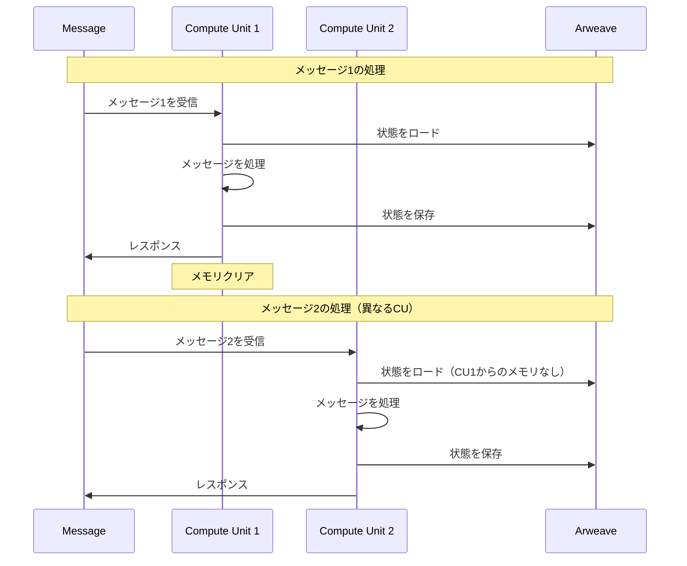
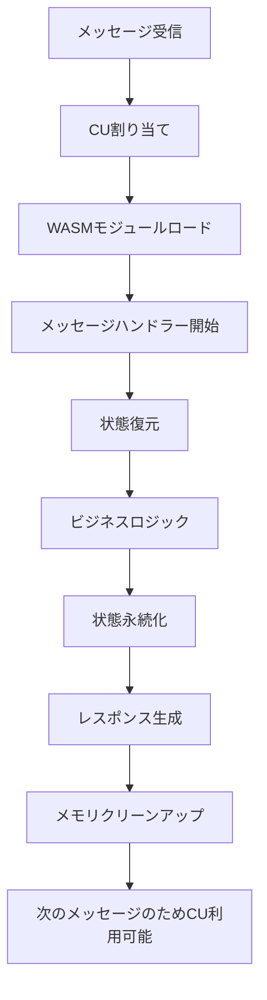

# AOプロセスモデルとステートレス実行

## 1. はじめに

AO（Arweave Operations）は、メッセージ実行間で永続的なメモリを持たない分散Compute Units（CU）上でプロセスが実行される、独自のステートレス実行モデルを実装しています。このドキュメントは、AOのアーキテクチャとアプリケーション設計への影響について包括的な理解を提供します。

## 2. コア概念

### 2.1 ステートレス実行モデル

AOプロセスは以下の基本的な制約の下で動作します：

- **メモリ永続性なし**: 各メッセージ実行はクリーンなメモリ状態から開始
- **メッセージ駆動**: すべての計算は受信メッセージによってトリガー
- **CU分散**: メッセージは異なるCompute Unitsで処理される可能性
- **明示的な状態管理**: すべての状態は明示的に保存・復元される必要



### 2.2 プロセスアーキテクチャ

#### プロセススポーン
```rust
// プロセスはArweaveからのWASMモジュールでスポーンされる
pub struct ProcessSpawnData {
    pub module_tx_id: String,    // Arweave上のWASMモジュールトランザクションID
    pub process_id: String,       // 一意のプロセス識別子
    pub initial_state: Vec<u8>,   // 初期状態データ
    pub tags: HashMap<String, String>, // プロセスメタデータタグ
}
```

#### モジュールロード
- WASMモジュールはArweaveトランザクションとして保存
- 複数のプロセスが同じモジュールコードを共有可能
- モジュールは各メッセージ実行のたびに新規ロード

### 2.3 Compute Units (CU)

Compute UnitsはAOプロセスの実行環境です：

- **ステートレスワーカー**: CUは実行間で状態を保持しない
- **ロードバランシング**: メッセージは利用可能なCU間で分散
- **分離**: 各メッセージ実行は分離されている
- **WebAssemblyランタイム**: CUはWASMモジュールを実行

### 2.4 AOのアクターモデル設計

AOは「分散アクターモデル」を採用しており、4つの専門ユニットが協調して動作します：

```
┌─────────────────┐    ┌─────────────────┐    ┌─────────────────┐
│   MU (1985)     │    │   SU (1986)     │    │   CU (1987)     │
│ Messenger Unit  │    │ Scheduler Unit  │    │ Compute Unit    │
│                 │    │                 │    │                 │
│ • メッセージ受信  │    │ • メッセージ順序  │    │ • WASM実行      │
│ • Arweave送信   │    │ • スケジュール   │    │ • 状態管理      │
│ • 署名検証      │    │ • プロセス管理   │    │ • 結果計算      │
└─────────────────┘    └─────────────────┘    └─────────────────┘
         │                       │                       │
         └───────────────────────┼───────────────────────┘
                                 │
                    ┌─────────────────┐
                    │ Arweave (1984)  │
                    │   永続ストレージ   │
                    │                 │
                    │ • データ永続化   │
                    │ • トランザクション│
                    │ • 状態バックアップ│
                    └─────────────────┘
```

- **MU (Messenger Unit)**: 外部からのメッセージを受信し、署名検証とArweave送信を行う
- **SU (Scheduler Unit)**: メッセージの順序管理とプロセスのスケジューリングを担当
- **CU (Compute Unit)**: WASMモジュールを実行し、状態管理と結果計算を行う
- **Arweave**: すべての情報を永続的に保存する分散ストレージ

## 3. 状態管理戦略

### 3.1 状態永続化パターン

メッセージ間でメモリが保持されないため、すべての状態は明示的に管理される必要があります：

```rust
// 標準的なメッセージハンドラーパターン
async fn handle_message(msg: Message) -> Result<Response> {
    // 1. Arweaveから状態を復元
    let state = restore_state_from_arweave().await?;

    // 2. メッセージを処理
    let new_state = process_message(state, msg)?;

    // 3. 状態をArweaveに永続化
    persist_state_to_arweave(new_state).await?;

    // 4. レスポンスを返す
    Ok(Response::success())
}
```

### 3.2 グローバル状態としてのProcessEntity

ProcessEntityは各プロセスの「グローバル状態」として機能します：

```rust
// メッセージ開始時のProcessEntity復元
async fn initialize_handler_context() -> Result<HandlerContext> {
    let process_repo = ProcessEntityRepository::new();
    let process = process_repo.find_by_id(&ao.id)
        .await?
        .ok_or(Error::ProcessNotFound)?;

    Ok(HandlerContext {
        process,
        repositories: RepositoryContainer::new(),
    })
}
```

### 3.3 遅延ロードパターン

パフォーマンスを最適化するため、エンティティは必要な時のみロードされます：

```rust
// メッセージ駆動のエンティティロード
async fn load_entities_for_message(
    ctx: &HandlerContext,
    msg: &Message,
) -> Result<EntityBundle> {
    let action = msg.tags.get("Action")?;

    match action.as_str() {
        "Access-Request" => {
            // メタデータのみロード
            Ok(EntityBundle::minimal())
        },
        "Re-Encrypt" => {
            // 完全なエンティティデータをロード
            let entities = load_full_entities().await?;
            Ok(EntityBundle::full(entities))
        },
        _ => Ok(EntityBundle::empty())
    }
}
```

## 4. メッセージ処理ライフサイクル

### 4.1 完全なメッセージフロー



### 4.2 詳細な処理ステップ

1. **メッセージ受信**
   - メッセージがAOネットワークに到着
   - ルーターが利用可能なCUにメッセージを割り当て

2. **環境セットアップ**
   - CUがArweaveからWASMモジュールをロード
   - クリーンなメモリ空間を初期化
   - メッセージコンテキストをセットアップ

3. **状態復元**
   - ArweaveからProcessEntityをロード
   - メッセージ固有のエンティティを復元
   - 実行コンテキストを構築

4. **ビジネスロジック実行**
   - アクションタイプに従ってメッセージを処理
   - 必要に応じてエンティティを更新
   - レスポンスデータを生成

5. **状態永続化**
   - 変更されたエンティティをシリアライズ
   - 適切なタグと共にArweaveに保存
   - アトミックな更新を保証

6. **クリーンアップ**
   - レスポンスメッセージを生成
   - すべてのメモリをクリア
   - 次のメッセージのためにCUを解放

## 5. ステートレス実行のためのデザインパターン

### 5.1 メッセージコンテキストパターン

メッセージから必要なすべての情報を抽出：

```rust
pub struct MessageContext {
    pub action: String,
    pub entity_ids: Vec<String>,
    pub requester: String,
    pub timestamp: u64,
}

impl MessageContext {
    pub fn from_message(msg: &Message) -> Result<Self> {
        Ok(Self {
            action: msg.tags.get("Action")?.clone(),
            entity_ids: extract_entity_ids(&msg.data)?,
            requester: msg.from.clone(),
            timestamp: msg.timestamp,
        })
    }
}
```

### 5.2 バッチ操作パターン

バッチ処理によってArweave操作を最小化：

```rust
// バッチロード
async fn batch_load_entities(
    repos: &RepositoryContainer,
    entity_ids: Vec<String>,
) -> Result<Vec<Entity>> {
    let futures = entity_ids.into_iter()
        .map(|id| repos.load_entity(id));

    futures::future::try_join_all(futures).await
}

// バッチ永続化
async fn batch_persist_entities(
    repos: &RepositoryContainer,
    entities: Vec<Entity>,
) -> Result<Vec<TxId>> {
    let futures = entities.into_iter()
        .map(|entity| repos.save_entity(entity));

    futures::future::try_join_all(futures).await
}
```

### 5.3 冪等性パターン

信頼性のために操作の冪等性を保証：

```rust
// 冪等なメッセージハンドラー
async fn handle_message_idempotent(msg: Message) -> Result<Response> {
    // メッセージが既に処理されたかチェック
    let message_id = msg.id.clone();
    if was_processed(&message_id).await? {
        return Ok(cached_response(&message_id).await?);
    }

    // メッセージを処理
    let response = process_message(msg).await?;

    // 結果をキャッシュ
    cache_response(&message_id, &response).await?;

    Ok(response)
}
```

## 6. パフォーマンス最適化

### 6.1 状態サイズ管理

ロード/保存のオーバーヘッドを削減するため状態を最小限に：

```rust
// 完全なデータの代わりにインデックスを使用
pub struct SecretIndex {
    pub secret_id: String,
    pub status: SecretStatus,
    pub entity_references: EntityReferences,
    pub last_updated: u64,
}

// 必要な時のみ完全なエンティティをロード
async fn get_secret_details(
    index: &SecretIndex,
    full_load: bool,
) -> Result<SecretDetails> {
    if full_load {
        load_full_secret_data(index).await
    } else {
        Ok(SecretDetails::from_index(index))
    }
}
```

### 6.2 メッセージスコープ内でのキャッシング

単一メッセージ処理中のデータキャッシュ：

```rust
pub struct MessageScopeCache {
    entities: HashMap<String, Box<dyn Any>>,
}

impl MessageScopeCache {
    pub fn get_or_load<T: Entity>(
        &mut self,
        id: &str,
        loader: impl Fn(&str) -> Result<T>
    ) -> Result<&T> {
        if !self.entities.contains_key(id) {
            let entity = loader(id)?;
            self.entities.insert(id.to_string(), Box::new(entity));
        }
        Ok(self.entities.get(id).unwrap().downcast_ref().unwrap())
    }
}
```

## 7. ステートレス環境でのエラーハンドリング

### 7.1 状態リカバリー

状態ロード失敗を適切に処理：

```rust
async fn load_or_initialize_state() -> Result<ProcessState> {
    match load_state_from_arweave().await {
        Ok(state) => Ok(state),
        Err(Error::NotFound) => {
            // 新しい状態を初期化
            let new_state = ProcessState::default();
            persist_state_to_arweave(&new_state).await?;
            Ok(new_state)
        },
        Err(e) => Err(e),
    }
}
```

### 7.2 部分的な状態更新

アトミックな更新またはロールバックを保証：

```rust
async fn update_entities_atomic(
    entities: Vec<Entity>,
) -> Result<()> {
    let mut tx_ids = Vec::new();

    for entity in &entities {
        match persist_entity(entity).await {
            Ok(tx_id) => tx_ids.push(tx_id),
            Err(e) => {
                // 以前の状態を現在のものとしてマークしてロールバック
                rollback_entities(&tx_ids).await?;
                return Err(e);
            }
        }
    }

    Ok(())
}
```

## 8. マルチプロセス調整

### 8.1 メッセージベースの通信

プロセスはメッセージのみを通じて通信：

```rust
// 他のプロセスへメッセージを送信
async fn send_to_process(
    target_process_id: &str,
    action: &str,
    data: Vec<u8>,
) -> Result<()> {
    let message = Message {
        target: target_process_id.to_string(),
        tags: HashMap::from([
            ("Action".to_string(), action.to_string()),
            ("From-Process".to_string(), ao.id.clone()),
        ]),
        data,
    };

    ao.send_message(message).await
}
```

### 8.2 イベントソーシングパターン

プロセス調整のためにイベントを使用：

```rust
// ドメインイベントを発行
async fn emit_event(event: DomainEvent) -> Result<()> {
    let event_data = serde_json::to_vec(&event)?;
    let tx_id = arweave.store_data(
        event_data,
        HashMap::from([
            ("Event-Type".to_string(), event.event_type()),
            ("Process-Id".to_string(), ao.id.clone()),
            ("Timestamp".to_string(), event.timestamp.to_string()),
        ])
    ).await?;

    // 関心のあるプロセスに通知
    notify_subscribers(&event, &tx_id).await?;

    Ok(())
}
```

## 9. CosmWasm AO 固有のパターン

### 9.1 イベントソーシングによる状態復元

CosmWasm AOは**イベントソーシング方式**を採用しており、状態そのものではなく「状態変更イベント（メッセージ）」をArweaveに永続化します。

**同じWASM + 同じメッセージ順序 = 必ず同じ状態** が保証されます。

#### プロセス再起動時の復元フロー

```
1. プロセスID (pid) を指定
   ↓ CUに「このプロセスを実行してください」という指示が来る
2. SU.process(pid) でメッセージグラフ（edges）取得
   ↓ スケジューラーに「このプロセスの実行履歴を教えて」と問い合わせ
3. プロセスのモジュールID経由でWASMをArweaveから取得
   ↓ 元のプログラムコード（バイナリ）をダウンロード
4. 新しいVMインスタンス作成（空の状態）
   ↓ 真っ新なメモリ状態でプログラムを起動
5. edgesの順序でメッセージを再実行
   - instantiate → execute1 → execute2 → ...
   ↓ 過去のメッセージを時系列順に「早送り再生」
6. 最新の状態が復元される
```

#### 実装例

```javascript
// CU (Compute Unit) での復元処理
async restoreProcess(pid) {
    // 1. WASMモジュールの取得
    const wasm = await this.arweave.transactions.getData(txid, { decode: true })
    const vm = new VM({ id: "ao", addr: pr_id })

    // 2. VMの初期化
    this.vms[pid] = await this.getModule(process.module, pid, input)
    await this._instantiate(pid, input)

    // 3. メッセージ履歴の取得と再実行
    const pmap = (await new SU({ url: this.sus[pid].url }).process(pid)).edges
    for (const v of pmap) {
        const id = v.node.message.id
        if (this.results[pid][id]) continue // 処理済みはスキップ

        // メッセージを順次実行
        const res = this.vms[pid].execute(caller, action, input)
        this.results[pid][id] = res.json
    }
}
```

### 9.2 Arweaveストレージアクセス制約

CosmWasm AOでは、プロセスから直接Arweaveにアクセスすることはできません。これは意図的な設計です。

- **Querierの無効化**: `deps.querier`は意図的に無効化されている。プロセス間の直接状態読み取りは並列処理を不可能にするため
- **WASMサンドボックス制約**: 外部ネットワークアクセス禁止、ファイルシステムアクセス禁止、`deps.storage`のみ利用可能
- **アクターモデル設計**: 同期的な外部アクセス禁止により、ハイパーパラレリズムを維持

#### 代替パターン: 参照データパターン

大容量データはArweaveに保存し、プロセスは参照情報のみを管理：

```rust
pub struct ProcessData {
    pub metadata: Metadata,
    pub state: State,
    // Arweaveへの参照のみ保持
    pub large_data_txid: Option<String>,
    pub snapshot_txid: Option<String>,
}

pub const EXTERNAL_REFS: Map<String, String> = Map::new("external_refs");
```

### 9.3 KVストレージパターン

CosmWasm AOでは、Key-Value（KV）ストレージを使ってプロセスの全ての状態を管理します。

```rust
use cw_storage_plus::Map;

pub const KV_STORE: Map<String, String> = Map::new("kv_store");
pub const TYPED_STORE: Map<String, Config> = Map::new("typed_store");

// 型別にストレージを分離して型安全性を確保
pub const STRING_STORE: Map<String, String> = Map::new("strings");
pub const NUMBER_STORE: Map<String, u64> = Map::new("numbers");
pub const CONFIG_STORE: Map<String, Config> = Map::new("configs");
```

#### 状態復元時のKV再構築

プロセス再起動時、メッセージ履歴の再実行により自動的にKVストレージが再構築されます。

```javascript
// 内部的な動作（CU）
async restoreKVState(pid) {
    // 1. 空のKVストレージでVM開始
    this.vms[pid] = new VM({ storage: new BasicKVIterStorage() });

    // 2. メッセージ履歴を順次実行
    const messages = await SU.process(pid).edges;
    for (const msg of messages) {
        // この実行でKVが再構築される
        this.vms[pid].execute(msg.sender, msg.action, msg.input);
    }

    // 3. 完全なKVストレージが復元される
}
```

### 9.4 CosmWasmコントラクトパターン

CosmWasm AOでのメッセージハンドラーパターン：

```rust
pub fn handle_message(msg: AOMessage, repo: &dyn Repository) -> Result<Response> {
    // 1. 状態をロード
    let mut state = repo.load_state(msg.process_id)?;

    // 2. メッセージを処理
    let result = process_with_state(&mut state, msg)?;

    // 3. 状態を永続化
    repo.save_state(msg.process_id, &state)?;

    Ok(result)
}
```

### 9.5 FORMIXでの適用

#### 役割別のストレージ分離

```rust
pub const OWNER_STATE: Item<OwnerState> = Item::new("owner_state");
pub const HOLDER_STATE: Item<HolderState> = Item::new("holder_state");
pub const REQUESTER_STATE: Item<RequestState> = Item::new("requester_state");
pub const SHARED_KV: Map<String, String> = Map::new("shared_kv");
```

#### 暗号化データの管理

```rust
#[derive(Serialize, Deserialize, Zeroize, ZeroizeOnDrop)]
pub struct SecretState {
    #[zeroize(skip)]
    pub public_info: PublicInfo,
    pub secret_shares: Vec<SecretShare>,
}

// Arweave参照による大容量データ管理
pub const CAPSULE_REFS: Map<String, String> = Map::new("capsule_refs");
```

## 10. ベストプラクティス

### 10.1 状態管理
1. **状態サイズの最小化**: ProcessEntityには必須データのみ保持
2. **インデックスの使用**: 完全なデータではなく参照を保存
3. **バッチ操作**: Arweaveトランザクションを削減
4. **戦略的なキャッシュ**: メッセージスコープ内のみ

### 10.2 メッセージハンドリング
1. **早期のコンテキスト抽出**: メッセージのタグとデータを事前に解析
2. **入力の検証**: 処理前にすべての必須フィールドをチェック
3. **冪等性の処理**: メッセージリプレイを考慮した設計
4. **明確なエラーメッセージ**: 実行可能なエラーレスポンスを提供

### 10.3 パフォーマンス
1. **遅延ロード**: 必要な時のみエンティティをロード
2. **並列操作**: async/awaitを効果的に使用
3. **シリアライゼーションの最適化**: 効率的なフォーマットを使用
4. **状態成長の監視**: エンティティサイズを追跡

### 10.4 CosmWasm AO 固有の最適化
1. **メッセージバッチング**: 複数の状態変更を1メッセージで実行
2. **スナップショット**: 定期的な状態スナップショットで履歴再生コストを削減
3. **型安全性**: 強い型付けでランタイムエラーを防止

## 11. よくある落とし穴と解決策

### 11.1 落とし穴: メモリ永続性の仮定

**誤り:**
```rust
// グローバル変数 - 永続化されない！
static mut CACHE: Option<HashMap<String, Entity>> = None;
```

**正しい:**
```rust
// 毎回Arweaveからロード
async fn get_entity(id: &str) -> Result<Entity> {
    repository.find_by_id(id).await
}
```

### 11.2 落とし穴: 大きな状態オブジェクト

**誤り:**
```rust
// すべてをロード
let all_entities = repository.find_all().await?;
```

**正しい:**
```rust
// 必要なもののみロード
let relevant_entities = repository
    .find_by_criteria(criteria)
    .await?;
```

### 11.3 落とし穴: 同期的な仮定

**誤り:**
```rust
// 即時一貫性を仮定
update_entity(entity);
let updated = get_entity(entity.id); // 更新が反映されない可能性
```

**正しい:**
```rust
// 明示的な状態管理
let tx_id = update_entity(entity).await?;
wait_for_confirmation(tx_id).await?;
let updated = get_entity(entity.id).await?;
```

## 12. まとめ

AOのステートレス実行モデルは、分散アプリケーションの設計と実装方法に根本的な転換を要求します。これらの制約を理解し受け入れることで、開発者はAOプラットフォームの独自の利点を活用した堅牢でスケーラブルなシステムを構築できます：

- **無限のスケーラビリティ**: 状態のボトルネックなし
- **フォールトトレランス**: どのCUでもあらゆるメッセージを処理可能
- **シンプルさ**: 複雑な状態同期不要
- **検証可能性**: すべての状態変更がArweaveに記録
- **決定論的再生**: 同じメッセージ列から同じ状態を完全再構築可能
- **ハイパーパラレリズム**: プロセス間の独立性により真の並列処理を実現

成功の鍵は、適切なパターンを採用し、アプリケーションアーキテクチャ全体で一貫して適用することです。

---

**ドキュメントステータス**: 技術仕様
**バージョン**: 2.0
**関連ドキュメント**:
- [ドメイン概要](../domain/domain_overview.md)
- [リポジトリ実装](../domain/infrastructure/repository_implementations.md)
- [FORMIXアーキテクチャ](../PRD.md)
