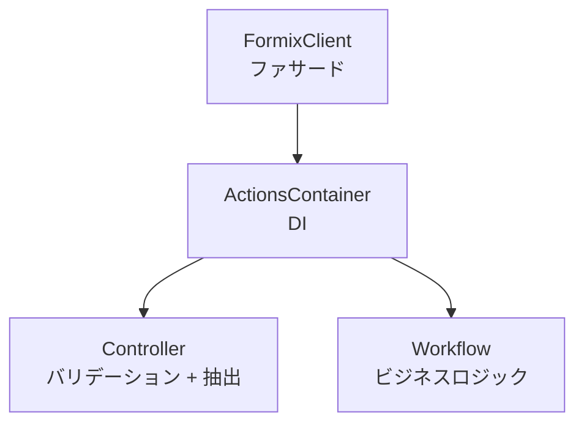

# Actions層

`client/src/actions/`

## 概要

Actions層は開発者向けAPIで、`share`、`recover`、`generate_keypair`の3操作を公開。



## ActionsContainer (`di.rs`)

```rust
pub struct ActionsContainer<C: CoreCryptoService, ST: StorageService> {
    controller: ControllerContainer<C>,
    workflow_services: WorkflowServiceContainer<C, ST>,
    crypto_service: Arc<C>,
}
```

**設計判断:** Controllerは`C`を直接受け取る（コアトレイト）。Workflowは`C`をラップした`ServiceCryptoServiceImpl<C>`を受け取る（サービストレイト）。

**デフォルト型エイリアス:**

```rust
type DefaultStorageService =
    ServiceStorageServiceImpl<ArweaveStorageServiceImpl, ContractStorageImpl<MockAOClient>>;

type DefaultActionsContainer =
    ActionsContainer<CoreCryptoServiceImpl, DefaultStorageService>;
```

**コンストラクタ:**

- `new()` — デフォルトコンポーネント
- `with_storage(arweave_storage, contract_storage)` — 設定済みストレージ

## API関数 (`mod.rs`)

### share (Phase 1)

```rust
pub async fn share(
    container: &ActionsContainer<C, ST>,
    secret: Vec<u8>,
    owner_secret_key: Vec<u8>,
    owner_public_key: Vec<u8>,
    requester_public_key: Vec<u8>,
    threshold: u8,
    total_shares: u8,
    owner_process_id: String,
    options: Option<ShareOptions>,
) -> ActionResult<SecretSharingResult>
```

フロー: バリデーション → 抽出 → ワークフロー実行。

### recover (Phase 3)

```rust
pub fn recover(
    container: &ActionsContainer<C, ST>,
    secret_id: String,
    requester_secret_key: Vec<u8>,
    requester_process_id: String,
    _options: Option<RecoverOptions>,
) -> ActionResult<SecretRecoveryResult>
```

### generate_keypair

```rust
pub fn generate_keypair(
    container: &ActionsContainer<C, ST>,
) -> ActionResult<KeyPairResponse>
```

`KeyPairResponse { secret_key, public_key }`を返す。

## FormixClient (`client.rs`)

`DefaultActionsContainer`をラップした開発者向けファサード。

```rust
let client = FormixClient::new();
let result = client.share().secret(data).threshold(3).total_shares(5)
    .owner_key(sk, pk).requester_key(rpk).execute().await?;
```

**メソッド:** `new()`、`with_storage()`、`share()`（ShareBuilderを返す）、`recover()`（RecoverBuilderを返す）。

## 型状態ビルダー (`builder.rs`)

### ShareBuilder

ファントム型（`Unset` / `Set`）を使用してコンパイル時に全必須パラメータを強制。

```rust
ShareBuilder<C, ST, Secret, Threshold, TotalShares, OwnerKey, RequesterKey>
```

| メソッド | 設定対象 |
|---------|---------|
| `.secret(data)` | `Secret` |
| `.threshold(k)` | `Threshold` |
| `.total_shares(n)` | `TotalShares` |
| `.owner_key(sk, pk)` | `OwnerKey` |
| `.requester_key(pk)` | `RequesterKey` |
| `.metadata(meta)` | オプション |
| `.execute()` | 全型が`Set`の場合のみ呼び出し可能 |

### RecoverBuilder

```rust
RecoverBuilder<C, ST, SecretIdState, RequesterKeyState>
```

| メソッド | 設定対象 |
|---------|---------|
| `.secret_id(id)` | `SecretIdState` |
| `.requester_key(sk)` | `RequesterKeyState` |
| `.execute()` | 全型が`Set`の場合のみ呼び出し可能 |

## オプション (`options.rs`)

- `ShareOptions` — オプションの`metadata: Option<SecretMetadata>`
- `RecoverOptions` — 将来の拡張用の空プレースホルダー

## エラー型 (`error.rs`)

```rust
pub enum ActionError {
    ValidationFailed { code, message },
    WorkflowFailed { message },
    ResourceNotFound { resource },
    CryptoError { message },
    PartialStorageFailure {
        capsule_tx_id, successful_share_tx_ids,
        failed_shares, message,
    },
}
```

`ActionResult<T> = Result<T, ActionError>`

変換チェーン: `ValidationError` / `WorkflowError` → `ActionError`。
