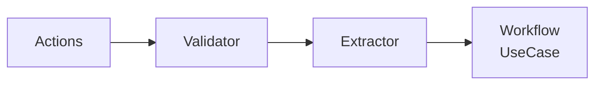

# コントローラー層

`client/src/controller/`

## 概要

コントローラー層はActions層とUseCase層の間で入力バリデーションとDTO抽出を担当。



## バリデーター

### ShareValidator (`validator.rs`)

`ShareValidator<C: CryptoService>` — 秘密共有パラメータをバリデーション。

**9段階の決定論的バリデーション順序:**

| ステップ | チェック内容 | エラーコード |
|---------|------------|------------|
| 1 | 秘密データが空でない | `secret_empty` |
| 2 | 閾値 > 0 | `invalid_threshold` |
| 3 | 閾値 >= MIN_THRESHOLD (2) | `threshold_below_min` |
| 4 | 総シェア数 <= MAX_SHARES (20) | `total_shares_exceeds_max` |
| 5 | 閾値 <= 総シェア数 | `threshold_exceeds_total` |
| 6 | オーナー秘密鍵が空でない | `invalid_owner_key` |
| 7 | リクエスター公開鍵が空でない | `invalid_requester_key` |
| 8 | オーナー公開鍵が空でない | `invalid_owner_public_key` |
| 9 | 鍵ペア整合性チェック（owner_pkがowner_skから導出されたものか） | `key_mismatch` |

ステップ9はタイミング攻撃耐性のため`subtle::ConstantTimeEq`を使用。

ステップ9の`derive_public_key()`のため`Arc<C>`に依存。

### RecoverValidator (`validator.rs`)

復元パラメータのステートレスバリデーター。

| ステップ | チェック内容 | エラーコード |
|---------|------------|------------|
| 1 | Secret IDが空でない | `invalid_secret_id` |
| 2 | リクエスター秘密鍵が空でない | `invalid_requester_key` |
| 3 | リクエスタープロセスIDが空でない | `invalid_process_id` |

## エクストラクター

### ShareExtractor (`extractor.rs`)

バリデーション済みパラメータを`SecretSharingRequest` DTOに変換。

**パラメータ:** secret, owner_secret_key, owner_public_key, requester_public_key, threshold, total_shares, owner_process_id, metadata。

### RecoverExtractor (`extractor.rs`)

バリデーション済みパラメータを`SecretRecoveryRequest` DTOに変換。

**パラメータ:** secret_id, requester_secret_key, requester_process_id。

## エラー型 (`error.rs`)

```rust
pub struct ValidationError {
    code: String,     // 例: "secret_empty"
    message: String,  // 人間可読な説明
    field: Option<String>,  // オプションのフィールドコンテキスト
}
```

**エラーコード（`error_codes`モジュール）:**

| 定数 | 値 |
|-----|-----|
| `SECRET_EMPTY` | `"secret_empty"` |
| `INVALID_THRESHOLD` | `"invalid_threshold"` |
| `THRESHOLD_EXCEEDS_TOTAL` | `"threshold_exceeds_total"` |
| `TOTAL_SHARES_EXCEEDS_MAX` | `"total_shares_exceeds_max"` |
| `THRESHOLD_BELOW_MIN` | `"threshold_below_min"` |
| `INVALID_OWNER_KEY` | `"invalid_owner_key"` |
| `INVALID_REQUESTER_KEY` | `"invalid_requester_key"` |
| `INVALID_SECRET_ID` | `"invalid_secret_id"` |
| `INVALID_PROCESS_ID` | `"invalid_process_id"` |
| `INVALID_OWNER_PUBLIC_KEY` | `"invalid_owner_public_key"` |
| `KEY_MISMATCH` | `"key_mismatch"` |

**バリデーション定数**（`core::crypto::constants`からインポート）:

- `MIN_THRESHOLD = 2`
- `MAX_SHARES = 20`

レイヤー統合のため`From<ValidationError>` for `WorkflowError`を実装。

## DIコンテナ (`di.rs`)

```rust
pub struct ControllerContainer<C: CryptoService> {
    share_validator: ShareValidator<C>,
    recover_validator: RecoverValidator,
    share_extractor: ShareExtractor,
    recover_extractor: RecoverExtractor,
}
```

コンストラクタ: `new(crypto_service: Arc<C>)`。

アクセサメソッド: `share_validator()`、`recover_validator()`、`share_extractor()`、`recover_extractor()`。
