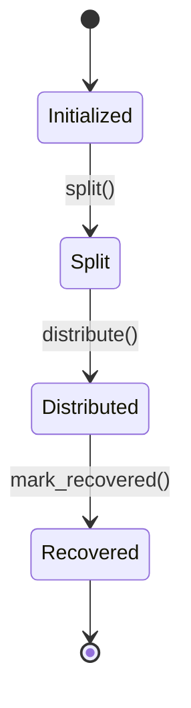
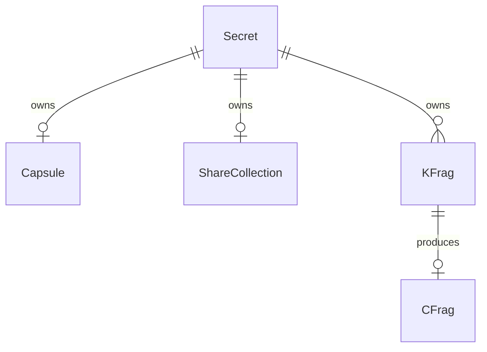

# ドメイン層

`client/src/domain/`

## エンティティ

### Secret (`entities/secret.rs`)

状態機械ライフサイクルを持つ共有秘密のコアエンティティ。

**状態機械:**



**フィールド（すべてプライベート）:**

| フィールド | 型 | 説明 |
|-----------|-----|------|
| `id` | `SecretId` | 一意識別子 |
| `threshold_k` | `u8` | 復元に必要な最小シェア数 |
| `threshold_n` | `u8` | 総シェア数 |
| `state` | `SecretState` | 現在のライフサイクル状態 |
| `capsule_id` | `Option<CapsuleId>` | 関連するPREカプセル |
| `share_collection_id` | `Option<ShareCollectionId>` | 関連するシェアコレクション |
| `kfrag_ids` | `Vec<KFragId>` | 配布済み鍵フラグメント |
| `owner_public_key` | `Vec<u8>` | オーナーのPRE公開鍵 |
| `requester_public_key` | `Option<Vec<u8>>` | リクエスターのPRE公開鍵 |
| `created_at` | `u64` | 作成タイムスタンプ |

**コンストラクタバリデーション:** `k > 0`、`k <= n`、`owner_public_key`が空でないこと。

**状態遷移:**

| メソッド | From | To | バリデーション |
|---------|------|----|--------------|
| `split(share_collection_id, capsule_id)` | Initialized | Split | 有効な状態 |
| `distribute(kfrag_ids)` | Split | Distributed | `kfrag_ids.len() == threshold_n` |
| `mark_recovered()` | Distributed | Recovered | 有効な状態 |

`set_requester_public_key(public_key)` は任意の状態で呼び出し可能。

`from_stored(...)` はリポジトリ再構築用にバリデーションをバイパス。

### Capsule (`entities/capsule.rs`)

シリアライズされたUmbral PREカプセルを格納（公開暗号マテリアル）。

**フィールド（すべてプライベート）:**

| フィールド | 型 | 説明 |
|-----------|-----|------|
| `id` | `CapsuleId` | 一意識別子 |
| `secret_id` | `SecretId` | 親Secretへの参照 |
| `capsule_data` | `Vec<u8>` | シリアライズされたUmbral Capsule |
| `owner_public_key` | `Vec<u8>` | オーナーのPRE公開鍵 |
| `arweave_tx_id` | `Option<String>` | Arweaveストレージ参照 |
| `created_at` | `u64` | 作成タイムスタンプ |

**コンストラクタバリデーション:** `secret_id`、`capsule_data`、`owner_public_key`がすべて空でないこと。

### KFrag (`entities/kfrag.rs`)

分散再暗号化用の鍵フラグメント。`Zeroize`と`ZeroizeOnDrop`を実装。

**フィールド（すべてプライベート）:**

| フィールド | 型 | ゼロ化 | 説明 |
|-----------|-----|--------|------|
| `id` | `KFragId` | skip | 一意識別子 |
| `secret_id` | `SecretId` | skip | 親Secretへの参照 |
| `holder_index` | `u8` | skip | 1..=n ホルダー位置 |
| `holder_process_id` | `Option<String>` | skip | AOプロセス割り当て |
| `kfrag_data` | `Vec<u8>` | yes | シリアライズされたUmbral KeyFrag |
| `created_at` | `u64` | skip | 作成タイムスタンプ |

**コンストラクタバリデーション:** `holder_index`が`1..=threshold_n`の範囲内、`kfrag_data`が空でないこと。

カスタム`Debug`は`kfrag_data`を秘匿。`Zeroize`にもかかわらずカスタム`Clone`を許可。

### CFrag (`entities/cfrag.rs`)

再暗号化によって生成された暗号フラグメント。`Zeroize`と`ZeroizeOnDrop`を実装。

**フィールド（すべてプライベート）:**

| フィールド | 型 | ゼロ化 | 説明 |
|-----------|-----|--------|------|
| `id` | `CFragId` | skip | 一意識別子 |
| `secret_id` | `SecretId` | skip | 親Secretへの参照 |
| `kfrag_id` | `KFragId` | skip | ソースKFragへの参照 |
| `holder_index` | `u8` | skip | ホルダー位置 |
| `cfrag_data` | `Vec<u8>` | yes | シリアライズされたUmbral CapsuleFrag |
| `created_at` | `u64` | skip | 作成タイムスタンプ |

カスタム`Debug`は`cfrag_data`を秘匿。`verify(capsule_data)`プレースホルダーを含む。

### ShareCollection (`entities/share.rs`)

AES-GCM暗号化されたShamirシェアのコレクション。

`EncryptedShareData`アイテムを含む:

```rust
EncryptedShareData {
    index: u8,           // 1..=n
    encrypted_data: Vec<u8>,  // AES-GCM暗号化されたShamirシェア
}
```

**フィールド（すべてプライベート）:**

| フィールド | 型 | 説明 |
|-----------|-----|------|
| `id` | `ShareCollectionId` | 一意識別子 |
| `secret_id` | `SecretId` | 親Secretへの参照 |
| `threshold_k` | `u8` | 復元に必要な最小シェア数 |
| `threshold_n` | `u8` | 総シェア数 |
| `shares` | `Vec<EncryptedShareData>` | 暗号化シェアデータ |
| `arweave_tx_id` | `Option<String>` | Arweaveストレージ参照 |
| `created_at` | `u64` | 作成タイムスタンプ |

**コンストラクタバリデーション:** シェア数 == `threshold_n`、インデックスが`1..=threshold_n`の範囲内、重複なし、空データなし。

**クエリメソッド:** `get_share(index)`、`get_shares_by_indices(indices)`、`shares_count()`。

## エンティティ関係



## 値オブジェクト

### ID型 (`value_objects/ids.rs`)

型安全な識別子のnewtypeラッパー:

- `SecretId`、`CapsuleId`、`KFragId`、`CFragId`、`ShareCollectionId`

すべて`Debug, Clone, PartialEq, Eq, Hash, Display`を実装。

**メソッド:** `new(id)`、`generate()`（UUID v4）、`as_str()`。

UUID生成はタイムスタンプ + アトミックカウンターとXOR分布を使用。

### KeyPair (`value_objects/key_pair.rs`)

ゼロ化可能な鍵ペア。`Zeroize` + `ZeroizeOnDrop`を導出。**Cloneなし。**

| フィールド | ゼロ化 | アクセス |
|-----------|--------|---------|
| `secret_key: Vec<u8>` | yes | `secret_key()` |
| `public_key: Vec<u8>` | skip | `public_key()` |

カスタム`Debug`は`secret_key`を`[REDACTED]`として秘匿。

### SecretData (`value_objects/secret_data.rs`)

生の秘密バイト列（Shamir共有におけるf(0)）。`Zeroize` + `ZeroizeOnDrop`を導出。**Cloneなし。**

**バリデーション:** バイト列が空でないこと。**メソッド:** `as_bytes()`、`len()`、`is_empty()`。

### SymmetricKey (`value_objects/symmetric_key.rs`)

AES-256鍵。`Zeroize` + `ZeroizeOnDrop`を導出。**Cloneなし。**

```rust
const SYMMETRIC_KEY_SIZE: usize = 32;  // AES-256
```

固定サイズ`[u8; 32]`配列。**コンストラクタ:** `new(key: [u8; 32])`、`from_slice(bytes) -> Option<Self>`。

## エラー型 (`errors.rs`)

17以上のバリアントを持つ`DomainError` enum:

- エンティティバリデーション、状態遷移、ビジネスルール違反
- 認可/ロールエラー、暗号エラー
- 制約違反（閾値、秘密、アクセス制御、フェーズ、関連、識別子）
- ストレージ・シリアライゼーションエラー

`DomainResult<T>` は `Result<T, DomainError>` の型エイリアス。

## 設計パターン

- **カプセル化:** すべてのエンティティフィールドはプライベートでゲッターメソッドを提供
- **コンストラクタバリデーション:** 作成時に不変条件を強制
- **`from_stored()`バイパス:** リポジトリ再構築時はバリデーションをスキップ
- **ゼロ化:** `KFrag`、`CFrag`、`KeyPair`、`SecretData`、`SymmetricKey`はドロップ時に自動ゼロ化
- **秘密情報のClone禁止:** 機密データの偶発的コピーを防止
- **カスタムDebug:** 機密フィールドは`[REDACTED]`として秘匿
