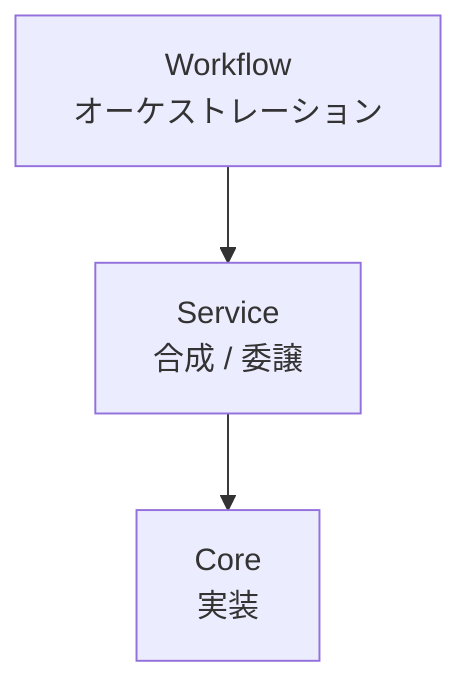
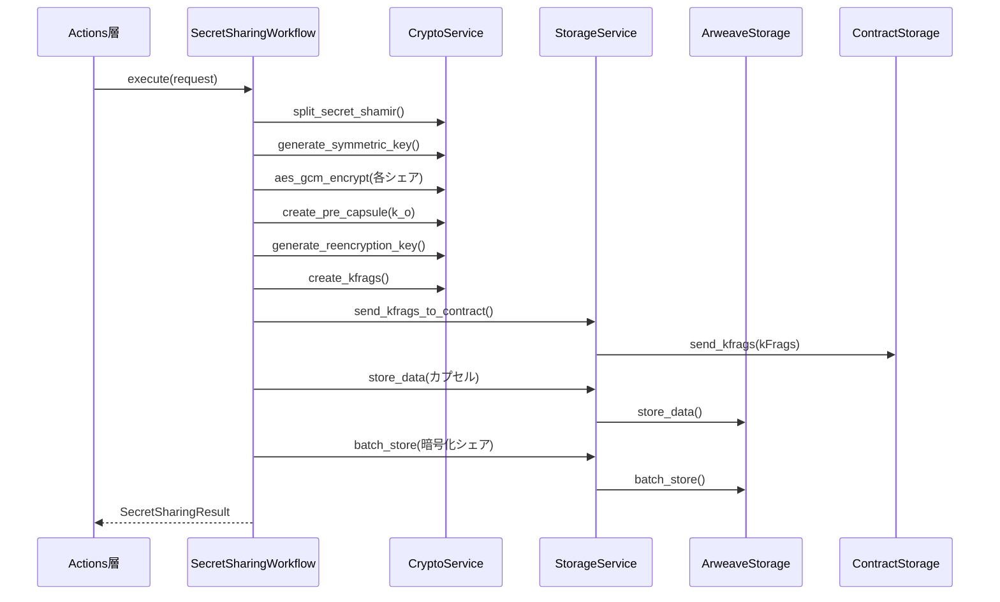
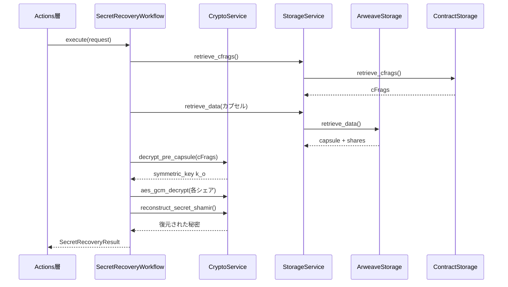

# ユースケース層

`client/src/usecase/`

3層サービスアーキテクチャ:



## Core サービス (`core/`)

### CryptoService (`core/crypto.rs`)

**トレイト:** `CryptoService`
**実装:** `CryptoServiceImpl`

#### Shamir秘密分散

| メソッド | 説明 |
|---------|------|
| `split_secret_shamir(secret, k, n)` | 閾値kでn個のシェアに分割 |
| `reconstruct_secret_shamir(shares, k)` | k個のシェアから復元 |

#### Umbral PRE

| メソッド | 説明 |
|---------|------|
| `create_pre_capsule(symmetric_key, owner_pk)` | 鍵用のPREカプセルを作成 |
| `generate_reencryption_key(owner_sk, requester_pk)` | 再暗号化鍵を導出 |
| `create_kfrags(reencryption_key, k, n)` | n個の鍵フラグメントを生成 |
| `proxy_reencrypt(capsule, kfrag)` | 暗号フラグメントを生成 |
| `combine_and_decrypt(capsule, cfrags, requester_sk, owner_pk)` | cFragで復号 |
| `decrypt_pre_capsule(capsule, cfrags, requester_sk, owner_pk)` | Phase 3 復号 |

#### AES-256-GCM

| メソッド | 説明 |
|---------|------|
| `aes_gcm_encrypt(plaintext, key)` | 対称鍵で暗号化 |
| `aes_gcm_decrypt(ciphertext, key)` | 対称鍵で復号 |
| `generate_symmetric_key()` | 32バイトのランダム鍵を生成 |

#### 鍵管理

| メソッド | 説明 |
|---------|------|
| `generate_keypair()` | Umbral鍵ペアを生成 |
| `derive_public_key(secret_key)` | 秘密鍵から公開鍵を導出 |

**定数:**

```rust
MIN_THRESHOLD: u8 = 2
MAX_SHARES: u8 = 20
KEY_SIZE_BYTES: usize = 32
```

### ArweaveStorageService (`core/storage.rs`)

**トレイト:** `ArweaveStorageService`（同期）
**実装:** `ArweaveStorageServiceImpl`

| メソッド | 説明 |
|---------|------|
| `store_data(data, tags)` | Arweaveにデータを永続化、tx_idを返す |
| `retrieve_data(tx_id)` | トランザクションIDでデータを取得 |
| `query_by_tags(params)` | タグでトランザクションを検索 |
| `check_transaction_status(tx_id)` | トランザクション確認状態を検証 |
| `batch_store(items)` | 部分失敗追跡付き一括ストレージ |
| `exists(tx_id)` | トランザクション存在確認 |
| `update_tags(tx_id, tags)` | トランザクションメタデータを更新 |

**主要な型:**

- `ArweaveTransaction` — id, data, tags, timestamp
- `Tag` — name/value メタデータペア
- `TransactionStatus` — Pending / Confirmed / Failed
- `BatchResult` — 成功・失敗アイテムを追跡
- `QueryParams` — 検索・ソートパラメータ

### ContractStorage (`core/contract_storage.rs`)

**トレイト:** `ContractStorage`（async、`AOClient`を使用）
**実装:** `ContractStorageImpl<A: AOClient>`

| メソッド | 説明 |
|---------|------|
| `send_kfrags(process_id, kfrags)` | AO経由でOwner-ProcessにkFragを送信 |
| `delegate_capsule(process_id, capsule)` | Holderにカプセルを委譲 |
| `retrieve_cfrags(process_id, secret_id)` | Requester-ProcessからcFragを取得 |
| `retrieve_threshold(process_id, secret_id)` | 閾値パラメータを取得 |

## Service層 (`service/`)

### CryptoService (`service/crypto_service.rs`)

**トレイト:** `CryptoService`（サービスレベル）
**実装:** `CryptoServiceImpl<C: CoreCryptoService>`

純粋な委譲ラッパー。`Arc<C>`を保持し、すべてのメソッドをコア暗号サービスに転送。コアがドメイン指向のまま、サービス層のインターフェースを提供。

### StorageService (`service/storage_service.rs`)

**トレイト:** `StorageService`（コントラクト操作はasync）
**実装:** `StorageServiceImpl<S: ArweaveStorageService, CT: ContractStorage>`

**合成パターン** — Arweave（同期）とContract（非同期）の操作を統合:

| 同期（Arweave） | 非同期（AO Contract） |
|-----------------|---------------------|
| `store_data()` | `send_kfrags_to_contract()` |
| `retrieve_data()` | `delegate_capsule()` |
| `query_by_tags()` | `retrieve_cfrags()` |
| `batch_store()` | `retrieve_threshold()` |

## Workflow層 (`workflow/`)

### SecretSharingWorkflowService — Phase 1 (`workflow/secret_sharing_service.rs`)

**トレイト:** `SecretSharingWorkflowService`（async）
**実装:** `SecretSharingWorkflowServiceImpl<C, ST>`

秘密分割と配布をオーケストレーション:

1. リクエストパラメータのバリデーション
2. 対称鍵 k_o を生成（32バイト AES-256）
3. Shamir秘密分散で秘密を分割
4. k_o を使用してAES-GCMで各シェアを暗号化
5. k_o 用のPREカプセルを作成
6. 再暗号化鍵からkFragを生成
7. AO Network経由でOwner-ProcessにkFragを送信
8. カプセルと暗号化シェアをArweaveに保存

**入力:** `SecretSharingRequest`（秘密、鍵、閾値パラメータ）
**出力:** `SecretSharingResult`（secret_id, capsule_tx_id, share_tx_ids, kfrag_count, owner_public_key）

`PartialStorageFailure`を処理 — Arweaveの部分的失敗でも成功情報を返す。

### SecretRecoveryWorkflowService — Phase 3 (`workflow/secret_recovery_service.rs`)

**トレイト:** `SecretRecoveryWorkflowService`（同期）
**実装:** `SecretRecoveryWorkflowServiceImpl<C, ST>`

秘密復元をオーケストレーション:

1. AO経由でRequester-ProcessからcFragを取得
2. Arweaveからカプセルと暗号化シェアを取得
3. 閾値要件を検証
4. cFragを使用してカプセルを復号（PRE脱カプセル化）
5. 対称鍵 k_o を復元
6. AES-GCMで各シェアを復号
7. Shamirで秘密を再構築
8. Arweaveに監査証跡を記録

**入力:** `SecretRecoveryRequest`（secret_id, requester_secret_key, requester_process_id）
**出力:** `SecretRecoveryResult`（復元された秘密、監査tx）

**状態:** 部分実装（Issue #47のストレージ取得待ち）。

### WorkflowServiceContainer (`workflow/container.rs`)

ファクトリ関数付きDIコンテナ:

```rust
create_secret_sharing_service()   // Phase 1
create_secret_recovery_service()  // Phase 3
create_workflow_services()        // 両方（暗号サービスを共有）
```

**デフォルト型:** `DefaultWorkflowServiceContainer`

## DTO (`dto.rs`)

| DTO | 用途 |
|-----|------|
| `SecretSharingRequest` | Phase 1 入力（秘密、鍵、パラメータ） |
| `SecretSharingResult` | Phase 1 出力（ID群、トランザクション情報） |
| `SecretRecoveryRequest` | Phase 3 入力（secret_id、リクエスター鍵） |
| `SecretRecoveryResult` | Phase 3 出力（復元された秘密、監査tx） |
| `SecretMetadata` | 秘密のオプションメタデータ |
| `SecretStatus` | Created / KFragsDistributed / Recovered / Revoked |

## エラー階層 (`error.rs`)

```
ServiceError
├── Business（回復可能）
│   ├── ValidationError
│   ├── AuthorizationError
│   ├── ResourceNotFound
│   ├── BusinessRuleViolation
│   ├── InvalidProcessState
│   ├── ThresholdNotMet
│   ├── InvalidOperation
│   └── RoleConflict
└── System（回復不能）
    ├── Crypto
    ├── Storage
    ├── Network
    ├── Internal
    ├── Repository
    ├── Serialization
    └── AONetwork

WorkflowError
├── ValidationError
├── CryptoError
├── StorageError
├── AOCommunicationError
├── InsufficientCFrags
├── DecryptionError（フェーズ追跡付き）
├── ResourceNotFound
└── PartialStorageFailure
```

## データフロー

### Phase 1: 秘密共有



### Phase 3: 秘密復元


