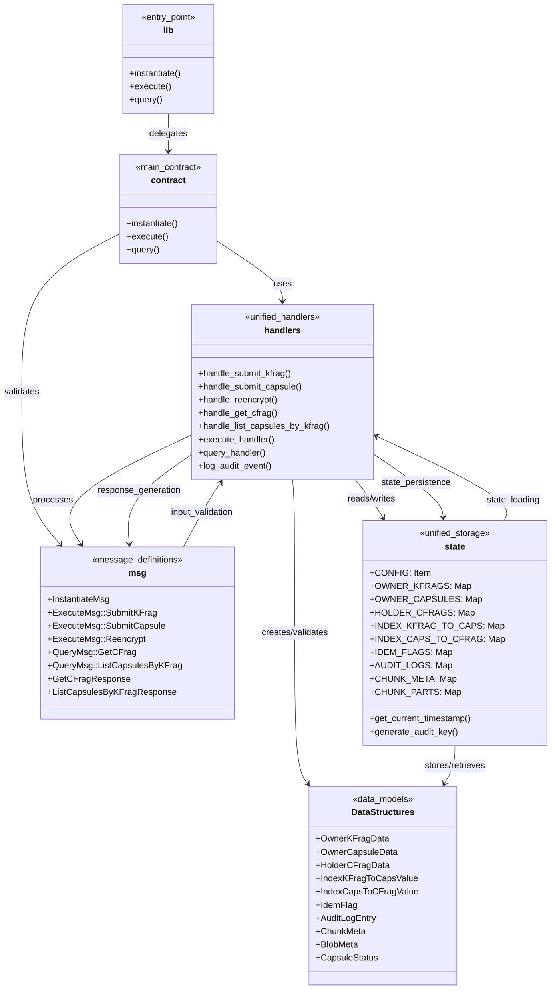

# FORMIX コントラクト アーキテクチャドキュメント

## プロジェクト構造

### ディレクトリ構成

```
/ao/contracts/src/
├── lib.rs              # CosmWasm エントリーポイント
├── contract.rs         # メインコントラクト実装（簡素化）
├── handlers.rs         # 統一メッセージハンドラ
├── msg.rs              # メッセージ定義（簡素化）
├── state.rs            # 統一KVストレージ定義
└── tests.rs            # 基本テスト
```

### ファイル一覧と概要

| ファイル | サイズ | 役割 |
|---------|-------|------|
| `lib.rs` | 1.2KB | CosmWasm標準エントリーポイント |
| `contract.rs` | 5.8KB | メインコントラクト（統一アーキテクチャ） |
| `handlers.rs` | 12.5KB | 統一メッセージハンドラ（Owner/Holder/Requester統合） |
| `msg.rs` | 7.2KB | 簡素化されたメッセージ・データ構造定義 |
| `state.rs` | 8.9KB | 統一KVストレージ・状態定義（`process.id`ベース） |
| `tests.rs` | 3.2KB | 基本テストスイート（更新中） |

## アーキテクチャ図



## アーキテクチャ階層

### 1. エントリーポイント層 (`lib.rs`)

**役割**: CosmWasm標準のエントリーポイントを提供

```rust
#[entry_point]
pub fn instantiate(deps: DepsMut, env: Env, info: MessageInfo, msg: InstantiateMsg) -> Result<Response, ContractError>

#[entry_point]
pub fn execute(deps: DepsMut, env: Env, info: MessageInfo, msg: ExecuteMsg) -> Result<Response, ContractError>

#[entry_point]
pub fn query(deps: Deps, _env: Env, msg: QueryMsg) -> StdResult<Binary>
```

**特徴**:
- CosmWasm AO Network との統合点
- すべてのメッセージの最初の受信ポイント
- `contract.rs` への委譲のみを行う

### 2. コントラクト層 (`contract.rs`)

**役割**: 統一されたコントラクトのエントリーポイント

**主要機能**:
- **プロセス初期化**: 単一プロセスでのprocess_id指定による初期化
- **ハンドラー委譲**: メッセージ種別に応じたハンドラーへの委譲
- **統一エラーハンドリング**: 全メッセージの統一されたエラー処理

**設計パターン**: Delegation Pattern

### 3. メッセージ定義層 (`msg.rs`)

**役割**: 統一されたメッセージ定義とデータ構造

**主要コンポーネント**:

#### InstantiateMsg
```rust
pub struct InstantiateMsg {
    pub process_id: String,
}
```

#### ExecuteMsg
```rust
pub enum ExecuteMsg {
    SubmitKFrag { kfrag_id: String, kfrag: Binary },
    SubmitCapsule { kfrag_id: String, capsule_id: String, capsule: Binary },
    Reencrypt { kfrag_id: String, capsule_id: String },
}
```

#### QueryMsg
```rust
pub enum QueryMsg {
    GetCFrag { kfrag_id: String, capsule_id: String },
    ListCapsulesByKFrag { kfrag_id: String, start_after: Option<String>, limit: Option<u32> },
}
```

#### レスポンスオブジェクト
- `GetCFragResponse`: cFrag取得レスポンス
- `ListCapsulesByKFragResponse`: Capsule一覧レスポンス
- `CapsuleInfo`: Capsule情報

### 4. ストレージ定義層 (`state.rs`)

**役割**: 統一されたKVストレージの定義とデータ構造

**ストレージマップ（すべてprocess_idベースの複合キー）**:

#### 設定とメタデータ
```rust
pub const CONFIG: Item<Config> = Item::new("config");
```

#### 統合Owner/Holder機能
```rust
pub const OWNER_KFRAGS: Map<(String, String), OwnerKFragData> = Map::new("owner_kfrags");
pub const OWNER_CAPSULES: Map<(String, String, String), OwnerCapsuleData> = Map::new("owner_capsules");
pub const HOLDER_CFRAGS: Map<(String, String, String), HolderCFragData> = Map::new("holder_cfrags");
```

#### インデックス
```rust
pub const INDEX_KFRAG_TO_CAPS: Map<(String, String, String), IndexKFragToCapsValue> = Map::new("index_kfrag_to_caps");
pub const INDEX_CAPS_TO_CFRAG: Map<(String, String, String), IndexCapsToCFragValue> = Map::new("index_caps_to_cfrag");
```

#### 制御
```rust
pub const IDEM_FLAGS: Map<(String, String, String), IdemFlag> = Map::new("idem_flags");
pub const AUDIT_LOGS: Map<String, AuditLogEntry> = Map::new("audit_logs");
```

**主要データ構造**:

#### 設定
```rust
pub struct Config {
    pub process_id: String,
    pub chunk_threshold: u32,
    pub max_chunks: u32,
    pub default_list_limit: u32,
}
```

#### Owner/Holder統合データ
```rust
pub struct OwnerKFragData {
    pub kfrag: Binary,
    pub meta: BlobMeta,
}

pub struct OwnerCapsuleData {
    pub capsule: Binary,
    pub status: CapsuleStatus,
    pub meta: BlobMeta,
}

pub struct HolderCFragData {
    pub cfrag: Binary,
    pub meta: BlobMeta,
}
```

#### 制御構造
```rust
pub enum CapsuleStatus {
    Received,
    ReencInProgress,
    CFragReady,
    Error,
}

pub struct IdemFlag {
    pub generated: bool,
    pub updated_ts: String,
}

pub struct AuditLogEntry {
    pub event: String,
    pub actor_wallet: String,
    pub kfrag_id: String,
    pub capsule_id: String,
    pub reason_or_meta: String,
    pub ext_ts: String,
}
```

**セキュリティ特徴**:
- メッセージ順序制御（SubmitKFrag → SubmitCapsule → GetCFrag）
- 冪等性保証による重複処理防止
- block.time使用による決定論的実行
- 監査ログによる操作追跡

### 5. ハンドラー層 (`handlers.rs`)

**役割**: 統一されたメッセージハンドリングとビジネスロジック

統一プロセス内でOwner/Holder/Requesterの全機能を実装する重要な層です。

#### 5.1 主要ハンドラー

##### Execute ハンドラー
```rust
pub fn handle_submit_kfrag(
    deps: DepsMut,
    env: Env,
    _info: MessageInfo,
    kfrag_id: String,
    kfrag: Binary,
) -> ContractResult

pub fn handle_submit_capsule(
    deps: DepsMut,
    env: Env,
    info: MessageInfo,
    kfrag_id: String,
    capsule_id: String,
    capsule: Binary,
) -> ContractResult

pub fn handle_reencrypt(
    deps: DepsMut,
    _env: Env,
    _info: MessageInfo,
    kfrag_id: String,
    capsule_id: String,
) -> ContractResult
```

##### Query ハンドラー
```rust
pub fn handle_get_cfrag(
    deps: Deps,
    env: Env,
    _info: MessageInfo,
    kfrag_id: String,
    capsule_id: String,
) -> StdResult<Binary>

pub fn handle_list_capsules_by_kfrag(
    deps: Deps,
    _env: Env,
    kfrag_id: String,
    start_after: Option<String>,
    limit: Option<u32>,
) -> StdResult<Binary>
```

#### 5.2 処理フロー制御

**順序制御**:
1. **SubmitKFrag**: kFragの受信・保存（Owner機能）
2. **SubmitCapsule**: Capsule受信・再暗号化・cFrag生成（Holder機能）
3. **GetCFrag**: cFragの取得（Requester機能）

**冪等性保証**:
- IdemFlagによる重複処理防止
- 処理状態の適切な管理

#### 5.3 AO Network制約への対応

**ステートレス実行**:
- メッセージごとに状態を完全にロード・処理・保存
- 決定論的タイムスタンプ（block.time）使用

**分散Compute Unit対応**:
- 単一プロセス内処理のため複雑性軽減
- 状態一貫性の保証

### 6. テスト層 (`tests.rs`)

**役割**: 品質保証とリグレッション防止

**テストカテゴリ**:

#### 基本テスト
- プロセス初期化テスト
- メッセージバリデーションテスト
- 各ハンドラーの単体テスト

#### 統合テスト
- kFrag → Capsule → cFrag フローテスト
- エラーハンドリングテスト
- 冪等性テスト

#### セキュリティテスト
- メッセージ順序制御テスト
- タイムスタンプ決定論テスト
- 監査ログ生成テスト

## 重要な設計パターン

### 1. ファサードパターン (Facade Pattern)

**適用箇所**: 各プロセスモジュールの `mod.rs`

**目的**:
- 複雑なサブシステムに対するシンプルなインターフェース提供
- クライアントコードの簡素化
- 内部実装の変更からクライアントを保護

**実装例**:
```rust
// 複雑な内部処理を隠蔽
impl OwnerProcessFacade {
    pub fn distribute_kfrags(/* 引数 */) -> Result<Response, ContractError> {
        // 内部で handlers::handle_distribute_kfrags() を呼び出し
        // エラーハンドリング、ログ出力なども統合
    }
}
```

### 2. レイヤードアーキテクチャ (Layered Architecture)

**階層構造**:
- **プレゼンテーション層**: lib.rs, contract.rs
- **ビジネスロジック層**: handlers.rs
- **データアクセス層**: storage.rs
- **データ層**: state.rs

**利点**:
- 明確な責任分離
- テスト容易性
- 保守性の向上

### 3. リポジトリパターン (Repository Pattern)

**適用箇所**: storage.rs ファイル群

**目的**:
- データアクセスロジックの抽象化
- データソースの詳細の隠蔽
- テスト時のモック化容易性

### 4. メッセージ駆動アーキテクチャ (Message-Driven Architecture)

**CosmWasm AO対応**:
- ステートレス実行への適応
- イベントソーシングによる状態管理
- 非同期メッセージングサポート

## プロセス間通信フロー

### 1. AO Network プロセス間メッセージング

FORMIXシステムでは、Owner、Holder、RequesterがそれぞれAO Network上の独立したプロセスとして動作し、メッセージパッシングによって連携します。

#### 1.1 プロセス初期化とレジストリ構築

```
Owner-Process(spawn) → Holder-Process(spawn) → Requester-Process(spawn)
```

1. **Owner-Process**:
   - 自身のプロセスレジストリ初期化
   - 複数Holder-Processを`spawn_holder_processes()`で生成
   - 各Holder-Processを`add_holder_to_registry()`で登録

2. **Holder-Process**:
   - Owner-Processから登録メッセージ受信
   - Owner-Processを`set_owner_in_registry()`で登録

3. **Requester-Process**:
   - システムに参加時、Holder-Processリストを取得
   - 必要に応じてOwner-Processに登録

#### 1.2 kFrag配布フロー (PHASE 1)

```
O-Browser → Owner-Process → Holder-Process(1..n) [via SendKFragToHolder message]
```

**メッセージフロー**:
```rust
// Owner-Process → Holder-Process
ExecuteMsg::SendKFragToHolder {
    target_process: String,        // Holder-ProcessのプロセスID
    kfrag: KFragDistribution,      // 暗号化されたkFragデータ
    owner_process: String,         // Owner-ProcessのプロセスID
}
```

1. **O-Browser**: kFrag生成・暗号化
2. **Owner-Process**:
   - kFrag受信・検証
   - Holder選出（RandAOアルゴリズム）
   - `OwnerAOIntegration::send_kfrag_to_holder()`でメッセージ送信
3. **Holder-Process**:
   - `execute_send_kfrag_to_holder()`でkFrag受信・保存
   - プロセス認証とデータ検証

#### 1.3 cFrag要求・生成フロー (PHASE 2)

```
Requester-Process → Holder-Process [via RequestCFragFromHolder]
                 ← Holder-Process [via SendCFragToRequester]
```

**メッセージフロー**:
```rust
// Requester-Process → Holder-Process
ExecuteMsg::RequestCFragFromHolder {
    target_process: String,        // Holder-ProcessのプロセスID
    session_id: String,           // セッション識別子
    requester_process: String,     // Requester-ProcessのプロセスID
}

// Holder-Process → Requester-Process
ExecuteMsg::SendCFragToRequester {
    target_process: String,        // Requester-ProcessのプロセスID
    cfrag: CFragSubmission,       // 生成されたcFragデータ
    holder_process: String,        // Holder-ProcessのプロセスID
}
```

1. **Requester-Process**:
   - `RequesterAOIntegration::request_cfrags_from_holders()`で複数要求
   - 各Holder-Processに並行してcFrag要求
2. **Holder-Process**:
   - `execute_request_cfrag_from_holder()`で要求受信
   - Capsule取得、cFrag生成 (PRE_ReEnc)
   - `HolderAOIntegration::send_cfrag_to_requester()`で応答
3. **Requester-Process**:
   - `execute_send_cfrag_to_requester()`でcFrag収集
   - 閾値達成チェック

#### 1.4 秘密復元フロー (PHASE 3)

```
R-Browser → Requester-Process → R-Browser
```

1. **Requester-Process**:
   - k個のcFrag収集完了確認
   - `CFragCollection`の閾値チェック
   - 復元用データパッケージ作成
2. **R-Browser**:
   - cFragを用いた秘密復元実行
   - 最終的なデータ復号化

### 2. メッセージ配信の信頼性保証

#### 2.1 メッセージキューイング
```rust
// 失敗時の再試行メカニズム
AOIntegration::queue_message() → MESSAGE_QUEUE → retry_message() → complete_message()
```

#### 2.2 プロセス健全性監視
```rust
// 定期的なハートビート更新
AOIntegration::update_process_heartbeat() → AOProcessInfo.last_heartbeat
```

#### 2.3 メッセージ順序保証
- セッションIDベースの順序制御
- 重複メッセージの検出と排除
- タイムアウト処理とデッドレター管理

## セキュリティ設計

### 1. メッセージ順序制御

**順序強制**:
- SubmitKFrag → SubmitCapsule → GetCFrag の厳密な順序
- kFrag存在チェックによるCapsule投稿制限
- インデックスによる効率的な存在確認

### 2. 冪等性保証

**重複処理防止**:
```rust
// 冪等フラグによる二重処理防止
let idem_key = (process_id, kfrag_id, capsule_id);
if IDEM_FLAGS.has(deps.storage, idem_key) {
    return Ok(no_op_response());
}
```

### 3. 決定論的実行

**block.time使用**:
```rust
pub fn get_current_timestamp(env: &cosmwasm_std::Env) -> String {
    let timestamp = env.block.time.seconds();
    format!("{}Z", timestamp)
}
```

### 4. 監査ログ

**操作追跡**:
- 全ての状態変更をAuditLogEntryに記録
- エラー発生時の詳細ログ
- タイムスタンプベースのキー生成

## パフォーマンス最適化

### 1. 統一プロセスによる簡素化

**単一プロセス利点**:
- プロセス間通信オーバーヘッド除去
- 状態管理の簡素化
- エラーハンドリングの統一

### 2. 効率的なインデックス

**二重インデックス**:
- INDEX_KFRAG_TO_CAPS: kFragからCapsule一覧へ
- INDEX_CAPS_TO_CFRAG: CapsuleからcFrag存在確認へ
- O(1)での存在チェック

### 3. ストレージ効率化

**process_idベースの名前空間**:
- 全KVストレージキーにprocess_idプレフィックス
- prefix-based scanningによる効率的なクエリ
- プロセス分離によるデータ独立性

## 拡張性

### 1. メッセージ拡張

**新メッセージ追加**:
- ExecuteMsg/QueryMsgへの新バリアント追加
- ハンドラー関数の追加実装
- バックワード互換性の維持

### 2. 機能拡張

**新機能実装**:
- 統一アーキテクチャによる開発効率化
- 既存状態管理パターンの再利用
- 監査ログによる新機能の追跡

## 運用監視

### 1. 監査追跡

**AuditLogEntry**:
- すべての状態変更イベントを記録
- event, actor_wallet, kfrag_id, capsule_id の詳細追跡
- 時系列での操作履歴管理

### 2. パフォーマンス監視

**処理状態管理**:
- CapsuleStatus による処理段階の可視化
- エラー状態の詳細記録
- 処理完了までの時間測定


---

この統一アーキテクチャにより、FORMIXシステムは**シンプル**、**効率的**、**セキュア**、**保守可能**な閾値代理再暗号化システムとして、AO Network上で最適化された性能を発揮します。
