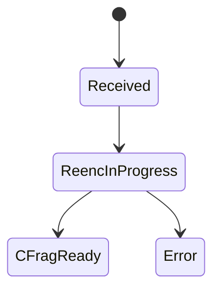
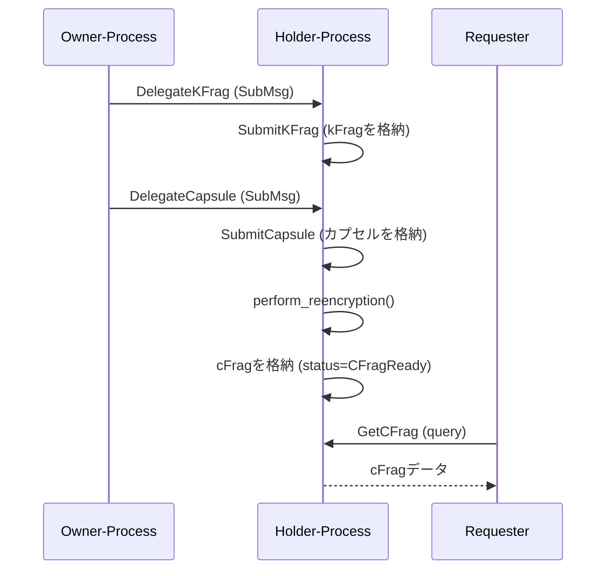

# AOコントラクト

`ao/contracts/src/`

## 概要

FORMIXの閾値プロキシ再暗号化における**Holder-Process**ロールを実装するCosmWasm互換スマートコントラクト。kFrag/カプセルの受信、再暗号化操作、cFragの格納を処理。

## モジュール構成

| モジュール | 説明 |
|----------|------|
| `lib.rs` | WASMエントリポイント（instantiate, execute, query, reply） |
| `contract.rs` | ハンドラーへの上位レベルルーティング |
| `handlers.rs` | コアビジネスロジック |
| `msg.rs` | メッセージ定義とバリデーション |
| `state.rs` | ストレージマップとドメイン型 |

## メッセージ (`msg.rs`)

### InstantiateMsg

```rust
InstantiateMsg { process_id: String }
```

バリデーション: 1〜128文字。

### ExecuteMsg

| バリアント | フィールド | 説明 |
|----------|----------|------|
| `DelegateKFrag` | kfrag_id, kfrag (Binary) | Owner → Holder kFrag委譲 |
| `DelegateCapsule` | kfrag_id, capsule_id, capsule (Binary) | Owner → Holder カプセル委譲 |
| `SubmitKFrag` | kfrag_id, kfrag (Binary) | HolderがkFragを格納 |
| `SubmitCapsule` | kfrag_id, capsule_id, capsule (Binary) | Holderがカプセルを格納 |
| `Reencrypt` | kfrag_id, capsule_id | 再暗号化をトリガー（またはリトライ） |

### QueryMsg

| バリアント | フィールド | 説明 |
|----------|----------|------|
| `GetCFrag` | kfrag_id, capsule_id | 暗号フラグメントを取得 |
| `ListCapsulesByKFrag` | kfrag_id, start_after, limit | kFragに対応するカプセル一覧（ページネーション付き） |

### バリデーション（`ValidateMessage`トレイト）

- IDフォーマット: ASCII英数字 + アンダースコア/ハイフン
- バイナリサイズ制限: 最大128KB

## 状態 (`state.rs`)

### Config

```rust
Config { process_id: String, default_list_limit: u32 }
```

### ストレージマップ

すべて`(process_id, ...)`プレフィックスでキー付け（マルチテナント対応）。

| マップ | キー | 値 | 説明 |
|-------|-----|-----|------|
| `OWNER_KFRAGS` | (process_id, kfrag_id) | `OwnerKFragData` | Owner委譲のkFrag |
| `OWNER_CAPSULES` | (process_id, kfrag_id, capsule_id) | `OwnerCapsuleData` | Owner委譲のカプセル |
| `HOLDER_CFRAGS` | (process_id, kfrag_id, capsule_id) | `HolderCFragData` | 再暗号化されたcFrag |
| `INDEX_KFRAG_TO_CAPS` | 複合キー | `IndexKFragToCapsValue` | kFrag → カプセルインデックス |
| `INDEX_CAPS_TO_CFRAG` | 複合キー | `IndexCapsToCFragValue` | カプセル → cFrag存在確認 |
| `IDEM_FLAGS` | 複合キー | `IdemFlag` | 冪等性追跡 |
| `KFRAG_HOLDERS` | 複合キー | ホルダー情報 | Owner→Holder委譲追跡 |

### CapsuleStatus



### ドメイン型

| 型 | フィールド |
|-----|----------|
| `BlobMeta` | size_bytes, sha256_hex, updated_ts (RFC3339) |
| `OwnerKFragData` | kfrag (Binary), meta (BlobMeta) |
| `OwnerCapsuleData` | capsule (Binary), meta (BlobMeta), status (CapsuleStatus) |
| `HolderCFragData` | cfrag (Binary), meta (BlobMeta) |

### シリアライズされた暗号型（bincode）

| 型 | フィールド |
|-----|----------|
| `StoredKeyFrag` | id, key_data, verification_data, precursor |
| `StoredCFrag` | fragment_id, capsule_fragment, proof |
| `VerificationData` | verifying_pk, delegating_pk, receiving_pk |

## ハンドラー (`handlers.rs`)

### Executeハンドラー

**handle_delegate_kfrag:**
1. (process_id, kfrag_id) → ホルダーマッピングを格納
2. `SubmitKFrag`付きSubMsgをホルダーに送信
3. `ReplyOn::Error`のみ

**handle_delegate_capsule:**
1. kfrag_idでホルダーを検索
2. `SubmitCapsule`付きSubMsgをホルダーに送信

**handle_submit_kfrag:**
1. メタデータ（サイズ、SHA256、タイムスタンプ）付きでkFragを永続化
2. 既に存在する場合はno-opを返す（冪等）

**handle_submit_capsule（パイプライン）:**
1. 冪等性フラグを確認
2. status = `Received`でカプセルを保存
3. statusを`ReencInProgress`に更新
4. `perform_reencryption()`を呼び出し
5. 成功時: cFragを保存、status = `CFragReady`
6. エラー時: status = `Error`

**handle_reencrypt（リトライ）:**
格納済みkFragとカプセルを使用して失敗した再暗号化を再試行。

### Queryハンドラー

**handle_get_cfrag:** O(1)存在確認後にcFragデータを取得。

**handle_list_capsules_by_kfrag:** ページネーション付きレンジクエリ（デフォルト50、最大100）。

### 再暗号化 (`perform_reencryption`)

1. bincodeから`StoredKeyFrag`をデシリアライズ
2. 検証鍵（`PublicKey`）を抽出・デシリアライズ
3. `Capsule`をデシリアライズ
4. 公開鍵に対してkFragを検証
5. `umbral_pre::reencrypt()`を呼び出してcFragを生成
6. cFragをシリアライズし`StoredCFrag`として返す

### Replyハンドラー

- `handle_delegate_kfrag_reply` — SubMsg失敗時にエラーをログ
- `handle_delegate_capsule_reply` — SubMsg失敗時にエラーをログ

## エラー型 (`ContractError`)

コントラクト固有のエラーenum:
- 未認可操作
- 無効なメッセージフォーマット
- ストレージ障害
- 再暗号化エラー
- SubMsg障害

## 再暗号化フロー



失敗時、`Reencrypt`で特定の(kfrag_id, capsule_id)に対して再暗号化をリトライ可能。
