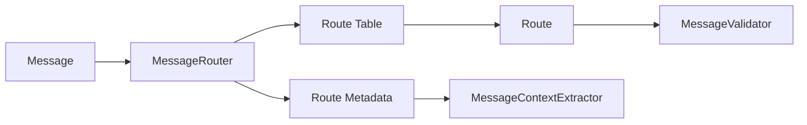
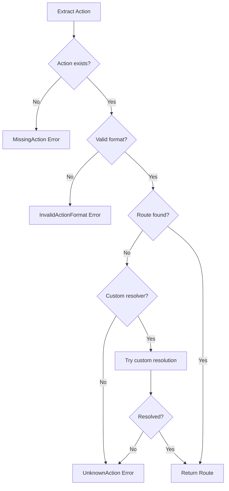

# MessageRouter詳細設計

## 1. 概要

MessageRouterは、AOメッセージのActionタグに基づいて、適切な処理経路（Route）を決定するコンポーネントです。FORMIXシステムの各Phaseに対応したアクションを識別し、後続の処理に必要なルーティング情報を提供します。

### 1.1 責務と目的

MessageRouterの主な責務：

1. **アクション識別**
   - メッセージタグからActionを抽出
   - 定義済みアクションとのマッチング

2. **ルート決定**
   - ActionからRouteへのマッピング
   - 未知のアクションの検出

3. **ルーティング情報の提供**
   - 後続処理に必要なメタデータ
   - Phase情報の付与

### 1.2 設計原則

- **単一責任**: ルーティングロジックのみに集中
- **拡張性**: 新しいアクションの追加が容易
- **性能**: O(1)のルックアップ時間
- **型安全性**: コンパイル時のRoute検証

## 2. アーキテクチャ

### 2.1 全体構造



### 2.2 コンポーネント構成

MessageRouterは以下の要素で構成されます：

| コンポーネント | 役割 | 実装詳細 |
|--------------|------|---------|
| RouteTable | Action→Routeマッピング | HashMap<String, Route> |
| RouteMetadata | ルート付加情報 | Phase、必須タグなど |
| RouteResolver | カスタムルート解決 | 動的ルーティング用 |
| RouteCache | ルーティング結果キャッシュ | LRU Cache |

## 3. ルーティング仕様

### 3.1 標準ルート定義

FORMIXの各Phaseに対応するルート定義：

#### Phase 0: 初期化
| Action | Route | 説明 |
|--------|-------|------|
| Initialize-Process | InitializeProcess | プロセス初期化 |
| Set-Role | SetRole | ロール設定 |

#### Phase 1: 秘密分割
| Action | Route | 説明 |
|--------|-------|------|
| Split-Secret | SplitSecret | 秘密の分割処理 |
| Store-Share | StoreShare | シェアの保存 |
| Store-Capsule | StoreCapsule | カプセルの保存 |

#### Phase 2: アクセス要求
| Action | Route | 説明 |
|--------|-------|------|
| Access-Request | AccessRequest | アクセス要求の作成 |
| Verify-Access | VerifyAccess | アクセス権限の検証 |
| Store-ProofPackage | StoreProofPackage | 証明パッケージの保存 |

#### Phase 3: 再暗号化キー配布
| Action | Route | 説明 |
|--------|-------|------|
| Generate-ReKey | GenerateReKey | 再暗号化キー生成 |
| Distribute-KFrag | DistributeKFrag | kFragの配布 |
| Store-KFrag | StoreKFrag | kFragの保存 |

#### Phase 4: プロキシ再暗号化
| Action | Route | 説明 |
|--------|-------|------|
| Request-Reencryption | RequestReencryption | 再暗号化要求 |
| Perform-Reencryption | PerformReencryption | 再暗号化実行 |
| Collect-CFrags | CollectCFrags | cFragの収集 |

#### Phase 5: 秘密復元
| Action | Route | 説明 |
|--------|-------|------|
| Recover-Secret | RecoverSecret | 秘密の復元 |
| Verify-CFrags | VerifyCFrags | cFragの検証 |
| Complete-Recovery | CompleteRecovery | 復元完了 |

### 3.2 メタルート

システム管理用の特殊ルート：

| Action | Route | 説明 |
|--------|-------|------|
| Get-Status | GetStatus | プロセス状態取得 |
| Update-Config | UpdateConfig | 設定更新 |
| Health-Check | HealthCheck | ヘルスチェック |
| Get-Metrics | GetMetrics | メトリクス取得 |

## 4. ルーティングアルゴリズム

### 4.1 基本フロー

```
1. メッセージからActionタグを抽出
2. ActionをキーにRouteTableを検索
3. 一致するRouteがあれば返却
4. なければカスタムリゾルバーを試行
5. それでも見つからなければエラー
```

### 4.2 優先順位とフォールバック

ルート解決の優先順位：

1. **完全一致**: Action文字列の完全一致
2. **プレフィックス一致**: Action-*パターン
3. **正規表現**: カスタムパターンマッチング
4. **デフォルト**: Unknown Routeへのフォールバック

### 4.3 動的ルーティング

特定の条件下で動的にルートを決定：

```rust
// 例: バージョン付きルーティング
if action.starts_with("v2/") {
    // v2用の特別な処理
    return self.route_v2(action);
}

// 例: ロールベースルーティング
if let Some(role) = msg.tags.get("Process-Role") {
    match role.as_str() {
        "owner" => self.owner_routes.get(action),
        "holder" => self.holder_routes.get(action),
        "requester" => self.requester_routes.get(action),
        _ => None
    }
}
```

## 5. RouteMetadata仕様

### 5.1 メタデータ構造

各Routeに付随する追加情報：

```rust
pub struct RouteMetadata {
    // Phase情報
    pub phase: Phase,
    
    // 必須タグ
    pub required_tags: Vec<&'static str>,
    
    // オプショナルタグ
    pub optional_tags: Vec<&'static str>,
    
    // ペイロード要件
    pub requires_payload: bool,
    pub max_payload_size: Option<usize>,
    
    // ロール制限
    pub allowed_roles: Vec<ProcessRole>,
    
    // タイムアウト設定
    pub timeout: Duration,
    
    // リトライ設定
    pub max_retries: u32,
    pub retry_delay: Duration,
}
```

### 5.2 メタデータの活用

メタデータは後続の処理で活用されます：

| 利用先 | 活用方法 |
|--------|---------|
| MessageValidator | required_tagsに基づく検証 |
| MessageContextExtractor | optional_tagsの抽出ヒント |
| MessageHandler | timeoutとretry設定の適用 |
| ServiceLayer | phase情報による処理分岐 |

## 6. エラーハンドリング

### 6.1 エラー種別

MessageRouterが返す可能性のあるエラー：

| エラー | 説明 | 対処法 |
|--------|------|--------|
| MissingAction | Actionタグが存在しない | 400 Bad Request |
| UnknownAction | 未定義のAction | 404 Not Found |
| InvalidActionFormat | Action形式が不正 | 400 Bad Request |
| RoutingConflict | 複数のルートが競合 | 500 Internal Error |

### 6.2 エラー処理フロー



## 7. パフォーマンス最適化

### 7.1 ルックアップ最適化

- **HashMapによるO(1)検索**
- **事前計算されたハッシュ値**
- **String internによるメモリ効率化**

### 7.2 キャッシング戦略

```rust
pub struct CachedRouter {
    inner: MessageRouter,
    cache: LruCache<String, Route>,
    cache_hits: AtomicU64,
    cache_misses: AtomicU64,
}
```

キャッシュ統計の監視：
- キャッシュヒット率
- エビクション頻度
- メモリ使用量

### 7.3 ベンチマーク目標

| 操作 | 目標性能 |
|------|---------|
| ルート解決 | < 1μs |
| メタデータ取得 | < 100ns |
| エラー処理 | < 10μs |

## 8. 拡張性設計

### 8.1 新しいアクションの追加

新しいアクションを追加する際の手順：

1. **Route enumに新しい値を追加**
2. **RouteTableにマッピングを追加**
3. **RouteMetadataを定義**
4. **テストケースを追加**

### 8.2 プラグインシステム

外部からルーティングロジックを追加：

```rust
pub trait RoutePlugin {
    fn can_handle(&self, action: &str) -> bool;
    fn resolve(&self, action: &str, msg: &Message) -> Option<Route>;
    fn metadata(&self, route: &Route) -> Option<RouteMetadata>;
}
```

### 8.3 設定ベースのルーティング

YAMLやJSONでルートを定義：

```yaml
routes:
  - action: "Custom-Action"
    route: "CustomRoute"
    phase: 1
    required_tags: ["Secret-Id", "Custom-Field"]
    timeout: 30s
```

## 9. 監視とデバッグ

### 9.1 メトリクス

収集すべきメトリクス：

| メトリクス | 説明 | 用途 |
|-----------|------|------|
| routing_requests_total | 総ルーティング要求数 | トラフィック監視 |
| routing_errors_by_type | エラー種別ごとの発生数 | エラー分析 |
| routing_duration_seconds | ルーティング処理時間 | パフォーマンス監視 |
| unknown_actions | 未知のアクション | 新機能の需要把握 |

### 9.2 ロギング

重要なログポイント：

```rust
// 成功時
info!("Route resolved: action={}, route={:?}", action, route);

// エラー時
warn!("Unknown action received: action={}", action);

// デバッグ情報
debug!("Route metadata: {:?}", metadata);
```

### 9.3 トレーシング

分散トレーシングのサポート：

```rust
#[instrument(skip(self, msg))]
pub fn route(&self, msg: &Message) -> Result<Route, RoutingError> {
    // トレーシング情報が自動的に記録される
}
```

## 10. テスト戦略

### 10.1 単体テスト

テストすべき項目：

1. **正常系**
   - 各Actionの正しいRoute解決
   - メタデータの正確性

2. **異常系**
   - 未知のActionの処理
   - 不正な形式の処理

3. **境界値**
   - 空文字列
   - 超長文字列
   - 特殊文字

### 10.2 プロパティベーステスト

```rust
#[proptest]
fn test_routing_deterministic(action: String) {
    let router = MessageRouter::new();
    let result1 = router.route_action(&action);
    let result2 = router.route_action(&action);
    assert_eq!(result1, result2);
}
```

### 10.3 ベンチマークテスト

```rust
#[bench]
fn bench_route_lookup(b: &mut Bencher) {
    let router = MessageRouter::new();
    let msg = create_test_message("Split-Secret");
    b.iter(|| {
        black_box(router.route(&msg))
    });
}
```

## 11. まとめ

MessageRouterは、シンプルながら重要な責務を持つコンポーネントです：

1. **高速なルート解決**: O(1)のルックアップ性能
2. **拡張可能な設計**: 新しいアクションの追加が容易
3. **豊富なメタデータ**: 後続処理に有用な情報を提供
4. **堅牢なエラーハンドリング**: 明確なエラー分類と処理
5. **優れた監視性**: メトリクスとロギングの充実

これらの特性により、FORMIXシステムの安定的なメッセージルーティングを実現します。