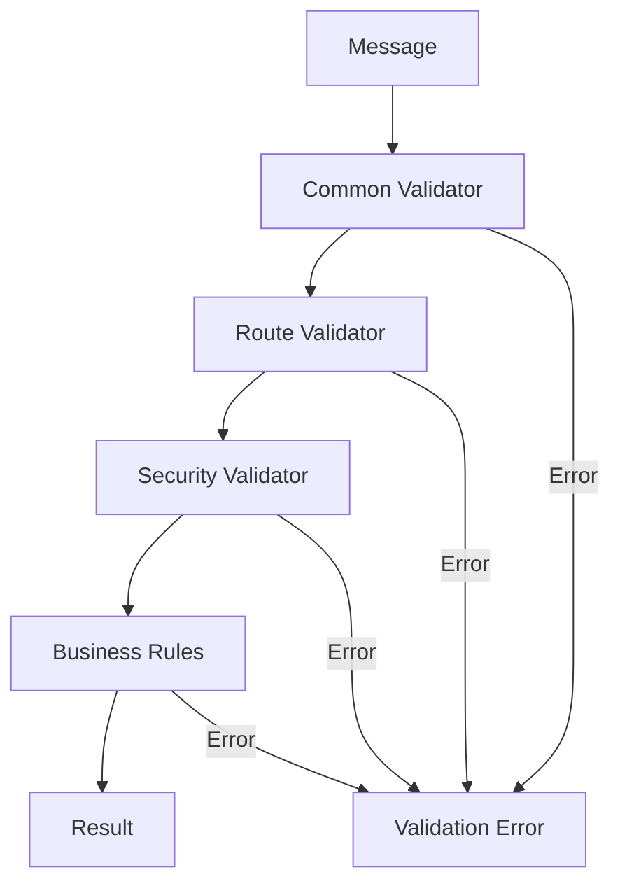

# MessageValidator詳細設計

## 1. 概要

MessageValidatorは、AOメッセージの妥当性を検証するコンポーネントです。Controller層における入力検証の責務を担い、不正なメッセージがService層に到達することを防ぎます。

### 1.1 責務と目的

MessageValidatorの主要な責務：

1. **構造検証**
   - メッセージフォーマットの確認
   - 必須フィールドの存在確認
   - データ型の妥当性チェック

2. **ビジネスルール検証**
   - 値の範囲チェック
   - 相関関係の検証
   - 状態遷移の妥当性

3. **セキュリティ検証**
   - 入力値のサニタイゼーション
   - インジェクション攻撃の防止
   - サイズ制限の適用

### 1.2 設計方針

- **階層的検証**: 共通検証 → Route固有検証
- **早期リターン**: エラーを発見次第即座に返却
- **詳細なエラー情報**: デバッグとユーザビリティの両立
- **拡張可能性**: 新しい検証ルールの追加が容易

## 2. アーキテクチャ

### 2.1 検証フロー



### 2.2 コンポーネント構造

| コンポーネント | 責務 | 実装 |
|--------------|------|-----|
| CommonValidator | 全メッセージ共通の検証 | 基本構造、タイムスタンプ等 |
| RouteValidator | Route固有の検証 | 必須タグ、ペイロード形式 |
| SecurityValidator | セキュリティ関連の検証 | サニタイゼーション、サイズ制限 |
| BusinessRuleValidator | ビジネスルールの検証 | 値の相関、状態遷移 |
| ValidatorRegistry | バリデーターの管理 | Route別バリデーターの登録 |

## 3. 検証ルール仕様

### 3.1 共通検証ルール

すべてのメッセージに適用される基本検証：

| 検証項目 | ルール | エラーコード |
|---------|--------|------------|
| Process ID | 非空、有効な形式 | MISSING_PROCESS_ID |
| Timestamp | 現在時刻±5分以内 | INVALID_TIMESTAMP |
| Message ID | UUID形式（オプション） | INVALID_MESSAGE_ID |
| Signature | 有効な署名（設定時） | INVALID_SIGNATURE |
| Message Size | 最大1MB | MESSAGE_TOO_LARGE |

### 3.2 Phase別検証ルール

#### Phase 1: 秘密分割

**Split-Secret**
| 検証項目 | ルール | エラーコード |
|---------|--------|------------|
| Secret-Id | 非空、最大64文字 | INVALID_SECRET_ID |
| Threshold-K | 1 ≤ k ≤ n | INVALID_THRESHOLD_K |
| Threshold-N | 1 ≤ n ≤ 255 | INVALID_THRESHOLD_N |
| Secret Data | 非空、最大100KB | INVALID_SECRET_DATA |
| Owner-Public-Key | 有効な公開鍵形式 | INVALID_PUBLIC_KEY |

#### Phase 2: アクセス要求

**Access-Request**
| 検証項目 | ルール | エラーコード |
|---------|--------|------------|
| Secret-Id | 存在確認 | SECRET_NOT_FOUND |
| Requester-Address | 有効なEthereumアドレス | INVALID_ETH_ADDRESS |
| Access-Conditions | JSON形式 | INVALID_CONDITIONS |
| Proof-Data | 必要に応じて検証 | INVALID_PROOF |

#### Phase 3: 再暗号化キー配布

**Distribute-KFrag**
| 検証項目 | ルール | エラーコード |
|---------|--------|------------|
| Access-Request-Id | 有効なリクエストID | INVALID_REQUEST_ID |
| Holder-Count | threshold ≤ count ≤ total | INVALID_HOLDER_COUNT |
| Selected-Holders | プロセスIDのリスト | INVALID_HOLDER_LIST |

### 3.3 セキュリティ検証ルール

| 脅威 | 検証方法 | 対策 |
|------|---------|------|
| SQLインジェクション | 特殊文字のエスケープ | パラメータ化クエリ |
| XSS | HTMLタグの除去 | 出力エンコーディング |
| パストラバーサル | ../パターンの検出 | パス正規化 |
| DoS攻撃 | サイズ制限、レート制限 | リソース制限 |
| ReDoS | 正規表現の複雑度制限 | タイムアウト設定 |

## 4. バリデーター実装パターン

### 4.1 バリデーターインターフェース

```rust
pub trait Validator: Send + Sync {
    /// 検証を実行
    fn validate(&self, msg: &Message) -> Result<(), ValidationError>;
    
    /// 検証ルールの説明
    fn describe(&self) -> &str;
    
    /// 検証の優先度（低い値が先に実行）
    fn priority(&self) -> u32 {
        100
    }
}
```

### 4.2 コンポジットバリデーター

複数のバリデーターを組み合わせる：

```rust
pub struct CompositeValidator {
    validators: Vec<Box<dyn Validator>>,
}

impl CompositeValidator {
    pub fn add_validator(&mut self, validator: Box<dyn Validator>) {
        self.validators.push(validator);
        // 優先度順にソート
        self.validators.sort_by_key(|v| v.priority());
    }
}
```

### 4.3 条件付きバリデーター

特定の条件下でのみ実行：

```rust
pub struct ConditionalValidator<V: Validator> {
    condition: Box<dyn Fn(&Message) -> bool>,
    validator: V,
}
```

## 5. エラーハンドリング

### 5.1 ValidationError構造

```rust
#[derive(Debug, Clone)]
pub struct ValidationError {
    /// エラーコード
    pub code: String,
    
    /// エラーメッセージ
    pub message: String,
    
    /// エラーが発生したフィールド
    pub field: Option<String>,
    
    /// 期待される値
    pub expected: Option<String>,
    
    /// 実際の値
    pub actual: Option<String>,
    
    /// 追加のコンテキスト
    pub context: HashMap<String, String>,
}
```

### 5.2 エラー集約

複数のエラーをまとめて返却：

```rust
pub struct ValidationErrors {
    errors: Vec<ValidationError>,
}

impl ValidationErrors {
    pub fn add_error(&mut self, error: ValidationError) {
        self.errors.push(error);
    }
    
    pub fn is_empty(&self) -> bool {
        self.errors.is_empty()
    }
    
    pub fn to_response(&self) -> ValidationErrorResponse {
        ValidationErrorResponse {
            error_count: self.errors.len(),
            errors: self.errors.clone(),
        }
    }
}
```

### 5.3 エラーレポート例

```json
{
  "error_count": 3,
  "errors": [
    {
      "code": "INVALID_THRESHOLD_K",
      "message": "Threshold K must be less than or equal to N",
      "field": "Threshold-K",
      "expected": "≤ 5",
      "actual": "7"
    },
    {
      "code": "MISSING_REQUIRED_TAG",
      "message": "Required tag is missing",
      "field": "Owner-Public-Key"
    },
    {
      "code": "MESSAGE_TOO_LARGE",
      "message": "Message size exceeds maximum allowed",
      "expected": "≤ 1048576 bytes",
      "actual": "2097152 bytes"
    }
  ]
}
```

## 6. パフォーマンス最適化

### 6.1 検証の最適化戦略

1. **短絡評価**
   - 最も失敗しやすい検証を先に実行
   - エラー発見時点で即座に終了

2. **並列検証**
   - 独立した検証の並列実行
   - 特に外部リソースアクセスを含む検証

3. **キャッシング**
   - 高コストな検証結果のキャッシュ
   - 例：公開鍵の形式検証

### 6.2 検証コスト分析

| 検証種別 | 相対コスト | 最適化方法 |
|---------|-----------|-----------|
| 形式チェック | 低 (1x) | なし |
| 正規表現 | 中 (10x) | プリコンパイル |
| 暗号検証 | 高 (100x) | キャッシング |
| 外部API | 最高 (1000x) | 非同期化、キャッシング |

### 6.3 バッチ検証

複数メッセージの効率的な検証：

```rust
pub async fn validate_batch(
    &self,
    messages: Vec<Message>
) -> Vec<Result<(), ValidationError>> {
    // 並列処理で検証
    futures::future::join_all(
        messages.into_iter()
            .map(|msg| self.validate_async(msg))
    ).await
}
```

## 7. カスタムバリデーター

### 7.1 プラグイン可能なバリデーター

```rust
pub trait ValidatorPlugin {
    /// このプラグインが処理できるRouteか判定
    fn can_handle(&self, route: &Route) -> bool;
    
    /// カスタム検証ロジック
    fn validate(&self, msg: &Message, route: &Route) -> Result<(), ValidationError>;
    
    /// プラグインの設定
    fn configure(&mut self, config: serde_json::Value) -> Result<(), ConfigError>;
}
```

### 7.2 ドメイン特化バリデーター

FORMIX特有の検証：

```rust
pub struct ThresholdCryptoValidator {
    // Umbral特有の検証
}

impl ThresholdCryptoValidator {
    pub fn validate_public_key(&self, key_bytes: &[u8]) -> Result<(), ValidationError> {
        // Umbral公開鍵の形式検証
    }
    
    pub fn validate_capsule(&self, capsule_data: &[u8]) -> Result<(), ValidationError> {
        // カプセルの妥当性検証
    }
    
    pub fn validate_kfrag(&self, kfrag_data: &[u8]) -> Result<(), ValidationError> {
        // kFragの形式検証
    }
}
```

## 8. 設定と拡張

### 8.1 検証設定

```yaml
validation:
  # 共通設定
  common:
    max_message_size: 1048576  # 1MB
    timestamp_tolerance: 300    # 5分
    enable_signature_check: true
    
  # Route別設定
  routes:
    split_secret:
      max_secret_size: 102400   # 100KB
      min_threshold: 1
      max_shares: 255
      
    access_request:
      require_eth_signature: true
      max_conditions_size: 4096
      
  # セキュリティ設定
  security:
    enable_sql_injection_check: true
    enable_xss_prevention: true
    rate_limit:
      enabled: true
      max_requests_per_minute: 100
```

### 8.2 動的ルール更新

実行時の検証ルール変更：

```rust
pub struct DynamicValidator {
    rules: Arc<RwLock<ValidationRules>>,
}

impl DynamicValidator {
    pub fn update_rules(&self, new_rules: ValidationRules) {
        let mut rules = self.rules.write().unwrap();
        *rules = new_rules;
    }
}
```

## 9. 監視とデバッグ

### 9.1 検証メトリクス

| メトリクス | 説明 | 用途 |
|-----------|------|------|
| validation_total | 検証実行総数 | 負荷監視 |
| validation_errors | エラー発生数 | 品質監視 |
| validation_duration | 検証処理時間 | パフォーマンス監視 |
| validation_error_by_code | エラーコード別発生数 | エラー分析 |

### 9.2 デバッグ支援

```rust
#[derive(Debug)]
pub struct ValidationTrace {
    pub validator_name: String,
    pub start_time: Instant,
    pub end_time: Instant,
    pub result: Result<(), ValidationError>,
    pub metadata: HashMap<String, String>,
}

pub struct TracingValidator<V: Validator> {
    inner: V,
    traces: Vec<ValidationTrace>,
}
```

## 10. テスト戦略

### 10.1 単体テスト

各バリデーターの個別テスト：

```rust
#[cfg(test)]
mod tests {
    #[test]
    fn test_threshold_validation() {
        let validator = ThresholdValidator::new();
        
        // 正常系
        assert!(validator.validate_threshold(3, 5).is_ok());
        
        // 異常系：k > n
        assert!(validator.validate_threshold(6, 5).is_err());
        
        // 境界値：k = n
        assert!(validator.validate_threshold(5, 5).is_ok());
    }
}
```

### 10.2 統合テスト

Route別の総合的な検証テスト：

```rust
#[tokio::test]
async fn test_split_secret_validation() {
    let validator = create_split_secret_validator();
    
    // 有効なメッセージ
    let valid_msg = create_valid_split_secret_message();
    assert!(validator.validate(&valid_msg).await.is_ok());
    
    // 各種エラーケース
    let test_cases = vec![
        (missing_secret_id(), "MISSING_SECRET_ID"),
        (invalid_threshold(), "INVALID_THRESHOLD_K"),
        (oversized_secret(), "MESSAGE_TOO_LARGE"),
    ];
    
    for (msg, expected_error) in test_cases {
        let result = validator.validate(&msg).await;
        assert_eq!(result.unwrap_err().code, expected_error);
    }
}
```

### 10.3 プロパティベーステスト

```rust
use proptest::prelude::*;

proptest! {
    #[test]
    fn test_sanitization_preserves_valid_input(
        input in "[a-zA-Z0-9 ]{1,100}"
    ) {
        let sanitized = SecurityValidator::sanitize(&input);
        assert_eq!(sanitized, input);
    }
    
    #[test]
    fn test_threshold_invariants(
        k in 1u8..=255,
        n in 1u8..=255
    ) {
        let validator = ThresholdValidator::new();
        let result = validator.validate_threshold(k, n);
        
        if k <= n {
            assert!(result.is_ok());
        } else {
            assert!(result.is_err());
        }
    }
}
```

## 11. まとめ

MessageValidatorは、FORMIXシステムの安全性と信頼性を支える重要なコンポーネントです：

1. **多層防御**: 構造、ビジネスルール、セキュリティの各層で検証
2. **高い拡張性**: プラグイン可能なアーキテクチャ
3. **詳細なエラー情報**: デバッグとユーザビリティの向上
4. **パフォーマンス最適化**: 効率的な検証処理
5. **包括的なテスト**: 高い品質保証

これらの特性により、不正なメッセージからシステムを保護し、安定したサービス提供を実現します。