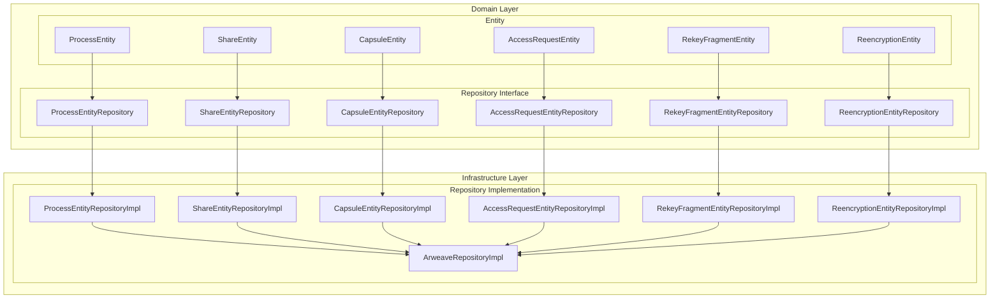
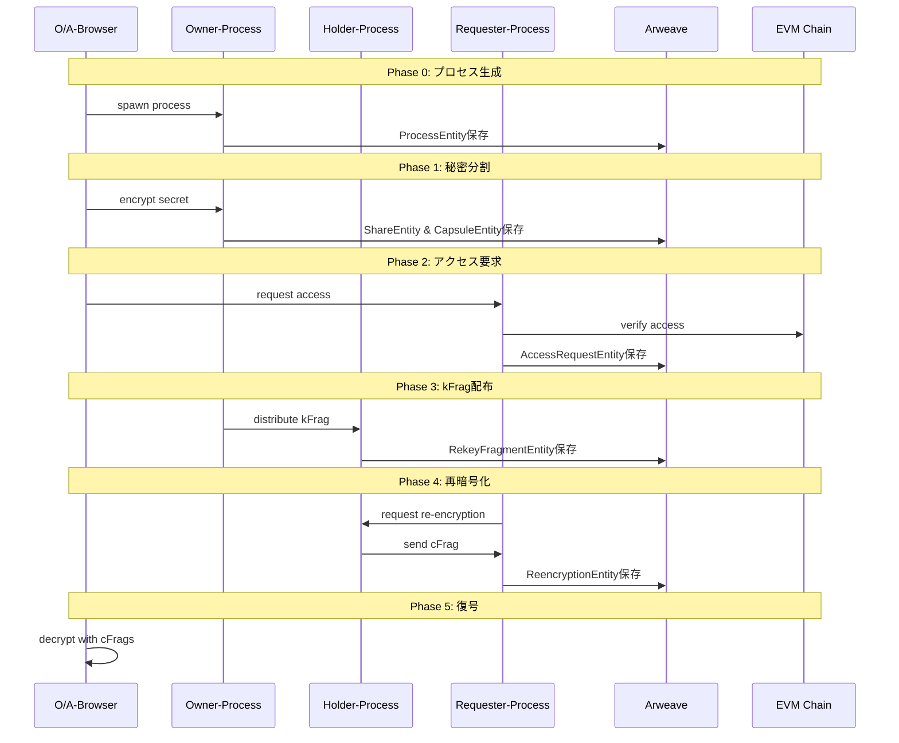
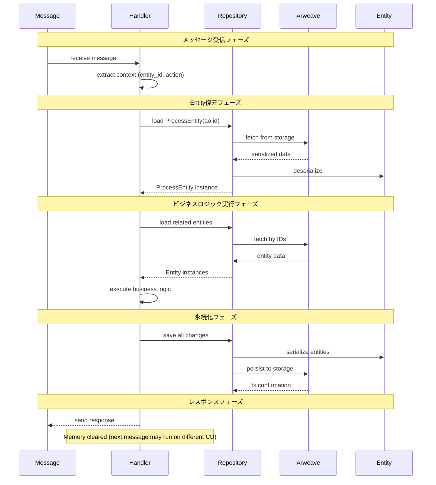

# D-TPRES Domain層アーキテクチャ概要

## 1. はじめに

本ドキュメントは、D-TPRES（Deterministic Threshold Proxy Re-Encryption System）のdomain層アーキテクチャ全体像を説明します。Entity/Repository interface/Infrastructure層の明確な責務分離により、保守性と拡張性を両立した設計を実現しています。

## 2. アーキテクチャ概要

### 2.1 層構造と責務分離



### 2.2 各層の責務

#### Entity層
- **責務**: ビジネスデータの純粋な保持
- **特徴**: 
  - メソッドを持たない純粋なデータ構造
  - ビジネスルールはServiceレイヤーで実装
  - シリアライズ/デシリアライズ可能
  - 不変性を重視した設計

#### Repository Interface層
- **責務**: データアクセス操作の抽象定義
- **特徴**:
  - CRUD操作に特化
  - ドメイン特化のクエリメソッド定義
  - 永続化詳細から独立
  - テスタビリティの確保

#### Infrastructure層（Repository Implementation）
- **責務**: 具体的な永続化実装
- **特徴**:
  - Arweaveストレージへの永続化
  - タグベースインデックス管理
  - 不変ストレージへの対応
  - エラーハンドリングとリトライ

### 2.3 AOステートレス実行モデルへの対応

AOプロセスは以下の特性を持つ実行環境で動作します：

#### 実行環境の特性
- **ステートレス実行**: 各メッセージは異なるCU（Compute Unit）で処理される可能性があり、メモリ状態は保持されない
- **メッセージドリブン**: すべての処理はメッセージハンドラーとして実装され、メッセージ受信がトリガーとなる
- **状態の非永続性**: メモリ上のEntityインスタンスは次回メッセージ処理時には存在しない

#### 設計上の対応

1. **ProcessEntityの管理**
   - 各メッセージ処理の開始時にArweaveから復元
   - プロセスのグローバル状態として扱い、メッセージ処理中は参照可能
   - 変更は即座にArweaveに永続化

2. **他Entityのライフサイクル**
   - 必要に応じてオンデマンドでロード（Lazy Loading）
   - メッセージコンテキストから必要なEntity IDを抽出
   - 処理完了後は明示的な永続化

3. **状態管理戦略**
   ```rust
   // メッセージハンドラーでの典型的なパターン
   async fn handle_message(msg: Message) -> Result<Response> {
       // 1. ProcessEntityを復元
       let process = repository.find_process_by_id(ao.id).await?;
       
       // 2. メッセージから必要なEntityをロード
       let entity = repository.find_by_id(msg.entity_id).await?;
       
       // 3. ビジネスロジック実行
       let updated_entity = business_logic(process, entity)?;
       
       // 4. 変更を即座に永続化
       repository.update(updated_entity).await?;
       
       // 5. レスポンス返却
       Ok(response)
   }
   ```

## 3. PRD準拠のワークフロー

### 3.1 Phase 0-5 概要



### 3.2 Phase別Entity利用

| Phase | 主要Entity | 目的 |
|-------|-----------|------|
| Phase 0 | ProcessEntity | プロセス生成とロール設定 |
| Phase 1 | ShareEntity, CapsuleEntity | 秘密分割とカプセル生成 |
| Phase 2 | AccessRequestEntity | アクセス要求とEVM検証 |
| Phase 3 | RekeyFragmentEntity | 再暗号化キー分割と配布 |
| Phase 4 | ReencryptionEntity | プロキシ再暗号化実行 |
| Phase 5 | 全Entity | 復号と秘密復元 |

## 4. AO Native設計の特徴

### 4.1 AO環境との統合

```rust
// AO環境のネイティブプロパティ
pub struct AOContext {
    pub process_id: String,      // ao.id
    pub environment: String,     // ao.env
    pub module_id: String,       // ao._module
    pub spawn_data: String,      // ao._spawn
}
```

### 4.2 メッセージベース通信

AOプロセス間の通信はメッセージパッシングで実現：
- 非同期メッセージング
- イベントドリブンアーキテクチャ
- 状態の一貫性保証

### 4.3 メッセージ処理ライフサイクル

AOのステートレス環境でのメッセージ処理とEntity/Repository操作の統合：



#### 重要な考慮事項

1. **トランザクション境界**
   - 1メッセージ処理 = 1トランザクション
   - 部分的な永続化は避け、全ての変更を一括で保存

2. **エラーハンドリング**
   - Entity復元失敗時の適切なエラーレスポンス
   - 永続化失敗時のロールバック戦略

3. **パフォーマンス最適化**
   - 必要最小限のEntityのみロード
   - バッチ読み込み・書き込みの活用

## 5. 普遍的プロセス設計

### 5.1 マルチロール対応

各プロセスは以下の3つのロールを同時に保持可能：

```rust
pub struct ProcessEntity {
    pub active_roles: Vec<String>, // ["owner", "holder", "requester"]
    pub owner_data: Option<OwnerData>,
    pub holder_data: Option<HolderData>,
    pub requester_data: Option<RequesterData>,
}
```

### 5.2 ロール別責務

#### Owner Role
- 秘密鍵（skO）の管理
- Shamir Secret Sharingによる分割
- 再暗号化キー（ReKey）の生成
- アクセス制御条件の設定

#### Holder Role  
- kFragの保持と管理
- プロキシ再暗号化の実行
- cFragの生成と提供
- 信頼性スコアの維持

#### Requester Role
- アクセス要求の発行
- EVM検証の調整
- cFragの収集
- 閾値達成の管理

## 6. データ永続化戦略

### 6.1 Arweave不変ストレージ

Arweaveの特性を活かした永続化：
- **不変性**: 一度保存したデータは変更不可
- **永続性**: データの永続保存保証
- **分散性**: 分散ネットワークによる可用性
- **検証可能性**: データの完全性検証

### 6.2 バージョニング戦略

```rust
// 更新は新しいトランザクションとして保存
pub struct VersionedEntity<T> {
    pub entity: T,
    pub version: u64,
    pub previous_tx_id: Option<String>,
    pub created_at: u64,
}
```

### 6.3 ステートレス環境での永続化パターン

#### ProcessEntityの特別な扱い

ProcessEntityはプロセスの「グローバル状態」として特別に管理：

```rust
// メッセージハンドラーの開始時に必ず実行
async fn initialize_handler_context() -> Result<HandlerContext> {
    let process_repo = ProcessEntityRepository::new();
    let process = process_repo.find_by_id(&ao.id)
        .await?
        .ok_or(Error::ProcessNotFound)?;
    
    Ok(HandlerContext {
        process,
        repositories: RepositoryContainer::new(),
    })
}
```

#### オンデマンドEntity管理

他のEntityは必要に応じてロード：

```rust
// 例: ShareEntityの遅延ロード
async fn handle_access_request(ctx: &HandlerContext, msg: Message) -> Result<()> {
    // メッセージから必要な情報を抽出
    let secret_id = msg.tags.get("Secret-Id")?;
    
    // 必要なShareEntityのみロード
    let shares = ctx.repositories.share_repo
        .find_by_secret_id(secret_id)
        .await?;
    
    // ビジネスロジック実行
    // ...
    
    // 変更があれば即座に永続化
    for share in modified_shares {
        ctx.repositories.share_repo.update(&share).await?;
    }
    
    Ok(())
}
```

#### 永続化の原則

1. **Write-Through**: キャッシュを介さず直接Arweaveに書き込み
2. **Immediate Persistence**: 状態変更は即座に永続化
3. **Atomic Operations**: 関連する変更は一括で永続化

## 7. 設計原則

### 7.1 SOLID原則の適用

1. **単一責任の原則（SRP）**
   - Entity: データ保持のみ
   - Repository: CRUD操作のみ
   - Implementation: 永続化詳細のみ

2. **開放閉鎖の原則（OCP）**
   - 新しいEntityの追加が容易
   - 既存コードの変更不要

3. **リスコフの置換原則（LSP）**
   - Repository実装は交換可能
   - テスト実装への置換が容易

4. **インターフェース分離の原則（ISP）**
   - 各Entityごとに専用Repository
   - 必要最小限のメソッド定義

5. **依存性逆転の原則（DIP）**
   - 上位層は抽象に依存
   - 実装詳細は下位層に隔離

### 7.2 Clean Architecture準拠

```
┌─────────────────────────────────────┐
│          Application Layer          │
│         (Service, UseCase)          │
├─────────────────────────────────────┤
│           Domain Layer              │
│    (Entity, Repository Interface)   │
├─────────────────────────────────────┤
│        Infrastructure Layer         │
│    (Repository Implementation)      │
└─────────────────────────────────────┘
```

## 8. 実装ガイドライン

### 8.1 Entity実装規約

```rust
// ✅ 正しい実装
#[derive(Debug, Clone, PartialEq, Serialize, Deserialize)]
pub struct SomeEntity {
    pub id: String,
    pub data: String,
    pub created_at: u64,
}

// ❌ 間違った実装（メソッドを含む）
impl SomeEntity {
    pub fn validate(&self) -> bool { // NG: Entityにメソッド
        // validation logic
    }
}
```

### 8.2 Repository実装規約

```rust
// Repository Interface
#[async_trait]
pub trait SomeEntityRepository: Repository<SomeEntity, String> {
    // CRUD操作とドメイン特化クエリのみ
    async fn find_by_condition(&self, condition: &str) 
        -> Result<Vec<SomeEntity>, Self::Error>;
}

// ❌ 間違った実装（ビジネスロジックを含む）
#[async_trait]
pub trait SomeEntityRepository {
    async fn validate_and_save(&self, entity: &SomeEntity) 
        -> Result<(), Self::Error>; // NG: ビジネスロジック
}
```

### 8.3 AOメッセージハンドラーでの利用パターン

#### 基本的なハンドラー構造

```rust
use ao_sdk::{Message, Response, ao};

// メッセージハンドラーの登録
pub fn register_handlers() {
    // Phase 1: 秘密分割ハンドラー
    Handlers::add("split-secret", 
        Handlers::utils::hasMatchingTag("Action", "Split-Secret"),
        handle_split_secret
    );
    
    // Phase 2: アクセス要求ハンドラー
    Handlers::add("access-request",
        Handlers::utils::hasMatchingTag("Action", "Access-Request"),
        handle_access_request
    );
}

// ハンドラー実装例
async fn handle_split_secret(msg: Message) -> Response {
    // 1. コンテキスト初期化（ProcessEntity復元）
    let ctx = match initialize_context().await {
        Ok(ctx) => ctx,
        Err(e) => return error_response(e),
    };
    
    // 2. 入力検証
    let secret_data = match extract_secret_data(&msg) {
        Ok(data) => data,
        Err(e) => return error_response(e),
    };
    
    // 3. ビジネスロジック実行
    let result = match split_secret_service(&ctx, secret_data).await {
        Ok(result) => result,
        Err(e) => return error_response(e),
    };
    
    // 4. 結果の永続化（Service内で実行済み）
    
    // 5. レスポンス生成
    success_response(result)
}
```

#### Repository利用のベストプラクティス

1. **Repository生成はハンドラー開始時に一度だけ**
   ```rust
   let repo_container = RepositoryContainer::new();
   ```

2. **必要なEntityのみロード**
   ```rust
   // ❌ 非効率
   let all_shares = share_repo.find_all().await?;
   
   // ✅ 効率的
   let shares = share_repo.find_by_secret_id(secret_id).await?;
   ```

3. **トランザクション的な更新**
   ```rust
   // 関連するEntityをまとめて更新
   let mut updates = Vec::new();
   updates.push(share_repo.update(&share));
   updates.push(capsule_repo.update(&capsule));
   
   // 全て成功するか、全て失敗する
   futures::try_join_all(updates).await?;
   ```

## 9. まとめ

D-TPRES domain層は以下の特徴を持つ設計となっています：

1. **明確な責務分離**: Entity/Repository Interface/Implementationの3層構造
2. **PRD準拠**: Phase 0-5のワークフローを正確に実装
3. **AO Native**: AOプロセスの特性を活かした設計
4. **普遍的設計**: 各プロセスがマルチロール対応
5. **Arweave最適化**: 不変ストレージの特性を活用
6. **ステートレス対応**: AOの実行モデルに適合した状態管理

この設計により、保守性、拡張性、テスタビリティを兼ね備えた堅牢なシステムを実現します。

### 重要な設計指針

- **Entity**: データ保持に特化し、ビジネスロジックを含まない
- **Repository**: CRUD操作とクエリに特化し、永続化の詳細を隠蔽
- **Handler**: AOメッセージを受信し、Repository経由でEntityを操作
- **Persistence**: すべての状態変更は即座にArweaveに永続化

これらの指針に従うことで、AOのステートレス実行環境でも一貫性のある状態管理が可能となります。

---

**Document Status**: Domain Architecture Specification  
**Version**: 1.0  
**Next Steps**: Entity詳細設計の実装（entities.md参照）