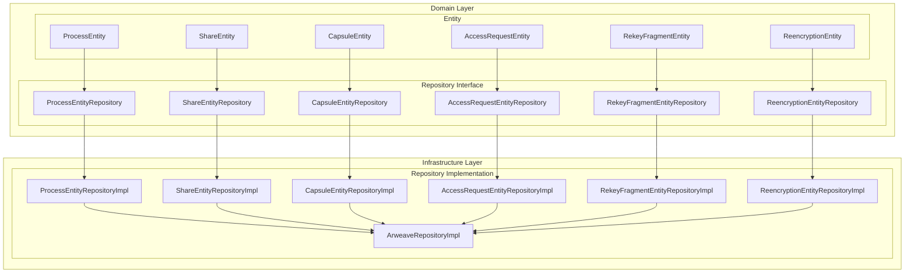
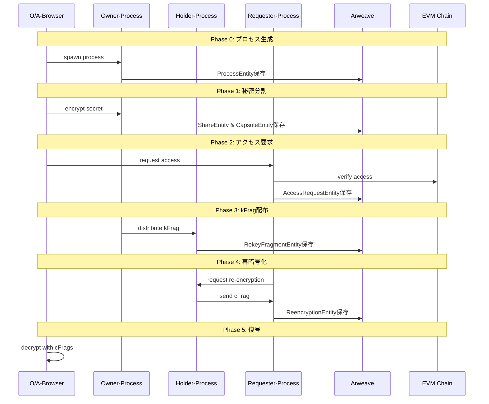

# D-TPRES Domain層アーキテクチャ概要

## 1. はじめに

本ドキュメントは、D-TPRES（Deterministic Threshold Proxy Re-Encryption System）のdomain層アーキテクチャ全体像を説明します。Entity/Repository interface/Infrastructure層の明確な責務分離により、保守性と拡張性を両立した設計を実現しています。

## 2. アーキテクチャ概要

### 2.1 層構造と責務分離



### 2.2 各層の責務

#### Entity層
- **責務**: ビジネスデータの純粋な保持
- **特徴**: 
  - メソッドを持たない純粋なデータ構造
  - ビジネスルールはServiceレイヤーで実装
  - シリアライズ/デシリアライズ可能
  - 不変性を重視した設計

#### Repository Interface層
- **責務**: データアクセス操作の抽象定義
- **特徴**:
  - CRUD操作に特化
  - ドメイン特化のクエリメソッド定義
  - 永続化詳細から独立
  - テスタビリティの確保

#### Infrastructure層（Repository Implementation）
- **責務**: 具体的な永続化実装
- **特徴**:
  - Arweaveストレージへの永続化
  - タグベースインデックス管理
  - 不変ストレージへの対応
  - エラーハンドリングとリトライ

## 3. PRD準拠のワークフロー

### 3.1 Phase 0-5 概要



### 3.2 Phase別Entity利用

| Phase | 主要Entity | 目的 |
|-------|-----------|------|
| Phase 0 | ProcessEntity | プロセス生成とロール設定 |
| Phase 1 | ShareEntity, CapsuleEntity | 秘密分割とカプセル生成 |
| Phase 2 | AccessRequestEntity | アクセス要求とEVM検証 |
| Phase 3 | RekeyFragmentEntity | 再暗号化キー分割と配布 |
| Phase 4 | ReencryptionEntity | プロキシ再暗号化実行 |
| Phase 5 | 全Entity | 復号と秘密復元 |

## 4. AO Native設計の特徴

### 4.1 AO環境との統合

```rust
// AO環境のネイティブプロパティ
pub struct AOContext {
    pub process_id: String,      // ao.id
    pub environment: String,     // ao.env
    pub module_id: String,       // ao._module
    pub spawn_data: String,      // ao._spawn
}
```

### 4.2 メッセージベース通信

AOプロセス間の通信はメッセージパッシングで実現：
- 非同期メッセージング
- イベントドリブンアーキテクチャ
- 状態の一貫性保証

## 5. 普遍的プロセス設計

### 5.1 マルチロール対応

各プロセスは以下の3つのロールを同時に保持可能：

```rust
pub struct ProcessEntity {
    pub active_roles: Vec<String>, // ["owner", "holder", "requester"]
    pub owner_data: Option<OwnerData>,
    pub holder_data: Option<HolderData>,
    pub requester_data: Option<RequesterData>,
}
```

### 5.2 ロール別責務

#### Owner Role
- 秘密鍵（skO）の管理
- Shamir Secret Sharingによる分割
- 再暗号化キー（ReKey）の生成
- アクセス制御条件の設定

#### Holder Role  
- kFragの保持と管理
- プロキシ再暗号化の実行
- cFragの生成と提供
- 信頼性スコアの維持

#### Requester Role
- アクセス要求の発行
- EVM検証の調整
- cFragの収集
- 閾値達成の管理

## 6. データ永続化戦略

### 6.1 Arweave不変ストレージ

Arweaveの特性を活かした永続化：
- **不変性**: 一度保存したデータは変更不可
- **永続性**: データの永続保存保証
- **分散性**: 分散ネットワークによる可用性
- **検証可能性**: データの完全性検証

### 6.2 バージョニング戦略

```rust
// 更新は新しいトランザクションとして保存
pub struct VersionedEntity<T> {
    pub entity: T,
    pub version: u64,
    pub previous_tx_id: Option<String>,
    pub created_at: u64,
}
```

## 7. 設計原則

### 7.1 SOLID原則の適用

1. **単一責任の原則（SRP）**
   - Entity: データ保持のみ
   - Repository: CRUD操作のみ
   - Implementation: 永続化詳細のみ

2. **開放閉鎖の原則（OCP）**
   - 新しいEntityの追加が容易
   - 既存コードの変更不要

3. **リスコフの置換原則（LSP）**
   - Repository実装は交換可能
   - テスト実装への置換が容易

4. **インターフェース分離の原則（ISP）**
   - 各Entityごとに専用Repository
   - 必要最小限のメソッド定義

5. **依存性逆転の原則（DIP）**
   - 上位層は抽象に依存
   - 実装詳細は下位層に隔離

### 7.2 Clean Architecture準拠

```
┌─────────────────────────────────────┐
│          Application Layer          │
│         (Service, UseCase)          │
├─────────────────────────────────────┤
│           Domain Layer              │
│    (Entity, Repository Interface)   │
├─────────────────────────────────────┤
│        Infrastructure Layer         │
│    (Repository Implementation)      │
└─────────────────────────────────────┘
```

## 8. 実装ガイドライン

### 8.1 Entity実装規約

```rust
// ✅ 正しい実装
#[derive(Debug, Clone, PartialEq, Serialize, Deserialize)]
pub struct SomeEntity {
    pub id: String,
    pub data: String,
    pub created_at: u64,
}

// ❌ 間違った実装（メソッドを含む）
impl SomeEntity {
    pub fn validate(&self) -> bool { // NG: Entityにメソッド
        // validation logic
    }
}
```

### 8.2 Repository実装規約

```rust
// Repository Interface
#[async_trait]
pub trait SomeEntityRepository: Repository<SomeEntity, String> {
    // CRUD操作とドメイン特化クエリのみ
    async fn find_by_condition(&self, condition: &str) 
        -> Result<Vec<SomeEntity>, Self::Error>;
}

// ❌ 間違った実装（ビジネスロジックを含む）
#[async_trait]
pub trait SomeEntityRepository {
    async fn validate_and_save(&self, entity: &SomeEntity) 
        -> Result<(), Self::Error>; // NG: ビジネスロジック
}
```

## 9. まとめ

D-TPRES domain層は以下の特徴を持つ設計となっています：

1. **明確な責務分離**: Entity/Repository Interface/Implementationの3層構造
2. **PRD準拠**: Phase 0-5のワークフローを正確に実装
3. **AO Native**: AOプロセスの特性を活かした設計
4. **普遍的設計**: 各プロセスがマルチロール対応
5. **Arweave最適化**: 不変ストレージの特性を活用

この設計により、保守性、拡張性、テスタビリティを兼ね備えた堅牢なシステムを実現します。

---

**Document Status**: Domain Architecture Specification  
**Version**: 1.0  
**Next Steps**: Entity詳細設計の実装（entities.md参照）