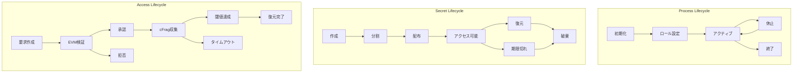
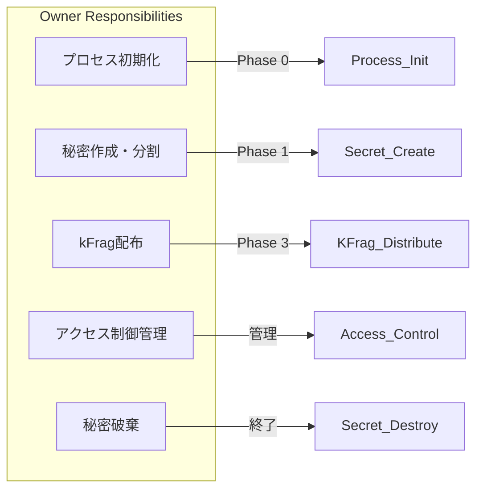
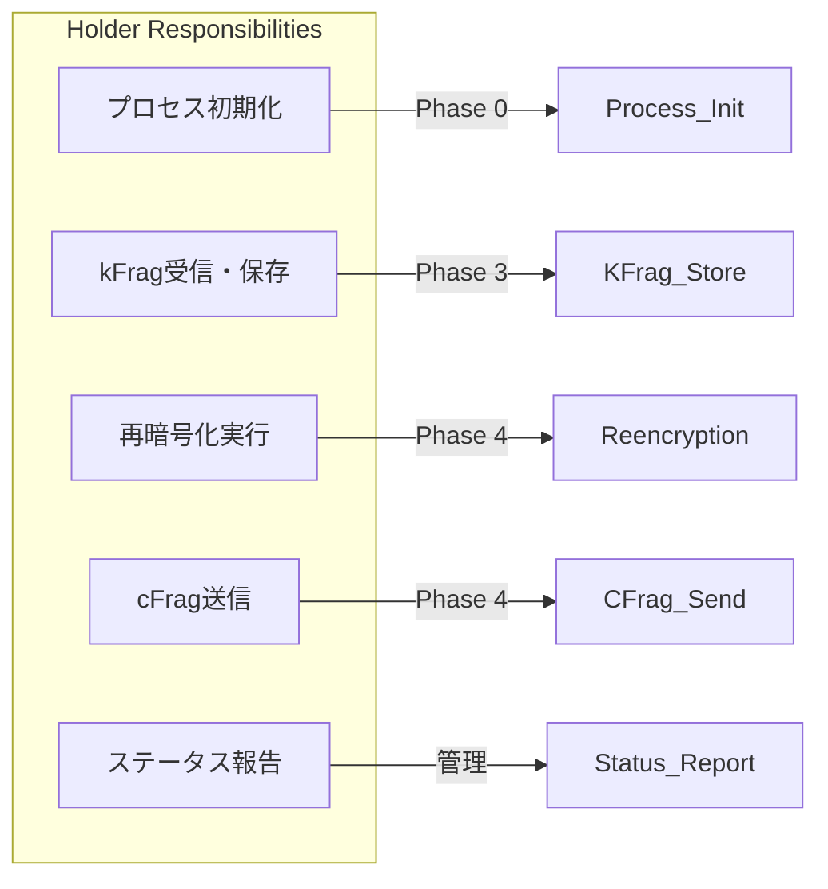
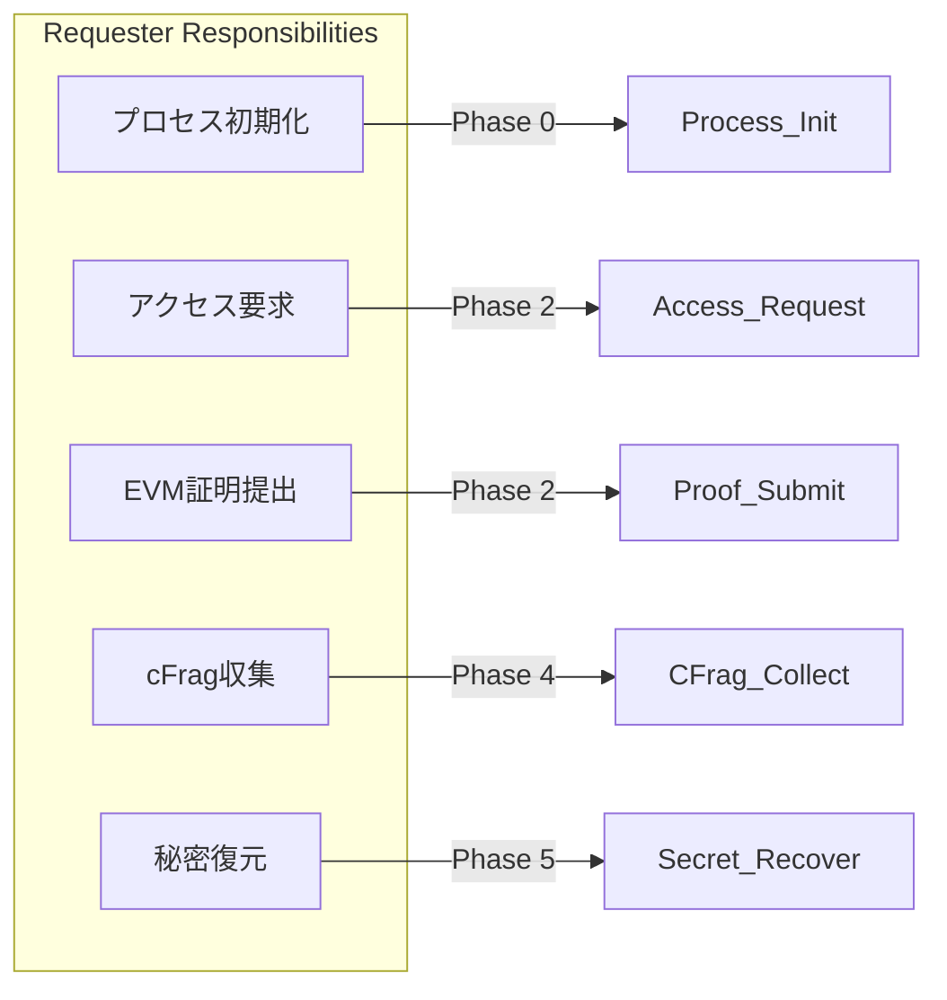

# D-TPRES ライフサイクル概要

## 1. はじめに

本ドキュメントは、D-TPRES（Deterministic Threshold Proxy Re-Encryption System）における各種ライフサイクルの全体像を説明します。システムの主要な構成要素である「プロセス」「秘密データ」「アクセス要求」のライフサイクルを体系的に定義し、各フェーズにおける責務と遷移条件を明確にします。

### 1.1 ライフサイクル管理の重要性

D-TPRESは分散型の暗号化システムであり、以下の理由からライフサイクル管理が重要です：

1. **セキュリティ保証**: 各フェーズで適切なセキュリティ制御を実施
2. **状態整合性**: 分散環境での状態の一貫性を保証
3. **監査可能性**: すべての遷移が追跡可能
4. **エラー処理**: 各フェーズでの適切なエラーハンドリング

## 2. システム全体のライフサイクル

### 2.1 主要なライフサイクル



### 2.2 ライフサイクル間の相互作用

各ライフサイクルは独立して管理されますが、以下の相互作用があります：

1. **プロセス → 秘密**: Ownerプロセスのみが秘密を作成可能
2. **プロセス → アクセス**: Requesterプロセスのみがアクセス要求を作成
3. **秘密 → アクセス**: アクセス可能状態の秘密のみが要求対象
4. **アクセス → プロセス**: Holderプロセスが再暗号化を実行

## 3. フェーズ定義と遷移マトリクス

### 3.1 プロセスライフサイクルのフェーズ

| フェーズ | 説明 | 許可される操作 | 次の遷移先 |
|---------|------|--------------|-----------|
| **Uninitialized** | プロセス生成直後 | Initialize-Process | Initialized |
| **Initialized** | ロール未設定 | Set-Role | Active |
| **Active** | 通常稼働中 | ロール固有の全操作 | Suspended, Terminated |
| **Suspended** | 一時停止 | Resume, Get-Status | Active, Terminated |
| **Terminated** | 終了済み | なし | なし |

### 3.2 秘密ライフサイクルのフェーズ

| フェーズ | 説明 | 許可される操作 | 次の遷移先 |
|---------|------|--------------|-----------|
| **Created** | 秘密作成直後 | Split-Secret | Splitting |
| **Splitting** | 分割処理中 | なし | Distributed |
| **Distributed** | kFrag配布済み | Access-Request | Accessible |
| **Accessible** | アクセス可能 | Request-Reencryption | Recovering |
| **Recovering** | 復元処理中 | Recover-Secret | Recovered |
| **Recovered** | 復元完了 | Delete-Secret | Destroyed |
| **Expired** | 有効期限切れ | Delete-Secret | Destroyed |
| **Destroyed** | 破棄済み | なし | なし |

### 3.3 アクセスライフサイクルのフェーズ

| フェーズ | 説明 | 許可される操作 | 次の遷移先 |
|---------|------|--------------|-----------|
| **Requested** | 要求作成 | Submit-Proof | Verifying |
| **Verifying** | EVM検証中 | なし | Approved, Rejected |
| **Approved** | 承認済み | Request-Reencryption | Collecting |
| **Collecting** | cFrag収集中 | Collect-CFrag | ThresholdMet, Timeout |
| **ThresholdMet** | 閾値達成 | Recover-Secret | Completed |
| **Completed** | 完了 | なし | なし |
| **Rejected** | 拒否 | なし | なし |
| **Timeout** | タイムアウト | Retry-Request | Collecting, Failed |
| **Failed** | 失敗 | なし | なし |

## 4. ロール別の責務マッピング

### 4.1 Owner Role



### 4.2 Holder Role



### 4.3 Requester Role



## 5. 状態遷移の制御

### 5.1 遷移条件の検証

```rust
/// 状態遷移の妥当性検証
pub trait StateTransition {
    type State;
    type Event;
    
    /// 現在の状態から指定されたイベントによる遷移が可能か
    fn can_transition(&self, from: Self::State, event: Self::Event) -> bool;
    
    /// 遷移を実行し、新しい状態を返す
    fn transition(&self, from: Self::State, event: Self::Event) -> Result<Self::State, TransitionError>;
    
    /// 遷移の前提条件をチェック
    fn check_preconditions(&self, state: &Self::State, event: &Self::Event) -> Result<(), PreconditionError>;
}
```

### 5.2 トランザクション管理

各状態遷移は原子性を保証する必要があります：

1. **開始前チェック**: 前提条件の検証
2. **遷移実行**: 状態の更新
3. **永続化**: Arweaveへの保存
4. **通知**: 関連プロセスへの通知
5. **ロールバック**: エラー時の状態復元

## 6. エラー処理とリカバリー

### 6.1 エラー分類と対処

| エラー種別 | 説明 | リカバリー戦略 |
|-----------|------|--------------|
| **InvalidTransition** | 無効な状態遷移 | 遷移を拒否、現在状態を維持 |
| **PreconditionFailed** | 前提条件違反 | 条件を満たすまで待機 |
| **ConcurrentModification** | 並行更新競合 | 楽観的ロックとリトライ |
| **PersistenceError** | 永続化失敗 | 指数バックオフでリトライ |

### 6.2 補償トランザクション

```rust
/// 補償可能な操作
pub trait CompensatableOperation {
    /// 操作の実行
    async fn execute(&self) -> Result<OperationResult, OperationError>;
    
    /// 操作の取り消し（補償）
    async fn compensate(&self, result: &OperationResult) -> Result<(), CompensationError>;
    
    /// 操作が補償可能かどうか
    fn is_compensatable(&self) -> bool;
}
```

## 7. 監査とコンプライアンス

### 7.1 監査ポイント

各ライフサイクルの重要な遷移ポイントで監査ログを記録：

1. **状態遷移**: すべての状態変更を記録
2. **権限確認**: ロールベースのアクセス制御
3. **エラー発生**: エラーと対処の記録
4. **パフォーマンス**: 処理時間とリソース使用

### 7.2 監査ログ構造

```rust
#[derive(Debug, Serialize)]
pub struct AuditLog {
    pub timestamp: SystemTime,
    pub lifecycle: LifecycleType,
    pub entity_id: String,
    pub from_state: String,
    pub to_state: String,
    pub event: String,
    pub actor: ProcessId,
    pub metadata: HashMap<String, String>,
    pub result: TransitionResult,
}

#[derive(Debug, Serialize)]
pub enum TransitionResult {
    Success,
    Failed { reason: String },
    Compensated { original_error: String },
}
```

## 8. パフォーマンス考慮事項

### 8.1 状態管理の最適化

1. **キャッシング**: 頻繁にアクセスされる状態をメモリに保持
2. **バッチ処理**: 複数の状態更新をまとめて永続化
3. **非同期処理**: 通知や監査ログを非同期で処理
4. **インデックス**: 状態検索用のインデックス管理

### 8.2 スケーラビリティ

```rust
/// スケーラブルな状態管理
pub struct ScalableStateManager {
    /// 状態のパーティショニング
    partitions: HashMap<PartitionKey, StatePartition>,
    
    /// 読み取りレプリカ
    read_replicas: Vec<StateReplica>,
    
    /// 書き込みキュー
    write_queue: AsyncQueue<StateUpdate>,
}
```

## 9. セキュリティ設計

### 9.1 アクセス制御

各ライフサイクルフェーズで適切なアクセス制御を実施：

1. **ロールベース**: 各操作は特定のロールのみ実行可能
2. **状態ベース**: 現在の状態に応じて許可される操作を制限
3. **時間ベース**: タイムアウトと有効期限の管理
4. **暗号学的検証**: 署名と証明による認証

### 9.2 攻撃シナリオと対策

| 攻撃シナリオ | 対策 |
|-------------|------|
| 不正な状態遷移 | 状態遷移マトリクスによる検証 |
| リプレイ攻撃 | ナンスとタイムスタンプ検証 |
| 並行性攻撃 | 楽観的ロックとCAS操作 |
| DoS攻撃 | Rate Limitingとリソース制限 |

## 10. 実装ガイドライン

### 10.1 ライフサイクル実装のベストプラクティス

1. **明示的な状態定義**: Enumで状態を定義
2. **イミュータブル**: 状態オブジェクトは不変
3. **イベントソーシング**: 状態変更をイベントとして記録
4. **テスタビリティ**: 各遷移を単体テスト可能に

### 10.2 コード例

```rust
/// プロセスライフサイクルの実装例
#[derive(Debug, Clone, PartialEq)]
pub enum ProcessState {
    Uninitialized,
    Initialized { role: Option<ProcessRole> },
    Active { role: ProcessRole, since: SystemTime },
    Suspended { reason: String, since: SystemTime },
    Terminated { reason: String, at: SystemTime },
}

impl StateTransition for ProcessLifecycle {
    type State = ProcessState;
    type Event = ProcessEvent;
    
    fn can_transition(&self, from: Self::State, event: Self::Event) -> bool {
        match (from, event) {
            (ProcessState::Uninitialized, ProcessEvent::Initialize) => true,
            (ProcessState::Initialized { .. }, ProcessEvent::SetRole(_)) => true,
            (ProcessState::Active { .. }, ProcessEvent::Suspend(_)) => true,
            (ProcessState::Active { .. }, ProcessEvent::Terminate(_)) => true,
            (ProcessState::Suspended { .. }, ProcessEvent::Resume) => true,
            (ProcessState::Suspended { .. }, ProcessEvent::Terminate(_)) => true,
            _ => false,
        }
    }
}
```

## まとめ

D-TPRESのライフサイクル管理は、システムの信頼性とセキュリティを確保する上で重要な役割を果たします。明確に定義されたフェーズと遷移条件により、分散環境でも一貫性のある動作を保証し、監査可能性を提供します。

### 関連ドキュメント

- [プロセスライフサイクル詳細](./process_lifecycle.md)
- [秘密データライフサイクル詳細](./secret_lifecycle.md)
- [アクセス要求ライフサイクル詳細](./access_lifecycle.md)

---

**Document Status**: Lifecycle Overview Specification  
**Version**: 1.0  
**Last Updated**: 2025-01-09