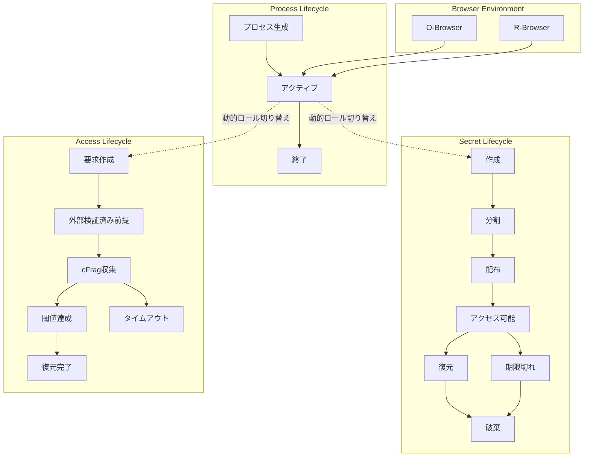
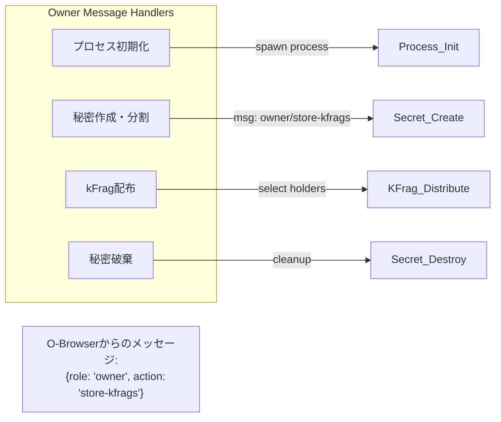
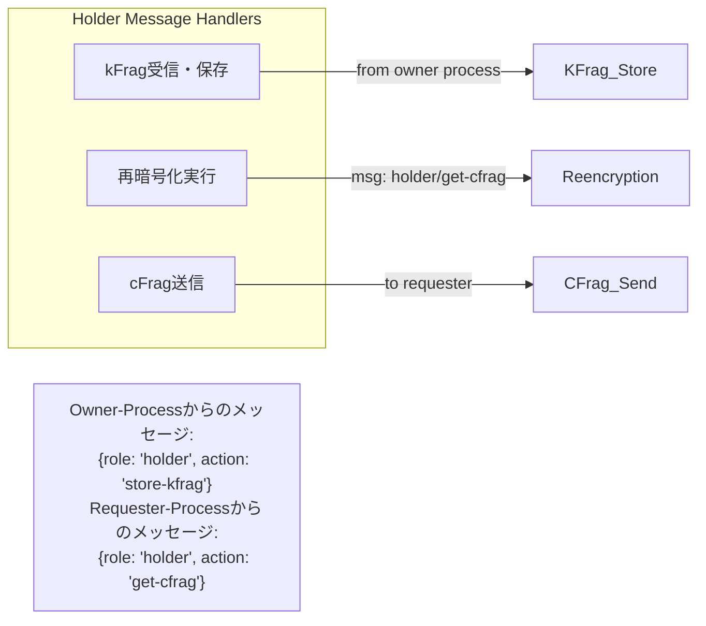
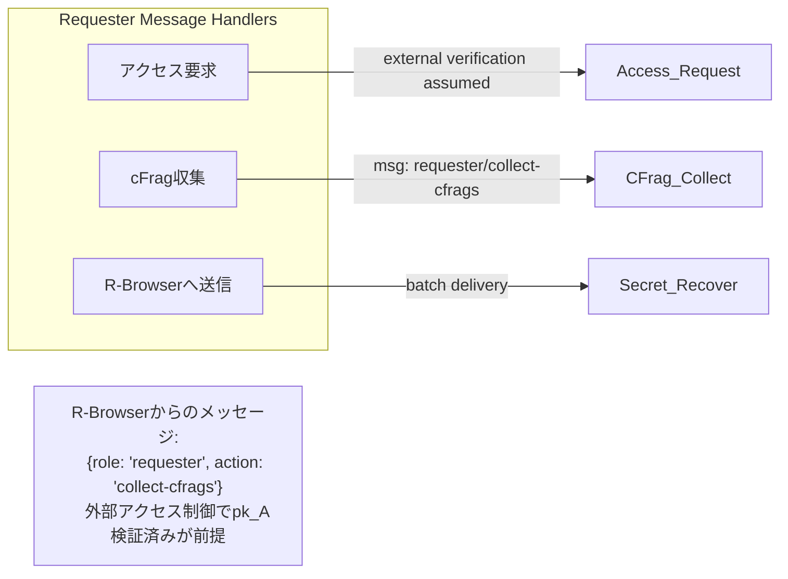

# D-TPRES ライフサイクル概要

## 1. はじめに

本ドキュメントは、D-TPRES（Deterministic Threshold Proxy Re-Encryption System）における各種ライフサイクルの全体像を説明します。システムの主要な構成要素である「プロセス」「秘密データ」「アクセス要求」のライフサイクルを体系的に定義し、各フェーズにおける責務と遷移条件を明確にします。

### 1.1 ライフサイクル管理の重要性

D-TPRESは分散型の暗号化システムであり、以下の理由からライフサイクル管理が重要です：

1. **セキュリティ保証**: 各フェーズで適切なセキュリティ制御を実施
2. **状態整合性**: 分散環境での状態の一貫性を保証
3. **監査可能性**: すべての遷移が追跡可能
4. **エラー処理**: 各フェーズでの適切なエラーハンドリング

## 2. システム全体のライフサイクル

### 2.1 主要なライフサイクル



### 2.2 ライフサイクル間の相互作用

各ライフサイクルは独立して管理されますが、以下の相互作用があります：

1. **ブラウザ → プロセス**: O-BrowserまたはR-Browserがプロセスを初期化・利用
2. **プロセス → 秘密**: メッセージでOwnerロールを指定して秘密を作成
3. **プロセス → アクセス**: メッセージでRequesterロールを指定してアクセス要求
4. **秘密 → アクセス**: アクセス可能状態の秘密のみが要求対象
5. **アクセス → プロセス**: メッセージでHolderロールを指定して再暗号化を実行

## 3. フェーズ定義と遷移マトリクス

### 3.1 プロセスライフサイクルのフェーズ

| フェーズ | 説明 | 許可される操作 | 次の遷移先 |
|---------|------|--------------|-----------|
| **Spawned** | プロセス生成後 | Initialize-Process | Active |
| **Active** | 通常稼働中 | メッセージベースの全ロール操作 | Terminated |
| **Terminated** | 終了済み | なし | なし |

### 3.2 秘密ライフサイクルのフェーズ

| フェーズ | 説明 | 許可される操作 | 次の遷移先 |
|---------|------|--------------|-----------|
| **Created** | 秘密作成直後 | Split-Secret | Splitting |
| **Splitting** | 分割処理中 | なし | Distributed |
| **Distributed** | kFrag配布済み | Access-Request | Accessible |
| **Accessible** | アクセス可能 | Request-Reencryption | Recovering |
| **Recovering** | 復元処理中 | Recover-Secret | Recovered |
| **Recovered** | 復元完了 | Delete-Secret | Destroyed |
| **Expired** | 有効期限切れ | Delete-Secret | Destroyed |
| **Destroyed** | 破棄済み | なし | なし |

### 3.3 アクセスライフサイクルのフェーズ

| フェーズ | 説明 | 許可される操作 | 次の遷移先 |
|---------|------|--------------|-----------|
| **Requested** | 要求作成 | 外部アクセス制御で検証済み前提 | Collecting |
| **Collecting** | cFrag収集中 | Collect-CFrag | ThresholdMet, Timeout |
| **ThresholdMet** | 閾値達成 | Recover-Secret | Completed |
| **Completed** | 完了 | なし | なし |
| **Timeout** | タイムアウト | Retry-Request | Collecting, Failed |
| **Failed** | 失敗 | なし | なし |

## 4. ロール別の責務マッピング

### 4.1 Owner Role (メッセージベース)



### 4.2 Holder Role (メッセージベース)



### 4.3 Requester Role (メッセージベース)



## 5. 状態遷移の制御

### 5.1 メッセージベースの状態管理

```rust
/// メッセージハンドラーベースのシンプルな状態管理
pub trait MessageHandler {
    type Message;
    type Response;

    /// メッセージが現在の状態で処理可能か
    fn can_handle(&self, state: &ProcessState, msg: &Self::Message) -> bool;

    /// メッセージを処理し、状態を更新
    fn handle(&self, state: &mut ProcessState, msg: Self::Message) -> Result<Self::Response, HandlerError>;
}

/// 簡素化されたプロセス状態
#[derive(Debug, Clone)]
pub enum ProcessState {
    Spawned,
    Active { current_role: Option<ProcessRole> },
    Terminated,
}
```

### 5.2 AOステートレス実行での状態管理

AOネットワークのステートレス実行環境での状態管理パターン：

1. **状態ロード**: メッセージ処理開始時にArweaveから状態を読み込み
2. **メッセージ処理**: ハンドラーで状態を更新
3. **状態保存**: 更新された状態をArweaveに永続化
4. **メッセージ送信**: 必要に応じて他プロセスにメッセージ送信

メモリはメッセージ間で持続しないため、全ての状態はArweaveに保存される必要があります。

## 6. エラー処理とリカバリー

### 6.1 エラー分類と対処

| エラー種別 | 説明 | リカバリー戦略 |
|-----------|------|--------------|
| **InvalidTransition** | 無効な状態遷移 | 遷移を拒否、現在状態を維持 |
| **PreconditionFailed** | 前提条件違反 | 条件を満たすまで待機 |
| **ConcurrentModification** | 並行更新競合 | 楽観的ロックとリトライ |
| **PersistenceError** | 永続化失敗 | 指数バックオフでリトライ |

### 6.2 補償トランザクション

```rust
/// 補償可能な操作
pub trait CompensatableOperation {
    /// 操作の実行
    async fn execute(&self) -> Result<OperationResult, OperationError>;
    
    /// 操作の取り消し（補償）
    async fn compensate(&self, result: &OperationResult) -> Result<(), CompensationError>;
    
    /// 操作が補償可能かどうか
    fn is_compensatable(&self) -> bool;
}
```

## 7. 監査とコンプライアンス

### 7.1 D-TPRES内部監査ポイント

D-TPRESライブラリ内で記録すべき監査ポイント：

1. **メッセージ処理**: 各メッセージハンドラーの実行記録
2. **暗号化操作**: 秘密分割、再暗号化、復元の記録
3. **エラー発生**: ライブラリ内エラーと対処の記録
4. **パフォーマンス**: 暗号化処理時間とメモリ使用

外部アクセス制御や権限管理の監査は外部システムの責任です。

### 7.2 D-TPRES監査ログ構造

```rust
#[derive(Debug, Serialize)]
pub struct DtpresAuditLog {
    pub timestamp: SystemTime,
    pub process_id: ProcessId,
    pub message_type: MessageType,
    pub role: ProcessRole,
    pub operation: CryptoOperation,
    pub result: OperationResult,
    pub performance_metrics: Option<PerformanceMetrics>,
}

#[derive(Debug, Serialize)]
pub enum CryptoOperation {
    SecretSplit { threshold: u32, shares: u32 },
    KFragGeneration { count: u32 },
    ReEncryption { kfrag_id: String },
    SecretRecovery { shares_used: u32 },
}

#[derive(Debug, Serialize)]
pub enum OperationResult {
    Success,
    Failed { error_code: String, message: String },
}
```

## 8. パフォーマンス考慮事項

### 8.1 状態管理の最適化

1. **キャッシング**: 頻繁にアクセスされる状態をメモリに保持
2. **バッチ処理**: 複数の状態更新をまとめて永続化
3. **非同期処理**: 通知や監査ログを非同期で処理
4. **インデックス**: 状態検索用のインデックス管理

### 8.2 スケーラビリティ

```rust
/// スケーラブルな状態管理
pub struct ScalableStateManager {
    /// 状態のパーティショニング
    partitions: HashMap<PartitionKey, StatePartition>,
    
    /// 読み取りレプリカ
    read_replicas: Vec<StateReplica>,
    
    /// 書き込みキュー
    write_queue: AsyncQueue<StateUpdate>,
}
```

## 9. セキュリティ設計

### 9.1 D-TPRES内部アクセス制御

D-TPRESライブラリ内でのアクセス制御要素：

1. **メッセージベースロール**: メッセージで指定されたロールに応じたハンドラー実行
2. **状態ベース**: プロセスの現在状態に応じた操作許可
3. **暗号学的検証**: umbral-preでの署名検証、Shamirシェアの整合性確認
4. **外部アクセス制御**: pk_Aの検証は外部システムが完了したという前提

### 9.2 D-TPRES特有の攻撃シナリオと対策

| 攻撃シナリオ | D-TPRES内対策 | 外部システム責任 |
|-------------|---------------|------------------|
| 不正なメッセージハンドリング | メッセージ形式検証、ロール権限チェック | - |
| 暗号学的攻撃 | umbral-preの安全性、定数時間実装 | - |
| メモリ露出 | zeroize実装、秘密鍵の即座クリア | - |
| 不正アクセス要求 | - | 外部アクセス制御システムでpk_A検証 |
| Sybil攻撃 | - | RandAO選択、将来的にStaking要件 |

## 10. 実装ガイドライン

### 10.1 ライフサイクル実装のベストプラクティス

1. **明示的な状態定義**: Enumで状態を定義
2. **イミュータブル**: 状態オブジェクトは不変
3. **イベントソーシング**: 状態変更をイベントとして記録
4. **テスタビリティ**: 各遷移を単体テスト可能に

### 10.2 簡素化されたコード例

```rust
/// 簡素化されたD-TPRESプロセス状態
#[derive(Debug, Clone, PartialEq)]
pub enum ProcessState {
    Spawned,
    Active { process_id: ProcessId },
    Terminated,
}

/// メッセージハンドラーの実装例
impl MessageHandler for DtpresProcess {
    type Message = AOMessage;
    type Response = AOResponse;

    fn can_handle(&self, state: &ProcessState, msg: &Self::Message) -> bool {
        match state {
            ProcessState::Active { .. } => true,
            ProcessState::Spawned => matches!(msg.action.as_str(), "initialize"),
            ProcessState::Terminated => false,
        }
    }

    fn handle(&self, state: &mut ProcessState, msg: Self::Message) -> Result<Self::Response, HandlerError> {
        match (state, msg.role.as_str(), msg.action.as_str()) {
            (ProcessState::Active { .. }, "owner", "store-kfrags") => self.handle_owner_store_kfrags(msg),
            (ProcessState::Active { .. }, "holder", "get-cfrag") => self.handle_holder_get_cfrag(msg),
            (ProcessState::Active { .. }, "requester", "collect-cfrags") => self.handle_requester_collect_cfrags(msg),
            _ => Err(HandlerError::UnsupportedOperation),
        }
    }
}
```

## まとめ

D-TPRESのライフサイクル管理は、PRD.mdの更新に合わせて簡素化され、純粋な暗号学的秘密管理ライブラリとしての位置づけが明確になりました。メッセージベースの動的ロール切り替え、AOステートレス実行環境への対応、および外部アクセス制御との明確な責任分界により、実装とメンテナンスが容易なシステムとなっています。

主な変更点：
- **ブラウザコンポーネントの明確化**: O-BrowserとR-Browserの役割分担
- **プロセス状態の簡素化**: Spawned → Active → Terminatedのシンプルなフロー
- **動的ロール切り替え**: メッセージごとにロールを指定
- **外部アクセス制御の前提化**: EVM検証を外部システムの責任に

### 関連ドキュメント

- [プロセスライフサイクル詳細](./process_lifecycle.md)
- [秘密データライフサイクル詳細](./secret_lifecycle.md)
- [アクセス要求ライフサイクル詳細](./access_lifecycle.md)

---

**Document Status**: Lifecycle Overview Specification  
**Version**: 1.0  
**Last Updated**: 2025-01-09