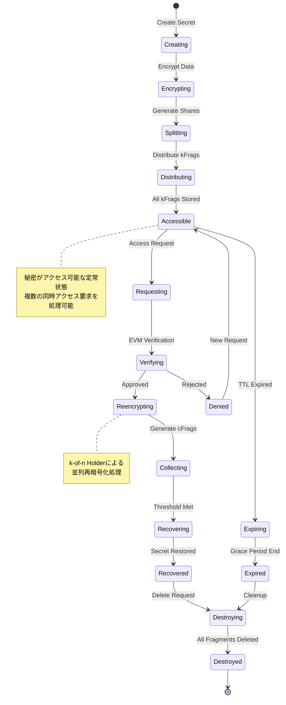

# D-TPRES 秘密データライフサイクル詳細

## 1. はじめに

本ドキュメントは、D-TPRESシステムにおける秘密データのライフサイクルを詳細に定義します。秘密の作成から破棄までの全フェーズ、各フェーズでの暗号学的処理、アクセス制御、監査要件について説明します。

### 1.1 秘密データの重要性

D-TPRESにおける秘密データは、システムの中核となる保護対象です：

- **機密性**: Threshold Proxy Re-Encryptionによる保護
- **可用性**: k-of-n閾値による分散管理
- **完全性**: 暗号学的検証による改ざん防止
- **追跡可能性**: 全操作の監査ログ

## 2. 秘密データライフサイクル全体像

### 2.1 状態遷移図



### 2.2 フェーズ定義

| フェーズ | 状態 | 説明 | 責任ロール |
|---------|------|------|-----------|
| **Phase 1** | Creating | 秘密データの作成開始 | Owner |
| **Phase 1** | Encrypting | Umbralによる暗号化 | Owner |
| **Phase 1** | Splitting | Shamir Secret Sharingによる分割 | Owner |
| **Phase 3** | Distributing | kFragの配布 | Owner → Holders |
| **Phase 2-5** | Accessible | アクセス可能な定常状態 | All |
| **Phase 2** | Requesting | アクセス要求の作成 | Requester |
| **Phase 2** | Verifying | スマートコントラクト検証 | System |
| **Phase 4** | Reencrypting | プロキシ再暗号化 | Holders |
| **Phase 4** | Collecting | cFragの収集 | Requester |
| **Phase 5** | Recovering | 秘密の復元処理 | Requester |
| **Phase 5** | Recovered | 復元完了 | Requester |
| **管理** | Expiring | 有効期限切れ処理中 | System |
| **管理** | Expired | 有効期限切れ | System |
| **管理** | Denied | アクセス拒否 | System |
| **終了** | Destroying | 破棄処理中 | Owner/System |
| **終了** | Destroyed | 破棄完了 | System |

## 3. Phase 1: 秘密の作成と分割

### 3.1 Create Secret

```rust
/// 秘密作成の初期化
pub async fn initialize_secret_creation(
    owner_id: &ProcessId,
    secret_params: SecretCreationParams,
) -> Result<SecretId, CreationError> {
    // Ownerロールの検証
    let owner_process = verify_owner_role(owner_id).await?;
    
    // 秘密IDの生成
    let secret_id = SecretId::generate();
    
    // 初期メタデータの作成
    let metadata = SecretMetadata {
        secret_id: secret_id.clone(),
        owner_id: owner_id.clone(),
        created_at: SystemTime::now(),
        threshold_k: secret_params.threshold_k,
        threshold_n: secret_params.threshold_n,
        access_conditions: secret_params.access_conditions,
        expiration: secret_params.expiration,
        state: SecretState::Creating,
    };
    
    // メタデータの永続化
    save_secret_metadata(&metadata).await?;
    
    Ok(secret_id)
}
```

### 3.2 Encrypt Data

```rust
/// Umbral暗号化の実行
pub async fn encrypt_secret_data(
    secret_id: &SecretId,
    plaintext: &[u8],
    owner_public_key: &PublicKey,
) -> Result<EncryptionResult, EncryptionError> {
    // 状態確認
    verify_secret_state(secret_id, SecretState::Creating).await?;
    update_secret_state(secret_id, SecretState::Encrypting).await?;
    
    // Umbral暗号化
    let (ciphertext, capsule) = umbral_encrypt(plaintext, owner_public_key)?;
    
    // 暗号化結果の構造体
    let result = EncryptionResult {
        secret_id: secret_id.clone(),
        ciphertext,
        capsule: capsule.clone(),
        ciphertext_hash: compute_hash(&ciphertext),
        encryption_timestamp: SystemTime::now(),
    };
    
    // カプセルの永続化
    let capsule_entity = CapsuleEntity {
        capsule_id: generate_capsule_id(&capsule),
        secret_id: secret_id.clone(),
        capsule_data: serialize_capsule(&capsule)?,
        verifying_key: derive_verifying_key(owner_public_key),
        created_at: SystemTime::now(),
    };
    
    save_capsule_entity(&capsule_entity).await?;
    
    Ok(result)
}
```

### 3.3 Split Secret

```rust
/// Shamir Secret Sharingによる秘密分割
pub async fn split_secret(
    secret_id: &SecretId,
    secret_key: &SecretKey,
    threshold_k: u8,
    threshold_n: u8,
) -> Result<SplitResult, SplitError> {
    // パラメータ検証
    validate_threshold_params(threshold_k, threshold_n)?;
    
    // 状態更新
    update_secret_state(secret_id, SecretState::Splitting).await?;
    
    // Shamir's Secret Sharing
    let shares = shamir_split(secret_key, threshold_k, threshold_n)?;
    
    // 各シェアのエンティティ作成
    let mut share_entities = Vec::new();
    for (index, share) in shares.iter().enumerate() {
        let share_entity = ShareEntity {
            share_id: generate_share_id(secret_id, index),
            secret_id: secret_id.clone(),
            share_index: index as u8,
            encrypted_share: encrypt_share(share, &get_system_key()).await?,
            share_hash: compute_share_hash(share),
            created_at: SystemTime::now(),
            holder_assignment: None, // 後で割り当て
        };
        share_entities.push(share_entity);
    }
    
    // シェアの永続化
    batch_save_shares(&share_entities).await?;
    
    // 検証情報の生成
    let verification_data = generate_share_verification_data(&shares)?;
    
    Ok(SplitResult {
        secret_id: secret_id.clone(),
        share_count: threshold_n,
        threshold: threshold_k,
        share_ids: share_entities.iter().map(|s| s.share_id.clone()).collect(),
        verification_data,
    })
}
```

### 3.4 Generate and Distribute kFrags

```rust
/// 再暗号化キーフラグメントの生成と配布
pub async fn generate_and_distribute_kfrags(
    secret_id: &SecretId,
    owner_signing_key: &SigningKey,
    holder_public_keys: Vec<(ProcessId, PublicKey)>,
) -> Result<DistributionResult, DistributionError> {
    // 状態更新
    update_secret_state(secret_id, SecretState::Distributing).await?;
    
    // カプセルの取得
    let capsule = load_capsule(secret_id).await?;
    
    // 各Holder用のkFrag生成
    let mut distributions = Vec::new();
    for (holder_id, holder_pub_key) in holder_public_keys {
        // 再暗号化キーの生成
        let reencryption_key = generate_reencryption_key(
            owner_signing_key,
            &holder_pub_key,
        )?;
        
        // kFragの生成
        let kfrag = generate_kfrag(
            &reencryption_key,
            &capsule,
            owner_signing_key,
            &holder_pub_key,
        )?;
        
        // kFragエンティティの作成
        let kfrag_entity = RekeyFragmentEntity {
            kfrag_id: generate_kfrag_id(secret_id, &holder_id),
            secret_id: secret_id.clone(),
            holder_id: holder_id.clone(),
            encrypted_kfrag: encrypt_kfrag(&kfrag, &holder_pub_key)?,
            kfrag_signature: sign_kfrag(&kfrag, owner_signing_key)?,
            created_at: SystemTime::now(),
            expires_at: calculate_kfrag_expiration(),
            is_active: true,
        };
        
        // Holderへの配布メッセージ
        let distribution_msg = create_kfrag_distribution_message(
            &holder_id,
            &kfrag_entity,
        );
        
        distributions.push((kfrag_entity, distribution_msg));
    }
    
    // バッチ保存と配布
    let saved_kfrags = batch_save_kfrags(
        distributions.iter().map(|(e, _)| e.clone()).collect()
    ).await?;
    
    // 非同期配布
    let distribution_futures: Vec<_> = distributions.into_iter()
        .map(|(entity, msg)| async move {
            distribute_kfrag_to_holder(entity, msg).await
        })
        .collect();
    
    let distribution_results = futures::future::join_all(distribution_futures).await;
    
    // 成功したHolder IDのリスト
    let successful_holders = distribution_results.iter()
        .filter_map(|r| r.as_ref().ok())
        .cloned()
        .collect::<Vec<_>>();
    
    // 閾値チェック
    if successful_holders.len() < secret_id.threshold_k as usize {
        return Err(DistributionError::InsufficientHolders {
            required: secret_id.threshold_k,
            successful: successful_holders.len(),
        });
    }
    
    // 状態をAccessibleに更新
    update_secret_state(secret_id, SecretState::Accessible).await?;
    
    Ok(DistributionResult {
        secret_id: secret_id.clone(),
        total_holders: holder_public_keys.len(),
        successful_distributions: successful_holders.len(),
        failed_distributions: distribution_results.iter().filter(|r| r.is_err()).count(),
        distribution_map: successful_holders,
    })
}

/// Holderへの非同期kFrag配布
async fn distribute_kfrag_to_holder(
    kfrag_entity: RekeyFragmentEntity,
    message: Message,
) -> Result<ProcessId, DistributionError> {
    // タイムアウト付き送信
    match timeout(DISTRIBUTION_TIMEOUT, send_to_holder(message)).await {
        Ok(Ok(response)) if is_acknowledgment(&response) => {
            Ok(kfrag_entity.holder_id)
        }
        Ok(Ok(_)) => Err(DistributionError::InvalidResponse),
        Ok(Err(e)) => Err(DistributionError::SendFailed(e)),
        Err(_) => Err(DistributionError::Timeout),
    }
}
```

## 4. Phase 2-5: アクセスと復元

### 4.1 Access Request

```rust
/// アクセス要求の作成
pub async fn create_access_request(
    secret_id: &SecretId,
    requester_id: &ProcessId,
    access_params: AccessRequestParams,
) -> Result<AccessRequestId, RequestError> {
    // 秘密の存在とアクセス可能性の確認
    let secret = load_secret_metadata(secret_id).await?;
    if secret.state != SecretState::Accessible {
        return Err(RequestError::SecretNotAccessible);
    }
    
    // 有効期限チェック
    if let Some(expiration) = secret.expiration {
        if SystemTime::now() > expiration {
            return Err(RequestError::SecretExpired);
        }
    }
    
    // アクセス要求の作成
    let request_id = AccessRequestId::generate();
    let access_request = AccessRequestEntity {
        request_id: request_id.clone(),
        secret_id: secret_id.clone(),
        requester_id: requester_id.clone(),
        requester_public_key: access_params.requester_public_key,
        access_conditions: access_params.conditions,
        proof_commitment: access_params.proof_commitment,
        created_at: SystemTime::now(),
        expires_at: SystemTime::now() + ACCESS_REQUEST_TTL,
        state: AccessState::Requesting,
        threshold: secret.threshold_k,
    };
    
    // 永続化
    save_access_request(&access_request).await?;
    
    // 状態更新（秘密は複数の同時アクセスを許可）
    record_active_access_request(secret_id, &request_id).await?;
    
    Ok(request_id)
}
```

### 4.2 EVM Verification

```rust
/// スマートコントラクト検証
pub async fn verify_access_with_evm(
    request_id: &AccessRequestId,
    proof: &EVMProof,
) -> Result<VerificationResult, VerificationError> {
    // アクセス要求の取得
    let request = load_access_request(request_id).await?;
    update_access_state(request_id, AccessState::Verifying).await?;
    
    // EVM検証の実行
    let verification_result = match execute_evm_verification(
        &request.access_conditions,
        proof,
        &request.requester_id,
    ).await {
        Ok(true) => {
            // アクセス承認
            update_access_state(request_id, AccessState::Approved).await?;
            
            // 再暗号化の準備
            prepare_reencryption_context(&request).await?;
            
            VerificationResult::Approved {
                request_id: request_id.clone(),
                approved_at: SystemTime::now(),
                valid_until: request.expires_at,
            }
        }
        Ok(false) => {
            // アクセス拒否
            update_access_state(request_id, AccessState::Denied).await?;
            
            VerificationResult::Denied {
                request_id: request_id.clone(),
                reason: "Conditions not met".to_string(),
                can_retry: true,
            }
        }
        Err(e) => {
            // 検証エラー
            update_access_state(request_id, AccessState::Failed).await?;
            
            return Err(VerificationError::EVMError(e));
        }
    };
    
    // 監査ログ
    audit_access_verification(&request, &verification_result).await?;
    
    Ok(verification_result)
}

/// EVM検証の実行
async fn execute_evm_verification(
    conditions: &AccessConditions,
    proof: &EVMProof,
    requester_id: &ProcessId,
) -> Result<bool, EVMError> {
    // elciao経由でのEVM呼び出し
    let evm_provider = get_evm_provider().await?;
    
    // ProofPkgの構築
    let proof_pkg = ProofPkg {
        requester: requester_id.to_ethereum_address()?,
        conditions: conditions.to_contract_format()?,
        proof_data: proof.data.clone(),
        timestamp: current_block_timestamp().await?,
    };
    
    // スマートコントラクト呼び出し
    let result = evm_provider
        .verify_access(proof_pkg)
        .await?;
    
    Ok(result)
}
```

### 4.3 Proxy Re-encryption

```rust
/// プロキシ再暗号化の調整
pub async fn coordinate_reencryption(
    request_id: &AccessRequestId,
) -> Result<ReencryptionResult, ReencryptionError> {
    // アクセス要求の確認
    let request = load_approved_request(request_id).await?;
    update_secret_state(&request.secret_id, SecretState::Reencrypting).await?;
    
    // 利用可能なHolderの選択
    let available_holders = select_available_holders(
        &request.secret_id,
        request.threshold * REDUNDANCY_FACTOR,
    ).await?;
    
    // 並列再暗号化要求
    let reencryption_futures: Vec<_> = available_holders
        .into_iter()
        .map(|holder_id| {
            request_holder_reencryption(
                holder_id,
                request_id.clone(),
                request.requester_public_key.clone(),
            )
        })
        .collect();
    
    // タイムアウト付き収集
    let collected_cfrags = collect_cfrags_with_timeout(
        reencryption_futures,
        request.threshold as usize,
        REENCRYPTION_TIMEOUT,
    ).await?;
    
    // 閾値チェック
    if collected_cfrags.len() < request.threshold as usize {
        return Err(ReencryptionError::InsufficientCFrags {
            required: request.threshold,
            collected: collected_cfrags.len(),
        });
    }
    
    // 状態更新
    update_secret_state(&request.secret_id, SecretState::Accessible).await?;
    update_access_state(request_id, AccessState::CFragsReady).await?;
    
    Ok(ReencryptionResult {
        request_id: request_id.clone(),
        cfrags_collected: collected_cfrags.len(),
        threshold_met: true,
        ready_for_recovery: true,
    })
}

/// Holderへの再暗号化要求
async fn request_holder_reencryption(
    holder_id: ProcessId,
    request_id: AccessRequestId,
    requester_public_key: PublicKey,
) -> Result<CipherFragment, ReencryptionError> {
    let message = Message {
        tags: vec![
            ("Action", "Perform-Reencryption"),
            ("Request-Id", &request_id.to_string()),
            ("Requester-Public-Key", &base64::encode(&requester_public_key)),
        ].into_iter()
        .map(|(k, v)| (k.to_string(), v.to_string()))
        .collect(),
        data: vec![],
        ..Default::default()
    };
    
    match send_to_process(&holder_id, message).await {
        Ok(response) if is_cfrag_response(&response) => {
            extract_cfrag_from_response(response)
        }
        Ok(_) => Err(ReencryptionError::InvalidHolderResponse),
        Err(e) => Err(ReencryptionError::HolderCommunicationError(e)),
    }
}
```

### 4.4 Secret Recovery

```rust
/// 秘密の復元
pub async fn recover_secret(
    request_id: &AccessRequestId,
    requester_private_key: &PrivateKey,
) -> Result<RecoveryResult, RecoveryError> {
    // アクセス要求とcFragsの取得
    let request = load_access_request(request_id).await?;
    let cfrags = load_collected_cfrags(request_id).await?;
    
    // 状態更新
    update_secret_state(&request.secret_id, SecretState::Recovering).await?;
    update_access_state(request_id, AccessState::Recovering).await?;
    
    // カプセルとシェアの取得
    let capsule = load_capsule(&request.secret_id).await?;
    let encrypted_shares = load_encrypted_shares(&request.secret_id).await?;
    
    // Umbral復号（cFragsを使用）
    let decrypted_key = umbral_decrypt_with_cfrags(
        &capsule,
        &cfrags,
        requester_private_key,
    )?;
    
    // シェアの復号
    let decrypted_shares: Vec<_> = encrypted_shares
        .into_iter()
        .map(|share| decrypt_share(&share, &decrypted_key))
        .collect::<Result<_, _>>()?;
    
    // Shamir's Secret Sharingによる秘密復元
    let recovered_secret = shamir_reconstruct(
        &decrypted_shares,
        request.threshold,
    )?;
    
    // 復元結果の検証
    verify_recovered_secret(&recovered_secret, &request.secret_id).await?;
    
    // 状態更新
    update_secret_state(&request.secret_id, SecretState::Recovered).await?;
    update_access_state(request_id, AccessState::Completed).await?;
    
    // 監査ログ
    audit_secret_recovery(&request, &recovered_secret).await?;
    
    Ok(RecoveryResult {
        request_id: request_id.clone(),
        secret_id: request.secret_id.clone(),
        recovered_at: SystemTime::now(),
        verification_hash: compute_secret_hash(&recovered_secret),
    })
}

/// 復元された秘密の検証
async fn verify_recovered_secret(
    recovered_secret: &[u8],
    secret_id: &SecretId,
) -> Result<(), VerificationError> {
    // メタデータから期待されるハッシュを取得
    let metadata = load_secret_metadata(secret_id).await?;
    
    if let Some(expected_hash) = metadata.secret_hash {
        let actual_hash = compute_secret_hash(recovered_secret);
        if actual_hash != expected_hash {
            return Err(VerificationError::HashMismatch {
                expected: expected_hash,
                actual: actual_hash,
            });
        }
    }
    
    Ok(())
}
```

## 5. 有効期限管理

### 5.1 Expiration Handling

```rust
/// 有効期限管理タスク
pub async fn manage_secret_expiration() {
    loop {
        // 期限切れ間近の秘密を検索
        let expiring_secrets = find_expiring_secrets(EXPIRATION_WARNING_PERIOD).await;
        
        for secret_id in expiring_secrets {
            handle_expiring_secret(&secret_id).await;
        }
        
        // 期限切れの秘密を処理
        let expired_secrets = find_expired_secrets().await;
        
        for secret_id in expired_secrets {
            handle_expired_secret(&secret_id).await;
        }
        
        // 定期実行間隔
        tokio::time::sleep(EXPIRATION_CHECK_INTERVAL).await;
    }
}

/// 期限切れ間近の秘密の処理
async fn handle_expiring_secret(secret_id: &SecretId) -> Result<(), ExpirationError> {
    let metadata = load_secret_metadata(secret_id).await?;
    
    // 既に処理中の場合はスキップ
    if metadata.state == SecretState::Expiring {
        return Ok(());
    }
    
    // 状態更新
    update_secret_state(secret_id, SecretState::Expiring).await?;
    
    // オーナーへの通知
    notify_owner_of_expiration(&metadata.owner_id, secret_id, &metadata.expiration).await?;
    
    // アクティブなアクセス要求の確認
    let active_requests = find_active_access_requests(secret_id).await?;
    
    if !active_requests.is_empty() {
        // 猶予期間の設定
        extend_expiration_grace_period(secret_id, GRACE_PERIOD_DURATION).await?;
        
        // アクセス要求者への通知
        for request in active_requests {
            notify_requester_of_expiration(&request.requester_id, secret_id).await?;
        }
    }
    
    Ok(())
}

/// 期限切れ秘密の処理
async fn handle_expired_secret(secret_id: &SecretId) -> Result<(), ExpirationError> {
    // 状態更新
    update_secret_state(secret_id, SecretState::Expired).await?;
    
    // 新規アクセス要求のブロック
    block_new_access_requests(secret_id).await?;
    
    // 自動破棄ポリシーの確認
    let metadata = load_secret_metadata(secret_id).await?;
    
    if metadata.auto_destroy_on_expiration {
        // 自動破棄のスケジュール
        schedule_automatic_destruction(secret_id, DESTRUCTION_DELAY).await?;
    } else {
        // オーナーへの破棄要求通知
        request_owner_destruction_decision(&metadata.owner_id, secret_id).await?;
    }
    
    Ok(())
}
```

## 6. 秘密の破棄

### 6.1 Destroy Secret

```rust
/// 秘密の破棄プロセス
pub async fn destroy_secret(
    secret_id: &SecretId,
    destroyer_id: &ProcessId,
    destruction_params: DestructionParams,
) -> Result<DestructionResult, DestructionError> {
    // 権限確認
    verify_destruction_permission(secret_id, destroyer_id).await?;
    
    // 状態更新
    update_secret_state(secret_id, SecretState::Destroying).await?;
    
    // アクティブなアクセスの確認
    let active_accesses = find_active_accesses(secret_id).await?;
    
    if !active_accesses.is_empty() && !destruction_params.force {
        return Err(DestructionError::ActiveAccessesExist {
            count: active_accesses.len(),
        });
    }
    
    // 破棄プロセスの実行
    let destruction_log = execute_destruction(secret_id).await?;
    
    // 状態を最終更新
    update_secret_state(secret_id, SecretState::Destroyed).await?;
    
    // 破棄証明の生成
    let destruction_proof = generate_destruction_proof(&destruction_log)?;
    
    Ok(DestructionResult {
        secret_id: secret_id.clone(),
        destroyed_at: SystemTime::now(),
        destruction_proof,
        permanent: true,
    })
}

/// 破棄処理の実行
async fn execute_destruction(secret_id: &SecretId) -> Result<DestructionLog, DestructionError> {
    let mut log = DestructionLog::new(secret_id);
    
    // 1. kFragsの削除
    let kfrags = find_all_kfrags(secret_id).await?;
    for kfrag in kfrags {
        // Holderへの削除要求
        match request_kfrag_deletion(&kfrag).await {
            Ok(()) => log.record_kfrag_deleted(kfrag.kfrag_id),
            Err(e) => log.record_kfrag_deletion_failed(kfrag.kfrag_id, e),
        }
    }
    
    // 2. シェアの削除
    let shares = find_all_shares(secret_id).await?;
    for share in shares {
        secure_delete_share(&share).await?;
        log.record_share_deleted(share.share_id);
    }
    
    // 3. カプセルの削除
    let capsule = find_capsule(secret_id).await?;
    secure_delete_capsule(&capsule).await?;
    log.record_capsule_deleted(capsule.capsule_id);
    
    // 4. メタデータのアーカイブ
    archive_secret_metadata(secret_id).await?;
    log.record_metadata_archived();
    
    // 5. 関連するアクセスログのアーカイブ
    archive_access_logs(secret_id).await?;
    
    Ok(log)
}

/// Holderへのkfrag削除要求
async fn request_kfrag_deletion(kfrag: &RekeyFragmentEntity) -> Result<(), DeletionError> {
    let message = Message {
        tags: vec![
            ("Action", "Delete-KFrag"),
            ("KFrag-Id", &kfrag.kfrag_id.to_string()),
            ("Secret-Id", &kfrag.secret_id.to_string()),
        ].into_iter()
        .map(|(k, v)| (k.to_string(), v.to_string()))
        .collect(),
        data: vec![],
        ..Default::default()
    };
    
    // タイムアウト付き削除要求
    match timeout(DELETION_TIMEOUT, send_to_holder(&kfrag.holder_id, message)).await {
        Ok(Ok(response)) if is_deletion_ack(&response) => Ok(()),
        Ok(Ok(_)) => Err(DeletionError::InvalidResponse),
        Ok(Err(e)) => Err(DeletionError::CommunicationError(e)),
        Err(_) => Err(DeletionError::Timeout),
    }
}

/// 安全なデータ削除
async fn secure_delete_share(share: &ShareEntity) -> Result<(), SecureDeleteError> {
    // メモリ上のデータのゼロ化
    let mut share_data = load_share_data(&share.share_id).await?;
    secure_zero_memory(&mut share_data);
    
    // Arweaveからの論理削除（メタデータの更新）
    mark_as_deleted(&share.share_id).await?;
    
    // 削除証跡の記録
    record_deletion_audit(&share.share_id, "share").await?;
    
    Ok(())
}
```

## 7. エラー処理とリカバリー

### 7.1 状態不整合の検出と修復

```rust
/// 秘密の状態整合性チェック
pub async fn verify_secret_consistency(secret_id: &SecretId) -> Result<ConsistencyReport, ConsistencyError> {
    let mut report = ConsistencyReport::new(secret_id);
    
    // メタデータの存在確認
    let metadata = match load_secret_metadata(secret_id).await {
        Ok(m) => m,
        Err(_) => {
            report.add_issue(ConsistencyIssue::MissingMetadata);
            return Ok(report);
        }
    };
    
    // 状態に応じた整合性チェック
    match metadata.state {
        SecretState::Accessible => {
            // kFragsの確認
            let kfrags = find_active_kfrags(secret_id).await?;
            if kfrags.len() < metadata.threshold_k as usize {
                report.add_issue(ConsistencyIssue::InsufficientKFrags {
                    expected: metadata.threshold_k,
                    actual: kfrags.len(),
                });
            }
            
            // カプセルの確認
            if find_capsule(secret_id).await.is_err() {
                report.add_issue(ConsistencyIssue::MissingCapsule);
            }
        }
        SecretState::Splitting => {
            // タイムアウトチェック
            if metadata.updated_at + SPLITTING_TIMEOUT < SystemTime::now() {
                report.add_issue(ConsistencyIssue::StuckInSplitting);
            }
        }
        _ => {}
    }
    
    Ok(report)
}

/// 自動修復の試行
pub async fn attempt_auto_repair(
    secret_id: &SecretId,
    issues: &[ConsistencyIssue],
) -> Result<RepairResult, RepairError> {
    let mut result = RepairResult::new();
    
    for issue in issues {
        match issue {
            ConsistencyIssue::InsufficientKFrags { expected, actual } => {
                // 追加のHolderを探して再配布
                match redistribute_kfrags(secret_id, expected - actual).await {
                    Ok(new_holders) => {
                        result.record_success(
                            issue.clone(),
                            format!("Redistributed to {} new holders", new_holders.len())
                        );
                    }
                    Err(e) => {
                        result.record_failure(issue.clone(), e);
                    }
                }
            }
            ConsistencyIssue::StuckInSplitting => {
                // 状態のリセットまたは再試行
                match reset_splitting_state(secret_id).await {
                    Ok(()) => {
                        result.record_success(
                            issue.clone(),
                            "Reset to previous state".to_string()
                        );
                    }
                    Err(e) => {
                        result.record_failure(issue.clone(), e);
                    }
                }
            }
            _ => {
                result.record_failure(
                    issue.clone(),
                    RepairError::NotRepairable
                );
            }
        }
    }
    
    Ok(result)
}
```

## 8. セキュリティ考慮事項

### 8.1 暗号学的保証

```rust
/// 秘密ライフサイクルのセキュリティ検証
pub struct SecurityValidator {
    /// 暗号パラメータの検証
    crypto_validator: CryptoValidator,
    /// アクセス制御の検証
    access_validator: AccessValidator,
    /// 監査ログの検証
    audit_validator: AuditValidator,
}

impl SecurityValidator {
    /// Phase 1: 作成時のセキュリティ検証
    pub async fn validate_creation(
        &self,
        secret_params: &SecretCreationParams,
    ) -> Result<(), SecurityError> {
        // 閾値パラメータの安全性
        self.crypto_validator.validate_threshold(
            secret_params.threshold_k,
            secret_params.threshold_n,
        )?;
        
        // 暗号鍵の強度
        self.crypto_validator.validate_key_strength(
            &secret_params.owner_public_key,
        )?;
        
        // アクセス条件の妥当性
        self.access_validator.validate_conditions(
            &secret_params.access_conditions,
        )?;
        
        Ok(())
    }
    
    /// Phase 4: 再暗号化時のセキュリティ検証
    pub async fn validate_reencryption(
        &self,
        request: &AccessRequestEntity,
        cfrags: &[CipherFragment],
    ) -> Result<(), SecurityError> {
        // cFragの暗号学的検証
        for cfrag in cfrags {
            self.crypto_validator.verify_cfrag(
                cfrag,
                &request.requester_public_key,
            )?;
        }
        
        // 閾値の確認
        if cfrags.len() < request.threshold as usize {
            return Err(SecurityError::InsufficientCFrags);
        }
        
        // 重複チェック
        if has_duplicate_cfrags(cfrags) {
            return Err(SecurityError::DuplicateCFrags);
        }
        
        Ok(())
    }
}
```

### 8.2 プライバシー保護

```rust
/// プライバシー保護メカニズム
pub struct PrivacyProtection {
    /// メタデータの最小化
    metadata_minimizer: MetadataMinimizer,
    /// アクセスパターンの隠蔽
    access_obfuscator: AccessObfuscator,
}

impl PrivacyProtection {
    /// アクセスパターンの隠蔽
    pub async fn obfuscate_access_pattern(
        &self,
        request_id: &AccessRequestId,
    ) -> Result<(), PrivacyError> {
        // ダミーリクエストの生成
        let dummy_requests = self.access_obfuscator
            .generate_dummy_requests(OBFUSCATION_LEVEL)?;
        
        // 実際のリクエストと混合
        let mixed_requests = self.access_obfuscator
            .mix_requests(request_id, dummy_requests)?;
        
        // バッチ処理
        process_mixed_requests(mixed_requests).await?;
        
        Ok(())
    }
    
    /// メタデータの最小化
    pub fn minimize_metadata(
        &self,
        metadata: &mut SecretMetadata,
    ) {
        // 不要な情報の削除
        self.metadata_minimizer.remove_unnecessary_fields(metadata);
        
        // 識別子の匿名化
        self.metadata_minimizer.anonymize_identifiers(metadata);
    }
}
```

## 9. パフォーマンス最適化

### 9.1 並列処理の活用

```rust
/// 並列kFrag配布
pub async fn parallel_kfrag_distribution(
    secret_id: &SecretId,
    distributions: Vec<(ProcessId, RekeyFragmentEntity)>,
) -> DistributionSummary {
    let semaphore = Arc::new(Semaphore::new(MAX_CONCURRENT_DISTRIBUTIONS));
    
    let distribution_tasks: Vec<_> = distributions
        .into_iter()
        .map(|(holder_id, kfrag)| {
            let sem = semaphore.clone();
            async move {
                let _permit = sem.acquire().await.unwrap();
                distribute_single_kfrag(holder_id, kfrag).await
            }
        })
        .collect();
    
    let results = futures::future::join_all(distribution_tasks).await;
    
    DistributionSummary::from_results(results)
}
```

### 9.2 キャッシング戦略

```rust
/// 秘密メタデータのキャッシング
pub struct SecretCache {
    metadata_cache: Arc<RwLock<LruCache<SecretId, SecretMetadata>>>,
    kfrag_cache: Arc<RwLock<HashMap<SecretId, Vec<KFragLocation>>>>,
}

impl SecretCache {
    pub async fn get_metadata(
        &self,
        secret_id: &SecretId,
    ) -> Result<SecretMetadata, CacheError> {
        // キャッシュチェック
        {
            let cache = self.metadata_cache.read().await;
            if let Some(metadata) = cache.get(secret_id) {
                return Ok(metadata.clone());
            }
        }
        
        // キャッシュミス時はロード
        let metadata = load_secret_metadata(secret_id).await?;
        
        // キャッシュに追加
        {
            let mut cache = self.metadata_cache.write().await;
            cache.put(secret_id.clone(), metadata.clone());
        }
        
        Ok(metadata)
    }
}
```

## 10. 監査とコンプライアンス

### 10.1 包括的な監査ログ

```rust
/// 秘密ライフサイクルの監査
#[derive(Debug, Serialize)]
pub struct SecretAuditLog {
    pub timestamp: SystemTime,
    pub secret_id: SecretId,
    pub event_type: SecretEvent,
    pub actor: ProcessId,
    pub from_state: SecretState,
    pub to_state: SecretState,
    pub metadata: AuditMetadata,
}

#[derive(Debug, Serialize)]
pub enum SecretEvent {
    Created {
        threshold_k: u8,
        threshold_n: u8,
    },
    Encrypted {
        algorithm: String,
        key_size: usize,
    },
    Split {
        share_count: usize,
    },
    Distributed {
        holder_count: usize,
        successful: usize,
    },
    Accessed {
        requester: ProcessId,
        purpose: String,
    },
    Recovered {
        cfrags_used: usize,
        duration: Duration,
    },
    Expired {
        original_expiration: SystemTime,
        grace_period: Option<Duration>,
    },
    Destroyed {
        reason: String,
        permanent: bool,
    },
}

/// 監査ログの永続化と分析
pub async fn persist_audit_log(log: SecretAuditLog) -> Result<(), AuditError> {
    // Arweaveへの永続化
    let tx_id = store_to_arweave(&log).await?;
    
    // インデックスの更新
    update_audit_index(&log.secret_id, &log.event_type, &tx_id).await?;
    
    // リアルタイム分析
    analyze_security_events(&log).await?;
    
    // コンプライアンスレポート
    if requires_compliance_reporting(&log.event_type) {
        generate_compliance_report(&log).await?;
    }
    
    Ok(())
}
```

## まとめ

秘密データのライフサイクル管理は、D-TPRESシステムのセキュリティと信頼性の中核です。各フェーズにおける厳密な制御により：

1. **機密性**: 暗号学的に保護された状態遷移
2. **可用性**: k-of-n閾値による耐障害性
3. **完全性**: 全フェーズでの検証可能性
4. **監査性**: 包括的なログとトレーサビリティ

これらの特性により、分散環境でも安全な秘密管理を実現します。

---

**Document Status**: Secret Lifecycle Specification  
**Version**: 1.0  
**Last Updated**: 2025-01-09