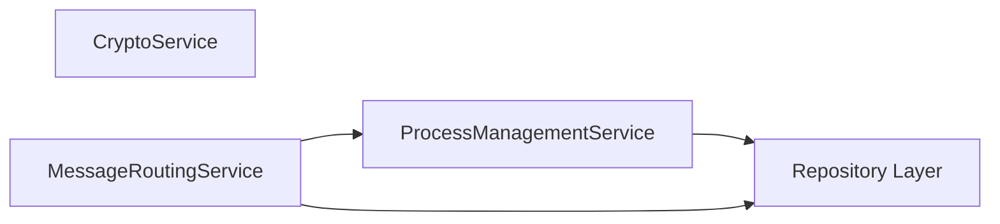

# D-TPRES Core Service層設計

## 1. 概要

Core Service層は、D-TPRESの基本機能を提供するサービス群です。これらのサービスは、ビジネスロジックの実装と計算処理に特化し、データ永続化はRepository層に委譲します。Workflow Service層から利用され、複雑な処理フローの基盤となります。

## 2. Core Serviceの設計原則

### 2.1 責務の明確化

- **単一責任の原則**: 各Core Serviceは明確に定義された単一の責務を持つ
- **ビジネスロジック特化**: 計算処理やビジネスルールの実装に集中
- **Repository層との分離**: データ永続化はRepository層に委譲し、ビジネスロジックのみを実装
- **再利用性**: 複数のWorkflow Serviceから利用可能な汎用的な設計

### 2.2 実装指針

- **ステートレス**: AO環境に適応したステートレス設計
- **非同期処理**: I/O操作は非同期で実装
- **エラー処理**: 明確なエラー型定義と適切な例外処理

## 3. CryptoService

### 3.1 概要

CryptoServiceは、D-TPRESの暗号化操作すべてを担当する中核サービスです。Threshold Proxy Re-Encryption (TPRE) とShamir Secret Sharingの実装を提供します。

### 3.2 インターフェース定義

```rust
use async_trait::async_trait;
use crate::domain::entity::{ShamirShare, Capsule, PublicKey, SecretKey, ReencryptionKey, KeyFragment, CipherFragment};
use crate::domain::error::CryptoError;

#[async_trait]
pub trait CryptoService: Send + Sync {
    // Shamir Secret Sharing操作
    async fn split_secret_shamir(
        &self,
        secret: &[u8],
        threshold: u8,
        total_shares: u8,
    ) -> Result<Vec<ShamirShare>, CryptoError>;
    
    async fn reconstruct_secret_shamir(
        &self,
        shares: &[ShamirShare],
        threshold: u8,
    ) -> Result<Vec<u8>, CryptoError>;
    
    // PRE暗号化操作
    async fn create_pre_capsule(
        &self,
        public_key: &PublicKey,
        plaintext: &[u8],
    ) -> Result<(Capsule, Vec<u8>), CryptoError>;
    
    async fn generate_reencryption_key(
        &self,
        owner_secret_key: &SecretKey,
        accessor_public_key: &PublicKey,
    ) -> Result<ReencryptionKey, CryptoError>;
    
    async fn create_kfrags(
        &self,
        reencryption_key: &ReencryptionKey,
        threshold: u8,
        total_fragments: u8,
    ) -> Result<Vec<KeyFragment>, CryptoError>;
    
    async fn proxy_reencrypt(
        &self,
        kfrag: &KeyFragment,
        capsule: &Capsule,
    ) -> Result<CipherFragment, CryptoError>;
    
    async fn combine_and_decrypt(
        &self,
        cfrags: &[CipherFragment],
        accessor_secret_key: &SecretKey,
        original_capsule: &Capsule,
        ciphertext: &[u8],
    ) -> Result<Vec<u8>, CryptoError>;
}
```

### 3.3 実装ガイドライン

#### 3.3.1 暗号ライブラリの使用

```rust
pub struct CryptoServiceImpl {
    umbral_engine: UmbralEngine,
    shamir_engine: ShamirEngine,
}

impl CryptoServiceImpl {
    pub fn new() -> Self {
        Self {
            umbral_engine: UmbralEngine::new(),
            shamir_engine: ShamirEngine::new(),
        }
    }
}
```

#### 3.3.2 エラーハンドリング

```rust
impl From<umbral_pre::Error> for CryptoError {
    fn from(err: umbral_pre::Error) -> Self {
        CryptoError::UmbralError(err.to_string())
    }
}

impl From<shamir::Error> for CryptoError {
    fn from(err: shamir::Error) -> Self {
        CryptoError::ShamirError(err.to_string())
    }
}
```

### 3.4 使用例

```rust
// Workflow Serviceからの使用例
async fn execute_secret_sharing(&self, secret_data: &[u8]) -> Result<(), WorkflowError> {
    // Shamir分割
    let shares = self.crypto_service
        .split_secret_shamir(secret_data, 3, 5)
        .await?;
    
    // 各シェアを暗号化
    for share in shares {
        let (capsule, ciphertext) = self.crypto_service
            .create_pre_capsule(&holder_public_key, &share.data)
            .await?;
        
        // ストレージに保存...
    }
    
    Ok(())
}
```

## 4. ProcessManagementService

### 4.1 概要

ProcessManagementServiceは、ProcessEntityの管理とマルチロール状態管理を担当します。AO環境でのプロセスライフサイクル管理を提供します。

### 4.2 インターフェース定義

```rust
use async_trait::async_trait;
use crate::domain::entity::{ProcessEntity, ProcessRole, ProcessConfig};
use crate::domain::error::ProcessError;
use crate::domain::repository::ProcessEntityRepository;

#[async_trait]
pub trait ProcessManagementService: Send + Sync {
    // プロセス初期化（ビジネスロジックを含む）
    async fn initialize_process_with_validation(
        &self,
        process_id: &str,
        initial_roles: &[ProcessRole],
        config: ProcessConfig,
    ) -> Result<ProcessEntity, ProcessError>;
    
    // ロール追加（互換性チェックを含む）
    async fn validate_and_add_role(
        &self,
        process_id: &str,
        role: ProcessRole,
        role_data: RoleData,
    ) -> Result<(), ProcessError>;
    
    // パフォーマンスメトリクス分析
    async fn analyze_performance_metrics(
        &self,
        process_id: &str,
        time_range: TimeRange,
    ) -> Result<PerformanceAnalysis, ProcessError>;
    
    // マルチロール最適化（ビジネスロジック）
    async fn optimize_role_distribution(
        &self,
        process_ids: &[String],
    ) -> Result<RoleDistributionPlan, ProcessError>;
    
    // 信頼性スコア計算（ビジネスロジック）
    async fn calculate_reliability_score(
        &self,
        process_id: &str,
    ) -> Result<f64, ProcessError>;
}
```

### 4.3 実装ガイドライン

#### 4.3.1 Repository層との連携

```rust
pub struct ProcessManagementServiceImpl {
    process_repository: Arc<dyn ProcessEntityRepository>,
}

impl ProcessManagementServiceImpl {
    pub fn new(process_repository: Arc<dyn ProcessEntityRepository>) -> Self {
        Self { process_repository }
    }
    
    async fn initialize_process_with_validation(
        &self,
        process_id: &str,
        initial_roles: &[ProcessRole],
        config: ProcessConfig,
    ) -> Result<ProcessEntity, ProcessError> {
        // ビジネスロジック：ロール検証
        for role in initial_roles {
            self.validate_initial_role(role)?;
        }
        
        // ビジネスロジック：設定検証
        self.validate_config(&config)?;
        
        // ProcessEntityの作成
        let process = ProcessEntity {
            process_id: process_id.to_string(),
            active_roles: initial_roles.to_vec(),
            config,
            // ... その他フィールド
        };
        
        // Repositoryに保存
        self.process_repository.create(&process).await?;
        
        Ok(process)
    }
}
```

#### 4.3.2 ビジネスロジック実装例

```rust
#[derive(Debug, Clone)]
pub struct PerformanceAnalysis {
    pub average_response_time: f64,
    pub success_rate: f64,
    pub peak_load: u64,
    pub recommendations: Vec<String>,
}

impl ProcessManagementServiceImpl {
    async fn validate_and_add_role(
        &self,
        process_id: &str,
        new_role: ProcessRole,
        role_data: RoleData,
    ) -> Result<(), ProcessError> {
        // Repositoryから現在の状態を取得
        let mut process = self.process_repository
            .find_by_id(process_id)
            .await?
            .ok_or(ProcessError::NotFound)?;
        
        // ビジネスロジック：ロール互換性チェック
        match (&new_role, &process.active_roles) {
            (ProcessRole::Owner, roles) if roles.iter().any(|r| matches!(r, ProcessRole::Owner)) => {
                return Err(ProcessError::RoleConflict("Owner role already exists".into()));
            }
            (ProcessRole::Holder { capacity }, _) => {
                // キャパシティ検証
                if *capacity < MIN_HOLDER_CAPACITY {
                    return Err(ProcessError::ValidationError("Insufficient capacity".into()));
                }
            }
            _ => {}
        }
        
        // プロセス更新
        process.active_roles.push(new_role);
        self.process_repository.update(&process).await?;
        
        Ok(())
    }
    
    async fn calculate_reliability_score(
        &self,
        process_id: &str,
    ) -> Result<f64, ProcessError> {
        let process = self.process_repository
            .find_by_id(process_id)
            .await?
            .ok_or(ProcessError::NotFound)?;
        
        // ビジネスロジック：信頼性スコア計算
        let base_score = 1.0;
        let uptime_factor = process.metrics.uptime_percentage / 100.0;
        let success_factor = process.metrics.success_rate / 100.0;
        let penalty = process.metrics.failed_operations as f64 * 0.01;
        
        let score = (base_score * uptime_factor * success_factor) - penalty;
        Ok(score.max(0.0).min(1.0))
    }
}
```

### 4.4 使用例

```rust
// ビジネスロジックを含むプロセス初期化
let process = process_mgmt_service
    .initialize_process_with_validation(
        "process-123",
        &[ProcessRole::Owner],
        ProcessConfig {
            max_secrets: 100,
            performance_tracking: true,
        },
    )
    .await?;

// ロール追加（互換性チェック付き）
process_mgmt_service
    .validate_and_add_role(
        "process-123",
        ProcessRole::Holder { capacity: 50 },
        RoleData::Holder(HolderData {
            storage_capacity: 50,
            online_status: true,
        }),
    )
    .await?;

// 信頼性スコア計算
let score = process_mgmt_service
    .calculate_reliability_score("process-123")
    .await?;
println!("Reliability score: {:.2}", score);
```

## 5. MessageRoutingService

### 5.1 概要

MessageRoutingServiceは、AOプロセス間の非同期メッセージングとルーティングを管理します。プロセス発見、メッセージ配信、応答収集機能を提供します。

### 5.2 インターフェース定義

```rust
use async_trait::async_trait;
use crate::domain::entity::{ProcessMessage, MessageId, MessageResponse, ProcessInfo};
use crate::domain::error::RoutingError;
use std::time::Duration;

#[async_trait]
pub trait MessageRoutingService: Send + Sync {
    // メッセージ送信
    async fn send_message(
        &self,
        target_process_id: &str,
        message: ProcessMessage,
    ) -> Result<MessageId, RoutingError>;
    
    async fn broadcast_message(
        &self,
        target_processes: &[String],
        message: ProcessMessage,
    ) -> Result<Vec<MessageId>, RoutingError>;
    
    // 応答管理
    async fn wait_for_responses(
        &self,
        message_ids: &[MessageId],
        timeout: Duration,
    ) -> Result<Vec<MessageResponse>, RoutingError>;
    
    async fn wait_for_threshold_responses(
        &self,
        message_ids: &[MessageId],
        threshold: usize,
        timeout: Duration,
    ) -> Result<Vec<MessageResponse>, RoutingError>;
    
    // プロセス発見
    async fn discover_online_processes(
        &self,
        role_filter: Option<ProcessRole>,
        capacity_requirement: Option<u64>,
    ) -> Result<Vec<ProcessInfo>, RoutingError>;
    
    // 特化メソッド
    async fn collect_cfrags(
        &self,
        holder_processes: &[String],
        reencryption_request: ReencryptionRequest,
        threshold: u8,
    ) -> Result<Vec<CipherFragment>, RoutingError>;
}
```

### 5.3 実装ガイドライン

#### 5.3.1 非同期メッセージング

```rust
pub struct MessageRoutingServiceImpl {
    ao_client: Arc<AOClient>,
    pending_responses: Arc<RwLock<HashMap<MessageId, oneshot::Sender<MessageResponse>>>>,
}

impl MessageRoutingServiceImpl {
    async fn send_message_impl(
        &self,
        target: &str,
        message: ProcessMessage,
    ) -> Result<MessageId, RoutingError> {
        let message_id = MessageId::new();
        
        // AOメッセージ送信
        self.ao_client
            .send(AOMessage {
                target: target.to_string(),
                tags: message.tags.clone(),
                data: message.payload.clone(),
            })
            .await?;
        
        Ok(message_id)
    }
}
```

#### 5.3.2 応答収集パターン

```rust
impl MessageRoutingServiceImpl {
    async fn collect_responses_with_threshold(
        &self,
        message_ids: &[MessageId],
        threshold: usize,
        timeout: Duration,
    ) -> Result<Vec<MessageResponse>, RoutingError> {
        let mut responses = Vec::new();
        let deadline = Instant::now() + timeout;
        
        let mut response_stream = futures::stream::FuturesUnordered::new();
        
        for id in message_ids {
            let rx = self.create_response_channel(id).await?;
            response_stream.push(rx);
        }
        
        while let Some(result) = response_stream.next().await {
            match result {
                Ok(response) => {
                    responses.push(response);
                    if responses.len() >= threshold {
                        return Ok(responses);
                    }
                }
                Err(_) if Instant::now() > deadline => {
                    return Err(RoutingError::Timeout);
                }
                Err(e) => continue, // 個別の失敗は無視
            }
        }
        
        if responses.len() >= threshold {
            Ok(responses)
        } else {
            Err(RoutingError::InsufficientResponses)
        }
    }
}
```

### 5.4 使用例

```rust
// Holder群へのkFrag配布
let holder_processes = routing_service
    .discover_online_processes(
        Some(ProcessRole::Holder { capacity: 0 }),
        Some(10), // 最小容量要件
    )
    .await?;

let message_ids = routing_service
    .broadcast_message(
        &holder_processes.iter().map(|p| p.process_id.clone()).collect::<Vec<_>>(),
        ProcessMessage {
            message_type: MessageType::DistributeKFrag,
            payload: kfrag_data,
            tags: tags,
            created_at: now,
        },
    )
    .await?;

// 応答待機
let responses = routing_service
    .wait_for_threshold_responses(&message_ids, threshold as usize, Duration::from_secs(30))
    .await?;
```

## 6. Core Service間の連携

### 6.1 サービス間依存関係



Core Service層は、各サービスが独立した責務を持ちながら、必要に応じて連携します：
- **CryptoService**: 暗号化計算に特化、他サービスから独立
- **ProcessManagementService**: ビジネスロジックとRepository操作の調整
- **MessageRoutingService**: プロセス間通信とRepository経由での状態確認

### 6.2 連携パターン

#### 6.2.1 ProcessManagementとRepository

```rust
impl ProcessManagementServiceImpl {
    process_repository: Arc<dyn ProcessEntityRepository>,
    
    async fn validate_and_add_role(
        &self,
        process_id: &str,
        new_role: ProcessRole,
    ) -> Result<(), ProcessError> {
        // Repositoryから現在の状態を取得
        let process = self.process_repository
            .find_by_id(process_id)
            .await?
            .ok_or(ProcessError::NotFound)?;
        
        // ビジネスロジック：ロール互換性チェック
        self.validate_role_compatibility(&process.active_roles, &new_role)?;
        
        // 更新されたプロセスをRepositoryに保存
        let updated_process = self.add_role_to_process(process, new_role);
        self.process_repository.update(&updated_process).await?;
        
        Ok(())
    }
}
```

#### 6.2.2 MessageRoutingとProcessManagement

```rust
impl MessageRoutingServiceImpl {
    process_repository: Arc<dyn ProcessEntityRepository>,
    
    async fn discover_holders_with_capacity(
        &self,
        min_capacity: u64,
    ) -> Result<Vec<ProcessInfo>, RoutingError> {
        // Repositoryから直接Holder情報を取得
        let holder_processes = self.process_repository
            .find_processes_with_holder_capability()
            .await?;
        
        let eligible_holders = holder_processes
            .into_iter()
            .filter(|p| {
                if let Some(holder_data) = &p.holder_data {
                    holder_data.current_load < min_capacity
                } else {
                    false
                }
            })
            .map(|p| ProcessInfo::from(p))
            .collect();
        
        Ok(eligible_holders)
    }
}
```

## 7. テスト戦略

### 7.1 単体テスト

```rust
#[cfg(test)]
mod tests {
    use super::*;
    use mockall::mock;
    
    mock! {
        CryptoService {}
        
        #[async_trait]
        impl CryptoService for CryptoService {
            async fn split_secret_shamir(
                &self,
                secret: &[u8],
                threshold: u8,
                total_shares: u8,
            ) -> Result<Vec<ShamirShare>, CryptoError>;
            
            // 他のメソッド...
        }
    }
    
    #[tokio::test]
    async fn test_shamir_split_and_reconstruct() {
        let service = CryptoServiceImpl::new();
        let secret = b"test secret data";
        
        let shares = service.split_secret_shamir(secret, 3, 5).await.unwrap();
        assert_eq!(shares.len(), 5);
        
        let reconstructed = service
            .reconstruct_secret_shamir(&shares[0..3], 3)
            .await
            .unwrap();
        
        assert_eq!(reconstructed, secret);
    }
}
```

### 7.2 統合テスト

```rust
#[tokio::test]
async fn test_process_management_with_repository() {
    let mock_repo = MockProcessEntityRepository::new();
    let process_service = ProcessManagementServiceImpl::new(mock_repo);
    
    // ロール追加のビジネスロジックテスト
    let result = process_service
        .validate_and_add_role("test-process", ProcessRole::Holder { capacity: 50 })
        .await;
    
    assert!(result.is_ok());
}
```

## 8. パフォーマンス考慮事項

### 8.1 キャッシング戦略

- ProcessEntity: インメモリキャッシュ with TTL
- 暗号化操作結果: 結果のキャッシングは避ける（セキュリティ）
- Arweaveクエリ結果: 短期間キャッシュ

### 8.2 並列処理

- メッセージブロードキャスト: 並列送信
- バッチストレージ操作: 並列トランザクション作成
- cFrag収集: 並列応答待機

## 9. まとめ

Core Service層は、D-TPRESの基盤機能を提供する重要な層です。各サービスは明確な責務を持ち：

1. **CryptoService**: 暗号化計算処理に特化
2. **ProcessManagementService**: ビジネスロジックとRepository操作の調整
3. **MessageRoutingService**: AOプロセス間の非同期通信

データ永続化はRepository層に委譲することで、関心の分離と保守性の向上を実現しています。AO環境の特性を考慮した実装により、高性能で信頼性の高いシステムを実現します。