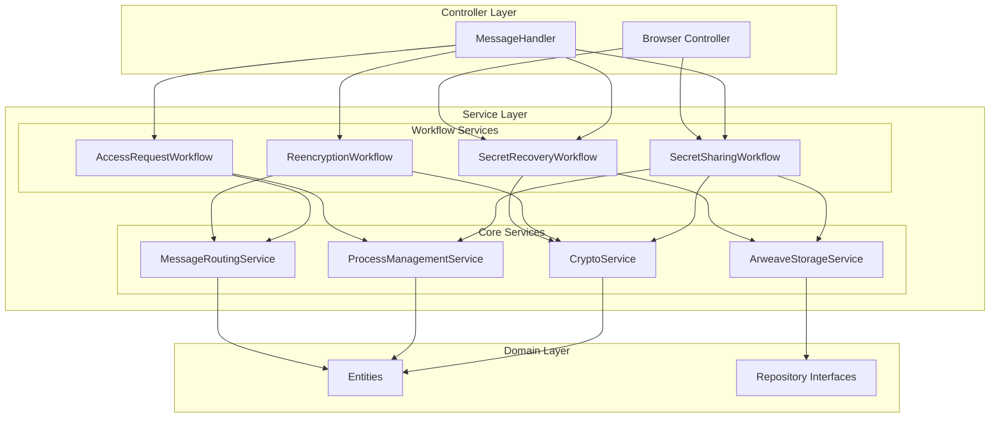

# D-TPRES Service層設計概要

## 1. はじめに

本ドキュメントは、D-TPRES（Deterministic Threshold Proxy Re-Encryption System）のService層設計について説明します。Service層は、TERASOLUNAガイドラインに基づき、ビジネスロジックの実装と管理を担当する層として設計されています。

## 2. Service層の設計思想

### 2.1 TERASOLUNAガイドラインの適用

Service層は以下の原則に従って設計されています：

1. **ビジネスロジックの集約**
   - すべてのビジネスロジックはService層に実装
   - Controller層はService層への委譲のみを行う

2. **トランザクション境界の管理**
   - Service層でトランザクション境界を定義
   - AO環境の特性を考慮したトランザクション設計

3. **例外処理の標準化**
   - BusinessExceptionとSystemExceptionの明確な区別
   - 各層での適切な例外処理

### 2.2 D-TPRES特有の考慮事項

#### 2.2.1 AO環境への適応

- **ステートレス実行モデル**
  - 各メッセージ処理は独立した実行単位
  - 状態管理はArweaveストレージを介して実現

- **WebAssembly制約**
  - 限られたランタイム環境での動作
  - 効率的なメモリ使用とパフォーマンス最適化

- **非同期メッセージング**
  - プロセス間通信は非同期メッセージング
  - 最終的整合性を前提とした設計

#### 2.2.2 マルチロールプロセス対応

単一のWasmバイナリが複数のロールを実行可能：
- Owner Process (Pᴼ)
- Holder Process (Hⱼ)
- Requester Process (R-Proc)

## 3. ハイブリッドサービスアーキテクチャ

### 3.1 アーキテクチャ概要

D-TPRESのService層は、Core ServiceとWorkflow Serviceの2層構造を採用しています：



### 3.2 Core Services

**責務**: エンティティ中心の基本操作とドメイン特化機能の提供

1. **CryptoService**
   - Threshold Proxy Re-Encryption操作
   - Shamir Secret Sharing
   - 暗号化・復号化処理

2. **ProcessManagementService**
   - ProcessEntityの管理
   - マルチロール状態管理
   - メトリクス収集

3. **MessageRoutingService**
   - AOプロセス間メッセージング
   - ブロードキャスト通信
   - オンラインプロセス発見

4. **ArweaveStorageService**
   - Arweaveへのデータ永続化
   - トランザクション管理
   - データ取得と検証

### 3.3 Workflow Services

**責務**: PRD Phase別のビジネスロジック実装とCore Serviceの組み合わせ

1. **SecretSharingWorkflowService** (Phase 1)
   - 秘密の暗号化・分割
   - Arweaveへの保存
   - 初期設定管理

2. **AccessRequestWorkflowService** (Phase 2)
   - アクセス要求の処理
   - 外部アクセス制御との連携（検証済み前提）
   - 暗号学的処理の準備

3. **ReencryptionWorkflowService** (Phase 3-4)
   - 再暗号化キー生成
   - kFrag配布
   - cFrag収集と集約

4. **SecretRecoveryWorkflowService** (Phase 5)
   - 復号化処理
   - Shamir補間
   - 秘密の復元

## 4. サービス間の連携

### 4.1 レイヤー間の責務分担

| レイヤー | 責務 | 例 |
|---------|------|-----|
| Controller | メッセージ受信・検証・レスポンス生成 | MessageHandler, BrowserController |
| Workflow Service | ビジネスフロー制御・トランザクション管理 | Phase別の処理フロー |
| Core Service | 基本操作・共通機能 | 暗号化、ストレージ操作 |
| Domain | エンティティ・ビジネスルール | ProcessEntity, ShareEntity |

### 4.2 依存関係の原則

1. **単方向依存**
   - Controller → Workflow Service → Core Service → Domain
   - 逆方向の依存は禁止

2. **インターフェース分離**
   - 各サービスはtraitで定義
   - 実装の詳細は隠蔽

3. **疎結合**
   - サービス間は最小限のインターフェースで連携
   - 将来の拡張性を確保

## 5. エラーハンドリング戦略

### 5.1 例外階層

```rust
pub enum ServiceError {
    // ビジネス例外（回復可能）
    Business(BusinessException),
    
    // システム例外（回復不可能）
    System(SystemException),
}

pub enum BusinessException {
    ValidationError(String),
    AuthorizationError(String),
    ResourceNotFound(String),
    BusinessRuleViolation(String),
}

pub enum SystemException {
    CryptoError(String),
    StorageError(String),
    NetworkError(String),
    InternalError(String),
}
```

### 5.2 エラー処理方針

1. **Business例外**
   - ユーザーへの適切なフィードバック
   - リトライ可能性の提示
   - 業務継続性の確保

2. **System例外**
   - 詳細なログ記録
   - 管理者への通知
   - フェイルファスト原則

## 6. パフォーマンスとスケーラビリティ

### 6.1 設計上の考慮事項

1. **非同期処理**
   - I/O操作の非同期化
   - 並列処理による高速化

2. **キャッシング戦略**
   - 頻繁にアクセスされるデータのキャッシュ
   - AO環境に適したキャッシュ設計

3. **バッチ処理**
   - 複数操作の集約
   - ネットワークラウンドトリップの削減

### 6.2 測定可能な指標

- レスポンスタイム
- スループット
- エラー率
- リソース使用率

## 7. セキュリティ考慮事項

### 7.1 暗号化操作の保護

- 秘密鍵の安全な管理
- メモリ上の機密データの適切な処理
- サイドチャネル攻撃への対策

### 7.2 外部システム連携

- 外部アクセス制御システムとの責任分界
- D-TPRES内部は純粋な暗号学的処理のみ
- 外部検証済み前提でのセキュアな実装

## 8. 今後の拡張性

### 8.1 新しいWorkflow Serviceの追加

- PRDの新フェーズ対応
- 異なるユースケースへの対応
- プラグイン可能なアーキテクチャ

### 8.2 Core Serviceの拡張

- 新しい暗号化アルゴリズムの対応
- 異なるストレージバックエンドの対応
- パフォーマンス最適化

## 9. まとめ

D-TPRESのService層は、TERASOLUNAガイドラインに基づきながら、AO環境の特性を考慮した独自の設計を採用しています。Core ServiceとWorkflow Serviceの2層構造により、高い再利用性と保守性を実現し、将来の拡張にも対応可能な柔軟なアーキテクチャとなっています。