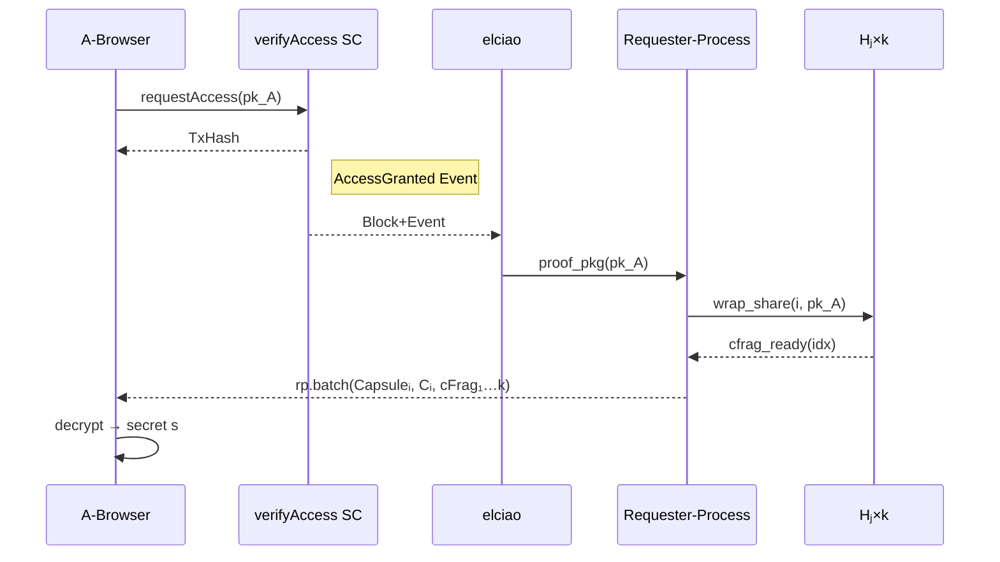

# A-Browser 仕様（アクセス者フロントエンド）

> **目的** ― データ利用者（Bob）がブラウザでアクセス要求を行い、cFrag 受領後に暗号文を復号して秘密 s を取得する UI／クライアント。

---

## 概要

* Ethereum ウォレット連携で `verifyAccess` スマートコントラクトを呼び出し、トークン保有証明をオンチェーンに記録。（将来的に、呼び出すスマコン（メソッド）を複数明示、または組み合わせた、より柔軟なアクセス制御条件としてのスマコン呼び出しを想定）
* Requester-Process (RP) を spawn し、ProofPkg 取得後 cFrag 収集を待機。
* 必要個数の cFrag が揃ったらローカルで Capsule′ を再構築し、対称鍵 Kᵢ と Shamir シェア f(i) を復元、最終的に秘密 s を補間。

---

## 入力 (Input)

| 発生源        | イベント / データ       | 説明                               |
| ---------- | ---------------- | -------------------------------- |
| **UI**     | `request_access` | data\_id, Owner から共有された URL/TxID |
| **Wallet** | `signature`      | MetaMask 等による本人署名                |
| **RP**     | `rp.batch`       | Capsuleᵢ, Cᵢ, cFrag₁…k バッチ       |

---

## 処理手順

1. **アクセス要求**

   * `WebCrypto.generateKey("ECDH", X25519)` → (pk\_A, sk\_A)。
   * `verifyAccess.requestAccess(data_id, pk_A, sig)` を EVM へ送信。
2. **RP spawn**

   * `ao.spawn({ module: MODULE_TX, init:{ role:"requester", data_id, pk_A }})`。
3. **cFrag 待機**

   * RP から `rp.batch` を受信するまで WebSocket / Polling。
4. **復号処理**

   * Capsule′ = `combine(Capsuleᵢ, cFrag₁…k)`（umbral-pre wasm）
   * Kᵢ = `PRE_Dec(sk_A, Capsule′)`
   * f(i) = `AES_DEC(Kᵢ, Cᵢ)`
   * k 個の f(i) で Shamir 補間 → 秘密 s 復元。
5. **ダウンロード**

   * 復号完了ファイル / シークレットをユーザに提示・保存。

---

## シーケンス図

---

## 出力 (Output)

| 宛先                  | 内容                 | 説明                    |
| ------------------- | ------------------ | --------------------- |
| **verifyAccess SC** | `requestAccess` Tx | アクセス要求として pk\_A を登録   |
| **AO / RP**         | `spawn requester`  | Requester-Process 初期化 |
| **ユーザ端末**           | 復号済みデータ            | ファイルダウンロード or クリップボード |

---

## その他考慮事項

* **ウォレット互換:** EIP‑712 メッセージ署名を使用し UI で安全に pk\_A と関連付け。
* **キー保管:** sk\_A は `SecretVec` でブラウザメモリに保持、その場で zeroize。
* **進行状況:** cFrag 受領数／閾値をプログレスバー表示。
* **エラーハンドリング:** しきい値未達のタイムアウト表示、再試行ボタン。
* **デバイス互換:** Mobile Safari 向けに WebCrypto の SubtleCrypto 仕様差異を吸収。
