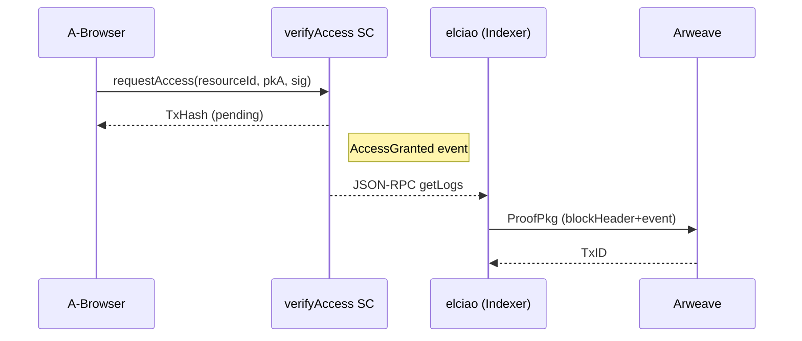

# verifyAccess スマートコントラクト仕様

> **Purpose** ― ERC‑20 トークン保有条件を **決定論的に検証** し、アクセス許可イベントを発行するオンチェーン判定レイヤ。

---

## 概要

* ネットワーク: Ethereum (Sepolia)。
* 条件: `ERC20 token.balanceOf(user) ≥ THRESHOLD`。
* インターフェース: 単一関数 `requestAccess(resourceId, pkA, sig)`。
* 成功時に `event AccessGranted(bytes32 indexed resourceId, address indexed user, bytes32 pkA)` を Emit。
* イベントは **elciao** ライトクライアントが Arweave に ProofPkg 化し AO へ転送。

---

## 入力 (Input)

| 呼出者       | 関数              | 引数                                                                                          |
| --------- | --------------- | ------------------------------------------------------------------------------------------- |
| A‑Browser | `requestAccess` | `bytes32 resourceId`, `bytes32 pkA`, `bytes sig`<br>sig は `pkA` に対する `eth_signTypedData` 署名 |

---

## 主要ストレージ

```solidity
struct Policy {
    IERC20 token;      // 対象トークン
    uint256 threshold; // 必要保有量 (18 decimals)
}

mapping(bytes32 => Policy) public policies; // resourceId → 条件
```

### コンストラクタ

```solidity
constructor(address admin) {
    _grantRole(DEFAULT_ADMIN_ROLE, admin);
}
```

* アドミンのみが `setPolicy` でリソース条件を登録。

---

## 処理ロジック

```solidity
function requestAccess(bytes32 id, bytes32 pkA, bytes calldata sig) external {
    Policy memory p = policies[id];
    require(address(p.token) != address(0), "POLICY_NA");
    require(p.token.balanceOf(msg.sender) >= p.threshold, "BAL_LOW");
    // EIP-712 typed signature ⇒ pkA が msg.sender に帰属
    bytes32 digest = _hashTyped(pkA);
    require(ECDSA.recover(digest, sig) == msg.sender, "BAD_SIG");
    emit AccessGranted(id, msg.sender, pkA);
}
```

* ガスコスト : 約 45k (読み込み 20k + emit 15k + ecrecover 3k + 余裕)。

---

## シーケンス図



---

## 出力 (Output)

| 宛先               | 種別/内容           | 意味                               |
| ---------------- | --------------- | -------------------------------- |
| Ethereum Log     | `AccessGranted` | AO 側判定のトリガーイベント                  |
| elciao → Arweave | ProofPkg JSON   | ブロックヘッダ + merkleProof + eventLog |

---

## セキュリティ考慮

| 論点            | 対策                                                                   |
| ------------- | -------------------------------------------------------------------- |
| Reentrancy    | 状態変更なし。純ビュー＋ emit のみで無効。                                             |
| Replay Attack | ProofPkg に含まれる `blockNumber` & `txHash` を AO 側で一度きり消費。               |
| 偽署名           | EIP‑712 domain & chainId 固定、ECDSA検証必須。                               |
| トークン偽装        | `setPolicy` 時に token address を固定、ERC20 専用 interface で balanceOf を参照。 |

---

## 参考 OpenZeppelin 実装

* `AccessControl`, `ECDSA`, `IERC20` をインポート。
* ソース雛形: [https://github.com/OpenZeppelin/openzeppelin-contracts](https://github.com/OpenZeppelin/openzeppelin-contracts)

---

## 今後の拡張 (Out‑of‑Scope)

* ERC‑1155 / NFT ゲーティング
* ZK-SNARK によるオフチェーン残高証明
* UUPS / EIP‑1967 アップグレードパターン採用
