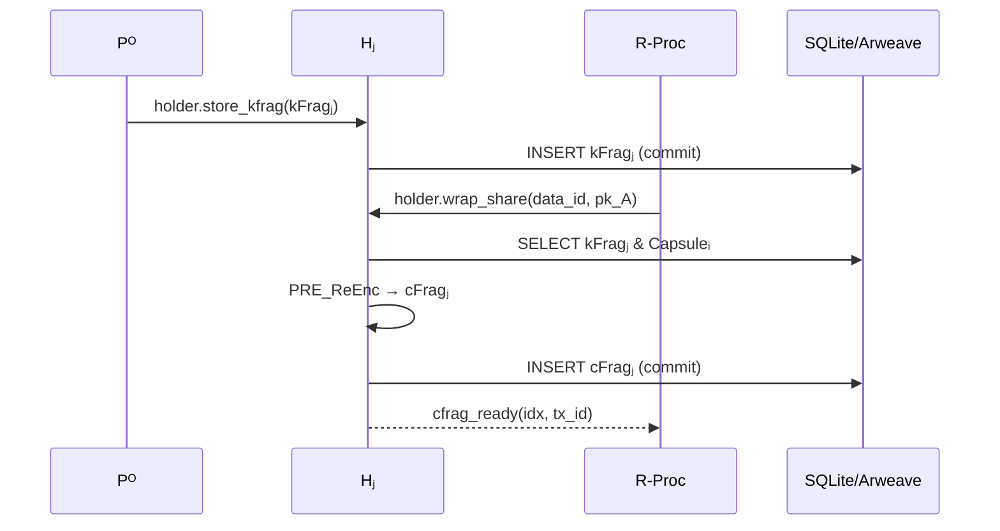

# Holder-Process (Hⱼ) 仕様

> **目的** ― Holder-Process は kFrag を保持し、アクセス要求が来た際に Capsuleᵢ を再暗号化して cFragⱼ を生成・公開するノード役割。

---

## 概要

* **ロール:** `role = "holder"`
* **主な責務:**

  1. kFragⱼ を安全に受信・SQLite に保存。
  2. Requester-Process から `wrap_share` を受信したら pkᴬ を検証。
  3. Capsuleᵢ をロードし `cFragⱼ = PRE_ReEnc(kFragⱼ, Capsuleᵢ)` を計算。
  4. cFragⱼ を自身の SQLite に INSERT し `COMMIT`（＝差分ページが Arweave Tx 化）。
  5. RP へ cFragⱼ TxID を返信。

---

## 入力 (Input)

| 送信元                        | メッセージ (`fn`)         | 内容                           |
| -------------------------- | -------------------- | ---------------------------- |
| **Owner-Process (Pᴼ)**     | `holder.store_kfrag` | `{ data_id, kFrag_j, pk_A }` |
| **Requester-Process (RP)** | `holder.wrap_share`  | `{ data_id, wrap_i, pk_A }`  |

---

## 処理フロー

1. **kFrag 保存 (`holder.store_kfrag`)**

   1. `INSERT INTO kfrags(data_id, pk_A, idx, blob)`.
   2. `COMMIT;` → 差分ページが Arweave に自動アップロード。
2. **再暗号化 (`holder.wrap_share`)**

   1. `SELECT blob FROM kfrags WHERE data_id=? AND pk_A=?` → kFragⱼ。
   2. Capsuleᵢ を `SELECT`。無ければ Arweave からストリーム取得。
   3. `cFrag_j = PRE_ReEnc(kFrag_j, Capsuleᵢ)`。
   4. `INSERT INTO cfrags(data_id, pk_A, idx, blob)` → `COMMIT;`。
   5. RP へ `holder.cfrag_ready { idx, tx_id }` を送信。

---

## シーケンス図

---

## 出力 (Output)

| 宛先                    | メッセージ         | 内容                             |
| --------------------- | ------------- | ------------------------------ |
| **SQLite/Arweave**    | 差分ページ         | kFrag, cFrag データ永続化            |
| **Requester-Process** | `cfrag_ready` | `{ idx, tx_id }` cFrag TxID 通知 |

---

## その他考慮事項

* **検証:** `wrap_share` 内 pkᴬ が kFrag レコードの pkᴬ と一致しない場合は拒否。
* **メモリ安全:** kFrag, cFrag 用バッファは `SecretVec` で保持し計算後 `zeroize()`。
* **再指名:** しきい値未達で RP がタイムアウト検知したら PO が別 Holder を再指名。
* **サイズ:** 1 cFrag は ≒ 1 kB。5 個で 5 kB < 1 Tx 余裕。
