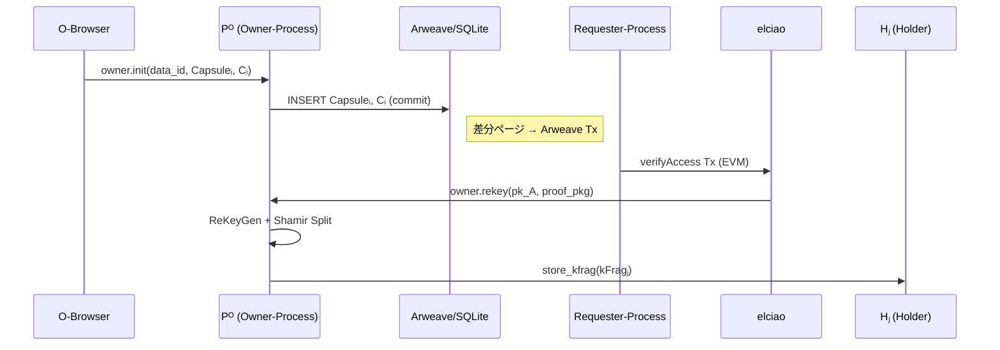

# Owner‑Process (Pᴼ) 仕様

> **目的** ― O‑Browser が spawn する Owner‑Process は、暗号データの初期アップロードおよび再暗号化鍵 (ReKey) の分割配布を行う D‑TPRES の起点プロセスである。

---

## 概要

* **ロール:** `role = "owner"`
* **主な責務:**

  1. skᴼ（データ所有者秘密鍵）を保持し、アクセス要求ごとに ReKey を生成。
  2. ReKey を `Shamir(k,n)` で kFragⱼ に分割し、オンライン上位 n プロセスを Holder に指名して送付。
  3. Capsuleᵢ と暗号文 Cᵢ を Arweave 永続化 (SQLite 経由)。
* **Wasm モジュール:** `dtpres_core.wasm` ─ Owner / Holder / Requester 共通。

---

## 入力 (Input)

| 送信元           | メッセージ (`fn`)  | 内容                                                            |
| ------------- | ------------- | ------------------------------------------------------------- |
| **O‑Browser** | `owner.init`  | `{ role:"owner", data_id, capsule, ciphertext }` 初期化 & アップロード |
| **elciao/RP** | `owner.rekey` | `{ data_id, pk_A, proof_pkg }` アクセス許可証明                       |

---

## 処理フロー

1. **初期化 (`owner.init`)**

   1. SQLite にテーブル `capsules(data_id TEXT PRIMARY KEY, capsule BLOB, ciphertext BLOB)` を作成。
   2. 受信した Capsuleᵢ / Cᵢ を `INSERT`。
   3. `COMMIT;` → AO ランタイムが差分ページを Arweave Tx 化。
2. **再暗号化鍵生成 (`owner.rekey`)**

   1. `verify_proof(proof_pkg)` で EVM イベントが正当か検証。
   2. `rekey = PRE_ReKey(sk_O → pk_A)`。
   3. `kFrags = shamir_split(rekey, k=3, n=5)`。
   4. 現在オンラインの User‑Process 上位 n を discover → `store_kfrag(kFrag_j)` を送信。

---

## シーケンス図

---

## 出力 (Output)

| 宛先            | メッセージ                | 内容                           |
| ------------- | -------------------- | ---------------------------- |
| **Arweave**   | SQLite ページ差分         | Capsuleᵢ, Cᵢ 持続保存            |
| **Holder Hⱼ** | `holder.store_kfrag` | `{ data_id, kFrag_j, pk_A }` |

---

## その他考慮事項

* **サイズ制限:** kFrag_j ≤ 8 KiB / Tx を目安とし、Tx コストを抑制。
* **セキュリティ:** skᴼ は `Secret<Vec>` + `Zeroize` で RAM 離脱時に消去。
* **フォールトトレランス:** Holder 指名は `online_score` 高い順に再計算。失敗時は再指名。
