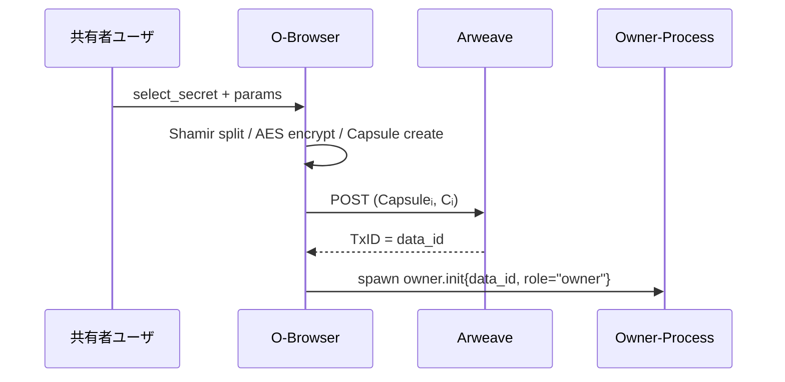

# O‑Browser 仕様（データ所有者フロントエンド）

> **目的** ― データ所有者（Alice）がブラウザ上で D‑TPRES への共有セットアップを完結できる UI／クライアント。

---

## 概要

* ユーザのローカル環境で **暗号鍵生成・データ暗号化・Capsule 作成・Arweave 投稿**・Owner‑Process spawn を行う。
* ブラウザネイティブの **WebCrypto API** を使用し秘密鍵を端末外に出さない。
* Ethereum ウォレット（MetaMask 等）と連携し、所有者自身のアドレス署名や将来の再設定トランザクションを実行可能。

---

## 入力 (Input)

| 発生源    | イベント / データ      | 説明                             |
| ------ | --------------- | ------------------------------ |
| **UI** | `select_secret` | 共有したい秘密値 (s)            |
| **UI** | `shamir_params` | (k,n) しきい値パラメータ                |
| **UI** | `spawn_owner`   | Arweave Wallet 接続 & モジュール TxID |

---

## 処理手順

1. **鍵生成**

   * `pk_O`,`sk_O` を `WebCrypto.generateKey("ECDH", curve = X25519)` で生成し IndexedDB に保管。
2. **秘密分割**

   * `s` を Shamir(k,n) ⇒ f(1)…f(n)。ライブラリ: `shamirs-secret-sharing.js`。
3. **対称鍵 & 暗号文**

   * Kᵢ ← `crypto.getRandomValues()` 256bit
   * Cᵢ = `AES_GCM.encrypt(Kᵢ, f(i))` for each i。
4. **Capsule 生成**

   * Capsuleᵢ = `PRE_Enc(pk_O, Kᵢ)` （Wasm umbral-pre wasm-bindgen ビルド）
5. **Arweave 投稿**

   * `arweave.createTransaction({ data: {ciphertext, capsule}})` で Tx 生成・署名・send。
   * 戻り TxID = `data_id`。
6. **Owner‑Process spawn**

   * `ao.spawn({ module: MODULE_TX, init: { role:"owner", data_id, capsule_tx }})`。
   * sk\_O は spawn 時にブラウザで AES-GCM 128 で暗号化し `owner.init` メッセージ内へ渡さず、後続 ReKey でのみ使用する。

---

## シーケンス図

---

## 出力 (Output)

| 宛先                | 内容           | 説明                     |
| ----------------- | ------------ | ---------------------- |
| **Arweave**       | Tx(data\_id) | Capsuleᵢ + Cᵢ 永続保存     |
| **Owner‑Process** | `owner.init` | 初期化メッセージ (data\_id 付き) |

---

## その他考慮事項

* **ブラウザストレージ** : sk\_O は AES‑GCM + user PW で IndexedDB に暗号化保存。セッション外漏洩を防止。
* **ファイルサイズ** : 大きなファイルは事前に IPFS + CID を暗号化し、Arweave にはメタデータのみ保存する拡張余地。
* **進行状況 UI** : 暗号化・アップロード・spawn 各ステップでプログレスバー表示。
* **エラーハンドリング** : Arweave Tx 確定までローディングし、失敗時はローカルに Capsule & Cᵢ を保持してリトライ可能。
