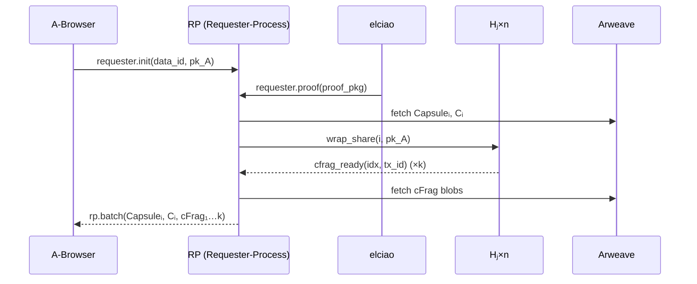

# Requester‑Process (RP) 仕様

> **目的** ― A‑Browser が spawn する Requester‑Process は、EVM 側アクセス許可の証明 (ProofPkg) を受理し、Holder 群へ再暗号化要求をブロードキャストし、k 個の cFrag を収集して A‑Browser へ返却する集約ノード。

---

## 概要

* **ロール:** `role = "requester"`
* **主な責務:**

  1. elciao から転送された `ProofPkg` を検証し保持。
  2. 対象データ `data_id` の Capsuleᵢ / Cᵢ を Arweave からストリーム取得。
  3. Holder 群へ `wrap_share(data_id, pk_A)` を fan‑out。
  4. 受信した k 個以上の cFrag を SQLite に格納し、閾値達成でバッチを作成。
  5. A‑Browser へ Capsuleᵢ, Cᵢ, cFragⱼ…k を一括送付。
* **Wasm モジュール:** `dtpres_core.wasm` 共通バイナリ内の requester ブランチ。

---

## 入力 (Input)

| 送信元           | メッセージ (`fn`)         | 内容                                                  |
| ------------- | -------------------- | --------------------------------------------------- |
| **A‑Browser** | `requester.init`     | `{ role:"requester", data_id, pk_A }` 初期化（spawn 直後） |
| **elciao**    | `requester.proof`    | `{ data_id, pk_A, proof_pkg }` EVM 証明               |
| **Holder Hⱼ** | `holder.cfrag_ready` | `{ idx, tx_id }` cFrag TxID 通知                      |

---

## 処理フロー

1. **初期化 (`requester.init`)**

   * `state` テーブルに `data_id`, `pk_A`, `needed_k = 3`, `received = 0` を登録。
2. **ProofPkg 受理 (`requester.proof`)**

   1. `verify_proof(proof_pkg)` → OK なら Capsuleᵢ / Cᵢ を `fetch_capsule(data_id)` で取得し SQLite 保存。
   2. 全 Holder (オンライン discover) に `holder.wrap_share` ブロードキャスト。
3. **cFrag 集約 (`holder.cfrag_ready`)**

   1. `INSERT INTO cfrags(idx, tx_id)`。
   2. `received += 1`。`received == needed_k` で次ステップへ。
4. **バッチ送信**

   * Capsuleᵢ, Cᵢ, k 個の cFrag を JSON pack。`ao.send(A‑Browser, "rp.batch", blob)`。
   * 状態を `done` に更新しプロセス self‑terminate (optional)。

---

## シーケンス図

---

## 出力 (Output)

| 宛先                 | メッセージ               | 内容                                     |
| ------------------ | ------------------- | -------------------------------------- |
| **Holder Hⱼ**      | `holder.wrap_share` | `{ data_id, pk_A }` 全 Holder へ fan‑out |
| **A‑Browser**      | `rp.batch`          | Capsuleᵢ, Cᵢ, cFragⱼ…k バッチ送信           |
| **SQLite/Arweave** | 差分ページ               | cFrag TxID, 状態カウンタの永続化                 |

---

## その他考慮事項

* **タイムアウト:** `wrap_share_sent_at + Δt` で cFrag 未達なら PO へ再指名要求を送る設計を検討。
* **複数同時要求:** data\_id × pk\_A ごとにテーブル分離 or composite key。
* **メモリ:** Capsule / cFrag はストリーム読み込みで RAM 常駐を避ける。
* **セキュリティ:** ProofPkg 検証失敗時は即リジェクト; 不正 Holder の cFrag は署名検証 (将来 NIZK) 後に採用。
