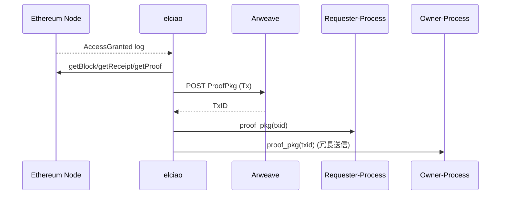

# elciao インデクサ仕様

> **Purpose** ― Ethereum (EVM) のブロックヘッダ・イベントを軽量検証し、Arweave 上に永続化された **ProofPkg** として AO プロセスに配信するブリッジレイヤ。

---

## 概要

* **動作形態:** 独立した AO プロセスではなく、外部サービス (Rust or Go) が常時稼働。
* **役割:**

  1. RPC/WebSocket 経由で Ethereum ブロックをフォロー。
  2. 対象コントラクト (`verifyAccess`) の `AccessGranted` イベントをフィルタ。
  3. ブロックヘッダ + TxReceipt + イベントログを収集し、Merkle Patricia Proof を構築。
  4. 上記セットを **ProofPkg(JSON)** として Arweave に Tx 投稿。
  5. AO の Assign 機構で 該当データID の Owner / Requester プロセスにメッセージ転送。
* **証明形式:**

```jsonc
{
  "blockHeader":   { /* RLP */ },
  "txReceipt":     { /* RLP */ },
  "eventLog":      { /* indexed topics */ },
  "receiptProof":  "0x…",
  "blockProof":    "0x…"
}
```

---

## 入力 (Input)

| ソース          | 種別              | 詳細                                                |
| ------------ | --------------- | ------------------------------------------------- |
| Ethereum RPC | `eth_subscribe` | newHeads, logs(filter = verifyAccess)             |
| Config       | TOML/YAML       | `contract_address`, `start_block`, `provider_url` |

---

## 処理フロー

1. **Subscribe** : `logs(Address = verifyAccess, Topic0 = AccessGranted)`。
2. **Header Fetch** : 該当ブロックヘッダを `eth_getBlockByHash`。
3. **Receipt + Proof** :

   * `eth_getTransactionReceipt` で receipt 取得。
   * `eth_getProof` または merkling ライブラリで Patricia proof 構築。
4. **ProofPkg Assemble** : JSON シリアライズ + gzip。(平均サイズ 3〜5 KB)
5. **Arweave Publish** :

   * Data = gzip(JSON)
   * Tag: `App:elciao`, `Type:ProofPkg`, `ResourceId:<id>`
6. **AO Notify** : Arweave TxID を `ao.send(process_id, "proof_pkg", txid)` で送信。

---

## シーケンス図



---

## 出力 (Output)

| 宛先          | 内容                | 目的                     |
| ----------- | ----------------- | ---------------------- |
| **Arweave** | ProofPkg Tx       | 永続 & 公開検証可能なチェーン証明     |
| **AO プロセス** | `proof_pkg` メッセージ | Holder/Requester 起動トリガ |

---

## 実装メモ

* **依存:** `ethers-rs`, `rlp`, `merkle-patricia-proof`。
* **サイズ:** gzip 3 KB → Arweave 手数料 ≒ 0.00002 AR/Tx。
* **ポリシー:** max 6 s 以内に ProofPkg 投稿。遅延時は再送。
* **セキュリティ:** 二重投稿防止に TxHash 重複チェック。ProofPkg 内に `chainId` 記録。
* **将来拡張:**

  * Light Client Verification (sync committee) でヘッダ検証レベルを L2→L1 並に向上。
  * 他チェーン (Polygon, BSC) 対応。
