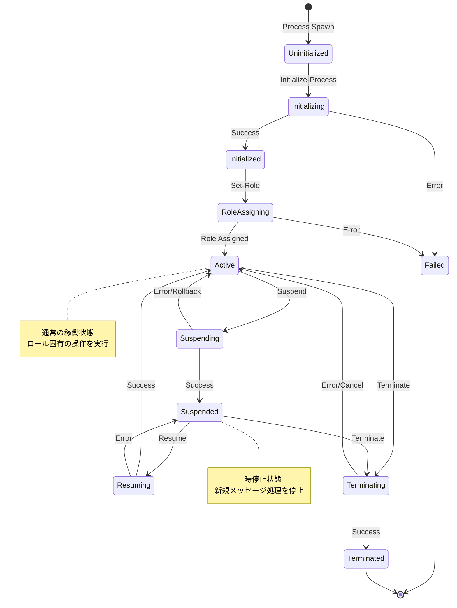

# FORMIX プロセスライフサイクル詳細

## 1. はじめに

本ドキュメントは、FORMIXシステムにおけるプロセス（Owner、Holder、Requester）のライフサイクルを詳細に定義します。各プロセスの生成から終了までの全フェーズ、遷移条件、エラー処理、セキュリティ考慮事項について説明します。

### 1.1 プロセスの重要性

FORMIXにおけるプロセスは、システムの基本的な実行単位です：

- **Owner Process**: 秘密の管理と再暗号化キーの生成
- **Holder Process**: kFragの保持とプロキシ再暗号化の実行
- **Requester Process**: アクセス要求とcFragの収集

## 2. プロセスライフサイクル全体像

### 2.1 状態遷移図



### 2.2 フェーズ定義

| フェーズ | 状態 | 説明 | 許可される操作 |
|---------|------|------|--------------|
| **Phase 0** | Uninitialized | プロセス生成直後 | Initialize-Process |
| **Phase 0** | Initializing | 初期化処理中 | なし（内部処理のみ） |
| **Phase 0** | Initialized | 初期化完了、ロール未設定 | Set-Role, Get-Status |
| **Phase 0** | RoleAssigning | ロール設定中 | なし（内部処理のみ） |
| **Phase 1-5** | Active | 通常稼働中 | ロール固有の全操作 |
| **管理** | Suspending | 一時停止処理中 | なし（内部処理のみ） |
| **管理** | Suspended | 一時停止中 | Resume, Get-Status, Terminate |
| **管理** | Resuming | 再開処理中 | なし（内部処理のみ） |
| **管理** | Terminating | 終了処理中 | なし（内部処理のみ） |
| **終了** | Terminated | 終了済み | なし |
| **エラー** | Failed | 失敗状態 | なし |

## 3. Phase 0: プロセス初期化

### 3.1 Initialize-Process

```rust
/// プロセス初期化ハンドラー
pub async fn handle_initialize_process(msg: Message) -> Response {
    // 現在の状態確認
    let current_state = get_process_state().await;
    if current_state != ProcessState::Uninitialized {
        return error_response("Process already initialized");
    }
    
    // 状態をInitializingに更新
    update_process_state(ProcessState::Initializing).await;
    
    // 初期化パラメータの抽出
    let init_params = match extract_init_params(&msg) {
        Ok(params) => params,
        Err(e) => {
            update_process_state(ProcessState::Failed).await;
            return error_response(e);
        }
    };
    
    // 初期化処理の実行
    match perform_initialization(init_params).await {
        Ok(process_entity) => {
            // ProcessEntityの永続化
            save_process_entity(&process_entity).await;
            update_process_state(ProcessState::Initialized).await;
            
            success_response(InitializeResult {
                process_id: process_entity.process_id,
                initialized_at: SystemTime::now(),
            })
        }
        Err(e) => {
            update_process_state(ProcessState::Failed).await;
            error_response(e)
        }
    }
}

/// 初期化処理の詳細
async fn perform_initialization(params: InitParams) -> Result<ProcessEntity, InitError> {
    // 1. 暗号鍵の生成
    let (public_key, private_key) = generate_key_pair()?;
    
    // 2. プロセスIDの生成
    let process_id = ProcessId::generate();
    
    // 3. ProcessEntityの作成
    let process_entity = ProcessEntity {
        process_id: process_id.clone(),
        public_key,
        active_roles: vec![], // ロールは後で設定
        trust_score: 100.0,   // 初期信頼スコア
        created_at: SystemTime::now(),
        updated_at: SystemTime::now(),
        owner_data: None,
        holder_data: None,
        requester_data: None,
    };
    
    // 4. 秘密鍵の安全な保存
    secure_store_private_key(&process_id, &private_key).await?;
    
    // 5. ネットワークへの登録
    register_to_network(&process_id, &public_key).await?;
    
    Ok(process_entity)
}
```

### 3.2 Set-Role

```rust
/// ロール設定ハンドラー
pub async fn handle_set_role(msg: Message) -> Response {
    // 現在の状態確認
    let current_state = get_process_state().await;
    if current_state != ProcessState::Initialized {
        return error_response("Invalid state for role assignment");
    }
    
    // 状態をRoleAssigningに更新
    update_process_state(ProcessState::RoleAssigning).await;
    
    // ロールの抽出と検証
    let role = match extract_and_validate_role(&msg) {
        Ok(role) => role,
        Err(e) => {
            update_process_state(ProcessState::Initialized).await;
            return error_response(e);
        }
    };
    
    // ロール設定の実行
    match assign_role(role).await {
        Ok(()) => {
            update_process_state(ProcessState::Active { 
                role, 
                since: SystemTime::now() 
            }).await;
            
            // ロール固有のハンドラー登録
            register_role_handlers(role).await;
            
            success_response(SetRoleResult {
                assigned_role: role,
                activated_at: SystemTime::now(),
            })
        }
        Err(e) => {
            update_process_state(ProcessState::Initialized).await;
            error_response(e)
        }
    }
}

/// ロール固有の初期化
async fn assign_role(role: ProcessRole) -> Result<(), RoleError> {
    let mut process = load_process_entity().await?;
    
    match role {
        ProcessRole::Owner => {
            // Owner固有の初期化
            process.owner_data = Some(OwnerData {
                managed_secrets: vec![],
                active_distributions: HashMap::new(),
                access_policies: HashMap::new(),
            });
            process.active_roles = vec![ProcessRole::Owner];
        }
        ProcessRole::Holder => {
            // Holder固有の初期化
            process.holder_data = Some(HolderData {
                stored_kfrags: HashMap::new(),
                reencryption_count: 0,
                availability_score: 100.0,
                last_active: SystemTime::now(),
            });
            process.active_roles = vec![ProcessRole::Holder];
        }
        ProcessRole::Requester => {
            // Requester固有の初期化
            process.requester_data = Some(RequesterData {
                active_requests: HashMap::new(),
                recovered_secrets: vec![],
                request_history: vec![],
            });
            process.active_roles = vec![ProcessRole::Requester];
        }
    }
    
    process.updated_at = SystemTime::now();
    save_process_entity(&process).await?;
    
    Ok(())
}
```

## 4. Active状態での操作

### 4.1 ロール別許可操作

```rust
/// Active状態でのメッセージルーティング
pub async fn route_active_message(msg: Message) -> Response {
    let process = load_process_entity().await?;
    let primary_role = process.get_primary_role()?;
    
    // ロールに基づいてハンドラーを選択
    match primary_role {
        ProcessRole::Owner => route_owner_message(msg).await,
        ProcessRole::Holder => route_holder_message(msg).await,
        ProcessRole::Requester => route_requester_message(msg).await,
    }
}

/// 状態チェックデコレータ
pub fn require_active_state<F>(handler: F) -> impl Fn(Message) -> Response
where
    F: Fn(Message) -> Response,
{
    move |msg: Message| {
        let state = get_process_state().await;
        match state {
            ProcessState::Active { .. } => handler(msg),
            _ => error_response("Process not in active state"),
        }
    }
}
```

### 4.2 ヘルスチェックとモニタリング

```rust
/// プロセスヘルスチェック
pub struct ProcessHealth {
    pub state: ProcessState,
    pub uptime: Duration,
    pub message_count: u64,
    pub error_rate: f64,
    pub resource_usage: ResourceMetrics,
}

pub async fn check_process_health() -> ProcessHealth {
    let process = load_process_entity().await?;
    let state = get_process_state().await;
    
    ProcessHealth {
        state,
        uptime: calculate_uptime(&process.created_at),
        message_count: get_message_count().await,
        error_rate: calculate_error_rate().await,
        resource_usage: get_resource_metrics().await,
    }
}
```

## 5. 一時停止と再開

### 5.1 Suspend操作

```rust
/// プロセス一時停止ハンドラー
pub async fn handle_suspend(msg: Message) -> Response {
    // 権限確認（管理者のみ実行可能）
    if !is_admin(&msg.sender) {
        return unauthorized_response("Admin access required");
    }
    
    let current_state = get_process_state().await;
    match current_state {
        ProcessState::Active { .. } => {
            // Suspendingに遷移
            update_process_state(ProcessState::Suspending).await;
            
            // 一時停止理由の抽出
            let reason = msg.tags.get("Reason")
                .unwrap_or(&"Administrative suspension".to_string())
                .clone();
            
            // 実行中のタスクを安全に停止
            match graceful_shutdown().await {
                Ok(()) => {
                    update_process_state(ProcessState::Suspended {
                        reason,
                        since: SystemTime::now(),
                    }).await;
                    
                    success_response(SuspendResult {
                        suspended_at: SystemTime::now(),
                        pending_tasks: 0,
                    })
                }
                Err(e) => {
                    // ロールバック
                    update_process_state(current_state).await;
                    error_response(e)
                }
            }
        }
        _ => error_response("Cannot suspend from current state"),
    }
}

/// グレースフルシャットダウン
async fn graceful_shutdown() -> Result<(), ShutdownError> {
    // 1. 新規メッセージの受付を停止
    disable_message_processing().await;
    
    // 2. 実行中のタスクの完了を待機
    let timeout = Duration::from_secs(30);
    wait_for_active_tasks(timeout).await?;
    
    // 3. 一時データの永続化
    persist_temporary_state().await?;
    
    // 4. リソースの解放
    release_resources().await?;
    
    Ok(())
}
```

### 5.2 Resume操作

```rust
/// プロセス再開ハンドラー
pub async fn handle_resume(msg: Message) -> Response {
    // 権限確認
    if !is_admin(&msg.sender) {
        return unauthorized_response("Admin access required");
    }
    
    let current_state = get_process_state().await;
    match current_state {
        ProcessState::Suspended { .. } => {
            // Resumingに遷移
            update_process_state(ProcessState::Resuming).await;
            
            // 再開処理
            match perform_resume().await {
                Ok(role) => {
                    update_process_state(ProcessState::Active {
                        role,
                        since: SystemTime::now(),
                    }).await;
                    
                    success_response(ResumeResult {
                        resumed_at: SystemTime::now(),
                        role,
                    })
                }
                Err(e) => {
                    // ロールバック
                    update_process_state(current_state).await;
                    error_response(e)
                }
            }
        }
        _ => error_response("Cannot resume from current state"),
    }
}

/// 再開処理の詳細
async fn perform_resume() -> Result<ProcessRole, ResumeError> {
    // 1. プロセス情報の再ロード
    let process = load_process_entity().await?;
    let role = process.get_primary_role()?;
    
    // 2. リソースの再初期化
    initialize_resources().await?;
    
    // 3. ハンドラーの再登録
    register_role_handlers(role).await?;
    
    // 4. ヘルスチェック
    verify_process_health().await?;
    
    // 5. メッセージ処理の再開
    enable_message_processing().await;
    
    Ok(role)
}
```

## 6. プロセス終了

### 6.1 Terminate操作

```rust
/// プロセス終了ハンドラー
pub async fn handle_terminate(msg: Message) -> Response {
    // 権限確認
    if !can_terminate(&msg.sender).await {
        return unauthorized_response("Termination not allowed");
    }
    
    let current_state = get_process_state().await;
    match current_state {
        ProcessState::Active { .. } | ProcessState::Suspended { .. } => {
            // Terminatingに遷移
            update_process_state(ProcessState::Terminating).await;
            
            // 終了理由
            let reason = msg.tags.get("Reason")
                .unwrap_or(&"Normal termination".to_string())
                .clone();
            
            // 終了処理
            match perform_termination(&reason).await {
                Ok(()) => {
                    update_process_state(ProcessState::Terminated {
                        reason,
                        at: SystemTime::now(),
                    }).await;
                    
                    success_response(TerminateResult {
                        terminated_at: SystemTime::now(),
                        final_state_archived: true,
                    })
                }
                Err(e) if e.is_critical() => {
                    // クリティカルエラーの場合は強制終了
                    force_terminate(&reason).await;
                    error_response("Forced termination due to critical error")
                }
                Err(e) => {
                    // ロールバック
                    update_process_state(current_state).await;
                    error_response(e)
                }
            }
        }
        _ => error_response("Cannot terminate from current state"),
    }
}

/// 終了処理の詳細
async fn perform_termination(reason: &str) -> Result<(), TerminationError> {
    let process = load_process_entity().await?;
    
    // ロール別のクリーンアップ
    match process.get_primary_role()? {
        ProcessRole::Owner => cleanup_owner_resources(&process).await?,
        ProcessRole::Holder => cleanup_holder_resources(&process).await?,
        ProcessRole::Requester => cleanup_requester_resources(&process).await?,
    }
    
    // 共通クリーンアップ
    common_cleanup(&process).await?;
    
    // 最終状態のアーカイブ
    archive_final_state(&process, reason).await?;
    
    Ok(())
}

/// Owner固有のクリーンアップ
async fn cleanup_owner_resources(process: &ProcessEntity) -> Result<(), CleanupError> {
    if let Some(owner_data) = &process.owner_data {
        // アクティブな秘密の処理
        for secret_id in &owner_data.managed_secrets {
            // 他のOwnerへの移管または安全な破棄
            transfer_or_destroy_secret(secret_id).await?;
        }
        
        // 配布中のkFragの処理
        for (_, distribution) in &owner_data.active_distributions {
            notify_distribution_termination(distribution).await?;
        }
    }
    Ok(())
}

/// Holder固有のクリーンアップ
async fn cleanup_holder_resources(process: &ProcessEntity) -> Result<(), CleanupError> {
    if let Some(holder_data) = &process.holder_data {
        // 保持しているkFragの処理
        for (secret_id, kfrag_data) in &holder_data.stored_kfrags {
            // Ownerへの通知
            notify_kfrag_removal(secret_id, &process.process_id).await?;
            
            // kFragの安全な削除
            secure_delete_kfrag(kfrag_data).await?;
        }
    }
    Ok(())
}

/// Requester固有のクリーンアップ
async fn cleanup_requester_resources(process: &ProcessEntity) -> Result<(), CleanupError> {
    if let Some(requester_data) = &process.requester_data {
        // アクティブなアクセス要求のキャンセル
        for (request_id, _) in &requester_data.active_requests {
            cancel_access_request(request_id).await?;
        }
    }
    Ok(())
}
```

## 7. エラー処理と状態回復

### 7.1 エラー状態の分類

```rust
#[derive(Debug, Clone)]
pub enum ProcessError {
    /// 回復可能なエラー
    Recoverable {
        error: String,
        retry_count: u32,
        last_attempt: SystemTime,
    },
    
    /// 一時的なエラー
    Transient {
        error: String,
        expected_recovery: SystemTime,
    },
    
    /// 致命的なエラー
    Fatal {
        error: String,
        requires_intervention: bool,
    },
}

/// エラーからの回復戦略
pub async fn handle_process_error(error: ProcessError) -> RecoveryAction {
    match error {
        ProcessError::Recoverable { retry_count, .. } if retry_count < MAX_RETRIES => {
            RecoveryAction::Retry {
                delay: exponential_backoff(retry_count),
            }
        }
        ProcessError::Transient { expected_recovery, .. } => {
            RecoveryAction::WaitAndRetry {
                wait_until: expected_recovery,
            }
        }
        ProcessError::Fatal { requires_intervention: true, .. } => {
            RecoveryAction::RequireManualIntervention
        }
        _ => RecoveryAction::Terminate
    }
}
```

### 7.2 状態の一貫性保証

```rust
/// 状態遷移のトランザクション管理
pub struct StateTransitionManager {
    current_state: ProcessState,
    pending_transition: Option<StateTransition>,
}

impl StateTransitionManager {
    /// 原子的な状態遷移
    pub async fn transition(&mut self, event: ProcessEvent) -> Result<(), TransitionError> {
        // 1. 遷移の妥当性検証
        if !self.can_transition(&self.current_state, &event) {
            return Err(TransitionError::InvalidTransition);
        }
        
        // 2. 遷移の準備
        let transition = StateTransition {
            from: self.current_state.clone(),
            to: self.next_state(&event),
            event,
            started_at: SystemTime::now(),
        };
        
        self.pending_transition = Some(transition.clone());
        
        // 3. 遷移の実行
        match self.execute_transition(&transition).await {
            Ok(()) => {
                // 4. 新状態の確定
                self.current_state = transition.to;
                self.pending_transition = None;
                
                // 5. 監査ログ
                audit_state_transition(&transition).await;
                
                Ok(())
            }
            Err(e) => {
                // 6. ロールバック
                self.rollback_transition(&transition).await;
                self.pending_transition = None;
                Err(e)
            }
        }
    }
}
```

## 8. セキュリティ考慮事項

### 8.1 アクセス制御

```rust
/// プロセス操作の権限管理
pub struct ProcessAccessControl {
    /// 操作と必要な権限のマッピング
    permissions: HashMap<ProcessOperation, Permission>,
}

#[derive(Debug, Clone)]
pub enum ProcessOperation {
    Initialize,
    SetRole,
    Suspend,
    Resume,
    Terminate,
    GetStatus,
}

#[derive(Debug, Clone)]
pub enum Permission {
    /// プロセス自身のみ
    Self,
    /// システム管理者
    Admin,
    /// 特定のロール
    Role(ProcessRole),
    /// カスタム条件
    Custom(Box<dyn Fn(&ProcessEntity) -> bool>),
}

impl ProcessAccessControl {
    pub async fn check_permission(
        &self,
        operation: ProcessOperation,
        actor: &ProcessId,
    ) -> Result<(), PermissionError> {
        let required_permission = self.permissions.get(&operation)
            .ok_or(PermissionError::UnknownOperation)?;
        
        match required_permission {
            Permission::Self => {
                let current_process = get_current_process_id().await;
                if actor != &current_process {
                    return Err(PermissionError::Unauthorized);
                }
            }
            Permission::Admin => {
                if !is_admin(actor).await {
                    return Err(PermissionError::AdminRequired);
                }
            }
            Permission::Role(required_role) => {
                let actor_process = load_process_by_id(actor).await?;
                if !actor_process.has_role(required_role) {
                    return Err(PermissionError::RoleRequired(*required_role));
                }
            }
            Permission::Custom(check) => {
                let process = load_process_entity().await?;
                if !check(&process) {
                    return Err(PermissionError::CustomCheckFailed);
                }
            }
        }
        
        Ok(())
    }
}
```

### 8.2 監査ログ

```rust
/// プロセスライフサイクルの監査ログ
#[derive(Debug, Serialize)]
pub struct ProcessAuditLog {
    pub timestamp: SystemTime,
    pub process_id: ProcessId,
    pub event: ProcessEvent,
    pub from_state: ProcessState,
    pub to_state: ProcessState,
    pub actor: ProcessId,
    pub metadata: HashMap<String, String>,
    pub result: TransitionResult,
}

/// 監査ログの永続化
pub async fn audit_state_transition(transition: &StateTransition) -> Result<(), AuditError> {
    let audit_log = ProcessAuditLog {
        timestamp: SystemTime::now(),
        process_id: get_current_process_id().await,
        event: transition.event.clone(),
        from_state: transition.from.clone(),
        to_state: transition.to.clone(),
        actor: get_message_sender().await,
        metadata: collect_transition_metadata(transition).await,
        result: TransitionResult::Success,
    };
    
    // Arweaveに永続化
    store_audit_log(&audit_log).await?;
    
    // リアルタイムモニタリング
    emit_audit_event(&audit_log).await;
    
    Ok(())
}
```

## 9. パフォーマンスとスケーラビリティ

### 9.1 状態管理の最適化

```rust
/// 効率的な状態管理
pub struct OptimizedStateManager {
    /// インメモリキャッシュ
    state_cache: Arc<RwLock<ProcessState>>,
    
    /// 状態更新のバッチング
    update_queue: Arc<Mutex<Vec<StateUpdate>>>,
    
    /// 非同期永続化
    persistence_handle: JoinHandle<()>,
}

impl OptimizedStateManager {
    /// バッチ更新の実行
    async fn flush_updates(&self) -> Result<(), PersistenceError> {
        let updates = {
            let mut queue = self.update_queue.lock().await;
            std::mem::take(&mut *queue)
        };
        
        if !updates.is_empty() {
            // バッチでArweaveに保存
            batch_persist_states(updates).await?;
        }
        
        Ok(())
    }
}
```

### 9.2 リソース管理

```rust
/// プロセスリソースの監視と制限
pub struct ResourceManager {
    limits: ResourceLimits,
    current_usage: Arc<RwLock<ResourceUsage>>,
}

#[derive(Debug, Clone)]
pub struct ResourceLimits {
    pub max_memory_mb: u64,
    pub max_message_rate: u64,
    pub max_storage_mb: u64,
    pub max_concurrent_operations: u32,
}

impl ResourceManager {
    pub async fn check_limits(&self) -> Result<(), ResourceError> {
        let usage = self.current_usage.read().await;
        
        if usage.memory_mb > self.limits.max_memory_mb {
            return Err(ResourceError::MemoryLimitExceeded);
        }
        
        if usage.message_rate > self.limits.max_message_rate {
            return Err(ResourceError::RateLimitExceeded);
        }
        
        Ok(())
    }
}
```

## 10. テスト戦略

### 10.1 状態遷移テスト

```rust
#[cfg(test)]
mod tests {
    use super::*;
    
    #[tokio::test]
    async fn test_complete_lifecycle() {
        // 1. 初期化
        let process_id = spawn_test_process().await;
        assert_eq!(get_process_state().await, ProcessState::Uninitialized);
        
        // 2. Initialize
        let init_msg = create_init_message();
        let response = handle_initialize_process(init_msg).await;
        assert!(is_success(&response));
        assert_eq!(get_process_state().await, ProcessState::Initialized);
        
        // 3. Set Role
        let role_msg = create_set_role_message(ProcessRole::Owner);
        let response = handle_set_role(role_msg).await;
        assert!(is_success(&response));
        assert!(matches!(
            get_process_state().await,
            ProcessState::Active { role: ProcessRole::Owner, .. }
        ));
        
        // 4. Suspend
        let suspend_msg = create_suspend_message("Maintenance");
        let response = handle_suspend(suspend_msg).await;
        assert!(is_success(&response));
        assert!(matches!(
            get_process_state().await,
            ProcessState::Suspended { .. }
        ));
        
        // 5. Resume
        let resume_msg = create_resume_message();
        let response = handle_resume(resume_msg).await;
        assert!(is_success(&response));
        assert!(matches!(
            get_process_state().await,
            ProcessState::Active { .. }
        ));
        
        // 6. Terminate
        let terminate_msg = create_terminate_message("Test complete");
        let response = handle_terminate(terminate_msg).await;
        assert!(is_success(&response));
        assert!(matches!(
            get_process_state().await,
            ProcessState::Terminated { .. }
        ));
    }
    
    #[tokio::test]
    async fn test_invalid_transitions() {
        // Uninitializedから直接Activeへの遷移は不可
        set_test_state(ProcessState::Uninitialized).await;
        let msg = create_test_message("Split-Secret");
        let response = handle_active_message(msg).await;
        assert!(is_error(&response));
        assert_eq!(get_error_code(&response), "INVALID_STATE");
    }
}
```

## まとめ

プロセスライフサイクルは、FORMIXシステムの信頼性とセキュリティの基盤となります。明確に定義された状態と遷移により、以下を実現します：

1. **予測可能な動作**: 各状態で許可される操作が明確
2. **エラー回復**: 各種エラーに対する適切な対処
3. **セキュリティ**: 厳格なアクセス制御と監査
4. **スケーラビリティ**: 効率的なリソース管理

これらの設計により、分散環境でも一貫性のあるプロセス管理を実現します。

---

**Document Status**: Process Lifecycle Specification  
**Version**: 1.0  
**Last Updated**: 2025-01-09