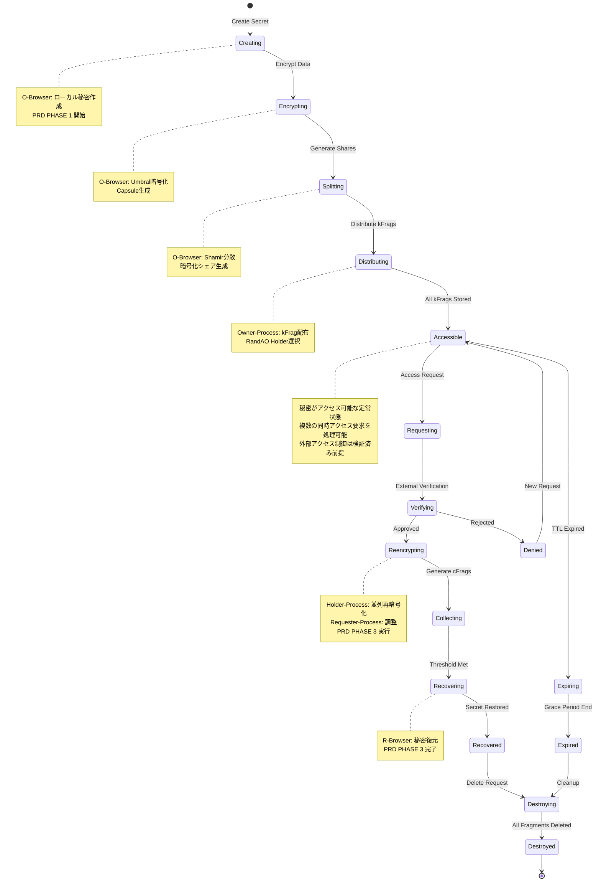

# FORMIX 秘密データライフサイクル詳細

## 1. はじめに

本ドキュメントは、FORMIXシステムにおける秘密データのライフサイクルを詳細に定義します。秘密の作成から破棄までの全フェーズ、各フェーズでの暗号学的処理、アクセス制御、監査要件について説明します。

### 1.1 秘密データの重要性

FORMIXにおける秘密データは、分散型暗号学的秘密管理ライブラリの中核となる保護対象です：

- **機密性**: Threshold Proxy Re-Encryptionによる保護
- **可用性**: k-of-n閾値による分散管理
- **完全性**: 暗号学的検証による改ざん防止
- **追跡可能性**: 全操作の監査ログ
- **AOステートレス対応**: メッセージ間でのメモリ非持続性への対応
- **外部アクセス制御前提**: pk_A検証は外部システムで完了済みと仮定

### 1.2 アーキテクチャ概要

FORMIXの秘密ライフサイクルは、以下のコンポーネント間で管理されます：

#### ブラウザ環境
- **O-Browser**: 秘密の作成、分割、暗号化を実行するデータ所有者のフロントエンド
- **R-Browser**: cFrag収集、復号、秘密復元を実行するデータ利用者のフロントエンド

#### AOプロセス群
- **Owner-Process**: kFragの配布とHolder選択を担当
- **Holder-Process**: kFragの保管と再暗号化（cFrag生成）を実行
- **Requester-Process**: cFragの収集とR-Browserへの配信を調整

#### 実行環境の特性
- **メッセージベース動的ロール**: 単一WASMバイナリがメッセージの役割指定により異なる動作を実行
- **ステートレス実行**: AOネットワークではメッセージ間でメモリが持続しない
- **Arweave永続化**: 全ての状態とデータはArweaveに永続的に保存

## 2. 秘密データライフサイクル全体像

### 2.1 状態遷移図



### 2.2 フェーズ定義

| PRDフェーズ | 状態 | 説明 | 責任コンポーネント |
|-----------|------|------|-------------------|
| **PHASE 1** | Creating | 秘密データの作成開始 | O-Browser |
| **PHASE 1** | Encrypting | Umbralによる暗号化 | O-Browser |
| **PHASE 1** | Splitting | Shamir Secret Sharingによる分割 | O-Browser |
| **PHASE 2** | Distributing | kFragの配布 | Owner-Process → Holder-Process |
| **- ** | Accessible | アクセス可能な定常状態 | All Components |
| **PHASE 3** | Requesting | アクセス要求の作成 | R-Browser |
| **PHASE 3** | Verifying | 外部アクセス制御検証（完了済み前提） | External System |
| **PHASE 3** | Reencrypting | プロキシ再暗号化 | Holder-Process |
| **PHASE 3** | Collecting | cFragの収集 | Requester-Process |
| **PHASE 3** | Recovering | 秘密の復元処理 | R-Browser |
| **PHASE 3** | Recovered | 復元完了 | R-Browser |
| **管理** | Expiring | 有効期限切れ処理中 | System |
| **管理** | Expired | 有効期限切れ | System |
| **管理** | Denied | アクセス拒否 | External System |
| **終了** | Destroying | 破棄処理中 | Owner-Process/System |
| **終了** | Destroyed | 破棄完了 | System |

## 3. Phase 1: 秘密の作成と分割（PRD PHASE 1）

PRD.mdのPHASE 1に対応する処理フローです。O-Browserでローカル処理を行い、Owner-ProcessでkFragの配布を実行します。

### 3.1 秘密生成（O-Browser）

```rust
/// O-Browserでの秘密生成 - PRD Step 1-1
pub fn generate_owner_keys_and_secret(
    secret_data: &[u8],
) -> Result<OwnerSecrets, CreationError> {
    // PRE鍵ペアの生成：秘密鍵 skₒ(PRE), 公開鍵 pkₒ(PRE)
    let (signing_key, verifying_key) = generate_pre_keypair()?;

    // 共通鍵 kₒ の生成
    let common_key = generate_symmetric_key()?;

    // 秘密 f(0) = secret の設定
    let secret = Secret::new(secret_data.to_vec());

    Ok(OwnerSecrets {
        pre_signing_key: signing_key,
        pre_verifying_key: verifying_key,
        common_key,
        secret,
        created_at: current_timestamp(),
    })
}
```

### 3.2 シャミア秘密分散（O-Browser）

```rust
/// シャミア秘密分散による秘密分割 - PRD Step 1-2
pub fn split_secret_with_shamir(
    secret: &Secret,
    threshold_k: u8,
    threshold_n: u8,
) -> Result<ShamirShares, SplitError> {
    // パラメータ検証
    if threshold_k > threshold_n || threshold_k == 0 {
        return Err(SplitError::InvalidThreshold);
    }

    // Shamir Secret Sharing: f(0) → f(1)...f(n)
    let shares = shamir_split(&secret.expose_secret(), threshold_k, threshold_n)?;

    Ok(ShamirShares {
        threshold_k,
        threshold_n,
        shares,
        generated_at: current_timestamp(),
    })
}
```

### 3.3 暗号化シェア生成（O-Browser）

```rust
/// 暗号化シェア生成とカプセル作成 - PRD Step 1-3, 1-4
pub fn create_encrypted_shares_and_capsule(
    shares: &ShamirShares,
    common_key: &SymmetricKey,
    pre_verifying_key: &VerifyingKey,
) -> Result<EncryptedSharesAndCapsule, EncryptionError> {
    // 暗号化シェア生成: n個の Cᵢ = AES_GCM(kₒ, f(i))
    let mut encrypted_shares = Vec::new();
    for (index, share) in shares.shares.iter().enumerate() {
        let encrypted_share = aes_gcm_encrypt(common_key, share)?;
        encrypted_shares.push(EncryptedShare {
            index: index as u8 + 1, // f(1)からf(n)
            ciphertext: encrypted_share,
            tag: generate_share_tag(index as u8 + 1),
        });
    }

    // カプセル生成: Capsuleₒ = PRE_Enc(pkₒ, kₒ)
    let capsule = pre_encrypt(common_key.as_bytes(), pre_verifying_key)?;

    Ok(EncryptedSharesAndCapsule {
        encrypted_shares,
        capsule,
        threshold_k: shares.threshold_k,
        threshold_n: shares.threshold_n,
        created_at: current_timestamp(),
    })
}
```

### 3.4 再暗号化キー生成（O-Browser）

```rust
/// 再暗号化キー生成 - PRD Step 1-5, 1-6, 1-7
pub fn generate_reencryption_key_fragments(
    pre_signing_key: &SigningKey,
    requester_public_key: &VerifyingKey, // 外部アクセス制御で検証済みのpkᴬ
    threshold_k: u8,
    threshold_n: u8,
) -> Result<KFragCollection, ReKeyError> {
    // 再暗号化キー生成: rekey = PRE_ReKey(skₒ → pkᴬ)
    let rekey = generate_reencryption_key(pre_signing_key, requester_public_key)?;

    // kFrag生成: kFragⱼ = Shamir_Split(rekey, k, n)
    let kfrags = shamir_split_rekey(&rekey, threshold_k, threshold_n)?;

    Ok(KFragCollection {
        kfrags,
        threshold_k,
        threshold_n,
        requester_public_key: requester_public_key.clone(),
        generated_at: current_timestamp(),
    })
}
```

### 3.5 Owner-Process配布（AO Network）

```rust
/// Owner-ProcessでのkFrag配布 - PRD Step 1-8
pub fn handle_owner_distribute_kfrags(
    msg: AOMessage,
    repository: &dyn Repository,
) -> Result<AOResponse, HandlerError> {
    // メッセージから配布データを取得
    let kfrag_data: KFragCollection = serde_json::from_slice(&msg.data)?;

    // RandAOを利用してn個のHolder-Processを選出
    let selected_holders = select_holders_with_randao(
        kfrag_data.threshold_n,
        &repository.get_available_holders()?
    )?;

    // 各Holder-Processに kFragⱼ と署名を送信
    let mut distribution_results = Vec::new();
    for (holder_id, kfrag) in selected_holders.into_iter().zip(kfrag_data.kfrags.iter()) {
        let distribution_msg = create_holder_message(
            "store-kfrag",
            &DistributeKFragData {
                kfrag: kfrag.clone(),
                signature: sign_kfrag(kfrag, &msg.sender)?,
                expiration: calculate_expiration(),
            }
        )?;

        // メッセージ送信（AO Network）
        let result = send_ao_message(&holder_id, distribution_msg)?;
        distribution_results.push((holder_id, result));
    }

    Ok(AOResponse::success("kFrags distributed successfully"))
}
```

### 3.6 Arweave永続化

```rust
/// CapsuleとCᵢをArweaveに保存 - PRD Step 1-9
pub async fn store_capsule_and_shares_to_arweave(
    capsule: &Capsule,
    encrypted_shares: &[EncryptedShare],
    tags: &ArweaveTags,
) -> Result<ArweaveStorageResult, StorageError> {
    // Capsuleₒの保存
    let capsule_tx_id = store_data_to_arweave(
        &serialize_capsule(capsule)?,
        &create_capsule_tags(tags)
    ).await?;

    // n個のCᵢの保存
    let mut share_tx_ids = Vec::new();
    for (index, share) in encrypted_shares.iter().enumerate() {
        let share_tx_id = store_data_to_arweave(
            &share.ciphertext,
            &create_share_tags(tags, index as u8 + 1)
        ).await?;
        share_tx_ids.push(share_tx_id);
    }

    Ok(ArweaveStorageResult {
        capsule_tx_id,
        share_tx_ids,
        stored_at: current_timestamp(),
    })
}
```

## 4. PHASE 2: キーフラグメントの分散管理（PRD PHASE 2）

PRD.mdのPHASE 2に対応：Holder-ProcessでのkFrag受信、保存、cFrag生成を実行します。

### 4.1 Holder-ProcessでのkFrag受信・保存

```rust
/// Holder-ProcessでのkFrag受信・保存 - PRD Step 2-3
pub fn handle_holder_store_kfrag(
    msg: AOMessage,
    repository: &dyn Repository,
) -> Result<AOResponse, HandlerError> {
    // kFragデータの取得
    let kfrag_data: DistributeKFragData = serde_json::from_slice(&msg.data)?;

    // 署名検証
    verify_kfrag_signature(&kfrag_data.kfrag, &kfrag_data.signature, &msg.sender)?;

    // kFragをArweaveに保存
    let storage_result = repository.store_kfrag(KFragEntity {
        kfrag_id: generate_kfrag_id(),
        holder_process_id: msg.process_id.clone(),
        owner_process_id: msg.sender.clone(),
        encrypted_kfrag: kfrag_data.kfrag,
        signature: kfrag_data.signature,
        stored_at: current_timestamp(),
        expires_at: kfrag_data.expiration,
        status: KFragStatus::Active,
    })?;

    Ok(AOResponse::success("kFrag stored successfully"))
}
```

### 4.2 Capsule取得と準備

```rust
/// ArweaveからCapsuleₒを取得 - PRD Step 2-4
pub fn handle_holder_prepare_reencryption(
    msg: AOMessage,
    repository: &dyn Repository,
) -> Result<AOResponse, HandlerError> {
    let request_data: PrepareReencryptionData = serde_json::from_slice(&msg.data)?;

    // ArweaveからCapsuleₒを取得
    let capsule = repository.load_capsule_by_tags(&request_data.capsule_tags)?;

    // kFragの存在確認
    let kfrag = repository.load_kfrag(&request_data.kfrag_id)?;

    // 準備完了状態に更新
    repository.update_holder_status(
        &msg.process_id,
        HolderStatus::ReadyForReencryption {
            capsule: capsule.clone(),
            kfrag_id: request_data.kfrag_id,
        }
    )?;

    Ok(AOResponse::success("Ready for reencryption"))
}
```

### 4.3 cFrag生成

```rust
/// cFrag生成と保存 - PRD Step 2-5, 2-6
pub fn handle_holder_generate_cfrag(
    msg: AOMessage,
    repository: &dyn Repository,
) -> Result<AOResponse, HandlerError> {
    let reencryption_request: ReencryptionRequest = serde_json::from_slice(&msg.data)?;

    // Holder状態の確認
    let holder_status = repository.load_holder_status(&msg.process_id)?;

    match holder_status {
        HolderStatus::ReadyForReencryption { capsule, kfrag_id } => {
            // kFragの取得
            let kfrag_entity = repository.load_kfrag(&kfrag_id)?;

            // cFrag生成: cFragⱼ = PRE_ReEnc(kFragⱼ, Capsuleₒ)
            let cfrag = pre_reencrypt(
                &kfrag_entity.encrypted_kfrag,
                &capsule,
                &reencryption_request.requester_public_key
            )?;

            // cFragをArweaveに保存
            let cfrag_entity = CFragEntity {
                cfrag_id: generate_cfrag_id(),
                holder_process_id: msg.process_id.clone(),
                requester_process_id: reencryption_request.requester_process_id,
                cfrag_data: cfrag,
                generated_at: current_timestamp(),
                associated_kfrag_id: kfrag_id,
            };

            repository.store_cfrag(cfrag_entity.clone())?;

            Ok(AOResponse::success_with_data(
                "cFrag generated and stored",
                &cfrag_entity.cfrag_id
            ))
        }
        _ => Err(HandlerError::InvalidState("Holder not ready for reencryption"))
    }
}
```

## 5. PHASE 3: 秘密の復元（PRD PHASE 3）

PRD.mdのPHASE 3に対応：R-Browserでのアクセス要求、cFrag収集、秘密復元を実行します。

### 5.1 R-Browserでのアクセス要求

```rust
/// R-Browserでの復元要求 - PRD Step 3-1
pub fn initiate_recovery_request(
    requester_private_key: &SigningKey,
    requester_public_key: &VerifyingKey, // 外部アクセス制御で検証済み
    secret_id: &SecretId,
) -> Result<RecoveryRequest, RequestError> {
    // 外部アクセス制御は完了済み前提
    // pk_Aは既に検証されているものとする

    let recovery_request = RecoveryRequest {
        secret_id: secret_id.clone(),
        requester_public_key: requester_public_key.clone(),
        request_timestamp: current_timestamp(),
        recovery_session_id: generate_session_id(),
    };

    Ok(recovery_request)
}
```

### 5.2 Requester-ProcessでのcFrag収集

```rust
/// Requester-ProcessでのcFrag収集 - PRD Step 3-2
pub fn handle_requester_collect_cfrags(
    msg: AOMessage,
    repository: &dyn Repository,
) -> Result<AOResponse, HandlerError> {
    let recovery_request: RecoveryRequest = serde_json::from_slice(&msg.data)?;

    // 利用可能なHolder-Processを特定
    let available_holders = repository.find_holders_with_kfrags(&recovery_request.secret_id)?;

    // k個以上のHolder-Processから cFragⱼ を収集
    let mut collected_cfrags = Vec::new();
    let required_threshold = repository.get_secret_threshold(&recovery_request.secret_id)?;

    for holder_id in available_holders.iter() {
        if collected_cfrags.len() >= required_threshold as usize {
            break;
        }

        // Holder-Processにcfrag生成を要求
        let cfrag_request = create_cfrag_request(
            &recovery_request.secret_id,
            &recovery_request.requester_public_key,
            &msg.process_id
        )?;

        match send_ao_message(holder_id, cfrag_request) {
            Ok(response) => {
                if let Some(cfrag_id) = extract_cfrag_id(&response) {
                    collected_cfrags.push(cfrag_id);
                }
            }
            Err(e) => {
                // ログ記録して次のHolderを試行
                log_holder_error(holder_id, &e);
            }
        }
    }

    // 閾値チェック
    if collected_cfrags.len() < required_threshold as usize {
        return Err(HandlerError::InsufficientCFrags {
            required: required_threshold,
            collected: collected_cfrags.len(),
        });
    }

    Ok(AOResponse::success_with_data(
        "cFrags collected successfully",
        &collected_cfrags
    ))
}
```

### 5.3 Requester-ProcessからR-Browserへの送信

```rust
/// Capsuleₒとk個のcFragⱼをR-Browserに送信 - PRD Step 3-3
pub fn handle_requester_send_to_browser(
    msg: AOMessage,
    repository: &dyn Repository,
) -> Result<AOResponse, HandlerError> {
    let send_request: SendToBrowserRequest = serde_json::from_slice(&msg.data)?;

    // Capsuleₒの取得
    let capsule = repository.load_capsule(&send_request.secret_id)?;

    // 収集されたcFragsの取得
    let cfrags = repository.load_cfrags_by_ids(&send_request.cfrag_ids)?;

    // データパッケージの作成
    let recovery_package = RecoveryPackage {
        capsule: capsule.clone(),
        cfrags: cfrags.clone(),
        secret_id: send_request.secret_id.clone(),
        threshold_met: cfrags.len() >= send_request.required_threshold as usize,
        package_id: generate_package_id(),
    };

    // R-Browserへの配信（実装は環境依存）
    deliver_to_browser(&send_request.browser_endpoint, recovery_package)?;

    Ok(AOResponse::success("Recovery package sent to R-Browser"))
}
```

### 5.4 R-Browserでの秘密復元

```rust
/// R-Browserでの秘密復元 - PRD Step 3-4〜3-8
pub fn recover_secret_in_browser(
    recovery_package: &RecoveryPackage,
    requester_private_key: &SigningKey,
) -> Result<RecoveredSecret, RecoveryError> {
    // Capsule′結合処理: Capsule′ = PRE_Combine(Capsuleₒ, cFrag₁…k)
    let combined_capsule = pre_combine_capsule_with_cfrags(
        &recovery_package.capsule,
        &recovery_package.cfrags
    )?;

    // 復号処理: kₒ = PRE_Dec(skᴬ, Capsule′)
    let common_key = pre_decrypt(&combined_capsule, requester_private_key)?;

    // ArweaveからtagsベースでCᵢ (i=1...n)を取得
    let encrypted_shares = fetch_encrypted_shares_from_arweave(&recovery_package.secret_id)?;

    // シェア復号: f(i) = AES_DEC(kₒ, Cᵢ)でk個分復号
    let mut decrypted_shares = Vec::new();
    for (i, encrypted_share) in encrypted_shares.iter().enumerate() {
        if decrypted_shares.len() >= recovery_package.cfrags.len() {
            break; // k個のシェアで充分
        }

        let decrypted_share = aes_gcm_decrypt(&common_key, &encrypted_share.ciphertext)?;
        decrypted_shares.push(ShamirShare {
            index: encrypted_share.index,
            data: decrypted_share,
        });
    }

    // シャミア補間で秘密f(0)を復元
    let recovered_secret = shamir_reconstruct(&decrypted_shares)?;

    Ok(RecoveredSecret {
        secret_data: recovered_secret,
        recovered_at: current_timestamp(),
        verification_hash: compute_hash(&recovered_secret),
        recovery_session_id: recovery_package.package_id.clone(),
    })
}
```

## 6. 有効期限管理

### 6.1 有効期限管理の概要

FORMIXライブラリ内での有効期限管理は、外部システムとの責任分界を明確にしながら実装されます。

### 6.2 AOメッセージベース期限管理

```rust
/// AOメッセージによる期限管理 - ステートレス対応
pub fn handle_expiration_check_message(
    msg: AOMessage,
    repository: &dyn Repository,
) -> Result<AOResponse, HandlerError> {
    let check_request: ExpirationCheckRequest = serde_json::from_slice(&msg.data)?;

    // Arweaveから現在の秘密状態をロード
    let secret_metadata = repository.load_secret_metadata(&check_request.secret_id)?;

    // 期限チェック
    let current_time = current_timestamp();
    match secret_metadata.expiration {
        Some(expiration) if current_time > expiration => {
            // 期限切れ処理
            handle_expired_secret_message(&check_request.secret_id, repository)?;
        }
        Some(expiration) if current_time + EXPIRATION_WARNING_PERIOD > expiration => {
            // 期限切れ警告処理
            handle_expiring_secret_message(&check_request.secret_id, repository)?;
        }
        _ => {
            // 期限内：何もしない
        }
    }

    Ok(AOResponse::success("Expiration check completed"))
}

/// 期限切れ警告の処理（AOメッセージベース）
fn handle_expiring_secret_message(
    secret_id: &SecretId,
    repository: &dyn Repository,
) -> Result<(), HandlerError> {
    // 状態更新
    repository.update_secret_state(secret_id, SecretState::Expiring)?;

    // Owner-Processへの通知メッセージ送信
    let notification_msg = create_expiration_warning_message(secret_id)?;
    send_ao_message(&repository.get_owner_process_id(secret_id)?, notification_msg)?;

    Ok(())
}

/// 期限切れ秘密の処理（AOメッセージベース）
fn handle_expired_secret_message(
    secret_id: &SecretId,
    repository: &dyn Repository,
) -> Result<(), HandlerError> {
    // 状態更新
    repository.update_secret_state(secret_id, SecretState::Expired)?;

    // 新規アクセス要求のブロック
    repository.block_new_access_requests(secret_id)?;

    // 自動破棄設定の確認
    let metadata = repository.load_secret_metadata(secret_id)?;

    if metadata.auto_destroy_on_expiration {
        // 自動破棄メッセージのスケジュール
        schedule_destruction_message(secret_id, DESTRUCTION_DELAY)?;
    }

    Ok(())
}
```

## 7. 秘密の破棄

### 7.1 AOメッセージベース破棄処理

```rust
/// AOメッセージによる秘密破棄処理 - ステートレス対応
pub fn handle_destroy_secret_message(
    msg: AOMessage,
    repository: &dyn Repository,
) -> Result<AOResponse, HandlerError> {
    let destruction_request: DestructionRequest = serde_json::from_slice(&msg.data)?;

    // 権限確認（Owner-Processからのメッセージか確認）
    verify_destruction_permission(&destruction_request.secret_id, &msg.sender, repository)?;

    // 現在の状態をロード
    let mut secret_metadata = repository.load_secret_metadata(&destruction_request.secret_id)?;

    // 破棄不可能な状態チェック
    if !can_destroy_secret(&secret_metadata, &destruction_request) {
        return Err(HandlerError::InvalidState("Cannot destroy secret in current state"));
    }

    // 状態を破棄中に更新
    secret_metadata.state = SecretState::Destroying;
    repository.save_secret_metadata(&secret_metadata)?;

    // 破棄プロセスの実行
    let destruction_result = execute_destruction_process(&destruction_request.secret_id, repository)?;

    // 最終状態の更新
    secret_metadata.state = SecretState::Destroyed;
    secret_metadata.destroyed_at = Some(current_timestamp());
    repository.save_secret_metadata(&secret_metadata)?;

    Ok(AOResponse::success_with_data(
        "Secret destroyed successfully",
        &destruction_result.destruction_id
    ))
}

/// 破棄処理の実行
async fn execute_destruction(secret_id: &SecretId) -> Result<DestructionLog, DestructionError> {
    let mut log = DestructionLog::new(secret_id);
    
    // 1. kFragsの削除
    let kfrags = find_all_kfrags(secret_id).await?;
    for kfrag in kfrags {
        // Holderへの削除要求
        match request_kfrag_deletion(&kfrag).await {
            Ok(()) => log.record_kfrag_deleted(kfrag.kfrag_id),
            Err(e) => log.record_kfrag_deletion_failed(kfrag.kfrag_id, e),
        }
    }
    
    // 2. シェアの削除
    let shares = find_all_shares(secret_id).await?;
    for share in shares {
        secure_delete_share(&share).await?;
        log.record_share_deleted(share.share_id);
    }
    
    // 3. カプセルの削除
    let capsule = find_capsule(secret_id).await?;
    secure_delete_capsule(&capsule).await?;
    log.record_capsule_deleted(capsule.capsule_id);
    
    // 4. メタデータのアーカイブ
    archive_secret_metadata(secret_id).await?;
    log.record_metadata_archived();
    
    // 5. 関連するアクセスログのアーカイブ
    archive_access_logs(secret_id).await?;
    
    Ok(log)
}

/// Holderへのkfrag削除要求
async fn request_kfrag_deletion(kfrag: &RekeyFragmentEntity) -> Result<(), DeletionError> {
    let message = Message {
        tags: vec![
            ("Action", "Delete-KFrag"),
            ("KFrag-Id", &kfrag.kfrag_id.to_string()),
            ("Secret-Id", &kfrag.secret_id.to_string()),
        ].into_iter()
        .map(|(k, v)| (k.to_string(), v.to_string()))
        .collect(),
        data: vec![],
        ..Default::default()
    };
    
    // タイムアウト付き削除要求
    match timeout(DELETION_TIMEOUT, send_to_holder(&kfrag.holder_id, message)).await {
        Ok(Ok(response)) if is_deletion_ack(&response) => Ok(()),
        Ok(Ok(_)) => Err(DeletionError::InvalidResponse),
        Ok(Err(e)) => Err(DeletionError::CommunicationError(e)),
        Err(_) => Err(DeletionError::Timeout),
    }
}

/// 安全なデータ削除
async fn secure_delete_share(share: &ShareEntity) -> Result<(), SecureDeleteError> {
    // メモリ上のデータのゼロ化
    let mut share_data = load_share_data(&share.share_id).await?;
    secure_zero_memory(&mut share_data);
    
    // Arweaveからの論理削除（メタデータの更新）
    mark_as_deleted(&share.share_id).await?;
    
    // 削除証跡の記録
    record_deletion_audit(&share.share_id, "share").await?;
    
    Ok(())
}
```

## 8. エラー処理とリカバリー

### 8.1 AOステートレス環境でのエラー処理

AOネットワークのステートレス実行環境に特化したエラー処理パターンです。

### 8.2 メッセージベースエラーハンドリング

```rust
/// AOメッセージ処理でのエラーハンドリングパターン
pub fn handle_message_with_error_recovery(
    msg: AOMessage,
    repository: &dyn Repository,
) -> Result<AOResponse, HandlerError> {
    // 1. 状態ロード（エラー時は初期状態とする）
    let mut process_state = repository.load_process_state(&msg.process_id)
        .unwrap_or_else(|_| ProcessState::default());

    // 2. メッセージ処理の試行
    let result = match process_message(&msg, &mut process_state, repository) {
        Ok(response) => {
            // 成功時：状態を永続化
            repository.save_process_state(&msg.process_id, &process_state)?;
            Ok(response)
        }
        Err(e) => {
            // 失敗時：エラーに応じた回復処理
            handle_processing_error(e, &msg, &mut process_state, repository)
        }
    };

    result
}

/// 処理エラーの回復
fn handle_processing_error(
    error: ProcessingError,
    msg: &AOMessage,
    state: &mut ProcessState,
    repository: &dyn Repository,
) -> Result<AOResponse, HandlerError> {
    match error {
        ProcessingError::StateCorruption => {
            // 状態破損：Arweaveから最新状態を再取得
            *state = repository.recover_state_from_arweave(&msg.process_id)?;
            Ok(AOResponse::error("State recovered, please retry"))
        }
        ProcessingError::InsufficientData => {
            // データ不足：必要なデータを再要求
            Ok(AOResponse::error("Insufficient data, please provide complete information"))
        }
        ProcessingError::CryptoError(crypto_err) => {
            // 暗号エラー：セキュリティ監査ログに記録
            audit_crypto_error(&crypto_err, &msg.process_id);
            Err(HandlerError::CryptographicFailure)
        }
        _ => Err(HandlerError::UnrecoverableError(error))
    }
}
```

### 8.3 状態不整合の検出と修復

```rust
/// 秘密の状態整合性チェック
pub async fn verify_secret_consistency(secret_id: &SecretId) -> Result<ConsistencyReport, ConsistencyError> {
    let mut report = ConsistencyReport::new(secret_id);
    
    // メタデータの存在確認
    let metadata = match load_secret_metadata(secret_id).await {
        Ok(m) => m,
        Err(_) => {
            report.add_issue(ConsistencyIssue::MissingMetadata);
            return Ok(report);
        }
    };
    
    // 状態に応じた整合性チェック
    match metadata.state {
        SecretState::Accessible => {
            // kFragsの確認
            let kfrags = find_active_kfrags(secret_id).await?;
            if kfrags.len() < metadata.threshold_k as usize {
                report.add_issue(ConsistencyIssue::InsufficientKFrags {
                    expected: metadata.threshold_k,
                    actual: kfrags.len(),
                });
            }
            
            // カプセルの確認
            if find_capsule(secret_id).await.is_err() {
                report.add_issue(ConsistencyIssue::MissingCapsule);
            }
        }
        SecretState::Splitting => {
            // タイムアウトチェック
            if metadata.updated_at + SPLITTING_TIMEOUT < SystemTime::now() {
                report.add_issue(ConsistencyIssue::StuckInSplitting);
            }
        }
        _ => {}
    }
    
    Ok(report)
}

/// 自動修復の試行
pub async fn attempt_auto_repair(
    secret_id: &SecretId,
    issues: &[ConsistencyIssue],
) -> Result<RepairResult, RepairError> {
    let mut result = RepairResult::new();
    
    for issue in issues {
        match issue {
            ConsistencyIssue::InsufficientKFrags { expected, actual } => {
                // 追加のHolderを探して再配布
                match redistribute_kfrags(secret_id, expected - actual).await {
                    Ok(new_holders) => {
                        result.record_success(
                            issue.clone(),
                            format!("Redistributed to {} new holders", new_holders.len())
                        );
                    }
                    Err(e) => {
                        result.record_failure(issue.clone(), e);
                    }
                }
            }
            ConsistencyIssue::StuckInSplitting => {
                // 状態のリセットまたは再試行
                match reset_splitting_state(secret_id).await {
                    Ok(()) => {
                        result.record_success(
                            issue.clone(),
                            "Reset to previous state".to_string()
                        );
                    }
                    Err(e) => {
                        result.record_failure(issue.clone(), e);
                    }
                }
            }
            _ => {
                result.record_failure(
                    issue.clone(),
                    RepairError::NotRepairable
                );
            }
        }
    }
    
    Ok(result)
}
```

## 9. セキュリティ考慮事項

### 8.1 暗号学的保証

```rust
/// 秘密ライフサイクルのセキュリティ検証
pub struct SecurityValidator {
    /// 暗号パラメータの検証
    crypto_validator: CryptoValidator,
    /// アクセス制御の検証
    access_validator: AccessValidator,
    /// 監査ログの検証
    audit_validator: AuditValidator,
}

impl SecurityValidator {
    /// Phase 1: 作成時のセキュリティ検証
    pub async fn validate_creation(
        &self,
        secret_params: &SecretCreationParams,
    ) -> Result<(), SecurityError> {
        // 閾値パラメータの安全性
        self.crypto_validator.validate_threshold(
            secret_params.threshold_k,
            secret_params.threshold_n,
        )?;
        
        // 暗号鍵の強度
        self.crypto_validator.validate_key_strength(
            &secret_params.owner_public_key,
        )?;
        
        // アクセス条件の妥当性
        self.access_validator.validate_conditions(
            &secret_params.access_conditions,
        )?;
        
        Ok(())
    }
    
    /// Phase 4: 再暗号化時のセキュリティ検証
    pub async fn validate_reencryption(
        &self,
        request: &AccessRequestEntity,
        cfrags: &[CipherFragment],
    ) -> Result<(), SecurityError> {
        // cFragの暗号学的検証
        for cfrag in cfrags {
            self.crypto_validator.verify_cfrag(
                cfrag,
                &request.requester_public_key,
            )?;
        }
        
        // 閾値の確認
        if cfrags.len() < request.threshold as usize {
            return Err(SecurityError::InsufficientCFrags);
        }
        
        // 重複チェック
        if has_duplicate_cfrags(cfrags) {
            return Err(SecurityError::DuplicateCFrags);
        }
        
        Ok(())
    }
}
```

### 8.2 プライバシー保護

```rust
/// プライバシー保護メカニズム
pub struct PrivacyProtection {
    /// メタデータの最小化
    metadata_minimizer: MetadataMinimizer,
    /// アクセスパターンの隠蔽
    access_obfuscator: AccessObfuscator,
}

impl PrivacyProtection {
    /// アクセスパターンの隠蔽
    pub async fn obfuscate_access_pattern(
        &self,
        request_id: &AccessRequestId,
    ) -> Result<(), PrivacyError> {
        // ダミーリクエストの生成
        let dummy_requests = self.access_obfuscator
            .generate_dummy_requests(OBFUSCATION_LEVEL)?;
        
        // 実際のリクエストと混合
        let mixed_requests = self.access_obfuscator
            .mix_requests(request_id, dummy_requests)?;
        
        // バッチ処理
        process_mixed_requests(mixed_requests).await?;
        
        Ok(())
    }
    
    /// メタデータの最小化
    pub fn minimize_metadata(
        &self,
        metadata: &mut SecretMetadata,
    ) {
        // 不要な情報の削除
        self.metadata_minimizer.remove_unnecessary_fields(metadata);
        
        // 識別子の匿名化
        self.metadata_minimizer.anonymize_identifiers(metadata);
    }
}
```

## 10. パフォーマンス最適化

### 9.1 並列処理の活用

```rust
/// 並列kFrag配布
pub async fn parallel_kfrag_distribution(
    secret_id: &SecretId,
    distributions: Vec<(ProcessId, RekeyFragmentEntity)>,
) -> DistributionSummary {
    let semaphore = Arc::new(Semaphore::new(MAX_CONCURRENT_DISTRIBUTIONS));
    
    let distribution_tasks: Vec<_> = distributions
        .into_iter()
        .map(|(holder_id, kfrag)| {
            let sem = semaphore.clone();
            async move {
                let _permit = sem.acquire().await.unwrap();
                distribute_single_kfrag(holder_id, kfrag).await
            }
        })
        .collect();
    
    let results = futures::future::join_all(distribution_tasks).await;
    
    DistributionSummary::from_results(results)
}
```

### 9.2 キャッシング戦略

```rust
/// 秘密メタデータのキャッシング
pub struct SecretCache {
    metadata_cache: Arc<RwLock<LruCache<SecretId, SecretMetadata>>>,
    kfrag_cache: Arc<RwLock<HashMap<SecretId, Vec<KFragLocation>>>>,
}

impl SecretCache {
    pub async fn get_metadata(
        &self,
        secret_id: &SecretId,
    ) -> Result<SecretMetadata, CacheError> {
        // キャッシュチェック
        {
            let cache = self.metadata_cache.read().await;
            if let Some(metadata) = cache.get(secret_id) {
                return Ok(metadata.clone());
            }
        }
        
        // キャッシュミス時はロード
        let metadata = load_secret_metadata(secret_id).await?;
        
        // キャッシュに追加
        {
            let mut cache = self.metadata_cache.write().await;
            cache.put(secret_id.clone(), metadata.clone());
        }
        
        Ok(metadata)
    }
}
```

## 11. 監査とコンプライアンス

### 10.1 包括的な監査ログ

```rust
/// 秘密ライフサイクルの監査
#[derive(Debug, Serialize)]
pub struct SecretAuditLog {
    pub timestamp: SystemTime,
    pub secret_id: SecretId,
    pub event_type: SecretEvent,
    pub actor: ProcessId,
    pub from_state: SecretState,
    pub to_state: SecretState,
    pub metadata: AuditMetadata,
}

#[derive(Debug, Serialize)]
pub enum SecretEvent {
    Created {
        threshold_k: u8,
        threshold_n: u8,
    },
    Encrypted {
        algorithm: String,
        key_size: usize,
    },
    Split {
        share_count: usize,
    },
    Distributed {
        holder_count: usize,
        successful: usize,
    },
    Accessed {
        requester: ProcessId,
        purpose: String,
    },
    Recovered {
        cfrags_used: usize,
        duration: Duration,
    },
    Expired {
        original_expiration: SystemTime,
        grace_period: Option<Duration>,
    },
    Destroyed {
        reason: String,
        permanent: bool,
    },
}

/// 監査ログの永続化と分析
pub async fn persist_audit_log(log: SecretAuditLog) -> Result<(), AuditError> {
    // Arweaveへの永続化
    let tx_id = store_to_arweave(&log).await?;
    
    // インデックスの更新
    update_audit_index(&log.secret_id, &log.event_type, &tx_id).await?;
    
    // リアルタイム分析
    analyze_security_events(&log).await?;
    
    // コンプライアンスレポート
    if requires_compliance_reporting(&log.event_type) {
        generate_compliance_report(&log).await?;
    }
    
    Ok(())
}
```

## まとめ

FORMIXの秘密データライフサイクル管理は、PRD.mdの更新に合わせて分散型暗号学的秘密管理ライブラリとして最適化されました。

### 主要な更新点

1. **ブラウザ・AOプロセス分離**: O-Browser/R-BrowserとAOプロセス群の明確な役割分担
2. **外部アクセス制御前提**: pk_A検証を外部システムに委譲し、システム複雑性を削減
3. **AOステートレス対応**: メッセージ間でのメモリ非持続性に対応した実装パターン
4. **PRDフェーズ整合**: PHASE 1-3との完全な対応関係を確立

### セキュリティ特性の保証

1. **機密性**: Threshold Proxy Re-Encryptionによる暗号学的保護
2. **可用性**: k-of-n閾値による分散耐障害性
3. **完全性**: 全フェーズでの暗号学的検証
4. **監査性**: FORMIX内部処理の完全なトレーサビリティ
5. **外部連携**: 外部アクセス制御システムとの明確な責任分界

これらの特性により、純粋な暗号学的ライブラリとして、実装とテストが簡素化された安全な秘密管理を実現します。

---

**Document Status**: Secret Lifecycle Specification (Updated for PRD v2.0)
**Version**: 2.0
**Last Updated**: 2025-01-26
**Dependencies**: PRD.md, lifecycle_overview.md