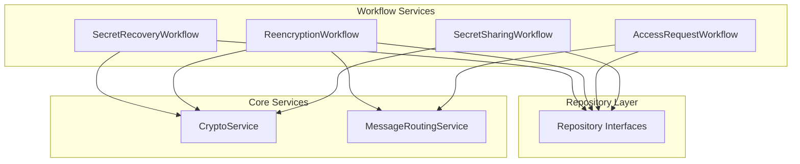
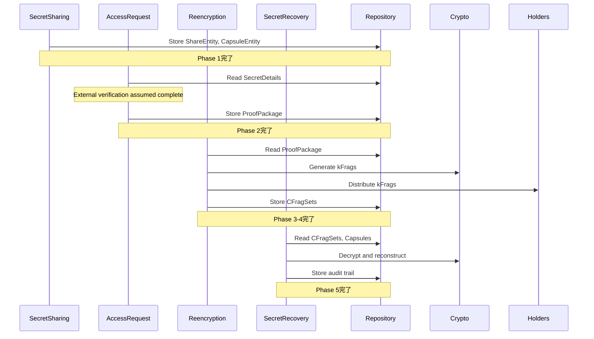

# FORMIX Workflow Service層設計

## 1. 概要

Workflow Service層は、PRD（Product Requirements Document）で定義された各フェーズのビジネスロジックを実装するサービス群です。Core Serviceを組み合わせて、エンドツーエンドのワークフローを実現します。

## 2. Workflow Serviceの設計原則

### 2.1 フェーズ中心の設計

- **PRDフェーズとの対応**: 各Workflow ServiceはPRDの特定フェーズに対応
- **ビジネスフロー制御**: フェーズ内の複雑な処理フローを管理
- **トランザクション境界**: ビジネス上の整合性を保証する単位を定義

### 2.2 Core Serviceとの関係



### 2.3 プロセス管理のアプローチ

FORMIXでは、AOのステートレス実行環境に適応するため、ProcessManagementServiceを実装せず、以下のアプローチでプロセス管理を行います：

1. **Domain層でのビジネスロジック**
   - ProcessEntityがプロセス状態管理のメソッドを提供
   - ロール互換性チェック、信頼性スコア計算などはエンティティメソッドで実装

2. **Repository層での永続化**
   - ProcessEntityRepositoryがプロセス状態の保存・取得を担当
   - AOステートレス環境に適した状態管理

3. **Workflow層での直接管理**
   - 各WorkflowServiceがRepository層を直接利用
   - 必要なビジネスロジックをワークフロー内で実装

これにより、AOのメッセージ駆動・ステートレス実行環境に適合した、シンプルで保守性の高い設計を実現します。

## 3. SecretSharingWorkflowService (Phase 1)

### 3.1 概要

SecretSharingWorkflowServiceは、PRD Phase 1（秘密の暗号化と分割）のビジネスロジックを実装します。O-Browserから受信した秘密データを、Shamir Secret SharingとProxy Re-Encryptionを使用して安全に分割・暗号化し、Arweaveに保存します。

### 3.2 インターフェース定義

```rust
use async_trait::async_trait;
use crate::domain::entity::{SecretEntity, ShareEntity, CapsuleEntity, SecretDetailsEntity};
use crate::domain::error::WorkflowError;

#[async_trait]
pub trait SecretSharingWorkflowService: Send + Sync {
    /// 秘密の暗号化・分割・保存の完全なワークフロー
    async fn execute_secret_sharing(
        &self,
        request: SecretSharingRequest,
    ) -> Result<SecretSharingResult, WorkflowError>;
    
    /// 既存秘密の更新
    async fn update_secret(
        &self,
        secret_id: &str,
        update_request: SecretUpdateRequest,
    ) -> Result<(), WorkflowError>;
    
    /// 秘密の無効化
    async fn revoke_secret(
        &self,
        secret_id: &str,
        revocation_reason: String,
    ) -> Result<(), WorkflowError>;
    
    /// 秘密のステータス確認
    async fn get_secret_status(
        &self,
        secret_id: &str,
    ) -> Result<SecretStatus, WorkflowError>;
}

#[derive(Debug, Clone)]
pub struct SecretSharingRequest {
    pub secret_data: Vec<u8>,
    pub owner_public_key: Vec<u8>,
    pub shamir_config: ShamirConfig,
    pub access_control_conditions: Vec<String>,
    pub metadata: HashMap<String, String>,
}

#[derive(Debug, Clone)]
pub struct ShamirConfig {
    pub threshold: u8,      // k値
    pub total_shares: u8,   // n値
}

#[derive(Debug, Clone)]
pub struct SecretSharingResult {
    pub secret_id: String,
    pub share_entities: Vec<ShareEntity>,
    pub capsule_entities: Vec<CapsuleEntity>,
    pub secret_details: SecretDetailsEntity,
    pub arweave_transactions: Vec<String>,
}
```

### 3.3 ワークフロー実装

```rust
pub struct SecretSharingWorkflowServiceImpl {
    crypto_service: Arc<dyn CryptoService>,
    share_repository: Arc<dyn ShareEntityRepository>,
    capsule_repository: Arc<dyn CapsuleEntityRepository>,
    secret_details_repository: Arc<dyn SecretDetailsEntityRepository>,
    process_repository: Arc<dyn ProcessEntityRepository>,
}

#[async_trait]
impl SecretSharingWorkflowService for SecretSharingWorkflowServiceImpl {
    async fn execute_secret_sharing(
        &self,
        request: SecretSharingRequest,
    ) -> Result<SecretSharingResult, WorkflowError> {
        // 1. 入力検証
        self.validate_request(&request)?;
        
        // 2. 秘密IDの生成
        let secret_id = generate_secret_id();
        
        // 3. Shamir Secret Sharing
        let shares = self.crypto_service
            .split_secret_shamir(
                &request.secret_data,
                request.shamir_config.threshold,
                request.shamir_config.total_shares,
            )
            .await
            .map_err(|e| WorkflowError::CryptoError(e))?;
        
        // 4. 各シェアの暗号化とCapsule生成
        let mut share_entities = Vec::new();
        let mut capsule_entities = Vec::new();
        let mut arweave_txs = Vec::new();
        
        for (index, share) in shares.iter().enumerate() {
            // PRE暗号化
            let (capsule, ciphertext) = self.crypto_service
                .create_pre_capsule(&PublicKey::from_bytes(&request.owner_public_key)?, &share.data)
                .await?;
            
            // ShareEntity作成
            let share_entity = ShareEntity {
                share_id: format!("{}-{}", secret_id, index),
                secret_id: secret_id.clone(),
                share_index: index as u8,
                encrypted_share: ciphertext,
                threshold: request.shamir_config.threshold,
                total_shares: request.shamir_config.total_shares,
                created_at: current_timestamp(),
            };
            
            // CapsuleEntity作成
            let capsule_entity = CapsuleEntity {
                capsule_id: generate_capsule_id(),
                secret_id: secret_id.clone(),
                share_index: index as u8,
                capsule_data: capsule.to_bytes(),
                created_at: current_timestamp(),
            };
            
            // Repositoryに保存
            self.share_repository
                .create(&share_entity)
                .await
                .map_err(|e| WorkflowError::RepositoryError(e))?;
            
            self.capsule_repository
                .create(&capsule_entity)
                .await
                .map_err(|e| WorkflowError::RepositoryError(e))?;
            
            share_entities.push(share_entity);
            capsule_entities.push(capsule_entity);
            arweave_txs.push(format!("share-{}", index));
            arweave_txs.push(format!("capsule-{}", index));
        }
        
        // 5. SecretDetailsEntityの作成と保存
        let secret_details = SecretDetailsEntity {
            secret_id: secret_id.clone(),
            owner_process_id: request.metadata.get("owner_process_id")
                .ok_or(WorkflowError::ValidationError("Missing owner_process_id".into()))?,
            access_control_conditions: request.access_control_conditions.clone(),
            shamir_threshold: request.shamir_config.threshold,
            total_shares: request.shamir_config.total_shares,
            metadata: request.metadata.clone(),
            created_at: current_timestamp(),
            status: SecretStatus::Active,
        };
        
        self.secret_details_repository
            .create(&secret_details)
            .await
            .map_err(|e| WorkflowError::RepositoryError(e))?;
        
        arweave_txs.push(format!("secret-details-{}", secret_id));
        
        // 6. ProcessEntityの更新（Repository層で直接管理）
        let mut process = self.process_repository
            .find_by_id(&secret_details.owner_process_id)
            .await
            .map_err(|e| WorkflowError::RepositoryError(e))?
            .ok_or(WorkflowError::ValidationError("Process not found".into()))?;

        // ProcessEntityのドメインメソッドを使用
        process.add_secret_index(SecretIndex {
            secret_id: secret_id.clone(),
            created_at: current_timestamp(),
            status: SecretStatus::Active,
        })?;

        self.process_repository
            .update(&process)
            .await
            .map_err(|e| WorkflowError::RepositoryError(e))?;
        
        Ok(SecretSharingResult {
            secret_id,
            share_entities,
            capsule_entities,
            secret_details,
            arweave_transactions: arweave_txs,
        })
    }
}
```

### 3.4 エラーハンドリング

```rust
impl SecretSharingWorkflowServiceImpl {
    fn validate_request(&self, request: &SecretSharingRequest) -> Result<(), WorkflowError> {
        // しきい値検証
        if request.shamir_config.threshold > request.shamir_config.total_shares {
            return Err(WorkflowError::ValidationError(
                "Threshold cannot exceed total shares".into()
            ));
        }
        
        if request.shamir_config.threshold == 0 {
            return Err(WorkflowError::ValidationError(
                "Threshold must be at least 1".into()
            ));
        }
        
        // データサイズ検証
        if request.secret_data.is_empty() {
            return Err(WorkflowError::ValidationError(
                "Secret data cannot be empty".into()
            ));
        }
        
        if request.secret_data.len() > MAX_SECRET_SIZE {
            return Err(WorkflowError::ValidationError(
                format!("Secret data exceeds maximum size of {} bytes", MAX_SECRET_SIZE)
            ));
        }
        
        Ok(())
    }
}
```

## 4. AccessRequestWorkflowService (Phase 2)

### 4.1 概要

AccessRequestWorkflowServiceは、PRD Phase 2（アクセス要求処理）のビジネスロジックを実装します。R-Browserからのアクセス要求を処理し、外部アクセス制御で検証済みという前提でProofPackageを生成します。

### 4.2 インターフェース定義

```rust
#[async_trait]
pub trait AccessRequestWorkflowService: Send + Sync {
    /// アクセス要求の処理
    async fn process_access_request(
        &self,
        request: AccessRequest,
    ) -> Result<AccessRequestResult, WorkflowError>;
    
    /// 外部検証済み前提でProofPackage作成準備
    async fn prepare_proof_with_external_verification(
        &self,
        secret_id: &str,
        accessor_process_id: &str,
    ) -> Result<VerificationContext, WorkflowError>;
    
    /// ProofPackageの生成
    async fn generate_proof_package(
        &self,
        secret_id: &str,
        accessor_process_id: &str,
        verification_result: &VerificationResult,
    ) -> Result<ProofPackage, WorkflowError>;
    
    /// アクセス要求のステータス確認
    async fn get_request_status(
        &self,
        request_id: &str,
    ) -> Result<RequestStatus, WorkflowError>;
}

#[derive(Debug, Clone)]
pub struct AccessRequest {
    pub secret_id: String,
    pub accessor_process_id: String,
    pub accessor_public_key: Vec<u8>,
    pub request_metadata: HashMap<String, String>,
}

#[derive(Debug, Clone)]
pub struct ProofPackage {
    pub request_id: String,
    pub secret_id: String,
    pub accessor_process_id: String,
    pub verification_context: VerificationContext,
    pub owner_signature: Vec<u8>,
    pub timestamp: u64,
}

#[derive(Debug, Clone)]
pub struct VerificationContext {
    pub secret_id: String,
    pub accessor_process_id: String,
    pub timestamp: u64,
    pub external_verification_complete: bool,
}
```

### 4.3 ワークフロー実装

```rust
pub struct AccessRequestWorkflowServiceImpl {
    routing_service: Arc<dyn MessageRoutingService>,
    secret_details_repository: Arc<dyn SecretDetailsEntityRepository>,
    proof_package_repository: Arc<dyn ProofPackageRepository>,
    process_repository: Arc<dyn ProcessEntityRepository>,
}

#[async_trait]
impl AccessRequestWorkflowService for AccessRequestWorkflowServiceImpl {
    async fn process_access_request(
        &self,
        request: AccessRequest,
    ) -> Result<AccessRequestResult, WorkflowError> {
        // 1. 秘密の詳細情報を取得
        let secret_details = self.secret_details_repository
            .find_by_secret_id(&request.secret_id)
            .await
            .map_err(|e| WorkflowError::RepositoryError(e))?
            .ok_or(WorkflowError::ValidationError("Secret not found".into()))?;
        
        // 2. アクセス要求の検証
        self.validate_access_request(&request, &secret_details)?;
        
        // 3. 外部検証済み前提でProofPackage準備
        let verification_context = self.prepare_proof_with_external_verification(
            &request.secret_id,
            &request.accessor_process_id,
        ).await?;
        
        // 4. Owner Processへの通知
        let owner_response = self.notify_owner(
            &secret_details.owner_process_id,
            &request,
            &verification_context,
        ).await?;

        // 5. ProofPackageの生成
        let proof_package = self.generate_proof_package(
            &request.secret_id,
            &request.accessor_process_id,
            &verification_context,
        ).await?;
        
        // 6. ProofPackageの保存
        self.proof_package_repository
            .create(&proof_package)
            .await
            .map_err(|e| WorkflowError::RepositoryError(e))?;
        
        Ok(AccessRequestResult {
            request_id: proof_package.request_id.clone(),
            proof_package,
            arweave_transaction: format!("proof-package-{}", proof_package.request_id),
        })
    }
    
    async fn prepare_proof_with_external_verification(
        &self,
        secret_id: &str,
        accessor_process_id: &str,
    ) -> Result<VerificationContext, WorkflowError> {
        // 外部アクセス制御で検証済みという前提で動作
        // pk_A（accessor公開鍵）の検証は外部システムで完了済み
        Ok(VerificationContext {
            secret_id: secret_id.to_string(),
            accessor_process_id: accessor_process_id.to_string(),
            timestamp: current_timestamp(),
            external_verification_complete: true,
        })
    }
}
```

### 4.4 Owner通知とProofPackage生成

```rust
impl AccessRequestWorkflowServiceImpl {
    async fn notify_owner(
        &self,
        owner_process_id: &str,
        request: &AccessRequest,
        verification: &VerificationContext,
    ) -> Result<OwnerResponse, WorkflowError> {
        let notification = ProcessMessage {
            message_type: MessageType::AccessRequest,
            payload: bincode::serialize(&AccessNotification {
                secret_id: request.secret_id.clone(),
                accessor_process_id: request.accessor_process_id.clone(),
                accessor_public_key: request.accessor_public_key.clone(),
                verification_context: verification.clone(),
            })?,
            tags: hashmap! {
                "Type" => "AccessNotification",
                "SecretId" => request.secret_id.clone(),
            },
            created_at: current_timestamp(),
        };
        
        let message_id = self.routing_service
            .send_message(owner_process_id, notification)
            .await?;
        
        // Owner応答を待機
        let responses = self.routing_service
            .wait_for_responses(&[message_id], Duration::from_secs(30))
            .await?;
        
        let owner_response: OwnerResponse = bincode::deserialize(&responses[0].payload)?;
        
        Ok(owner_response)
    }
}
```

## 5. ReencryptionWorkflowService (Phase 3-4)

### 5.1 概要

ReencryptionWorkflowServiceは、PRD Phase 3（再暗号化キー生成とkFrag配布）およびPhase 4（プロキシ再暗号化とcFrag収集）のビジネスロジックを実装します。

### 5.2 インターフェース定義

```rust
#[async_trait]
pub trait ReencryptionWorkflowService: Send + Sync {
    /// 再暗号化キー生成とkFrag配布（Phase 3）
    async fn generate_and_distribute_kfrags(
        &self,
        request: KFragGenerationRequest,
    ) -> Result<KFragDistributionResult, WorkflowError>;
    
    /// プロキシ再暗号化の実行とcFrag収集（Phase 4）
    async fn execute_reencryption(
        &self,
        request: ReencryptionRequest,
    ) -> Result<ReencryptionResult, WorkflowError>;
    
    /// Holder選定
    async fn select_holders(
        &self,
        required_count: usize,
        capacity_requirement: u64,
    ) -> Result<Vec<HolderInfo>, WorkflowError>;
    
    /// 再暗号化ステータス確認
    async fn get_reencryption_status(
        &self,
        request_id: &str,
    ) -> Result<ReencryptionStatus, WorkflowError>;
}

#[derive(Debug, Clone)]
pub struct KFragGenerationRequest {
    pub secret_id: String,
    pub owner_secret_key: Vec<u8>,  // 暗号化されたOwner秘密鍵
    pub accessor_public_key: Vec<u8>,
    pub threshold: u8,
    pub total_fragments: u8,
}

#[derive(Debug, Clone)]
pub struct ReencryptionRequest {
    pub secret_id: String,
    pub accessor_process_id: String,
    pub proof_package: ProofPackage,
    pub holder_assignments: Vec<HolderAssignment>,
}
```

### 5.3 Phase 3: kFrag生成と配布

```rust
pub struct ReencryptionWorkflowServiceImpl {
    crypto_service: Arc<dyn CryptoService>,
    routing_service: Arc<dyn MessageRoutingService>,
    kfrag_repository: Arc<dyn KeyFragmentEntityRepository>,
    cfrag_set_repository: Arc<dyn CFragSetEntityRepository>,
    capsule_repository: Arc<dyn CapsuleEntityRepository>,
    process_repository: Arc<dyn ProcessEntityRepository>,
    secret_details_repository: Arc<dyn SecretDetailsEntityRepository>,
}

impl ReencryptionWorkflowServiceImpl {
    async fn generate_and_distribute_kfrags(
        &self,
        request: KFragGenerationRequest,
    ) -> Result<KFragDistributionResult, WorkflowError> {
        // 1. 再暗号化キー生成
        let owner_sk = SecretKey::from_bytes(&request.owner_secret_key)?;
        let accessor_pk = PublicKey::from_bytes(&request.accessor_public_key)?;
        
        let reencryption_key = self.crypto_service
            .generate_reencryption_key(&owner_sk, &accessor_pk)
            .await?;
        
        // 2. kFrag生成（Shamir分割）
        let kfrags = self.crypto_service
            .create_kfrags(
                &reencryption_key,
                request.threshold,
                request.total_fragments,
            )
            .await?;
        
        // 3. Holder選定（Repository層を直接使用）
        let holders = self.routing_service
            .discover_online_processes(
                Some(ProcessRole::Holder { capacity: 0 }),
                Some(MIN_HOLDER_CAPACITY),
            )
            .await?;
        
        // 4. kFrag配布
        let mut distribution_results = Vec::new();
        let mut distribution_messages = Vec::new();
        
        for (kfrag, holder) in kfrags.iter().zip(holders.iter()) {
            let kfrag_entity = KeyFragmentEntity {
                kfrag_id: generate_kfrag_id(),
                secret_id: request.secret_id.clone(),
                holder_process_id: holder.process_id.clone(),
                fragment_index: distribution_results.len() as u8,
                encrypted_kfrag: self.encrypt_kfrag_for_holder(kfrag, &holder.public_key)?,
                created_at: current_timestamp(),
            };
            
            // Repositoryに保存
            self.kfrag_repository
                .create(&kfrag_entity)
                .await
                .map_err(|e| WorkflowError::RepositoryError(e))?;
            
            let kfrag_tx = format!("kfrag-{}", kfrag_entity.kfrag_id);
            
            // Holderへの配布メッセージ
            let distribution_msg = ProcessMessage {
                message_type: MessageType::DistributeKFrag,
                payload: bincode::serialize(&KFragDistribution {
                    kfrag_id: kfrag_entity.kfrag_id.clone(),
                    secret_id: request.secret_id.clone(),
                    fragment_data: kfrag_entity.encrypted_kfrag.clone(),
                    arweave_tx: kfrag_tx.to_string(),
                })?,
                tags: hashmap! {
                    "Type" => "KFragDistribution",
                    "SecretId" => request.secret_id.clone(),
                },
                created_at: current_timestamp(),
            };
            
            let msg_id = self.routing_service
                .send_message(&holder.process_id, distribution_msg)
                .await?;
            
            distribution_messages.push(msg_id);
            distribution_results.push(KFragDistributionEntry {
                holder_process_id: holder.process_id.clone(),
                kfrag_id: kfrag_entity.kfrag_id,
                arweave_tx: kfrag_tx.to_string(),
            });
        }
        
        // 5. 配布確認待機
        let confirmations = self.routing_service
            .wait_for_responses(&distribution_messages, Duration::from_secs(60))
            .await?;
        
        Ok(KFragDistributionResult {
            request_id: generate_request_id(),
            secret_id: request.secret_id,
            distributions: distribution_results,
            confirmed_count: confirmations.len(),
        })
    }
}
```

### 5.4 Phase 4: プロキシ再暗号化とcFrag収集

```rust
impl ReencryptionWorkflowServiceImpl {
    async fn execute_reencryption(
        &self,
        request: ReencryptionRequest,
    ) -> Result<ReencryptionResult, WorkflowError> {
        // 1. Capsule情報の取得
        let capsules = self.capsule_repository
            .find_by_secret_id(&request.secret_id)
            .await
            .map_err(|e| WorkflowError::RepositoryError(e))?;
        
        // 2. 各Holderに再暗号化要求を送信
        let mut reencryption_messages = Vec::new();
        
        for assignment in &request.holder_assignments {
            for (share_index, capsule) in capsules.iter().enumerate() {
                let reenc_request = ProcessMessage {
                    message_type: MessageType::RequestReencryption,
                    payload: bincode::serialize(&HolderReencryptionRequest {
                        request_id: request.proof_package.request_id.clone(),
                        secret_id: request.secret_id.clone(),
                        share_index: share_index as u8,
                        capsule: capsule.capsule_data.clone(),
                        accessor_public_key: request.proof_package.accessor_public_key.clone(),
                    })?,
                    tags: hashmap! {
                        "Type" => "ReencryptionRequest",
                        "SecretId" => request.secret_id.clone(),
                    },
                    created_at: current_timestamp(),
                };
                
                let msg_id = self.routing_service
                    .send_message(&assignment.holder_process_id, reenc_request)
                    .await?;
                
                reencryption_messages.push(msg_id);
            }
        }
        
        // 3. cFrag収集（k個以上）
        let secret_details = self.secret_details_repository
            .find_by_secret_id(&request.secret_id)
            .await
            .map_err(|e| WorkflowError::RepositoryError(e))?
            .ok_or(WorkflowError::ValidationError("Secret not found".into()))?;
        
        let threshold = secret_details.shamir_threshold;
        
        let cfrag_responses = self.routing_service
            .wait_for_threshold_responses(
                &reencryption_messages,
                threshold as usize,
                Duration::from_secs(120),
            )
            .await?;
        
        // 4. cFragのグループ化と保存
        let mut cfrag_groups: HashMap<u8, Vec<CipherFragment>> = HashMap::new();
        
        for response in cfrag_responses {
            let cfrag_data: CFragResponse = bincode::deserialize(&response.payload)?;
            cfrag_groups
                .entry(cfrag_data.share_index)
                .or_default()
                .push(cfrag_data.cipher_fragment);
        }
        
        // 5. cFragセットの保存
        let mut cfrag_sets = Vec::new();
        
        for (share_index, cfrags) in cfrag_groups {
            let cfrag_set = CFragSetEntity {
                cfrag_set_id: generate_cfrag_set_id(),
                secret_id: request.secret_id.clone(),
                share_index,
                cipher_fragments: cfrags,
                accessor_process_id: request.accessor_process_id.clone(),
                created_at: current_timestamp(),
            };
            
            self.cfrag_set_repository
                .create(&cfrag_set)
                .await
                .map_err(|e| WorkflowError::RepositoryError(e))?;
            
            let set_tx = format!("cfrag-set-{}", cfrag_set.cfrag_set_id);
            
            cfrag_sets.push(CFragSetInfo {
                share_index,
                cfrag_set_id: cfrag_set.cfrag_set_id,
                arweave_tx: set_tx.to_string(),
                cfrag_count: cfrag_set.cipher_fragments.len(),
            });
        }
        
        Ok(ReencryptionResult {
            request_id: request.proof_package.request_id,
            secret_id: request.secret_id,
            cfrag_sets,
            total_cfrags_collected: cfrag_sets.iter().map(|s| s.cfrag_count).sum(),
        })
    }
}
```

## 6. SecretRecoveryWorkflowService (Phase 5)

### 6.1 概要

SecretRecoveryWorkflowServiceは、PRD Phase 5（復号化と秘密復元）のビジネスロジックを実装します。A-Browserでの最終的な秘密復元プロセスを管理します。

### 6.2 インターフェース定義

```rust
#[async_trait]
pub trait SecretRecoveryWorkflowService: Send + Sync {
    /// 秘密の復元
    async fn recover_secret(
        &self,
        request: SecretRecoveryRequest,
    ) -> Result<SecretRecoveryResult, WorkflowError>;
    
    /// 復号化データの検証
    async fn verify_recovered_data(
        &self,
        secret_id: &str,
        recovered_data: &[u8],
    ) -> Result<bool, WorkflowError>;
    
    /// 復元履歴の記録
    async fn record_recovery_audit(
        &self,
        secret_id: &str,
        accessor_process_id: &str,
        success: bool,
    ) -> Result<(), WorkflowError>;
}

#[derive(Debug, Clone)]
pub struct SecretRecoveryRequest {
    pub secret_id: String,
    pub accessor_process_id: String,
    pub accessor_secret_key: Vec<u8>,
    pub cfrag_sets: Vec<CFragSetReference>,
    pub original_capsules: Vec<CapsuleReference>,
}

#[derive(Debug, Clone)]
pub struct SecretRecoveryResult {
    pub secret_id: String,
    pub recovered_secret: Vec<u8>,
    pub recovery_metadata: HashMap<String, String>,
    pub audit_trail_tx: String,
}
```

### 6.3 ワークフロー実装

```rust
pub struct SecretRecoveryWorkflowServiceImpl {
    crypto_service: Arc<dyn CryptoService>,
    secret_details_repository: Arc<dyn SecretDetailsEntityRepository>,
    share_repository: Arc<dyn ShareEntityRepository>,
    cfrag_set_repository: Arc<dyn CFragSetEntityRepository>,
    capsule_repository: Arc<dyn CapsuleEntityRepository>,
    recovery_audit_repository: Arc<dyn RecoveryAuditRepository>,
}

#[async_trait]
impl SecretRecoveryWorkflowService for SecretRecoveryWorkflowServiceImpl {
    async fn recover_secret(
        &self,
        request: SecretRecoveryRequest,
    ) -> Result<SecretRecoveryResult, WorkflowError> {
        // 1. 必要なデータの取得
        let secret_details = self.secret_details_repository
            .find_by_secret_id(&request.secret_id)
            .await
            .map_err(|e| WorkflowError::RepositoryError(e))?
            .ok_or(WorkflowError::ValidationError("Secret not found".into()))?;
        
        let encrypted_shares = self.share_repository
            .find_by_secret_id(&request.secret_id)
            .await
            .map_err(|e| WorkflowError::RepositoryError(e))?;
        
        // 2. 各シェアの復号化
        let mut decrypted_shares = Vec::new();
        
        for (index, cfrag_set) in request.cfrag_sets.iter().enumerate() {
            // cFragセットとCapsuleの取得
            let cfrag_set_entity = self.cfrag_set_repository
                .find_by_id(&cfrag_set.cfrag_set_id)
                .await
                .map_err(|e| WorkflowError::RepositoryError(e))?
                .ok_or(WorkflowError::ValidationError("CFragSet not found".into()))?;
            
            let cfrags = cfrag_set_entity.cipher_fragments;
            
            let capsule = self.capsule_repository
                .find_by_id(&request.original_capsules[index].capsule_id)
                .await
                .map_err(|e| WorkflowError::RepositoryError(e))?
                .ok_or(WorkflowError::ValidationError("Capsule not found".into()))?;
            let encrypted_share = &encrypted_shares[index];
            
            // PRE復号化
            let decrypted_share = self.crypto_service
                .combine_and_decrypt(
                    &cfrags,
                    &SecretKey::from_bytes(&request.accessor_secret_key)?,
                    &capsule,
                    &encrypted_share.encrypted_share,
                )
                .await
                .map_err(|e| WorkflowError::DecryptionError(format!(
                    "Failed to decrypt share {}: {}", index, e
                )))?;
            
            decrypted_shares.push(ShamirShare {
                index: index as u8,
                data: decrypted_share,
            });
        }
        
        // 3. Shamir補間による秘密復元
        if decrypted_shares.len() < secret_details.shamir_threshold as usize {
            return Err(WorkflowError::InsufficientShares(format!(
                "Need {} shares but only have {}",
                secret_details.shamir_threshold,
                decrypted_shares.len()
            )));
        }
        
        let recovered_secret = self.crypto_service
            .reconstruct_secret_shamir(
                &decrypted_shares[..secret_details.shamir_threshold as usize],
                secret_details.shamir_threshold,
            )
            .await?;
        
        // 4. 復元データの検証
        let is_valid = self.verify_recovered_data(
            &request.secret_id,
            &recovered_secret,
        ).await?;
        
        if !is_valid {
            self.record_recovery_audit(
                &request.secret_id,
                &request.accessor_process_id,
                false,
            ).await?;
            
            return Err(WorkflowError::ValidationError(
                "Recovered data validation failed".into()
            ));
        }
        
        // 5. 監査証跡の記録
        let audit_entry = RecoveryAuditEntry {
            audit_id: generate_audit_id(),
            secret_id: request.secret_id.clone(),
            accessor_process_id: request.accessor_process_id.clone(),
            recovery_timestamp: current_timestamp(),
            shares_used: decrypted_shares.len() as u8,
            success: true,
            metadata: hashmap! {
                "recovery_method" => "threshold_pre",
                "shares_decrypted" => decrypted_shares.len().to_string(),
            },
        };
        
        self.recovery_audit_repository
            .create(&audit_entry)
            .await
            .map_err(|e| WorkflowError::RepositoryError(e))?;
        
        let audit_tx = format!("audit-{}", audit_entry.audit_id);
        
        Ok(SecretRecoveryResult {
            secret_id: request.secret_id,
            recovered_secret,
            recovery_metadata: audit_entry.metadata,
            audit_trail_tx: audit_tx.to_string(),
        })
    }
}
```

### 6.4 データ検証とエラーハンドリング

```rust
impl SecretRecoveryWorkflowServiceImpl {
    async fn verify_recovered_data(
        &self,
        secret_id: &str,
        recovered_data: &[u8],
    ) -> Result<bool, WorkflowError> {
        // オプション：チェックサムやハッシュによる検証
        // 実装は要件に応じて追加
        
        // 基本的なサイズチェック
        if recovered_data.is_empty() {
            return Ok(false);
        }
        
        if recovered_data.len() > MAX_SECRET_SIZE {
            return Ok(false);
        }
        
        Ok(true)
    }
    
    async fn handle_recovery_failure(
        &self,
        error: WorkflowError,
        request: &SecretRecoveryRequest,
    ) -> WorkflowError {
        // エラーログの記録
        let _ = self.record_recovery_audit(
            &request.secret_id,
            &request.accessor_process_id,
            false,
        ).await;
        
        // エラーの分類と適切な応答
        match error {
            WorkflowError::InsufficientShares(_) => {
                WorkflowError::RecoveryError(
                    "Not enough valid shares to recover the secret".into()
                )
            }
            WorkflowError::DecryptionError(_) => {
                WorkflowError::RecoveryError(
                    "Failed to decrypt shares. Please verify your access key".into()
                )
            }
            _ => error,
        }
    }
}
```

## 7. Workflow Service間の連携

### 7.1 フェーズ間のデータフロー



### 7.2 エラー伝播と処理

```rust
pub enum WorkflowError {
    // ビジネスエラー
    ValidationError(String),
    AccessDenied(String),
    InsufficientShares(String),
    
    // 統合エラー
    CryptoError(CryptoError),
    RepositoryError(RepositoryError),
    RoutingError(RoutingError),
    ExternalVerificationError(String),
    
    // 回復可能エラー
    TemporaryFailure(String),
    Timeout(String),
    
    // システムエラー
    InternalError(String),
}

impl From<CryptoError> for WorkflowError {
    fn from(err: CryptoError) -> Self {
        match err {
            CryptoError::InvalidKey(_) => WorkflowError::ValidationError(err.to_string()),
            _ => WorkflowError::CryptoError(err),
        }
    }
}
```

## 8. パフォーマンス最適化

### 8.1 並列処理戦略

```rust
impl SecretSharingWorkflowServiceImpl {
    async fn parallel_share_encryption(
        &self,
        shares: Vec<ShamirShare>,
        public_key: &PublicKey,
    ) -> Result<Vec<(ShareEntity, CapsuleEntity)>, WorkflowError> {
        let tasks: Vec<_> = shares
            .into_iter()
            .enumerate()
            .map(|(index, share)| {
                let pk = public_key.clone();
                let crypto = self.crypto_service.clone();
                
                tokio::spawn(async move {
                    let (capsule, ciphertext) = crypto
                        .create_pre_capsule(&pk, &share.data)
                        .await?;
                    
                    // Entity作成...
                    Ok::<_, WorkflowError>((share_entity, capsule_entity))
                })
            })
            .collect();
        
        let results = futures::future::try_join_all(tasks).await?;
        Ok(results.into_iter().collect::<Result<Vec<_>, _>>()?)
    }
}
```

### 8.2 バッチ処理

```rust
impl ReencryptionWorkflowServiceImpl {
    async fn batch_cfrag_collection(
        &self,
        holder_groups: Vec<Vec<String>>,
        request: &ReencryptionRequest,
    ) -> Result<Vec<CipherFragment>, WorkflowError> {
        let mut all_cfrags = Vec::new();
        
        for group in holder_groups {
            let group_cfrags = self.routing_service
                .collect_cfrags(
                    &group,
                    request.clone(),
                    self.get_threshold(&request.secret_id).await?,
                )
                .await?;
            
            all_cfrags.extend(group_cfrags);
            
            if all_cfrags.len() >= self.required_cfrags {
                break;
            }
        }
        
        Ok(all_cfrags)
    }
}
```

## 9. テスト戦略

### 9.1 Workflow統合テスト

```rust
#[cfg(test)]
mod workflow_integration_tests {
    use super::*;
    
    #[tokio::test]
    async fn test_end_to_end_secret_lifecycle() {
        let test_env = setup_test_environment().await;
        
        // Phase 1: 秘密の分割と保存
        let sharing_request = SecretSharingRequest {
            secret_data: b"test secret data".to_vec(),
            owner_public_key: test_env.owner_keypair.public_key().to_bytes(),
            shamir_config: ShamirConfig { threshold: 2, total_shares: 3 },
            access_control_conditions: vec!["condition1".to_string()],
            metadata: test_metadata(),
        };
        
        let sharing_result = test_env.sharing_workflow
            .execute_secret_sharing(sharing_request)
            .await
            .unwrap();
        
        // Phase 2: アクセス要求
        let access_request = AccessRequest {
            secret_id: sharing_result.secret_id.clone(),
            accessor_process_id: "accessor-1".to_string(),
            accessor_public_key: test_env.accessor_keypair.public_key().to_bytes(),
            accessor_address: "0x123...".to_string(),
            request_metadata: HashMap::new(),
        };
        
        let access_result = test_env.access_workflow
            .process_access_request(access_request)
            .await
            .unwrap();
        
        // Phase 3-4: 再暗号化
        let reenc_request = create_reencryption_request(&access_result);
        let reenc_result = test_env.reencryption_workflow
            .execute_reencryption(reenc_request)
            .await
            .unwrap();
        
        // Phase 5: 秘密復元
        let recovery_request = SecretRecoveryRequest {
            secret_id: sharing_result.secret_id.clone(),
            accessor_process_id: "accessor-1".to_string(),
            accessor_secret_key: test_env.accessor_keypair.secret_key().to_bytes(),
            cfrag_sets: reenc_result.cfrag_sets.iter().map(|s| s.into()).collect(),
            original_capsules: sharing_result.capsule_entities.iter().map(|c| c.into()).collect(),
        };
        
        let recovery_result = test_env.recovery_workflow
            .recover_secret(recovery_request)
            .await
            .unwrap();
        
        assert_eq!(recovery_result.recovered_secret, b"test secret data");
    }
}
```

### 9.2 エラーケーステスト

```rust
#[tokio::test]
async fn test_insufficient_shares_recovery() {
    let test_env = setup_test_environment().await;
    
    // 不十分なシェアでの復元試行
    let recovery_request = create_recovery_request_with_shares(1); // threshold=2なのに1つのみ
    
    let result = test_env.recovery_workflow
        .recover_secret(recovery_request)
        .await;
    
    assert!(matches!(
        result,
        Err(WorkflowError::InsufficientShares(_))
    ));
}
```

## 10. まとめ

Workflow Service層は、FORMIXのビジネスロジックの中核を担う重要な層です。各WorkflowServiceは、PRDで定義されたフェーズに対応し、Core Serviceを適切に組み合わせることで、複雑なビジネスフローを実現します。

### 主要な設計ポイント

1. **フェーズ別の明確な責務分離**
   - 各Workflowは特定のPRDフェーズに対応
   - フェーズ間の依存関係を明確に管理

2. **Core Serviceの効果的な活用**
   - 基本機能はCore Serviceに委譲
   - Workflowはビジネスフローの制御に専念

3. **エラーハンドリングの階層化**
   - ビジネスエラーとシステムエラーの区別
   - 適切なエラー伝播と回復戦略

4. **パフォーマンスの最適化**
   - 並列処理による高速化
   - バッチ処理による効率化

この設計により、保守性が高く、拡張可能なシステムを実現しています。